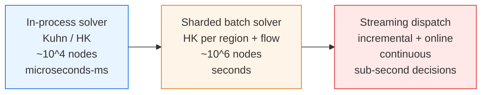
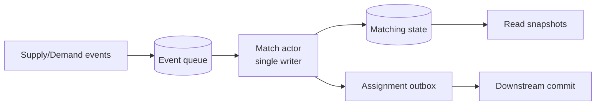

# Bipartite Matching — Senior Level

> At senior scale the question is no longer "how do I find an augmenting path" but "how do I run a matching engine that re-solves assignments thousands of times per second, stays correct under churn, recovers the dual certificate for billing, and degrades gracefully when the graph no longer fits in one process."

## Table of Contents
1. [Introduction](#1-introduction)
2. [System Design: Assignment & Scheduling Engines](#2-system-design-assignment--scheduling-engines)
3. [Distributed & Large-Scale Matching](#3-distributed--large-scale-matching)
4. [Concurrency](#4-concurrency)
5. [Scale Comparison](#5-scale-comparison)
6. [Architecture Patterns](#6-architecture-patterns)
7. [Code: Incremental & CSR Matching](#7-code-incremental--csr-matching)
8. [Observability](#8-observability)
9. [Failure Modes](#9-failure-modes)
10. [Capacity Planning](#10-capacity-planning)
11. [Summary](#11-summary)

---

## 1. Introduction

Bipartite matching is the algorithmic core of a surprising number of production systems: ride-hailing dispatch (drivers ↔ riders), ad serving (impressions ↔ campaigns), logistics (orders ↔ couriers), cloud scheduling (pods ↔ nodes), and content moderation queues (items ↔ reviewers). In all of these, the matching is not computed once — it is recomputed continuously as supply and demand churn.

That changes the engineering problem. A textbook `O(E√V)` Hopcroft-Karp run is a *batch* solver. A dispatch system needs:

1. **Latency budgets** — a match decision in tens of milliseconds, not seconds.
2. **Incrementality** — when one driver appears, you should not recompute from scratch.
3. **Weighted objectives** — minimize total rider wait, not just maximize pair count (Hungarian / min-cost flow, sibling `18-min-cost-max-flow`).
4. **Fairness & constraints** — geographic caps, surge zones, anti-starvation.
5. **Durability & auditability** — who was matched to whom, and the *dual certificate* (vertex cover / dual prices) for explainability and billing.

This document treats matching as a *service*, not a function.

A note on terminology used throughout: by "the matcher" we mean the in-memory data structure holding `matchL`/`matchR` and the augmenting-path routine; by "the engine" we mean the surrounding actor, queues, persistence, and re-solve scheduler. Most of the hard engineering lives in the engine; the matcher itself is a small, well-understood `O(E√V)` core. Confusing the two — for example, trying to scale the engine by swapping Kuhn for Hopcroft-Karp — is a classic misdiagnosis addressed in §2.2.1.

---

## 2. System Design: Assignment & Scheduling Engines

### 2.1 Three tiers of matching engine



| Tier | When right | When wrong |
|------|-----------|------------|
| In-process Kuhn/HK | One region, periodic re-solve, small graph. | Global graph too big; need sub-second online decisions. |
| Sharded batch (HK or min-cost flow per shard) | Naturally partitionable (geography, category), re-solved every few seconds. | Cross-shard matches are common and valuable. |
| Streaming/online dispatch | Continuous arrival, hard latency SLA, incremental updates. | You actually need the global optimum each tick, not a greedy online choice. |

### 2.2 Batch vs online matching

The classic algorithms assume the **whole graph is known**. Dispatch is **online**: requests arrive over time and you must commit before seeing the future. Online bipartite matching has its own theory — the **RANKING** algorithm achieves a `1 − 1/e ≈ 0.632` competitive ratio for unweighted online matching, and weighted variants underpin ad allocation (the AdWords problem). Senior engineers must know *which regime they are in*: re-solving a batch each tick is simpler and often good enough; true online algorithms matter only when you cannot afford to wait or revise.

#### 2.2.1 The "matcher is not the bottleneck" principle

A recurring senior insight: in a dispatch system the matching algorithm is rarely the slowest component. The time is dominated by *building the graph* (geo-queries to find eligible pairs, computing ETAs/costs), by *I/O* (reading supply/demand state, writing assignments), and by *serialization*. The `O(E√V)` solve on a regional graph is microseconds-to-milliseconds; the geo-index lookup that produces the edges can be 10× that. Optimize edge construction, candidate pruning (cap each driver to its `k` nearest riders), and I/O batching *before* touching the matching core. Replacing Kuhn with Hopcroft-Karp helps only once the matcher genuinely dominates a profile — measure first.

## 2.3 Cardinality vs weighted — the design fork

- **Cardinality** (Kuhn/HK): "match as many as possible." Use when all pairs are equally good.
- **Weighted / assignment** (Hungarian `O(V³)`, or min-cost max-flow): "minimize total cost / maximize total value." Use when pairs have costs (ETA, price, affinity). This is almost always what production *actually* wants; cardinality is the simplified first version that gets replaced.

A common architecture: cardinality first to check feasibility (does a full assignment exist? — Hall), then weighted to optimize among feasible assignments.

---

## 3. Distributed & Large-Scale Matching

### 3.1 Sharding the graph

If the bipartite graph partitions naturally (e.g. drivers and riders by H3 geo-cell), solve each shard independently and in parallel. Correctness caveat: **cross-shard edges are dropped**, so you get a *locally* optimal matching, not global. Mitigations:

- **Halo / overlap zones**: include border vertices in adjacent shards and reconcile.
- **Two-phase**: solve shards, then run a small global pass over the *residual* unmatched vertices and cross-shard edges only.

### 3.2 Streaming updates with augmenting paths

A maximum matching is *stable under additions in a useful way*: adding one new left vertex can increase the matching by **at most one**, found by a single augmenting-path search from that vertex — `O(E)` — without recomputing. Deletions are harder: removing a matched edge frees two vertices and may require re-augmentation. This asymmetry (cheap insert, expensive delete) drives the design of incremental dispatch loops (code in §7).

### 3.3 Flow-based at scale

For weighted and capacitated matching, model as min-cost max-flow and run a distributed flow solver or a specialized LP. At very large scale (billions of edges, ad allocation), production systems use **distributed LP / dual-decomposition** rather than combinatorial matching — they relax to fractional solutions and round. The combinatorial algorithms remain the correctness reference and the small-shard workhorse.

---

## 4. Concurrency

A matching engine is fundamentally **mutating shared state** (`matchL`, `matchR`). Concurrency strategies:

- **Single-writer actor.** Serialize all mutations through one goroutine/thread; producers send "add/remove vertex" messages. Simplest, correct, and usually fast enough — augmenting-path work is cheap.
- **Read-copy snapshots.** Readers (dashboards, "who is matched" queries) read an immutable snapshot while the writer builds the next one. No locks on the read path.
- **Per-shard locks.** Each geo-shard has its own solver and mutex; cross-shard reconciliation takes both in a fixed order to avoid deadlock.
- **Parallel phase DFS (Hopcroft-Karp).** The DFS phase can be parallelized across free left vertices, but the disjointness requirement means you need atomic claims on right vertices (`compareAndSwap` on `matchR[v]`). Speedups are modest because of contention on popular right vertices.

Pitfall: the augmenting-path DFS reads and writes `matchR` along the whole path. If two threads augment overlapping paths concurrently you can corrupt the matching (two left vertices claim one right). The actor model sidesteps this entirely; prefer it unless profiling proves you need parallelism.

---

## 4.5 Why the Naive Parallel DFS Corrupts the Matching

It is worth showing the concrete failure, because engineers reach for parallelism reflexively. Suppose two worker threads run `tryKuhn` for free left vertices `A` and `B` concurrently, and both want right vertex `r` currently owned by `C`:

```
Thread 1 (for A):  reads matchR[r] = C   ... recurses to relocate C ...
Thread 2 (for B):  reads matchR[r] = C   ... recurses to relocate C ...
Thread 1: relocates C to r2, writes matchR[r] = A
Thread 2: relocates C to r3 (stale view!), writes matchR[r] = B
Result: matchR[r] = B, but A also believes it owns r; C now double-relocated.
```

The invariant "each right vertex has exactly one owner" is broken, and the matching count is overstated. The augmenting DFS is **not** a read-only traversal — it rewrites `matchR` along the entire path, so two overlapping paths conflict. Safe options:

- **Single-writer actor** (default): zero contention bugs, and since each augment is microseconds, throughput is rarely the bottleneck.
- **CAS-claim on right vertices**: each thread `compareAndSwap(matchR[v], expectedOwner, self)` before recursing; on failure it retries or backtracks. Correct but the contention on popular `v` erodes speedup.
- **Phase-parallel Hopcroft-Karp** with per-vertex atomic `dist` claims: more structured, but the BFS phase is inherently sequential-ish and the speedup is sublinear.

Rule: parallelize only after profiling proves the matcher (not the I/O around it) is the bottleneck — which it almost never is.

---

## 5. Scale Comparison

| Scale (per side) | Edges | Recommended | Latency (single solve) |
|------------------|-------|-------------|------------------------|
| ≤ 10³ | ≤ 10⁵ | Kuhn, re-solve each tick | < 1 ms |
| 10³–10⁴ | ≤ 10⁶ | Hopcroft-Karp | 1–50 ms |
| 10⁴–10⁶ | ≤ 10⁷ | HK + greedy pre-match, or Dinic flow | 50 ms–seconds |
| > 10⁶ | > 10⁷ | Shard + parallel HK; or distributed LP for weighted | seconds, batched |
| Continuous arrival | — | Incremental augmenting + periodic full re-solve | per-event O(E) |

The incremental insert (one augmenting path) is what keeps a streaming dispatcher within budget; the periodic full re-solve repairs drift from deletions.

---

## 5.5 Choosing the Re-Solve Strategy

The latency table above hides a strategic choice: *full re-solve* vs *incremental maintenance* vs *online commit*. These are not interchangeable; each suits a different SLA shape.

| Strategy | How | Latency profile | Optimality | Use when |
|----------|-----|-----------------|------------|----------|
| Full batch re-solve each tick | Run HK / min-cost flow from scratch | Periodic spikes | Global optimum each tick | Graph small, tick infrequent, no warm start |
| Warm-started re-solve | Keep prev matching, augment the diff | Smooth, low | Global optimum, cheaply | Most production systems |
| Pure incremental | Only `TryAugment` on inserts, never re-solve | Flat, lowest | Drifts below optimum on deletes | Insert-dominated, deletes rare |
| Online commit | Irrevocable decision per arrival | Per-event, hard real-time | `1−1/e` competitive | Cannot wait or revise |

The dominant production pattern is the **warm-started re-solve**: incremental `TryAugment` keeps the matching near-optimal between ticks, and a periodic warm-started full solve erases the drift introduced by deletions. Pure incremental is tempting for its flat latency but slowly degrades; pure batch wastes CPU recomputing unchanged assignments. Online commit is reserved for systems where revising a past match is impossible (e.g. a physical door that already opened).

---

## 6. Architecture Patterns

### 6.1 Solver behind a queue



- Events (driver online, rider request, cancellation) land on a queue.
- A single match actor applies each event: insert → one augmenting search; delete → free + re-augment; timer → full re-solve.
- Assignments emit to an **outbox** for transactional dispatch (avoids double-assignment on crash).

The outbox plus snapshot pattern together give the engine its two production guarantees: **exactly-once dispatch** (outbox) and **lock-free, consistent reads** (snapshot). Neither touches the matching algorithm itself — they are properties of the engine wrapping it.

### 6.2 Explainability via the dual

König's vertex cover (cardinality) and the Hungarian *dual prices* (weighted) are first-class outputs, not debug artifacts. The dual answers "why was this rider not matched?" — it identifies the **bottleneck set** (Hall deficiency). Store and expose it.

### 6.2.5 Snapshot reads for query traffic

Dashboards, "where is my driver," and analytics all *read* the matching while the actor mutates it. Taking the actor's lock for every read would serialize the hot path. Instead, the actor periodically publishes an **immutable snapshot** (a copy of `matchL`/`matchR` plus a version stamp) into an atomic reference; readers dereference it lock-free. Writers never block on readers and readers never see a half-applied augmentation. The snapshot cadence (e.g. every 100 ms) trades read staleness for copy cost — cheap at `O(V)` per snapshot for a regional graph.

### 6.3 Feasibility gate

Before optimizing weights, run a cheap cardinality matching and check Hall's condition. If a required assignment is infeasible, surface the deficient set early instead of returning a low-value weighted solution silently.

---

## 7. Code: Incremental & CSR Matching

A CSR (compressed sparse row) adjacency layout plus a **timestamp `visited` trick** (no per-vertex array reset) is the production-grade Kuhn core. It also exposes `TryAugment(u)` for incremental inserts.

```go
package main

import "fmt"

// CSR bipartite matcher with timestamp-based visited and incremental augment.
type Matcher struct {
	nL, nR  int
	head    []int // CSR row pointers, len nL+1
	dst     []int // CSR column targets
	matchR  []int // right v -> left, or -1
	matchL  []int // left u -> right, or -1
	seen    []int // timestamp per right vertex
	stamp   int
}

func NewMatcher(nL, nR int, edges [][2]int) *Matcher {
	deg := make([]int, nL+1)
	for _, e := range edges {
		deg[e[0]+1]++
	}
	for i := 1; i <= nL; i++ {
		deg[i] += deg[i-1]
	}
	head := deg
	dst := make([]int, len(edges))
	pos := append([]int(nil), head...)
	for _, e := range edges {
		dst[pos[e[0]]] = e[1]
		pos[e[0]]++
	}
	m := &Matcher{nL: nL, nR: nR, head: head, dst: dst}
	m.matchR = make([]int, nR)
	m.matchL = make([]int, nL)
	for i := range m.matchR {
		m.matchR[i] = -1
	}
	for i := range m.matchL {
		m.matchL[i] = -1
	}
	m.seen = make([]int, nR)
	return m
}

func (m *Matcher) augment(u int) bool {
	for i := m.head[u]; i < m.head[u+1]; i++ {
		v := m.dst[i]
		if m.seen[v] != m.stamp {
			m.seen[v] = m.stamp
			if m.matchR[v] == -1 || m.augment(m.matchR[v]) {
				m.matchR[v] = u
				m.matchL[u] = v
				return true
			}
		}
	}
	return false
}

// TryAugment performs one incremental augmenting search for a newly-active left u.
func (m *Matcher) TryAugment(u int) bool {
	m.stamp++
	return m.augment(u)
}

func (m *Matcher) Solve() int {
	count := 0
	for u := 0; u < m.nL; u++ {
		if m.matchL[u] == -1 && m.TryAugment(u) {
			count++
		}
	}
	return count
}

func main() {
	edges := [][2]int{{0, 0}, {0, 1}, {1, 0}, {2, 1}, {2, 2}}
	m := NewMatcher(3, 3, edges)
	fmt.Println("Initial matching:", m.Solve()) // 3
}
```

```java
import java.util.*;

// CSR matcher with timestamp visited + incremental TryAugment.
public class Matcher {
    private final int nL, nR;
    private final int[] head, dst, matchR, matchL, seen;
    private int stamp = 0;

    public Matcher(int nL, int nR, int[][] edges) {
        this.nL = nL; this.nR = nR;
        head = new int[nL + 1];
        for (int[] e : edges) head[e[0] + 1]++;
        for (int i = 1; i <= nL; i++) head[i] += head[i - 1];
        dst = new int[edges.length];
        int[] pos = head.clone();
        for (int[] e : edges) dst[pos[e[0]]++] = e[1];
        matchR = new int[nR]; Arrays.fill(matchR, -1);
        matchL = new int[nL]; Arrays.fill(matchL, -1);
        seen = new int[nR];
    }

    private boolean augment(int u) {
        for (int i = head[u]; i < head[u + 1]; i++) {
            int v = dst[i];
            if (seen[v] != stamp) {
                seen[v] = stamp;
                if (matchR[v] == -1 || augment(matchR[v])) {
                    matchR[v] = u; matchL[u] = v;
                    return true;
                }
            }
        }
        return false;
    }

    public boolean tryAugment(int u) { stamp++; return augment(u); }

    public int solve() {
        int count = 0;
        for (int u = 0; u < nL; u++)
            if (matchL[u] == -1 && tryAugment(u)) count++;
        return count;
    }

    public static void main(String[] args) {
        int[][] edges = {{0,0},{0,1},{1,0},{2,1},{2,2}};
        Matcher m = new Matcher(3, 3, edges);
        System.out.println("Initial matching: " + m.solve()); // 3
    }
}
```

```python
import sys

class Matcher:
    """CSR matcher with timestamp visited and incremental try_augment."""
    def __init__(self, n_left, n_right, edges):
        self.n_left = n_left
        self.n_right = n_right
        self.head = [0] * (n_left + 1)
        for u, _ in edges:
            self.head[u + 1] += 1
        for i in range(1, n_left + 1):
            self.head[i] += self.head[i - 1]
        self.dst = [0] * len(edges)
        pos = self.head[:]
        for u, v in edges:
            self.dst[pos[u]] = v
            pos[u] += 1
        self.match_r = [-1] * n_right
        self.match_l = [-1] * n_left
        self.seen = [0] * n_right
        self.stamp = 0

    def _augment(self, u):
        for i in range(self.head[u], self.head[u + 1]):
            v = self.dst[i]
            if self.seen[v] != self.stamp:
                self.seen[v] = self.stamp
                if self.match_r[v] == -1 or self._augment(self.match_r[v]):
                    self.match_r[v] = u
                    self.match_l[u] = v
                    return True
        return False

    def try_augment(self, u):
        self.stamp += 1
        return self._augment(u)

    def solve(self):
        count = 0
        for u in range(self.n_left):
            if self.match_l[u] == -1 and self.try_augment(u):
                count += 1
        return count

if __name__ == "__main__":
    sys.setrecursionlimit(10**6)
    edges = [(0, 0), (0, 1), (1, 0), (2, 1), (2, 2)]
    m = Matcher(3, 3, edges)
    print("Initial matching:", m.solve())  # 3
```

The `stamp` increments instead of zeroing `seen[]`, turning the per-vertex reset from `O(nR)` into `O(1)` — essential when re-augmenting thousands of times per second.

---

## 7.5 A Concrete Dispatch Loop

To make the incremental model concrete, here is the control flow of a single-writer dispatch actor handling three event types. This is pseudocode over the `Matcher` above; in production each branch is a message handler.

```text
loop forever:
    ev := queue.take()
    switch ev.type:

    case DRIVER_ONLINE(d):                 # new left vertex appears
        addLeftVertex(d)                   # extend CSR / adjacency
        for each nearby rider r within ETA threshold:
            addEdge(d, r)
        if matcher.TryAugment(d):          # one augmenting search, O(E)
            emitAssignment(matcher.matchL[d])  # to transactional outbox
        metrics.augmentLatency.observe(...)

    case RIDER_REQUEST(r):                 # new right vertex appears
        addRightVertex(r)
        for each nearby free driver d:
            addEdge(d, r)
            if matcher.TryAugment(d):       # try to satisfy immediately
                emitAssignment((d, r)); break
        startStarvationTimer(r)

    case CANCEL(d, r):                      # deletion — the hard case
        freeMatch(d, r)                     # frees both endpoints
        # re-augment the freed driver against still-waiting riders
        if matcher.TryAugment(d):
            emitAssignment(matcher.matchL[d])
        markDrift()                         # accumulate; triggers re-solve

    case TICK:                              # periodic full re-solve
        if drift > driftThreshold:
            snapshot := matcher.warmStartClone()
            full := snapshot.SolveWeighted(currentCosts())  # min-cost flow
            commitDiff(matcher, full)        # apply only changed assignments
            drift = 0
```

Three design facts drive this loop:

1. **Inserts are cheap** — one `TryAugment` (`O(E)`), no full re-solve. This is what keeps p99 within budget under steady arrival.
2. **Cancels create drift** — freeing a matched pair can lower the matching and leave a better global assignment undiscovered; a single re-augment is a local patch, not a global fix.
3. **The TICK re-solve is weighted** — it re-optimizes total ETA (min-cost flow, sibling `18-min-cost-max-flow`), warm-started from the current matching so it only computes the delta. The cardinality `TryAugment` is the fast online path; the weighted re-solve is the slow correctness path.

### 7.6 Anti-starvation as edge reweighting

A rider waiting many ticks should win ties. In the cardinality model there are no weights, so starvation is handled at the *weighted* layer: bias each edge cost by `cost = baseETA − α · waitTime`. As `waitTime` grows the effective cost drops, and the min-cost re-solve eventually prefers that rider. The `startStarvationTimer` above feeds this `waitTime`. This is the cleanest place to encode fairness — never by mutating the cardinality matcher.

### 7.7 Transactional outbox — avoiding double-assignment

`emitAssignment` must not directly call the dispatch RPC, because a crash between "update `matchR`" and "send RPC" would either lose the assignment or (on replay) double-assign a driver. Instead the actor writes the assignment to an **outbox table in the same transaction** as the state mutation; a separate relay publishes from the outbox with idempotency keys. This guarantees each matched pair is dispatched **exactly once** even across crashes — the standard outbox pattern applied to a matching engine.

---

## 8. Observability

Instrument the engine, not just the algorithm:

- **Matching ratio** — `|M| / min(|L|,|R|)`. A drop signals supply/demand imbalance or a bug.
- **Unmatched-vertex age histogram** — detects *starvation* (a rider waiting many ticks). Anti-starvation often means biasing weights by wait time.
- **Augmentations per tick** and **average augmenting-path length** — long paths mean the graph is tight (near Hall's bound); spikes precede latency regressions.
- **Phase count (Hopcroft-Karp)** — should stay far below `√V`; a creeping count indicates degeneracy.
- **Solve latency p50/p95/p99** against the budget.
- **Dual certificate size** (vertex cover / deficiency) — exported for explainability and capacity alerts.
- **Re-solve vs incremental ratio** — too many full re-solves means deletions dominate; consider a better incremental delete path.

Emit the bottleneck (deficient) set as a structured event so on-call can see *which* supply is short.

---

### 8.1 A worked alert

Suppose the dashboard fires: "matching ratio dropped from 0.96 to 0.71 in region X over 5 minutes." The dual makes the diagnosis mechanical. Export the Hall-deficient set `S`: it turns out to be a cluster of riders in a new surge zone with only two eligible drivers. The deficiency `|S| − |N(S)|` quantifies *exactly* how many riders cannot be served no matter the algorithm — it is a supply problem, not a code problem. The on-call response is to widen the ETA threshold (adding edges) or reposition supply, not to debug the matcher. Without the dual, the same alert would trigger a fruitless hunt for a "bug" in correct code. This is why exporting the bottleneck set as a first-class signal pays for itself.

---

## 9. Failure Modes

| Failure | Symptom | Mitigation |
|---------|---------|-----------|
| Non-bipartite input slips in | Plausible but wrong matching | Validate 2-coloring at ingest; reject odd cycles |
| Stale `visited`/`seen` | Undercount, intermittent | Timestamp trick + unit invariant `|M| ≤ min(|L|,|R|)` |
| Concurrent augmentation race | Two lefts on one right | Single-writer actor or CAS claims |
| Deletion drift | Matching stays suboptimal | Periodic full re-solve; track drift metric |
| Recursion stack overflow | Crash on long chains | Iterative DFS / raise limit / cap path length |
| Cross-shard value lost | Lower global matching | Halo zones + residual global pass |
| Weighted vs cardinality mismatch | Optimizes wrong objective | Make objective explicit in config; assert in tests |
| Thundering re-solve on deploy | Latency spike | Warm start from previous matching, augment only the diff |

Warm-starting is the most valuable trick: keep the previous `matchR`, drop now-invalid edges, and only re-augment affected vertices.

---

## 10. Capacity Planning

- **Memory.** Adjacency `O(V+E)`; CSR uses `4·(V+E)` bytes for int32 indices. At `V=10⁶`, `E=10⁷` that is ~44 MB — trivial; the cost matrix for weighted Hungarian (`O(V²)`) is the real memory risk (`V=10⁴` → 400 MB for int32).
- **CPU.** Budget `O(E√V)` per full solve. At `E=10⁷`, `V=10⁴` → ~10⁹ edge touches → ~1–5 s single-thread; shard to hit sub-second.
- **Throughput (incremental).** One insert ≈ one augmenting path ≈ `O(E)` worst case but typically `O(avg path · avg degree)`. Profile real path lengths; they are usually short.
- **Re-solve cadence.** Tune so drift from deletions never exceeds, say, 2% below optimum between full re-solves.
- **Headroom.** Keep solve p99 under ~50% of budget; augmenting-path cost is bursty under tight graphs (near Hall's bound), so plan for the worst-case dense tick.

---

## 10.5 Worked Capacity Example — Regional Ride Dispatch

Concrete numbers make the planning rules actionable. Suppose one region has:

- Peak supply: 8,000 active drivers (`|L|`), 12,000 open requests (`|R|`).
- Each driver is eligible for riders within a 4-minute ETA: average degree ≈ 30, so `E ≈ 8000 × 30 = 240,000`.
- Re-solve cadence: every 2 seconds; incremental inserts between ticks.

**Per-tick weighted re-solve (min-cost flow).** Warm-started, it only repairs the delta since the last tick. A cold solve at `E√V ≈ 240,000 × √20,000 ≈ 240,000 × 141 ≈ 3.4×10⁷` edge touches → low tens of milliseconds single-thread. Warm-started, typically 5–10× less. Comfortably inside the 2-second budget with huge headroom — confirming a *single region needs no sharding*.

**Incremental insert cost.** One `TryAugment` touches at most `E` edges but in practice walks an augmenting path of length ~5–9 with degree ~30 → a few hundred operations, microseconds. At 500 driver-online events/sec that is < 1 ms/sec of CPU — negligible.

**When does this region need sharding?** Only if `E√V` per cold re-solve approaches the budget. That happens around `|L| ≈ 10⁵`, `E ≈ 3×10⁶` → `~5×10⁹` touches → seconds. A single mega-city at rush hour can hit this; the fix is geo-sharding by H3 cell with halo zones, as in §3.1, *not* a faster algorithm.

**Memory.** CSR adjacency at `E = 2.4×10⁵` int32 ≈ 1 MB; `matchL/matchR/seen` at `V = 2×10⁴` ≈ 240 KB. Trivial. The weighted layer's cost data (`E` floats) is also ~1 MB. The whole engine fits in L2/L3 for a mid-size region, which is why latencies are so low.

The takeaway for capacity reviews: **the cardinality matcher is essentially free; budget is dominated by the periodic weighted re-solve, and that only needs sharding at metropolitan scale.**

**Burst headroom.** The augmenting-path cost is bursty: when the graph is *tight* (near Hall's bound, demand ≈ supply), augmenting paths grow long and a single insert can touch a large fraction of `E`. Size the CPU budget for this worst case, not the average. A practical rule: provision so that even a tick where the matching is at 95% saturation (longest paths) stays under 50% of the latency budget. Saturation is exactly when the business cares most (peak demand), so the worst algorithmic case coincides with the worst load case — plan for the intersection, not the means.

---

## 11. Summary

- Production matching is a **service**: incremental inserts (one augmenting path), periodic full re-solves, weighted objectives, and a dual certificate for explainability.
- **Cardinality vs weighted** is the core design fork; weighted (Hungarian / min-cost flow, sibling `18`) is usually what the business wants.
- **Shard** naturally-partitionable graphs, reconcile cross-shard residuals, and use the **timestamp `visited` + CSR** core for speed.
- Prefer a **single-writer actor** for correctness; parallelize DFS only when profiling demands it and use CAS claims on right vertices.
- Observe matching ratio, starvation age, augmenting-path length, and phase count; alert on the **Hall-deficient bottleneck set**.
- **Warm-start** across re-solves to avoid latency spikes; validate bipartiteness at ingest to avoid silent wrong answers.
- The **matcher is rarely the bottleneck** — edge construction, geo-queries, and I/O dominate; profile before swapping algorithms.
- Choose the **re-solve strategy** (warm-started full solve for most systems; pure incremental only when deletes are rare; online commit only when revision is impossible) to fit the SLA shape, and encode **fairness/anti-starvation at the weighted layer**, never by mutating the cardinality matcher.
