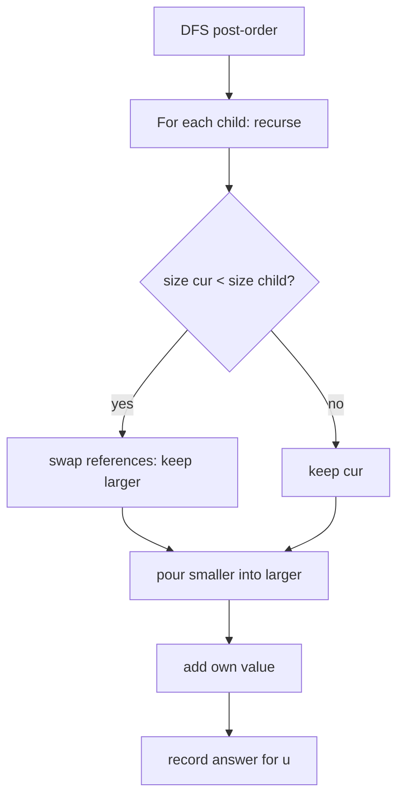

# Small-to-Large Merging — Junior Level

> **One-line summary:** When you repeatedly merge two collections, *always merge the smaller one into the larger one*. This single rule turns a naive `O(N²)` algorithm into `O(N log N)` (or `O(N log² N)` with an ordered map), because every element can only be moved into a container that is at least twice as big — and that can happen at most `log₂ N` times.

---

## Table of Contents

1. [Introduction](#introduction)
2. [Prerequisites](#prerequisites)
3. [Glossary](#glossary)
4. [Core Concepts](#core-concepts)
5. [Big-O Summary](#big-o-summary)
6. [Real-World Analogies](#real-world-analogies)
7. [Pros & Cons](#pros--cons)
8. [Step-by-Step Walkthrough](#step-by-step-walkthrough)
9. [Code Examples](#code-examples)
10. [Coding Patterns](#coding-patterns)
11. [Error Handling](#error-handling)
12. [Performance Tips](#performance-tips)
13. [Best Practices](#best-practices)
14. [Edge Cases & Pitfalls](#edge-cases--pitfalls)
15. [Common Mistakes](#common-mistakes)
16. [Cheat Sheet](#cheat-sheet)
17. [Visual Animation](#visual-animation)
18. [Summary](#summary)
19. [Further Reading](#further-reading)

---

## Introduction

Imagine you have a rooted tree and every node carries a *color*. For each node you want to know: **how many distinct colors appear in the subtree rooted at that node?** A natural idea is, for every node, to collect the colors of all its children's subtrees into one set, and report the set's size.

The obvious way to "collect" is: take the set you built for the first child, then *add* the second child's set into it, then the third, and so on. The question is — into which set do you pour the other one?

If you always pour child A into child B regardless of size, you can be unlucky: a long chain of nodes where each step copies a huge set into a tiny one. That is `O(N²)` in the worst case — far too slow for `N = 200,000`.

The fix is almost insultingly simple. **Always pour the smaller set into the larger one.** That's it. This is called **small-to-large merging** (also known as **set-merging**, the **"sack" technique**, or — in its optimized tree form — **DSU on tree**). The genius is not in the code; it is in the *amortized argument*: an element that lives in a set of size `s` can only be physically moved when it lands in a set of size `≥ 2s`. Since a set can hold at most `N` elements, each element is moved at most `log₂ N` times across the entire algorithm. Multiply by `N` elements and you get `O(N log N)` total moves.

This technique shows up everywhere subtree information must be aggregated offline: counting distinct values, finding the most frequent value, summing over pairs, answering "how many nodes in my subtree have property X." Its close relatives in this graph section are **14-heavy-light-decomposition** and **15-centroid-decomposition**, which attack tree queries from different angles. Small-to-large is usually the *first* tool to reach for because it requires the least machinery.

---

## Prerequisites

Before reading this file you should be comfortable with:

- **Rooted trees** — parent/child relationships, what a "subtree" is, and how to root an undirected tree by a DFS.
- **Depth-first search (DFS)** — recursive traversal of a tree; the idea that a node's work happens *after* its children's work (post-order).
- **Sets and hash maps** — `set` / `HashSet` for membership, `map` / `HashMap` for counting. You should know that inserting one element is `O(1)` average.
- **Big-O notation** — what `O(N)`, `O(N log N)`, and `O(N²)` mean in practice.
- **Amortized cost (intuition only)** — the idea that an expensive operation can be "charged" to many cheap ones so the average stays low.

Optional but helpful:

- Familiarity with **Union-Find / DSU** — the name "DSU on tree" borrows the *small-to-large union by size* trick.
- Having seen a **subtree-query problem** before (e.g., "sum of a subtree").

---

## Glossary

| Term | Meaning |
|------|---------|
| **Small-to-large merging** | The rule: when combining two collections, move elements out of the smaller and into the larger. |
| **Set merging** | A synonym; emphasises that we are merging sets/maps, not arrays. |
| **Sack** | Informal name (popularised by competitive programming) for the DSU-on-tree technique. |
| **DSU on tree** | The optimized form for offline subtree queries: keep the *heavy child's* container, re-add the light children. `O(N log N)`. |
| **Subtree** | A node together with all of its descendants. |
| **Subtree query** | A question answered for every node about its own subtree (distinct count, most frequent value, etc.). |
| **Heavy child** | The child whose subtree has the most nodes; the others are *light children*. |
| **Amortized cost** | Average cost per operation over a worst-case sequence, even if a single operation is expensive. |
| **Move / element move** | Physically transferring one element from one container into another (the unit we count). |
| **Offline** | All queries are known in advance, so we may reorder the work; contrasts with *online*. |

---

## Core Concepts

### 1. The naive merge and why it is slow

Suppose during a DFS we return, for each node, a `set` of the colors in its subtree. At a node with children `c1, c2, …`, we build the answer by merging the children's sets. The simplest code is:

```
result = childSet[c1]
for each other child c:
    for each x in childSet[c]:
        result.add(x)
```

If `result` happens to be tiny and a child set is huge, we copy the huge set element by element into the tiny one. A "bamboo" tree (a single path of `N` nodes), each carrying a unique color, makes this `1 + 2 + 3 + … + N = O(N²)`.

### 2. The one rule: smaller into larger

Change exactly one thing: before merging set `A` into set `B`, compare their sizes. If `A` is bigger, **swap the references** so we always merge the smaller into the larger:

```
if size(A) < size(B):  swap(A, B)   // now A is the larger
for each x in B:                     // iterate over the SMALLER
    A.add(x)
B = A                                // A is the merged result
```

We never copy more than the smaller set's worth of elements per merge.

### 3. Why each element moves only O(log N) times

Here is the heart of the technique. Focus on a single element `x`. Every time `x` is *moved*, it is because it was in the smaller set, which then got poured into a set at least as large. So after the move, `x` lives in a container whose size is **at least double** the size of the container it came from (smaller + larger ≥ 2 × smaller).

An element can double its container size at most `log₂ N` times before the container reaches size `N`. Therefore `x` is moved at most `log₂ N` times. Sum over all `N` elements:

```
total moves ≤ N · log₂ N = O(N log N)
```

Each move costs `O(1)` for a hash set, or `O(log N)` for an ordered map — giving `O(N log N)` or `O(N log² N)` overall.

### 4. From naive small-to-large to DSU on tree

The naive small-to-large keeps a separate container per node and merges children up. The **DSU-on-tree** (sack) refinement is a constant-factor and asymptotic improvement: instead of merging the heavy child's data into the parent, we *reuse it in place* — we never destroy the heavy child's container. We only re-add the *light* children. This gives a clean `O(N log N)` (each node is re-added once per light edge above it, and there are `O(log N)` light edges on any root-to-node path). The middle file develops this fully; for junior level, focus on the merging rule itself.

---

## Big-O Summary

| Operation / Setting | Time | Space | Notes |
|---------------------|------|-------|-------|
| Naive merge (smaller-or-larger arbitrarily) | **O(N²)** | O(N) | A bamboo tree triggers the worst case. |
| Small-to-large with hash set/map | **O(N log N)** | O(N) | Each element moved `≤ log N` times; `O(1)` per move. |
| Small-to-large with ordered map (`std::map`, `TreeMap`) | **O(N log² N)** | O(N) | The extra `log` is the per-insert cost of the ordered structure. |
| DSU on tree (sack, keep heavy child) | **O(N log N)** | O(N) | Light children re-added once per light edge; `O(log N)` light edges per path. |
| Answering one subtree query | **O(1)** amortized | — | After the merge for that node completes. |

---

## Real-World Analogies

| Concept | Analogy |
|---------|---------|
| Smaller into larger | Pouring water between two cups: always pour the *less full* cup into the *fuller* one. Fewer drops move, and the fuller cup never overflows the smaller. |
| Doubling argument | A coin that can only be moved to a jar at least twice as big. Starting from a 1-coin jar, it reaches the `N`-coin jar in at most `log₂ N` hops. |
| Keeping the heavy child | A moving company that, when combining two storage units, never empties the *bigger* unit — they only carry boxes from the smaller unit across. |
| Merging up a tree | A corporate org chart where each manager's report rolls up the headcount of their reports; you combine the small teams into the big team, not the reverse. |
| Light vs heavy edges | On a hike, you take the well-trodden "heavy" trail for free and only pay extra effort on the rarely-used "light" side-trails. |

Where the analogy breaks: water and coins are interchangeable, but in set-merging duplicates matter — adding a color already present does not grow the set, yet you still "touch" it once. We count *touches*, which is what the `O(log N)` bound covers.

---

## Pros & Cons

| Pros | Cons |
|------|------|
| Trivial to implement: one size check + a swap. | Offline only in its cleanest form (DSU on tree); needs all queries up front. |
| `O(N log N)` from a one-line change to naive code. | Holds large containers in memory — peak memory can be `O(N)` for the root. |
| Works with *any* mergeable summary (sets, maps, counts, even custom monoids). | Easy to break by copying instead of swapping references. |
| No heavy precomputation (unlike HLD or segment trees on Euler tours). | Constant factor of hash maps can be worse than an array-based Euler-tour approach. |
| Generalises to union-find–style merges and persistent structures. | The `O(N log² N)` ordered-map variant can TLE where `O(N log N)` is required. |

**When to use:** offline subtree aggregation — distinct counts, most-frequent value, sum over subtree, "number of pairs with property X in subtree," grouping elements by an evolving equivalence relation.

**When NOT to use:** online subtree updates and queries (use Euler tour + segment/Fenwick tree, or **14-heavy-light-decomposition**); path queries (HLD); divide-and-conquer over paths (**15-centroid-decomposition**).

---

## Step-by-Step Walkthrough

Consider this small rooted tree. Each node has a color in parentheses.

```
            1 (red)
           /        \
        2 (blue)    3 (red)
        /    \          \
   4 (red) 5 (blue)   6 (green)
```

We want the number of **distinct colors** in each subtree. We DFS in post-order and merge child sets smaller-into-larger. We track a global **move counter** (how many element insertions we perform).

```
Leaves first:
  node 4: {red}           size 1   distinct = 1
  node 5: {blue}          size 1   distinct = 1
  node 6: {green}         size 1   distinct = 1

node 2 (blue): merge children 4 and 5, then add own color
  start with set of child 4 = {red}     (larger so far)
  merge child 5 = {blue} into it  -> move 'blue'   (1 move)
  add own 'blue' -> already present (still 1 touch, but set unchanged)
  node 2 set = {red, blue}        distinct = 2

node 3 (red): one child 6, then add own color
  start with child 6 = {green}
  add own 'red' -> move 'red'     (1 move)  ... or add to the set
  node 3 set = {green, red}       distinct = 2

node 1 (red): merge children 2 and 3, then add own color
  child 2 set = {red, blue}  size 2  (larger)
  child 3 set = {green, red} size 2
  sizes equal -> pour child 3 into child 2
     'green' -> move  (1 move)
     'red'   -> already present
  add own 'red' -> already present
  node 1 set = {red, blue, green}  distinct = 3
```

Final answers: node 1 → 3, node 2 → 2, node 3 → 2, nodes 4,5,6 → 1.

Notice we never poured a big set into a small one. The total number of element moves stayed small — far below the `O(N²)` a careless merge could produce.

### Counting the moves

Let us tally every *element move* (insertion into the surviving set) in the walkthrough:

| Merge step | Smaller set | Moves added | Running total |
|------------|-------------|-------------|---------------|
| node 2: merge child 5 `{blue}` into child 4 `{red}` | `{blue}` (size 1) | 1 | 1 |
| node 3: add own `red` to child 6 `{green}` | `{red}` (size 1) | 1 | 2 |
| node 1: pour child 3 `{green,red}` into child 2 `{red,blue}` | `{green,red}` (size 2) | 2 | 4 |

Four moves total for six nodes. Contrast with a careless "always merge the accumulated set into the next child" on a 6-node chain of distinct colors, which would cost `1 + 2 + 3 + 4 + 5 = 15` moves and grows quadratically. The size check is what keeps the count near `N` rather than near `N²` on this example.

> **Try it yourself.** Re-run the walkthrough but *always pour the larger into the smaller*. You will see the move total jump, and on a long chain it explodes. That experiment is the fastest way to feel why the rule matters.

---

## Code Examples

### Example: Distinct colors in each subtree (small-to-large set merging)

We root the tree at node `0`, DFS in post-order, and return each subtree's color set, always merging the smaller set into the larger. The answer for a node is its set's size *after* merging in its own color.

#### Go

```go
package main

import "fmt"

var (
	adj   [][]int
	color []int
	ans   []int
)

// dfs returns the set of colors in the subtree of u (parent p).
func dfs(u, p int) map[int]struct{} {
	cur := map[int]struct{}{}
	for _, v := range adj[u] {
		if v == p {
			continue
		}
		child := dfs(v, u)
		// always merge the smaller into the larger
		if len(cur) < len(child) {
			cur, child = child, cur
		}
		for c := range child {
			cur[c] = struct{}{}
		}
	}
	cur[color[u]] = struct{}{} // add own color
	ans[u] = len(cur)
	return cur
}

func main() {
	n := 7
	adj = make([][]int, n)
	addEdge := func(a, b int) { adj[a] = append(adj[a], b); adj[b] = append(adj[b], a) }
	addEdge(0, 1)
	addEdge(0, 2)
	addEdge(1, 3)
	addEdge(1, 4)
	addEdge(2, 5)
	// colors: 0=red 1=blue 2=red 3=red 4=blue 5=green
	color = []int{0, 1, 0, 0, 1, 2, 0}
	ans = make([]int, n)
	dfs(0, -1)
	fmt.Println(ans[:6]) // [3 2 2 1 1 1]
}
```

#### Java

```java
import java.util.*;

public class SubtreeDistinct {
    static List<List<Integer>> adj;
    static int[] color, ans;

    // returns the color set of u's subtree (parent p)
    static Set<Integer> dfs(int u, int p) {
        Set<Integer> cur = new HashSet<>();
        for (int v : adj.get(u)) {
            if (v == p) continue;
            Set<Integer> child = dfs(v, u);
            if (cur.size() < child.size()) { // smaller into larger
                Set<Integer> t = cur; cur = child; child = t;
            }
            cur.addAll(child);
        }
        cur.add(color[u]);
        ans[u] = cur.size();
        return cur;
    }

    public static void main(String[] args) {
        int n = 7;
        adj = new ArrayList<>();
        for (int i = 0; i < n; i++) adj.add(new ArrayList<>());
        int[][] edges = {{0,1},{0,2},{1,3},{1,4},{2,5}};
        for (int[] e : edges) { adj.get(e[0]).add(e[1]); adj.get(e[1]).add(e[0]); }
        color = new int[]{0,1,0,0,1,2,0};
        ans = new int[n];
        dfs(0, -1);
        System.out.println(Arrays.toString(Arrays.copyOf(ans, 6))); // [3, 2, 2, 1, 1, 1]
    }
}
```

#### Python

```python
import sys
from sys import setrecursionlimit

def solve():
    setrecursionlimit(1 << 20)
    n = 7
    adj = [[] for _ in range(n)]
    for a, b in [(0, 1), (0, 2), (1, 3), (1, 4), (2, 5)]:
        adj[a].append(b)
        adj[b].append(a)
    color = [0, 1, 0, 0, 1, 2, 0]  # red blue red red blue green
    ans = [0] * n

    def dfs(u, p):
        cur = set()
        for v in adj[u]:
            if v == p:
                continue
            child = dfs(v, u)
            if len(cur) < len(child):     # smaller into larger
                cur, child = child, cur
            cur |= child
        cur.add(color[u])                 # add own color
        ans[u] = len(cur)
        return cur

    dfs(0, -1)
    print(ans[:6])  # [3, 2, 2, 1, 1, 1]

solve()
```

**What it does:** computes the number of distinct colors in every subtree by merging child color-sets smaller-into-larger.
**Run:** `go run main.go` | `javac SubtreeDistinct.java && java SubtreeDistinct` | `python3 solve.py`

---

## Coding Patterns

### Pattern 1: Return-and-merge (functional style)

**Intent:** Each DFS call returns its subtree summary; the parent merges children smaller-into-larger. Clean and easy to reason about. Used above.

```python
def dfs(u, p):
    cur = empty_summary()
    for v in children(u, p):
        child = dfs(v, u)
        if size(cur) < size(child):
            cur, child = child, cur   # keep the larger
        merge_into(cur, child)
    add_self(cur, u)
    record_answer(u, cur)
    return cur
```

### Pattern 2: Index-into-pool (avoid passing big objects)

**Intent:** Keep a global array of sets/maps indexed by node, and return only the *index* of the surviving (larger) container. Avoids copying references around and makes the "swap" explicit.

```python
store = [None] * n          # store[u] = the set object that survived for node u

def dfs(u, p):
    store[u] = {color[u]}
    for v in children(u, p):
        dfs(v, u)
        a, b = store[u], store[v]
        if len(a) < len(b):
            a, b = b, a
        a |= b
        store[u] = a
        store[v] = None       # free the absorbed container
    ans[u] = len(store[u])
```

### Pattern 3: Count map instead of a set (for "most frequent")

**Intent:** When you need the most frequent value, merge `color -> count` maps and track the running max-count. The same smaller-into-larger rule applies, but a merge must *update* the max as counts grow.



---

## Error Handling

| Error | Cause | Fix |
|-------|-------|-----|
| Stack overflow on deep trees | Recursive DFS on a `N = 2·10⁵` bamboo. | Raise recursion limit (Python), increase stack (Go via goroutine with big stack), or convert to iterative DFS. |
| `O(N²)` blowup despite "merging" | You merged into a freshly created empty set instead of into the larger child. | Initialise from the larger child; never start from empty when a big child exists. |
| Wrong answers after a merge | Reused/aliased the same set for two nodes. | After absorbing a set, null it out; never read an absorbed container again. |
| Double counting own value | Added own color before *and* after merging, or to both children. | Add the node's own contribution exactly once, after merging children. |
| `KeyError` decrementing a count | Removed a key whose count hit zero but later read it. | Delete keys when count reaches zero, and guard reads. |

---

## Performance Tips

- **Compare sizes before merging — always.** This is the entire optimization. A missing size check silently reintroduces `O(N²)`.
- **Swap references, do not copy.** Swapping the *pointers/handles* of the two containers is `O(1)`; copying a container is `O(size)` and defeats the purpose.
- **Prefer hash sets/maps over ordered maps** unless you need sorted iteration; hash gives `O(N log N)`, ordered gives `O(N log² N)`.
- **Reserve capacity** for the surviving container if your language allows it, to cut rehashing.
- **Use an iterative DFS** for very deep trees to avoid recursion overhead and stack limits.

---

## Best Practices

- Write the naive `O(N²)` version first and test it on small trees; then add the size check and diff the outputs — they must match.
- Add the node's own value *once*, in a fixed place (we use: after merging children).
- Make the "larger survives" decision explicit and commented; future readers must see why you swap.
- For the "most frequent" variant, maintain the running maximum *incrementally* during each insert, not by scanning the map afterward.
- Free absorbed containers (set to `nil`/`None`) so peak memory stays bounded and bugs from aliasing surface immediately.

---

## Edge Cases & Pitfalls

- **Single-node tree** — the DFS returns a set of size 1; make sure the base case adds the own color and records the answer.
- **A node with one child** — still merge (smaller-into-larger trivially keeps the child's set); do not special-case it incorrectly.
- **All nodes the same color** — every subtree's distinct count is 1; the sets stay tiny, but counts still touch each element.
- **Duplicate values within a subtree** — a `set` dedupes automatically; a count map must increment, not overwrite.
- **Equal-sized containers** — the size check uses `<`, so on ties we keep `cur`; either choice is correct, but be consistent.
- **Deep / skewed trees** — recursion depth equals tree height; protect against stack overflow.

---

## Common Mistakes

1. **Merging into a new empty container** instead of into the larger child — reintroduces `O(N²)`.
2. **Copying the container** rather than swapping references — turns each merge into an `O(size)` copy.
3. **Forgetting the size comparison** entirely — the most common cause of a "correct but TLE" submission.
4. **Reading an absorbed set** after it was merged away — stale data or a runtime error.
5. **Adding the node's own value to every child set** — over-counts; add it once at the node.
6. **Using an ordered map and expecting `O(N log N)`** — it is `O(N log² N)`; know which bound your problem needs.

---

## Cheat Sheet

| Item | Rule |
|------|------|
| The one rule | Merge **smaller into larger**. |
| The bound | Each element moves `≤ log₂ N` times ⇒ `O(N log N)` moves. |
| Hash set/map | `O(N log N)` total. |
| Ordered map | `O(N log² N)` total. |
| DSU on tree | Keep the **heavy child's** container; re-add light children ⇒ `O(N log N)`. |
| Add own value | Exactly once, after merging children. |
| Swap, don't copy | Swap references in `O(1)`; iterate over the smaller. |

```
# core merge step
if size(cur) < size(child):
    swap(cur, child)        # cur is now the larger
for x in child:             # iterate the SMALLER
    cur.add(x)
```

---

## Visual Animation

> See [`animation.html`](./animation.html) for an interactive visual animation of small-to-large merging.
>
> The animation demonstrates:
> - A rooted tree where each node shows its color and its current set.
> - The post-order DFS, highlighting which set is "larger" before each merge.
> - The smaller-into-larger pour with a live **move counter**.
> - A toggle for **DSU-on-tree** mode showing the heavy child's set being retained while light children are re-added.
> - Step / Run / Reset controls.

---

## Summary

Small-to-large merging is the rare technique whose entire power comes from a single line: *merge the smaller collection into the larger one*. That one rule caps the number of element moves at `O(N log N)`, because each move at least doubles the size of the container an element lives in, and doubling can only happen `log₂ N` times. The technique is the go-to tool for offline subtree aggregation — distinct counts, most-frequent values, and any mergeable summary. Its optimized cousin, DSU on tree (the "sack"), keeps the heavy child's container untouched and re-adds only the light children for a clean `O(N log N)`. Get the size check and the reference swap right, and the rest writes itself.

---

## Further Reading

- cp-algorithms.com — "Sack (DSU on tree)" — the canonical write-up of the optimized form.
- Codeforces blog — "[Tutorial] Sack (dsu on tree)" by Arpa — the article that popularised the name.
- *Competitive Programmer's Handbook* (Laaksonen) — the "merging data structures" section.
- Sibling topics in this section: **14-heavy-light-decomposition**, **15-centroid-decomposition**.
- Union-Find "union by size" — the origin of the smaller-into-larger heuristic.
