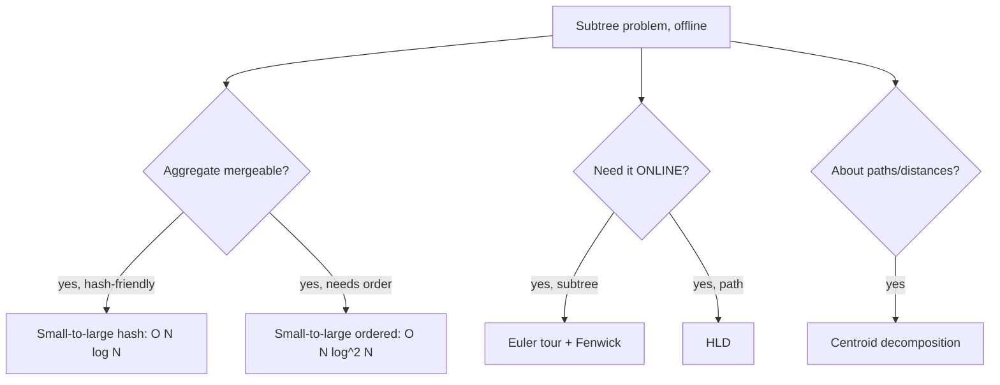

# Small-to-Large Merging — Middle Level

> **Focus:** *Why* each element moves `O(log N)` times, how the naive merge, small-to-large, DSU-on-tree, and centroid decomposition compare, and how to write a clean `O(N log N)` DSU-on-tree for offline subtree queries.

---

## Table of Contents

1. [Introduction](#introduction)
2. [Deeper Concepts](#deeper-concepts)
3. [Comparison with Alternatives](#comparison-with-alternatives)
4. [Advanced Patterns](#advanced-patterns)
5. [DSU on Tree (Sack) — The Optimized Form](#dsu-on-tree-sack--the-optimized-form)
6. [Offline Subtree Queries](#offline-subtree-queries)
7. [Code Examples](#code-examples)
8. [Error Handling](#error-handling)
9. [Performance Analysis](#performance-analysis)
10. [Best Practices](#best-practices)
11. [Visual Animation](#visual-animation)
12. [Summary](#summary)

---

## Introduction

At junior level the rule was "merge smaller into larger." At middle level we earn the right to use that rule by answering the engineering questions:

- Why is the bound `O(N log N)` and not `O(N log² N)` for the hash-set version — and when does the second `log` reappear?
- What exactly distinguishes the *naive* small-to-large (`O(N log² N)` with `std::map`) from the *optimized* DSU-on-tree (`O(N log N)`)?
- How does the "keep the heavy child" trick eliminate the merge entirely?
- When is small-to-large the right tool versus an Euler-tour segment tree, **14-heavy-light-decomposition**, or **15-centroid-decomposition**?

The payoff is large: distinct-color counting, most-frequent-color, "number of vertices of color `c` in the subtree" for many `(subtree, c)` queries — all fall to the same `O(N log N)` skeleton.

---

## Deeper Concepts

### The doubling argument, made precise

Fix one element `x`. Let `s₀ = 1` be the size of the container `x` starts in (a singleton at a leaf). Every time `x` is *moved*, it is because `x` was in the smaller of two containers being merged. If the smaller has size `a` and the larger has size `b ≥ a`, the merged container has size `a + b ≥ 2a`. So immediately after a move, the size of `x`'s container is at least **twice** what it was before the move.

Let `s_k` be the size after `x`'s `k`-th move. Then `s_k ≥ 2·s_{k-1} ≥ 2^k`. Since no container exceeds `N`, we need `2^k ≤ N`, i.e. `k ≤ log₂ N`. Therefore `x` is moved at most `⌊log₂ N⌋` times.

Summing over all `N` elements, the **total number of moves is at most `N log₂ N`**. If each move costs `O(1)` (hash set / hash map), the algorithm is `O(N log N)`. If each move costs `O(log N)` (ordered map insertion, balanced BST), it is `O(N log² N)`.

### Where the extra log comes from (and goes)

| Container | Cost per move | Total |
|-----------|---------------|-------|
| `unordered_set` / `HashSet` / Go `map` / Python `set` | `O(1)` amortized | `O(N log N)` |
| `std::map` / Java `TreeMap` / ordered structure | `O(log N)` | `O(N log² N)` |
| Plain array you must scan to dedupe | `O(size)` | back to `O(N²)` — do not do this |

So the *data structure you merge* sets the constant in the exponent. Choose hash-based containers unless you genuinely need ordered iteration.

### The "small-to-large is amortization, not a tree trick" insight

Nothing about the doubling argument requires a tree. It works whenever you maintain a partition of `N` elements into groups and only ever **merge two groups, moving the smaller into the larger**. This is exactly *union by size* in Disjoint-Set-Union. The tree version simply applies that same merging schedule along a DFS. That is why the optimized form is called **DSU on tree**: the union-by-size schedule is dictated by the tree's heavy/light structure.

### Heavy and light edges

Root the tree. For each node, its **heavy child** is the child with the largest subtree (ties broken arbitrarily); the edge to it is a **heavy edge**, all other child edges are **light edges**. Key fact: on any root-to-node path there are **at most `log₂ N` light edges**, because each time you descend a light edge the subtree size at least halves (the light child's subtree is no larger than the heavy child's, so it is at most half the parent's). This `log N` is the same `log N` as the doubling argument — they are two faces of the same coin.

---

## Comparison with Alternatives

| Technique | Time | Space | Online? | What it answers |
|-----------|------|-------|---------|-----------------|
| Naive merge (no size check) | **O(N²)** | O(N) | no | Anything mergeable — but too slow. |
| Small-to-large (hash) | **O(N log N)** | O(N) | no | Distinct count, frequency, set unions per subtree. |
| Small-to-large (ordered map) | **O(N log² N)** | O(N) | no | Same, plus ordered queries (min/max/kth in subtree). |
| DSU on tree / sack | **O(N log N)** | O(N) | no | Static subtree aggregate queries; most-frequent-color etc. |
| Euler tour + Fenwick/segment tree | **O((N+Q) log N)** | O(N) | **yes** | Point-update / subtree-sum, but not arbitrary "distinct" without Mo. |
| Mo's algorithm on Euler tour | **O((N+Q)√N)** | O(N) | no | Distinct counts, frequency over subtree ranges. |
| **15-centroid-decomposition** | **O(N log N)** per layer | O(N log N) | no | Path-counting / distance problems across the whole tree. |
| **14-heavy-light-decomposition** | **O(N + Q log² N)** | O(N) | yes | Path queries/updates between any two nodes. |

**Choose small-to-large / DSU on tree when:** the queries are about *subtrees* (not paths), are *offline*, and the aggregate is *mergeable* but not easily invertible (distinct count, mode). It is the simplest code that hits `O(N log N)`.

**Choose centroid decomposition when:** the problem is about *paths or distances* across the whole tree, e.g. "count pairs of nodes at distance ≤ k".

**Choose HLD when:** you need *online* path queries and updates.

**Choose Euler tour + Fenwick when:** the subtree aggregate is a simple invertible sum and you need online updates.

---

## Advanced Patterns

### Pattern: most-frequent value (mode) of each subtree

Maintain a `value -> count` map per node plus, during each merge, the running `(maxCount, valueWithMaxCount)`. When you increment a value's count, compare against the current max.

### Pattern: sum of the most frequent values

Some problems ask for the *sum of all values that achieve the maximum frequency*. Track both `maxCount` and `sumOfModes`; reset `sumOfModes` when a new max appears, add to it on a tie.

### Pattern: many "(subtree, color)" count queries

Group queries by their node. Run DSU on tree; when a node's container is fully built, answer every query attached to that node by reading the count map. This is the canonical offline application.

### Pattern: merging segment-tree-on-values (merge-sort-tree alternative)

Instead of a hash map you can keep a small ordered structure per node and still merge smaller-into-larger, enabling order statistics ("k-th smallest value in subtree") at `O(N log² N)`. This is where the ordered-map cost is worth paying.



---

## DSU on Tree (Sack) — The Optimized Form

The naive small-to-large still *builds and merges* a container at every node. DSU on tree removes the merging cost by **never destroying the heavy child's container**. The algorithm:

```
dfs(u, keep):
    for each light child c:           # process light children first, do NOT keep their data
        dfs(c, keep=false)
    if u has a heavy child h:
        dfs(h, keep=true)             # keep h's data; it becomes u's base container
    add u itself to the (global) structure
    for each light child c:           # re-add the whole subtree of each light child
        for each node w in subtree(c):
            add w to the structure
    answer queries for u              # structure now holds exactly subtree(u)
    if not keep:
        for each node w in subtree(u): # clear so siblings start clean
            remove w from the structure
```

Why `O(N log N)`: a node `w` is *added* once for every light edge on the path from `w` up to the root, and there are at most `log₂ N` light edges on any such path. So total additions `= Σ_w (#light edges above w) ≤ N log₂ N`. Each add/remove is `O(1)` with a hash/array structure ⇒ `O(N log N)`. There is no per-merge `log` — that is why this beats the `O(N log² N)` ordered-map merge.

The structure is usually a single **global** array `cnt[color]` plus a running answer, not per-node maps. That is the practical win: one flat array, cache-friendly, no map overhead.

> **Reading the skeleton carefully.** Three subtleties trip people up. (1) Light children are processed *first* and with `keep=false`, so their data is wiped before we touch the heavy child — otherwise sibling subtrees would contaminate each other. (2) The heavy child is processed *last* with `keep=true`, so when control returns to `u` the global structure already contains `subtree(heavy[u])` — we must not re-add it. (3) We add `u` itself and then re-add each light subtree; only after that is the structure equal to `subtree(u)` and the query answerable. Getting this order wrong yields subtly wrong answers that pass on tiny inputs and fail at scale.

---

## Offline Subtree Queries

The DSU-on-tree skeleton answers any query that can be maintained under *add one node* and *remove one node*:

- `distinct[u]` — number of colors with `cnt > 0` (maintain a `distinctCount` incremented when a color goes `0→1`, decremented on `1→0`).
- `mode[u]` — value with the highest `cnt` (maintain `maxCount` and a `cntOfCount[]` bucket so removals are also `O(1)` amortized, or accept that pure DSU-on-tree never decrements during the "keep" subtree so `maxCount` only needs reset on clear).
- `sumOfColorC[u]` for offline `(u, c)` queries — read `cnt[c]` when `u` is active.

Because we process the heavy child with `keep=true`, its contribution is already in the global structure when we return to `u`; we only pay to add the *light* subtrees.

---

## Code Examples

### DSU on tree: number of distinct colors in each subtree, `O(N log N)`

We precompute subtree sizes and heavy children, keep a global `cnt[color]` array and a `distinct` counter, and add/remove nodes via an explicit Euler-order range so we avoid re-running DFS for the "add whole subtree" step.

#### Go

```go
package main

import (
	"bufio"
	"fmt"
	"os"
)

var (
	adj      [][]int
	color    []int
	sz, heavy []int
	tin, tout []int
	order    []int // node at each Euler-in position
	timer    int
	cnt      []int
	distinct int
	ans      []int
)

func dfsSize(u, p int) {
	sz[u] = 1
	heavy[u] = -1
	best := 0
	tin[u] = timer
	order[timer] = u
	timer++
	for _, v := range adj[u] {
		if v == p {
			continue
		}
		dfsSize(v, u)
		sz[u] += sz[v]
		if sz[v] > best {
			best = sz[v]
			heavy[u] = v
		}
	}
	tout[u] = timer // [tin[u], tout[u]) is the subtree of u in Euler order
}

func add(u int) {
	if cnt[color[u]] == 0 {
		distinct++
	}
	cnt[color[u]]++
}

func remove(u int) {
	cnt[color[u]]--
	if cnt[color[u]] == 0 {
		distinct--
	}
}

func dfs(u, p int, keep bool) {
	// light children first, not kept
	for _, v := range adj[u] {
		if v != p && v != heavy[u] {
			dfs(v, u, false)
		}
	}
	// heavy child, kept
	if heavy[u] != -1 {
		dfs(heavy[u], u, true)
	}
	// add u and all light subtrees via Euler ranges
	add(u)
	for _, v := range adj[u] {
		if v != p && v != heavy[u] {
			for t := tin[v]; t < tout[v]; t++ {
				add(order[t])
			}
		}
	}
	ans[u] = distinct
	if !keep {
		for t := tin[u]; t < tout[u]; t++ {
			remove(order[t])
		}
	}
}

func main() {
	rd := bufio.NewReader(os.Stdin)
	var n int
	fmt.Fscan(rd, &n)
	adj = make([][]int, n)
	color = make([]int, n)
	for i := 0; i < n; i++ {
		fmt.Fscan(rd, &color[i])
	}
	for i := 0; i < n-1; i++ {
		var a, b int
		fmt.Fscan(rd, &a, &b)
		a--
		b--
		adj[a] = append(adj[a], b)
		adj[b] = append(adj[b], a)
	}
	sz = make([]int, n)
	heavy = make([]int, n)
	tin = make([]int, n)
	tout = make([]int, n)
	order = make([]int, n)
	cnt = make([]int, n+1)
	ans = make([]int, n)
	dfsSize(0, -1)
	dfs(0, -1, false)
	w := bufio.NewWriter(os.Stdout)
	defer w.Flush()
	for i := 0; i < n; i++ {
		fmt.Fprintf(w, "%d ", ans[i])
	}
}
```

#### Java

```java
import java.util.*;
import java.io.*;

public class DsuOnTree {
    static List<List<Integer>> adj;
    static int[] color, sz, heavy, tin, tout, order, cnt, ans;
    static int timer = 0, distinct = 0;

    static void dfsSize(int u, int p) {
        sz[u] = 1; heavy[u] = -1;
        tin[u] = timer; order[timer] = u; timer++;
        int best = 0;
        for (int v : adj.get(u)) {
            if (v == p) continue;
            dfsSize(v, u);
            sz[u] += sz[v];
            if (sz[v] > best) { best = sz[v]; heavy[u] = v; }
        }
        tout[u] = timer;
    }

    static void add(int u) {
        if (cnt[color[u]] == 0) distinct++;
        cnt[color[u]]++;
    }
    static void remove(int u) {
        cnt[color[u]]--;
        if (cnt[color[u]] == 0) distinct--;
    }

    static void dfs(int u, int p, boolean keep) {
        for (int v : adj.get(u))
            if (v != p && v != heavy[u]) dfs(v, u, false);
        if (heavy[u] != -1) dfs(heavy[u], u, true);
        add(u);
        for (int v : adj.get(u))
            if (v != p && v != heavy[u])
                for (int t = tin[v]; t < tout[v]; t++) add(order[t]);
        ans[u] = distinct;
        if (!keep)
            for (int t = tin[u]; t < tout[u]; t++) remove(order[t]);
    }

    public static void main(String[] a) throws IOException {
        BufferedReader br = new BufferedReader(new InputStreamReader(System.in));
        StreamTokenizer st = new StreamTokenizer(br);
        st.nextToken(); int n = (int) st.nval;
        adj = new ArrayList<>();
        for (int i = 0; i < n; i++) adj.add(new ArrayList<>());
        color = new int[n]; sz = new int[n]; heavy = new int[n];
        tin = new int[n]; tout = new int[n]; order = new int[n];
        cnt = new int[n + 1]; ans = new int[n];
        for (int i = 0; i < n; i++) { st.nextToken(); color[i] = (int) st.nval; }
        for (int i = 0; i < n - 1; i++) {
            st.nextToken(); int x = (int) st.nval - 1;
            st.nextToken(); int y = (int) st.nval - 1;
            adj.get(x).add(y); adj.get(y).add(x);
        }
        dfsSize(0, -1);
        dfs(0, -1, false);
        StringBuilder sb = new StringBuilder();
        for (int i = 0; i < n; i++) sb.append(ans[i]).append(' ');
        System.out.println(sb.toString().trim());
    }
}
```

#### Python

```python
import sys
from sys import setrecursionlimit

def main():
    setrecursionlimit(1 << 20)
    data = sys.stdin.buffer.read().split()
    idx = 0
    n = int(data[idx]); idx += 1
    color = [int(data[idx + i]) for i in range(n)]; idx += n
    adj = [[] for _ in range(n)]
    for _ in range(n - 1):
        a = int(data[idx]) - 1; b = int(data[idx + 1]) - 1; idx += 2
        adj[a].append(b); adj[b].append(a)

    sz = [0] * n
    heavy = [-1] * n
    tin = [0] * n
    tout = [0] * n
    order = [0] * n
    cnt = [0] * (n + 1)
    ans = [0] * n
    state = {"timer": 0, "distinct": 0}

    def dfs_size(root):
        # iterative to avoid deep recursion
        stack = [(root, -1, 0)]
        while stack:
            u, p, i = stack.pop()
            if i == 0:
                tin[u] = state["timer"]; order[state["timer"]] = u
                state["timer"] += 1
                sz[u] = 1
            # process children
            pushedChild = False
            j = i
            ch = [v for v in adj[u] if v != p]
            if i < len(ch):
                v = ch[i]
                stack.append((u, p, i + 1))
                stack.append((v, u, 0))
                pushedChild = True
            if not pushedChild:
                best = 0
                for v in adj[u]:
                    if v == p:
                        continue
                    sz[u] += sz[v]
                    if sz[v] > best:
                        best = sz[v]; heavy[u] = v
                tout[u] = state["timer"]

    def add(u):
        if cnt[color[u]] == 0:
            state["distinct"] += 1
        cnt[color[u]] += 1

    def rem(u):
        cnt[color[u]] -= 1
        if cnt[color[u]] == 0:
            state["distinct"] -= 1

    def dfs(u, p, keep):
        for v in adj[u]:
            if v != p and v != heavy[u]:
                dfs(v, u, False)
        if heavy[u] != -1:
            dfs(heavy[u], u, True)
        add(u)
        for v in adj[u]:
            if v != p and v != heavy[u]:
                for t in range(tin[v], tout[v]):
                    add(order[t])
        ans[u] = state["distinct"]
        if not keep:
            for t in range(tin[u], tout[u]):
                rem(order[t])

    dfs_size(0)
    dfs(0, -1, False)
    sys.stdout.write(" ".join(map(str, ans)))

main()
```

**What it does:** computes the number of distinct colors in every subtree in `O(N log N)` using the DSU-on-tree (keep-heavy-child) trick.
**Input:** `n`, then `n` colors, then `n-1` edges (1-indexed).
**Run:** `go run main.go < in.txt` | `javac DsuOnTree.java && java DsuOnTree < in.txt` | `python3 dsu.py < in.txt`

---

## Error Handling

| Scenario | What goes wrong | Correct approach |
|----------|----------------|------------------|
| Heavy child not chosen by size | Light-edge count exceeds `log N`; complexity degrades to `O(N²)`. | Pick the heavy child as the one with the *largest* `sz[v]`. |
| Forgetting to clear after a non-kept subtree | Sibling subtrees see leftover counts; wrong answers. | When `keep == false`, remove every node of `subtree(u)`. |
| Re-running DFS to "add a subtree" | Each add costs a fresh traversal; constant factor explodes, sometimes complexity too. | Precompute Euler order; add `subtree(v)` as the contiguous range `[tin[v], tout[v])`. |
| `distinct` drifting negative | Decrementing `cnt` below zero or mismatched add/remove. | Increment `distinct` exactly on `0→1`, decrement exactly on `1→0`. |
| Stack overflow | Recursive DFS on deep trees. | Iterative `dfs_size`; raise limits; or use an explicit stack for the main DFS too. |

---

## Performance Analysis

| N | Naive merge (worst) | Small-to-large (hash) | DSU on tree | Notes |
|---|---------------------|----------------------|-------------|-------|
| 10³ | ~5·10⁵ ops | ~10⁴ ops | ~10⁴ ops | All fast. |
| 10⁵ | ~10¹⁰ ops (TLE) | ~1.7·10⁶ ops | ~1.7·10⁶ ops | Naive dies; both `log N` forms fine. |
| 2·10⁵ | hopeless | ~3.5·10⁶ ops | ~3.5·10⁶ ops | The standard contest limit. |

The `O(N log N)` forms differ mostly by **constant factor**: DSU on tree uses a single flat `cnt[]` array (cache-friendly, no map rehash), so it typically runs 2–5× faster than per-node hash-map merging even though both are `O(N log N)`. The ordered-map merge (`O(N log² N)`) is the one to avoid when `N` is large.

#### Python (micro-benchmark sketch)

```python
import random, time

def build_chain(n):
    adj = [[] for _ in range(n)]
    for i in range(1, n):
        adj[i - 1].append(i); adj[i].append(i - 1)
    return adj

# A chain is the worst case for naive merging and a stress test for the heavy-child path.
n = 200_000
adj = build_chain(n)
t0 = time.time()
# ... run the DSU-on-tree solver ...
print("elapsed", time.time() - t0)
```

A chain has exactly one heavy path and zero light edges below the root, so DSU on tree adds each node exactly once — the *best* case, finishing in `O(N)`. A balanced binary tree is the case that exercises the full `N log N`.

---

## Best Practices

- **Precompute Euler `[tin, tout)` ranges** so "add the whole subtree of a light child" is a flat loop, never a recursive re-DFS.
- **Use a global flat array** (`cnt[color]`) plus running aggregates instead of per-node maps when colors fit in `[0, N)`.
- **Process light children with `keep=false` first, heavy child last with `keep=true`** — order matters for correctness and speed.
- **Maintain aggregates incrementally** inside `add`/`remove`; never rescan the structure to recompute `distinct` or `mode`.
- **Validate against the naive `O(N²)` merge** on small random trees before trusting the optimized version.
- For order-statistic subtree queries, accept the `O(N log² N)` ordered-merge — it is simpler than alternatives and usually fast enough.

---

## Visual Animation

> See [`animation.html`](./animation.html) for an interactive view.
>
> The middle-level animation includes:
> - The tree annotated with heavy (bold) and light (thin) edges.
> - A toggle between *naive small-to-large* (per-node sets merge) and *DSU-on-tree* (single global `cnt[]` retained for the heavy child).
> - A live counter of element moves / adds, showing the `O(N log N)` budget.

---

## Summary

Small-to-large merging is amortization in disguise: the *union-by-size* schedule guarantees each element is touched `O(log N)` times. With hash containers that is `O(N log N)`; with ordered containers it slips to `O(N log² N)`. DSU on tree (the sack) is the optimized incarnation — by keeping the heavy child's global structure and only re-adding light subtrees, it removes the per-merge `log` and gives a clean, cache-friendly `O(N log N)` for offline subtree queries. Reach for it on subtree aggregates; reach for **15-centroid-decomposition** on path/distance problems and **14-heavy-light-decomposition** on online path queries.
