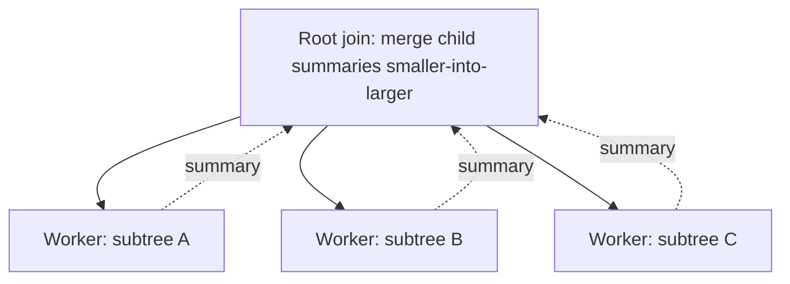

# Small-to-Large Merging — Senior Level

> Small-to-large is rarely a "data structure" you ship; it is a *batch-processing strategy*. At senior level the question is where it sits in an offline analytics pipeline, what its memory profile does to a worker, and when an Euler-tour index, **15-centroid-decomposition**, or a streaming aggregator is the better engineering choice.

## Table of Contents
1. [Introduction](#1-introduction)
2. [System Design: Offline Batch Tree Analytics](#2-system-design-offline-batch-tree-analytics)
3. [Large-Scale Considerations](#3-large-scale-considerations)
4. [Concurrency and Parallelism](#4-concurrency-and-parallelism)
5. [Comparison with Alternatives at Scale](#5-comparison-with-alternatives-at-scale)
6. [Architecture Patterns](#6-architecture-patterns)
7. [Code Examples](#7-code-examples)
8. [Observability](#8-observability)
9. [Failure Modes](#9-failure-modes)
10. [Capacity Planning](#10-capacity-planning)
11. [Summary](#11-summary)

---

## 1. Introduction

A senior engineer almost never meets small-to-large as an interview toy. They meet it as the cheapest way to answer *"for every node in this hierarchy, aggregate something over its entire subtree"* when the hierarchy is large, the aggregate is not trivially invertible (distinct counts, modes, set unions), and the workload is **offline** — the whole tree and all queries are known before you start.

That description fits a surprising number of real systems:

- **Org-chart / cost rollups**: for every manager, how many distinct cost centers, skills, or vendors appear in their entire reporting subtree.
- **File-system / object-store analytics**: for every directory, the number of distinct file types, owners, or MIME types beneath it.
- **Category trees in commerce**: for every category node, the most frequent brand among all products in the subtree.
- **Dependency trees**: for every package, the set of distinct licenses transitively pulled in.

The senior decisions are not about sift-up vs sift-down. They are: *Does this fit in one worker's RAM? Is it offline or do I need online updates? Will the root's container OOM me? Should I instead build an Euler-tour index and push it into a columnar store?* This file answers those.

---

## 2. System Design: Offline Batch Tree Analytics

### 2.1 The shape of the job

Small-to-large / DSU-on-tree is a **single-pass, single-machine, post-order batch job**. The canonical pipeline:

```mermaid
flowchart LR
    A[Source of truth<br/>graph edges + node attrs<br/>RDBMS / object store] --> B[Materialize rooted tree<br/>+ Euler tin/tout]
    B --> C[DSU-on-tree pass<br/>global cnt[] + running aggregate]
    C --> D[Per-node results<br/>distinct / mode / sums]
    D --> E[Sink<br/>columnar table / cache]
    style C fill:#fff4e8,stroke:#d97706
```

The compute core (C) is `O(N log N)` and embarrassingly *sequential* — it is one DFS. Everything around it (load, root, persist) is where the engineering goes.

### 2.2 When the tree does not fit in RAM

DSU-on-tree assumes random access to the whole tree and a global counter array. If `N` is in the billions, you do not run small-to-large; you switch paradigm:

- **Euler-tour + external sort + segment aggregation**: linearize the tree to `[tin, tout)` ranges, then subtree aggregation becomes a *range* problem you can solve with sort/scan in a big-data engine (Spark/Flink). Distinct-per-range is still hard offline; you fall back to HyperLogLog sketches per range if approximate counts are acceptable.
- **Hierarchical pre-aggregation**: compute child summaries and roll up level by level, persisting intermediate summaries — but now you have re-introduced the naive merge unless you keep the smaller-into-larger discipline at each rollup.

The honest rule: **small-to-large is a single-machine `N ≤ ~10⁷–10⁸` technique.** Beyond that, change strategy.

### 2.3 Mergeable monoids

The technique generalises to any aggregate that is a *monoid under merge* and supports *add-one-element* (for DSU-on-tree's add/remove). Distinct-count, frequency map, sum, min/max, set union, Bloom/HLL sketches all qualify. If your aggregate is invertible and additive (plain sums), prefer an Euler-tour prefix sum — it is `O(N)` and trivially parallel. Reserve small-to-large for the *non-invertible* aggregates.

---

## 3. Large-Scale Considerations

### 3.1 Memory is the real constraint

The time bound `O(N log N)` is comfortable; the **space** is what bites. Two regimes:

- **Naive per-node small-to-large**: at the moment you process the root, the surviving container can hold all `N` distinct elements. Peak memory is `O(N)` *plus* the overhead of however many child containers are alive on the recursion stack. With hash maps that overhead (load factor, bucket arrays) is 3–8× the raw data.
- **DSU-on-tree with a global `cnt[]`**: peak is a single `O(U)` array where `U` is the number of distinct values, *not* per-node maps. This is dramatically smaller and cache-friendly. Prefer it at scale.

### 3.2 Recursion depth

A skewed tree (chain) has depth `N`. A recursive DFS on `N = 10⁷` blows the stack in every language. At scale you **must** use an explicit stack or convert to an Euler-order iterative pass. The `dfs_size` precomputation and the main DFS both need this treatment.

### 3.3 Value domain compression

If colors/values are sparse 64-bit IDs, compress them to a dense `[0, U)` range first so the global `cnt[]` is an array, not a hash map. This single step often halves wall-clock time.

### 3.4 The heavy-child invariant at scale

The whole `O(N log N)` rests on choosing the largest-subtree child as heavy. A bug that picks the wrong heavy child does not crash — it silently degrades to `O(N²)` and your job that ran in 8 seconds on test data hangs for an hour on production data. Treat heavy-child selection as a load-bearing invariant and test it.

---

## 4. Concurrency and Parallelism

### 4.1 The core is sequential

DSU-on-tree mutates one global structure in a strict post-order. You cannot trivially parallelise the main pass — the heavy-child container is reused in place, so two threads would race on `cnt[]`.

### 4.2 Parallelism via independent subtrees (naive form)

The *naive* per-node small-to-large is more parallel-friendly: distinct subtrees are independent until they merge. You can fan out children of the root to worker threads, each computing its subtree's container, then merge results smaller-into-larger at the join. This trades the DSU-on-tree memory win for parallelism. Useful when you have many cores and the per-subtree containers fit comfortably.



### 4.3 Sharding by top-level subtree

For org/file trees, the top-level children are natural shards. Run one DSU-on-tree per shard on its own core, then handle the (small) set of ancestors-of-shards on a coordinator. Cross-shard correctness requires that an ancestor's answer be the merge of its shards' summaries — true for monoid aggregates.

### 4.4 No locks on the hot path

If you do parallelise the naive form, give each worker its *own* containers; merge only at join points. Sharing a global `cnt[]` across threads forces locking on the hottest array in the program and destroys throughput. Shared-nothing per-subtree is the only sane concurrency model here.

---

## 5. Comparison with Alternatives at Scale

| Approach | Time | Peak memory | Online? | Parallel? | Best when |
|----------|------|-------------|---------|-----------|-----------|
| Naive per-node small-to-large | O(N log N) | O(N) + map overhead × stack | no | yes (subtree fan-out) | many cores, mergeable summaries, moderate N |
| DSU on tree (global cnt) | O(N log N) | O(U) flat array | no | no (sequential core) | single machine, large N, non-invertible aggregate |
| Euler tour + Fenwick (sum) | O((N+Q) log N) | O(N) | **yes** | partial | invertible additive aggregate, online updates |
| Euler tour + Mo's | O((N+Q)√N) | O(N) | no | hard | distinct/freq over many subtree ranges |
| **15-centroid-decomposition** | O(N log N) | O(N log N) | no | by centroid | path / distance aggregates, not subtree |
| **14-heavy-light-decomposition** | O(N + Q log² N) | O(N) | **yes** | partial | online *path* queries between arbitrary nodes |
| HLL sketches per Euler range (Spark) | O(N) approx | O(ranges × sketch) | no | **fully** | billions of nodes, approximate distinct OK |

The senior takeaway: small-to-large/DSU-on-tree owns the niche of **exact, offline, subtree, non-invertible** aggregates on a single machine. Step outside any of those four words and a different tool wins.

---

## 6. Architecture Patterns

### 6.1 Precompute-and-cache

Tree analytics are usually read-heavy and change slowly (org charts, category trees). Run the DSU-on-tree pass nightly, materialize `node_id → {distinct, mode, ...}` into a columnar table or cache, and serve reads in `O(1)`. Recompute on a schedule or on a "tree changed" event.

### 6.2 Incremental invalidation

When a single subtree changes, only ancestors-of-the-change need recomputation in principle — but small-to-large is a *global* pass, so partial recompute is awkward. If updates are frequent, this is the signal to abandon batch small-to-large for an online structure (Euler tour + Fenwick, or HLD for paths). Choosing batch vs online is the central architectural fork.

### 6.3 Separation of linearization and aggregation

Keep "build the rooted tree + Euler order" as a reusable stage that emits `tin/tout` and `heavy[]`. Many different aggregate jobs (distinct, mode, sum-of-modes) then share that artifact. This mirrors how a query planner separates physical layout from the aggregate operator.

---

## 7. Code Examples

### 7.1 Production-shaped DSU-on-tree with iterative size pass and value compression

This version compresses arbitrary 64-bit values to a dense range, computes sizes/heavy/Euler iteratively (chain-safe), and answers distinct + mode per subtree using a single global `cnt[]` and a `cntOfCount[]` bucket so `maxCount` is maintained in `O(1)` per add.

#### Go

```go
package main

import (
	"bufio"
	"fmt"
	"os"
	"sort"
)

func main() {
	rd := bufio.NewReader(os.Stdin)
	var n int
	fmt.Fscan(rd, &n)
	raw := make([]int, n)
	for i := range raw {
		fmt.Fscan(rd, &raw[i])
	}
	// compress values to [0, U)
	uniq := append([]int(nil), raw...)
	sort.Ints(uniq)
	uniq = dedup(uniq)
	val := make([]int, n)
	for i, v := range raw {
		val[i] = sort.SearchInts(uniq, v)
	}
	adj := make([][]int, n)
	for i := 0; i < n-1; i++ {
		var a, b int
		fmt.Fscan(rd, &a, &b)
		a--
		b--
		adj[a] = append(adj[a], b)
		adj[b] = append(adj[b], a)
	}

	sz := make([]int, n)
	heavy := make([]int, n)
	parent := make([]int, n)
	tin := make([]int, n)
	tout := make([]int, n)
	order := make([]int, n)

	// iterative size + Euler + heavy (post-order)
	for i := range heavy {
		heavy[i] = -1
	}
	timer := 0
	type frame struct{ u, p, idx int }
	st := []frame{{0, -1, 0}}
	parent[0] = -1
	tin[0] = 0
	order[0] = 0
	timer = 1
	sz[0] = 1
	for len(st) > 0 {
		f := &st[len(st)-1]
		if f.idx < len(adj[f.u]) {
			v := adj[f.u][f.idx]
			f.idx++
			if v == f.p {
				continue
			}
			parent[v] = f.u
			tin[v] = timer
			order[timer] = v
			timer++
			sz[v] = 1
			st = append(st, frame{v, f.u, 0})
		} else {
			u := f.u
			tout[u] = timer
			st = st[:len(st)-1]
			if p := parent[u]; p != -1 {
				sz[p] += sz[u]
				if heavy[p] == -1 || sz[u] > sz[heavy[p]] {
					heavy[p] = u
				}
			}
		}
	}

	cnt := make([]int, len(uniq))
	cntOfCount := make([]int, n+1)
	maxCount := 0
	distinct := 0
	ansDistinct := make([]int, n)
	ansMaxFreq := make([]int, n)

	add := func(u int) {
		c := val[u]
		if cnt[c] == 0 {
			distinct++
		}
		cntOfCount[cnt[c]]--
		cnt[c]++
		cntOfCount[cnt[c]]++
		if cnt[c] > maxCount {
			maxCount = cnt[c]
		}
	}
	remove := func(u int) {
		c := val[u]
		cntOfCount[cnt[c]]--
		if cnt[c] == maxCount && cntOfCount[cnt[c]] == 0 {
			maxCount--
		}
		cnt[c]--
		cntOfCount[cnt[c]]++
		if cnt[c] == 0 {
			distinct--
		}
	}

	var dfs func(u, p int, keep bool)
	dfs = func(u, p int, keep bool) {
		for _, v := range adj[u] {
			if v != p && v != heavy[u] {
				dfs(v, u, false)
			}
		}
		if heavy[u] != -1 {
			dfs(heavy[u], u, true)
		}
		add(u)
		for _, v := range adj[u] {
			if v != p && v != heavy[u] {
				for t := tin[v]; t < tout[v]; t++ {
					add(order[t])
				}
			}
		}
		ansDistinct[u] = distinct
		ansMaxFreq[u] = maxCount
		if !keep {
			for t := tin[u]; t < tout[u]; t++ {
				remove(order[t])
			}
		}
	}
	dfs(0, -1, false)

	w := bufio.NewWriter(os.Stdout)
	defer w.Flush()
	for i := 0; i < n; i++ {
		fmt.Fprintf(w, "%d %d\n", ansDistinct[i], ansMaxFreq[i])
	}
}

func dedup(a []int) []int {
	out := a[:0]
	for i, v := range a {
		if i == 0 || v != a[i-1] {
			out = append(out, v)
		}
	}
	return out
}
```

#### Java

```java
import java.util.*;
import java.io.*;

public class DsuScale {
    public static void main(String[] args) throws IOException {
        StreamTokenizer st = new StreamTokenizer(new BufferedReader(new InputStreamReader(System.in)));
        st.nextToken(); int n = (int) st.nval;
        int[] raw = new int[n];
        for (int i = 0; i < n; i++) { st.nextToken(); raw[i] = (int) st.nval; }
        int[] sorted = raw.clone(); Arrays.sort(sorted);
        int u = 0; int[] uniq = new int[n];
        for (int i = 0; i < n; i++) if (i == 0 || sorted[i] != sorted[i-1]) uniq[u++] = sorted[i];
        uniq = Arrays.copyOf(uniq, u);
        final int[] fUniq = uniq;
        int[] val = new int[n];
        for (int i = 0; i < n; i++) val[i] = lowerBound(fUniq, raw[i]);

        List<List<Integer>> adj = new ArrayList<>();
        for (int i = 0; i < n; i++) adj.add(new ArrayList<>());
        for (int i = 0; i < n - 1; i++) {
            st.nextToken(); int a = (int) st.nval - 1;
            st.nextToken(); int b = (int) st.nval - 1;
            adj.get(a).add(b); adj.get(b).add(a);
        }

        int[] sz = new int[n], heavy = new int[n], parent = new int[n];
        int[] tin = new int[n], tout = new int[n], order = new int[n];
        Arrays.fill(heavy, -1);
        // iterative post-order size + Euler
        int[] iter = new int[n];
        int timer = 1; parent[0] = -1; tin[0] = 0; order[0] = 0; sz[0] = 1;
        Deque<Integer> stack = new ArrayDeque<>(); stack.push(0);
        while (!stack.isEmpty()) {
            int x = stack.peek();
            if (iter[x] < adj.get(x).size()) {
                int v = adj.get(x).get(iter[x]++);
                if (v == parent[x]) continue;
                parent[v] = x; tin[v] = timer; order[timer] = v; timer++; sz[v] = 1;
                stack.push(v);
            } else {
                tout[x] = timer; stack.pop();
                int p = parent[x];
                if (p != -1) { sz[p] += sz[x]; if (heavy[p] == -1 || sz[x] > sz[heavy[p]]) heavy[p] = x; }
            }
        }

        int[] cnt = new int[uniq.length];
        int[] cntOfCount = new int[n + 1];
        int[] maxCount = {0}, distinct = {0};
        int[] ansD = new int[n], ansF = new int[n];

        // closures via helper methods would be cleaner; inline here
        Dsu d = new Dsu(adj, val, heavy, tin, tout, order, cnt, cntOfCount, ansD, ansF);
        d.dfs(0, -1, false);

        StringBuilder sb = new StringBuilder();
        for (int i = 0; i < n; i++) sb.append(ansD[i]).append(' ').append(ansF[i]).append('\n');
        System.out.print(sb);
    }

    static int lowerBound(int[] a, int key) {
        int lo = 0, hi = a.length;
        while (lo < hi) { int m = (lo + hi) >>> 1; if (a[m] < key) lo = m + 1; else hi = m; }
        return lo;
    }
}

class Dsu {
    List<List<Integer>> adj; int[] val, heavy, tin, tout, order, cnt, cntOfCount, ansD, ansF;
    int maxCount = 0, distinct = 0;
    Dsu(List<List<Integer>> adj, int[] val, int[] heavy, int[] tin, int[] tout, int[] order,
        int[] cnt, int[] cntOfCount, int[] ansD, int[] ansF) {
        this.adj = adj; this.val = val; this.heavy = heavy; this.tin = tin; this.tout = tout;
        this.order = order; this.cnt = cnt; this.cntOfCount = cntOfCount; this.ansD = ansD; this.ansF = ansF;
    }
    void add(int u) {
        int c = val[u];
        if (cnt[c] == 0) distinct++;
        cntOfCount[cnt[c]]--; cnt[c]++; cntOfCount[cnt[c]]++;
        if (cnt[c] > maxCount) maxCount = cnt[c];
    }
    void remove(int u) {
        int c = val[u];
        cntOfCount[cnt[c]]--;
        if (cnt[c] == maxCount && cntOfCount[cnt[c]] == 0) maxCount--;
        cnt[c]--; cntOfCount[cnt[c]]++;
        if (cnt[c] == 0) distinct--;
    }
    void dfs(int u, int p, boolean keep) {
        for (int v : adj.get(u)) if (v != p && v != heavy[u]) dfs(v, u, false);
        if (heavy[u] != -1) dfs(heavy[u], u, true);
        add(u);
        for (int v : adj.get(u))
            if (v != p && v != heavy[u])
                for (int t = tin[v]; t < tout[v]; t++) add(order[t]);
        ansD[u] = distinct; ansF[u] = maxCount;
        if (!keep) for (int t = tin[u]; t < tout[u]; t++) remove(order[t]);
    }
}
```

#### Python

```python
import sys
from bisect import bisect_left

def main():
    data = sys.stdin.buffer.read().split()
    p = 0
    n = int(data[p]); p += 1
    raw = [int(data[p + i]) for i in range(n)]; p += n
    uniq = sorted(set(raw))
    val = [bisect_left(uniq, x) for x in raw]
    adj = [[] for _ in range(n)]
    for _ in range(n - 1):
        a = int(data[p]) - 1; b = int(data[p + 1]) - 1; p += 2
        adj[a].append(b); adj[b].append(a)

    sz = [1] * n
    heavy = [-1] * n
    parent = [-1] * n
    tin = [0] * n
    tout = [0] * n
    order = [0] * n

    # iterative post-order size + Euler
    timer = 1
    it = [0] * n
    stack = [0]
    while stack:
        x = stack[-1]
        if it[x] < len(adj[x]):
            v = adj[x][it[x]]; it[x] += 1
            if v == parent[x]:
                continue
            parent[v] = x; tin[v] = timer; order[timer] = v; timer += 1
            stack.append(v)
        else:
            tout[x] = timer; stack.pop()
            pa = parent[x]
            if pa != -1:
                sz[pa] += sz[x]
                if heavy[pa] == -1 or sz[x] > sz[heavy[pa]]:
                    heavy[pa] = x

    cnt = [0] * len(uniq)
    cntOfCount = [0] * (n + 1)
    state = {"maxCount": 0, "distinct": 0}
    ansD = [0] * n
    ansF = [0] * n

    def add(u):
        c = val[u]
        if cnt[c] == 0:
            state["distinct"] += 1
        cntOfCount[cnt[c]] -= 1
        cnt[c] += 1
        cntOfCount[cnt[c]] += 1
        if cnt[c] > state["maxCount"]:
            state["maxCount"] = cnt[c]

    def rem(u):
        c = val[u]
        cntOfCount[cnt[c]] -= 1
        if cnt[c] == state["maxCount"] and cntOfCount[cnt[c]] == 0:
            state["maxCount"] -= 1
        cnt[c] -= 1
        cntOfCount[cnt[c]] += 1
        if cnt[c] == 0:
            state["distinct"] -= 1

    sys.setrecursionlimit(1 << 20)

    def dfs(u, par, keep):
        for v in adj[u]:
            if v != par and v != heavy[u]:
                dfs(v, u, False)
        if heavy[u] != -1:
            dfs(heavy[u], u, True)
        add(u)
        for v in adj[u]:
            if v != par and v != heavy[u]:
                for t in range(tin[v], tout[v]):
                    add(order[t])
        ansD[u] = state["distinct"]
        ansF[u] = state["maxCount"]
        if not keep:
            for t in range(tin[u], tout[u]):
                rem(order[t])

    dfs(0, -1, False)
    out = "\n".join(f"{ansD[i]} {ansF[i]}" for i in range(n))
    sys.stdout.write(out + "\n")

main()
```

**What it does:** for every subtree, reports `(distinct value count, maximum frequency)` in `O(N log N)`, with value compression and a chain-safe iterative size pass.

---

## 8. Observability

You cannot attach a Grafana dashboard to a `for` loop, but a batch job still needs signals:

- **Total adds counter.** Instrument `add()` with a counter. It should be `≤ N log₂ N`. If it balloons toward `N²`, your heavy-child selection is broken — this is the single most valuable metric.
- **Peak distinct / peak maxCount.** Sanity-check against domain expectations; an impossible value flags a compression or merge bug.
- **Wall-clock per stage.** Separate "load + linearize" from "DSU pass" from "persist." Regressions usually live in I/O, not the core.
- **Memory high-water mark.** Track RSS; the global `cnt[]` plus Euler arrays are predictable, so a surprise spike means per-node maps leaked in.
- **Determinism check.** Same input must yield identical output; a diff against a golden run catches non-deterministic ordering bugs (e.g., undefined tie-breaking that affects nothing it should).

---

## 9. Failure Modes

| Failure | Symptom | Root cause | Mitigation |
|---------|---------|------------|------------|
| Silent `O(N²)` | Job that was 8 s hangs for an hour | Heavy child chosen wrong (or not at all) | Assert `add` count `≤ N⌈log N⌉`; unit-test heavy selection on a chain and a star |
| OOM on the root | Worker killed near end of run | Per-node hash maps kept alive; root container holds all distinct values with map overhead | Switch to global `cnt[]`; compress values; free absorbed maps immediately |
| Stack overflow | Crash on deep/chain trees | Recursive DFS depth `= N` | Iterative size pass (shown); iterative main DFS for extreme depth |
| Wrong answers on siblings | Random-looking errors | Forgot to clear a non-kept subtree | Ensure `keep == false` removes exactly `[tin[u], tout[u])` |
| `maxCount` stuck high | Mode answers too large | Removed without decrementing `maxCount` via `cntOfCount` | Maintain `cntOfCount[]`; decrement `maxCount` only when its bucket empties |
| Re-DFS per add | Constant factor explosion, sometimes complexity | "Add whole subtree" implemented as recursion | Use precomputed Euler `[tin, tout)` ranges |
| Non-dense values | Hash map where an array was expected; slow | Forgot to compress 64-bit IDs | Coordinate-compress to `[0, U)` up front |

---

## 10. Capacity Planning

Back-of-envelope for a single worker:

- **Time.** `~N log₂ N` add/remove ops. At `N = 10⁷`, `log₂ N ≈ 24`, so `~2.4·10⁸` constant-time ops — roughly 1–3 seconds in Go/Java, 10–40 seconds in CPython (use PyPy or vectorize if that is too slow).
- **Memory.** Global `cnt[]`: `O(U)` ints. Euler arrays (`tin, tout, order, parent, sz, heavy`): 6 × `N` ints ≈ `6·N·8` bytes = ~480 MB at `N = 10⁷` (64-bit) or ~240 MB with 32-bit ints. Adjacency: `2·(N-1)` ints plus list overhead. Budget ~1–2 GB for `N = 10⁷`.
- **The cliff.** Past `N ≈ 10⁸` you exceed comfortable single-node RAM and the recursion/Euler arrays dominate. That is the line to move to Euler-tour + big-data-engine with HLL sketches for approximate distinct, accepting approximation in exchange for horizontal scale.
- **Recompute cadence.** If the tree mutates `k` times/day and a full pass costs `T`, batch recompute is fine while `k·(online update cost) > T/interval`. Cross that and migrate to an online structure.

---

## 11. Summary

At senior level, small-to-large/DSU-on-tree is a *batch operator* for exact, offline, subtree, non-invertible aggregates on a single machine. Its time bound (`O(N log N)`) is the easy part; the engineering is in memory (prefer a global `cnt[]` over per-node maps), depth (iterate, do not recurse, on chains), value compression (dense arrays beat hash maps), and the load-bearing heavy-child invariant whose violation degrades silently to `O(N²)`. When the workload turns online, mutates frequently, becomes path-shaped, or grows past single-node RAM, hand off to Euler-tour + Fenwick, **14-heavy-light-decomposition**, **15-centroid-decomposition**, or sketch-based distributed aggregation respectively. Knowing exactly where that handoff lies is the senior skill.
