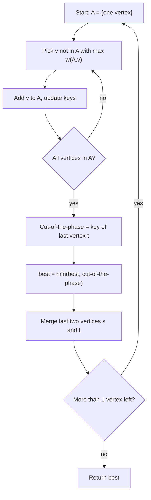

# Stoer-Wagner Global Minimum Cut — Junior Level

> **One-line summary:** The Stoer-Wagner algorithm finds the **global minimum cut** of an undirected weighted graph — the cheapest way to split the vertices into two non-empty groups — *without* picking a fixed source and sink, by running `V-1` "minimum cut phases" and merging two vertices after each, all in `O(V³)` time.

---

## Table of Contents

1. [Introduction](#introduction)
2. [Prerequisites](#prerequisites)
3. [Glossary](#glossary)
4. [Core Concepts](#core-concepts)
5. [Big-O Summary](#big-o-summary)
6. [Real-World Analogies](#real-world-analogies)
7. [Pros & Cons](#pros--cons)
8. [Step-by-Step Walkthrough](#step-by-step-walkthrough)
9. [Code Examples](#code-examples)
10. [Coding Patterns](#coding-patterns)
11. [Error Handling](#error-handling)
12. [Performance Tips](#performance-tips)
13. [Best Practices](#best-practices)
14. [Edge Cases & Pitfalls](#edge-cases--pitfalls)
15. [Common Mistakes](#common-mistakes)
16. [Cheat Sheet](#cheat-sheet)
17. [Visual Animation](#visual-animation)
18. [Summary](#summary)
19. [Further Reading](#further-reading)

---

## Introduction

Imagine a network of cities connected by roads, where each road has a "capacity" — say, how many cars per hour it can carry. Now ask: **what is the cheapest set of roads I could cut to split the country into two pieces?** Not "two specific pieces" — any split, as long as both halves are non-empty. The total capacity of the cut roads is what you want to minimize.

That is the **global minimum cut** problem, and the **Stoer-Wagner algorithm** (Mechthild Stoer and Frank Wagner, 1997) solves it for undirected, weighted graphs in a remarkably clean way.

Here is what makes it special. The classic textbook approach to "minimum cut" is the **max-flow / min-cut theorem**: pick a source `s` and a sink `t`, compute the maximum flow from `s` to `t`, and the value of that flow equals the minimum `s-t` cut. But the *global* min cut does not fix `s` and `t` — the two halves can be *any* partition. With max-flow you would have to try many `s-t` pairs (`V-1` of them suffice, but it is still a lot of flow computations) and take the best.

Stoer-Wagner sidesteps all of that. It never computes a single flow. Instead it repeatedly runs a cheap procedure called a **minimum cut phase**. Each phase:

1. Grows a set `A` one vertex at a time, always adding the vertex **most tightly connected** to `A` (this ordering is called *maximum adjacency* or a *legal ordering*).
2. The last two vertices added — call them `s` and `t` — define the **cut-of-the-phase**: the cut that separates `t` from everyone else. Record its weight.
3. **Merge** `s` and `t` into a single combined vertex, then repeat the whole phase on the smaller graph.

After `V-1` phases only one vertex remains, and the **smallest cut-of-the-phase** ever recorded is the global minimum cut. That is the entire algorithm. No flow, no augmenting paths, no source/sink choice — just "grow, record, merge," `V-1` times.

The cost is `O(V³)` with a simple array implementation (or `O(V·E + V² log V)` with a heap), which is excellent for dense graphs of a few hundred vertices. It is the standard choice when you need *the* min cut of an entire undirected network.

---

## Prerequisites

Before reading this file you should be comfortable with:

- **Undirected weighted graphs** — vertices, edges, and a non-negative weight on each edge (see sibling topic `01-representation`).
- **Adjacency matrix** — a `V × V` grid where `w[i][j]` is the weight of edge `(i, j)`. Stoer-Wagner is easiest to write on a matrix.
- **Nested loops** and simple array bookkeeping.
- **The idea of a "cut"** — splitting vertices into two non-empty groups and summing the weights of edges crossing between them.
- **Big-O notation** — `O(V³)`, `O(V²)`.

Optional but helpful:

- Brief exposure to **max-flow / min-cut** (`19-max-flow-edmonds-karp-dinic`) — you will appreciate *why* Stoer-Wagner avoids it.
- Familiarity with **Prim's MST** — the maximum-adjacency ordering is structurally similar to Prim's "always add the closest vertex."

---

## Glossary

| Term | Meaning |
|------|---------|
| **Cut** | A partition of the vertices into two non-empty sets `(S, V\S)`. |
| **Cut weight** | The sum of weights of all edges with one endpoint in `S` and the other in `V\S`. |
| **Global minimum cut** | The cut of *smallest* weight over **all** possible partitions (no fixed `s`, `t`). |
| **s-t cut** | A cut where a fixed vertex `s` is on one side and a fixed vertex `t` is on the other. |
| **Minimum cut phase** | One round: build a maximum-adjacency order, record the cut-of-the-phase, merge the last two vertices. |
| **Maximum adjacency (legal) ordering** | An order of vertices where each next vertex is the one most strongly connected (highest total edge weight) to the already-chosen set `A`. |
| **`w(A, v)`** | The total weight of edges between vertex `v` and the current set `A`. The "connectedness" key. |
| **Cut-of-the-phase** | The cut separating the **last added vertex `t`** from all the rest, `({t}, V\{t})`, in that phase. |
| **Merge / contract** | Combine two vertices `s` and `t` into one super-vertex; edge weights to common neighbors are **added**. |
| **Super-vertex** | A merged vertex that represents a group of original vertices fused together. |
| **Dense graph** | Many edges (close to `V²`); Stoer-Wagner's sweet spot. |

---

## Core Concepts

### 1. What is a "cut," exactly?

A **cut** chops the vertex set `V` into two non-empty parts `S` and `V\S`. Its **weight** is the sum of the weights of every edge that has one endpoint in `S` and the other in `V\S`. The **global minimum cut** is the cut whose weight is smallest, over *all* possible ways to split the vertices.

```
Vertices {0,1,2,3}. Edges with weights:
  0-1: 3   0-2: 1   1-2: 3   1-3: 1   2-3: 5

Cut S={3}, V\S={0,1,2}:  crossing edges = (1-3)+(2-3) = 1+5 = 6
Cut S={0}, V\S={1,2,3}:  crossing edges = (0-1)+(0-2) = 3+1 = 4
Cut S={0,2}, V\S={1,3}:  crossing edges = (0-1)+(1-2)+(2-3) = 3+3+5 = 11
```

The smallest of these (and all others) is the global min cut.

### 2. Why not just use max-flow / min-cut?

The max-flow / min-cut theorem says: for a *fixed* `s` and `t`, the minimum `s-t` cut equals the maximum `s-t` flow. But the **global** min cut does not fix anything — the two sides can be any partition. To find it with max-flow you would fix one vertex (say vertex 0) as a permanent source and compute the min `s-t` cut to every *other* vertex as the sink — `V-1` max-flow computations — and take the minimum. That works, but each flow computation is itself expensive, and you run `V-1` of them.

Stoer-Wagner replaces all those flow computations with `V-1` cheap **phases**, each just a maximum-adjacency scan. No flow is ever computed.

### 3. The minimum cut phase

A single phase works on the current (possibly already-merged) graph:

```
A = { arbitrary start vertex }
while A does not contain all vertices:
    pick the vertex v NOT in A with the largest w(A, v)   // most connected
    add v to A
the last two vertices added are s (second-to-last) and t (last)
cut-of-the-phase = w(A, t)  = total weight from t to everyone else
record this value, then MERGE s and t
```

The key quantity is `w(A, v)`: how strongly vertex `v` is pulled toward the set `A` we have built so far. We always add the strongest-pulled vertex next. This is *exactly* like Prim's MST, except we maximize total connection weight instead of picking a single cheapest edge.

### 4. The cut-of-the-phase

When the phase ends, the **last vertex added** `t` is, by the ordering rule, the one most loosely connected — it was added last because everyone else was pulled in first. The **cut-of-the-phase** is simply `({t}, rest)`: isolate `t`. Its weight is `w(A, t)` at the moment `t` was added — the total weight of edges from `t` to all the vertices already in `A`.

The deep fact (proved in `professional.md`) is:

> **The cut-of-the-phase is always a minimum `s-t` cut**, where `s` and `t` are the last two vertices added in that phase.

So each phase secretly computes a min `s-t` cut for *one* pair `(s, t)` — for free, without any flow.

### 5. Merge and repeat

After recording the cut-of-the-phase, we **merge** `s` and `t` into a single super-vertex. Merging means: any edge from `s` to a third vertex `x` and any edge from `t` to `x` are combined — their weights **add**. The merged vertex inherits the sum.

Why merge? Because we have already learned the best cut that *separates* `s` from `t`. From now on we only care about cuts that keep `s` and `t` *together*. Merging them enforces exactly that. After `V-1` merges, the graph collapses to a single vertex, and we have considered enough `(s, t)` pairs to guarantee the global minimum is among the recorded cut-of-the-phase values.

### 6. The whole algorithm

```
best = +infinity
while graph has more than 1 vertex:
    run a minimum cut phase  → produces cut-of-the-phase weight and (s, t)
    best = min(best, cut-of-the-phase weight)
    merge s and t
return best
```

`V-1` phases, each `O(V²)`, gives `O(V³)`.

---

## Big-O Summary

| Aspect | Complexity | Notes |
|--------|------------|-------|
| Time (array impl.) | **O(V³)** | `V-1` phases × `O(V²)` per phase. |
| Time (heap impl.) | **O(V·E + V² log V)** | Use a priority queue for `w(A, v)`; better on sparse graphs. |
| Space | **O(V²)** | The adjacency matrix (and merge bookkeeping). |
| Negative weights | **Not supported** | Weights must be non-negative for the proof to hold. |
| Directed graphs | **Not supported** | Stoer-Wagner is for *undirected* graphs only. |
| Output | min cut weight (and the partition, with extra bookkeeping) | |

Compare: the max-flow approach to global min cut runs `V-1` max-flow computations. On a dense graph that is far slower than one `O(V³)` Stoer-Wagner run.

---

## Real-World Analogies

| Concept | Analogy |
|---------|---------|
| Global minimum cut | The cheapest set of cables to sever to split a power grid into two independent islands — and you do not care *which* two islands, only that the cut is cheapest. |
| Maximum-adjacency ordering | A party where you keep inviting whoever has the most friends already inside the room. The last person to get pulled in is the loner. |
| Cut-of-the-phase | Isolating that last "loner" guest — the cheapest single person to wall off from the room they just joined. |
| Merging `s` and `t` | Two guests who turned out to be inseparable get a shared name tag and are treated as one person for the rest of the night. |
| Repeating phases | Keep fusing inseparable pairs until only one mega-group remains; the cheapest isolation you ever saw is the answer. |
| Network reliability | Finding the *weakest link* in a network — the smallest-capacity bottleneck that, if removed, disconnects it. |

Where the analogy breaks: in a real grid you usually *do* care which two islands you create (load balance, geography). Stoer-Wagner answers only the pure "cheapest split" question; constraints on *which* split need different tools.

---

## Pros & Cons

| Pros | Cons |
|------|------|
| Finds the **global** min cut — no need to guess `s` and `t`. | Only works on **undirected** graphs. |
| **No max-flow** required — simple "grow, record, merge." | Requires **non-negative** edge weights. |
| `O(V³)` — great for **dense** graphs of a few hundred vertices. | `O(V²)` memory; large `V` is expensive. |
| Short, self-contained code (one matrix, two arrays). | Naive array version is slow on huge *sparse* graphs (use the heap variant). |
| Deterministic — always returns the exact optimum. | Recomputing after a graph change means re-running from scratch. |
| Same framework yields the actual partition with light bookkeeping. | Karger's randomized algorithm can be faster asymptotically on some inputs. |

**When to use:** undirected weighted graphs, you need *the* global min cut, the graph is dense or moderate in size (`V` up to ~a few hundred), weights are non-negative.

**When NOT to use:** directed graphs, you have negative weights, you only need a specific `s-t` cut (use max-flow directly), or `V` is huge and sparse (consider Karger-Stein or a heap-based variant).

---

## Step-by-Step Walkthrough

Take this 4-vertex undirected weighted graph:

```
edges:  0-1 (3),  0-2 (1),  1-2 (3),  1-3 (1),  2-3 (5)
```

As an adjacency matrix `w` (symmetric, 0 on the diagonal):

```
       0    1    2    3
  0 [  0    3    1    0 ]
  1 [  3    0    3    1 ]
  2 [  1    3    0    5 ]
  3 [  0    1    5    0 ]
```

We run phases until one vertex remains. `best = ∞`.

---

### Phase 1 (vertices {0,1,2,3})

Start `A = {0}` (pick vertex 0 arbitrarily). Track `w(A, v)` for each `v` not in `A`:

```
w(A,1)=3, w(A,2)=1, w(A,3)=0  → max is vertex 1. Add 1. A={0,1}
```

Update keys (add edges from the newly added vertex 1):

```
w(A,2) = w[0][2]+w[1][2] = 1+3 = 4
w(A,3) = w[0][3]+w[1][3] = 0+1 = 1
→ max is vertex 2. Add 2. A={0,1,2}
```

Update keys (add edges from vertex 2):

```
w(A,3) = w[0][3]+w[1][3]+w[2][3] = 0+1+5 = 6
→ only vertex 3 left. Add 3. A={0,1,2,3}
```

The last two added are `s=2` (second-to-last) and `t=3` (last).
**Cut-of-the-phase** = `w(A,3)` at the moment 3 was added = **6** (isolate vertex 3).

```
best = min(∞, 6) = 6
Merge s=2 and t=3 → new super-vertex "2+3".
```

After merging 2 and 3, weights to the merged vertex add up:

```
to vertex 0: w[0][2]+w[0][3] = 1+0 = 1
to vertex 1: w[1][2]+w[1][3] = 3+1 = 4
```

New 3-vertex graph (vertices 0, 1, {2+3}):

```
       0    1   {2+3}
  0 [  0    3    1   ]
  1 [  3    0    4   ]
{2+3}[  1    4    0   ]
```

---

### Phase 2 (vertices {0, 1, 2+3})

Start `A = {0}`:

```
w(A,1)=3, w(A,{2+3})=1  → max is vertex 1. Add 1. A={0,1}
w(A,{2+3}) = 1+4 = 5    → add {2+3}. A={0,1,2+3}
```

Last two added: `s=1`, `t={2+3}`.
**Cut-of-the-phase** = `w(A,{2+3})` = **5** (isolate the super-vertex {2,3}, i.e. the partition `{0,1}` vs `{2,3}`).

```
best = min(6, 5) = 5
Merge s=1 and t={2+3} → super-vertex "1+2+3".
```

After merging, the edge from 0 to the new super-vertex:

```
to vertex 0: w[0][1]+w[0][{2+3}] = 3+1 = 4
```

New 2-vertex graph (vertices 0, {1+2+3}):

```
        0   {1+2+3}
   0  [  0     4   ]
{1+2+3}[ 4     0   ]
```

---

### Phase 3 (vertices {0, 1+2+3})

```
A={0}; add {1+2+3} (the only one left).
Cut-of-the-phase = 4 (partition {0} vs {1,2,3}).
best = min(5, 4) = 4
```

Only one vertex remains → stop.

---

### Result

The recorded cut-of-the-phase weights were `6, 5, 4`. The smallest is **4**, achieved by the partition `{0} | {1,2,3}` — isolating vertex 0. The crossing edges are `0-1 (3)` and `0-2 (1)`, total `4`. That is the **global minimum cut**.

---

## Code Examples

### Example: Stoer-Wagner on an Adjacency Matrix

We implement the classic `O(V³)` array version. The matrix `w[i][j]` is modified in place as vertices merge; an `active` flag marks which rows are still "alive."

#### Go

```go
package main

import "fmt"

// stoerWagner returns the weight of the global minimum cut of an
// undirected, non-negatively weighted graph given as an adjacency matrix.
// w is modified internally on a copy; the original is left intact.
func stoerWagner(n int, weight [][]int) int {
	// work on a local copy so the caller's matrix is preserved
	w := make([][]int, n)
	for i := range w {
		w[i] = append([]int(nil), weight[i]...)
	}

	merged := make([]bool, n) // a vertex that has been merged away
	best := 1 << 60

	// We need at least n-1 phases.
	for phase := 0; phase < n-1; phase++ {
		inA := make([]bool, n) // is vertex in the growing set A?
		key := make([]int, n)  // key[v] = w(A, v)
		prev, last := -1, -1

		// Add n-phase active vertices one by one.
		active := 0
		for i := 0; i < n; i++ {
			if !merged[i] {
				active++
			}
		}

		for added := 0; added < active; added++ {
			// pick the un-added active vertex with the largest key
			sel := -1
			for v := 0; v < n; v++ {
				if !merged[v] && !inA[v] && (sel == -1 || key[v] > key[sel]) {
					sel = v
				}
			}
			inA[sel] = true
			prev, last = last, sel
			// update keys for the remaining vertices
			for v := 0; v < n; v++ {
				if !merged[v] && !inA[v] {
					key[v] += w[sel][v]
				}
			}
		}

		// cut-of-the-phase = key[last] = w(A, last)
		if key[last] < best {
			best = key[last]
		}

		// merge `last` into `prev`
		merged[last] = true
		for v := 0; v < n; v++ {
			if !merged[v] {
				w[prev][v] += w[last][v]
				w[v][prev] += w[v][last]
			}
		}
	}
	return best
}

func main() {
	n := 4
	w := [][]int{
		{0, 3, 1, 0},
		{3, 0, 3, 1},
		{1, 3, 0, 5},
		{0, 1, 5, 0},
	}
	fmt.Println("global min cut =", stoerWagner(n, w)) // 4
}
```

#### Java

```java
import java.util.Arrays;

public class StoerWagner {

    // Returns the weight of the global minimum cut. The matrix is copied.
    static int minCut(int n, int[][] weight) {
        int[][] w = new int[n][];
        for (int i = 0; i < n; i++) w[i] = weight[i].clone();

        boolean[] merged = new boolean[n];
        int best = Integer.MAX_VALUE;

        for (int phase = 0; phase < n - 1; phase++) {
            boolean[] inA = new boolean[n];
            int[] key = new int[n];
            int prev = -1, last = -1;

            int active = 0;
            for (int i = 0; i < n; i++) if (!merged[i]) active++;

            for (int added = 0; added < active; added++) {
                int sel = -1;
                for (int v = 0; v < n; v++)
                    if (!merged[v] && !inA[v] && (sel == -1 || key[v] > key[sel]))
                        sel = v;
                inA[sel] = true;
                prev = last;
                last = sel;
                for (int v = 0; v < n; v++)
                    if (!merged[v] && !inA[v]) key[v] += w[sel][v];
            }

            best = Math.min(best, key[last]);   // cut-of-the-phase

            merged[last] = true;                // merge last into prev
            for (int v = 0; v < n; v++) {
                if (!merged[v]) {
                    w[prev][v] += w[last][v];
                    w[v][prev] += w[v][last];
                }
            }
        }
        return best;
    }

    public static void main(String[] args) {
        int[][] w = {
            {0, 3, 1, 0},
            {3, 0, 3, 1},
            {1, 3, 0, 5},
            {0, 1, 5, 0}
        };
        System.out.println("global min cut = " + minCut(4, w)); // 4
    }
}
```

#### Python

```python
import copy


def stoer_wagner(n, weight):
    """Global minimum cut of an undirected, non-negatively weighted graph.

    weight is an n x n adjacency matrix (symmetric, 0 on the diagonal).
    Returns the weight of the global minimum cut. Time O(n^3).
    """
    w = copy.deepcopy(weight)
    merged = [False] * n
    best = float("inf")

    for _ in range(n - 1):
        in_a = [False] * n
        key = [0] * n
        prev = last = -1

        active = sum(1 for i in range(n) if not merged[i])
        for _ in range(active):
            sel = -1
            for v in range(n):
                if not merged[v] and not in_a[v] and (sel == -1 or key[v] > key[sel]):
                    sel = v
            in_a[sel] = True
            prev, last = last, sel
            for v in range(n):
                if not merged[v] and not in_a[v]:
                    key[v] += w[sel][v]

        best = min(best, key[last])   # cut-of-the-phase

        merged[last] = True           # merge last into prev
        for v in range(n):
            if not merged[v]:
                w[prev][v] += w[last][v]
                w[v][prev] += w[v][last]

    return best


if __name__ == "__main__":
    w = [
        [0, 3, 1, 0],
        [3, 0, 3, 1],
        [1, 3, 0, 5],
        [0, 1, 5, 0],
    ]
    print("global min cut =", stoer_wagner(4, w))  # 4
```

**What it does:** runs `V-1` minimum cut phases on a copy of the matrix, records each cut-of-the-phase, merges the last two vertices, and returns the smallest recorded cut — `4` for our sample graph.
**Run:** `go run main.go` | `javac StoerWagner.java && java StoerWagner` | `python sw.py`

---

## Coding Patterns

### Pattern 1: The Minimum Cut Phase

**Intent:** Grow `A` by maximum adjacency; the last vertex's key is the cut-of-the-phase.

```python
def min_cut_phase(w, alive):
    in_a = {v: False for v in alive}
    key = {v: 0 for v in alive}
    order = []
    for _ in range(len(alive)):
        sel = max((v for v in alive if not in_a[v]), key=lambda v: key[v])
        in_a[sel] = True
        order.append(sel)
        for v in alive:
            if not in_a[v]:
                key[v] += w[sel][v]
    s, t = order[-2], order[-1]
    return key[t], s, t   # cut-of-the-phase weight, and the pair to merge
```

### Pattern 2: Merging Two Vertices

**Intent:** Fuse `t` into `s`; add edge weights to shared neighbors.

```python
def merge(w, alive, s, t):
    for v in alive:
        if v != s and v != t:
            w[s][v] += w[t][v]
            w[v][s] += w[v][t]
    alive.remove(t)   # t no longer exists as its own vertex
```

### Pattern 3: Tracking the Actual Partition

**Intent:** Remember which original vertices each super-vertex contains.

```python
groups = {v: {v} for v in range(n)}   # each vertex starts as its own group
# on merge(s, t):  groups[s] |= groups[t]; del groups[t]
# when a new global best is found, the cut side is groups[t] (the isolated last vertex)
```



---

## Error Handling

| Error | Cause | Fix |
|-------|-------|-----|
| Wrong answer on a directed graph | Stoer-Wagner assumes undirected (symmetric matrix). | Only use on undirected graphs; symmetrize first or use a directed min-cut method. |
| Wrong answer with negative weights | The maximum-adjacency proof needs non-negative weights. | Reject or shift weights; the guarantee fails for negatives. |
| `IndexError` / out-of-range | Matrix not sized to `V`, or vertex ids beyond `V-1`. | Size the matrix to exactly `V × V` and use 0-based ids. |
| Picking an already-merged vertex | Forgot the `merged[]` guard in the selection loop. | Always skip `merged[v]` and `inA[v]` when selecting. |
| Returns `+infinity` | Graph has fewer than 2 vertices, or no phase ran. | Require `V >= 2`; a 1-vertex graph has no cut. |
| Mutated caller's matrix | Algorithm modifies `w` in place. | Work on a deep copy (as shown), or document the mutation. |

---

## Performance Tips

- **Use a single flat 1D array** for the matrix (`w[i*n+j]`) to improve cache locality on large `V`.
- **Keep `w(A, v)` keys in an array**, not recomputed each step — update incrementally when a vertex joins `A`.
- **Skip merged vertices early** in the inner loops; a compact "alive list" beats scanning all `V` rows when many are merged.
- **For sparse graphs, use a max-priority-queue** keyed on `w(A, v)` (the heap variant): `O(V·E + V² log V)` instead of `O(V³)`.
- **Stop early** if a cut-of-the-phase reaches a known lower bound (e.g. the minimum single-vertex degree is an upper bound, and a cut can never beat 0).
- **The minimum weighted degree** of any vertex is an immediate **upper bound** on the global min cut — initialize `best` with it to prune.

---

## Best Practices

- Always confirm the graph is **undirected** and weights are **non-negative** before running.
- Initialize `best` to the **minimum weighted degree** — a valid upper bound that can never be wrong.
- Keep a `groups` (or `parent`) structure if you need the actual **partition**, not just the cut weight.
- Run on a **copy** of the matrix; the algorithm destroys it via merging.
- Write a brute-force `O(2^V)` checker (try every subset) and cross-validate on tiny graphs (`V <= 12`).
- Document that the array version is `O(V³)`; point to the heap variant for sparse inputs.

---

## Edge Cases & Pitfalls

- **Disconnected graph** — the global min cut is `0` (isolate any disconnected component). Stoer-Wagner returns `0` correctly because `w(A, t)` will be `0` for an isolated piece.
- **Single edge bridge** — the min cut equals that bridge's weight; isolating either endpoint side gives it.
- **Self-loops** — ignore them; an edge `v-v` never crosses a cut. Keep the diagonal at `0`.
- **Parallel edges** — sum their weights into one matrix cell when building.
- **Two-vertex graph** — only one possible cut: the single edge between them.
- **Zero-weight edges** — allowed; they simply contribute `0` to any cut crossing them.

---

## Common Mistakes

1. **Using it on a directed graph** — the symmetry assumption is essential; results are meaningless otherwise.
2. **Allowing negative weights** — the maximum-adjacency ordering no longer guarantees the cut-of-the-phase is a min `s-t` cut.
3. **Merging the wrong pair** — merge the *last two added* (`s, t`), not arbitrary vertices.
4. **Forgetting to update keys** when a vertex joins `A` — every remaining vertex's key gains `w[sel][v]`.
5. **Recording the wrong cut** — the cut-of-the-phase is the key of the **last** vertex added, captured at the moment it joins.
6. **Stopping after one phase** — you must run `V-1` phases and take the **minimum** cut-of-the-phase.

---

## Cheat Sheet

| Item | Value |
|------|-------|
| Problem | Global minimum cut (undirected, weighted) |
| Time (array) | O(V³) |
| Time (heap) | O(V·E + V² log V) |
| Space | O(V²) |
| Negative weights | Not allowed |
| Directed graphs | Not supported |
| Phases | `V-1` |
| Per phase | One maximum-adjacency scan, `O(V²)` |
| Answer | Smallest cut-of-the-phase over all phases |

Core loop:

```
best = min weighted degree
repeat V-1 times:
    build maximum-adjacency order  (each step: add the max-w(A,v) vertex)
    s, t = last two added
    best = min(best, w(A, t))      // cut-of-the-phase
    merge s and t                  // add edge weights to shared neighbors
return best
```

Phase invariant:

```
The cut-of-the-phase ({t}, rest) is a MINIMUM s-t cut for that phase's (s, t).
```

---

## Visual Animation

> See [`animation.html`](./animation.html) for an interactive visual animation of the Stoer-Wagner minimum cut phase.
>
> The animation demonstrates:
> - The maximum-adjacency ordering building up vertex by vertex (`A` grows)
> - The `w(A, v)` key of each candidate vertex, updating as `A` grows
> - The cut-of-the-phase highlighted between the last two added vertices `s` and `t`
> - The merge of `s` and `t` into a super-vertex, with edge weights adding
> - The running global minimum tracked across phases
> - Step / Run / Reset controls, a Big-O table, and an operation log

---

## Summary

Stoer-Wagner finds the **global minimum cut** of an undirected weighted graph without ever computing a max-flow. It runs `V-1` **minimum cut phases**; each phase grows a set `A` by always adding the most-connected vertex (maximum adjacency), records the **cut-of-the-phase** that isolates the last vertex added, and then **merges** the last two vertices. The smallest cut-of-the-phase across all phases is the answer. The array version is `O(V³)` time and `O(V²)` space — ideal for dense graphs of moderate size. Remember: undirected only, non-negative weights only, and always run all `V-1` phases.

---

## Next step:

Continue to [`middle.md`](./middle.md) to learn *why* the cut-of-the-phase is correct, *when* Stoer-Wagner beats running max-flow `V-1` times, and how the heap variant changes the complexity.

---

## Further Reading

- Mechthild Stoer and Frank Wagner, *A Simple Min-Cut Algorithm*, JACM 44(4):585–591, 1997 — the original paper.
- *Introduction to Algorithms* (CLRS) — chapters on flow networks and cuts for the max-flow / min-cut background.
- cp-algorithms.com — "Minimum cut: Stoer-Wagner algorithm."
- Sibling topics: `19-max-flow-edmonds-karp-dinic` (s-t cuts via flow), `01-representation`, `21-karger-min-cut` (randomized global min cut).
- David Karger, *Global Min-cuts in RNC* — the randomized contraction alternative.
