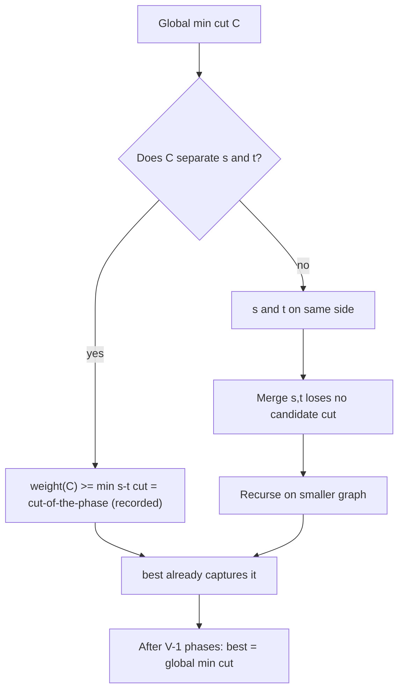
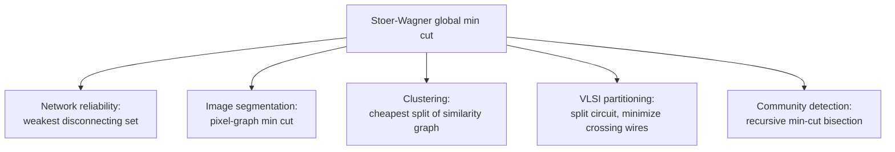

# Stoer-Wagner Global Minimum Cut — Middle Level

> **Focus:** *Why* the cut-of-the-phase is always a minimum `s-t` cut, *why* merging is safe, *when* Stoer-Wagner beats running max-flow `V-1` times, and how the heap variant shifts the complexity from `O(V³)` to `O(V·E + V² log V)`.

---

## Table of Contents

1. [Introduction](#introduction)
2. [Deeper Concepts](#deeper-concepts)
3. [Comparison with Alternatives](#comparison-with-alternatives)
4. [Advanced Patterns](#advanced-patterns)
5. [Graph Applications](#graph-applications)
6. [The Heap Variant](#the-heap-variant)
7. [Code Examples](#code-examples)
8. [Error Handling](#error-handling)
9. [Performance Analysis](#performance-analysis)
10. [Best Practices](#best-practices)
11. [Visual Animation](#visual-animation)
12. [Summary](#summary)

---

## Introduction

At junior level Stoer-Wagner is "grow `A`, record the last vertex's connection weight, merge, repeat." At middle level you start asking the *engineering* and *correctness* questions that decide whether you ship a correct, fast implementation or a subtly broken one:

- *Why* is the cut-of-the-phase guaranteed to be a minimum `s-t` cut for the last two vertices added?
- *Why* is it safe to throw away every other cut and only keep the `(s, t)`-separating one — i.e., why is merging correct?
- *When* should I prefer Stoer-Wagner over the obvious "run max-flow from a fixed source to all `V-1` sinks" approach?
- *How* does the heap-based ordering reduce `O(V³)` to `O(V·E + V² log V)`, and when does that actually help?
- *How* do I recover the actual partition, not just the cut weight?

The central insight — and the reason the algorithm is famous for its simplicity — is the **cut-of-the-phase lemma**. Everything else (merging, the `V-1` repetition, the final answer) follows from it.

---

## Deeper Concepts

### The cut-of-the-phase lemma (intuition)

Fix a phase. The maximum-adjacency ordering produces a sequence `a₁, a₂, …, a_m` of all current vertices, where each `aᵢ` was the most-connected vertex to `A = {a₁, …, aᵢ₋₁}` when it was added. Let `s = a_{m-1}` and `t = a_m` be the last two.

> **Lemma.** The cut-of-the-phase `({t}, V\{t})` is a **minimum `s-t` cut** of the current graph.

In words: *of all the ways to separate `s` from `t`, simply isolating `t` is the cheapest.* This is surprising — there could be exponentially many `s-t` cuts, yet the loosely-connected last vertex `t` always gives the minimum. The full induction is in `professional.md`, but the intuition is: because `t` was added *last*, every other vertex was pulled into `A` ahead of it, so `t` is the most weakly attached vertex, and any cut separating `s` from `t` must cut at least as much weight as `t`'s total attachment.

### Why merging is correct (the reduction)

Here is the crucial logical step. After a phase we know:

> The best cut that **separates `s` from `t`** has weight `w(A, t)` (the cut-of-the-phase).

The global minimum cut either separates `s` and `t`, or it does not:

- **If it separates them**, then its weight is `≥` the minimum `s-t` cut `= w(A, t)`, which we already recorded. So we have already captured (a lower bound on) it.
- **If it does NOT separate them** — i.e. `s` and `t` are on the *same* side — then nothing changes if we **fuse `s` and `t` into one vertex**: every cut keeping them together survives the merge with the same weight.

So after recording `w(A, t)`, we lose nothing by merging `s` and `t`: we have already accounted for every cut that splits them, and the merge only restricts us to cuts that keep them together — which is fine, because we have exhausted the splitting case. Inductively, after `V-1` merges we have considered enough `(s, t)` pairs that the global minimum is guaranteed to equal the smallest recorded cut-of-the-phase.



### The maximum-adjacency ordering as a "legal ordering"

The ordering rule — always add the vertex with the largest `w(A, v)` — produces what the paper calls a **legal ordering** (also "maximum adjacency ordering" or "MA ordering"). It is structurally identical to **Prim's MST** and to **Dijkstra**, all of which greedily extend a set by the locally-best key. The difference is the key:

| Algorithm | Key for choosing next vertex | Combine |
|-----------|------------------------------|---------|
| Prim's MST | single cheapest edge to `A` | `min` of one edge |
| Dijkstra | shortest distance via `A` | `dist[u] + w(u,v)` |
| Stoer-Wagner phase | **total** weight to `A` | sum of *all* edges to `A` |

That "sum of all edges to `A`" is what makes the cut-of-the-phase lemma hold. It is not a path or tree property — it is a *cut* property.

### What the algorithm computes overall

```
best = +infinity
while graph has > 1 vertex:
    ordering = maximum-adjacency order of current vertices
    s, t = last two in ordering
    best = min(best, w(A, t))        # cut-of-the-phase
    merge(s, t)
return best
```

Each phase is `O(V²)` (selecting `V` vertices, each scan `O(V)`), and there are `V-1` phases → `O(V³)`.

---

## Comparison with Alternatives

| Attribute | Stoer-Wagner | Max-flow ×(V-1) (fixed source) | Karger / Karger-Stein |
|-----------|--------------|-------------------------------|------------------------|
| Problem | Global min cut | Global min cut | Global min cut |
| Graph type | **Undirected** | Directed or undirected | **Undirected** |
| Weights | Non-negative | Non-negative | Non-negative |
| Determinism | **Deterministic** | Deterministic | **Randomized** (Monte Carlo) |
| Time | `O(V³)` or `O(V·E + V² log V)` | `(V-1) × flow ≈ O(V² E)` or worse | `O(V² log³ V)` (Karger-Stein) |
| Implementation | **Simple** (one matrix) | Needs a full max-flow engine | Moderate; needs repetition for confidence |
| Best regime | Dense, moderate `V` | When you already have a flow library | Very large graphs, willing to accept failure prob. |
| Min-cut value error | Exact | Exact | Exact w.h.p. (repeat to amplify) |

**Why not just run max-flow `V-1` times?**

The naive global-min-cut reduction picks one fixed vertex `p` and computes the minimum `p-q` cut for every other `q` — `V-1` max-flow computations — because the global min cut must separate `p` from *some* vertex. Each max-flow is itself expensive (`O(VE)` for Dinic on unit-ish graphs, worse in general). Stoer-Wagner replaces all of that with `V-1` cheap maximum-adjacency scans and **never computes a flow at all**. On a dense graph it is dramatically simpler and faster, and the code is a fraction of the size of a flow engine.

**Rules of thumb:**

- **Undirected, dense, moderate `V` (≤ a few hundred):** Stoer-Wagner array version. Simplest and fast.
- **Undirected, sparse, larger `V`:** Stoer-Wagner with a heap (`O(V·E + V² log V)`), or Karger-Stein if you can tolerate a small failure probability.
- **Directed graph:** Stoer-Wagner does not apply; use max-flow with the appropriate source/sink reasoning.
- **You already need a flow engine for other reasons:** the `V-1` max-flow approach may be acceptable, but it is rarely the better choice for *global* cuts.

---

## Advanced Patterns

### Pattern: Initialize `best` with the minimum weighted degree

The weighted degree of any single vertex `v` (sum of its incident edge weights) is itself a valid cut: `({v}, rest)`. So the **minimum weighted degree** is an immediate upper bound on the global min cut. Seeding `best` with it lets you prune and gives a sanity check.

#### Go

```go
func minWeightedDegree(n int, w [][]int) int {
	best := 1 << 60
	for i := 0; i < n; i++ {
		deg := 0
		for j := 0; j < n; j++ {
			deg += w[i][j]
		}
		if deg < best {
			best = deg
		}
	}
	return best
}
```

#### Java

```java
static int minWeightedDegree(int n, int[][] w) {
    int best = Integer.MAX_VALUE;
    for (int i = 0; i < n; i++) {
        int deg = 0;
        for (int j = 0; j < n; j++) deg += w[i][j];
        best = Math.min(best, deg);
    }
    return best;
}
```

#### Python

```python
def min_weighted_degree(n, w):
    return min(sum(w[i]) for i in range(n))
```

### Pattern: Recover the actual partition

Track, for each (super-)vertex, the set of original vertices it represents. When a new best cut-of-the-phase is found, the isolated side is exactly the group of the **last vertex `t`**.

#### Go

```go
// groups[v] holds the original vertices fused into super-vertex v.
// On a new best, record append(append([]int{}, groups[last]...)) as one side.
func recordCut(best *int, val int, last int, groups [][]int, bestSide *[]int) {
	if val < *best {
		*best = val
		*bestSide = append([]int{}, groups[last]...)
	}
}
```

#### Java

```java
// On merge(prev, last): groups.get(prev).addAll(groups.get(last));
// On a new best: bestSide = new ArrayList<>(groups.get(last));
```

#### Python

```python
groups = [{v} for v in range(n)]   # super-vertex -> set of originals
# on new best: best_side = set(groups[last])
# on merge:    groups[prev] |= groups[last]
```

---

## Graph Applications



- **Network reliability.** The global min cut is the *edge connectivity* (weighted): the minimum total capacity you must remove to disconnect the network. It identifies the network's weakest point.
- **Image segmentation.** Build a graph where pixels are vertices and edge weights encode similarity; a min cut separates foreground from background. (Normalized-cut variants extend this idea.)
- **Clustering.** Recursively bisect a similarity graph by min cut to build a hierarchy of clusters.
- **VLSI / circuit partitioning.** Split a circuit across two chips while minimizing the number/weight of wires that cross the boundary.

### Using the phase to compute edge connectivity

For an *unweighted* undirected graph, set all edge weights to `1`. The global min cut weight is then the **edge connectivity** `λ(G)` — the minimum number of edges whose removal disconnects the graph.

#### Go

```go
// Edge connectivity = Stoer-Wagner with all weights = 1.
func edgeConnectivity(n int, adj [][]bool) int {
	w := make([][]int, n)
	for i := range w {
		w[i] = make([]int, n)
		for j := range w[i] {
			if adj[i][j] {
				w[i][j] = 1
			}
		}
	}
	return stoerWagner(n, w)
}
```

#### Java

```java
static int edgeConnectivity(int n, boolean[][] adj) {
    int[][] w = new int[n][n];
    for (int i = 0; i < n; i++)
        for (int j = 0; j < n; j++)
            if (adj[i][j]) w[i][j] = 1;
    return StoerWagner.minCut(n, w);
}
```

#### Python

```python
def edge_connectivity(n, adj):
    w = [[1 if adj[i][j] else 0 for j in range(n)] for i in range(n)]
    return stoer_wagner(n, w)
```

---

## The Heap Variant

The array version scans all `V` candidates each time it adds a vertex — `O(V²)` per phase. With a **max-priority-queue** keyed on `w(A, v)`, selecting the maximum becomes `O(log V)` and each key increase is a `decrease-key`-style update. This is the same optimization that turns `O(V²)` Prim into `O(E log V)` Prim.

```
per phase:
  build max-heap of all current vertices, keys = 0
  repeat until heap empty:
     extract-max → vertex v   (O(log V))
     for each edge (v, u) with u still in heap:  increase key[u] by w(v,u)  (O(log V))
```

Total per phase: `O(E + V log V)`. Over `V-1` phases: **`O(V·E + V² log V)`**. On sparse graphs (`E ≈ V`) this is far better than `O(V³)`; on dense graphs (`E ≈ V²`) the two are comparable and the array version's lower constant often wins.

| Variant | Per phase | Total | Best on |
|---------|-----------|-------|---------|
| Array (dense matrix) | `O(V²)` | `O(V³)` | Dense graphs, small `V` |
| Binary heap | `O(E + V log V)` | `O(V·E + V² log V)` | Sparse graphs |
| Fibonacci heap (theoretical) | `O(E + V log V)` amortized | `O(V·E + V² log V)` | Asymptotic interest |

---

## Code Examples

### Heap-based phase (Python, using a max-heap via negation)

#### Go

```go
package main

import (
	"container/heap"
	"fmt"
)

// A max-heap of (key, vertex). We store negative keys in a min-heap.
type item struct{ key, v int }
type maxHeap []item

func (h maxHeap) Len() int            { return len(h) }
func (h maxHeap) Less(i, j int) bool  { return h[i].key > h[j].key } // max
func (h maxHeap) Swap(i, j int)       { h[i], h[j] = h[j], h[i] }
func (h *maxHeap) Push(x interface{}) { *h = append(*h, x.(item)) }
func (h *maxHeap) Pop() interface{} {
	old := *h
	n := len(old)
	it := old[n-1]
	*h = old[:n-1]
	return it
}

// Phase using adjacency lists adj[v] = list of (neighbor, weight) among alive vertices.
// Returns cut-of-the-phase weight, s, t. (Keys re-pushed on update — lazy deletion.)
func minCutPhaseHeap(alive []int, adj map[int][][2]int) (int, int, int) {
	key := map[int]int{}
	inA := map[int]bool{}
	for _, v := range alive {
		key[v] = 0
	}
	h := &maxHeap{}
	for _, v := range alive {
		heap.Push(h, item{0, v})
	}
	order := []int{}
	for h.Len() > 0 {
		top := heap.Pop(h).(item)
		v := top.v
		if inA[v] || top.key != key[v] {
			continue // stale entry
		}
		inA[v] = true
		order = append(order, v)
		for _, e := range adj[v] {
			u, wuv := e[0], e[1]
			if !inA[u] {
				key[u] += wuv
				heap.Push(h, item{key[u], u})
			}
		}
	}
	t := order[len(order)-1]
	s := order[len(order)-2]
	return key[t], s, t
}

func main() {
	// (wiring of adj lists omitted for brevity)
	fmt.Println("heap-based phase ready")
}
```

#### Java

```java
import java.util.*;

public class HeapPhase {
    // adj.get(v) = list of int[]{neighbor, weight} among alive vertices.
    // Returns {cutWeight, s, t}.
    static int[] minCutPhase(List<Integer> alive, Map<Integer, List<int[]>> adj) {
        Map<Integer, Integer> key = new HashMap<>();
        Set<Integer> inA = new HashSet<>();
        for (int v : alive) key.put(v, 0);

        // max-heap by key
        PriorityQueue<int[]> pq =
            new PriorityQueue<>((a, b) -> Integer.compare(b[0], a[0])); // {key, v}
        for (int v : alive) pq.add(new int[]{0, v});

        List<Integer> order = new ArrayList<>();
        while (!pq.isEmpty()) {
            int[] top = pq.poll();
            int v = top[1];
            if (inA.contains(v) || top[0] != key.get(v)) continue; // stale
            inA.add(v);
            order.add(v);
            for (int[] e : adj.getOrDefault(v, List.of())) {
                int u = e[0], w = e[1];
                if (!inA.contains(u)) {
                    key.put(u, key.get(u) + w);
                    pq.add(new int[]{key.get(u), u});
                }
            }
        }
        int t = order.get(order.size() - 1);
        int s = order.get(order.size() - 2);
        return new int[]{key.get(t), s, t};
    }
}
```

#### Python

```python
import heapq


def min_cut_phase_heap(alive, adj):
    """alive: list of vertex ids. adj[v]: list of (neighbor, weight).
    Returns (cut_of_phase_weight, s, t). Uses a lazy max-heap."""
    key = {v: 0 for v in alive}
    in_a = set()
    heap = [(0, v) for v in alive]  # max-heap via negation below
    heap = [(-k, v) for (k, v) in heap]
    heapq.heapify(heap)
    order = []

    while heap:
        neg_k, v = heapq.heappop(heap)
        if v in in_a or -neg_k != key[v]:
            continue  # stale entry
        in_a.add(v)
        order.append(v)
        for u, w in adj.get(v, []):
            if u not in in_a:
                key[u] += w
                heapq.heappush(heap, (-key[u], u))

    t, s = order[-1], order[-2]
    return key[t], s, t
```

---

## Error Handling

| Scenario | What goes wrong | Correct approach |
|----------|-----------------|------------------|
| Stale heap entries | Old `(key, v)` pairs linger after `decrease-key` | Lazy deletion: skip if `inA[v]` or `top.key != key[v]`. |
| Asymmetric matrix slips in | A directed edge breaks the cut lemma | Validate `w[i][j] == w[j][i]`; symmetrize on input. |
| Negative weight slips in | MA ordering proof fails silently | Reject negatives; assert all weights `>= 0`. |
| Merge updates both endpoints | Double-counting if you forget symmetry | Update both `w[s][v] += w[t][v]` and `w[v][s] += w[v][t]`. |
| Fewer than 2 vertices | No cut exists | Require `V >= 2` up front. |

---

## Performance Analysis

#### Go

```go
import (
	"fmt"
	"math/rand"
	"time"
)

func benchmark() {
	for _, n := range []int{50, 100, 200, 400} {
		w := make([][]int, n)
		for i := range w {
			w[i] = make([]int, n)
		}
		for i := 0; i < n; i++ {
			for j := i + 1; j < n; j++ {
				x := rand.Intn(10)
				w[i][j], w[j][i] = x, x
			}
		}
		start := time.Now()
		stoerWagner(n, w)
		fmt.Printf("n=%4d: %v\n", n, time.Since(start))
	}
}
```

#### Java

```java
public static void benchmark() {
    java.util.Random rnd = new java.util.Random(1);
    for (int n : new int[]{50, 100, 200, 400}) {
        int[][] w = new int[n][n];
        for (int i = 0; i < n; i++)
            for (int j = i + 1; j < n; j++) {
                int x = rnd.nextInt(10);
                w[i][j] = w[j][i] = x;
            }
        long start = System.nanoTime();
        StoerWagner.minCut(n, w);
        System.out.printf("n=%4d: %.1f ms%n", n, (System.nanoTime() - start) / 1e6);
    }
}
```

#### Python

```python
import random, time


def benchmark():
    for n in [50, 100, 200, 400]:
        w = [[0] * n for _ in range(n)]
        for i in range(n):
            for j in range(i + 1, n):
                x = random.randint(0, 9)
                w[i][j] = w[j][i] = x
        start = time.perf_counter()
        stoer_wagner(n, w)
        print(f"n={n:4d}: {(time.perf_counter()-start)*1000:.1f} ms")
```

Expect the array version to scale cubically: doubling `n` roughly multiplies time by `8`.

---

## Best Practices

- Implement the array version first, validate against a brute-force subset checker on `V <= 12`, *then* add the heap.
- Seed `best` with the minimum weighted degree to prune and sanity-check.
- Symmetrize and validate the input matrix before running.
- Keep the merge logic symmetric — update both halves of the matrix.
- For the heap variant, use lazy deletion (skip stale entries) rather than a real decrease-key unless your heap supports it.
- Document complexity (`O(V³)` array, `O(V·E + V² log V)` heap) and the undirected / non-negative preconditions in comments.

---

## Visual Animation

> See [`animation.html`](./animation.html) for interactive visualization.
>
> Middle-level viewing tips:
> - Watch the `w(A, v)` keys grow as `A` expands — the next vertex is always the max.
> - The **last two added** (`s`, `t`) are the merge pair; the cut-of-the-phase is `t`'s key.
> - The running global minimum updates only when a phase beats the previous best.
> - After the merge, see edge weights to shared neighbors **add together**.

---

## Summary

At middle level, Stoer-Wagner is understood through the **cut-of-the-phase lemma** (isolating the last-added vertex `t` is a minimum `s-t` cut) and the **merge reduction** (once you have the best `s-t`-separating cut, fusing `s` and `t` loses no candidate). Together they justify the "`V-1` phases, take the minimum" structure. Prefer Stoer-Wagner over `V-1` max-flow runs for undirected global cuts — it is simpler and faster. Use the array version for dense graphs and the heap variant (`O(V·E + V² log V)`) for sparse ones. Always validate undirected, non-negative input.

---

## Next step:

Continue to [`senior.md`](./senior.md) to see how global min cut powers clustering and image-segmentation systems, how to scale it on dense vs sparse graphs, and where it fits in a production pipeline.

---
