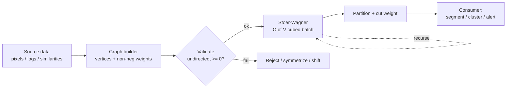
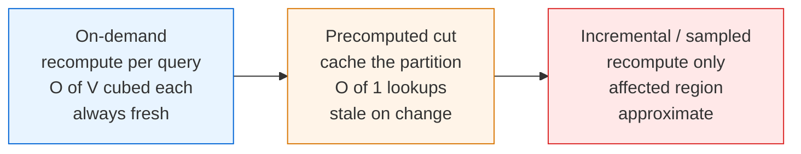
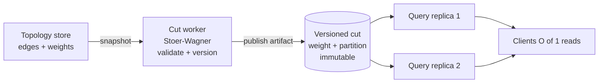
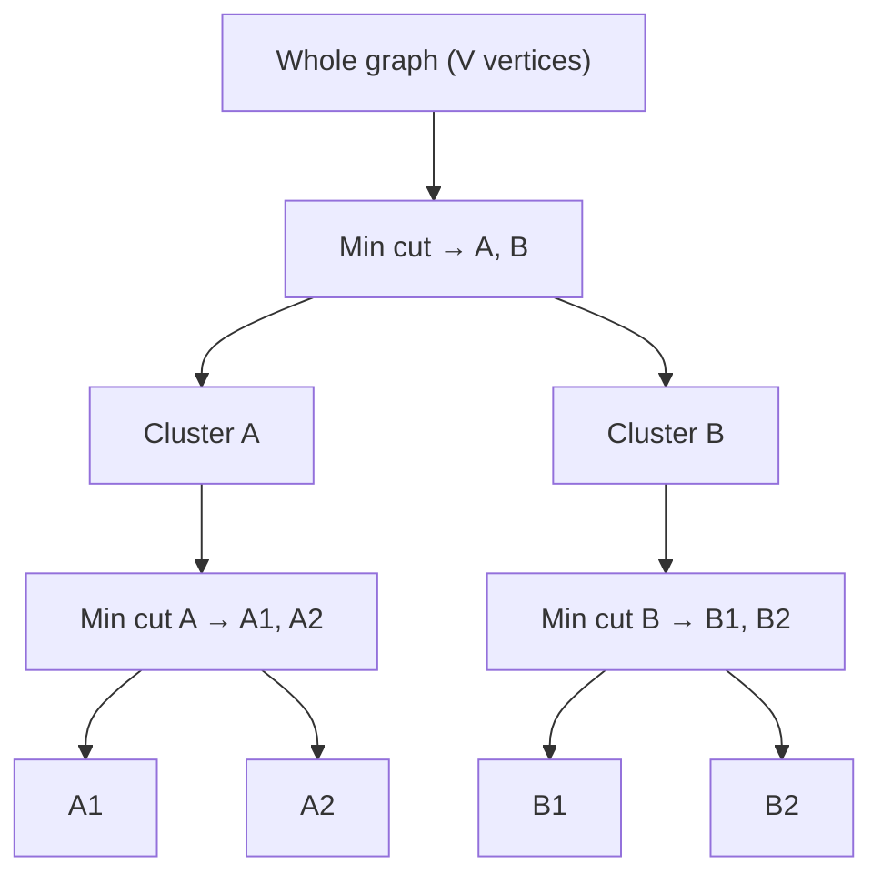
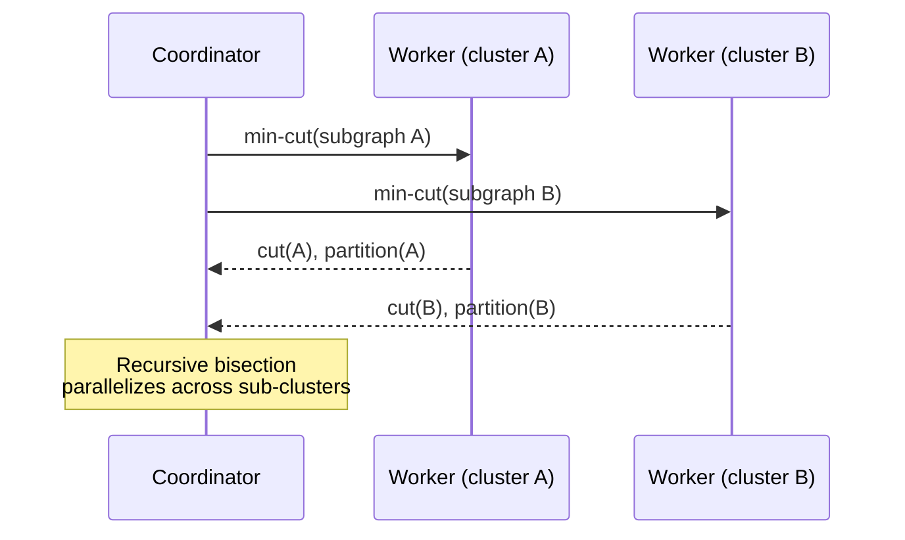
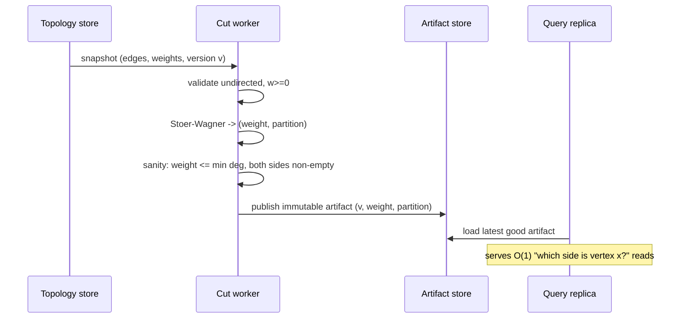
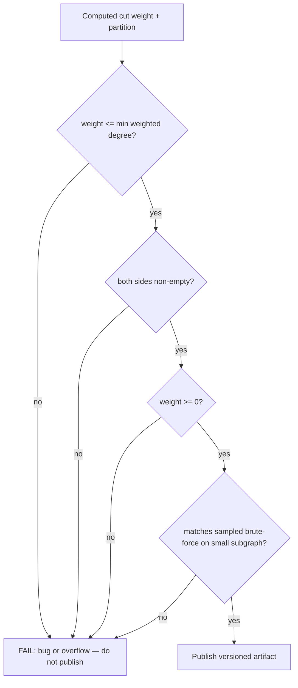

# Stoer-Wagner Global Minimum Cut — Senior Level

> Stoer-Wagner is rarely the bottleneck on a 200-vertex toy graph — but the moment a global min cut becomes the engine behind a clustering service, an image-segmentation pipeline, or a network-reliability monitor, every property (cubic time, quadratic memory, undirected-only, full recompute on change, no streaming) turns into a capacity-planning and architecture decision.

## Table of Contents

1. [Introduction](#1-introduction)
2. [System Design with Global Min Cut](#2-system-design-with-global-min-cut)
3. [Clustering and Segmentation Systems](#3-clustering-and-segmentation-systems)
4. [Scaling: Dense vs Sparse](#4-scaling-dense-vs-sparse)
5. [Comparison at Scale](#5-comparison-at-scale)
6. [Concurrency and Parallelism](#6-concurrency-and-parallelism)
7. [Code Examples](#7-code-examples)
8. [Observability](#8-observability)
9. [Failure Modes](#9-failure-modes)
10. [Capacity Planning](#10-capacity-planning)
11. [Summary](#11-summary)

---

## 1. Introduction

At the senior level the question is no longer "how does the phase work" but "where does a global min cut belong in my system, and what breaks when it does?" Stoer-Wagner produces a single number (and optionally a partition) in `O(V³)` time and `O(V²)` memory on an undirected graph. That description alone tells you several things:

- It is an **offline, batch** computation, not online/streaming. A new edge means re-running.
- Its working set is **`O(V²)`** (the dense matrix) — a hard wall as `V` grows.
- It is **undirected and non-negative only** — directed/affinity-with-repulsion problems need a different tool.
- It returns the **single cheapest** split. If you need a *balanced* split or `k` clusters, you must wrap it (recursive bisection, normalized cuts).

The interesting senior decisions are therefore architectural:

1. Is "the global min cut" actually the quantity the product needs, or is it a proxy for something else (balanced partition, `k`-way cut, normalized cut)?
2. How do you fit and run a `V²` matrix when `V` is large, or the graph is naturally sparse?
3. How do you parallelize the cubic work, and what stays inherently sequential?
4. How do you keep the answer fresh as the graph mutates?
5. How do you observe and bound a job whose cost scales cubically?

---

## 2. System Design with Global Min Cut

### 2.1 Where the cut sits in a pipeline



The min cut is almost never consumed raw. It is wrapped by an application concern:

| Consumer | What it does with the cut |
|----------|---------------------------|
| Image segmentation | The cut partition = foreground / background mask. |
| Clustering | Recurse: bisect, then bisect each side, building a tree. |
| Network reliability | The cut **weight** = edge connectivity = the alert threshold. |
| Circuit partitioning | The cut partition = which gates go on which chip. |

### 2.2 Precompute vs on-demand



| Approach | When right | When wrong |
| --- | --- | --- |
| On-demand Stoer-Wagner | Graph changes between most queries; `V` small/medium. | High query rate on a static graph — you recompute the same `V³` repeatedly. |
| Precompute + cache | Static or slowly-changing graph; many reads of the same cut. | Graph mutates frequently; you serve stale partitions. |
| Incremental / sampled | Huge graph, changes are local, approximate answers acceptable. | You need the exact global optimum every time. |

The most expensive mistake is recomputing a `V³` cut for a graph that mutates every few seconds while serving thousands of identical queries — pay once, cache the partition, and invalidate on topology change.

### 2.3 Anatomy of a min-cut service

A production min-cut service decouples into three stages, each with its own scaling and failure profile:

1. **Graph builder / topology store.** Owns *what the graph is* — vertices, edges, non-negative weights. It validates undirectedness and non-negativity, deduplicates parallel edges (summing weights), and emits a consistent snapshot. It does **not** compute cuts.
2. **Cut worker.** A batch job that takes a snapshot, runs (array or heap) Stoer-Wagner, validates the result (cut weight `<=` min weighted degree, partition non-empty on both sides), and publishes a versioned immutable artifact: the cut weight plus the partition.
3. **Query / consumer layer.** A stateless tier that reads the current artifact and answers "which side is vertex `v` on?" / "what is the edge connectivity?" in `O(1)`. It scales with query rate, independent of `V`.



Build and serve are fully separated: a build can fail or run long without the query tier noticing — it keeps serving the last good cut. Versioning the artifact (content hash + `V` + build timestamp) lets every answer be traced back to a specific topology snapshot.

---

## 3. Clustering and Segmentation Systems

### 3.1 Recursive min-cut clustering

A single global min cut splits a graph into **two** clusters. To get a hierarchy or `k` clusters, recurse: cut, then cut each side, until a stopping rule fires (cut weight exceeds a threshold, or cluster size is small enough).



The catch: a *pure* global min cut tends to "shave off" a single weakly-connected vertex rather than produce a balanced split. That is the **degenerate cut** problem. Real clustering systems counter it with:

- **Normalized cut** (Shi & Malik): divide the cut weight by the volume of each side, penalizing tiny pieces. This changes the objective and is NP-hard; it is solved approximately via spectral methods, *not* Stoer-Wagner directly.
- **Size constraints:** reject cuts that isolate fewer than `m` vertices; among legal cuts, take the cheapest.
- **Stoer-Wagner as a subroutine** inside a larger balanced-partition heuristic.

> Senior takeaway: Stoer-Wagner gives you the *exact cheapest* cut. Whether "cheapest" is the *right* objective for your clustering/segmentation product is a separate, often harder, modeling decision.

### 3.2 Image segmentation

In graph-based segmentation, each pixel is a vertex; edges connect neighboring pixels with weight = similarity (close color/intensity → high weight). A global min cut separates the image into two regions along low-similarity boundaries. The grid is naturally **sparse** (each pixel has ~4–8 neighbors), so the **heap variant** (`O(V·E + V² log V)`) — or, in practice, a max-flow/min-cut formulation with seeds — is preferred over the dense `O(V³)` array version. For an `N×N` image, `V = N²` is enormous, so production systems use specialized max-flow (Boykov-Kolmogorov) or superpixel pre-aggregation to shrink `V`.

### 3.3 Network reliability monitoring

Here the cut **weight** is the product, not the partition: the global min cut equals the (weighted) **edge connectivity** — the minimum total capacity an adversary or failure must remove to disconnect the network. A monitor recomputes it on topology changes and alerts when it drops below a safety threshold. Because topology changes are infrequent relative to queries, this is a natural precompute-and-cache workload.

### 3.4 Keeping the answer fresh — incremental strategies

The hard truth is that there is **no simple incremental Stoer-Wagner**: a single edge change can move the global min cut anywhere, and the merge structure is destroyed by any topology change. Three pragmatic strategies dominate production:

| Strategy | Idea | Trade-off |
|----------|------|-----------|
| Full recompute (debounced) | Batch changes over a window, recompute once | Simple, correct; stale within the window |
| Bound-guarded skip | Track `min weighted degree`; if it did not drop, the cut can only have stayed the same or risen for weight increases | Cheap monotone reasoning; only safe for one-sided changes |
| Sampled / approximate | Run Karger on a sampled subgraph for a fast estimate; full recompute on a slower cadence | Fast signal, occasional exactness |

The bound-guarded skip is worth elaborating: **increasing** an edge weight can only **increase or preserve** the global min cut, and **decreasing** it can only **decrease or preserve** it. So a monitor watching for "did connectivity drop below threshold?" only needs a full recompute when weights *decrease* or edges are *removed* — weight increases never trip the alert. This one-sided monotonicity often cuts recompute frequency by an order of magnitude in practice.

---

## 4. Scaling: Dense vs Sparse

The single most important scaling decision is the graph's density, because it dictates the implementation.

| Property | Dense (`E ≈ V²`) | Sparse (`E ≈ V`) |
|----------|------------------|-------------------|
| Representation | Adjacency **matrix** | Adjacency **lists** |
| Best variant | Array `O(V³)` | Heap `O(V·E + V² log V)` |
| Memory | `O(V²)` (unavoidable) | `O(V + E)` |
| Cache behavior | Excellent (matrix sweeps) | Poorer (pointer chasing) |
| Practical `V` ceiling | ~1–2k (matrix fits, `V³` tolerable) | larger, but `V² log V` term still bites |

### Dense regime

The array version is cache-friendly: each phase sweeps the matrix linearly. Use a **flat 1D matrix** (`w[i*n+j]`) and keep `w(A, v)` keys in a contiguous array. At `V = 1000`, `V³ = 10⁹` operations per full run — seconds in a compiled language, minutes in Python. Memory: `V² = 10⁶` cells ≈ 4–8 MB. Fine.

### Sparse regime

The matrix wastes `O(V²)` memory for `O(V)` real edges. Switch to adjacency lists + a max-heap. But note the `V² log V` term in the heap bound — it comes from the `V-1` phases each doing `O(V log V)` heap work even on a sparse graph. So Stoer-Wagner is **never truly linear**; for very large sparse graphs where `V²` itself is prohibitive, switch algorithms (Karger-Stein, or near-linear deterministic min-cut algorithms).

### Shrinking `V` before running

The most effective scaling trick is often **reducing `V`** before the cut:

- **Superpixels / supernodes:** pre-cluster obviously-together vertices and run the cut on the contracted graph.
- **Padberg-Rinaldi / safe contractions:** there are provably-safe edge contractions that never destroy the min cut, shrinking the graph first.
- **Connectivity-based decomposition:** a known small cut lets you split the problem.

---

## 5. Comparison at Scale

| Approach | Time | Memory | Determinism | Best at scale |
|----------|------|--------|-------------|---------------|
| Stoer-Wagner (array) | `O(V³)` | `O(V²)` | Exact | Dense, `V` ≤ ~1–2k |
| Stoer-Wagner (heap) | `O(V·E + V² log V)` | `O(V+E)` | Exact | Sparse, moderate `V` |
| Max-flow × (V-1) | `O(V² E)`+ | depends | Exact | Rarely best for *global* cut |
| Karger-Stein | `O(V² log³ V)` | `O(V²)` | Monte Carlo (repeat) | Very large; tolerate failure prob. |
| Spectral / normalized cut | `O(V²)`–`O(V³)` eigensolve | `O(V²)` | Approximate | When *balanced* cut is the goal |

At scale, the deciding factors are: **is the graph dense or sparse**, **do you need the exact optimum or is approximate fine**, and **is the objective truly "cheapest cut" or actually "balanced cut."**

---

## 6. Concurrency and Parallelism

Stoer-Wagner has a fundamentally **sequential outer structure**: phase `p+1` operates on the graph *after* phase `p`'s merge, so phases cannot run in parallel. What *can* be parallelized:

- **Within a phase, the key updates.** After adding vertex `v` to `A`, the loop `key[u] += w[v][u]` over all remaining `u` is embarrassingly parallel (a vector add). On a `V`-wide matrix row this is a perfect SIMD / GPU operation.
- **The selection (`argmax key`)** is a parallel reduction.
- **Multiple independent graphs** (e.g. recursive clustering on disjoint sub-clusters) run fully in parallel — different worker threads/processes.
- **Multiple random starts** are *not* needed (Stoer-Wagner is deterministic), unlike Karger which benefits from parallel repetition.



A thread-safe wrapper protects the shared best/partition; the per-phase matrix work is local to one worker.

### Thread-safe service wrapper

#### Go

```go
package main

import "sync"

// CutCache caches the latest computed cut behind an RWMutex.
type CutCache struct {
	mu     sync.RWMutex
	weight int
	side   []int // one side of the partition
	ver    uint64
}

func (c *CutCache) Get() (int, []int, uint64) {
	c.mu.RLock()
	defer c.mu.RUnlock()
	return c.weight, append([]int(nil), c.side...), c.ver
}

func (c *CutCache) Update(weight int, side []int, ver uint64) {
	c.mu.Lock()
	defer c.mu.Unlock()
	if ver > c.ver { // monotonic versioning
		c.weight, c.side, c.ver = weight, append([]int(nil), side...), ver
	}
}
```

#### Java

```java
import java.util.*;
import java.util.concurrent.locks.ReentrantReadWriteLock;

public class CutCache {
    private final ReentrantReadWriteLock lock = new ReentrantReadWriteLock();
    private int weight = Integer.MAX_VALUE;
    private List<Integer> side = List.of();
    private long ver = 0;

    public synchronized void update(int w, List<Integer> s, long v) {
        lock.writeLock().lock();
        try {
            if (v > ver) { weight = w; side = new ArrayList<>(s); ver = v; }
        } finally { lock.writeLock().unlock(); }
    }

    public int[] getWeightAndVer() {
        lock.readLock().lock();
        try { return new int[]{weight, (int) ver}; }
        finally { lock.readLock().unlock(); }
    }
}
```

#### Python

```python
import threading


class CutCache:
    def __init__(self):
        self._lock = threading.RLock()
        self._weight = float("inf")
        self._side = []
        self._ver = 0

    def update(self, weight, side, ver):
        with self._lock:
            if ver > self._ver:
                self._weight, self._side, self._ver = weight, list(side), ver

    def get(self):
        with self._lock:
            return self._weight, list(self._side), self._ver
```

---

### 6.1 Architecture pattern — build/serve split with versioned artifacts



The invariant that makes this robust: the **artifact is the contract**. A failed or slow build never affects the query tier — it keeps serving the last good version. Each answer is traceable to a topology snapshot via the version stamp. This is the same precompute-and-serve shape used for the Floyd-Warshall distance-matrix service, specialized to a single cut artifact.

## 7. Code Examples

### Parallel key-update phase (Go, goroutine fan-out)

The hot inner loop — updating every remaining vertex's key after a vertex joins `A` — parallelizes cleanly across CPU cores.

#### Go

```go
package main

import (
	"sync"
)

// parallelKeyUpdate adds row w[sel] into key[] for all not-yet-added vertices,
// splitting the work across `workers` goroutines.
func parallelKeyUpdate(key []int, row []int, inA, merged []bool, workers int) {
	n := len(key)
	var wg sync.WaitGroup
	chunk := (n + workers - 1) / workers
	for start := 0; start < n; start += chunk {
		end := start + chunk
		if end > n {
			end = n
		}
		wg.Add(1)
		go func(lo, hi int) {
			defer wg.Done()
			for v := lo; v < hi; v++ {
				if !merged[v] && !inA[v] {
					key[v] += row[v]
				}
			}
		}(start, end)
	}
	wg.Wait()
}
```

#### Java

```java
import java.util.concurrent.*;

public class ParallelPhase {
    static final ExecutorService POOL =
        Executors.newFixedThreadPool(Runtime.getRuntime().availableProcessors());

    static void parallelKeyUpdate(int[] key, int[] row, boolean[] inA,
                                  boolean[] merged, int workers) throws Exception {
        int n = key.length, chunk = (n + workers - 1) / workers;
        var tasks = new java.util.ArrayList<Callable<Void>>();
        for (int s = 0; s < n; s += chunk) {
            final int lo = s, hi = Math.min(s + chunk, n);
            tasks.add(() -> {
                for (int v = lo; v < hi; v++)
                    if (!merged[v] && !inA[v]) key[v] += row[v];
                return null;
            });
        }
        for (var f : POOL.invokeAll(tasks)) f.get();
    }
}
```

#### Python

```python
# Python's GIL makes thread-level key updates pointless for CPU work.
# Use NumPy to vectorize the whole key update into one C-level operation:
import numpy as np


def vectorized_key_update(key, row, available_mask):
    """key, row: 1-D int arrays. available_mask: bool array of vertices not yet in A."""
    key[available_mask] += row[available_mask]
    return key
```

---

## 8. Observability

| Metric | Why it matters | Alert threshold |
|--------|----------------|-----------------|
| `min_cut_build_seconds` | Cubic cost; watch for `V` growth | > SLA (e.g. > 30 s) |
| `graph_vertices` (`V`) | Drives `V³` / `V²` cost | sudden jump |
| `graph_density` (`E/V²`) | Decides array vs heap variant | crosses a tuning boundary |
| `current_min_cut_weight` | The product signal (reliability) | < safety threshold |
| `partition_balance` (min side / V) | Degenerate "single-vertex" cut detector | < some floor for clustering |
| `recompute_rate` | Are we recomputing identical graphs? | high + static graph = wasted work |
| `cut_cache_hit_ratio` | Is precompute paying off? | < 0.8 |

Always validate each result before publishing: cut weight `<=` min weighted degree (upper bound), both partition sides non-empty, and cut weight `>= 0`.

### 8.1 Result-validation gate (run before every publish)



These four checks are cheap relative to the `O(V³)` build and catch the most common failure classes: integer overflow (weight implausibly large or negative), degenerate empty partitions, and logic bugs (the sampled brute-force cross-check). A build that fails the gate keeps the previous good artifact live — never publish an unvalidated cut.

### 8.2 What to put on the dashboard

A practical min-cut service dashboard tracks three families of signals: **cost** (`build_seconds`, `V`, `density` — the cubic-curve early-warning), **correctness** (`validation_failures`, `partition_balance` — degenerate-cut detector), and **freshness** (`artifact_age`, `recompute_rate`, `cut_cache_hit_ratio`). The single most actionable alert is `build_seconds` trending toward the SLA as `V` grows, because the cubic term turns a comfortable margin into a breach faster than linear intuition expects.

---

## 9. Failure Modes

- **Degenerate cut (single vertex shaved off).** The exact min cut isolates one weakly-connected vertex, useless for clustering. *Fix:* size-constrained cuts or normalized-cut objective.
- **Directed/asymmetric input slips through.** Silent wrong answers. *Fix:* validate symmetry at ingest; reject or symmetrize.
- **Negative weights.** The MA-ordering proof fails. *Fix:* reject; shifting weights changes the answer, so it is not a safe fix.
- **Memory blow-up on large `V`.** `O(V²)` matrix exceeds RAM. *Fix:* sparse representation + heap variant, or shrink `V` via supernodes.
- **Recompute storm.** Every edge change triggers a full `V³` rebuild. *Fix:* batch/debounce changes; recompute on a schedule, serve cached cut in between.
- **Cubic blowup under growth.** `V` doubles → 8× slower, silently breaching SLA. *Fix:* alert on `V`; cap or pre-aggregate.

---

## 10. Capacity Planning

### 10.1 Memory

The dense matrix is `V²` integers. At 8 bytes/int:

| `V` | Matrix memory |
|-----|---------------|
| 500 | 2 MB |
| 1,000 | 8 MB |
| 5,000 | 200 MB |
| 10,000 | 800 MB |
| 50,000 | 20 GB (infeasible dense) |

Past ~10k vertices, a dense matrix is impractical; you *must* be sparse, which then makes the `V² log V` heap term and `O(V+E)` memory the relevant limits.

### 10.2 Time

`V³` operations. As a rough compiled-language guide (~10⁸–10⁹ simple ops/sec):

| `V` | `V³` | Array runtime (order) |
|-----|------|------------------------|
| 200 | 8×10⁶ | milliseconds |
| 500 | 1.25×10⁸ | ~tenths of a second |
| 1,000 | 10⁹ | ~seconds |
| 2,000 | 8×10⁹ | ~tens of seconds |

Python is 30–100× slower; use NumPy-vectorized key updates or a compiled core for `V > ~300`.

### 10.3 Worked sizing example

Suppose a service-mesh latency monitor with `V = 800` nodes, dense (`E ≈ V²/2`), recomputed whenever the mesh topology changes (~10 times/hour).

- **Memory:** `800² × 8 bytes ≈ 5 MB` for the matrix. Trivial; fits in L3-adjacent RAM comfortably.
- **Time:** `V³ = 5.1 × 10⁸` simple ops. In Go/Java at ~`5 × 10⁸` ops/sec, one run ≈ **~1 second**. At 10 rebuilds/hour, total CPU ≈ 10 s/hour — negligible.
- **Query tier:** the published artifact is the cut weight plus a partition bitmap (`800` bits ≈ 100 bytes). Query replicas serve `O(1)` reads at any QPS, independent of `V`.
- **Headroom:** if `V` grows to `2000`, the build jumps to `8 × 10⁹` ops ≈ **~16 seconds** and memory to ~32 MB — still fine, but now worth watching the cubic curve. At `V = 5000` (~125 s build, 200 MB) you should move to a sparse representation or pre-aggregate nodes.

The lesson: the cubic term is forgiving up to ~1–2k vertices when builds are infrequent, but you must alert on `V` so a silent growth spurt does not breach a build-time SLA.

### 10.4 Decision summary

- `V ≤ ~1k`, dense → array Stoer-Wagner, precompute + cache.
- `V` larger, sparse → heap Stoer-Wagner; consider shrinking `V` first.
- `V` very large or "balanced cut" needed → Karger-Stein or spectral/normalized-cut methods, not vanilla Stoer-Wagner.

---

### 10.5 When to abandon Stoer-Wagner entirely

It is a senior judgment call to recognize when the algorithm is simply the wrong tool, not merely badly tuned:

| Symptom | Root cause | Better tool |
|---------|-----------|-------------|
| Output is always a single-vertex cut, useless for product | You need a *balanced* split, not the cheapest | Normalized cut (spectral), Kernighan-Lin, METIS |
| `V` in the millions | Cubic time / quadratic memory infeasible | Karger near-linear, Kawarabayashi-Thorup (simple graphs) |
| Graph is directed | Symmetry assumption violated | Directed min cut via max-flow |
| Negative / repulsive weights | Proof preconditions fail | Correlation clustering, signed-graph methods |
| You need *the cut between two specific nodes* | Global search is wasted work | Single max-flow `s-t` |

The cost of using Stoer-Wagner where one of these applies is not just slowness — for the balanced-cut and directed cases it returns an answer to the *wrong question*, which is far more dangerous than a timeout.

## 11. Summary

At senior level, evaluate Stoer-Wagner against system-wide constraints: it is an offline, undirected, non-negative, `O(V³)` / `O(V²)` batch computation that returns the single cheapest cut. Decide whether "cheapest cut" is your actual objective (vs balanced/normalized cut), pick array (dense) or heap (sparse), separate build from serve, cache the partition, and parallelize the inner key-update while accepting that phases are inherently sequential. Watch for degenerate single-vertex cuts, validate input symmetry and non-negativity, and plan capacity around the cubic time and quadratic memory.

---

## Next step:

Continue to [`professional.md`](./professional.md) for the formal proof that the cut-of-the-phase is a minimum `s-t` cut, the merge-correctness argument, and the rigorous `O(V³)` complexity analysis.

---
