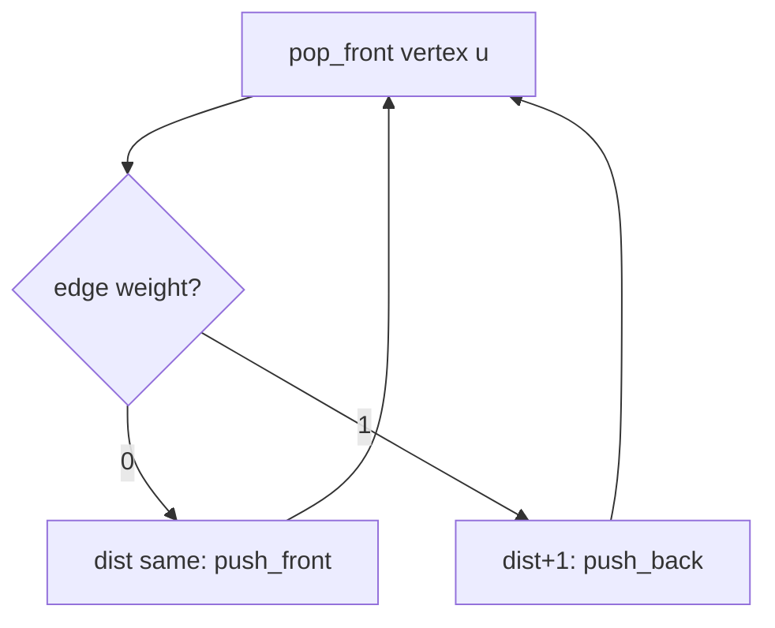

# 0-1 BFS — Junior Level

> **One-line summary:** 0-1 BFS finds shortest paths in a graph whose every edge weighs **either 0 or 1**, in `O(V + E)` time, by using a **double-ended queue (deque)** instead of a priority queue: relax a 0-weight edge with `push_front`, relax a 1-weight edge with `push_back`. It is the fast middle ground between plain BFS (unweighted only) and Dijkstra (general non-negative weights).

---

## Table of Contents

1. [Introduction](#introduction)
2. [Prerequisites](#prerequisites)
3. [Glossary](#glossary)
4. [Core Concepts](#core-concepts)
5. [Big-O Summary](#big-o-summary)
6. [Real-World Analogies](#real-world-analogies)
7. [Pros & Cons](#pros--cons)
8. [Step-by-Step Walkthrough](#step-by-step-walkthrough)
9. [Code Examples](#code-examples)
10. [Coding Patterns](#coding-patterns)
11. [Error Handling](#error-handling)
12. [Performance Tips](#performance-tips)
13. [Best Practices](#best-practices)
14. [Edge Cases & Pitfalls](#edge-cases--pitfalls)
15. [Common Mistakes](#common-mistakes)
16. [Cheat Sheet](#cheat-sheet)
17. [Visual Animation](#visual-animation)
18. [Summary](#summary)
19. [Further Reading](#further-reading)

---

## Introduction

You already know two shortest-path tools:

- **Plain BFS** (sibling topic 02-bfs) finds the fewest-edges path in an **unweighted** graph in `O(V + E)`. It works because a FIFO queue naturally processes vertices in non-decreasing distance order — every edge costs exactly `1`.
- **Dijkstra** (sibling topic 04-dijkstra) finds shortest paths with arbitrary **non-negative** weights, but it needs a priority queue and pays `O(E log V)`.

**0-1 BFS** lives in between. It solves the special — and surprisingly common — case where **every edge weight is 0 or 1**. In that case you do **not** need a logarithmic-factor priority queue. A plain double-ended queue (a *deque*) is enough, and you get the full `O(V + E)` speed of BFS while still respecting weights.

The whole idea fits in one sentence:

> When you relax an edge of weight **0**, push the neighbour to the **front** of the deque; when you relax an edge of weight **1**, push it to the **back**.

Why does this work? Because at any moment the deque holds vertices with **at most two distinct distance values** — some at distance `d` and some at distance `d + 1`, in that order from front to back. A 0-edge keeps you at the same distance `d`, so the neighbour belongs with the `d`-group at the front. A 1-edge moves you to `d + 1`, so the neighbour belongs with the `d + 1`-group at the back. The deque stays *sorted by distance* without ever sorting anything — exactly the property a priority queue would buy you, but for free.

This makes 0-1 BFS the go-to algorithm for a huge class of grid puzzles: "some moves are free, others cost 1." Examples you will meet over and over: *minimum number of obstacles to remove to cross a grid*, *minimum cost to make a path by rotating arrows in cells*, *teleporters that are free vs steps that cost one*. Whenever the cost alphabet is just `{0, 1}`, reach for 0-1 BFS.

---

## Prerequisites

Before reading this file you should be comfortable with:

- **Plain BFS** — the FIFO-queue layer-by-layer traversal (sibling 02-bfs). 0-1 BFS is a small mutation of it.
- **Graphs and adjacency lists** — vertices, edges, neighbours, weighted edges `(to, weight)`.
- **The deque (double-ended queue)** — a structure supporting `push_front`, `push_back`, `pop_front` in `O(1)`. In Go a slice or `container/list`; in Java `ArrayDeque`; in Python `collections.deque`.
- **The Dijkstra idea** (sibling 04-dijkstra) — "settle the closest vertex, relax its edges." 0-1 BFS is Dijkstra specialised to a 2-value weight set.
- **Arrays / 2D grids** — most applications are grid problems; a cell `(r, c)` is a vertex.
- **Big-O notation** — `O(V + E)`, `O(E log V)`.

Optional but helpful:

- The notion of **distance relaxation**: `if dist[u] + w < dist[v] then dist[v] = dist[u] + w`.

---

## Glossary

| Term | Meaning |
|------|---------|
| **0-1 BFS** | Shortest-path algorithm for graphs whose edges all weigh 0 or 1, running in `O(V + E)` using a deque. |
| **Deque (double-ended queue)** | A queue you can push to and pop from *both* ends in `O(1)`. The heart of 0-1 BFS. |
| **`push_front`** | Insert at the front (head) of the deque. Used when relaxing a **0**-weight edge. |
| **`push_back`** | Insert at the back (tail) of the deque. Used when relaxing a **1**-weight edge. |
| **Relaxation** | Trying to improve `dist[v]` via an edge `u → v`: `if dist[u] + w < dist[v]: dist[v] = dist[u] + w`. |
| **dist[]** | Array of best-known distances from the source. Initialised to `+∞` except `dist[src] = 0`. |
| **Stale entry** | A deque entry whose stored distance is larger than the current best `dist[v]`; it must be skipped on pop. |
| **Settled / finalised** | A vertex whose `dist` is provably optimal and will not change again. |
| **Monotone deque invariant** | The front-to-back order in the deque is non-decreasing by distance, with at most two distinct values `d` and `d+1`. |
| **Dial's algorithm** | The generalisation of 0-1 BFS to weights `0..k` using a bucket queue; runs in `O(V + E + maxDist)`. |

---

## Core Concepts

### 1. The graph model: weights are only 0 or 1

A 0-1 BFS graph has an adjacency list where each edge carries a weight in `{0, 1}`:

```
adj[u] = [ (v1, w1), (v2, w2), ... ]      with every wi ∈ {0, 1}
```

In grid problems the vertex is a cell `(r, c)` and the four moves are edges. A move into a "free" cell may cost `0`; a move that breaks an obstacle may cost `1`. The exact `0`/`1` mapping is what each problem defines.

### 2. The deque replaces the priority queue

Plain BFS uses a **FIFO queue**. Dijkstra uses a **priority queue (min-heap)**. 0-1 BFS uses a **deque** and decides which end to push to based on the edge weight:

```
relax edge (u -> v, w):
    if dist[u] + w < dist[v]:
        dist[v] = dist[u] + w
        if w == 0:  deque.push_front(v)     # stays in the same distance bucket
        else:       deque.push_back(v)       # moves to the next distance bucket
```

`pop_front` always returns a vertex with the smallest current distance — exactly like a priority queue's `extract-min`, but in `O(1)`.

### 3. Why the deque stays "almost sorted" (≤ 2 distance levels)

This is the key insight. Suppose you pop a vertex `u` with `dist[u] = d`. Every other vertex still in the deque has distance `d` or `d + 1` (this is an invariant we maintain). When you relax `u`'s edges:

- A **0-edge** gives a neighbour distance `d` → it joins the front group (distance `d`), so `push_front`.
- A **1-edge** gives a neighbour distance `d + 1` → it joins the back group (distance `d + 1`), so `push_back`.

Either way the deque never holds three distinct distance values, and the front always has the minimum. It is, in effect, a 2-bucket Dijkstra where the "buckets" are the front half and the back half of one deque.

### 4. Lazy distance check — skip stale entries

Because we may push the same vertex more than once (a later, shorter path can reach it), the deque can contain **stale** entries. When you pop a vertex, **re-check** its distance:

```
d, u = deque.pop_front()
if d > dist[u]:        # we already found something better — skip
    continue
```

Without this check the algorithm still terminates but wastes work re-expanding old states. (Some implementations store only the vertex and compare against a `done[]` flag instead — both are correct; see Pitfalls.)

### 5. Where 0-1 BFS sits among its cousins

```
unweighted graph        →  plain BFS         O(V+E)        FIFO queue
weights in {0,1}         →  0-1 BFS           O(V+E)        deque
weights in {0..k}        →  Dial's algorithm  O(V+E+maxD)   bucket queue
arbitrary non-negative   →  Dijkstra          O(E log V)    min-heap
```

If weights are not strictly `0/1`, **do not** use 0-1 BFS — use Dial's (small integer range) or Dijkstra (general).

---

## Big-O Summary

| Quantity | Cost | Notes |
|----------|------|-------|
| Time | **O(V + E)** | Each vertex is finalised once; each edge relaxed `O(1)` times. |
| Space | **O(V)** | `dist[]` array plus the deque (holds at most `O(V)` live + a few stale entries). |
| Deque `pop_front` | **O(1)** | The reason we beat Dijkstra's `O(log V)`. |
| Deque `push_front` / `push_back` | **O(1)** amortised | Plain ring buffer / linked deque. |
| Per-vertex finalisation | **O(1)** | First (smallest) pop settles it. |

Comparison at a glance:

| Algorithm | Weight set | Time | Queue type |
|-----------|------------|------|------------|
| Plain BFS | all `1` (unweighted) | `O(V+E)` | FIFO queue |
| **0-1 BFS** | `{0, 1}` | **`O(V+E)`** | **deque** |
| Dial's | `{0..k}` | `O(V+E+maxDist)` | bucket queue |
| Dijkstra | non-negative | `O(E log V)` | min-heap |

---

## Real-World Analogies

| Concept | Analogy |
|---------|---------|
| 0-edge → `push_front` | **Free roads vs toll roads.** Driving onto a free road does not cost you anything, so it is "just as cheap" as where you already are — you keep your place at the front of the line of equally cheap destinations. |
| 1-edge → `push_back` | Taking a toll road costs exactly one coin, so that destination is one tier more expensive — it goes to the back of the line, behind everyone reachable for free. |
| The deque | A queue of places to visit, sorted by how many coins it took to reach them — but only ever two adjacent coin-counts are in the line at once. |
| Stale entry skip | You wrote down "visit town X, cost 3" earlier, but then found a free shortcut making it cost 2. When the old "cost 3" note comes up, you tear it up because X is already done cheaper. |
| Settling a vertex | The first time a town comes off the **front** of the line, its cost is final — no cheaper route can possibly exist, because the front is always the cheapest. |

Where the analogy breaks: real toll prices vary; here every toll is exactly one coin and every free road is exactly zero. The moment tolls cost 2 or 3 coins, the simple front/back rule fails and you need Dial's or Dijkstra.

---

## Pros & Cons

| Pros | Cons |
|------|------|
| `O(V + E)` — no `log V` factor, faster than Dijkstra. | Only works when **every** edge is 0 or 1. |
| Tiny code: plain BFS plus a front/back decision. | A wrong weight (e.g. a `2`) silently produces wrong answers. |
| No heap, no comparator, no `decrease-key`. | Deque can hold stale duplicates — needs the lazy skip check. |
| Cache-friendly: a deque is a flat ring buffer. | Easy to mis-implement `push_front` with an `O(n)` array insert. |
| Generalises cleanly to `0..k` via Dial's. | Not for negative weights (use Bellman-Ford, sibling 05). |

**When to use:** weights in `{0,1}`; grid puzzles with free moves and unit-cost moves; 0/1 state graphs; layered graphs where transitions are free or unit.

**When NOT to use:** unweighted graph (plain BFS is simpler); weights `> 1` (Dial's or Dijkstra); negative edges (Bellman-Ford).

---

## Step-by-Step Walkthrough

Consider this tiny weighted graph. Edges are labelled with their weight (0 or 1). Source is `A`.

```
        0           1
   A ───────► B ───────► D
   │          │          ▲
 1 │        0 │          │ 0
   ▼          ▼          │
   C ───────► E ─────────┘
        1
```

Adjacency (directed):
```
A: (B,0) (C,1)
B: (D,1) (E,0)
C: (E,1)
E: (D,0)
```

Initialise `dist = {A:0, B:∞, C:∞, D:∞, E:∞}`, deque = `[A(0)]`.

```
Step 1  pop_front A (d=0)
        relax A→B w0: dist[B]=0, push_front B   deque=[B(0)]
        relax A→C w1: dist[C]=1, push_back  C   deque=[B(0), C(1)]

Step 2  pop_front B (d=0)
        relax B→D w1: dist[D]=1, push_back  D   deque=[C(1), D(1)]
        relax B→E w0: dist[E]=0, push_front E   deque=[E(0), C(1), D(1)]

Step 3  pop_front E (d=0)
        relax E→D w0: dist[D]=0 < 1, update, push_front D
                                              deque=[D(0), C(1), D(1)]

Step 4  pop_front D (d=0)   -> settle D at 0
        D has no out-edges                    deque=[C(1), D(1)]

Step 5  pop_front C (d=1)   -> settle C at 1
        relax C→E w1: dist[E]+? 1+1=2 > 0, no update
                                              deque=[D(1)]

Step 6  pop_front D (d=1)   -> STALE: 1 > dist[D]=0, skip
                                              deque=[]
```

Final distances: `A=0, B=0, C=1, D=0, E=0`.

Notice the invariant: at every step the deque held at most two distance values, with the smaller at the front. The stale `D(1)` in step 6 was correctly skipped because `D` had already been settled at distance `0`.

---

## Code Examples

### Example: 0-1 BFS on an adjacency list

#### Go

```go
package main

import "fmt"

type Edge struct {
	to     int
	weight int // must be 0 or 1
}

// zeroOneBFS returns shortest distances from src on a graph with 0/1 edge weights.
func zeroOneBFS(adj [][]Edge, src, n int) []int {
	const INF = 1 << 30
	dist := make([]int, n)
	for i := range dist {
		dist[i] = INF
	}
	dist[src] = 0

	// Use a slice as a deque: front = index 0, back = end.
	deque := []int{src}

	for len(deque) > 0 {
		u := deque[0]
		deque = deque[1:] // pop_front
		for _, e := range adj[u] {
			nd := dist[u] + e.weight
			if nd < dist[e.to] {
				dist[e.to] = nd
				if e.weight == 0 {
					deque = append([]int{e.to}, deque...) // push_front
				} else {
					deque = append(deque, e.to) // push_back
				}
			}
		}
	}
	return dist
}

func main() {
	// A=0 B=1 C=2 D=3 E=4
	adj := make([][]Edge, 5)
	adj[0] = []Edge{{1, 0}, {2, 1}} // A->B(0), A->C(1)
	adj[1] = []Edge{{3, 1}, {4, 0}} // B->D(1), B->E(0)
	adj[2] = []Edge{{4, 1}}         // C->E(1)
	adj[4] = []Edge{{3, 0}}         // E->D(0)

	fmt.Println(zeroOneBFS(adj, 0, 5)) // [0 0 1 0 0]
}
```

> Note: `append([]int{x}, deque...)` is an `O(n)` push-front. It is shown here for clarity. For real use prefer a ring-buffer or `container/list` deque — see middle.md.

#### Java

```java
import java.util.*;

public class ZeroOneBFS {
    static final int INF = Integer.MAX_VALUE / 2;

    // adj[u] = list of {to, weight}, weight in {0,1}
    static int[] zeroOneBFS(List<int[]>[] adj, int src, int n) {
        int[] dist = new int[n];
        Arrays.fill(dist, INF);
        dist[src] = 0;

        Deque<Integer> dq = new ArrayDeque<>();
        dq.addFirst(src);

        while (!dq.isEmpty()) {
            int u = dq.pollFirst();        // pop_front
            for (int[] e : adj[u]) {
                int v = e[0], w = e[1], nd = dist[u] + w;
                if (nd < dist[v]) {
                    dist[v] = nd;
                    if (w == 0) dq.addFirst(v);   // push_front
                    else        dq.addLast(v);    // push_back
                }
            }
        }
        return dist;
    }

    public static void main(String[] args) {
        int n = 5;
        List<int[]>[] adj = new List[n];
        for (int i = 0; i < n; i++) adj[i] = new ArrayList<>();
        adj[0].add(new int[]{1, 0}); adj[0].add(new int[]{2, 1});
        adj[1].add(new int[]{3, 1}); adj[1].add(new int[]{4, 0});
        adj[2].add(new int[]{4, 1});
        adj[4].add(new int[]{3, 0});

        System.out.println(Arrays.toString(zeroOneBFS(adj, 0, n))); // [0, 0, 1, 0, 0]
    }
}
```

#### Python

```python
from collections import deque

def zero_one_bfs(adj, src, n):
    INF = float("inf")
    dist = [INF] * n
    dist[src] = 0
    dq = deque([src])
    while dq:
        u = dq.popleft()                 # pop_front
        for v, w in adj[u]:              # w in {0, 1}
            nd = dist[u] + w
            if nd < dist[v]:
                dist[v] = nd
                if w == 0:
                    dq.appendleft(v)     # push_front
                else:
                    dq.append(v)         # push_back
    return dist


if __name__ == "__main__":
    # A=0 B=1 C=2 D=3 E=4
    adj = {
        0: [(1, 0), (2, 1)],
        1: [(3, 1), (4, 0)],
        2: [(4, 1)],
        3: [],
        4: [(3, 0)],
    }
    print(zero_one_bfs(adj, 0, 5))  # [0, 0, 1, 0, 0]
```

**What it does:** computes shortest distances from the source on a 0/1-weighted graph.
**Run:** `go run main.go` | `javac ZeroOneBFS.java && java ZeroOneBFS` | `python zero_one_bfs.py`

---

## Coding Patterns

### Pattern 1: Grid 0-1 BFS (free vs unit moves)

**Intent:** A 2D grid where moving into a free cell costs 0 and into a blocked cell costs 1 (e.g. "minimum obstacles to remove"). Flatten `(r, c)` to a vertex; push 0-cost moves to the front, 1-cost moves to the back.

```python
from collections import deque

def min_obstacles(grid):
    R, C = len(grid), len(grid[0])
    INF = float("inf")
    dist = [[INF] * C for _ in range(R)]
    dist[0][0] = 0
    dq = deque([(0, 0)])
    while dq:
        r, c = dq.popleft()
        for dr, dc in ((1, 0), (-1, 0), (0, 1), (0, -1)):
            nr, nc = r + dr, c + dc
            if 0 <= nr < R and 0 <= nc < C:
                w = grid[nr][nc]          # 1 = obstacle to remove, 0 = free
                if dist[r][c] + w < dist[nr][nc]:
                    dist[nr][nc] = dist[r][c] + w
                    if w == 0:
                        dq.appendleft((nr, nc))
                    else:
                        dq.append((nr, nc))
    return dist[R - 1][C - 1]
```

### Pattern 2: State-augmented vertex

**Intent:** When the "cost" depends on state (direction faced, key held), make the vertex `(cell, state)`. The 0/1 rule is unchanged — only the vertex set grows.

```
vertex = (row, col, direction)
turning   = weight 1   (push_back)
going straight = weight 0   (push_front)
```

### Pattern 3: Lazy skip on pop (store distance too)

```python
dq = deque([(0, src)])     # (distance, vertex)
while dq:
    d, u = dq.popleft()
    if d > dist[u]:        # stale, already settled cheaper
        continue
    ...
```



---

## Error Handling

| Error | Cause | Fix |
|-------|-------|-----|
| Wrong shortest distances | An edge weight is not 0 or 1 (e.g. a `2` slipped in). | Validate weights up front; if any weight `> 1`, use Dial's or Dijkstra. |
| `IndexError` / panic on `pop_front` | Popping an empty deque. | Guard the loop with `while deque is not empty`. |
| Out-of-bounds in grid version | Neighbour `(nr, nc)` off the grid. | Bounds-check `0 <= nr < R and 0 <= nc < C` before relaxing. |
| Infinite loop | Re-pushing a vertex even when distance did not improve. | Only push when `dist[u] + w < dist[v]` (strict improvement). |
| Quadratic blow-up | `push_front` implemented as an `O(n)` array insert. | Use a real deque (`ArrayDeque`, `collections.deque`, ring buffer). |

---

## Performance Tips

- **Use a real deque.** Go's slice `append([]int{x}, s...)` for `push_front` is `O(n)` and kills the `O(V+E)` bound — use a ring buffer or two stacks. Java's `ArrayDeque` and Python's `collections.deque` are already `O(1)` both ends.
- **Flatten grid coordinates** to a single integer `r*C + c` to avoid tuple/object allocation in hot loops.
- **Prefer the lazy distance-check over a `visited` set when distances can improve** — popping a stale entry and `continue`-ing is cheaper than the bookkeeping for eager updates.
- **Avoid storing the distance in the deque if you keep a `dist[]` array** — you can read `dist[u]` on pop. (But storing it makes the stale-skip trivial; pick one style and stay consistent.)
- **Short-circuit on target.** If you only need `dist[target]`, you may stop as soon as `target` is popped from the front (it is final then).

---

## Best Practices

- Write a Dijkstra baseline first and diff against 0-1 BFS on random 0/1 graphs — they must agree on every vertex.
- Document the 0/1 weight convention at the top of the function ("0 = free move, 1 = costs one obstacle").
- Keep `push_front`/`push_back` adjacent to the `dist` update so the weight-based branch is obvious to readers.
- For grids, define the neighbour-offset list once (`((1,0),(-1,0),(0,1),(0,-1))`) and reuse it.
- Assert weights are in `{0,1}` in a debug build — a silent `2` is the classic bug.

---

## Edge Cases & Pitfalls

- **Source equals target** — distance is 0; the answer is `dist[src] = 0` before the loop even starts.
- **All edges weight 0** — every reachable vertex has distance 0; the deque behaves like a stack/queue, still correct.
- **All edges weight 1** — degenerates to plain BFS; everything goes to the back, identical to a FIFO queue.
- **Disconnected vertices** — stay at `INF`; that is the correct "unreachable" answer.
- **Self-loops** — a 0-weight self-loop never improves distance (no strict `<`), so it is harmless; a 1-weight self-loop is also ignored.
- **Stale entries** — the same vertex may sit in the deque twice with different distances; the lazy check or a settled-flag handles it.

---

## Common Mistakes

1. **Using 0-1 BFS when a weight is `2` or more.** The front/back rule assumes exactly two adjacent distance levels; a weight of 2 breaks the invariant and gives wrong answers. Use Dial's or Dijkstra.
2. **Pushing 0-edges to the back.** Reverses the whole logic — you get FIFO behaviour and lose the "free moves are cheapest" guarantee.
3. **`O(n)` push_front.** Inserting at the front of a plain array is `O(n)`; the algorithm degrades to `O(V·E)`.
4. **Forgetting the stale-skip.** Without `if d > dist[u]: continue` (or a settled flag) you re-expand finalised vertices and waste time, sometimes a lot.
5. **Marking visited on push instead of on pop+settle.** Eagerly marking on push can block a later, shorter 0-edge path. Settle on first front-pop.
6. **Mutating `dist` without the strict `<` check.** Equal-distance re-pushes cause loops.

---

## Cheat Sheet

| Action | Operation | Why |
|--------|-----------|-----|
| Relax 0-weight edge | `push_front(v)` | Same distance bucket; stays cheapest. |
| Relax 1-weight edge | `push_back(v)` | Next distance bucket; goes behind. |
| Take next vertex | `pop_front()` | Always the minimum current distance. |
| Skip stale entry | `if d > dist[u]: continue` | A cheaper path already settled it. |
| Initialise | `dist[src]=0`, others `INF`, deque=`[src]` | Standard single-source setup. |

```text
relax(u -> v, w):
    if dist[u] + w < dist[v]:
        dist[v] = dist[u] + w
        if w == 0: deque.push_front(v)
        else:      deque.push_back(v)
```

Decision rule: **weights in {0,1} → 0-1 BFS; weights in {0..k} → Dial's; arbitrary ≥0 → Dijkstra; all equal → plain BFS.**

---

## Visual Animation

> See [`animation.html`](./animation.html) for an interactive visual animation of 0-1 BFS.
>
> The animation demonstrates:
> - A small grid/graph with 0- and 1-weight edges
> - The deque shown with its front and back ends
> - `push_front` for 0-edges and `push_back` for 1-edges, colour-coded
> - Distance labels updating as vertices are settled
> - Step / Run / Reset controls

---

## Summary

0-1 BFS is plain BFS with one twist: a deque instead of a queue, with 0-weight edges going to the front and 1-weight edges to the back. That single rule keeps the deque sorted by distance (only ever two adjacent values), so `pop_front` always yields the closest vertex — giving you Dijkstra's correctness at BFS's `O(V + E)` speed. Use it whenever every edge weighs 0 or 1; reach for Dial's algorithm for small integer weights and Dijkstra for arbitrary non-negative weights.

---

## Further Reading

- cp-algorithms.com — "0-1 BFS" — the canonical write-up with the deque proof.
- Sibling topic 02-bfs — plain BFS and the FIFO-queue distance argument.
- Sibling topic 04-dijkstra — the general non-negative-weight shortest path.
- Sibling topic 05-bellman-ford — what to do when weights can be negative.
- *Competitive Programmer's Handbook* (Laaksonen) — shortest paths chapter, bucket and deque techniques.
- Dial, R. B. (1969) — "Algorithm 360: Shortest-path forest with topological ordering" — the original bucket queue (Dial's algorithm).
