# 0-1 BFS — Middle Level

> **Focus:** Why the deque holds at most two distance levels, why that makes 0-1 BFS equivalent to a 2-bucket Dijkstra, how to push the same idea to `0..k` weights with Dial's algorithm, and how to write the grid and state-augmented versions correctly and fast.

---

## Table of Contents

1. [Introduction](#introduction)
2. [Deeper Concepts](#deeper-concepts)
3. [Comparison with Alternatives](#comparison-with-alternatives)
4. [Advanced Patterns](#advanced-patterns)
5. [Grid and State-Augmented Applications](#grid-and-state-augmented-applications)
6. [Dial's Algorithm: 0..k Weights](#dials-algorithm-0k-weights)
7. [Code Examples](#code-examples)
8. [Error Handling](#error-handling)
9. [Performance Analysis](#performance-analysis)
10. [Best Practices](#best-practices)
11. [Visual Animation](#visual-animation)
12. [Summary](#summary)

---

## Introduction

At junior level 0-1 BFS is "BFS with a deque: 0 to the front, 1 to the back." At middle level you need to answer the engineering and correctness questions:

- *Why* does the deque only ever contain two distinct distance values, and why does that make `pop_front` behave like `extract-min`?
- How is 0-1 BFS exactly Dijkstra with a 2-bucket priority queue?
- What is the right way to detect and discard stale entries — distance check vs settled flag?
- How do you generalise to weights `0..k` (Dial's algorithm) and what does it cost?
- How do you model "the cost depends on state" problems (turning, keys, parity) so the 0/1 rule still applies?

These are the difference between an implementation that passes the samples and one that is provably `O(V + E)` and correct on adversarial inputs.

---

## Deeper Concepts

### The monotone-deque invariant

Let `D` be the deque at the moment we are about to `pop_front`. The central invariant is:

> **Invariant (two-level monotonicity).** Reading the deque from front to back, the stored distances are non-decreasing, and they take **at most two distinct values**: some prefix equal to `d`, followed by a suffix equal to `d + 1`.

We prove it is maintained. Initially the deque is `[src]` with distance `0` — one value, trivially fine. Suppose we pop the front vertex `u` with `dist[u] = d`. By the invariant everything left in the deque is `d` or `d + 1`. Now we relax `u`'s edges:

- **0-edge to `v`:** `dist[v]` becomes `d`. We `push_front`, so a value `d` goes in front of a (possibly empty) `d`-prefix — still non-decreasing, still values `{d, d+1}`.
- **1-edge to `v`:** `dist[v]` becomes `d + 1`. We `push_back`, so a value `d + 1` goes after the `d+1`-suffix — still non-decreasing, still values `{d, d+1}`.

When the `d`-prefix is finally exhausted, the front value rises to `d + 1`, and the next pops introduce `d + 2` at the back. The window of two values *slides*; it never widens. ∎ (sketch)

The consequence: **`pop_front` always returns a vertex with the minimum current distance.** That is precisely the property a min-heap gives Dijkstra — achieved here in `O(1)` per pop.

### Correctness: why settled-on-first-pop is optimal

A vertex `u` is **settled** the first time it is popped from the front. Claim: at that moment `dist[u]` is optimal.

Suppose not — some shorter path `P` to `u` exists. `P`'s last edge enters `u` from a predecessor `p`. Because the front always holds the minimum distance, every vertex popped before `u` had distance `≤ dist[u]`. In particular `p`, with `dist[p] ≤ dist[u] - w(p,u) < dist[u]`, was popped earlier and relaxed the edge `p → u`, so `dist[u]` would already reflect the shorter path — contradiction. Hence the first front-pop is optimal. This is the same exchange argument that proves Dijkstra correct, restricted to weights `{0,1}`.

### 0-1 BFS = Dijkstra with a 2-bucket priority queue

Dijkstra's only requirement on its priority queue is "give me the smallest key." With weights in `{0,1}`, the set of live distances spans at most two adjacent integers at any time. A two-bucket structure — "current distance `d`" and "next distance `d+1`" — suffices, and a deque *is* that structure: the front portion is bucket `d`, the back portion is bucket `d+1`. The `log V` factor in Dijkstra exists only to support arbitrary keys; with two buckets it collapses to `O(1)`, giving `O(V + E)`.

### Stale entries: distance-check vs settled-flag

Two correct styles:

1. **Lazy distance check** — store `(d, u)` in the deque; on pop, `if d > dist[u]: continue`. Re-pushes are allowed; stale ones self-discard.
2. **Settled flag** — keep `done[u]`; on pop, `if done[u]: continue; done[u] = true`. Then expand.

Both are `O(V + E)`. The distance-check style is slightly more memory in the deque; the flag style needs one boolean array. **Do not** mark `done`/`visited` at *push* time — a later 0-edge could reach the same vertex with a smaller distance, and you would wrongly skip it.

---

## Comparison with Alternatives

| Attribute | Plain BFS | **0-1 BFS** | Dial's (0..k) | Dijkstra (heap) | Bellman-Ford |
|-----------|-----------|-------------|---------------|-----------------|--------------|
| Weight set | unweighted (`1`) | `{0, 1}` | `{0..k}` integers | non-negative | any (incl. negative) |
| Time | `O(V+E)` | **`O(V+E)`** | `O(V+E+k·maxDist)` | `O(E log V)` | `O(V·E)` |
| Queue | FIFO | deque | bucket array | binary heap | none (relax all edges) |
| Per-pop cost | `O(1)` | `O(1)` | `O(1)` amortised | `O(log V)` | n/a |
| Detects negative cycle | no | no | no | no | yes |
| Code size | tiny | tiny | small | small | small |
| Cache behaviour | great | great | great (array) | OK (heap) | great |

**Choose plain BFS** when the graph is unweighted — do not pay for a deque you do not need.
**Choose 0-1 BFS** when every weight is exactly 0 or 1 — fastest correct option.
**Choose Dial's** when weights are small integers `0..k` and `k·maxDist` is affordable — still beats `log V`.
**Choose Dijkstra** when weights are arbitrary non-negative reals/large integers.
**Choose Bellman-Ford** (sibling 05) when weights can be negative.

```mermaid
graph TD
    A[Edge weights?] -->|all equal| B[plain BFS O&#40;V+E&#41;]
    A -->|0 or 1| C[0-1 BFS O&#40;V+E&#41;]
    A -->|0..k small int| D[Dial's O&#40;V+E+maxDist&#41;]
    A -->|arbitrary &#8805; 0| E[Dijkstra O&#40;E log V&#41;]
    A -->|negative allowed| F[Bellman-Ford O&#40;VE&#41;]
```



---

## Advanced Patterns

### Pattern: short-circuit at the target

When you only need `dist[target]`, stop as soon as `target` is popped from the front — it is final at that instant. This avoids draining the whole deque.

### Pattern: multi-source 0-1 BFS

Seed the deque with several sources, each at distance 0. The invariant is unchanged (all sources share distance 0 in the front bucket). Useful for "nearest free cell to any exit" problems.

```python
dq = deque(sources)        # all at distance 0
for s in sources:
    dist[s] = 0
```

### Pattern: 0-1 BFS as a feasibility/threshold tool

Some "minimise the maximum edge on a path" problems can be reframed: binary-search a threshold `T`, mark edges `> T` as weight 1 and edges `≤ T` as weight 0, then a 0-1 BFS asks "can we reach the target using at most `K` heavy edges?" The deque keeps the heavy-edge count minimal.

### Pattern: state-augmented graph (the workhorse)

When the cost of a move depends on *how you arrived* (direction, parity, a held key), expand the vertex set:

```
vertex = (position, state)
```

The edge weights stay in `{0,1}`; only the number of vertices multiplies by the number of states. Classic example: a grid where conveyor belts point in a direction; moving with the belt is free (0), moving against it costs a "reorient" (1). The state is the cell; sometimes the state also includes the last direction.

---

## Grid and State-Augmented Applications

The most common 0-1 BFS interview/contest problems are grids:

| Problem family | 0-edge | 1-edge |
|----------------|--------|--------|
| Minimum obstacles to remove to cross | step into empty cell | step into obstacle cell |
| Minimum cost to make a path (rotating arrows) | move in the cell's current arrow direction | rotate the arrow then move |
| Free teleporters + unit steps | teleport | walk one cell |
| Minimum door-breaks to reach exit | walk through open passage | break a wall/door |

The recipe is always the same: flatten `(r, c)` (and any state) to a vertex, classify each of the four (or more) moves as cost 0 or cost 1, and run the standard relax loop.

---

## Dial's Algorithm: 0..k Weights

When weights are small integers `0..k` (not just `0/1`), the deque's "two adjacent buckets" idea generalises to a **bucket queue** indexed by distance — this is **Dial's algorithm**.

Keep an array of buckets `B[0..maxDist]`, where `B[d]` holds all vertices currently known at distance `d`. Process buckets in increasing `d`; relaxing an edge of weight `w` from a vertex at distance `d` inserts the neighbour into `B[d + w]`.

```
B = array of lists, size maxDist+1
B[0].add(src); dist[src] = 0
for d from 0 to maxDist:
    for u in B[d]:
        if d > dist[u]: continue          # stale
        for (v, w) in adj[u]:
            if dist[u] + w < dist[v]:
                dist[v] = dist[u] + w
                B[dist[v]].add(v)          # insert into the right bucket
```

- Complexity: `O(V + E + maxDist)` — you scan `maxDist + 1` buckets plus do `O(1)` work per edge.
- 0-1 BFS is the special case `k = 1` where only two buckets are ever live, which is why a 2-ended deque suffices instead of an array of buckets.
- When `maxDist` is huge (large weights, long paths) Dial's wastes memory/time scanning empty buckets — fall back to Dijkstra.

```mermaid
graph LR
    Z[deque<br/>two buckets d, d+1] -->|generalise to k buckets| K[Dial's bucket queue<br/>B[0..maxDist]]
    K -->|maxDist too large| H[Dijkstra binary heap]
```

---

## Code Examples

### Grid 0-1 BFS — minimum obstacles to remove (flattened indices)

#### Go

```go
package main

import "fmt"

// minObstacles: grid[r][c]==1 means an obstacle (costs 1 to remove), 0 is free.
// Returns the minimum obstacles removed to go from (0,0) to (R-1,C-1).
func minObstacles(grid [][]int) int {
	R, C := len(grid), len(grid[0])
	const INF = 1 << 30
	dist := make([]int, R*C)
	for i := range dist {
		dist[i] = INF
	}
	id := func(r, c int) int { return r*C + c }
	dist[id(0, 0)] = 0

	// Ring-buffer deque of flattened cell ids.
	dq := newDeque()
	dq.pushBack(id(0, 0))

	dirs := [4][2]int{{1, 0}, {-1, 0}, {0, 1}, {0, -1}}
	for !dq.empty() {
		cur := dq.popFront()
		r, c := cur/C, cur%C
		for _, d := range dirs {
			nr, nc := r+d[0], c+d[1]
			if nr < 0 || nr >= R || nc < 0 || nc >= C {
				continue
			}
			w := grid[nr][nc]
			nd := dist[cur] + w
			if nd < dist[id(nr, nc)] {
				dist[id(nr, nc)] = nd
				if w == 0 {
					dq.pushFront(id(nr, nc))
				} else {
					dq.pushBack(id(nr, nc))
				}
			}
		}
	}
	return dist[id(R-1, C-1)]
}

// A simple O(1)-both-ends deque using a doubly indexed slice with head/tail growth.
type deque struct {
	front []int // reversed: top is the logical front
	back  []int
}

func newDeque() *deque { return &deque{} }
func (d *deque) empty() bool { return len(d.front) == 0 && len(d.back) == 0 }
func (d *deque) pushFront(x int) { d.front = append(d.front, x) }
func (d *deque) pushBack(x int)  { d.back = append(d.back, x) }
func (d *deque) popFront() int {
	if len(d.front) > 0 {
		x := d.front[len(d.front)-1]
		d.front = d.front[:len(d.front)-1]
		return x
	}
	// move back -> front (reversed)
	for i := len(d.back) - 1; i >= 0; i-- {
		d.front = append(d.front, d.back[i])
	}
	d.back = d.back[:0]
	x := d.front[len(d.front)-1]
	d.front = d.front[:len(d.front)-1]
	return x
}

func main() {
	grid := [][]int{
		{0, 1, 0},
		{1, 1, 1},
		{0, 1, 0},
	}
	fmt.Println(minObstacles(grid)) // 2 (any path from corner to corner crosses two obstacles)
}
```

#### Java

```java
import java.util.*;

public class GridZeroOneBFS {
    public int minObstacles(int[][] grid) {
        int R = grid.length, C = grid[0].length, INF = Integer.MAX_VALUE / 2;
        int[] dist = new int[R * C];
        Arrays.fill(dist, INF);
        dist[0] = 0;

        Deque<Integer> dq = new ArrayDeque<>();
        dq.addFirst(0);
        int[][] dirs = {{1, 0}, {-1, 0}, {0, 1}, {0, -1}};

        while (!dq.isEmpty()) {
            int cur = dq.pollFirst();
            int r = cur / C, c = cur % C;
            for (int[] d : dirs) {
                int nr = r + d[0], nc = c + d[1];
                if (nr < 0 || nr >= R || nc < 0 || nc >= C) continue;
                int w = grid[nr][nc];
                int nd = dist[cur] + w, nid = nr * C + nc;
                if (nd < dist[nid]) {
                    dist[nid] = nd;
                    if (w == 0) dq.addFirst(nid);
                    else        dq.addLast(nid);
                }
            }
        }
        return dist[R * C - 1];
    }

    public static void main(String[] args) {
        int[][] grid = {{0, 1, 0}, {1, 1, 1}, {0, 1, 0}};
        System.out.println(new GridZeroOneBFS().minObstacles(grid)); // 2
    }
}
```

#### Python

```python
from collections import deque

def min_obstacles(grid):
    R, C = len(grid), len(grid[0])
    INF = float("inf")
    dist = [INF] * (R * C)
    dist[0] = 0
    dq = deque([0])
    dirs = ((1, 0), (-1, 0), (0, 1), (0, -1))
    while dq:
        cur = dq.popleft()
        r, c = divmod(cur, C)
        for dr, dc in dirs:
            nr, nc = r + dr, c + dc
            if 0 <= nr < R and 0 <= nc < C:
                w = grid[nr][nc]
                nid = nr * C + nc
                if dist[cur] + w < dist[nid]:
                    dist[nid] = dist[cur] + w
                    if w == 0:
                        dq.appendleft(nid)
                    else:
                        dq.append(nid)
    return dist[R * C - 1]


if __name__ == "__main__":
    grid = [[0, 1, 0], [1, 1, 1], [0, 1, 0]]
    print(min_obstacles(grid))  # 2
```

### Dial's algorithm (0..k) — Python reference

```python
from collections import deque

def dial(adj, src, n, max_dist):
    INF = float("inf")
    dist = [INF] * n
    dist[src] = 0
    buckets = [deque() for _ in range(max_dist + 1)]
    buckets[0].append(src)
    for d in range(max_dist + 1):
        while buckets[d]:
            u = buckets[d].popleft()
            if d > dist[u]:
                continue              # stale
            for v, w in adj[u]:
                nd = dist[u] + w
                if nd <= max_dist and nd < dist[v]:
                    dist[v] = nd
                    buckets[nd].append(v)
    return dist
```

---

## From BFS to 0-1 BFS: a One-Line Diff

It is worth seeing how *little* changes between plain BFS and 0-1 BFS — recognising this makes the algorithm trivial to write under interview pressure.

```python
# Plain BFS (unweighted): FIFO queue, all edges implicitly weight 1
from collections import deque
def bfs(adj, src, n):
    dist = [-1] * n
    dist[src] = 0
    q = deque([src])
    while q:
        u = q.popleft()
        for v in adj[u]:
            if dist[v] == -1:
                dist[v] = dist[u] + 1
                q.append(v)                 # always push_back
    return dist
```

```python
# 0-1 BFS: same skeleton, deque, weight-driven end choice
from collections import deque
def zero_one_bfs(adj, src, n):
    INF = float("inf")
    dist = [INF] * n
    dist[src] = 0
    dq = deque([src])
    while dq:
        u = dq.popleft()
        for v, w in adj[u]:                  # edges now carry a weight
            if dist[u] + w < dist[v]:        # relax instead of "first visit"
                dist[v] = dist[u] + w
                dq.appendleft(v) if w == 0 else dq.append(v)  # choose the end
    return dist
```

The three differences: edges carry a weight; "first visit" becomes a relaxation (`<`); and the push end depends on the weight. When every `w == 1`, the second function reduces exactly to the first — confirming 0-1 BFS strictly generalises BFS.

## Worked Trace: the Two-Level Invariant in Action

Trace the grid below (`#` = obstacle, weight 1 to enter; `.` = free, weight 0).
Source `S` is top-left `(0,0)`, target `T` is bottom-right `(2,2)`.

```text
   col0 col1 col2
r0  S=.   #    .
r1  .     #    .
r2  .     .    T=.
```

Flatten `(r,c) -> r*3 + c`, so cells are `0..8`. Initialise `dist[0]=0`, deque `[0(0)]`.
Each line shows the pop, the relaxations, and the deque as `front … back` with `cell(dist)`:

```text
pop 0(0)  settle
  down  ->3 w0  dist=0  pf      deque = [3(0)]
  right ->1 w1  dist=1  pb      deque = [3(0), 1(1)]
pop 3(0)  settle
  down  ->6 w0  dist=0  pf      deque = [6(0), 1(1)]
  right ->4 w1  dist=1  pb      deque = [6(0), 1(1), 4(1)]
pop 6(0)  settle
  right ->7 w0  dist=0  pf      deque = [7(0), 1(1), 4(1)]
pop 7(0)  settle
  right ->8 w0  dist=0  pf      deque = [8(0), 1(1), 4(1)]
  up    ->4 w1  1+1=2 ≥1 no push
pop 8(0)  settle  == TARGET, dist=0   (stop early if single-target)
```

Notice that at **every** deque snapshot the distances are a `0`-prefix followed by a
`1`-suffix — never three distinct values. The target is reached at cost `0`: the path
`S → down → down → right → right` walks only free cells. This is the concrete content of
Lemma-style two-level monotonicity, and it is why `pop_front` never needs a heap.

## Comparison: stale-handling styles side by side

| | Distance-check style | Settled-flag style |
|--|----------------------|--------------------|
| Deque element | `(dist, vertex)` | `vertex` |
| Skip test on pop | `if d > dist[v]: continue` | `if settled[v]: continue` |
| Extra memory | larger deque entries | one `bool[]` array |
| Re-expansion | possible (lazily discarded) | impossible (capped at one) |
| Best for | quick contest code | large-scale / production |

Both are correct and `O(V+E)`; pick one and stay consistent within a codebase.

---

## Error Handling

| Scenario | What goes wrong | Correct approach |
|----------|----------------|------------------|
| A weight `≥ 2` sneaks in | The two-level invariant breaks; `pop_front` is no longer the global minimum; answers are wrong. | Validate weights; switch to Dial's or Dijkstra. |
| `visited` marked on push | A later 0-edge path that is shorter gets skipped; suboptimal distances. | Settle (mark/finalise) only on first front-pop. |
| `push_front` is `O(n)` | Naive array insert turns the algorithm `O(V·E)`. | Use a real deque (`ArrayDeque`, `collections.deque`, ring buffer, two-stack deque). |
| Dial's with huge `maxDist` | Allocating/scanning millions of empty buckets. | Cap `maxDist`; beyond a few million, use Dijkstra. |
| Mixed directed/undirected confusion | Adding edge one way only when graph is undirected. | Add both `(u→v,w)` and `(v→u,w)` for undirected graphs. |

---

## Performance Analysis

Each vertex is finalised exactly once (on its first front-pop). Each directed edge is examined `O(1)` times per finalisation of its tail, so total edge work is `O(E)`. Each push/pop on a proper deque is `O(1)`. Therefore the running time is `O(V + E)` — the same as plain BFS, and strictly better than Dijkstra's `O(E log V)` by the `log V` factor.

Empirical rule of thumb on a grid of `N = R·C` cells with up to `4N` edges:

| Cells `N` | 0-1 BFS (deque) | Dijkstra (binary heap) |
|-----------|-----------------|------------------------|
| 10⁴ | ~0.3 ms | ~0.7 ms |
| 10⁶ | ~25 ms | ~60 ms |
| 4·10⁶ | ~110 ms | ~300 ms |

The 2–3× speedup comes entirely from dropping the `log V` heap factor and from the deque's flat, branch-light memory access. The numbers are indicative; constants vary by language and deque implementation.

#### Python micro-benchmark sketch

```python
import time
from collections import deque

def bench(R, C):
    grid = [[(r + c) & 1 for c in range(C)] for r in range(R)]
    t = time.perf_counter()
    min_obstacles(grid)
    return time.perf_counter() - t

for n in (100, 1000):
    print(n, "x", n, "->", round(bench(n, n) * 1000, 1), "ms")
```

---

## Best Practices

- **Validate the weight alphabet.** Assert every weight is in `{0,1}` in debug; this single guard prevents the most common silent bug.
- **Flatten coordinates.** `r*C + c` avoids tuple allocation in tight loops and keeps `dist` a flat array.
- **Pick one stale-handling style** (distance-check or settled-flag) and apply it consistently.
- **Settle on pop, never on push.** This is the rule that preserves correctness against later 0-edges.
- **Diff against Dijkstra** on random inputs in tests — they must produce identical distance arrays.
- **Generalise deliberately.** If a problem turns out to have weight 2, switch to Dial's rather than hacking the deque.

---

## Visual Animation

> See [`animation.html`](./animation.html) for an interactive view.
>
> The middle-level features:
> - The deque rendered as a horizontal strip with a clear front/back boundary and the two distance buckets shaded differently.
> - 0-edge relaxations highlighted green (push_front), 1-edge relaxations orange (push_back).
> - A side counter showing how many distinct distance values are currently live (always ≤ 2).
> - Stale-entry pops flashed red and skipped.

---

## Summary

0-1 BFS is correct for the same reason Dijkstra is — the front of the structure always holds the minimum distance — but it achieves that with a deque instead of a heap because the live distance set spans only two adjacent values at a time. Push 0-edges to the front, 1-edges to the back, settle each vertex on its first front-pop, and skip stale re-pushes. For small integer weights `0..k` the same idea becomes Dial's bucket queue at `O(V + E + maxDist)`; beyond that, hand off to Dijkstra. Master the state-augmented modelling trick and you can turn a large family of grid puzzles into a single relax loop.
