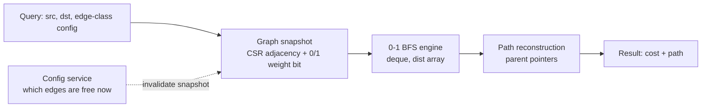
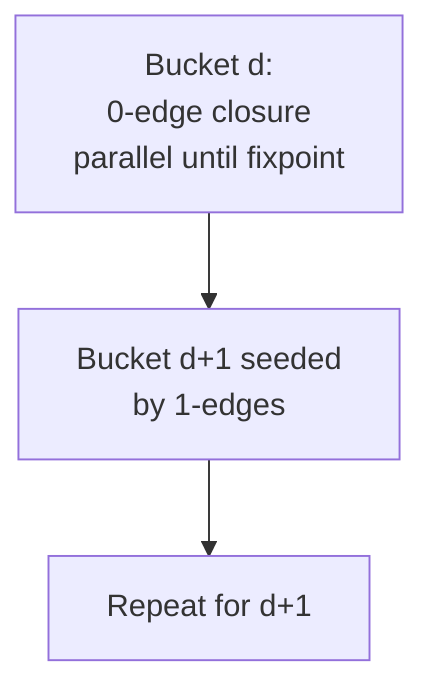

# 0-1 BFS — Senior Level

> 0-1 BFS is rarely a system on its own — it is a hot inner routine. The senior questions are: *when does the 0/1 structure actually show up in a production graph*, how do you keep the `O(V+E)` guarantee at scale, how do you run it concurrently or incrementally, and what breaks when the weight alphabet quietly stops being `{0,1}`.

## Table of Contents
1. [Introduction](#1-introduction)
2. [System Design: Routing with Binary Edge Classes](#2-system-design-routing-with-binary-edge-classes)
3. [Large-Scale Graphs and Memory Layout](#3-large-scale-graphs-and-memory-layout)
4. [Concurrency and Parallelism](#4-concurrency-and-parallelism)
5. [Comparison with Alternatives at Scale](#5-comparison-with-alternatives-at-scale)
6. [Architecture Patterns](#6-architecture-patterns)
7. [Code Examples](#7-code-examples)
8. [Observability](#8-observability)
9. [Failure Modes](#9-failure-modes)
10. [Capacity Planning](#10-capacity-planning)
11. [Summary](#11-summary)

---

## 1. Introduction

At senior level the algorithm itself — push 0 to the front, 1 to the back — is not the interesting part. The interesting part is recognising the *shape* of a problem that makes 0-1 BFS applicable, and then keeping the implementation honest as the graph grows from a textbook 10×10 grid to a 50-million-node road or routing graph.

The recurring senior decisions are:

1. **Modelling.** Is the cost in my domain genuinely binary (free vs unit), or am I about to misuse 0-1 BFS on a graph that has weight-2 edges?
2. **Scale.** A deque of 50M ids is 200–400 MB; the adjacency list dwarfs it. Where does memory actually go and how do I keep it flat?
3. **Concurrency.** 0-1 BFS is inherently sequential (the front is a single shared cursor). When can I parallelise — multi-source frontiers, independent queries, GPU delta-stepping?
4. **Incrementality.** Edge weights flip between 0 and 1 (a road opens/closes). Do I recompute from scratch, or can I repair?
5. **Correctness drift.** A config change adds a weight-2 transition and the answers silently degrade. How do I catch that?

This document treats 0-1 BFS as a production component, not a contest snippet.

---

## 2. System Design: Routing with Binary Edge Classes

The natural home for 0-1 BFS is any routing problem where edges fall into exactly two cost classes: **free** and **costs one**.

### 2.1 Where binary edge classes appear

| Domain | 0-edge (free) | 1-edge (costs one) | What 0-1 BFS minimises |
|--------|---------------|--------------------|------------------------|
| Game/grid pathfinding | walk on open tile | break one wall / use one charge | fewest walls broken |
| Network overlay routing | hop within same datacenter | cross-region hop | fewest cross-region hops |
| Circuit / VLSI layer routing | stay on the current layer | a via to another layer | fewest vias |
| Document/version diff graph | identical transition | one edit | edit distance (layered) |
| Conveyor / warehouse robots | move with belt direction | reorient against belt | fewest reorientations |

The defining test: **can every transition be tagged 0 or 1 with no third value?** If yes, 0-1 BFS gives the answer in `O(V+E)` and you avoid a heap. If a third cost ever appears, you must move to Dial's (sibling concept) or Dijkstra (sibling 04-dijkstra).

### 2.2 Reference architecture



The weight is a single bit per edge, so it can live packed alongside the CSR (compressed sparse row) adjacency arrays with near-zero overhead.

---

## 3. Large-Scale Graphs and Memory Layout

### 3.1 CSR with a packed weight bit

For a 50M-node grid/graph, store the graph in **CSR**: one `offsets[V+1]` array and one `targets[E]` array. The 0/1 weight fits in the high bit of each target id (ids < 2³¹ leave a free bit), so there is **no separate weight array**:

```
target_with_weight = (to << 1) | weightBit
to        = target >> 1
weightBit = target & 1
```

This keeps the entire neighbour scan in a single contiguous read — the dominant cost at scale is memory bandwidth, not arithmetic.

### 3.2 The deque is cheap; the dist array is not

- `dist[V]` for 50M nodes at 4 bytes = **200 MB** (use `int32` when distances fit).
- The deque holds at most `O(V)` ids but in practice peaks far below `V`; a ring buffer of `int32` is a few hundred MB worst case.
- The adjacency (CSR) is `O(E)` — for a 4-regular grid that is `~4·V` ids, **800 MB+** — the real memory sink.

Senior takeaway: **shrink `dist` and ids to `int32` where possible, and prefer a ring-buffer deque** over any structure that allocates per element (linked lists thrash the allocator and cache).

### 3.3 Frontier compaction

Stale entries inflate the deque. On enormous graphs, periodically compacting (or using the settled-flag variant) keeps the deque's live fraction high and bounds peak memory. The settled-flag style is usually preferable at scale because it caps re-pushes.

---

## 4. Concurrency and Parallelism

### 4.1 0-1 BFS is sequential by nature

The front of the deque is a single cursor that must be processed in distance order. Naively parallelising pops breaks the "front = minimum" invariant. So the *single-query* algorithm does not parallelise cleanly the way a parallel BFS frontier does.

### 4.2 What you can parallelise

1. **Independent queries.** Many `(src, dst)` queries on the same immutable snapshot run fully in parallel — embarrassingly so. This is the common production win: shard queries across cores, share the read-only CSR.
2. **Multi-source frontier (level-synchronous).** When all live vertices in the current distance bucket are known, the *0-edge closure* within a bucket and the *1-edge expansion* to the next bucket can each be processed in parallel, synchronising between buckets. This is essentially delta-stepping with Δ aligned to the 0/1 structure.
3. **GPU delta-stepping.** On GPUs, 0-1 BFS is implemented as two relaxation kernels per distance level: a "light" (0-edge) relaxation iterated to a fixpoint within the level, then a "heavy" (1-edge) relaxation to seed the next level.

### 4.3 Level-synchronous bucketed variant (conceptual)



Within a bucket, 0-edges only connect vertices of the *same* distance, so you iteratively relax them in parallel until no distance changes; then the 1-edges define the next bucket. This trades the strict `O(V+E)` work bound for parallelism with a small overhead from the fixpoint iterations.

---

## 5. Comparison with Alternatives at Scale

| Structure | Weight model | Time | Parallelism | When at scale |
|-----------|--------------|------|-------------|---------------|
| Plain BFS | unweighted | `O(V+E)` | level-sync, well-studied | edges truly all equal |
| **0-1 BFS (deque)** | `{0,1}` | `O(V+E)` | per-query / bucketed | binary edge classes, single core hot path |
| Dial's (bucket queue) | `{0..k}` | `O(V+E+k·maxDist)` | bucketed | small integer cost range |
| Dijkstra (binary heap) | non-negative | `O(E log V)` | limited (heap is serial) | arbitrary weights |
| Dijkstra (d-ary / radix heap) | non-negative ints | `O(E + V log_d C)` | limited | large non-negative integer weights |
| Δ-stepping | non-negative | work-efficient parallel | excellent | massive parallel SSSP |

At scale, the decision is rarely "0-1 BFS vs Dijkstra" on the same graph — it is "did I model the cost as binary, and is that model stable?" If yes, 0-1 BFS dominates because it removes the heap entirely; if the model is shaky, the operational cost of a silent correctness bug outweighs the `log V` savings.

---

## 6. Architecture Patterns

### 6.1 Snapshot + invalidate

Edge cost classes (which roads are free, which links are intra-region) change slowly relative to query rate. Build an immutable CSR snapshot; on a config change, build a new snapshot and atomically swap the pointer. Readers always see a consistent graph. This is the standard read-heavy routing pattern.

### 6.2 Precompute landmarks for repeated queries

If the same source set is queried repeatedly, precompute full `dist` arrays from a handful of landmark sources and use them as lower bounds (ALT-style) to prune or to answer approximate queries. The per-source computation is a single 0-1 BFS — cheap.

### 6.3 Incremental repair when a single edge flips

When one edge flips 0↔1, a full recompute is `O(V+E)`. Often only a small region's distances change. A targeted repair re-seeds the deque from the endpoints of the changed edge and re-relaxes outward, but **incremental shortest-path repair is subtle** (distances can only be repaired safely when they strictly improve; increases require invalidating a subtree). For correctness-critical paths, recomputing from scratch is the safe default; reserve incremental repair for measured hot spots with tested invariants.

### 6.4 Path reconstruction

Store a `parent[]` pointer set whenever `dist` improves. Reconstruct by walking parents from `dst` to `src`. Keep `parent` as `int32` alongside `dist`.

### 6.5 Testing strategy for a production 0-1 BFS

A graph routine fails quietly, so the test suite has to be the safety net the type system is not. The layers that have caught the most real bugs:

1. **Differential test against Dijkstra.** On thousands of random 0/1 graphs, assert the 0-1 BFS distance array equals a binary-heap Dijkstra array. This catches every relaxation/end-choice bug. Cheap to run on small `n`, run it in CI on every commit.
2. **Property: weights stay binary.** Generate snapshots and assert no edge weight escapes `{0,1}`; this guards §9.1 at build time, complementing the runtime validator of §7.3.
3. **Property: settle-once.** Instrument a debug build to count expansions per vertex and assert it never exceeds 1 in the settled-flag style. Catches accidental re-expansion from a stale-skip regression.
4. **Performance guard.** A benchmark that fails CI if `deque_peak_size / V` or per-query latency regresses beyond a threshold — this is what would have caught the §9B incident before production.
5. **Boundary fixtures.** All-0 graph, all-1 graph (must equal plain BFS), single vertex, fully disconnected, dense complete digraph. Each exercises a different edge of the invariant.

The differential test (1) plus the performance guard (4) together cover the two failure classes — silent-wrong and silent-slow — that this algorithm is prone to.

---

## 7. Code Examples

### 7.1 Go — large-scale 0-1 BFS over CSR with packed weight bit and ring-buffer deque

```go
package routing

// Graph in CSR. targets[i] packs (to<<1 | weightBit), weightBit in {0,1}.
type CSR struct {
	Offsets []int32 // len V+1
	Targets []int32 // len E, packed
}

// RingDeque is an O(1)-both-ends deque over a power-of-two ring buffer.
type RingDeque struct {
	buf        []int32
	head, tail int // tail is exclusive; size tracked separately
	size       int
}

func newRingDeque(capPow2 int) *RingDeque {
	return &RingDeque{buf: make([]int32, capPow2)}
}
func (d *RingDeque) mask() int { return len(d.buf) - 1 }
func (d *RingDeque) grow() {
	nb := make([]int32, len(d.buf)*2)
	for i := 0; i < d.size; i++ {
		nb[i] = d.buf[(d.head+i)&d.mask()]
	}
	d.buf, d.head, d.tail = nb, 0, d.size
}
func (d *RingDeque) PushBack(x int32) {
	if d.size == len(d.buf) {
		d.grow()
	}
	d.buf[d.tail&d.mask()] = x
	d.tail++
	d.size++
}
func (d *RingDeque) PushFront(x int32) {
	if d.size == len(d.buf) {
		d.grow()
	}
	d.head = (d.head - 1) & d.mask()
	d.buf[d.head] = x
	d.size++
}
func (d *RingDeque) PopFront() int32 {
	x := d.buf[d.head&d.mask()]
	d.head = (d.head + 1) & d.mask()
	d.size--
	return x
}
func (d *RingDeque) Empty() bool { return d.size == 0 }

// ZeroOneBFS computes int32 distances from src. settled[] avoids re-expansion.
func ZeroOneBFS(g *CSR, src int32) []int32 {
	V := int32(len(g.Offsets) - 1)
	const INF = int32(1) << 30
	dist := make([]int32, V)
	settled := make([]bool, V)
	for i := range dist {
		dist[i] = INF
	}
	dist[src] = 0
	dq := newRingDeque(1 << 16)
	dq.PushBack(src)

	for !dq.Empty() {
		u := dq.PopFront()
		if settled[u] {
			continue // stale
		}
		settled[u] = true
		start, end := g.Offsets[u], g.Offsets[u+1]
		for i := start; i < end; i++ {
			packed := g.Targets[i]
			to := packed >> 1
			w := packed & 1
			nd := dist[u] + w
			if nd < dist[to] {
				dist[to] = nd
				if w == 0 {
					dq.PushFront(to)
				} else {
					dq.PushBack(to)
				}
			}
		}
	}
	return dist
}
```

### 7.2 Java — parallel independent queries on a shared immutable snapshot

```java
import java.util.*;
import java.util.concurrent.*;

public final class RoutingService {
    // Immutable CSR snapshot. targets pack (to<<1 | weightBit).
    private final int[] offsets;
    private final int[] targets;

    public RoutingService(int[] offsets, int[] targets) {
        this.offsets = offsets;
        this.targets = targets;
    }

    public int distance(int src, int dst) {
        int V = offsets.length - 1, INF = Integer.MAX_VALUE / 2;
        int[] dist = new int[V];
        Arrays.fill(dist, INF);
        dist[src] = 0;
        ArrayDeque<Integer> dq = new ArrayDeque<>();
        dq.addFirst(src);
        while (!dq.isEmpty()) {
            int u = dq.pollFirst();
            if (u == dst) return dist[dst];     // target settled, stop early
            int d = dist[u];
            for (int i = offsets[u]; i < offsets[u + 1]; i++) {
                int packed = targets[i], to = packed >> 1, w = packed & 1;
                if (d + w < dist[to]) {
                    dist[to] = d + w;
                    if (w == 0) dq.addFirst(to);
                    else        dq.addLast(to);
                }
            }
        }
        return dist[dst];
    }

    // Answer many queries in parallel against the shared read-only snapshot.
    public int[] batch(int[][] queries) throws InterruptedException, ExecutionException {
        ExecutorService pool = Executors.newWorkStealingPool();
        try {
            List<Future<Integer>> fs = new ArrayList<>();
            for (int[] q : queries) {
                fs.add(pool.submit(() -> distance(q[0], q[1])));
            }
            int[] out = new int[queries.length];
            for (int i = 0; i < out.length; i++) out[i] = fs.get(i).get();
            return out;
        } finally {
            pool.shutdown();
        }
    }
}
```

### 7.3 Python — weight-validation wrapper to catch model drift

```python
from collections import deque

class WeightAlphabetError(ValueError):
    pass

def zero_one_bfs_checked(adj, src, n):
    """0-1 BFS that fails loudly if any edge weight is not 0 or 1.

    Catches the classic production bug: a config change introduces a
    weight-2 transition and distances silently degrade.
    """
    INF = float("inf")
    dist = [INF] * n
    settled = [False] * n
    dist[src] = 0
    dq = deque([src])
    while dq:
        u = dq.popleft()
        if settled[u]:
            continue
        settled[u] = True
        for v, w in adj[u]:
            if w not in (0, 1):
                raise WeightAlphabetError(
                    f"edge {u}->{v} has weight {w}; 0-1 BFS requires 0/1. "
                    f"Use Dial's algorithm or Dijkstra."
                )
            if dist[u] + w < dist[v]:
                dist[v] = dist[u] + w
                dq.appendleft(v) if w == 0 else dq.append(v)
    return dist
```

The validation wrapper is cheap (`O(E)` extra comparisons) and is the single most valuable production safeguard: it converts a silent correctness regression into a loud, actionable error.

### 7.4 Bidirectional 0-1 BFS for point-to-point queries — Python

For a single `(s, t)` query on a large undirected graph, searching from both ends explores roughly half the area. The subtlety with 0-weight edges is that you cannot stop the instant the frontiers touch; you must finish settling everything at the current minimum level on the side you just advanced. The version below settles both sides fully and combines — correct and simple, suitable as a baseline before adding aggressive pruning.

```python
from collections import deque

def _sssp(adj, n, src):
    INF = float("inf")
    dist = [INF] * n
    settled = [False] * n
    dist[src] = 0
    dq = deque([src])
    while dq:
        u = dq.popleft()
        if settled[u]:
            continue
        settled[u] = True
        for v, w in adj[u]:
            if dist[u] + w < dist[v]:
                dist[v] = dist[u] + w
                dq.appendleft(v) if w == 0 else dq.append(v)
    return dist

def bidirectional(adj, n, s, t):
    """Undirected 0/1 graph: shortest s->t cost via two SSSP sweeps."""
    df = _sssp(adj, n, s)
    db = _sssp(adj, n, t)  # undirected => reverse graph == adj
    INF = float("inf")
    best = min((df[v] + db[v] for v in range(n)
                if df[v] < INF and db[v] < INF), default=INF)
    return -1 if best == INF else best
```

In production the two sweeps run on a shared immutable snapshot and can execute on separate threads, so the wall-clock cost is one sweep over (typically) half the graph.

---

## 8. Observability

A pathfinding routine is invisible until results go wrong or latency spikes. Instrument:

| Metric | Type | Why |
|--------|------|-----|
| `bfs_query_latency_seconds` | histogram | Detect graph growth / cache regressions. |
| `bfs_nodes_expanded` | histogram | Sudden jumps mean the model changed or the graph grew. |
| `bfs_deque_peak_size` | gauge | Memory pressure / stale-entry blow-up. |
| `bfs_stale_pop_ratio` | gauge | Fraction of pops skipped as stale; high ratio means thrashing. |
| `bfs_unreachable_total` | counter | Spikes signal a partitioned graph or bad snapshot. |
| `bfs_weight_alphabet_violation_total` | counter | The model-drift alarm — should always be 0. |
| `bfs_snapshot_age_seconds` | gauge | Are queries running on a stale graph? |

The two highest-value signals are `weight_alphabet_violation_total` (correctness) and `stale_pop_ratio` (performance). The first catches the bug that produces wrong-but-plausible answers; the second catches the deque degenerating under heavy re-pushes.

---

## 9. Failure Modes

### 9.1 Silent weight-alphabet drift
A new edge type with cost 2 is introduced. 0-1 BFS keeps running and returns distances that are *plausible but wrong*. Mitigation: validate weights (§7.3) and alarm on violations; add a CI test that diffs against Dijkstra on production-shaped graphs.

### 9.2 Stale-entry blow-up
With the distance-check style and many improving re-pushes, the deque can grow well beyond `V`, spiking memory and `stale_pop_ratio`. Mitigation: prefer the settled-flag style at scale; it caps each vertex to one expansion.

### 9.3 O(n) push_front regression
A refactor swaps the ring-buffer deque for a list with an `insert(0, x)` (or Go's `append([]T{x}, s...)`). Asymptotics silently become `O(V·E)`; latency degrades non-linearly with graph size. Mitigation: keep the deque behind an interface with a documented `O(1)` contract and a benchmark guard in CI.

### 9.4 Integer overflow / dist truncation
Packing `to` into 31 bits or storing `dist` as `int16` overflows on graphs larger than the type allows. Mitigation: assert `V < 2³¹` before packing; choose `dist` width by the diameter bound.

### 9.5 Snapshot inconsistency under live updates
Reading CSR arrays while another thread rebuilds them yields torn reads and garbage paths. Mitigation: immutable snapshots with atomic pointer swap; never mutate a live snapshot in place.

### 9.6 Unbounded queries on disconnected components
A query whose target is unreachable still drains the entire reachable component. On huge graphs this is the full `O(V+E)`. Mitigation: bidirectional 0-1 BFS or a precomputed component label to fail fast on cross-component queries.

---

## 9B. Incident Walkthrough — "the routing got 8× slower overnight"

A concrete, composite postmortem that ties the failure modes together.

**Symptom.** Overnight, the p99 of an internal "fewest cross-region hops" routing
service jumped from 4 ms to 32 ms. No deploy of the routing code itself. `nodes_expanded`
roughly doubled and `deque_peak_size` quintupled. Correctness alarms were silent.

**Investigation.**

1. `bfs_weight_alphabet_violation_total` was still `0` — so weights were genuinely
   `{0,1}`; this was a *performance*, not a correctness, regression. That immediately
   ruled out §9.1 (silent weight drift).
2. `bfs_stale_pop_ratio` had climbed from ~3% to ~55%. The deque was thrashing on
   re-pushes — a §9.2 signature.
3. Diffing the snapshot builder showed a topology change pushed by the network team:
   a large set of links flipped from cross-region (weight 1) to intra-region (weight 0).
   This created many more *0-edges*, and the routing engine was running the
   distance-check stale style, so each newly-cheaper vertex was re-pushed via
   `push_front` — exactly the re-push amplification of §9.2.

**Root cause.** Not a bug — a workload shift. More 0-edges meant more improving
relaxations before settling, and the distance-check style let each improvement enqueue
a fresh copy, inflating the deque and the stale-pop ratio.

**Fix.** Switched the engine to the **settled-flag** stale style (§ middle.md), which
caps each vertex to a single expansion regardless of how many times a shorter 0-edge
path is found. `stale_pop_ratio` dropped back below 5%, `deque_peak_size` returned to
baseline, and p99 recovered to ~5 ms.

**Prevention.**

- Added `bfs_stale_pop_ratio` to the on-call dashboard with an alert at 25%.
- Added a CI benchmark that builds a snapshot with a configurable 0-edge fraction and
  asserts `deque_peak_size / V` stays under a threshold — catching re-push amplification
  before it ships.
- Documented in the runbook that "more free edges" is a *latency* risk, not just a
  topology change, for the distance-check variant.

**Lesson.** The deque variants are algorithmically equal (`O(V+E)`), but their *constant
factors and memory profiles diverge under workload shifts*. At scale, prefer the
settled-flag style and instrument the stale ratio; an absence of correctness alarms does
not mean the algorithm is behaving.

---

## 10. Capacity Planning

### 10.1 Memory ceiling on one node

Working assumptions for a 4-regular grid/graph:

- `dist` as `int32`: `4·V` bytes.
- `settled` as 1 byte (or bitset): `V` (or `V/8`) bytes.
- CSR `offsets`: `4·(V+1)`; `targets`: `4·E ≈ 16·V` bytes.
- Deque ring buffer (int32): bounded by live frontier; budget `4·V` worst case.

Per node, roughly `4 + 1 + 4 + 16 + 4 = 29` bytes × `V`. For `V = 50M`: **~1.45 GB**. Comfortable on a 16–32 GB box; the CSR `targets` array dominates.

### 10.2 Throughput

- Single 0-1 BFS over a 50M-node grid: ~0.1–0.5 s, memory-bandwidth-bound.
- Per-query (early-stop at target) on a local region: microseconds to milliseconds.
- Parallel independent queries scale near-linearly with cores against a shared immutable snapshot — the read-only graph has no contention.

### 10.3 When to leave single-node 0-1 BFS

Move to a distributed / out-of-core approach when:

- The graph no longer fits in RAM (CSR > available memory) — switch to external-memory or partitioned graph processing (delta-stepping on a graph engine).
- Query latency SLO requires bidirectional search or precomputed contraction hierarchies.
- Edge weights stop being binary — re-model to Dial's or Dijkstra before scaling further.

Until then, an in-memory CSR + ring-buffer 0-1 BFS behind a clean snapshot interface is the right answer for binary-edge-class routing.

---

## 11. Summary

- 0-1 BFS belongs anywhere edges fall into exactly two cost classes — free vs unit. The senior skill is recognising (and *guarding*) that binary structure, not coding the loop.
- At scale, store the graph in CSR with the weight packed as one bit per edge; `dist` and ids in `int32`; the CSR `targets` array is the memory sink, not the deque.
- Use a ring-buffer (or two-stack) deque to preserve `O(1)` both-ends — an accidental `O(n)` push_front is the classic regression.
- Prefer the settled-flag stale-handling style at scale to cap re-expansion; instrument `stale_pop_ratio`.
- The single-query algorithm is sequential; parallelise across independent queries on an immutable snapshot, or use a bucketed/Δ-stepping variant for parallel SSSP.
- The most dangerous failure is silent: a non-`{0,1}` weight slips in and answers go quietly wrong. Validate the weight alphabet and alarm on violations.
- Plan capacity around the CSR; on a single 32 GB node, tens of millions of nodes are comfortable. Beyond RAM, or once weights stop being binary, change the algorithm rather than the hardware.

References to study further: cp-algorithms "0-1 BFS"; Meyer & Sanders delta-stepping; ALT / contraction-hierarchy routing literature; CSR graph layouts in graph-processing engines.
