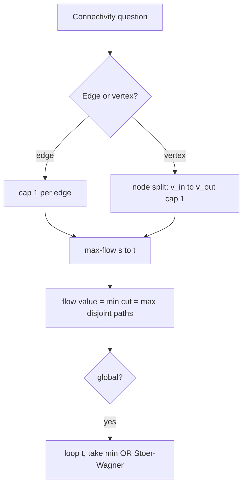

# Edge & Vertex Connectivity — Junior Level

> **One-line summary:** Edge connectivity `λ(G)` is the fewest edges you must delete to disconnect a graph; vertex connectivity `κ(G)` is the fewest vertices. Menger's theorem says these cut sizes equal the number of edge- (or vertex-) disjoint paths between two nodes, which lets you compute connectivity with a max-flow algorithm.

---

## Table of Contents

1. [Introduction](#introduction)
2. [Prerequisites](#prerequisites)
3. [Glossary](#glossary)
4. [Core Concepts](#core-concepts)
5. [Big-O Summary](#big-o-summary)
6. [Real-World Analogies](#real-world-analogies)
7. [Pros & Cons](#pros--cons)
8. [Step-by-Step Walkthrough](#step-by-step-walkthrough)
9. [Code Examples](#code-examples)
10. [Coding Patterns](#coding-patterns)
11. [Error Handling](#error-handling)
12. [Performance Tips](#performance-tips)
13. [Best Practices](#best-practices)
14. [Edge Cases & Pitfalls](#edge-cases--pitfalls)
15. [Common Mistakes](#common-mistakes)
16. [Cheat Sheet](#cheat-sheet)
17. [Visual Animation](#visual-animation)
18. [Summary](#summary)
19. [Further Reading](#further-reading)

---

## Introduction

How robust is a network? If a single cable is cut, does the network split in two? If a single router dies, can the remaining machines still talk to each other? These questions are answered by two numbers attached to every graph: **edge connectivity** and **vertex connectivity**.

- **Edge connectivity `λ(G)`** ("lambda") is the smallest number of edges whose removal disconnects the graph. If `λ(G) = 1`, there is a single edge — a **bridge** — whose loss splits the graph. If `λ(G) = 3`, you must cut at least three edges before anything falls apart.
- **Vertex connectivity `κ(G)`** ("kappa") is the smallest number of vertices whose removal disconnects the graph. If `κ(G) = 1`, there is a single **articulation point** (cut vertex). If `κ(G) = 3`, the network survives any two simultaneous node failures.

The single most important result in this whole topic is **Menger's theorem**. In plain words: *the minimum number of edges you must cut to separate two nodes `s` and `t` is exactly equal to the maximum number of edge-disjoint paths you can route from `s` to `t`.* The same statement holds for vertices. This is a beautiful duality — a "min cut" equals a "max set of disjoint paths" — and it is the bridge that connects connectivity to the **max-flow / min-cut** machinery you may have seen in the sibling topic `16-max-flow-edmonds-karp-dinic`.

Why should a junior engineer care? Because connectivity is the mathematical core of **fault tolerance**. When you design a system with "no single point of failure," you are really demanding `κ ≥ 2`. When a cloud provider promises survival of two simultaneous zone outages, they are designing for `κ ≥ 3`. Learning to compute these numbers turns a vague intuition ("the network looks redundant") into a hard guarantee.

At the junior level we focus on the two definitions, the chain of inequalities `κ ≤ λ ≤ δ`, and the single most practical recipe: **compute `s-t` edge connectivity by running a max-flow with every edge given capacity 1**. The deeper theorems and the clever global algorithms come later in `middle.md`, `senior.md`, and `professional.md`.

---

## Prerequisites

Before reading this file you should be comfortable with:

- **Undirected and directed graphs** — vertices, edges, adjacency lists. See sibling `01-representation`.
- **Graph traversal** — BFS and DFS, because every connectivity algorithm runs a search under the hood. See `02-bfs` and `03-dfs`.
- **The idea of connectivity** — a graph is *connected* if you can reach every vertex from every other vertex.
- **Max-flow basics** — capacities, residual graphs, augmenting paths, and the max-flow min-cut theorem. See sibling `16-max-flow-edmonds-karp-dinic`. You do not need to be an expert; knowing that "max flow = min cut" is enough to start.
- **Big-O notation** — `O(V)`, `O(E)`, `O(V·E)`, `O(V³)`.

Optional but helpful:

- Exposure to **bridges and articulation points** (sibling `11-articulation-points-bridges`) — those solve the special case `λ = 1` and `κ = 1` in linear time.
- Basic **degree** counting — the minimum degree `δ` is the cheapest upper bound on connectivity.

---

## Glossary

| Term | Meaning |
|------|---------|
| **Edge connectivity `λ(G)`** | Minimum number of edges whose removal disconnects `G` (or leaves a single vertex). |
| **Vertex connectivity `κ(G)`** | Minimum number of vertices whose removal disconnects `G` (or leaves a single vertex). |
| **Minimum degree `δ(G)`** | The smallest degree over all vertices of `G`. |
| **Edge cut** | A set of edges whose removal disconnects the graph. |
| **Vertex cut (separator)** | A set of vertices whose removal disconnects the graph. |
| **`s-t` edge cut** | A set of edges whose removal puts `s` and `t` in different components. |
| **`s-t` vertex cut** | A set of vertices (excluding `s`, `t`) whose removal leaves no `s`-to-`t` path. |
| **Edge-disjoint paths** | Paths from `s` to `t` that share no edge (they may share vertices). |
| **Vertex-disjoint paths** | Paths from `s` to `t` that share no internal vertex. |
| **Bridge** | A single edge whose removal disconnects the graph; `λ = 1`. |
| **Articulation point / cut vertex** | A single vertex whose removal disconnects the graph; `κ = 1`. |
| **`k`-edge-connected** | `λ(G) ≥ k`: survives the loss of any `k − 1` edges. |
| **`k`-vertex-connected** | `κ(G) ≥ k`: survives the loss of any `k − 1` vertices. |
| **Global min-cut** | The minimum edge cut over *all* pairs — equals `λ(G)` for unit weights. |
| **Menger's theorem** | Min `s-t` cut size = max number of disjoint `s-t` paths. |
| **Node splitting** | A construction that turns a vertex-capacity problem into an edge-capacity one. |
| **Stoer–Wagner** | An `O(V³)` algorithm for the global min-cut without using flow. |
| **Gomory–Hu tree** | A tree of `V − 1` cuts that encodes the min cut of every pair. |

---

## Core Concepts

### 1. Three Numbers and One Inequality

Every graph carries three related quantities:

```
κ(G)  ≤  λ(G)  ≤  δ(G)
vertex     edge     min
conn.      conn.    degree
```

This chain (Whitney's inequality, 1932) is worth memorizing:

- **`λ ≤ δ`**: the lowest-degree vertex can always be isolated by cutting its `δ` incident edges. So you never need more than `δ` edge cuts.
- **`κ ≤ λ`**: any edge cut can be turned into a vertex cut of equal-or-smaller size by, for each cut edge, removing one of its endpoints. So vertex connectivity is never larger than edge connectivity.

These bounds are *not* always tight. A cycle `C₅` has `κ = λ = δ = 2`. But a "barbell" of two triangles joined by a single edge has `δ = 2` (every triangle vertex has degree 2 or 3) yet `λ = 1` (the joining edge is a bridge). Inequalities tell you a quick range; exact values need an algorithm.

### 2. Cuts and Disjoint Paths Are Two Sides of One Coin (Menger)

Pick two vertices `s` and `t`. Define:

- **`c(s, t)`** = the minimum number of edges you must delete so that no `s`-to-`t` path survives.
- **`p(s, t)`** = the maximum number of paths from `s` to `t` that pairwise share no edge.

**Menger's theorem:** `c(s, t) = p(s, t)`.

The intuition is a traffic metaphor. Each edge can carry one "unit." If you can route `p` disjoint paths, each path uses a distinct set of edges, so any cut must hit at least one edge of every path — hence the cut has size at least `p`. Conversely, if every cut has size at least `p`, max-flow finds `p` disjoint routes. The two quantities squeeze each other to be equal.

The vertex version is identical with "vertex-disjoint" and "delete vertices."

### 3. Computing `s-t` Edge Connectivity via Max-Flow

Menger turns connectivity into a flow problem. To find `c(s, t)` in an **undirected, unweighted** graph:

```
give every edge capacity 1
run max-flow from s to t
the answer is the value of the max flow
```

For an undirected edge `{u, v}` you add capacity 1 in *both* directions. The max-flow value equals the number of edge-disjoint `s-t` paths, which by Menger equals the min `s-t` edge cut. The flow algorithm comes straight from sibling `16-max-flow-edmonds-karp-dinic`.

### 4. Vertex Connectivity Needs Node Splitting

Max-flow limits *edges*, not *vertices*. To bound the number of times a path can pass *through* a vertex, split each vertex `v` into two:

```
v_in  →  v_out      (an internal edge with capacity 1)
```

Every original edge `{u, v}` becomes `u_out → v_in` and `v_out → u_in` with capacity ∞. Now any path is forced through the capacity-1 internal edge, so the max-flow counts vertex-disjoint paths. The source uses `s_out`, the sink uses `t_in`, and `s`/`t` internal edges get capacity ∞ (you never "delete" the endpoints themselves).

### 5. Global Connectivity from `s-t` Connectivity

To get the *global* `λ(G)` (not tied to a specific pair) the brute-force recipe is: fix one vertex `s`, then compute `c(s, t)` for every other `t`, and take the minimum. Because the global min cut must separate `s` from *some* vertex, `V − 1` flow computations suffice. The clever `O(V³)` **Stoer–Wagner** algorithm (covered in `middle.md`) avoids flow entirely. For `λ = 1` and `κ = 1` specifically, the linear-time bridge / articulation-point algorithm (`11-articulation-points-bridges`) is far faster.

---

## Big-O Summary

| Task | Method | Time | Notes |
|------|--------|------|-------|
| `s-t` edge connectivity | Max-flow, unit caps | `O(V · E)` (Edmonds–Karp on unit graphs ≈ `O(E · √E)` with Dinic) | One flow run. |
| `s-t` vertex connectivity | Node-split + max-flow | `O(V · E)` | Doubles the vertices. |
| Global `λ(G)` (flow) | `V − 1` `s-t` flows | `O(V² · E)` | Fix `s`, vary `t`. |
| Global `λ(G)` (Stoer–Wagner) | Maximum-adjacency merging | `O(V³)` or `O(V·E + V²·log V)` | No flow needed; weighted graphs OK. |
| Global `κ(G)` | Flow over chosen pairs | `O(V³ · E)` (naïve) | Smarter bounds exist. |
| All-pairs min cut | Gomory–Hu tree | `O(V)` flow runs | `V − 1` flows total, not `V²`. |
| `λ = 1` test (bridges) | DFS low-link | `O(V + E)` | Linear, see sibling 11. |
| `κ = 1` test (articulation) | DFS low-link | `O(V + E)` | Linear, see sibling 11. |
| Karger's randomized min-cut | Random edge contraction | `O(V²)` per trial | Monte Carlo; covered later. |

---

## Real-World Analogies

| Concept | Analogy |
|---------|---------|
| Edge connectivity `λ` | The number of undersea cables between two continents. Cut fewer than `λ` and traffic reroutes; cut `λ` and the continents go dark. |
| Vertex connectivity `κ` | The number of independent airline hubs you can shut down before two cities can no longer be reached from one another. |
| Menger's theorem | A delivery company asks "how many trucks can I send on non-overlapping roads?" and the city planner asks "how few roadblocks disconnect the two depots?" — the answers are always the same number. |
| `κ ≤ λ ≤ δ` | Killing a node is at least as damaging as killing one of its cables, and the weakest node (lowest degree) is the cheapest thing to isolate. |
| Bridge (`λ = 1`) | A single bridge over a river: drop it and the town splits. |
| Articulation point (`κ = 1`) | A single mountain pass: block it and two valleys lose contact. |
| Node splitting | A turnstile inside a train station: people can enter and leave, but only *one* person passes the turnstile, modeling "this station can be shut once." |
| Global min-cut | The cheapest way an adversary can split your entire data center into two halves. |

Where the analogies break: real cables have differing capacities (a weighted graph), and real failures are correlated (a single power outage can kill many "independent" links at once). Connectivity numbers assume failures are independent and capacities uniform unless you put weights on edges.

---

## Pros & Cons

| Pros | Cons |
|------|------|
| Gives a hard, provable guarantee of fault tolerance (`κ ≥ k`). | Computing exact `κ` is more expensive than most graph algorithms. |
| Reduces to max-flow, which has battle-tested implementations. | Easy to confuse edge cuts with vertex cuts — they differ. |
| Menger's duality lets you *certify* an answer (show the cut **and** the disjoint paths). | Directed vs undirected handling is subtly different (capacity in one or both directions). |
| Global min-cut (Stoer–Wagner) avoids flow and handles weights. | Node-splitting doubles the graph; easy to mis-wire the ∞ capacities. |
| Linear-time shortcuts exist for the common `k = 1` case. | Results assume independent failures and (often) uniform capacities. |

**When to use:** reliability analysis of networks, redundancy planning, "no single point of failure" verification, clustering by min-cut, image segmentation, and any "how many disjoint routes" question.

**When NOT to use:** if you only need `k = 1` (use bridges / articulation points, linear time); if failures are correlated (connectivity over-promises); if the graph is enormous and you only need an estimate (use sampling or Karger).

---

## Step-by-Step Walkthrough

Take this small undirected graph (6 vertices). We will find the **min `s-t` edge cut** between `s = 0` and `t = 5`.

```
        0 ───── 1 ───── 5
        │       │       │
        2 ───── 3 ───── 4
```

Edges: `{0,1}, {1,5}, {0,2}, {2,3}, {3,4}, {4,5}, {1,3}`.

**Step 1 — Find edge-disjoint paths from 0 to 5.**

```
Path A: 0 → 1 → 5                 uses {0,1}, {1,5}
Path B: 0 → 2 → 3 → 4 → 5         uses {0,2}, {2,3}, {3,4}, {4,5}
```

Try a third path. Any route from 0 must start with `{0,1}` or `{0,2}` — both already used. So we cannot find a third edge-disjoint path. **Max disjoint paths = 2.**

**Step 2 — Find a cut of size 2 to confirm.**

Cut the two edges leaving `0`: `{0,1}` and `{0,2}`. After removing them, vertex `0` is isolated, so `0` and `5` are disconnected. **Cut size = 2.**

**Step 3 — Apply Menger.**

Max disjoint paths (2) = min cut (2). By Menger's theorem these *must* match, and they do — so `c(0, 5) = 2`. We have both an answer and a certificate.

**Step 4 — Edge vs vertex.**

The vertex cut here is also size 2 (delete vertices `1` and `2`, isolating `0`). But note that path A and path B share no internal vertex, so `κ` for this pair is also 2 — consistent with `κ ≤ λ`.

This by-hand procedure — *route disjoint paths, then exhibit a matching cut* — is exactly what max-flow automates.

---

## Code Examples

### Example: `s-t` Edge Connectivity via Max-Flow (unit capacities)

We build a capacity matrix (1 per direction for undirected edges) and run Edmonds–Karp (BFS-augmenting max-flow). The returned flow value is the min `s-t` edge cut.

#### Go

```go
package main

import "fmt"

// edgeConnectivity returns the minimum s-t edge cut of an undirected graph.
// n = number of vertices, edges = undirected edge list.
func edgeConnectivity(n int, edges [][2]int, s, t int) int {
	cap := make([][]int, n)
	for i := range cap {
		cap[i] = make([]int, n)
	}
	for _, e := range edges {
		u, v := e[0], e[1]
		cap[u][v]++ // undirected: capacity 1 both directions
		cap[v][u]++
	}
	return maxFlow(n, cap, s, t)
}

func maxFlow(n int, cap [][]int, s, t int) int {
	flow := 0
	for {
		parent := make([]int, n)
		for i := range parent {
			parent[i] = -1
		}
		parent[s] = s
		queue := []int{s}
		for len(queue) > 0 && parent[t] == -1 {
			u := queue[0]
			queue = queue[1:]
			for v := 0; v < n; v++ {
				if parent[v] == -1 && cap[u][v] > 0 {
					parent[v] = u
					queue = append(queue, v)
				}
			}
		}
		if parent[t] == -1 {
			break // no augmenting path
		}
		bottleneck := 1 << 30
		for v := t; v != s; v = parent[v] {
			if cap[parent[v]][v] < bottleneck {
				bottleneck = cap[parent[v]][v]
			}
		}
		for v := t; v != s; v = parent[v] {
			cap[parent[v]][v] -= bottleneck
			cap[v][parent[v]] += bottleneck
		}
		flow += bottleneck
	}
	return flow
}

func main() {
	edges := [][2]int{{0, 1}, {1, 5}, {0, 2}, {2, 3}, {3, 4}, {4, 5}, {1, 3}}
	fmt.Println(edgeConnectivity(6, edges, 0, 5)) // 2
}
```

#### Java

```java
import java.util.*;

public class EdgeConnectivity {
    static int maxFlow(int n, int[][] cap, int s, int t) {
        int flow = 0;
        while (true) {
            int[] parent = new int[n];
            Arrays.fill(parent, -1);
            parent[s] = s;
            Deque<Integer> q = new ArrayDeque<>();
            q.add(s);
            while (!q.isEmpty() && parent[t] == -1) {
                int u = q.poll();
                for (int v = 0; v < n; v++) {
                    if (parent[v] == -1 && cap[u][v] > 0) {
                        parent[v] = u;
                        q.add(v);
                    }
                }
            }
            if (parent[t] == -1) break;
            int bottleneck = Integer.MAX_VALUE;
            for (int v = t; v != s; v = parent[v])
                bottleneck = Math.min(bottleneck, cap[parent[v]][v]);
            for (int v = t; v != s; v = parent[v]) {
                cap[parent[v]][v] -= bottleneck;
                cap[v][parent[v]] += bottleneck;
            }
            flow += bottleneck;
        }
        return flow;
    }

    static int edgeConnectivity(int n, int[][] edges, int s, int t) {
        int[][] cap = new int[n][n];
        for (int[] e : edges) {
            cap[e[0]][e[1]]++;
            cap[e[1]][e[0]]++;
        }
        return maxFlow(n, cap, s, t);
    }

    public static void main(String[] args) {
        int[][] edges = {{0, 1}, {1, 5}, {0, 2}, {2, 3}, {3, 4}, {4, 5}, {1, 3}};
        System.out.println(edgeConnectivity(6, edges, 0, 5)); // 2
    }
}
```

#### Python

```python
from collections import deque


def max_flow(n, cap, s, t):
    flow = 0
    while True:
        parent = [-1] * n
        parent[s] = s
        q = deque([s])
        while q and parent[t] == -1:
            u = q.popleft()
            for v in range(n):
                if parent[v] == -1 and cap[u][v] > 0:
                    parent[v] = u
                    q.append(v)
        if parent[t] == -1:
            break  # no augmenting path
        bottleneck = float("inf")
        v = t
        while v != s:
            bottleneck = min(bottleneck, cap[parent[v]][v])
            v = parent[v]
        v = t
        while v != s:
            cap[parent[v]][v] -= bottleneck
            cap[v][parent[v]] += bottleneck
            v = parent[v]
        flow += bottleneck
    return flow


def edge_connectivity(n, edges, s, t):
    cap = [[0] * n for _ in range(n)]
    for u, v in edges:
        cap[u][v] += 1  # undirected: capacity 1 both ways
        cap[v][u] += 1
    return max_flow(n, cap, s, t)


if __name__ == "__main__":
    edges = [(0, 1), (1, 5), (0, 2), (2, 3), (3, 4), (4, 5), (1, 3)]
    print(edge_connectivity(6, edges, 0, 5))  # 2
```

**What it does:** counts edge-disjoint `s-t` paths (= the min edge cut) by saturating unit-capacity edges.
**Run:** `go run main.go` | `javac EdgeConnectivity.java && java EdgeConnectivity` | `python edge_conn.py`

---

## Coding Patterns

### Pattern 1: Unit-Capacity Flow = Disjoint Paths Counter

**Intent:** Count edge-disjoint `s-t` paths. Give every edge capacity 1, run max-flow, read the flow value. This single pattern handles a surprising range of "how many independent routes" interview questions.

```python
# capacity 1 per edge → flow value = number of edge-disjoint paths
def disjoint_paths(n, edges, s, t):
    return edge_connectivity(n, edges, s, t)
```

### Pattern 2: Node Splitting for Vertex Limits

**Intent:** Whenever a constraint is "this *vertex* can only be used once," split `v` into `v_in → v_out` with capacity 1 and route all original edges between the out/in copies. This converts vertex-disjoint path counting into ordinary flow.

```python
def split_index_in(v):  # v_in
    return 2 * v
def split_index_out(v):  # v_out
    return 2 * v + 1
```

### Pattern 3: Global from Pairwise (fix the source)

**Intent:** The global min cut must separate a fixed vertex `s` from *some* other vertex `t`. So iterate `t` over all other vertices, take the minimum `c(s, t)`.

```python
def global_edge_connectivity(n, edges):
    return min(edge_connectivity_fresh(n, edges, 0, t) for t in range(1, n))
```



---

## Error Handling

| Error | Cause | Fix |
|-------|-------|-----|
| Wrong (too small) edge connectivity | Forgot to add capacity in *both* directions for undirected edges. | Add `cap[u][v]++` **and** `cap[v][u]++`. |
| Vertex connectivity returns ∞ unexpectedly | `s` and `t` are *adjacent* — adjacent vertices have no vertex cut. | This is correct behavior; vertex connectivity is only defined for non-adjacent pairs, or use `n − 1` as the convention. |
| Parallel edges collapse to one | Used a boolean adjacency matrix. | Use an integer capacity matrix and `++`, so multi-edges raise capacity. |
| Self-loops inflate the answer | Edge `{v, v}` added to capacity. | Skip self-loops; they never help a cut. |
| `IndexError` on disconnected source | `s == t` or `s`/`t` out of range. | Validate `0 ≤ s, t < n` and `s != t` up front. |
| Flow never terminates | Negative or missing residual reverse edges. | Always add the reverse edge `cap[v][u] += bottleneck` when pushing flow. |

---

## Performance Tips

- **Use Dinic, not Edmonds–Karp, on big graphs.** On unit-capacity graphs Dinic runs in `O(E·√E)`, far better than the `O(V·E²)` worst case of Edmonds–Karp. See sibling `16-max-flow-edmonds-karp-dinic`.
- **Use an adjacency-list residual graph** instead of a dense `V×V` matrix when the graph is sparse — the matrix wastes `O(V²)` memory and scans empty cells.
- **Short-circuit `λ = 1` with a bridge-finding DFS** (sibling 11). Running full flow when a single bridge exists is wasteful.
- **For global `λ`, prefer Stoer–Wagner** (`O(V³)`) over `V − 1` flow calls when the graph is dense.
- **Cap the BFS early.** Once the flow value reaches a known upper bound `δ` (min degree), you can stop — connectivity never exceeds `δ`.

---

## Best Practices

- Always decide *up front* whether the question is about **edges** or **vertices** — they are different numbers and need different constructions.
- Always decide whether the graph is **directed** or **undirected**; undirected edges need capacity in both directions.
- **Certify** your answer when you can: output both the cut and the disjoint paths. By Menger they have equal size, which is a free correctness check.
- For undirected graphs, remember `κ ≤ λ ≤ δ`; compute `δ` first as a cheap sanity upper bound.
- Test against a brute-force baseline (try removing every subset of edges/vertices) on tiny graphs before trusting the flow code.

---

## Edge Cases & Pitfalls

- **Disconnected graph** — by convention `λ = κ = 0` if the graph is already disconnected. Many implementations assume a connected input; check first.
- **Single vertex** — connectivity is conventionally `0` (nothing to disconnect).
- **Adjacent `s` and `t` for vertex connectivity** — there is *no* vertex cut between adjacent vertices (deleting interior vertices can never separate them). Handle this case explicitly.
- **Complete graph `Kₙ`** — `κ = λ = δ = n − 1`. A useful sanity test.
- **Multi-edges** — two parallel edges raise `λ` to at least 2 for that pair; make sure your capacity matrix counts them.
- **Directed graphs** — `s-t` and `t-s` connectivity can differ; do not assume symmetry.

---

## Common Mistakes

1. **Confusing edge cut with vertex cut.** They satisfy `κ ≤ λ` but are generally different numbers, computed differently.
2. **Adding undirected capacity only one way**, halving the flow and under-reporting connectivity.
3. **Forgetting node splitting** for vertex connectivity, accidentally measuring edge connectivity instead.
4. **Running flow on adjacent vertices** for vertex connectivity and being surprised by ∞ (no separator exists).
5. **Taking the minimum over all pairs `(s, t)`** for global `λ` — unnecessary; fixing one `s` and varying `t` is enough.
6. **Trusting `δ` as the answer** — `δ` is only an upper bound; the true connectivity can be smaller (a bridge has `δ ≥ 1` but `λ = 1`).

---

## Cheat Sheet

| Symbol / Task | Meaning / Recipe |
|---------------|------------------|
| `λ(G)` | Min edges to disconnect. |
| `κ(G)` | Min vertices to disconnect. |
| `δ(G)` | Min degree (cheap upper bound). |
| Inequality | `κ ≤ λ ≤ δ`. |
| Menger | min `s-t` cut = max disjoint `s-t` paths. |
| `s-t` edge conn. | cap 1 per edge → max-flow. |
| `s-t` vertex conn. | node split (`v_in→v_out` cap 1) → max-flow. |
| Undirected edge | capacity 1 in **both** directions. |
| Global `λ` (flow) | fix `s`, min over `t` of `c(s,t)`. |
| Global `λ` (no flow) | Stoer–Wagner `O(V³)`. |
| `λ=1` / `κ=1` | bridges / articulation points, `O(V+E)`. |
| All-pairs cuts | Gomory–Hu tree, `V−1` flows. |

```
edge connectivity (undirected, unit):
    cap[u][v] += 1; cap[v][u] += 1   for each edge
    return maxflow(s, t)

vertex connectivity (undirected, unit):
    internal: cap[2v][2v+1] = 1      (∞ for s, t)
    edge {u,v}: cap[2u+1][2v] = ∞; cap[2v+1][2u] = ∞
    return maxflow(2s+1, 2t)
```

---

## Visual Animation

> See [`animation.html`](./animation.html) for an interactive visual animation of finding a minimum cut.
>
> The animation demonstrates:
> - A small undirected graph and its edge-disjoint `s-t` paths
> - Step-by-step Stoer–Wagner merging phases (maximum-adjacency ordering)
> - Highlighting the final cut edges and the two sides of the partition
> - Step / Run / Reset controls with adjustable speed

---

## Summary

Edge connectivity `λ(G)` and vertex connectivity `κ(G)` measure how many edges or vertices an adversary must destroy to break a graph apart, and they satisfy `κ ≤ λ ≤ δ`. The cornerstone is **Menger's theorem**: the minimum `s-t` cut equals the maximum number of disjoint `s-t` paths, which reduces connectivity to a **max-flow** computation. Give edges unit capacity for edge connectivity; split vertices for vertex connectivity. For the global min-cut you can fix one source and vary the sink, or reach for the elegant `O(V³)` Stoer–Wagner algorithm covered next. Master the edge/vertex distinction and the flow reduction, and you can turn fuzzy "is this network robust?" intuition into a precise, certified number.

---

## Further Reading

- *Introduction to Algorithms* (CLRS), Chapter 26 — "Maximum Flow" — for the flow machinery behind Menger.
- Menger, K. (1927) — the original theorem on disjoint paths and separators.
- Whitney, H. (1932) — the `κ ≤ λ ≤ δ` inequality.
- Stoer, M. & Wagner, F. (1997) — "A Simple Min-Cut Algorithm."
- Sibling topic `11-articulation-points-bridges` — the linear-time `k = 1` special case.
- Sibling topic `16-max-flow-edmonds-karp-dinic` — the flow algorithms used here.
- cp-algorithms.com — "Edge connectivity" and "Vertex connectivity" articles.
