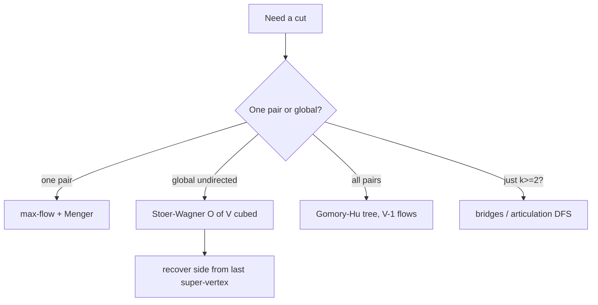

# Edge & Vertex Connectivity — Middle Level

> **One-line summary:** Both forms of Menger's theorem reduce connectivity to max-flow, but the *global* minimum cut has a slicker `O(V³)` solution — the Stoer–Wagner algorithm — that needs no flow at all. This level covers Menger (edge and vertex), node-splitting, Stoer–Wagner, Gomory–Hu trees, `k`-connectivity testing, and how to choose among them.

---

## Table of Contents

1. [Introduction](#introduction)
2. [Menger's Theorem — Both Forms](#mengers-theorem--both-forms)
3. [Node Splitting for Vertex Cuts](#node-splitting-for-vertex-cuts)
4. [The Global Minimum Cut](#the-global-minimum-cut)
5. [Stoer–Wagner Algorithm](#stoerwagner-algorithm)
6. [Gomory–Hu Tree](#gomoryhu-tree)
7. [Karger's Randomized Min-Cut](#kargers-randomized-min-cut)
8. [k-Connectivity Testing](#k-connectivity-testing)
9. [Comparison Table](#comparison-table)
10. [Code: Stoer–Wagner in Go / Java / Python](#code-stoerwagner-in-go--java--python)
11. [Advanced Patterns](#advanced-patterns)
12. [Performance Analysis](#performance-analysis)
13. [Edge Cases & Pitfalls](#edge-cases--pitfalls)
14. [Summary](#summary)
15. [Further Reading](#further-reading)

---

## Introduction

At the junior level we computed `s-t` connectivity with one max-flow run and obtained the *global* `λ(G)` by fixing a source and varying the sink. That works but it pays `V − 1` flow computations. The middle level asks two sharper questions:

1. **Can we compute the global min-cut faster and without flow?** Yes — the **Stoer–Wagner** algorithm runs in `O(V³)` (or `O(V·E + V²·log V)` with a heap) and handles weighted graphs.
2. **Can we answer the min-cut of *every* pair without `V²` flows?** Yes — the **Gomory–Hu tree** captures all `\binom{V}{2}` pairwise min-cuts with just `V − 1` flow computations.

To get there we need the full statement of Menger's theorem in both its edge and vertex forms, a careful node-splitting construction, and a clear-eyed comparison so you pick the right tool. Randomized methods (Karger, Karger–Stein) are introduced here and analyzed in `professional.md`.

---

## Menger's Theorem — Both Forms

Menger's theorem is the spine of this entire topic. There are two local forms (fixing `s` and `t`) and two global forms.

### Edge form (local)

> The maximum number of pairwise **edge-disjoint** `s-t` paths equals the minimum number of edges whose deletion separates `s` from `t`.

Formally, with `c_e(s, t)` = min `s-t` edge cut and `p_e(s, t)` = max edge-disjoint paths:

```
c_e(s, t) = p_e(s, t)
```

### Vertex form (local)

> For non-adjacent `s, t`, the maximum number of **internally vertex-disjoint** `s-t` paths equals the minimum number of vertices (other than `s, t`) whose deletion separates `s` from `t`.

```
c_v(s, t) = p_v(s, t)        (s, t non-adjacent)
```

### Global forms

Taking the minimum over all relevant pairs yields:

```
λ(G) = min over all pairs (s,t) of  c_e(s, t)
κ(G) = min over all NON-ADJACENT pairs of  c_v(s, t)
```

Menger is equivalent to the **max-flow min-cut theorem** restricted to unit capacities. The proof — by induction on edges or via flow integrality — is given in `professional.md`. The practical payoff is that any connectivity question becomes a flow question, and any flow algorithm becomes a connectivity tool.

### Directed vs undirected

- **Undirected:** each edge `{u, v}` gets capacity 1 in both directions. `c_e(s, t) = c_e(t, s)`.
- **Directed:** edge `(u, v)` gets capacity 1 only on `u → v`. Now `c_e(s, t)` and `c_e(t, s)` can differ. Menger still holds per direction.

### Why duality is so useful in practice

Menger gives you a *certificate* for free. Whenever you compute `c_e(s, t)` by flow, the same computation hands you (a) the cut — the saturated edges crossing from the residual-reachable side of `s` to the rest — and (b) the disjoint paths — the flow decomposition. These two objects have equal size *if and only if* your answer is correct. So you never have to "trust" a connectivity number: exhibit the cut and that many disjoint paths, and the equality is a self-verifying proof. In code review and in interviews, this is the single most persuasive way to demonstrate correctness.

A second consequence: Menger explains *why* `λ(G) = min_t c_e(s, t)` for a fixed `s`. Any global cut splits `V` into `(S, \bar S)`; pick any `t ∈ \bar S`. Then that cut is also an `s-t` cut, so `c_e(s, t) ≤ |cut|`. Minimizing over `t` therefore finds the global cut — no need to vary `s` as well.

---

## Node Splitting for Vertex Cuts

Max-flow restricts edge usage, but vertex connectivity restricts *vertex* usage. The fix is **node splitting** (also called the *vertex-splitting gadget*):

```
Replace each vertex v by two:    v_in ──cap──▶ v_out
Internal capacity:               cap = 1   (or ∞ for s and t)
Each undirected edge {u, v}:     u_out ──∞──▶ v_in   and   v_out ──∞──▶ u_in
Source / sink for the flow:      s_out  (source),  t_in (sink)
```

Because every path must traverse the unit-capacity internal edge of each interior vertex, the max-flow equals the number of **internally vertex-disjoint** `s-t` paths, which by Menger equals `c_v(s, t)`. The endpoints `s` and `t` get capacity ∞ internally because we never "delete" them.

The construction roughly **doubles** the vertex count (`2V`) and adds `V` internal edges, so the flow problem is at most a constant factor larger. The most common bug is forgetting to give `s`/`t` infinite internal capacity, which artificially caps the flow at 1.

### Directed vs undirected node-splitting

For a **directed** graph, an edge `(u, v)` becomes a single arc `u_out → v_in` (capacity ∞); you do *not* add the reverse. For an **undirected** graph each `{u, v}` yields both `u_out → v_in` and `v_out → u_in`. The internal `v_in → v_out` arc is always directed (it models "passing through `v` once"). Getting this wrong is the most common node-splitting error after the `s`/`t` ∞ omission: an undirected graph wired with only one arc direction under-reports vertex connectivity, while a directed graph wired with both over-reports it.

### A tiny worked split

Graph `0–1, 1–2, 0–3, 3–2` (a 4-cycle), `s = 0`, `t = 2`, non-adjacent. After splitting:

```
internal:  0in→0out (∞), 2in→2out (∞), 1in→1out (1), 3in→3out (1)
edges:     0out→1in, 1out→0in, 1out→2in, 2out→1in,
           0out→3in, 3out→0in, 3out→2in, 2out→3in   (all ∞)
source = 0out, sink = 2in
```

Max-flow is 2: one unit through `1` (`0out→1in→1out→2in`) and one through `3` (`0out→3in→3out→2in`). The two unit internal edges `1in→1out` and `3in→3out` form the min vertex cut `{1, 3}`, so `κ(0, 2) = 2`. The animation's "Disjoint Paths" mode shows the analogous edge-disjoint version of this routing.

---

## The Global Minimum Cut

The **global minimum cut** of an undirected graph is the minimum, over *every* partition of the vertices into two non-empty sets `(A, B)`, of the total weight of edges crossing the partition. For unit weights this equals `λ(G)`.

Three families of algorithms compute it:

1. **Flow-based:** fix a source `s`, run `s-t` max-flow for each of the other `V − 1` vertices, take the min. Cost: `(V − 1)` flow runs.
2. **Stoer–Wagner:** a deterministic, flow-free `O(V³)` contraction algorithm — the workhorse for dense weighted graphs.
3. **Randomized contraction (Karger / Karger–Stein):** contracts random edges; `O(V²)` per trial, repeated for a high-probability guarantee.

For *vertex* connectivity, the global computation is more delicate: you cannot simply fix one vertex because deleting it might be part of the optimal separator. A standard approach computes `c_v(s, t)` for `s` fixed against all non-neighbors, then repeats from a few of `s`'s neighbors — `O(κ·V)` flow runs in total with care (details in `senior.md`).

---

## Stoer–Wagner Algorithm

Stoer–Wagner finds the global min-cut of a **weighted undirected** graph in `O(V³)` without any flow. The idea is the **minimum-cut phase** plus repeated **merging**.

### The minimum-cut phase

A single phase grows a set `A`, one vertex at a time, always adding the vertex most tightly connected to `A` (**maximum adjacency ordering**):

```
minimumCutPhase(G, a):           # a = arbitrary start vertex
    A = {a}
    while A != V:
        add to A the vertex z (not in A) maximizing  w(z, A)
    let s, t = the last two vertices added (in order)
    cut-of-the-phase = w(t, A \ {t})     # weight of t against everything else
    merge s and t into one super-vertex
    return cut-of-the-phase
```

The remarkable lemma (proved in `professional.md`) is:

> **Min-cut-phase lemma:** the cut-of-the-phase is a minimum `s-t` cut for the last two vertices `s` and `t` added in that phase.

### The full algorithm

```
stoerWagner(G):
    best = +∞
    while G has more than one vertex:
        cut = minimumCutPhase(G, anyVertex)
        best = min(best, cut)
    return best
```

Each phase removes one vertex (by merging the last two), so there are `V − 1` phases. A naïve phase costs `O(V²)` (scanning all candidate weights), giving `O(V³)` overall. With a Fibonacci heap to pick the max-adjacency vertex, a phase costs `O(E + V·log V)`, giving `O(V·E + V²·log V)`.

Key properties:

- Works on **weighted** graphs (non-negative weights).
- **No flow**, no augmenting paths — just additive merging.
- Returns the *value*; recording the *side* of the cut requires tracking which original vertices were merged into the last super-vertex of the best phase.

### A worked phase, by hand

Take the 4-vertex weighted graph with edges `0–1:3, 0–2:1, 1–2:1, 1–3:1, 2–3:3` (global min-cut = 3). Start phase 1 at vertex `a = 0`:

```
A = {0}.  weights to remaining: w(1)=3, w(2)=1, w(3)=0
  pick 1 (max). A = {0,1}.  update: w(2)=1+1=2, w(3)=0+1=1
  pick 2 (max). A = {0,1,2}. update: w(3)=1+3=4
  pick 3 (last).
last = 3, prev = 2.  cut-of-phase = w(3 against rest) = 4.
best = 4. merge 3 into 2.
```

Phase 2 on the merged graph (`2` now absorbs `3`, so edge `1–2` becomes weight `1`, edge `0–2` stays `1`, and the new `2` has the old `2–?` plus `3–?`):

```
A = {0}. w(1)=3, w(2')=1
  pick 1. A={0,1}. w(2')=1+ (1 from 1-2) + (1 from 1-3) = 3
  pick 2'(last). cut-of-phase = 3.
best = min(4, 3) = 3.  merge.
```

Phase 3 leaves two super-vertices; the cut between them is `3`. **Global min-cut = 3**, achieved by the partition `{0,1} | {2,3}` — exactly the cut crossing edges `0–2 (1)`, `1–2 (1)`, `1–3 (1)`. This by-hand trace mirrors the animation's merging phases.

---

## Gomory–Hu Tree

The Gomory–Hu tree compresses *all-pairs* min-cuts into a single weighted tree on the same `V` vertices.

> **Property:** for any pair `(s, t)`, the min `s-t` cut in `G` equals the **minimum-weight edge** on the unique tree path from `s` to `t` in the Gomory–Hu tree, and removing that edge yields the actual cut partition.

So instead of `\binom{V}{2}` flow computations to know every pair's cut, you build the tree with just **`V − 1` max-flow computations** (Gusfield's simplified construction), then answer any pairwise min-cut query in `O(V)` (tree path) or `O(log V)` with LCA-style preprocessing.

Gusfield's algorithm sketch:

```
parent[i] = 0 for all i
for s = 1 .. V-1:
    t = parent[s]
    f = maxflow(s, t) in original G            # min s-t cut value
    treeWeight[s] = f
    let S = vertices on s's side of the min cut
    for each i > s with i in S and parent[i] == t:
        parent[i] = s
    if parent[t] in S:                          # rewire
        parent[s] = parent[t]
        parent[t] = s
        treeWeight[s] = treeWeight[t]
        treeWeight[t] = f
```

This is heavily used in **network reliability**, **multi-commodity routing**, and **min-cut-based clustering**, because one preprocessing pass answers unlimited pairwise queries.

### Querying the tree

After the tree is built, the min `s-t` cut is the **minimum-weight edge on the tree path** from `s` to `t`. With the same 4-vertex example, Gusfield produces a tree like `0 — 1 (w=4)`, `1 — 2 (w=3)`, `2 — 3 (w=4)` (values are the pairwise min-cuts). Then `λ(0, 3)` is `min(4, 3, 4) = 3`, `λ(1, 2) = 3`, `λ(0, 1) = 4`. Each query is a single tree-path walk — `O(V)` naively, or `O(log V)` with a min-edge LCA structure (sibling `13-lca`). For all-pairs analysis this is dramatically cheaper than `\binom{V}{2}` independent flow computations.

A subtlety: the Gomory–Hu tree faithfully represents every pairwise *cut value*, and removing the bottleneck tree edge gives *an* actual minimum cut for that pair — but a pair may have several distinct minimum cuts and the tree records only one. For reliability work the value (and one witnessing cut) is what you need.

---

## Karger's Randomized Min-Cut

Karger's algorithm finds the global min-cut by repeated **random edge contraction**:

```
karger(G):
    while G has more than 2 vertices:
        pick a uniformly random edge (u, v)
        contract it: merge u and v (keep parallel edges, drop self-loops)
    return number of edges between the final 2 super-vertices
```

A single run returns the true min-cut with probability at least `1 / \binom{V}{2} = 2 / (V(V−1))`. Repeating `O(V² log V)` times pushes the failure probability below `1/V`. The **Karger–Stein** refinement recurses with two contractions to `V/√2` and achieves `O(V² log³ V)` overall with high probability. Full probability analysis lives in `professional.md`; here it is enough to know it exists, is simple to code, and beats flow on very dense graphs in expectation.

---

## k-Connectivity Testing

Often you do not need the exact `λ` or `κ` — just to verify `λ(G) ≥ k` or `κ(G) ≥ k` for a target `k` (e.g., "is this network 2-fault-tolerant?"). This is cheaper than the exact value:

- **`k`-edge-connectivity:** compute the global min-cut and compare to `k`, or run flows that stop early once flow reaches `k`. For `k = 2`, equivalently check there are no bridges (sibling `11-articulation-points-bridges`).
- **`k`-vertex-connectivity:** the classic **Even's algorithm** tests `κ ≥ k` with `O(k·V)` max-flow computations by being clever about which source/sink pairs to test. For `k = 2`, equivalently check there are no articulation points.

The early-termination trick matters: a flow that has already pushed `k` units proves `c(s, t) ≥ k`, so you can stop the moment the flow value reaches `k` instead of saturating.

### Choosing `k` in practice

The target `k` is a *business* parameter, not a graph property. Map it from the fault-tolerance requirement: "survive `f` simultaneous failures" means `k = f + 1`. A best-effort path may accept `k = 1` (just "no bridges"); a tier-1 payment path may demand `k = 3` (survive two zone losses). Because `k`-testing with early exit costs roughly `O(k)` augmentations per pair rather than `O(λ)`, verifying a modest `k = 3` on a graph whose true `λ` is 12 is *four times cheaper* than computing `λ` exactly. When you only need a yes/no fault-tolerance verdict, never compute the exact connectivity — test the threshold.

### `k`-testing and the global cut

There is a neat shortcut for global `k`-edge-connectivity: `λ(G) ≥ k` iff *every* `s-t` cut for a fixed `s` is at least `k`. So run the early-exit flow from `s` to each `t` and bail out the instant any reaches `< k`. The first failing pair is itself a witness cut of size `< k` — an actionable artifact, not just a boolean.

---

## Comparison Table

| Approach | Computes | Time | Weights? | Directed? | Best for |
|----------|----------|------|----------|-----------|----------|
| Max-flow per pair | one `c(s, t)` | `O(V·E)` (Dinic, unit) | yes | yes | a specific pair; vertex cuts (with splitting) |
| Flow, fix `s` vary `t` | global `λ` | `O(V² · E)` | yes | (directed needs both dirs) | sparse graphs, reuse of flow code |
| **Stoer–Wagner** | global `λ` | `O(V³)` / `O(VE + V² log V)` | **yes** | **no** (undirected) | dense weighted undirected, no flow infra |
| **Gomory–Hu tree** | all-pairs cuts | `V − 1` flows | yes | no | many pairwise queries, clustering |
| Karger | global `λ` | `O(V²)` per trial | yes | no | very dense graphs, randomized OK |
| Karger–Stein | global `λ` | `O(V² log³ V)` whp | yes | no | dense, want better success odds |
| Bridges DFS | `λ = 1?` | `O(V + E)` | no | — | the `k = 1` edge case |
| Articulation DFS | `κ = 1?` | `O(V + E)` | no | — | the `k = 1` vertex case |
| Even's algorithm | `κ ≥ k?` | `O(k·V)` flows | yes | — | bounded vertex connectivity check |

---

## Code: Stoer–Wagner in Go / Java / Python

We implement Stoer–Wagner on a dense weight matrix and verify it on the canonical 8-vertex example whose global min-cut is **4**.

#### Go

```go
package main

import "fmt"

// stoerWagner returns the global minimum cut of a weighted undirected graph
// given as an adjacency weight matrix w (w[i][j] == w[j][i] >= 0, w[i][i] == 0).
func stoerWagner(w [][]int) int {
	n := len(w)
	// copy so we can mutate via merging
	g := make([][]int, n)
	for i := range g {
		g[i] = append([]int(nil), w[i]...)
	}
	alive := make([]bool, n)
	for i := range alive {
		alive[i] = true
	}
	best := 1 << 30
	for phase := n; phase > 1; phase-- {
		weight := make([]int, n)
		added := make([]bool, n)
		prev, last := -1, -1
		for i := 0; i < phase; i++ {
			sel := -1
			for v := 0; v < n; v++ {
				if alive[v] && !added[v] && (sel == -1 || weight[v] > weight[sel]) {
					sel = v
				}
			}
			added[sel] = true
			prev, last = last, sel
			for v := 0; v < n; v++ {
				if alive[v] && !added[v] {
					weight[v] += g[sel][v]
				}
			}
		}
		if weight[last] < best {
			best = weight[last]
		}
		// merge last into prev
		alive[last] = false
		for v := 0; v < n; v++ {
			g[prev][v] += g[last][v]
			g[v][prev] += g[v][last]
		}
	}
	return best
}

func main() {
	edges := [][3]int{{0, 1, 2}, {0, 4, 3}, {1, 2, 3}, {1, 4, 2}, {1, 5, 2},
		{2, 3, 4}, {2, 6, 2}, {3, 6, 2}, {3, 7, 2}, {4, 5, 3}, {5, 6, 1}, {6, 7, 3}}
	n := 8
	w := make([][]int, n)
	for i := range w {
		w[i] = make([]int, n)
	}
	for _, e := range edges {
		w[e[0]][e[1]] += e[2]
		w[e[1]][e[0]] += e[2]
	}
	fmt.Println(stoerWagner(w)) // 4
}
```

#### Java

```java
public class StoerWagner {
    static int stoerWagner(int[][] w) {
        int n = w.length;
        int[][] g = new int[n][n];
        for (int i = 0; i < n; i++) g[i] = w[i].clone();
        boolean[] alive = new boolean[n];
        java.util.Arrays.fill(alive, true);
        int best = Integer.MAX_VALUE;
        for (int phase = n; phase > 1; phase--) {
            int[] weight = new int[n];
            boolean[] added = new boolean[n];
            int prev = -1, last = -1;
            for (int i = 0; i < phase; i++) {
                int sel = -1;
                for (int v = 0; v < n; v++)
                    if (alive[v] && !added[v] && (sel == -1 || weight[v] > weight[sel]))
                        sel = v;
                added[sel] = true;
                prev = last;
                last = sel;
                for (int v = 0; v < n; v++)
                    if (alive[v] && !added[v]) weight[v] += g[sel][v];
            }
            best = Math.min(best, weight[last]);
            alive[last] = false;
            for (int v = 0; v < n; v++) {
                g[prev][v] += g[last][v];
                g[v][prev] += g[v][last];
            }
        }
        return best;
    }

    public static void main(String[] args) {
        int[][] e = {{0,1,2},{0,4,3},{1,2,3},{1,4,2},{1,5,2},
                     {2,3,4},{2,6,2},{3,6,2},{3,7,2},{4,5,3},{5,6,1},{6,7,3}};
        int n = 8;
        int[][] w = new int[n][n];
        for (int[] x : e) { w[x[0]][x[1]] += x[2]; w[x[1]][x[0]] += x[2]; }
        System.out.println(stoerWagner(w)); // 4
    }
}
```

#### Python

```python
def stoer_wagner(w):
    n = len(w)
    g = [row[:] for row in w]
    alive = [True] * n
    best = float("inf")
    for phase in range(n, 1, -1):
        weight = [0] * n
        added = [False] * n
        prev = last = -1
        for _ in range(phase):
            sel = -1
            for v in range(n):
                if alive[v] and not added[v] and (sel == -1 or weight[v] > weight[sel]):
                    sel = v
            added[sel] = True
            prev, last = last, sel
            for v in range(n):
                if alive[v] and not added[v]:
                    weight[v] += g[sel][v]
        best = min(best, weight[last])
        alive[last] = False  # merge last into prev
        for v in range(n):
            g[prev][v] += g[last][v]
            g[v][prev] += g[v][last]
    return best


if __name__ == "__main__":
    edges = [(0,1,2),(0,4,3),(1,2,3),(1,4,2),(1,5,2),
             (2,3,4),(2,6,2),(3,6,2),(3,7,2),(4,5,3),(5,6,1),(6,7,3)]
    n = 8
    w = [[0]*n for _ in range(n)]
    for u, v, c in edges:
        w[u][v] += c
        w[v][u] += c
    print(stoer_wagner(w))  # 4
```

**What it does:** computes the global min-cut by `V − 1` maximum-adjacency phases, merging the last two vertices each time.
**Run:** `go run main.go` | `javac StoerWagner.java && java StoerWagner` | `python sw.py`

---

## Advanced Patterns

### Pattern 1: Recover the Cut Side, Not Just the Value

Stoer–Wagner returns a value. To recover *which vertices* lie on each side, in the phase that produced the best cut, record the set of original vertices merged into the last super-vertex — that group is one side of the cut.

### Pattern 2: Min-Cut Clustering

Repeatedly cut a graph at its global min-cut to partition data into tightly-knit clusters; the Gomory–Hu tree precomputes all the cuts so you can choose split points greedily.

### Pattern 3: Edge-Disjoint Routing

To actually *route* `λ` independent paths (not just count them), run the max-flow and decompose the integral flow into `λ` edge-disjoint paths — useful for redundant network provisioning.

### Pattern 4: Early-Exit `k`-Connectivity

Stop the flow the instant its value reaches `k`; you have proven `c(s, t) ≥ k` without saturating, which is the basis of Even's `O(k·V)` `κ ≥ k` test.



---

## Performance Analysis

| Quantity | Flow-per-pair (Dinic, unit) | Stoer–Wagner | Gomory–Hu |
|----------|-----------------------------|--------------|-----------|
| Global `λ` | `O(V² · E)` (`V−1` pairs) | `O(V³)` | n/a |
| All-pairs cuts | `O(V³ · E)` (`V²` pairs) | n/a | `(V−1)` flows |
| Single pair `c(s,t)` | `O(V · E)` | n/a (global only) | tree path `O(V)` after build |
| Memory | `O(V + E)` residual | `O(V²)` matrix | `O(V²)` matrix + tree |

**When dense (`E ≈ V²`):** Stoer–Wagner's `O(V³)` beats `V−1` Dinic runs (`O(V² · E) = O(V⁴)`). **When sparse:** flow-based methods with adjacency-list Dinic are often faster in practice and use less memory. **For repeated queries:** the Gomory–Hu tree amortizes beautifully — pay `V−1` flows once, then answer any pair in tree-path time.

The hidden cost of Stoer–Wagner is its `O(V²)` dense matrix, which is wasteful for sparse graphs; the heap variant `O(V·E + V²·log V)` mitigates the time but not the space. The hidden cost of flow methods is correctly wiring node-splitting for vertex connectivity.

---

## Edge Cases & Pitfalls

- **Disconnected input:** Stoer–Wagner correctly returns 0 (some phase yields a zero-weight cut). Flow methods return 0 if `t` is unreachable.
- **Negative weights:** Stoer–Wagner requires non-negative weights; the max-adjacency argument breaks otherwise.
- **Self-loops:** discard them; they never cross any cut.
- **Vertex connectivity of a complete graph:** `κ(Kₙ) = n − 1` by convention, even though no separator exists (there are no non-adjacent pairs).
- **Directed graphs and Stoer–Wagner:** it is undirected-only; for directed global min-cut, fall back to flow over chosen pairs.
- **Forgetting ∞ on `s`/`t` internal edges** in node-splitting silently caps vertex connectivity at 1.

---

## Summary

The global minimum cut and all-pairs cuts deserve better than `V` or `V²` separate flow runs. **Stoer–Wagner** computes the global `λ` of a weighted undirected graph in `O(V³)` using nothing but maximum-adjacency orderings and vertex merging. The **Gomory–Hu tree** encodes every pairwise min-cut with only `V − 1` flow computations, answering queries in tree-path time. **Menger's theorem** in both edge and vertex forms underpins all of it, and **node-splitting** is the bridge from edge-flow to vertex-flow. Randomized **Karger / Karger–Stein** offer simple, fast alternatives on dense graphs. Choosing correctly among these — and recovering the actual cut, not just its value — is the middle-level skill that separates "I can call a flow library" from "I understand connectivity."

---

## Further Reading

- Stoer, M. & Wagner, F. (1997) — "A Simple Min-Cut Algorithm," *JACM*.
- Gomory, R. & Hu, T. C. (1961) — "Multi-Terminal Network Flows."
- Gusfield, D. (1990) — simplified Gomory–Hu construction.
- Karger, D. & Stein, C. (1996) — "A New Approach to the Minimum Cut Problem."
- Even, S. & Tarjan, R. (1975) — vertex connectivity via network flow.
- Sibling topic `16-max-flow-edmonds-karp-dinic` and `11-articulation-points-bridges`.
- cp-algorithms.com — "Minimum cut," "Gomory–Hu tree."
