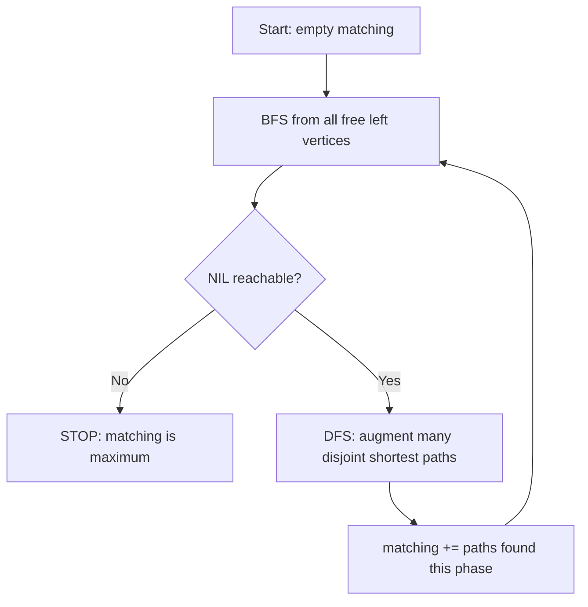

# Hopcroft-Karp Algorithm — Junior Level

> **One-line summary:** Hopcroft-Karp finds the **maximum-cardinality matching** in a bipartite graph in `O(E·√V)` time — much faster than Kuhn's `O(V·E)` — by repeatedly doing a BFS to find the length of the shortest augmenting paths, then a DFS that augments along **many vertex-disjoint shortest paths at once** in each phase, needing only `O(√V)` phases.

---

## Table of Contents

1. [Introduction](#introduction)
2. [Prerequisites](#prerequisites)
3. [Glossary](#glossary)
4. [Core Concepts](#core-concepts)
5. [Big-O Summary](#big-o-summary)
6. [Real-World Analogies](#real-world-analogies)
7. [Pros & Cons](#pros--cons)
8. [Step-by-Step Walkthrough](#step-by-step-walkthrough)
9. [Code Examples](#code-examples)
10. [Coding Patterns](#coding-patterns)
11. [Error Handling](#error-handling)
12. [Performance Tips](#performance-tips)
13. [Best Practices](#best-practices)
14. [Edge Cases & Pitfalls](#edge-cases--pitfalls)
15. [Common Mistakes](#common-mistakes)
16. [Cheat Sheet](#cheat-sheet)
17. [Visual Animation](#visual-animation)
18. [Summary](#summary)
19. [Further Reading](#further-reading)

---

## Introduction

The **Hopcroft-Karp algorithm** (John Hopcroft and Richard Karp, 1973) solves exactly the same problem as Kuhn's algorithm from the sibling topic `23-bipartite-matching`: find the **largest possible set of pairs** in a bipartite graph, where each pair joins one vertex on the left with one vertex on the right, and no vertex is used twice. The difference is *speed*. Where Kuhn runs in `O(V·E)`, Hopcroft-Karp runs in `O(E·√V)` — and on large, dense bipartite graphs that `√V` factor is a dramatic win.

If you have not yet read `23-bipartite-matching/junior.md`, read it first. This file assumes you already know what a *matching*, a *free vertex*, an *alternating path*, and an *augmenting path* are, and that you have seen Kuhn's DFS find one augmenting path at a time. Hopcroft-Karp keeps the *idea* of augmenting paths intact — Berge's theorem still powers correctness — but changes the *schedule* in which they are found.

Here is the one sentence that captures the whole speedup:

> Instead of finding **one** augmenting path per search (Kuhn), Hopcroft-Karp finds, in each *phase*, a **maximal set of vertex-disjoint shortest augmenting paths** all at once — and a beautiful theorem guarantees that only `O(√V)` phases are ever needed.

Each phase has two halves:

1. A **BFS** from all free left vertices. The BFS does not find a single path — it computes the *distance layers*: the length of the shortest augmenting path, and which vertices lie on shortest augmenting paths at all. This builds a "layered graph."
2. A **DFS** that walks the layered graph, augmenting along as many vertex-disjoint shortest paths as it can find before the phase ends.

That is the entire engine. The BFS measures "how long is the shortest augmenting path right now?"; the DFS greedily grabs a *maximal bundle* of those shortest paths; the matching grows by the number of paths found; and the process repeats with the shortest-path length now strictly larger. Because the shortest augmenting path length strictly increases each phase and is bounded, only `O(√V)` phases run — that bound is proven carefully in `professional.md`.

---

## Prerequisites

Before reading this file you should be comfortable with:

- **Bipartite matching and Kuhn's algorithm** — sibling topic `23-bipartite-matching`. This is essential; we build directly on it.
- **Augmenting paths** — an alternating path between two free vertices that grows the matching by one when flipped.
- **BFS** — breadth-first search and the idea of *distance from a source* / level layers (sibling `02-bfs`).
- **DFS** — depth-first search with backtracking (sibling `03-dfs`).
- **Adjacency lists** — `adj[u]` = right neighbors of left vertex `u`.
- **Big-O notation** — `O(V·E)`, `O(E·√V)`.

Optional but helpful:

- A first look at **max-flow** (sibling `16-max-flow-edmonds-karp-dinic`) — Hopcroft-Karp is essentially **Dinic's algorithm specialized to unit-capacity bipartite graphs**, and the `O(E√V)` bound is the same one Dinic achieves there.
- The **Hungarian algorithm** (covered in `23-bipartite-matching/professional.md`) — for the *weighted* assignment problem, which Hopcroft-Karp does **not** solve.

---

## Glossary

| Term | Meaning |
|------|---------|
| **Bipartite graph** | Vertices split into two sets `L`, `R`; every edge goes between the sets, never inside one. |
| **Matching `M`** | A set of edges with no shared endpoints. |
| **Maximum matching** | A matching of the largest possible size (cardinality). |
| **Free / unmatched / exposed vertex** | A vertex not covered by any edge in `M`. |
| **Matched / saturated vertex** | A vertex that *is* an endpoint of some edge in `M`. |
| **Alternating path** | A path whose edges alternate between "not in `M`" and "in `M`." |
| **Augmenting path** | An alternating path whose **both endpoints are free**. Flipping it grows `M` by one. |
| **Shortest augmenting path** | An augmenting path of minimum edge-length for the current matching. Hopcroft-Karp only uses these. |
| **Phase** | One BFS + one DFS round. Finds a maximal set of vertex-disjoint shortest augmenting paths. |
| **Layered graph** | The DAG of distance layers the BFS builds; DFS only follows edges that go from layer `d` to layer `d+1`. |
| **Vertex-disjoint paths** | Paths sharing no vertex, so they can all be flipped simultaneously without conflict. |
| **Maximal (set of paths)** | A set you cannot extend by adding one more disjoint shortest path. (Not necessarily *maximum* — just locally stuck.) |
| **`dist[]`** | BFS distance layer of each left vertex; `INF` if not reachable on a shortest augmenting path. |
| **NIL** | A sentinel "free / no-match" marker, often modeled as a virtual vertex `0`. |

---

## Core Concepts

### 1. Same problem, same theorem, faster schedule

Hopcroft-Karp solves **maximum-cardinality bipartite matching**, identical to Kuhn. Correctness rests on the same foundation:

> **Berge's theorem (1957):** A matching `M` is maximum **if and only if** there is no augmenting path with respect to `M`.

So *any* method that keeps augmenting until no augmenting path remains is correct. Kuhn augments one path at a time. Hopcroft-Karp augments a whole *bundle* of shortest paths per phase. Both stop at the same maximum size — they only differ in how many searches they perform.

### 2. The two-part phase: BFS layers, then DFS augments

Each phase does:

```
PHASE:
  1. BFS from all free LEFT vertices simultaneously.
     - Assign each left vertex a distance "layer."
     - Determine the length d of the shortest augmenting path.
     - If no augmenting path exists -> STOP, matching is maximum.
  2. DFS from each free left vertex through the layered graph.
     - Only follow edges that go from layer k to layer k+1.
     - Each augmenting path found is flipped immediately.
     - Find a MAXIMAL set of vertex-disjoint shortest augmenting paths.
  3. matching size += (number of augmenting paths found this phase).
```

The BFS does **not** augment. Its only job is to *measure the shortest augmenting-path length* and tag which vertices can lie on a shortest such path. The DFS does the actual augmenting, but it is constrained to walk only "forward" layer-by-layer so every path it finds has exactly that shortest length.

### 3. Why "many paths at once" is the whole point

In Kuhn, each augmenting path costs a full `O(E)` DFS, and you may need up to `V` of them — hence `O(V·E)`. Hopcroft-Karp's trick is that **one DFS sweep finds many disjoint augmenting paths together**, and the number of phases is tiny (`O(√V)`). The total work becomes `O(E)` per phase × `O(√V)` phases = `O(E·√V)`.

The intuition for *why* only `O(√V)` phases: the shortest augmenting-path length **strictly increases** after every phase (proven in `professional.md`). After about `√V` phases the shortest augmenting path is already longer than `√V` edges; but there can be only `√V` more augmenting paths left (each long path "uses up" many vertices), so a few more phases finish the job. The two regimes — "many short phases" and "few remaining long paths" — meet at `√V`.

### 4. The layered graph (why DFS stays "shortest")

After BFS, picture the vertices arranged in horizontal layers by distance from the free left vertices:

```
layer 0:  free left vertices
layer 1:  right vertices one edge away (via an unmatched edge)
layer 2:  left vertices reached by following a matched edge back
layer 3:  right vertices reached via the next unmatched edge
...
```

The DFS is **only** allowed to step from a vertex in layer `k` to a neighbor in layer `k+1`. This guarantees every path it traces is a *shortest* augmenting path. Once a vertex is used by one path in this phase, it is removed from consideration (we often mark `dist` as exhausted), keeping the chosen paths **vertex-disjoint**.

### 5. The standard NIL / virtual-vertex formulation

The cleanest implementation models "unmatched" as a virtual vertex called **NIL** (index `0`, with real vertices numbered from `1`). Then:

- `pairU[u]` = the right vertex matched to left `u`, or `NIL`.
- `pairV[v]` = the left vertex matched to right `v`, or `NIL`.
- `dist[u]` = BFS layer of left vertex `u`; `dist[NIL]` represents "reached a free right vertex," i.e. an augmenting path completed.

A left vertex `u` is **free** exactly when `pairU[u] == NIL`. The BFS seeds its queue with all free left vertices at distance 0; reaching `dist[NIL]` means an augmenting path of that length exists.

---

## Big-O Summary

| Algorithm | Problem | Time | Space | When to use |
|-----------|---------|------|-------|-------------|
| **Hopcroft-Karp** | Max cardinality | **`O(E·√V)`** | `O(V + E)` | Large / dense bipartite graphs — the fast choice. |
| **Kuhn (DFS augmenting)** | Max cardinality | `O(V·E)` | `O(V + E)` | Small graphs; simplest to code. |
| **Dinic on unit-cap flow** | Max cardinality | `O(E·√V)` | `O(V + E)` | Same bound; use if you already have a flow library. |
| **Hungarian (Kuhn-Munkres)** | Min-cost / max-weight assignment | `O(V³)` | `O(V²)` | **Weighted** assignment — Hopcroft-Karp can't do weights. |

| Aspect | Complexity | Notes |
|--------|------------|-------|
| Time | **`O(E·√V)`** | `O(E)` per phase × `O(√V)` phases. |
| Phases | **`O(√V)`** | Shortest augmenting path length strictly increases each phase. |
| Work per phase | `O(E)` | One BFS (`O(E)`) plus one layered DFS (`O(E)` amortized). |
| Space | `O(V + E)` | Adjacency lists + `pairU`, `pairV`, `dist`. |
| Weighted? | No | Cardinality only; for weights use Hungarian / min-cost flow. |

`√V` here means the square root of the number of vertices. On a balanced graph with `n` left and `n` right vertices and `E` edges, `O(E·√V) = O(E·√(2n))`. For `E ≈ n²` (dense), Kuhn is `O(n³)` while Hopcroft-Karp is `O(n^{2.5})` — a factor of `√n` faster.

---

## Real-World Analogies

| Concept | Analogy |
|---------|---------|
| Maximum matching | Pairing as many job applicants to suitable openings as possible — one job each, one applicant each. |
| Augmenting path | A "chain reschedule": applicant A is bumped to a different opening so applicant B can take A's old slot, freeing up a slot for C, and so on, netting one more placement. |
| BFS layering | A recruiter first asking "what is the *shortest* reshuffle that lets us hire one more person?" before committing to any moves. |
| Many disjoint paths per phase | Running *several* independent reshuffle chains in the same hiring round, as long as no two chains touch the same person or opening. |
| `O(√V)` phases | After a few rounds of easy reshuffles, only a handful of long, complicated chains remain — and there can't be many of those, so the process finishes fast. |

Where the analogy breaks: real hiring has preferences and salaries (weights); Hopcroft-Karp ignores all of that and maximizes the raw *count* of placements. Weighted assignment is the Hungarian algorithm's job.

---

## Pros & Cons

| Pros | Cons |
|------|------|
| **`O(E·√V)`** — asymptotically faster than Kuhn on large graphs. | More complex to implement than Kuhn (BFS + layered DFS). |
| **Provably optimal** — same Berge-theorem guarantee. | **Bipartite only** — fails on general graphs (needs Blossom). |
| Each phase finds **many** augmenting paths, amortizing cost. | **Cardinality only** — does not handle weights/costs. |
| Excellent on **dense** bipartite graphs and large datasets. | Harder to debug — two intertwined searches with shared state. |
| Same `O(E√V)` bound as Dinic, but a simpler, self-contained implementation. | Overkill for tiny graphs — Kuhn is simpler and fast enough. |

**When to use:** large or dense bipartite graphs, performance-critical matching, thousands+ of vertices, when Kuhn's `O(V·E)` is too slow.

**When NOT to use:** tiny graphs (use Kuhn — simpler), weighted assignment (use Hungarian), or non-bipartite graphs (use Edmonds' Blossom).

---

## Step-by-Step Walkthrough

Take a bipartite graph. Left `L = {1, 2, 3}`, right `R = {a, b, c}` (we number right as `1=a, 2=b, 3=c` internally, but use letters for clarity). Edges:

```
1 — a
1 — b
2 — a
3 — b
3 — c
```

Start with **empty matching** `M = {}`. All of `1, 2, 3` are free, all of `a, b, c` are free.

### Phase 1 — BFS

Seed the BFS with all free left vertices `{1, 2, 3}` at distance 0. Because every right vertex is free, the shortest augmenting path has length **1** (a single unmatched edge to a free right vertex). The layered graph is trivial: every left→right edge to a free right vertex is a valid length-1 augmenting path.

### Phase 1 — DFS (find a *maximal disjoint set* of length-1 paths)

DFS from each free left vertex, taking any free right neighbor, marking used vertices so paths stay disjoint:

- `1` → `a` (a free): augment. `M = {1—a}`.
- `2` → `a`? `a` now used this phase → try next. `2` has no other neighbor → `2` stays free this phase.
- `3` → `b` (b free): augment. `M = {1—a, 3—b}`.

Phase 1 found **2** vertex-disjoint augmenting paths in one sweep. Matching size = **2**.

```
1 —— a    (matched)
2         (still free)
3 —— b    (matched)
          c still free
```

A naive Kuhn would have used two separate DFS searches here; Hopcroft-Karp did both in a single phase.

### Phase 2 — BFS

Now only `2` is free on the left; `c` is free on the right. The shortest augmenting path is **longer than 1** (since `2`'s only neighbor `a` is matched). BFS layers:

```
layer 0:  2            (free left)
layer 1:  a            (2—a, unmatched edge)
layer 2:  1            (a—1, matched edge: a is matched to 1)
layer 3:  b            (1—b, unmatched edge)
layer 4:  3            (b—3, matched edge)
layer 5:  c            (3—c, unmatched edge -> c is FREE) -> augmenting path of length 5
```

So the shortest augmenting path now has length **5** — strictly longer than phase 1's length **1**. (This strict increase is the heart of the `O(√V)` proof.)

### Phase 2 — DFS

DFS from `2` along the layered graph:

```
2 -a- 1 -b- 3 -c-
```

This is the augmenting path `2 → a → 1 → b → 3 → c`. Flip every edge:

- `2—a` becomes matched, `a—1` becomes unmatched,
- `1—b` becomes matched, `b—3` becomes unmatched,
- `3—c` becomes matched.

New matching: `M = {2—a, 1—b, 3—c}`, size **3**.

```
1 —— b
2 —— a
3 —— c
```

### Phase 3 — BFS

No free left vertices remain → BFS finds no augmenting path → **STOP**. The maximum matching has size **3** (a perfect matching).

**Two phases of real work** for this graph. The first phase grabbed two easy length-1 paths together; the second handled the one remaining length-5 reshuffle. That "batch the short paths, then handle the few long ones" rhythm is exactly why Hopcroft-Karp is fast.

---

## Code Examples

Below is the full Hopcroft-Karp algorithm in all three languages, using the classic **NIL = 0** virtual-vertex formulation. Left vertices are `1..nL`, right vertices `1..nR`. `adj[u]` lists the right neighbors of left vertex `u`. Result: the size of the maximum matching, with `pairU`/`pairV` holding the actual pairing.

#### Go

```go
package main

import "fmt"

const INF = 1 << 30

type HopcroftKarp struct {
	nL, nR int
	adj    [][]int // adj[u] = right neighbors of left vertex u (u in 1..nL)
	pairU  []int   // pairU[u] = right matched to left u, or 0 (NIL)
	pairV  []int   // pairV[v] = left matched to right v, or 0 (NIL)
	dist   []int   // BFS layer of each left vertex; dist[0] is NIL's layer
}

func NewHK(nL, nR int) *HopcroftKarp {
	h := &HopcroftKarp{nL: nL, nR: nR}
	h.adj = make([][]int, nL+1)
	h.pairU = make([]int, nL+1)
	h.pairV = make([]int, nR+1)
	h.dist = make([]int, nL+1)
	return h
}

func (h *HopcroftKarp) AddEdge(u, v int) { h.adj[u] = append(h.adj[u], v) }

// bfs builds distance layers; returns true if any augmenting path exists.
func (h *HopcroftKarp) bfs() bool {
	queue := []int{}
	for u := 1; u <= h.nL; u++ {
		if h.pairU[u] == 0 { // free left vertex -> layer 0
			h.dist[u] = 0
			queue = append(queue, u)
		} else {
			h.dist[u] = INF
		}
	}
	h.dist[0] = INF // NIL
	for len(queue) > 0 {
		u := queue[0]
		queue = queue[1:]
		if h.dist[u] < h.dist[0] {
			for _, v := range h.adj[u] {
				w := h.pairV[v] // left vertex matched to v (or NIL)
				if h.dist[w] == INF {
					h.dist[w] = h.dist[u] + 1
					queue = append(queue, w)
				}
			}
		}
	}
	return h.dist[0] != INF // reached NIL => an augmenting path exists
}

// dfs tries to augment along a shortest path starting at u.
func (h *HopcroftKarp) dfs(u int) bool {
	if u == 0 {
		return true // reached NIL: augmenting path complete
	}
	for _, v := range h.adj[u] {
		w := h.pairV[v]
		if h.dist[w] == h.dist[u]+1 && h.dfs(w) {
			h.pairV[v] = u
			h.pairU[u] = v
			return true
		}
	}
	h.dist[u] = INF // dead end: don't revisit this phase
	return false
}

func (h *HopcroftKarp) MaxMatching() int {
	matching := 0
	for h.bfs() { // each iteration is one phase
		for u := 1; u <= h.nL; u++ {
			if h.pairU[u] == 0 && h.dfs(u) {
				matching++
			}
		}
	}
	return matching
}

func main() {
	h := NewHK(3, 3) // L={1,2,3}, R={a=1,b=2,c=3}
	h.AddEdge(1, 1)  // 1—a
	h.AddEdge(1, 2)  // 1—b
	h.AddEdge(2, 1)  // 2—a
	h.AddEdge(3, 2)  // 3—b
	h.AddEdge(3, 3)  // 3—c
	fmt.Println("Max matching:", h.MaxMatching()) // 3
	fmt.Println("pairU:", h.pairU[1:])            // e.g. [2 1 3]
}
```

#### Java

```java
import java.util.*;

public class HopcroftKarp {
    static final int INF = Integer.MAX_VALUE;
    private final int nL, nR;
    private final List<List<Integer>> adj;
    private final int[] pairU; // pairU[u] = right matched to left u, or 0 (NIL)
    private final int[] pairV; // pairV[v] = left matched to right v, or 0 (NIL)
    private final int[] dist;  // BFS layers; index 0 is NIL

    public HopcroftKarp(int nL, int nR) {
        this.nL = nL;
        this.nR = nR;
        adj = new ArrayList<>();
        for (int i = 0; i <= nL; i++) adj.add(new ArrayList<>());
        pairU = new int[nL + 1];
        pairV = new int[nR + 1];
        dist = new int[nL + 1];
    }

    public void addEdge(int u, int v) { adj.get(u).add(v); }

    private boolean bfs() {
        Deque<Integer> queue = new ArrayDeque<>();
        for (int u = 1; u <= nL; u++) {
            if (pairU[u] == 0) { dist[u] = 0; queue.add(u); }
            else dist[u] = INF;
        }
        dist[0] = INF; // NIL
        while (!queue.isEmpty()) {
            int u = queue.poll();
            if (dist[u] < dist[0]) {
                for (int v : adj.get(u)) {
                    int w = pairV[v];
                    if (dist[w] == INF) {
                        dist[w] = dist[u] + 1;
                        queue.add(w);
                    }
                }
            }
        }
        return dist[0] != INF;
    }

    private boolean dfs(int u) {
        if (u == 0) return true; // reached NIL
        for (int v : adj.get(u)) {
            int w = pairV[v];
            if (dist[w] == dist[u] + 1 && dfs(w)) {
                pairV[v] = u;
                pairU[u] = v;
                return true;
            }
        }
        dist[u] = INF;
        return false;
    }

    public int maxMatching() {
        int matching = 0;
        while (bfs()) {
            for (int u = 1; u <= nL; u++) {
                if (pairU[u] == 0 && dfs(u)) matching++;
            }
        }
        return matching;
    }

    public static void main(String[] args) {
        HopcroftKarp h = new HopcroftKarp(3, 3);
        h.addEdge(1, 1); h.addEdge(1, 2);
        h.addEdge(2, 1);
        h.addEdge(3, 2); h.addEdge(3, 3);
        System.out.println("Max matching: " + h.maxMatching()); // 3
        System.out.println("pairU: " + Arrays.toString(h.pairU)); // [0, 2, 1, 3]
    }
}
```

#### Python

```python
import sys
from collections import deque

INF = float("inf")


class HopcroftKarp:
    def __init__(self, n_left, n_right):
        self.n_left = n_left
        self.n_right = n_right
        self.adj = [[] for _ in range(n_left + 1)]   # adj[u], u in 1..n_left
        self.pair_u = [0] * (n_left + 1)             # 0 == NIL
        self.pair_v = [0] * (n_right + 1)
        self.dist = [0] * (n_left + 1)

    def add_edge(self, u, v):
        self.adj[u].append(v)

    def _bfs(self):
        queue = deque()
        for u in range(1, self.n_left + 1):
            if self.pair_u[u] == 0:
                self.dist[u] = 0
                queue.append(u)
            else:
                self.dist[u] = INF
        self.dist[0] = INF  # NIL
        while queue:
            u = queue.popleft()
            if self.dist[u] < self.dist[0]:
                for v in self.adj[u]:
                    w = self.pair_v[v]
                    if self.dist[w] == INF:
                        self.dist[w] = self.dist[u] + 1
                        queue.append(w)
        return self.dist[0] != INF

    def _dfs(self, u):
        if u == 0:
            return True  # reached NIL
        for v in self.adj[u]:
            w = self.pair_v[v]
            if self.dist[w] == self.dist[u] + 1 and self._dfs(w):
                self.pair_v[v] = u
                self.pair_u[u] = v
                return True
        self.dist[u] = INF
        return False

    def max_matching(self):
        matching = 0
        while self._bfs():
            for u in range(1, self.n_left + 1):
                if self.pair_u[u] == 0 and self._dfs(u):
                    matching += 1
        return matching


if __name__ == "__main__":
    sys.setrecursionlimit(10**6)
    h = HopcroftKarp(3, 3)  # L={1,2,3}, R={a=1,b=2,c=3}
    h.add_edge(1, 1); h.add_edge(1, 2)
    h.add_edge(2, 1)
    h.add_edge(3, 2); h.add_edge(3, 3)
    print("Max matching:", h.max_matching())  # 3
    print("pair_u:", h.pair_u[1:])             # e.g. [2, 1, 3]
```

**What it does:** repeats BFS (build layers) + DFS (augment many disjoint shortest paths) until no augmenting path remains, returning the maximum matching size **3** for this graph.
**Run:** `go run main.go` | `javac HopcroftKarp.java && java HopcroftKarp` | `python hk.py`

---

## Coding Patterns

### Pattern 1: NIL as a virtual vertex

**Intent:** Model "unmatched" as a single sentinel vertex `0`, so `pairU[u] == 0` means free and the BFS naturally terminates when it reaches `dist[0]`.

```python
NIL = 0
# free left vertex u  <=>  pair_u[u] == NIL
# reaching NIL in BFS  <=>  an augmenting path of the current length exists
```

### Pattern 2: BFS measures, DFS augments

**Intent:** Keep the two searches' jobs separate. BFS *only* assigns layers and checks reachability of NIL; it never mutates `pairU`/`pairV`. DFS *only* augments, constrained to `dist[w] == dist[u] + 1`.

```python
while bfs():                 # one phase
    for u in free_left:
        if dfs(u):
            matching += 1
```

### Pattern 3: `dist[u] = INF` to prune dead ends

**Intent:** When a DFS from `u` fails, set `dist[u] = INF` so no other path in the same phase wastes time exploring `u` again. This keeps each phase `O(E)`.



---

## Error Handling

| Error | Cause | Fix |
|-------|-------|-----|
| Wrong (too small) matching | Forgot to repeat phases — ran BFS/DFS once. | Loop `while bfs()`; keep phasing until no augmenting path. |
| Infinite loop | BFS always reports an augmenting path because `dist[u] = INF` pruning is missing. | Set `dist[u] = INF` when a DFS dead-ends. |
| Index errors | Mixed 0-based real vertices with the NIL=0 convention. | Number real vertices from `1`; reserve `0` for NIL. |
| Wrong answer on general graph | Input is not bipartite. | 2-color the graph first; reject odd cycles (see `23-bipartite-matching`). |
| Python `RecursionError` | Long augmenting chains exceed recursion depth. | `sys.setrecursionlimit(...)` or convert DFS to an explicit stack. |
| Off-by-one in `pairU`/`pairV` sizes | Arrays sized `nL`/`nR` instead of `nL+1`/`nR+1`. | Allocate `nL+1` and `nR+1` to leave room for NIL. |

---

## Performance Tips

- **Put the smaller side on the left.** You launch a DFS per free left vertex; fewer left vertices means fewer launches and a smaller `√V` factor.
- **Reuse arrays across phases.** Only `dist` is rewritten each BFS; `pairU`/`pairV`/`adj` persist. Avoid reallocating.
- **Greedy warm start.** Before the first phase, greedily match any left vertex to a free neighbor. This shrinks the number of phases on random graphs.
- **Iterative DFS for huge graphs.** In Python especially, an explicit stack avoids recursion-limit blowups and is faster.
- **Adjacency lists, not matrices** — unless the graph is genuinely tiny and dense.
- **Stop early** the instant `bfs()` returns false; that is the maximum-matching certificate.

---

## Best Practices

- Always **verify bipartiteness** before running; Hopcroft-Karp silently gives wrong answers on non-bipartite graphs.
- Keep **cardinality vs. weighted** straight: if the problem mentions costs/profits/weights, you need Hungarian or min-cost flow, *not* Hopcroft-Karp.
- Return both the matching **size** and the **pairs** (`pairU`/`pairV`); callers usually need the actual assignment.
- Add a cheap invariant test: `|M| <= min(|L|, |R|)`.
- Document the NIL convention in a comment — readers unfamiliar with it find the `0`/`+1` indexing confusing.
- For small inputs, prefer Kuhn (`23-bipartite-matching`) — simpler, easier to verify, and fast enough.

---

## Edge Cases & Pitfalls

| Case | What to watch for |
|------|-------------------|
| Empty graph | Matching size `0`; `bfs()` returns false immediately. |
| No edges | Size `0` even with many vertices. |
| Complete bipartite `K_{n,n}` | Perfect matching of size `n`; phase 1 finds many length-1 paths. |
| Duplicate edges | Harmless but wasteful; dedupe adjacency lists. |
| Unbalanced sides | Max matching `<= min(|L|, |R|)`; no perfect matching possible. |
| Disconnected components | Each handled within the same BFS/DFS naturally. |
| Non-bipartite (odd cycle) | WRONG answer silently — must 2-color first. |
| Isolated vertices | Never matched; reduce achievable size. |

---

## Common Mistakes

1. **Running only one phase.** Hopcroft-Karp must repeat phases `while bfs()`; a single round finds only the shortest paths, not the maximum matching.
2. **Forgetting `dist[u] = INF` on DFS failure.** Without it, the same dead-end vertex is re-explored, breaking the `O(E)` per-phase bound (or looping forever).
3. **Mismatched NIL indexing.** Numbering real vertices from `0` collides with NIL=`0`. Start real vertices at `1`.
4. **Using it on a non-bipartite graph.** Like Kuhn, it produces plausible-looking but wrong numbers.
5. **Treating weights as handled.** Hopcroft-Karp maximizes *count*, never weight.
6. **Augmenting inside BFS.** BFS must only build layers; mutating the matching there corrupts the layered graph.
7. **Recursion limit in Python** on long augmenting chains.

---

## Cheat Sheet

```text
PROBLEM:   max number of disjoint left-right pairs in a bipartite graph
THEOREM:   M is maximum  <=>  no augmenting path (Berge)
KEY IDEA:  each PHASE = BFS (build layers) + DFS (augment many disjoint
           SHORTEST augmenting paths at once)
PHASES:    O(sqrt(V)) — shortest augmenting path length strictly increases
TIME:      O(E * sqrt(V))    SPACE: O(V + E)
NIL:       index 0; pairU[u]==0 => free; reaching dist[0] => path exists
DFS RULE:  only step u -> w when dist[w] == dist[u] + 1
PRUNE:     on DFS failure set dist[u] = INF
GOTCHAS:   loop while bfs(); bipartite-only; cardinality != weighted
```

Core loop:

```text
while bfs():                       # one phase; false => maximum reached
    for each free left u:
        if dfs(u): matching += 1
```

vs. Kuhn (one path per search):

```text
for each left u:
    reset visited
    if tryKuhn(u): matching += 1   # O(V * E) total
```

---

## Visual Animation

> See [`animation.html`](./animation.html) for an interactive visual animation of the Hopcroft-Karp algorithm.
>
> The animation demonstrates:
> - The bipartite graph drawn as two columns, matched edges solid, unmatched dashed
> - The **BFS** assigning distance layers (the layered graph)
> - The **DFS** augmenting along **multiple vertex-disjoint shortest augmenting paths** in one phase
> - The matching size growing phase by phase
> - The shortest augmenting-path length strictly increasing each phase
> - Step / Run / Reset controls, an info panel, a Big-O table, and an operation log

---

## Summary

- **Hopcroft-Karp** solves the same problem as Kuhn — maximum-cardinality bipartite matching — but in **`O(E·√V)`** instead of `O(V·E)`.
- It keeps **Berge's theorem** for correctness: augment until no augmenting path remains.
- Each **phase** is a **BFS** (build distance layers / measure the shortest augmenting-path length) followed by a **DFS** that augments along a **maximal set of vertex-disjoint shortest augmenting paths** all at once.
- Only **`O(√V)` phases** are needed because the shortest augmenting-path length strictly increases each phase (proven in `professional.md`).
- It is **bipartite-only** and **cardinality-only** — for weights use the Hungarian algorithm; for general graphs use Blossom.
- Prefer it over Kuhn for **large or dense** bipartite graphs; prefer Kuhn for small ones.

---

## Further Reading

- Hopcroft, J. E., & Karp, R. M. (1973). *An n^{5/2} Algorithm for Maximum Matchings in Bipartite Graphs.* SIAM J. Comput. 2(4):225–231 — the original paper.
- Berge, C. (1957). *Two theorems in graph theory* — the augmenting-path theorem.
- Cormen, Leiserson, Rivest, Stein — *Introduction to Algorithms*, the flow & matching chapters (Dinic / Hopcroft-Karp connection).
- cp-algorithms.com — "Kuhn's algorithm" and "Maximum matching" articles.
- Sibling topics: `23-bipartite-matching` (Kuhn), `02-bfs`, `03-dfs`, `16-max-flow-edmonds-karp-dinic` (Dinic).

---

**Next step:** Continue to [`middle.md`](./middle.md) to learn *why* the phase structure works, *when* to choose Hopcroft-Karp over Kuhn, and how the BFS/DFS phase idea connects to Dinic's max-flow algorithm.
