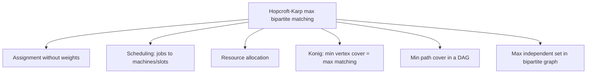
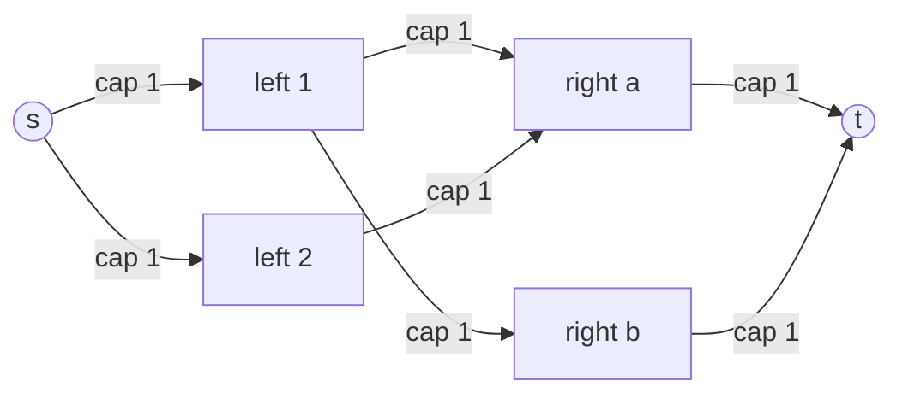

# Hopcroft-Karp Algorithm — Middle Level

> **One-line summary:** Hopcroft-Karp beats Kuhn's `O(V·E)` because it finds a *maximal set of vertex-disjoint shortest augmenting paths* per phase; the shortest augmenting-path length strictly increases each phase, so only `O(√V)` phases run — making it the bipartite-matching specialization of Dinic's `O(E√V)` max-flow algorithm.

---

## Table of Contents

1. [Introduction](#introduction)
2. [Deeper Concepts](#deeper-concepts)
3. [Comparison with Alternatives](#comparison-with-alternatives)
4. [Advanced Patterns](#advanced-patterns)
5. [Graph and Tree Applications](#graph-and-tree-applications)
6. [Connection to Max-Flow (Dinic)](#connection-to-max-flow)
7. [Code Examples](#code-examples)
8. [Error Handling](#error-handling)
9. [Performance Analysis](#performance-analysis)
10. [Best Practices](#best-practices)
11. [Visual Animation](#visual-animation)
12. [Summary](#summary)

---

## Introduction

> Focus: "Why does it work?" and "When should I choose this over Kuhn?"

At the junior level you saw *what* Hopcroft-Karp does: alternate a BFS (build layers) and a DFS (augment along many disjoint shortest paths) until no augmenting path remains. At the middle level we answer the harder questions:

- **Why** does batching *shortest* augmenting paths give `O(√V)` phases, when Kuhn's per-path search gives `O(V)` searches?
- **When** is the `√V` factor worth the extra implementation complexity?
- **How** does this algorithm relate to Dinic's max-flow, and why are they "the same algorithm" in disguise?

The single most important fact to internalize is this invariant:

> **Phase invariant:** Let `ℓ` be the length of the shortest augmenting path with respect to the current matching. After one full Hopcroft-Karp phase, the shortest augmenting-path length is **strictly greater** than `ℓ`.

Everything — the `√V` bound, the layered graph, the "maximal set" requirement — flows from this one monotonicity property. The full formal proof lives in `professional.md`; here we build the intuition and the engineering judgment around it.

---

## Deeper Concepts

### Invariant: shortest augmenting path length strictly increases

Kuhn finds *any* augmenting path. Hopcroft-Karp deliberately finds only the **shortest** ones in each phase, and a *maximal disjoint set* of them. The payoff is the strict-increase invariant above. Why does finding a *maximal* set force the next phase's shortest path to be longer?

- After a phase, every shortest augmenting path of length `ℓ` has been "blocked": either it was used (and flipped), or it was destroyed because it shared a vertex with one that was used. Because we took a *maximal* disjoint set, no length-`ℓ` augmenting path can survive untouched.
- Any augmenting path that remains must therefore have length `> ℓ` (it is forced to detour around the now-flipped edges).

This is precisely the *blocking flow* property from Dinic's algorithm. If you took a non-maximal set, a length-`ℓ` path could survive and the length would *not* increase — which is why "maximal" is non-negotiable.

### Why strict increase gives `O(√V)` phases

Sketch (full proof in `professional.md`):

1. Run Hopcroft-Karp for `√V` phases. By strict increase, the shortest augmenting-path length is now `> √V`.
2. Let `M` be the current matching and `M*` the maximum. The symmetric difference `M ⊕ M*` decomposes into vertex-disjoint augmenting paths. Each remaining augmenting path has length `> √V`, so it uses `> √V` vertices.
3. These augmenting paths are vertex-disjoint, so there can be at most `V / √V = √V` of them. Hence at most `√V` augmenting paths remain.
4. Each subsequent phase increases the matching by at least one, so at most `√V` more phases finish the job.

Total phases: `√V + √V = O(√V)`. Each phase is `O(E)`. Total: **`O(E·√V)`**.

### The layered graph as a DAG

The BFS turns the matching-search structure into a **layered DAG**:

- Layer 0: free left vertices.
- Even layers: left vertices. Odd layers: right vertices.
- Edges from layer `k` to layer `k+1` only. From a left vertex you take an **unmatched** edge to a right vertex; from a right vertex you take its **matched** edge back to a left vertex.
- The DFS is restricted to this DAG (`dist[w] == dist[u] + 1`), guaranteeing every path it finds is *shortest*.

Because the DAG is acyclic and layered, a single DFS sweep (with the `dist[u] = INF` dead-end pruning) processes each edge `O(1)` amortized times — keeping the phase at `O(E)`.

### The role of "maximal" vs "maximum"

A subtle but crucial distinction:

- The DFS finds a **maximal** set of vertex-disjoint shortest augmenting paths — one you cannot extend by adding another disjoint shortest path. This is cheap (`O(E)`).
- It does **not** need the **maximum** such set (the largest possible). Finding the maximum set would be as hard as the original problem. Maximality is sufficient for the strict-increase invariant, and that is all we need.

This mirrors Dinic exactly: a *blocking flow* is maximal, not maximum, yet it suffices to advance the phase.

---

## Comparison with Alternatives

| Attribute | Hopcroft-Karp | Kuhn (DFS) | Dinic (unit-cap flow) | Hungarian |
|-----------|---------------|------------|-----------------------|-----------|
| Problem | Max cardinality | Max cardinality | Max cardinality | Min-cost / max-weight |
| Time | **`O(E·√V)`** | `O(V·E)` | `O(E·√V)` | `O(V³)` |
| Space | `O(V+E)` | `O(V+E)` | `O(V+E)` | `O(V²)` |
| Weighted? | No | No | No | **Yes** |
| Per-search work | `O(E)` (whole phase) | `O(E)` (one path) | `O(E)` (blocking flow) | `O(V²)` per iteration |
| Searches needed | `O(√V)` phases | `O(V)` searches | `O(√V)` phases | `O(V)` iterations |
| Code complexity | Medium | Low | Medium-High | High |
| Best for | Large/dense bipartite | Small bipartite | When flow lib exists | Weighted assignment |

**Choose Hopcroft-Karp when:** the bipartite graph is large or dense and you need raw cardinality matching fast; `V` is in the thousands+ and Kuhn's `O(V·E)` is too slow.

**Choose Kuhn when:** the graph is small, you value simplicity, and `O(V·E)` is acceptable. (Honestly, up to ~`10^4` edges Kuhn is fine.)

**Choose Hungarian when:** the problem has **weights** (costs, profits, distances) — Hopcroft-Karp cannot optimize weight, only count.

**Choose Dinic when:** you already have a max-flow library; building the unit-capacity bipartite flow network gives the same `O(E√V)` for free.

### Concrete numbers

For a balanced graph with `n` left, `n` right, `V = 2n`:

| `n` | `E` (dense ≈ n²) | Kuhn `O(V·E)` ≈ `n³` | Hopcroft-Karp `O(E√V)` ≈ `n^{2.5}` | Speedup ≈ `√n` |
|-----|------------------|----------------------|-------------------------------------|----------------|
| 100 | 10,000 | 10⁶ | 10⁵ | 10× |
| 1,000 | 10⁶ | 10⁹ | ~3×10⁷ | ~32× |
| 10,000 | 10⁸ | 10¹² | ~10⁹ | ~100× |

The gap widens with size — that is the entire reason Hopcroft-Karp exists.

---

## Advanced Patterns

### Pattern: Greedy warm start before phasing

A cheap greedy pre-match reduces the number of phases without affecting correctness (augmenting paths repair any suboptimal greedy choices).

#### Go

```go
func (h *HopcroftKarp) greedyWarmStart() int {
	matched := 0
	for u := 1; u <= h.nL; u++ {
		for _, v := range h.adj[u] {
			if h.pairV[v] == 0 { // v is free
				h.pairU[u] = v
				h.pairV[v] = u
				matched++
				break
			}
		}
	}
	return matched
}
```

#### Java

```java
int greedyWarmStart() {
    int matched = 0;
    for (int u = 1; u <= nL; u++) {
        for (int v : adj.get(u)) {
            if (pairV[v] == 0) { // v is free
                pairU[u] = v;
                pairV[v] = u;
                matched++;
                break;
            }
        }
    }
    return matched;
}
```

#### Python

```python
def greedy_warm_start(self):
    matched = 0
    for u in range(1, self.n_left + 1):
        for v in self.adj[u]:
            if self.pair_v[v] == 0:  # v is free
                self.pair_u[u] = v
                self.pair_v[v] = u
                matched += 1
                break
    return matched
```

After the warm start, run the normal `while bfs(): ... dfs(u) ...` loop; it picks up exactly where greedy left off.

### Pattern: Iterative (stack-based) DFS

For very deep augmenting chains (Python especially), replace the recursive DFS with an explicit stack to avoid recursion limits.

#### Go

```go
func (h *HopcroftKarp) dfsIter(start int) bool {
	type frame struct{ u, idx int }
	stack := []frame{{start, 0}}
	path := []int{} // right vertices chosen along the way
	for len(stack) > 0 {
		top := &stack[len(stack)-1]
		u := top.u
		if u == 0 { // reached NIL: augment along path
			// path holds (left,right) pairs implicitly; commit them
			for i := len(stack) - 2; i >= 0; i-- {
				lu := stack[i].u
				rv := h.adj[lu][stack[i].idx-1]
				h.pairU[lu] = rv
				h.pairV[rv] = lu
			}
			return true
		}
		advanced := false
		for top.idx < len(h.adj[u]) {
			v := h.adj[u][top.idx]
			top.idx++
			w := h.pairV[v]
			if h.dist[w] == h.dist[u]+1 {
				stack = append(stack, frame{w, 0})
				advanced = true
				break
			}
		}
		if !advanced {
			h.dist[u] = INF
			stack = stack[:len(stack)-1]
		}
	}
	_ = path
	return false
}
```

#### Java

```java
boolean dfsIter(int start) {
    int[] stackU = new int[nL + 2];
    int[] stackIdx = new int[nL + 2];
    int sp = 0;
    stackU[sp] = start; stackIdx[sp] = 0;
    while (sp >= 0) {
        int u = stackU[sp];
        if (u == 0) { // augment back up the stack
            for (int i = sp - 1; i >= 0; i--) {
                int lu = stackU[i];
                int rv = adj.get(lu).get(stackIdx[i] - 1);
                pairU[lu] = rv;
                pairV[rv] = lu;
            }
            return true;
        }
        boolean advanced = false;
        while (stackIdx[sp] < adj.get(u).size()) {
            int v = adj.get(u).get(stackIdx[sp]++);
            int w = pairV[v];
            if (dist[w] == dist[u] + 1) {
                stackU[++sp] = w; stackIdx[sp] = 0;
                advanced = true;
                break;
            }
        }
        if (!advanced) { dist[u] = INF; sp--; }
    }
    return false;
}
```

#### Python

```python
def _dfs_iter(self, start):
    stack = [(start, 0)]
    while stack:
        u, i = stack[-1]
        if u == 0:  # reached NIL: augment back up the stack
            for k in range(len(stack) - 2, -1, -1):
                lu, idx = stack[k]
                rv = self.adj[lu][idx - 1]
                self.pair_u[lu] = rv
                self.pair_v[rv] = lu
            return True
        advanced = False
        while i < len(self.adj[u]):
            v = self.adj[u][i]
            i += 1
            stack[-1] = (u, i)
            w = self.pair_v[v]
            if self.dist[w] == self.dist[u] + 1:
                stack.append((w, 0))
                advanced = True
                break
        if not advanced:
            self.dist[u] = INF
            stack.pop()
    return False
```

---

## Graph and Tree Applications



### König's theorem and consequences

Once you have a maximum matching `M`, König's theorem gives you several more answers for free in a bipartite graph:

- **Minimum vertex cover** = `|M|` (the smallest set of vertices touching every edge).
- **Maximum independent set** = `V − |M|` (the largest set with no edge between members).
- **Minimum path cover of a DAG** (cover all vertices with the fewest vertex-disjoint paths) reduces to a bipartite matching: split each vertex into an "out" copy (left) and "in" copy (right); answer = `V − |M|`.

So a fast matching algorithm is a fast solver for all of these.

### BFS layering — the core building block

The BFS here is a multi-source BFS seeded with all free left vertices, computing layers. Compare to plain BFS:

#### Go

```go
// Multi-source BFS seeding all free left vertices at layer 0.
func (h *HopcroftKarp) bfs() bool {
	queue := []int{}
	for u := 1; u <= h.nL; u++ {
		if h.pairU[u] == 0 {
			h.dist[u] = 0
			queue = append(queue, u)
		} else {
			h.dist[u] = INF
		}
	}
	h.dist[0] = INF
	for len(queue) > 0 {
		u := queue[0]
		queue = queue[1:]
		if h.dist[u] < h.dist[0] {
			for _, v := range h.adj[u] {
				if h.dist[h.pairV[v]] == INF {
					h.dist[h.pairV[v]] = h.dist[u] + 1
					queue = append(queue, h.pairV[v])
				}
			}
		}
	}
	return h.dist[0] != INF
}
```

#### Java

```java
boolean bfs() {
    Deque<Integer> q = new ArrayDeque<>();
    for (int u = 1; u <= nL; u++) {
        if (pairU[u] == 0) { dist[u] = 0; q.add(u); }
        else dist[u] = INF;
    }
    dist[0] = INF;
    while (!q.isEmpty()) {
        int u = q.poll();
        if (dist[u] < dist[0])
            for (int v : adj.get(u))
                if (dist[pairV[v]] == INF) {
                    dist[pairV[v]] = dist[u] + 1;
                    q.add(pairV[v]);
                }
    }
    return dist[0] != INF;
}
```

#### Python

```python
def _bfs(self):
    q = deque()
    for u in range(1, self.n_left + 1):
        if self.pair_u[u] == 0:
            self.dist[u] = 0
            q.append(u)
        else:
            self.dist[u] = INF
    self.dist[0] = INF
    while q:
        u = q.popleft()
        if self.dist[u] < self.dist[0]:
            for v in self.adj[u]:
                if self.dist[self.pair_v[v]] == INF:
                    self.dist[self.pair_v[v]] = self.dist[u] + 1
                    q.append(self.pair_v[v])
    return self.dist[0] != INF
```

---

## Connection to Max-Flow (Dinic)

Hopcroft-Karp is **Dinic's algorithm specialized to a unit-capacity bipartite graph**. The reduction:

- Add a source `s` connected to every left vertex with capacity 1.
- Add a sink `t` connected from every right vertex with capacity 1.
- Direct every original edge left→right with capacity 1.
- The maximum `s→t` flow equals the maximum matching.



In this reduction:

| Dinic concept | Hopcroft-Karp concept |
|---------------|-----------------------|
| Level graph (BFS) | Distance layers (BFS) |
| Blocking flow (DFS) | Maximal set of disjoint shortest augmenting paths (DFS) |
| One phase | One BFS+DFS round |
| `O(E√V)` on unit caps | `O(E√V)` phases × `O(E)` |
| Augmenting `s→t` path | Augmenting left→right path |

This is why both run in `O(E√V)`: it is **the same bound from the same proof** (Dinic on unit-capacity networks gives `O(E√V)`). Hopcroft-Karp is just the hand-tuned, library-free version that skips building an explicit flow network. See sibling `16-max-flow-edmonds-karp-dinic`.

---

## Code Examples

### Full Hopcroft-Karp with matching extraction

#### Go

```go
package main

import "fmt"

const INF = 1 << 30

type HK struct {
	nL, nR              int
	adj                 [][]int
	pairU, pairV, dist  []int
}

func NewHK(nL, nR int) *HK {
	return &HK{nL: nL, nR: nR,
		adj:   make([][]int, nL+1),
		pairU: make([]int, nL+1),
		pairV: make([]int, nR+1),
		dist:  make([]int, nL+1)}
}

func (h *HK) AddEdge(u, v int) { h.adj[u] = append(h.adj[u], v) }

func (h *HK) bfs() bool {
	q := []int{}
	for u := 1; u <= h.nL; u++ {
		if h.pairU[u] == 0 {
			h.dist[u] = 0
			q = append(q, u)
		} else {
			h.dist[u] = INF
		}
	}
	h.dist[0] = INF
	for len(q) > 0 {
		u := q[0]
		q = q[1:]
		if h.dist[u] < h.dist[0] {
			for _, v := range h.adj[u] {
				if h.dist[h.pairV[v]] == INF {
					h.dist[h.pairV[v]] = h.dist[u] + 1
					q = append(q, h.pairV[v])
				}
			}
		}
	}
	return h.dist[0] != INF
}

func (h *HK) dfs(u int) bool {
	if u == 0 {
		return true
	}
	for _, v := range h.adj[u] {
		if h.dist[h.pairV[v]] == h.dist[u]+1 && h.dfs(h.pairV[v]) {
			h.pairV[v] = u
			h.pairU[u] = v
			return true
		}
	}
	h.dist[u] = INF
	return false
}

func (h *HK) Solve() (int, [][2]int) {
	m := 0
	for h.bfs() {
		for u := 1; u <= h.nL; u++ {
			if h.pairU[u] == 0 && h.dfs(u) {
				m++
			}
		}
	}
	pairs := [][2]int{}
	for u := 1; u <= h.nL; u++ {
		if h.pairU[u] != 0 {
			pairs = append(pairs, [2]int{u, h.pairU[u]})
		}
	}
	return m, pairs
}

func main() {
	h := NewHK(3, 3)
	h.AddEdge(1, 1)
	h.AddEdge(1, 2)
	h.AddEdge(2, 1)
	h.AddEdge(3, 2)
	h.AddEdge(3, 3)
	size, pairs := h.Solve()
	fmt.Println("size:", size, "pairs:", pairs)
}
```

#### Java

```java
import java.util.*;

public class HK {
    static final int INF = Integer.MAX_VALUE;
    int nL, nR;
    List<List<Integer>> adj;
    int[] pairU, pairV, dist;

    HK(int nL, int nR) {
        this.nL = nL; this.nR = nR;
        adj = new ArrayList<>();
        for (int i = 0; i <= nL; i++) adj.add(new ArrayList<>());
        pairU = new int[nL + 1];
        pairV = new int[nR + 1];
        dist = new int[nL + 1];
    }

    void addEdge(int u, int v) { adj.get(u).add(v); }

    boolean bfs() {
        Deque<Integer> q = new ArrayDeque<>();
        for (int u = 1; u <= nL; u++) {
            if (pairU[u] == 0) { dist[u] = 0; q.add(u); }
            else dist[u] = INF;
        }
        dist[0] = INF;
        while (!q.isEmpty()) {
            int u = q.poll();
            if (dist[u] < dist[0])
                for (int v : adj.get(u))
                    if (dist[pairV[v]] == INF) {
                        dist[pairV[v]] = dist[u] + 1;
                        q.add(pairV[v]);
                    }
        }
        return dist[0] != INF;
    }

    boolean dfs(int u) {
        if (u == 0) return true;
        for (int v : adj.get(u))
            if (dist[pairV[v]] == dist[u] + 1 && dfs(pairV[v])) {
                pairV[v] = u; pairU[u] = v;
                return true;
            }
        dist[u] = INF;
        return false;
    }

    int solve() {
        int m = 0;
        while (bfs())
            for (int u = 1; u <= nL; u++)
                if (pairU[u] == 0 && dfs(u)) m++;
        return m;
    }

    public static void main(String[] args) {
        HK h = new HK(3, 3);
        h.addEdge(1, 1); h.addEdge(1, 2);
        h.addEdge(2, 1);
        h.addEdge(3, 2); h.addEdge(3, 3);
        System.out.println("size: " + h.solve()); // 3
    }
}
```

#### Python

```python
from collections import deque

INF = float("inf")


class HK:
    def __init__(self, n_left, n_right):
        self.nL, self.nR = n_left, n_right
        self.adj = [[] for _ in range(n_left + 1)]
        self.pair_u = [0] * (n_left + 1)
        self.pair_v = [0] * (n_right + 1)
        self.dist = [0] * (n_left + 1)

    def add_edge(self, u, v):
        self.adj[u].append(v)

    def _bfs(self):
        q = deque()
        for u in range(1, self.nL + 1):
            if self.pair_u[u] == 0:
                self.dist[u] = 0
                q.append(u)
            else:
                self.dist[u] = INF
        self.dist[0] = INF
        while q:
            u = q.popleft()
            if self.dist[u] < self.dist[0]:
                for v in self.adj[u]:
                    if self.dist[self.pair_v[v]] == INF:
                        self.dist[self.pair_v[v]] = self.dist[u] + 1
                        q.append(self.pair_v[v])
        return self.dist[0] != INF

    def _dfs(self, u):
        if u == 0:
            return True
        for v in self.adj[u]:
            if self.dist[self.pair_v[v]] == self.dist[u] + 1 and self._dfs(self.pair_v[v]):
                self.pair_v[v] = u
                self.pair_u[u] = v
                return True
        self.dist[u] = INF
        return False

    def solve(self):
        m = 0
        while self._bfs():
            for u in range(1, self.nL + 1):
                if self.pair_u[u] == 0 and self._dfs(u):
                    m += 1
        return m


if __name__ == "__main__":
    h = HK(3, 3)
    h.add_edge(1, 1); h.add_edge(1, 2)
    h.add_edge(2, 1)
    h.add_edge(3, 2); h.add_edge(3, 3)
    print("size:", h.solve())  # 3
```

---

## Error Handling

| Scenario | What goes wrong | Correct approach |
|----------|----------------|------------------|
| Ran one phase only | Matching too small; only shortest paths found | Loop `while bfs()` until no augmenting path |
| Missing `dist[u]=INF` prune | Phase no longer `O(E)`; possible non-termination | Always mark dead-end left vertices `INF` in DFS |
| Non-bipartite input | Wrong matching, silently | 2-color first; reject odd cycles |
| NIL index collision | Real vertex 0 confused with NIL | Number real vertices from 1 |
| Recursion overflow (Python) | `RecursionError` on long chains | Increase limit or use iterative DFS |
| Treating weights as handled | Maximizes count, not value | Use Hungarian / min-cost flow for weights |

---

## Performance Analysis

Benchmark Hopcroft-Karp vs. Kuhn across growing graph sizes. Build a dense random bipartite graph with `n` per side and ~`4n` edges.

#### Go

```go
import (
	"fmt"
	"math/rand"
	"time"
)

func benchmark() {
	sizes := []int{100, 500, 1000, 5000, 10000}
	for _, n := range sizes {
		h := NewHK(n, n)
		for i := 0; i < 4*n; i++ {
			h.AddEdge(rand.Intn(n)+1, rand.Intn(n)+1)
		}
		start := time.Now()
		size, _ := h.Solve()
		elapsed := time.Since(start)
		fmt.Printf("n=%6d: matching=%6d in %v\n", n, size, elapsed)
	}
}
```

#### Java

```java
public static void benchmark() {
    int[] sizes = {100, 500, 1000, 5000, 10000};
    java.util.Random rnd = new java.util.Random(1);
    for (int n : sizes) {
        HK h = new HK(n, n);
        for (int i = 0; i < 4 * n; i++)
            h.addEdge(rnd.nextInt(n) + 1, rnd.nextInt(n) + 1);
        long t0 = System.nanoTime();
        int size = h.solve();
        long ms = (System.nanoTime() - t0) / 1_000_000;
        System.out.printf("n=%6d: matching=%6d in %d ms%n", n, size, ms);
    }
}
```

#### Python

```python
import random, time

def benchmark():
    for n in [100, 500, 1000, 5000]:
        h = HK(n, n)
        for _ in range(4 * n):
            h.add_edge(random.randint(1, n), random.randint(1, n))
        t0 = time.time()
        size = h.solve()
        print(f"n={n:6d}: matching={size:6d} in {(time.time()-t0)*1000:.1f} ms")
```

Expected: the number of *phases* stays tiny (single digits even for `n = 10000`), confirming the `O(√V)` phase count empirically.

---

## Best Practices

- Implement Kuhn first (`23-bipartite-matching`), confirm it on small inputs, then upgrade to Hopcroft-Karp once it is the bottleneck.
- Put the **smaller side on the left** to minimize DFS launches and the `√V` factor.
- Use the **greedy warm start** — it routinely halves the number of phases on random graphs.
- For Python and very deep chains, prefer the **iterative DFS**.
- Document the **NIL convention** prominently; it is the part reviewers stumble on.
- Add an assertion that the result equals a Kuhn run on small test cases — a cheap differential test.

---

## Visual Animation

> See [`animation.html`](./animation.html) for interactive visualization.
>
> Middle-level animation includes:
> - The BFS building distance layers (the layered DAG)
> - Multiple vertex-disjoint shortest augmenting paths found and flipped in one phase
> - The shortest augmenting-path length strictly increasing each phase
> - A phase counter and matching-size counter
> - Side-by-side intuition vs. Kuhn's one-path-at-a-time search

---

## Summary

- Hopcroft-Karp's speedup comes from one invariant: **the shortest augmenting-path length strictly increases each phase**, because each phase flips a **maximal set of vertex-disjoint shortest augmenting paths**.
- That invariant yields **`O(√V)` phases**, each `O(E)`, for **`O(E·√V)`** total — a `√V` win over Kuhn.
- It is exactly **Dinic's algorithm** on a unit-capacity bipartite flow network; BFS = level graph, DFS = blocking flow.
- Choose it for **large/dense** bipartite graphs; choose Kuhn for small ones, Hungarian for **weighted** assignment.
- König's theorem turns the matching into min vertex cover, max independent set, and min DAG path cover for free.

---

**Next step:** Continue to [`senior.md`](./senior.md) to see how maximum-matching engines scale in real allocation and scheduling systems, how to shard and parallelize them, and the operational failure modes of matching at scale.
