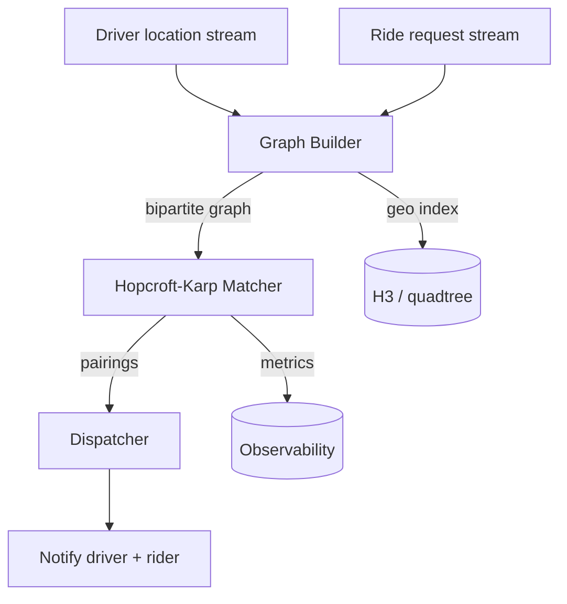
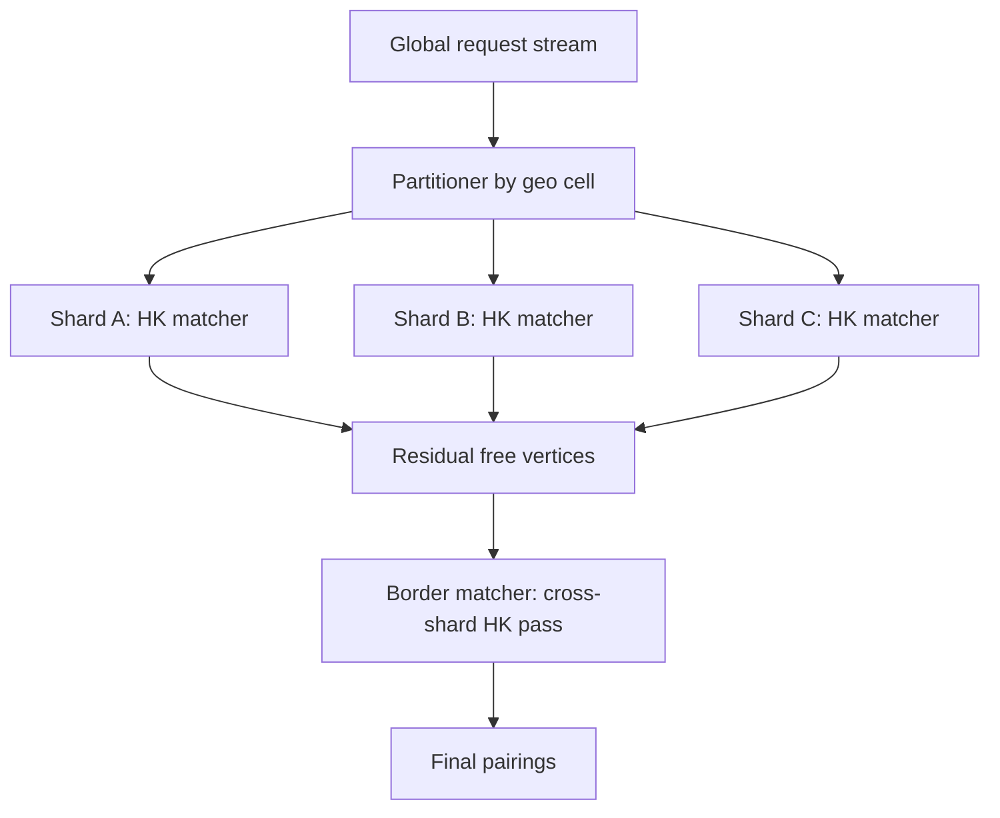
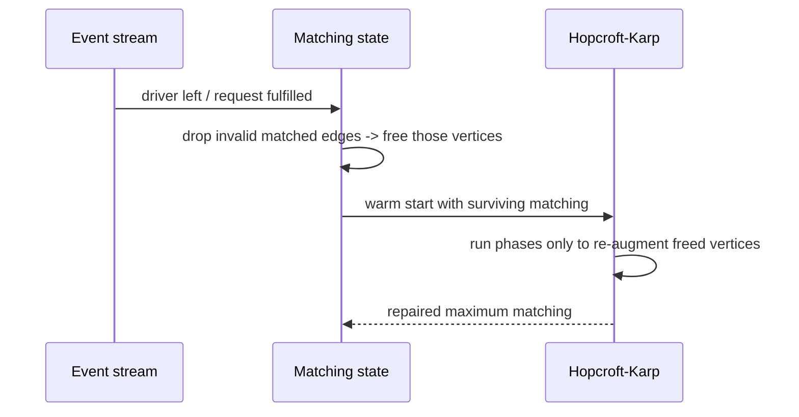
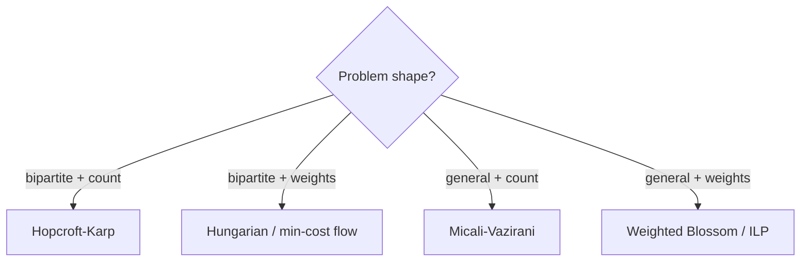
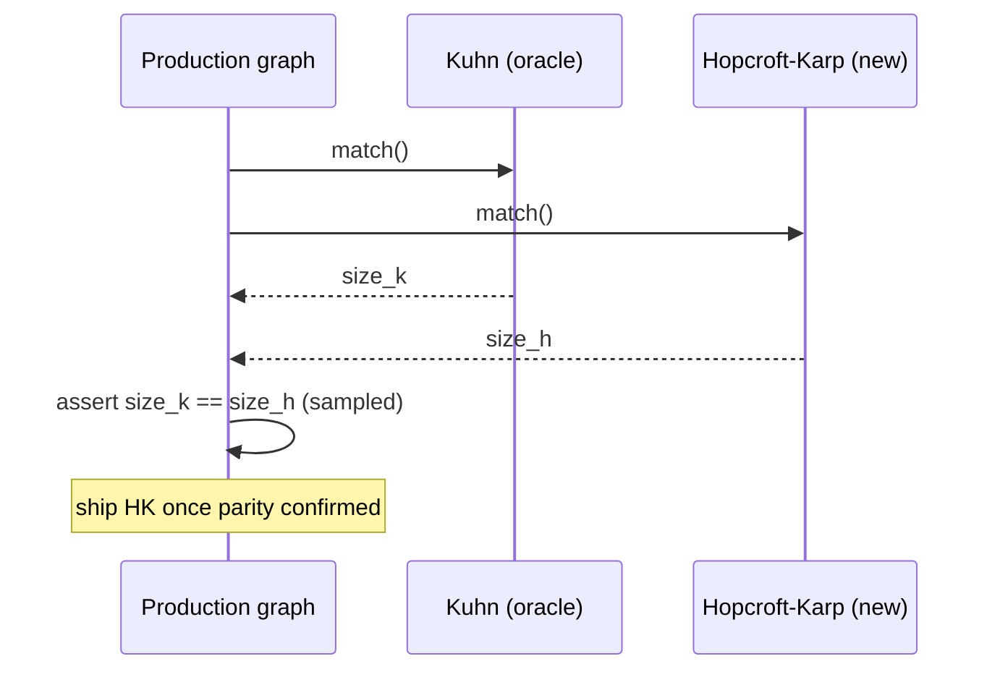

# Hopcroft-Karp Algorithm — Senior Level

> **One-line summary:** At scale, Hopcroft-Karp is the workhorse behind large bipartite-allocation systems — ride/driver dispatch, ad-slot fulfillment, GPU-to-job scheduling, organ exchange — where the engineering challenge is less the `O(E·√V)` core and more the surrounding system: incremental re-matching, sharding, time budgets, fairness, and graceful degradation.

---

## Table of Contents

1. [Introduction](#introduction)
2. [System Design with Hopcroft-Karp](#system-design)
3. [Distributed & Sharded Matching](#distributed-matching)
4. [Comparison with Alternatives](#comparison-with-alternatives)
5. [Architecture Patterns](#architecture-patterns)
6. [Code Examples](#code-examples)
7. [Observability](#observability)
8. [Failure Modes](#failure-modes)
9. [Summary](#summary)

---

## Introduction

> Focus: "How do I architect a real allocation system around maximum matching?"

A senior engineer rarely writes Hopcroft-Karp from a blank file at 2 a.m. Instead, the questions are systemic:

- The matching has to be recomputed **every few seconds** as supply and demand change — how do I keep it cheap?
- The graph is **too big for one machine** or must respect data-locality — how do I shard it without wrecking optimality?
- Each matching run has a **latency SLA** (e.g. dispatch within 500 ms) — what do I do when the algorithm can't finish in time?
- The product wants **fairness**, **stability**, or **weighted preferences** — where does pure cardinality matching stop being the right tool?

Hopcroft-Karp gives you a fast, provably-optimal *core*. Everything above is the system you wrap around it. This file is about that wrapping.

A recurring theme: **cardinality matching maximizes throughput (how many requests are served), not value (how good each pairing is).** Many production systems use Hopcroft-Karp as a fast feasibility/throughput layer and bolt weights on separately (via Hungarian, min-cost flow, or a re-ranking pass).

---

## System Design with Hopcroft-Karp

Consider a **ride-dispatch** system. Left = available drivers, right = open ride requests, an edge = "driver can reach request within `T` seconds." Maximizing matched edges maximizes rides served this dispatch tick.



Key design choices:

- **Edge construction dominates.** Building the bipartite graph (geo-proximity, eligibility, ETA filtering) is often more expensive than the matching itself. Use a spatial index (H3, S2, quadtree) to generate only nearby edges, keeping `E` small and the graph sparse.
- **Bounded degree.** Cap each driver to its `k` nearest requests (and vice versa). This bounds `E ≈ k·V`, making `O(E√V) = O(k·V^{1.5})` predictable.
- **Tick-based recomputation.** Run a fresh matching every dispatch tick (e.g. every 2–5 s) on the current snapshot rather than maintaining a perfect matching continuously.

---

## Distributed & Sharded Matching

When the graph exceeds one machine, you shard. The hard truth: **a globally optimal matching does not decompose cleanly across shards** — an augmenting path can cross shard boundaries. Practical strategies:

| Strategy | How it works | Optimality | Use case |
|----------|--------------|------------|----------|
| **Geographic sharding** | Partition by region/cell; match within each shard independently | Near-optimal if cross-region edges are rare | Ride dispatch, delivery |
| **Hierarchical (coarse → fine)** | Match within shards, then a second matching pass on the *residual* free vertices across boundaries | Better than flat sharding | Large geo systems |
| **Replicate-and-recompute** | One authoritative node holds the whole graph; replicas serve reads | Globally optimal | Graph fits in memory (most do) |
| **Time-sliced batching** | Accumulate requests into batches; match each batch globally on one node | Optimal per batch | Ad auctions, periodic allocation |



A crucial insight: most real allocation graphs are **near-block-diagonal** (drivers match riders nearby). Cross-shard augmenting paths are rare, so geographic sharding loses very little optimality while gaining near-linear horizontal scaling.

---

## Comparison with Alternatives

| Attribute | Hopcroft-Karp | Kuhn | Min-cost flow / Hungarian | Auction / heuristic |
|-----------|---------------|------|---------------------------|---------------------|
| Optimizes | Cardinality | Cardinality | Weighted (value/cost) | Approx. weighted |
| Time | `O(E√V)` | `O(V·E)` | `O(V³)` / poly | Fast, tunable |
| Recompute cost (full) | Low | Medium | High | Very low |
| Incremental update | Re-run cheaply | Re-run cheaply | Expensive | Natural |
| Fairness/stability | None built-in | None | Via weights | Via bidding |
| Production fit | Throughput layer | Small graphs | Value-critical allocation | Real-time, large scale |

**Choose Hopcroft-Karp when:** you need maximum *throughput* fast, the graph is large/dense, and weights are secondary or handled in a separate pass.

**Move to min-cost flow / Hungarian when:** the *quality* of each pairing (cost, ETA, revenue) matters more than raw count, and `V³` (or poly min-cost-flow) fits your latency budget.

**Move to auction/heuristic methods when:** the graph is enormous, latency is sub-100 ms, and a near-optimal answer is acceptable.

---

## Architecture Patterns

### Pattern 1: Incremental re-matching

Don't throw away the previous matching each tick. Seed Hopcroft-Karp with the **still-valid** edges of the prior matching, then run phases only to repair the delta (drivers/requests that arrived or left).



Because Hopcroft-Karp starts from any valid matching, warm-starting from the previous tick turns a full recompute into a small repair — often a single phase.

### Pattern 2: Time-budgeted matching

Under an SLA, cap the number of phases. After `k` phases you have a *near-maximum* matching (each phase strictly raises the shortest-path length, so early phases capture the bulk of easy matches). Ship the partial matching and log the gap.

### Pattern 3: Two-stage cardinality-then-weight

1. Run Hopcroft-Karp to find the **maximum number** of feasible pairings (feasibility/throughput).
2. Among matchings of that size, run a min-cost flow or local-swap pass to improve **total weight** (ETA, revenue) without dropping any pairings.

This decouples "serve as many as possible" from "serve them as well as possible."

---

## Code Examples

### Thread-safe matcher with warm-start (incremental)

#### Go

```go
package main

import "sync"

const INF = 1 << 30

// ConcurrentMatcher guards a Hopcroft-Karp matcher for tick-based recompute.
type ConcurrentMatcher struct {
	mu                 sync.Mutex
	nL, nR             int
	adj                [][]int
	pairU, pairV, dist []int
}

func NewConcurrentMatcher(nL, nR int) *ConcurrentMatcher {
	return &ConcurrentMatcher{nL: nL, nR: nR,
		adj:   make([][]int, nL+1),
		pairU: make([]int, nL+1),
		pairV: make([]int, nR+1),
		dist:  make([]int, nL+1)}
}

// FreeVertex drops a matched edge (e.g. driver went offline), freeing both ends.
func (m *ConcurrentMatcher) FreeLeft(u int) {
	m.mu.Lock()
	defer m.mu.Unlock()
	if v := m.pairU[u]; v != 0 {
		m.pairV[v] = 0
		m.pairU[u] = 0
	}
}

func (m *ConcurrentMatcher) bfs() bool {
	q := []int{}
	for u := 1; u <= m.nL; u++ {
		if m.pairU[u] == 0 {
			m.dist[u] = 0
			q = append(q, u)
		} else {
			m.dist[u] = INF
		}
	}
	m.dist[0] = INF
	for len(q) > 0 {
		u := q[0]
		q = q[1:]
		if m.dist[u] < m.dist[0] {
			for _, v := range m.adj[u] {
				if m.dist[m.pairV[v]] == INF {
					m.dist[m.pairV[v]] = m.dist[u] + 1
					q = append(q, m.pairV[v])
				}
			}
		}
	}
	return m.dist[0] != INF
}

func (m *ConcurrentMatcher) dfs(u int) bool {
	if u == 0 {
		return true
	}
	for _, v := range m.adj[u] {
		if m.dist[m.pairV[v]] == m.dist[u]+1 && m.dfs(m.pairV[v]) {
			m.pairV[v] = u
			m.pairU[u] = v
			return true
		}
	}
	m.dist[u] = INF
	return false
}

// Repair runs phases (optionally capped) starting from the current matching.
func (m *ConcurrentMatcher) Repair(maxPhases int) int {
	m.mu.Lock()
	defer m.mu.Unlock()
	added, phases := 0, 0
	for m.bfs() {
		if maxPhases > 0 && phases >= maxPhases {
			break // time-budget cap
		}
		for u := 1; u <= m.nL; u++ {
			if m.pairU[u] == 0 && m.dfs(u) {
				added++
			}
		}
		phases++
	}
	return added
}
```

#### Java

```java
import java.util.*;
import java.util.concurrent.locks.ReentrantLock;

public class ConcurrentMatcher {
    static final int INF = Integer.MAX_VALUE;
    private final ReentrantLock lock = new ReentrantLock();
    private final int nL, nR;
    private final List<List<Integer>> adj;
    private final int[] pairU, pairV, dist;

    public ConcurrentMatcher(int nL, int nR) {
        this.nL = nL; this.nR = nR;
        adj = new ArrayList<>();
        for (int i = 0; i <= nL; i++) adj.add(new ArrayList<>());
        pairU = new int[nL + 1];
        pairV = new int[nR + 1];
        dist = new int[nL + 1];
    }

    public void freeLeft(int u) {
        lock.lock();
        try {
            int v = pairU[u];
            if (v != 0) { pairV[v] = 0; pairU[u] = 0; }
        } finally { lock.unlock(); }
    }

    private boolean bfs() {
        Deque<Integer> q = new ArrayDeque<>();
        for (int u = 1; u <= nL; u++) {
            if (pairU[u] == 0) { dist[u] = 0; q.add(u); }
            else dist[u] = INF;
        }
        dist[0] = INF;
        while (!q.isEmpty()) {
            int u = q.poll();
            if (dist[u] < dist[0])
                for (int v : adj.get(u))
                    if (dist[pairV[v]] == INF) {
                        dist[pairV[v]] = dist[u] + 1;
                        q.add(pairV[v]);
                    }
        }
        return dist[0] != INF;
    }

    private boolean dfs(int u) {
        if (u == 0) return true;
        for (int v : adj.get(u))
            if (dist[pairV[v]] == dist[u] + 1 && dfs(pairV[v])) {
                pairV[v] = u; pairU[u] = v;
                return true;
            }
        dist[u] = INF;
        return false;
    }

    public int repair(int maxPhases) {
        lock.lock();
        try {
            int added = 0, phases = 0;
            while (bfs()) {
                if (maxPhases > 0 && phases >= maxPhases) break;
                for (int u = 1; u <= nL; u++)
                    if (pairU[u] == 0 && dfs(u)) added++;
                phases++;
            }
            return added;
        } finally { lock.unlock(); }
    }
}
```

#### Python

```python
import threading
from collections import deque

INF = float("inf")


class ConcurrentMatcher:
    def __init__(self, n_left, n_right):
        self._lock = threading.Lock()
        self.nL, self.nR = n_left, n_right
        self.adj = [[] for _ in range(n_left + 1)]
        self.pair_u = [0] * (n_left + 1)
        self.pair_v = [0] * (n_right + 1)
        self.dist = [0] * (n_left + 1)

    def free_left(self, u):
        with self._lock:
            v = self.pair_u[u]
            if v:
                self.pair_v[v] = 0
                self.pair_u[u] = 0

    def _bfs(self):
        q = deque()
        for u in range(1, self.nL + 1):
            if self.pair_u[u] == 0:
                self.dist[u] = 0
                q.append(u)
            else:
                self.dist[u] = INF
        self.dist[0] = INF
        while q:
            u = q.popleft()
            if self.dist[u] < self.dist[0]:
                for v in self.adj[u]:
                    if self.dist[self.pair_v[v]] == INF:
                        self.dist[self.pair_v[v]] = self.dist[u] + 1
                        q.append(self.pair_v[v])
        return self.dist[0] != INF

    def _dfs(self, u):
        if u == 0:
            return True
        for v in self.adj[u]:
            if self.dist[self.pair_v[v]] == self.dist[u] + 1 and self._dfs(self.pair_v[v]):
                self.pair_v[v] = u
                self.pair_u[u] = v
                return True
        self.dist[u] = INF
        return False

    def repair(self, max_phases=0):
        with self._lock:
            added = phases = 0
            while self._bfs():
                if max_phases and phases >= max_phases:
                    break
                for u in range(1, self.nL + 1):
                    if self.pair_u[u] == 0 and self._dfs(u):
                        added += 1
                phases += 1
            return added
```

---

## Real-World Case Studies

### Case 1 — GPU-to-job scheduler (ML training cluster)

Left = idle GPUs, right = queued training jobs, edge = "GPU has the memory/topology the job needs." Each scheduling tick maximizes jobs started. Engineering notes:

- **Eligibility is the edge filter.** A job needing 8×A100 with NVLink only connects to GPUs in the right topology. This keeps `E` far below `|L|·|R|`.
- **Bounded degree by binning.** Jobs are bucketed by resource class; a job only edges to GPUs in compatible buckets. `E ≈ (classes)·(avg GPUs per class)`.
- **Warm start across ticks.** Most assignments survive tick-to-tick; only completed jobs and freed GPUs need re-augmentation — typically one phase.
- **Weights handled separately.** "Prefer the GPU with best locality" is a *second* pass (min-cost flow) over the cardinality-optimal set, so we never start fewer jobs to chase locality.

### Case 2 — Ad-impression fulfillment

Left = impression opportunities in this batch, right = eligible ad campaigns (with remaining budget/targeting match). Maximize filled impressions.

- **Time-sliced batching.** Impressions accumulate for ~100 ms, then a single global Hopcroft-Karp run matches the batch optimally. Batching gives global optimality without distributed coordination.
- **Phase cap under SLA.** If a batch is huge, cap phases; early phases fill the easy impressions, the gap is logged and small.
- **Throughput vs. revenue.** Cardinality maximizes *fill rate*; a downstream weighted pass (or a pacing layer) optimizes revenue among the filled set.

### Case 3 — Kidney-exchange / organ matching (offline, value-critical)

Here cardinality is *not* enough — patient outcomes (weights) dominate, and the graph is general (cycles of donors). This is where Hopcroft-Karp is the **wrong** tool: you need weighted general-graph matching (Blossom + weights) or integer programming. The lesson: recognize when the problem leaves Hopcroft-Karp's domain (bipartite + cardinality) and escalate to the right algorithm.



---

## Capacity Planning

Before deploying a matching service, size it against the `O(E·√V)` cost.

| Input | Symbol | How to estimate |
|-------|--------|-----------------|
| Vertices | `V` | Peak concurrent supply + demand |
| Edges | `E` | `V × avg_degree` (bound the degree!) |
| Tick rate | `1/Δt` | Product latency requirement |
| Per-tick budget | `B` | `Δt` minus edge-build + I/O time |

Rule of thumb: with bounded degree `k`, one full matching costs roughly `c · k · V^{1.5}` for a small constant `c`. If that exceeds `B`, you have three levers, in order of preference:

1. **Warm start** — amortizes most ticks down to a single repair phase.
2. **Bound degree harder** — smaller `k` shrinks `E` linearly.
3. **Shard geographically** — splits `V` across machines; near-zero optimality loss on block-diagonal graphs.

Only if all three fail do you drop to a phase-capped near-maximum result. Always benchmark the *real* graph: synthetic random graphs need more phases than the near-block-diagonal graphs real allocation produces, so production phase counts are usually *better* than worst-case `√V`.

---

## Observability

| Metric | Why it matters | Alert threshold (example) |
|--------|----------------|---------------------------|
| `matching_size` | Throughput — how many requests served | Drop > 20% vs. rolling baseline |
| `phases_per_run` | Health of the `O(√V)` assumption | Sustained > `2√V` (graph pathology) |
| `match_latency_p99` | SLA compliance | > dispatch budget (e.g. 500 ms) |
| `unmatched_left_ratio` | Starved supply (idle drivers) | > 0.3 |
| `unmatched_right_ratio` | Unserved demand | > 0.1 |
| `edges_built` / `edge_build_latency` | Often the real bottleneck | Build > match time |
| `phase_cap_hits` | How often time-budget truncation kicks in | > 5% of runs |

Log per run: matching size, phase count, edge count, build vs. match time split. The **phase count** is the canary — if it climbs far above `√V`, your graph has degenerate structure (e.g. long alternating chains) and you should investigate edge construction.

---

## Consistency and Coordination

When the matcher is replicated or sharded, decide the consistency model explicitly:

| Model | Mechanism | Trade-off |
|-------|-----------|-----------|
| **Single-writer authoritative** | One node owns the graph + matching; replicas read | Globally optimal, simple; throughput bounded by one node |
| **Leader per shard** | Each shard has a leader running Hopcroft-Karp | Scales; cross-shard edges need a coordinator |
| **Batch-and-commit** | Accumulate a batch, match once, atomically commit assignments | Optimal per batch; adds batching latency |

A subtle correctness hazard: **double assignment** under concurrency. If two replicas both believe a right vertex is free and assign it, you violate the matching constraint. Guards:

- **Compare-and-swap on the assignment.** Commit `(u, v)` only if `pairV[v]` is still `0`; otherwise re-augment `u`.
- **Single authoritative commit path.** Run matching anywhere, but funnel the *commit* through one serialization point.
- **Idempotent dispatch.** Downstream consumers tolerate a pairing being re-emitted, so a retried tick can't double-act.

Because a tick's matching is computed on a *snapshot*, treat it as a *proposal*; the commit step reconciles it against the live state. This snapshot-propose-commit pattern keeps the fast algorithm decoupled from the slow consistency machinery.

---

## Failure Modes

- **Edge explosion.** Unbounded degree (everyone can match everyone) makes `E ≈ V²` and blows the latency budget. *Fix:* cap degree via top-`k` nearest, eligibility filters.
- **Thrashing under churn.** High arrival/departure rates trigger constant full recomputes. *Fix:* warm-start / incremental repair; debounce ticks.
- **SLA breach on huge graphs.** A single tick can't finish in time. *Fix:* phase cap (near-maximum partial), or shard geographically.
- **Cross-shard optimality loss.** Sharding drops augmenting paths that cross boundaries. *Fix:* residual border-matching pass; tune cell sizes so cross-edges are rare.
- **Starvation / fairness.** Cardinality matching may repeatedly skip the same hard-to-match vertex. *Fix:* add aging/priority as weights and switch to min-cost flow, or pre-pin starved vertices.
- **Non-bipartite contamination.** A bug introduces same-side edges; the algorithm silently returns garbage. *Fix:* validate bipartiteness on graph build; assert in tests.
- **Memory pressure.** Adjacency lists for a dense `V`-vertex graph are `O(V²)`. *Fix:* sparsify edges; stream the graph; bound degree.

---

## Migrating from Kuhn to Hopcroft-Karp

A common senior task: a service started on Kuhn (`O(V·E)`) and is now too slow. The migration is low-risk if you do it deliberately.

1. **Confirm it's the bottleneck.** Profile. If edge construction dominates, swapping the matcher won't help — fix degree bounds first.
2. **Keep Kuhn as an oracle.** Run both behind a flag on a sample of production graphs and assert equal matching *size*. The pairs may differ; the size must not.
3. **Watch the NIL indexing.** The most common migration bug is mixing 0-based real vertices with the NIL=0 convention. Number real vertices from 1.
4. **Add the phase-count metric immediately.** It is your proof that the `O(√V)` assumption holds in production.
5. **Roll out by shard.** Enable the new matcher region-by-region; compare throughput and latency before full cutover.



---

## Anti-Patterns

- **Recomputing from scratch every tick** when 95% of the matching is still valid — always warm-start.
- **Unbounded edge construction** — letting every supply connect to every demand turns `E` into `V²` and dwarfs the matching cost.
- **Chasing weights with cardinality** — repeatedly re-running Hopcroft-Karp hoping for "better" pairings; it optimizes count, full stop. Add a weighted pass instead.
- **Sharding without a residual pass** — geographic shards drop cross-boundary augmenting paths; a border-matching pass recovers them cheaply.
- **No phase-count alarm** — without it, a graph pathology (long alternating chains, accidental same-side edges) silently inflates latency.
- **Treating partial (phase-capped) results as exact** — log and expose the optimality gap so downstream consumers know.

---

## Summary

- At senior level, Hopcroft-Karp is a **fast throughput core** inside a larger allocation system; the engineering lives in **edge construction, incremental repair, sharding, time budgets, and fairness**.
- **Warm-start** from the previous tick's matching turns full recomputes into cheap repairs.
- **Geographic sharding** scales horizontally with near-zero optimality loss because real graphs are near-block-diagonal; a **residual border pass** recovers the rest.
- Under SLAs, **cap the phases** to ship a near-maximum matching, and monitor `phases_per_run` as the health canary for the `O(√V)` assumption.
- When *value* (not just count) matters, layer min-cost flow / Hungarian on top — Hopcroft-Karp alone optimizes cardinality, never weight.

---

**Next step:** Continue to [`professional.md`](./professional.md) for the formal proof that only `O(√V)` phases are needed (shortest augmenting-path length strictly increases), the full complexity analysis, and the max-flow duality.
