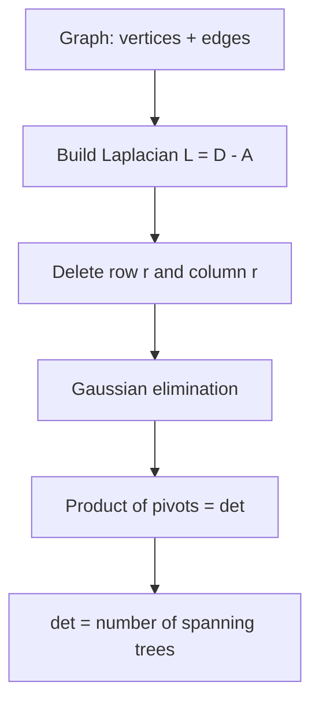

# Kirchhoff's Theorem — Junior Level

> **One-line summary:** Kirchhoff's Matrix-Tree Theorem says the number of spanning trees of a graph equals **any cofactor of its Laplacian matrix** `L = D − A` (degree matrix minus adjacency matrix). In practice: build `L`, delete one row and the matching column, take the determinant, and that single number is your spanning-tree count.

---

## Table of Contents

1. [Introduction](#introduction)
2. [Prerequisites](#prerequisites)
3. [Glossary](#glossary)
4. [Core Concepts](#core-concepts)
5. [Big-O Summary](#big-o-summary)
6. [Real-World Analogies](#real-world-analogies)
7. [Pros & Cons](#pros--cons)
8. [Step-by-Step Walkthrough](#step-by-step-walkthrough)
9. [Code Examples](#code-examples)
10. [Coding Patterns](#coding-patterns)
11. [Error Handling](#error-handling)
12. [Performance Tips](#performance-tips)
13. [Best Practices](#best-practices)
14. [Edge Cases & Pitfalls](#edge-cases--pitfalls)
15. [Common Mistakes](#common-mistakes)
16. [Cheat Sheet](#cheat-sheet)
17. [Visual Animation](#visual-animation)
18. [Summary](#summary)
19. [Further Reading](#further-reading)

---

## Introduction

Suppose you are handed a network — a set of cities connected by candidate roads, or servers connected by candidate links — and someone asks: **"How many different ways can I pick a minimal set of edges that keeps everything connected?"** Each such minimal connecting set is a *spanning tree*: it touches every vertex, uses exactly `n − 1` edges, and contains no cycle.

The obvious approach is to enumerate. Try every subset of `n − 1` edges, check whether it forms a tree, and count the successes. That works for a 5-vertex graph. It explodes immediately afterward: a complete graph on just 15 vertices has `15^13 ≈ 1.9 × 10^15` spanning trees. You cannot list them.

**Kirchhoff's Theorem** — also called the **Matrix-Tree Theorem** — gives you the *exact count* without ever enumerating a single tree. It was proved by **Gustav Kirchhoff in 1847** while he was studying electrical circuits (the same Kirchhoff of the current and voltage laws). The recipe is astonishingly short:

1. Build the **Laplacian matrix** `L = D − A`, where `D` is the diagonal matrix of vertex degrees and `A` is the adjacency matrix.
2. **Delete any one row and the column with the same index** (a "cofactor").
3. Take the **determinant** of what remains.

That determinant *is* the number of spanning trees. One determinant — computable in `O(V³)` time — replaces an astronomically large enumeration. The magic is that the answer does not depend on *which* row and column you delete: every cofactor of the Laplacian gives the same number.

A beautiful corollary falls out for free: the complete graph `K_n` has exactly `n^(n−2)` spanning trees. This is **Cayley's formula**, and the sibling topic `25-prufer-code` proves it a completely different way using a clever bijection.

---

## Prerequisites

Before reading this file you should be comfortable with:

- **Matrices** — what an `n × n` matrix is, how to index `M[i][j]` (row `i`, column `j`).
- **Matrix determinant** — at least the `2 × 2` rule `ad − bc` and the idea that a determinant is a single number summarizing a square matrix.
- **Gaussian elimination** — turning a matrix into upper-triangular form by row operations; the determinant is then the product of the diagonal.
- **Graphs** — vertices, edges, what "connected" means, what a cycle is.
- **Spanning trees** — a subgraph that is a tree and touches all `n` vertices (`n − 1` edges, connected, acyclic). The sibling `10-mst-kruskal-prim` builds the *minimum-weight* one; here we *count* all of them.
- **Big-O notation** — `O(V³)` for the determinant.

Optional but helpful:

- **Adjacency matrix** representation of a graph (`02-bfs` / `01-representation` siblings touch this).
- A little linear algebra intuition (eigenvalues) — useful for `middle.md`, not required here.

---

## Glossary

| Term | Meaning |
|------|---------|
| **Spanning tree** | A subgraph that connects all `n` vertices using exactly `n − 1` edges with no cycle. |
| **Adjacency matrix `A`** | `A[i][j]` = number of edges between vertex `i` and vertex `j` (0/1 for simple graphs). |
| **Degree matrix `D`** | Diagonal matrix; `D[i][i]` = degree of vertex `i` (number of incident edges). Off-diagonals are 0. |
| **Laplacian matrix `L`** | `L = D − A`. Diagonal holds degrees; `L[i][j] = −(#edges between i and j)` off-diagonal. |
| **Cofactor** | The determinant of the matrix you get by deleting one row and one column. Here we delete a *matching* pair (row `i`, column `i`). |
| **Reduced Laplacian** | The `(n−1) × (n−1)` matrix left after deleting row `r` and column `r` from `L`. |
| **Determinant** | A single scalar computed from a square matrix; here it equals the spanning-tree count. |
| **Matrix-Tree Theorem** | Kirchhoff's result: spanning-tree count = any cofactor of `L`. |
| **Cayley's formula** | `K_n` has `n^(n−2)` spanning trees (a corollary). |
| **Self-loop** | An edge from a vertex to itself. **Ignored** by the theorem. |
| **Multi-edge** | Two or more parallel edges between the same pair. **Counted** (they add to degree and adjacency). |
| **Arborescence** | A directed spanning tree rooted at one vertex; the directed version of the theorem (Tutte) counts these. |

---

## Core Concepts

### 1. The Laplacian Matrix `L = D − A`

The whole theorem hinges on one matrix. Given an undirected graph on vertices `0, 1, …, n−1`:

- `D[i][i]` = **degree** of vertex `i` (how many edges touch it).
- `A[i][j]` = **number of edges** between `i` and `j` (0 or 1 for a simple graph).
- `L = D − A`, so:
  - `L[i][i] = deg(i)` (degree on the diagonal),
  - `L[i][j] = −(number of edges between i and j)` for `i ≠ j`.

Equivalently, you can build `L` directly by walking the edges: for each edge `(u, v)` with `u ≠ v`, do `L[u][u]++`, `L[v][v]++`, `L[u][v]--`, `L[v][u]--`. Self-loops (`u == v`) are skipped because they contribute nothing to spanning trees.

A defining property: **every row and every column of `L` sums to zero.** That is why `det(L) = 0` always — the rows are linearly dependent. We must delete a row and column before the determinant becomes meaningful.

### 2. The Theorem Statement

> **Matrix-Tree Theorem.** Let `L` be the Laplacian of a connected (multi-)graph `G` on `n` vertices. Delete any row `r` and column `r` to get the reduced Laplacian `L̂`. Then
>
> ```
> number of spanning trees of G = det(L̂).
> ```
>
> The value is independent of the choice of `r`.

Two consequences you should internalize immediately:

- If the graph is **disconnected**, the count is `0` — there is no spanning tree at all, and the determinant comes out to `0`.
- You always delete a **matching** row and column (same index). Deleting row 2 and column 2 is a cofactor; deleting row 2 and column 5 is *not* what the theorem uses.

### 3. Why a Determinant?

A determinant counts signed volumes, but here it counts combinatorial objects because of a deep identity (the Cauchy–Binet formula applied to the incidence matrix — proven in `professional.md`). For the junior level, treat it as a black box with a guarantee: this particular determinant equals this particular count. We verify it by brute force on small graphs to build trust.

### 4. The Eigenvalue Form (a Glimpse)

There is a second formula. If the non-zero eigenvalues of `L` are `λ₁, λ₂, …, λ_{n−1}` (the smallest eigenvalue is always 0), then

```
number of spanning trees = (1/n) · λ₁ · λ₂ · … · λ_{n−1}.
```

You will use this in `middle.md`. The cofactor/determinant form is what you actually code.

### 5. Cayley's Formula as a Corollary

For the complete graph `K_n`, the Laplacian is `n·I − J` (where `J` is all-ones). Its reduced determinant works out to `n^(n−2)`. So:

```
K_3 → 3^1 = 3
K_4 → 4^2 = 16
K_5 → 5^3 = 125
K_6 → 6^4 = 1296
```

We confirm all of these with code below.

---

## Big-O Summary

| Step | Time | Space | Notes |
|------|------|-------|-------|
| Build Laplacian from `m` edges | `O(m + n²)` | `O(n²)` | `O(n²)` to allocate the matrix, `O(m)` to fill it. |
| Delete row & column | `O(n²)` | `O(n²)` | Copy into an `(n−1)×(n−1)` matrix. |
| Determinant via Gaussian elimination | `O(n³)` | `O(n²)` | Dominant cost. `n = V`. |
| **Total** | **`O(V³)`** | **`O(V²)`** | One matrix, one elimination pass. |
| Brute-force enumeration (for comparison) | `O(C(m, n−1) · m·α)` | `O(n)` | Exponential — only for tiny graphs / testing. |

The point of the theorem: replace an exponential enumeration with a single cubic-time linear-algebra computation.

---

## Real-World Analogies

| Concept | Analogy |
|---------|---------|
| Counting spanning trees | A telecom planner asks "how many distinct minimal backbones can I build over these candidate fiber links?" Each backbone is a spanning tree. |
| The Laplacian | A ledger where each city records how many roads it owns (the diagonal) and subtracts a tally for every neighbor it shares a road with (the off-diagonals). The books always balance to zero per row. |
| Deleting a row/column | Anchoring the network at one "reference" city — like grounding one node in an electrical circuit so the remaining equations have a unique solution. |
| The determinant | A single odometer reading that, by Kirchhoff's miracle, equals the exact number of backbones — no matter which city you grounded. |
| Cayley's formula | "If every pair of `n` cities can be linked, there are exactly `n^(n−2)` distinct backbones." |
| Self-loops ignored | A road from a city back to itself is useless for connecting cities, so the ledger ignores it. |
| Multi-edges counted | Two parallel fibers between the same pair are two real, distinct choices — both count. |

Where the analogy breaks: a determinant is an algebraic quantity with no physical "size" here; the fact that it lands exactly on a combinatorial count is the surprising, non-obvious heart of the theorem.

---

## Pros & Cons

| Pros | Cons |
|------|------|
| Exact count in `O(V³)` — no enumeration, no approximation. | Counts spanning trees only; it does not *list* them. |
| Independent of which row/column you delete — robust. | Plain floating-point determinant loses precision for large counts; needs exact integer or modular arithmetic. |
| Handles multi-edges naturally (they add to degree/adjacency). | The count can be astronomically large (e.g. `K_50`), so you often need big integers or "answer mod p". |
| Self-loops are harmlessly ignored. | Requires linear-algebra machinery (determinant), unlike DFS-based graph algorithms. |
| Generalizes to weighted graphs (sum of tree weights) and directed graphs (arborescences, via Tutte). | Numerically unstable if you naïvely use `float64` Gaussian elimination on big graphs. |
| Connects graph theory to electrical networks and physics. | Not a "from scratch" technique — you must trust/verify the determinant routine. |

**When to use:** counting all spanning trees, network-reliability calculations, weighted spanning-tree sums, counting rooted arborescences, verifying combinatorial identities like Cayley's formula.

**When NOT to use:** when you need to *find* one specific (e.g. minimum) spanning tree — use `10-mst-kruskal-prim`; or when the graph is so huge that even `O(V³)` is too slow (then you sample or approximate).

---

## Step-by-Step Walkthrough

Let us count the spanning trees of a **triangle**: vertices `{0, 1, 2}` with edges `0–1`, `1–2`, `0–2`. By inspection there are 3 spanning trees (drop any one of the three edges and the other two still connect all vertices).

**Step 1 — Degrees.** Every vertex touches 2 edges, so `deg(0) = deg(1) = deg(2) = 2`.

**Step 2 — Build the Laplacian `L = D − A`.**

```
       0    1    2
   0 [  2   -1   -1 ]
   1 [ -1    2   -1 ]
   2 [ -1   -1    2 ]
```

Check: every row sums to `0`. Good — that confirms we built it correctly.

**Step 3 — Delete a row and the matching column.** Delete row 2 and column 2 (the last one). The reduced Laplacian is:

```
       0    1
   0 [  2   -1 ]
   1 [ -1    2 ]
```

**Step 4 — Take the determinant.**

```
det = (2)(2) − (−1)(−1) = 4 − 1 = 3.
```

**Result: 3 spanning trees.** Exactly what we counted by hand.

**Sanity check — delete a different row/column.** Delete row 0 and column 0 instead:

```
       1    2
   1 [  2   -1 ]
   2 [ -1    2 ]
```

`det = 4 − 1 = 3`. Same answer — confirming the "any cofactor" claim.

Now repeat the recipe on `K_4` (complete graph, 4 vertices, all 6 edges). Each vertex has degree 3:

```
L = [  3 -1 -1 -1 ]
    [ -1  3 -1 -1 ]
    [ -1 -1  3 -1 ]
    [ -1 -1 -1  3 ]
```

Delete row/column 3, then take the `3×3` determinant:

```
| 3 -1 -1 |
|-1  3 -1 |  = 16.
|-1 -1  3 |
```

`K_4` has `4^(4−2) = 4² = 16` spanning trees — Cayley's formula confirmed.

---

## Code Examples

### Example: Count Spanning Trees via the Laplacian Determinant

We build the Laplacian, delete the last row/column, and run Gaussian elimination tracking the product of pivots. For junior-level clarity we use floating point and round at the end (fine for small graphs; `middle.md`/`professional.md` switch to exact integer or modular arithmetic). All three programs print `K5 = 125` and `triangle = 3`.

#### Go

```go
package main

import "fmt"

// countSpanningTrees returns the number of spanning trees of an undirected
// graph with n vertices (0..n-1) and the given edges. Self-loops are ignored;
// parallel edges are counted.
func countSpanningTrees(n int, edges [][2]int) int64 {
	L := make([][]int64, n)
	for i := range L {
		L[i] = make([]int64, n)
	}
	for _, e := range edges {
		u, v := e[0], e[1]
		if u == v { // ignore self-loops
			continue
		}
		L[u][u]++
		L[v][v]++
		L[u][v]--
		L[v][u]--
	}
	// Delete the last row and column -> (n-1)x(n-1) reduced Laplacian.
	m := n - 1
	A := make([][]float64, m)
	for i := 0; i < m; i++ {
		A[i] = make([]float64, m)
		for j := 0; j < m; j++ {
			A[i][j] = float64(L[i][j])
		}
	}
	// Determinant by Gaussian elimination = product of pivots.
	det := 1.0
	for i := 0; i < m; i++ {
		p := i
		for p < m && A[p][i] == 0 {
			p++
		}
		if p == m {
			return 0 // singular -> disconnected graph
		}
		if p != i {
			A[i], A[p] = A[p], A[i]
			det = -det
		}
		det *= A[i][i]
		inv := A[i][i]
		for r := i + 1; r < m; r++ {
			f := A[r][i] / inv
			for c := i; c < m; c++ {
				A[r][c] -= f * A[i][c]
			}
		}
	}
	if det < 0 {
		det = -det
	}
	return int64(det + 0.5) // round
}

func main() {
	var k5 [][2]int
	for i := 0; i < 5; i++ {
		for j := i + 1; j < 5; j++ {
			k5 = append(k5, [2]int{i, j})
		}
	}
	fmt.Println("K5 =", countSpanningTrees(5, k5))                       // 125
	fmt.Println("triangle =", countSpanningTrees(3, [][2]int{{0, 1}, {1, 2}, {0, 2}})) // 3
}
```

#### Java

```java
import java.util.*;

public class Kirchhoff {
    // Count spanning trees of an undirected graph via the Laplacian determinant.
    static long countSpanningTrees(int n, int[][] edges) {
        long[][] L = new long[n][n];
        for (int[] e : edges) {
            int u = e[0], v = e[1];
            if (u == v) continue;          // ignore self-loops
            L[u][u]++; L[v][v]++;
            L[u][v]--; L[v][u]--;
        }
        int m = n - 1;                     // delete last row/column
        double[][] A = new double[m][m];
        for (int i = 0; i < m; i++)
            for (int j = 0; j < m; j++)
                A[i][j] = L[i][j];

        double det = 1.0;
        for (int i = 0; i < m; i++) {
            int p = i;
            while (p < m && A[p][i] == 0) p++;
            if (p == m) return 0;          // singular -> disconnected
            if (p != i) { double[] t = A[i]; A[i] = A[p]; A[p] = t; det = -det; }
            det *= A[i][i];
            double inv = A[i][i];
            for (int r = i + 1; r < m; r++) {
                double f = A[r][i] / inv;
                for (int c = i; c < m; c++) A[r][c] -= f * A[i][c];
            }
        }
        return Math.round(Math.abs(det));
    }

    public static void main(String[] args) {
        List<int[]> k5 = new ArrayList<>();
        for (int i = 0; i < 5; i++)
            for (int j = i + 1; j < 5; j++)
                k5.add(new int[]{i, j});
        System.out.println("K5 = " + countSpanningTrees(5, k5.toArray(new int[0][]))); // 125
        System.out.println("triangle = " +
            countSpanningTrees(3, new int[][]{{0, 1}, {1, 2}, {0, 2}}));               // 3
    }
}
```

#### Python

```python
def count_spanning_trees(n, edges):
    """Number of spanning trees of an undirected graph via the Laplacian
    determinant. Self-loops ignored; parallel edges counted."""
    L = [[0.0] * n for _ in range(n)]
    for u, v in edges:
        if u == v:                 # ignore self-loops
            continue
        L[u][u] += 1; L[v][v] += 1
        L[u][v] -= 1; L[v][u] -= 1

    m = n - 1                      # delete last row/column
    A = [[L[i][j] for j in range(m)] for i in range(m)]

    det = 1.0
    for i in range(m):
        p = i
        while p < m and A[p][i] == 0:
            p += 1
        if p == m:                 # singular -> disconnected
            return 0
        if p != i:
            A[i], A[p] = A[p], A[i]
            det = -det
        det *= A[i][i]
        inv = A[i][i]
        for r in range(i + 1, m):
            f = A[r][i] / inv
            for c in range(i, m):
                A[r][c] -= f * A[i][c]
    return round(abs(det))


if __name__ == "__main__":
    k5 = [(i, j) for i in range(5) for j in range(i + 1, 5)]
    print("K5 =", count_spanning_trees(5, k5))                       # 125
    print("triangle =", count_spanning_trees(3, [(0, 1), (1, 2), (0, 2)]))  # 3
```

**What it does:** builds the Laplacian, deletes the last row/column, and computes the determinant by Gaussian elimination.
**Run:** `go run main.go` | `javac Kirchhoff.java && java Kirchhoff` | `python kirchhoff.py`

---

## Coding Patterns

### Pattern 1: Build the Laplacian by Walking Edges

**Intent:** Avoid building `D` and `A` separately. Iterate edges once and update four entries.

```python
def laplacian(n, edges):
    L = [[0] * n for _ in range(n)]
    for u, v in edges:
        if u == v:
            continue            # self-loop contributes nothing
        L[u][u] += 1
        L[v][v] += 1
        L[u][v] -= 1
        L[v][u] -= 1
    return L
```

This is the same `O(m + n²)` step used in Go and Java above. Parallel edges naturally accumulate.

### Pattern 2: Always Delete the *Last* Row/Column

**Intent:** Since the answer is independent of which index you delete, fixing it to the last one keeps the code simple — you just iterate `0 .. n−2`.

```python
reduced = [row[:-1] for row in L[:-1]]   # drop last row and last column
```

### Pattern 3: Verify Against Brute Force on Small Graphs

**Intent:** Trust but verify. Enumerate `(n−1)`-edge subsets, check tree-ness with union-find, and compare to the determinant. Use this in tests only.

```python
from itertools import combinations

def brute(n, edges):
    cnt = 0
    for comb in combinations(range(len(edges)), n - 1):
        par = list(range(n))
        def find(x):
            while par[x] != x:
                par[x] = par[par[x]]; x = par[x]
            return x
        ok = True
        for idx in comb:
            u, v = edges[idx]
            ru, rv = find(u), find(v)
            if ru == rv:        # cycle -> not a tree
                ok = False; break
            par[ru] = rv
        if ok:
            cnt += 1
    return cnt
```



---

## Error Handling

| Error | Cause | Fix |
|-------|-------|-----|
| Determinant comes out `0` for a graph you think is connected | The graph is actually disconnected, or an edge index is out of range. | A `0` count *means* disconnected. Run a BFS/DFS to confirm connectivity before blaming the code. |
| Result is off by a tiny amount (e.g. `124.9999998`) | Floating-point rounding in Gaussian elimination. | Round at the end; for large graphs switch to exact integer (Bareiss) or modular arithmetic — see `middle.md`. |
| Wrong (huge) count | Self-loops were not skipped, or vertices are 1-indexed but you allocated `n` not `n+1`. | Skip `u == v`; be consistent about 0- vs 1-indexing and matrix size. |
| Index-out-of-bounds on the reduced matrix | Deleted only the row but not the column (or vice versa). | Delete the *matching* row and column together. |
| Negative determinant | Odd number of row swaps during pivoting. | Take the absolute value — the count is always non-negative. |
| `IndexError` for `n = 1` | A single vertex has a `0×0` reduced matrix. | Special-case: a graph with one vertex has exactly 1 spanning tree (the empty tree). |

---

## Performance Tips

- **One pass to build `L`.** Do not construct `D` and `A` separately and subtract; update `L` directly while iterating edges.
- **Pick partial pivoting** (swap in the largest-magnitude pivot) when using floats to reduce numerical error.
- **Use exact arithmetic for large counts.** `float64` has only ~15–16 significant digits; the count for `K_20` already exceeds that. Use `int64`/`BigInteger` with the fraction-free Bareiss algorithm, or compute the answer modulo a prime.
- **Reuse the matrix buffer** if you count trees for many graphs of the same size — avoid re-allocating the `O(n²)` matrix each call.
- **Symmetry shortcut for `K_n`:** if you just want the count for a complete graph, return `n^(n−2)` directly via fast exponentiation instead of building a matrix.

---

## Best Practices

- Write the brute-force enumerator first and test the determinant version against it on every graph with `n ≤ 7`. This catches sign, indexing, and self-loop bugs instantly.
- Document clearly whether vertices are 0-indexed or 1-indexed at the top of the function.
- Assert that every row of the freshly built Laplacian sums to zero — a cheap, powerful invariant check.
- Decide the arithmetic up front: floats for tiny demos, exact integers for real counts, modular for huge counts. Do not mix.
- Treat a `0` determinant as "disconnected," and make that an explicit, documented return value rather than a silent surprise.
- Keep the row/column you delete fixed (the last one) so the code is uniform and easy to review.

---

## Edge Cases & Pitfalls

- **Disconnected graph** — count is `0`; the reduced Laplacian is singular (a zero pivot appears).
- **Single vertex (`n = 1`)** — exactly 1 spanning tree (the trivial empty tree). The reduced matrix is `0×0` whose determinant is `1` by convention; special-case it.
- **Self-loops** — must be ignored. A loop adds 2 to a vertex's degree but contributes nothing to any spanning tree, so skipping it (`u == v → continue`) is correct.
- **Multi-edges (parallel edges)** — *are counted.* Two parallel edges between `u` and `v` make `L[u][v] = −2`, and the count rises accordingly. This is intended behavior.
- **Large counts overflow** — `K_30` has `30^28` spanning trees, far beyond `int64`. Use big integers or modular arithmetic.
- **Floating-point on big matrices** — accumulated rounding can flip the last digit. Round only for tiny graphs; otherwise go exact.
- **Wrong cofactor** — deleting non-matching row/column (row 1, column 3) gives a signed minor, not the spanning-tree count. Always delete a matching pair.

---

## Common Mistakes

1. **Forgetting to delete a row AND column** — taking `det(L)` directly gives `0` every time, because the full Laplacian is always singular.
2. **Deleting mismatched indices** — the cofactor must use the same index for the deleted row and column.
3. **Not skipping self-loops** — inflates degrees and produces a wrong count.
4. **Treating parallel edges as a single edge** — the theorem counts them; deduplicating silently changes the answer.
5. **Using floats for large graphs** — the answer is correct in theory but the printed value is off by rounding. Switch to exact/modular arithmetic.
6. **Assuming the count depends on which row you delete** — it does not; if your two cofactors disagree, you have a bug.
7. **Returning a negative number** — forgetting the absolute value after an odd number of pivot swaps.

---

## Cheat Sheet

| Step | Operation |
|------|-----------|
| 1. Build | `L = D − A`. Per edge `(u,v)`, `u≠v`: `L[u][u]++, L[v][v]++, L[u][v]--, L[v][u]--`. |
| 2. Reduce | Delete any row `r` and column `r` → `(n−1)×(n−1)` matrix `L̂`. |
| 3. Compute | `count = det(L̂)` via Gaussian elimination (product of pivots). |
| 4. Interpret | `count = 0` ⇒ disconnected; otherwise exact number of spanning trees. |

Key facts:

```
L = D − A                      (degree matrix minus adjacency)
every row/column of L sums to 0  ⇒  det(L) = 0  (must delete one row+col)
count = det(any cofactor of L)
count = (1/n) · product of non-zero eigenvalues of L
K_n  → n^(n−2)  spanning trees   (Cayley's formula)
complexity: O(V³) for the determinant
self-loops: ignored;  multi-edges: counted
```

Tiny verified examples:

```
triangle (3 edges)  → 3
path of 4 vertices  → 1
K_4                 → 16
K_5                 → 125
```

---

## Visual Animation

> See [`animation.html`](./animation.html) for an interactive visualization of Kirchhoff's Theorem.
>
> The animation demonstrates:
> - A small editable graph and its live-built Laplacian matrix
> - Deleting a chosen row and column to form the reduced Laplacian
> - Step-by-step Gaussian elimination with pivots highlighted
> - The running product of pivots converging to the spanning-tree count
> - For tiny graphs, an enumeration of the actual spanning trees to confirm the count

---

## Summary

Kirchhoff's Matrix-Tree Theorem turns a hopeless enumeration problem into a single determinant. Build the Laplacian `L = D − A`, delete any one row and the matching column, and compute the determinant of what remains — that number is exactly how many spanning trees the graph has. The recipe runs in `O(V³)`, works for any (multi-)graph, ignores self-loops, counts parallel edges, and hands you Cayley's formula `n^(n−2)` for free on the complete graph. The only real care needed is arithmetic: floats for tiny demos, exact integers or modular arithmetic for the large counts that show up almost immediately. Master the four-step recipe — build, delete, eliminate, read the product — and you have mastered the junior-level core.

---

## Further Reading

- Gustav Kirchhoff (1847), *Über die Auflösung der Gleichungen…* — the original electrical-network paper.
- *Introduction to Graph Theory* (West), §2.2 — the Matrix-Tree Theorem with a clean proof.
- *Algebraic Graph Theory* (Biggs) — the Laplacian and its spectrum.
- CP-Algorithms — "Kirchhoff theorem. Counting spanning trees."
- Sibling topic `10-mst-kruskal-prim` — finding the *minimum* spanning tree (vs counting all of them here).
- Sibling topic `25-prufer-code` — a bijective proof of Cayley's formula `n^(n−2)`.
