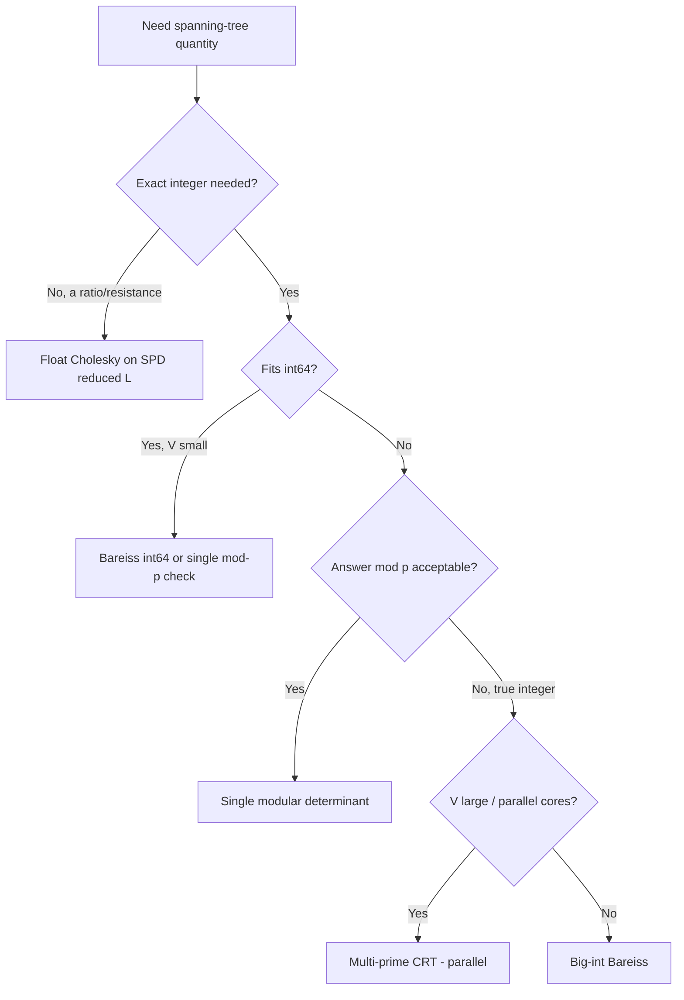

# Kirchhoff's Theorem — Senior Level

> At the senior level Kirchhoff's Theorem stops being "a determinant trick" and becomes a building block in reliability services, electrical-network analytics, and combinatorial-counting pipelines — where the real engineering is in *arithmetic choice* (float vs exact vs modular vs CRT), *numerical stability*, and making an `O(V³)` kernel survive at scale.

## Table of Contents
1. [Introduction](#1-introduction)
2. [System Design with the Matrix-Tree Theorem](#2-system-design-with-the-matrix-tree-theorem)
3. [Large-Scale Computation: Big Determinants, mod-p, CRT](#3-large-scale-computation-big-determinants-mod-p-crt)
4. [Concurrency and Parallelism](#4-concurrency-and-parallelism)
5. [Comparison with Alternatives at Scale](#5-comparison-with-alternatives-at-scale)
6. [Architecture Patterns](#6-architecture-patterns)
7. [Code: Production-Grade Counting Service Kernel](#7-code-production-grade-counting-service-kernel)
8. [Observability](#8-observability)
9. [Failure Modes](#9-failure-modes)
10. [Capacity Planning](#10-capacity-planning)
11. [Summary](#11-summary)

---

## 1. Introduction

A senior engineer rarely "counts spanning trees" as a toy. The theorem shows up embedded in real systems:

- **Network reliability** — counting spanning trees (and spanning forests) is the combinatorial core of all-terminal reliability: the probability a network stays connected under random edge failures. Effective resistance, derived from the same Laplacian, ranks the most critical links.
- **Electrical-network analytics** — power-grid and on-chip interconnect tools compute effective resistance and current distributions from the Laplacian; tree counts appear in sensitivity analysis.
- **Combinatorial counting pipelines** — counting structures (perfect matchings of planar graphs via related determinant methods, spanning configurations, statistical-physics partition functions) reuses the same `det(reduced Laplacian)` kernel.
- **Graph machine learning / sparsification** — leverage scores for spectral sparsification are effective resistances; the Laplacian determinant normalizes spanning-tree distributions used to *sample* random spanning trees.

The senior decisions are therefore not "how does the theorem work" but:

1. Which **arithmetic** does this workload need — float (fast, approximate), exact big-int (slow, true), modular (fast, exact-mod-p), or multi-prime CRT (true huge integer, parallelizable)?
2. How do I keep an `O(V³)` kernel **numerically stable** and **memory-bounded**?
3. How do I **scale** it — across primes, across requests, across cores?
4. How do I **observe** it so a wrong answer (silent precision loss) does not ship?

---

## 2. System Design with the Matrix-Tree Theorem

### 2.1 Where the kernel sits

```mermaid
flowchart LR
    A[Graph ingest<br/>edges, weights] --> B[Laplacian builder<br/>O(m + V^2)]
    B --> C[Reduce: delete row/col r]
    C --> D{Arithmetic mode}
    D -->|float| E[LU / Gauss<br/>fast, approx]
    D -->|mod p| F[Modular Gauss<br/>exact mod p]
    D -->|big-int| G[Bareiss<br/>exact true count]
    D -->|huge true| H[Multi-prime + CRT<br/>parallel]
    E --> I[Result + confidence]
    F --> I
    G --> I
    H --> I
```

The builder and reduction are cheap and uniform; the *arithmetic mode* is the design knob. A reliability service that only needs a ratio (effective resistance) can tolerate float; a combinatorics service that must report the exact `K_60` count cannot.

### 2.2 Three service tiers

| Tier | Graph size | Mode | Latency | When right |
|------|-----------|------|---------|-----------|
| Inline library | `V ≤ ~500` | float or single mod-p | sub-ms to ms | Embedded in a request handler; count or reliability ratio. |
| Counting microservice | `V ≤ ~5,000` | mod-p, optional CRT | ms to seconds | Batch combinatorics, reliability reports; answer is "mod p" or fits a few primes. |
| Offline analytics job | `V ≤ ~50,000` (sparse handled spectrally) | CRT big-int or iterative spectral | minutes to hours | Research/analytics; needs the true astronomically-large integer or full spectrum. |

The most common senior mistake is shipping the float kernel into a service that promises *exact* counts — it returns a number that *looks* right for `K_10` and is silently wrong for `K_25`.

---

## 3. Large-Scale Computation: Big Determinants, mod-p, CRT

### 3.1 The arithmetic ladder

The count can have hundreds of digits, so arithmetic choice dominates.

1. **Float `O(V³)`** — fastest, but only ~15–16 significant digits. Good for *ratios* (effective resistance), useless for *exact large counts*.
2. **Single modular prime** — exact mod `p`, all numbers bounded by `p`, memory `O(V²)` words. The default for "answer mod 1e9+7" problems.
3. **Bareiss fraction-free big-int** — exact true integer, but intermediate values grow to `O(V log V)` bits; cost `O(V³·M(b))`.
4. **Multi-prime + CRT** — compute `det mod p_k` for enough primes that `∏p_k > answer`, then reconstruct the true integer via the Chinese Remainder Theorem. **Embarrassingly parallel** across primes and far faster than big-int Bareiss for very large `V`.

### 3.2 How many primes for CRT?

You need `∏ p_k > 2·|answer|`. The answer for a graph on `V` vertices with max degree `Δ` is bounded by Hadamard's inequality: `det ≤ ∏ ‖row_i‖ ≤ (some poly)·(2Δ)^{V}`. Take `log₂` to get the required bit-length `B`, then use `⌈B / 30⌉` primes near `2³⁰` (so each fits a 32-bit lane and products fit 64-bit). For `K_60`: the count `60^58` has ≈ 343 bits, so ~12 primes of 30 bits suffice — twelve independent `O(V³)` solves, trivially parallelized.

### 3.3 Numerical stability for the float path

When float is acceptable (reliability ratios, spectral quantities):

- Use **partial pivoting** (largest-magnitude pivot) — non-negotiable for the Laplacian, which has zero row sums and can produce tiny pivots.
- Consider **Cholesky on the reduced Laplacian**: the reduced `L̂` is symmetric positive-definite for a connected graph, so `det = ∏ (diagonal of the Cholesky factor)²` — more stable and `~2×` faster than LU.
- For the eigenvalue form, **clamp the smallest eigenvalue to 0** before forming the product; never divide computational noise.

### 3.4 Worked sizing of a CRT job

Concretely, suppose a combinatorics endpoint must return the **exact** spanning-tree count of a dense graph on `V = 200` vertices with max degree `Δ ≈ 199`. Hadamard bounds the count by `(2Δ)^{V−1} ≈ 398^{199}`, whose `log₂` is about `199 · 8.64 ≈ 1719` bits. With 30-bit primes you need `⌈1719 / 30⌉ = 58` primes. Each prime is an independent `O(V³) ≈ 8·10⁶` modular-op solve — a few milliseconds. On 16 cores the 58 solves finish in ≈ 4 waves; the CRT reconstruction of a 1719-bit integer is microseconds. Total wall-clock: tens of milliseconds for an answer no single 64-bit type could even hold. Compare big-int Bareiss on the same matrix: serial, with intermediates ballooning to ~1700-bit integers multiplied `O(V³)` times — seconds to minutes and `~30×` the memory. **This is why CRT, not Bareiss, is the production default for large exact counts.**

### 3.5 Reliability as a weighted forest ratio

Network all-terminal reliability `R(p)` (probability the graph stays connected when each edge independently survives with probability `p`) is a polynomial in `p` whose coefficients are *counts of spanning connected subgraphs* — and its value at the spanning-tree level uses the **weighted Matrix-Tree theorem** with edge weight `p/(1−p)`. Effective resistance `R(s,t) = (forests separating s,t)/(spanning trees)` is itself a ratio of two cofactors (the All-Minors theorem of `professional.md`). So a reliability/analytics service computes *two* determinants — numerator and denominator — and reports their ratio; the float path is acceptable here precisely because the answer is a bounded ratio, not an astronomically large integer.

---

## 4. Concurrency and Parallelism

The single `O(V³)` determinant is the unit of work. Parallelism comes at three levels:

1. **Across primes (CRT).** Each prime's modular determinant is an independent `O(V³)` job. Fan out to `K` workers, gather residues, CRT-combine. Near-linear speedup; this is the highest-leverage parallelism.
2. **Across requests.** A counting service handles many independent graphs; a worker pool sized to `cores` saturates CPU. The Laplacian and its matrix buffer are per-request, so no shared mutable state — fully data-parallel.
3. **Within one determinant.** Blocked LU / recursive Bareiss parallelizes the inner elimination (the trailing submatrix update is a rank-1/-k update, a matrix-multiply-shaped kernel). Worthwhile only for `V` in the thousands; otherwise the fork/join overhead dominates the cubic kernel.

**Thread-safety rules:**

- The kernel must be **pure**: input graph in, count out, no shared caches mutated during a solve.
- Modular reduction is integer-only — no float nondeterminism, so results are bit-reproducible across runs and machines (important for caching and audit).
- If you memoize counts by graph hash, the cache is read-mostly; use a concurrent map and treat misses as recompute, never block the solve on a lock.

---

## 5. Comparison with Alternatives at Scale

| Goal | Matrix-Tree | Alternative | When the alternative wins |
|------|-------------|-------------|---------------------------|
| Count all spanning trees | `O(V³)` determinant | Brute-force enumeration | Never at scale — enumeration is exponential. Only for `V ≤ 10` tests. |
| Count for a complete / structured graph | `O(V³)` | Closed form `n^(n−2)`, or known spectrum (`25-prufer-code` for Cayley) | Always — `O(1)` or `O(log n)` beats `O(V³)`. |
| Sample a uniform random spanning tree | (count normalizes the distribution) | Aldous–Broder / Wilson's loop-erased random walk | When you need *samples*, not the *count* — Wilson is near-linear. |
| Reliability ratio / effective resistance | float `O(V³)` pseudoinverse | Iterative Laplacian solvers (CG, multigrid) on sparse `L` | Sparse, huge `V` — iterative solvers are near-linear vs cubic. |
| Exact huge count | CRT big-int | Big-int Bareiss | CRT parallelizes; Bareiss is simpler but serial and memory-heavier. |
| Minimum spanning tree (not count) | — | Kruskal / Prim (`10-mst-kruskal-prim`) | Always — Kirchhoff counts, it does not optimize. |

**Strategic rule:** if the graph is *structured* (complete, bipartite, product, circulant), reach for a closed-form spectrum first; the cubic determinant is the fallback for *arbitrary* graphs.

### 5.1 Decision flow for picking an arithmetic mode



This flow encodes the entire senior judgment: *float only for ratios*, *modular for exact-mod*, *CRT for large true integers*, *Bareiss only when serial big-int is simplest*. Wire it into the service's strategy selector so the dangerous float path is never chosen for an exact contract.

---

## 6. Architecture Patterns

### 6.1 Strategy pattern over arithmetic

Encapsulate the determinant behind an interface with `FloatDeterminant`, `ModularDeterminant`, `CRTDeterminant` implementations. The service picks the strategy from the request's "precision contract" (`approx`, `mod p`, `exact`). This keeps the Laplacian builder and reduction shared, isolates the arithmetic risk, and makes the dangerous float path opt-in.

### 6.2 Precision contract on the response

Every result carries metadata: the arithmetic mode used, the modulus (if any), and a confidence flag. A consumer must never confuse an `approx` float result with an `exact` one. For mod-p answers, the response states the prime so a downstream CRT step can combine multiple service calls.

### 6.3 Caching by canonical graph hash

Counting is deterministic in the graph (and weights/mode), so cache on a canonicalized hash of the edge multiset. For reliability dashboards that re-query the same topology, this turns repeated `O(V³)` into `O(1)`.

### 6.4 Batch CRT orchestration

For exact huge counts, an orchestrator dispatches one modular solve per prime to a worker pool, collects `(p_k, det mod p_k)` pairs, and runs CRT once. Backpressure: if too many primes are in flight, queue rather than spawn unbounded goroutines/threads.

---

## 7. Code: Production-Grade Counting Service Kernel

A reusable kernel with a **precision contract**: float (fast/approx) or modular (exact mod p). The modular path is bit-reproducible and safe to cache. All three print `K6 mod = 1296` and a float estimate that rounds to `1296`.

#### Go

```go
package main

import (
	"fmt"
	"math"
)

type Mode int

const (
	Float Mode = iota
	ModP
)

const PRIME = 1_000_000_007

func buildLaplacian(n int, edges [][2]int) [][]int64 {
	L := make([][]int64, n)
	for i := range L {
		L[i] = make([]int64, n)
	}
	for _, e := range edges {
		u, v := e[0], e[1]
		if u == v {
			continue
		}
		L[u][u]++
		L[v][v]++
		L[u][v]--
		L[v][u]--
	}
	return L
}

func power(a, b, mod int64) int64 {
	a = ((a % mod) + mod) % mod
	r := int64(1)
	for b > 0 {
		if b&1 == 1 {
			r = r * a % mod
		}
		a = a * a % mod
		b >>= 1
	}
	return r
}

// CountSpanningTrees with a precision contract. Returns (modular value, float estimate).
func CountSpanningTrees(n int, edges [][2]int, mode Mode) (int64, float64) {
	L := buildLaplacian(n, edges)
	m := n - 1
	if mode == ModP {
		A := make([][]int64, m)
		for i := 0; i < m; i++ {
			A[i] = make([]int64, m)
			for j := 0; j < m; j++ {
				A[i][j] = ((L[i][j] % PRIME) + PRIME) % PRIME
			}
		}
		det := int64(1)
		for i := 0; i < m; i++ {
			p := i
			for p < m && A[p][i] == 0 {
				p++
			}
			if p == m {
				return 0, 0
			}
			if p != i {
				A[i], A[p] = A[p], A[i]
				det = (PRIME - det) % PRIME
			}
			det = det * A[i][i] % PRIME
			iv := power(A[i][i], PRIME-2, PRIME)
			for r := i + 1; r < m; r++ {
				f := A[r][i] * iv % PRIME
				if f != 0 {
					for c := i; c < m; c++ {
						A[r][c] = (A[r][c] - f*A[i][c]%PRIME + PRIME) % PRIME
					}
				}
			}
		}
		return det, 0
	}
	// Float path with partial pivoting.
	A := make([][]float64, m)
	for i := 0; i < m; i++ {
		A[i] = make([]float64, m)
		for j := 0; j < m; j++ {
			A[i][j] = float64(L[i][j])
		}
	}
	det := 1.0
	for i := 0; i < m; i++ {
		p := i
		for r := i + 1; r < m; r++ {
			if math.Abs(A[r][i]) > math.Abs(A[p][i]) {
				p = r
			}
		}
		if A[p][i] == 0 {
			return 0, 0
		}
		if p != i {
			A[i], A[p] = A[p], A[i]
			det = -det
		}
		det *= A[i][i]
		inv := A[i][i]
		for r := i + 1; r < m; r++ {
			f := A[r][i] / inv
			for c := i; c < m; c++ {
				A[r][c] -= f * A[i][c]
			}
		}
	}
	return 0, math.Abs(det)
}

func main() {
	var k6 [][2]int
	for i := 0; i < 6; i++ {
		for j := i + 1; j < 6; j++ {
			k6 = append(k6, [2]int{i, j})
		}
	}
	mod, _ := CountSpanningTrees(6, k6, ModP)
	_, est := CountSpanningTrees(6, k6, Float)
	fmt.Printf("K6 mod = %d, float ≈ %.0f\n", mod, est) // 1296, 1296
}
```

#### Java

```java
import java.util.*;

public class CountingKernel {
    static final long PRIME = 1_000_000_007L;

    static long[][] buildLaplacian(int n, int[][] edges) {
        long[][] L = new long[n][n];
        for (int[] e : edges) {
            int u = e[0], v = e[1];
            if (u == v) continue;
            L[u][u]++; L[v][v]++; L[u][v]--; L[v][u]--;
        }
        return L;
    }

    static long power(long a, long b, long mod) {
        a = ((a % mod) + mod) % mod; long r = 1;
        while (b > 0) { if ((b & 1) == 1) r = r * a % mod; a = a * a % mod; b >>= 1; }
        return r;
    }

    static long countMod(int n, int[][] edges) {
        long[][] L = buildLaplacian(n, edges);
        int m = n - 1;
        long[][] A = new long[m][m];
        for (int i = 0; i < m; i++)
            for (int j = 0; j < m; j++)
                A[i][j] = ((L[i][j] % PRIME) + PRIME) % PRIME;
        long det = 1;
        for (int i = 0; i < m; i++) {
            int p = i;
            while (p < m && A[p][i] == 0) p++;
            if (p == m) return 0;
            if (p != i) { long[] t = A[i]; A[i] = A[p]; A[p] = t; det = (PRIME - det) % PRIME; }
            det = det * A[i][i] % PRIME;
            long iv = power(A[i][i], PRIME - 2, PRIME);
            for (int r = i + 1; r < m; r++) {
                long f = A[r][i] * iv % PRIME;
                if (f != 0)
                    for (int c = i; c < m; c++)
                        A[r][c] = (A[r][c] - f * A[i][c] % PRIME + PRIME) % PRIME;
            }
        }
        return det;
    }

    static double countFloat(int n, int[][] edges) {
        long[][] L = buildLaplacian(n, edges);
        int m = n - 1;
        double[][] A = new double[m][m];
        for (int i = 0; i < m; i++)
            for (int j = 0; j < m; j++) A[i][j] = L[i][j];
        double det = 1.0;
        for (int i = 0; i < m; i++) {
            int p = i;
            for (int r = i + 1; r < m; r++)
                if (Math.abs(A[r][i]) > Math.abs(A[p][i])) p = r;   // partial pivot
            if (A[p][i] == 0) return 0;
            if (p != i) { double[] t = A[i]; A[i] = A[p]; A[p] = t; det = -det; }
            det *= A[i][i];
            double inv = A[i][i];
            for (int r = i + 1; r < m; r++) {
                double f = A[r][i] / inv;
                for (int c = i; c < m; c++) A[r][c] -= f * A[i][c];
            }
        }
        return Math.abs(det);
    }

    public static void main(String[] args) {
        List<int[]> k6 = new ArrayList<>();
        for (int i = 0; i < 6; i++)
            for (int j = i + 1; j < 6; j++) k6.add(new int[]{i, j});
        int[][] e = k6.toArray(new int[0][]);
        System.out.printf("K6 mod = %d, float ≈ %.0f%n", countMod(6, e), countFloat(6, e));
    }
}
```

#### Python

```python
PRIME = 1_000_000_007

def build_laplacian(n, edges):
    L = [[0] * n for _ in range(n)]
    for u, v in edges:
        if u == v:
            continue
        L[u][u] += 1; L[v][v] += 1
        L[u][v] -= 1; L[v][u] -= 1
    return L

def count_mod(n, edges):
    L = build_laplacian(n, edges)
    m = n - 1
    A = [[L[i][j] % PRIME for j in range(m)] for i in range(m)]
    det = 1
    for i in range(m):
        p = i
        while p < m and A[p][i] == 0:
            p += 1
        if p == m:
            return 0
        if p != i:
            A[i], A[p] = A[p], A[i]; det = (-det) % PRIME
        det = det * A[i][i] % PRIME
        iv = pow(A[i][i], PRIME - 2, PRIME)
        for r in range(i + 1, m):
            f = A[r][i] * iv % PRIME
            if f:
                for c in range(i, m):
                    A[r][c] = (A[r][c] - f * A[i][c]) % PRIME
    return det

def count_float(n, edges):
    L = build_laplacian(n, edges)
    m = n - 1
    A = [[float(L[i][j]) for j in range(m)] for i in range(m)]
    det = 1.0
    for i in range(m):
        p = max(range(i, m), key=lambda r: abs(A[r][i]))   # partial pivot
        if A[p][i] == 0:
            return 0.0
        if p != i:
            A[i], A[p] = A[p], A[i]; det = -det
        det *= A[i][i]; inv = A[i][i]
        for r in range(i + 1, m):
            f = A[r][i] / inv
            for c in range(i, m):
                A[r][c] -= f * A[i][c]
    return abs(det)


if __name__ == "__main__":
    k6 = [(i, j) for i in range(6) for j in range(i + 1, 6)]
    print(f"K6 mod = {count_mod(6, k6)}, float ≈ {count_float(6, k6):.0f}")  # 1296, 1296
```

**What it does:** a kernel exposing both a fast/approx float path (with partial pivoting) and an exact mod-p path behind a precision contract.
**Run:** `go run main.go` | `javac CountingKernel.java && java CountingKernel` | `python kernel.py`

---

## 8. Observability

What to instrument when this runs in production:

- **Per-solve latency histogram**, bucketed by `V`. Cubic growth means a few large graphs dominate p99; alert on outliers.
- **Arithmetic mode counter** — how many requests use float vs mod-p vs CRT. A spike in float on an "exact" endpoint is a contract violation.
- **Singular-result rate** — how often the determinant is `0`. A rising rate means more disconnected inputs; correlate with upstream graph-ingest health.
- **CRT prime count and reconstruction time** — for exact-huge requests, track how many primes were needed and the CRT step's cost.
- **Cache hit ratio** by graph hash — drives capacity; a low ratio means re-computation dominates.
- **Cross-check sampling** — for a small fraction of mod-p results, recompute with a *second* prime and assert agreement; a mismatch is an alarm (bad prime, overflow, or a code bug).
- **Float-vs-exact divergence** — when both are computed for the same small graph, log the relative error; a growing error flags numerical degradation as graph sizes creep up.

### 8.1 A minimal metric set (with example SLOs)

| Metric | Type | Example SLO / alert |
|--------|------|---------------------|
| `solve_latency_ms{V_bucket}` | histogram | p99 for `V≤500` under 50 ms |
| `arithmetic_mode_total{mode}` | counter | `float` on an `exact` route ⇒ page immediately |
| `singular_results_total` | counter | rate spike ⇒ inspect upstream connectivity |
| `crt_primes_used` | histogram | unexpectedly high ⇒ answer larger than provisioned |
| `cross_check_mismatch_total` | counter | any non-zero ⇒ correctness alarm |
| `cache_hit_ratio` | gauge | below 0.3 ⇒ revisit caching key/TTL |

The single most valuable alert is `cross_check_mismatch_total > 0`: it is the only signal that distinguishes a *plausible wrong answer* from a correct one, which is the failure class this algorithm is uniquely prone to.

---

## 9. Failure Modes

| Failure | Symptom | Root cause | Mitigation |
|---------|---------|------------|------------|
| Silent precision loss | Float count off in trailing digits for large `V` | `float64` mantissa exhausted | Use mod-p/CRT for exact contracts; restrict float to ratios. |
| Wrong answer on a "bad" prime | mod-p result differs from a second prime | True count ≡ 0 (mod p) or accidental cancellation | Use multiple primes; CRT; pick primes > expected magnitude per lane. |
| Determinant `0` misread as error | Service returns `0`, caller treats as failure | Disconnected graph legitimately has 0 trees | Document `0` as "disconnected"; return it with an explicit flag. |
| Overflow in modular multiply | Garbage result, no crash | `a*b` exceeds 64-bit before `% p` | Keep `p < 2³¹` so products fit `int64`, or use 128-bit multiply. |
| Numerical blow-up (float) | `Inf`/`NaN` det | Tiny pivot without pivoting | Mandatory partial pivoting; prefer Cholesky on the SPD reduced Laplacian. |
| Memory blow-up (big-int Bareiss) | OOM on large `V` | Intermediate integers grow to `O(V log V)` bits | Switch to CRT (bounded per-prime memory) and parallelize. |
| Unbounded fan-out (CRT) | Thread/goroutine explosion | One worker per prime with no cap | Bound the worker pool; queue excess primes. |
| Non-reproducible cache | Cache returns different values | Float nondeterminism across CPUs cached | Only cache deterministic mod-p/exact results; never cache floats. |

---

## 10. Capacity Planning

- **CPU.** One `O(V³)` solve at `V = 1000` is ~`10⁹` field operations — sub-second per core for mod-p. At `V = 5000` that is `~10¹¹` ops — tens of seconds; budget accordingly and consider blocked LU.
- **Memory.** The reduced matrix is `(V−1)²` words. Mod-p: 8 bytes/word → `V = 5000` ≈ 200 MB; `V = 20000` ≈ 3.2 GB. Big-int Bareiss multiplies this by the digit growth — often `10×`+. CRT keeps it at the mod-p footprint per prime.
- **Parallel budget for CRT.** Number of primes ≈ `⌈bits(answer) / 30⌉`. Multiply by per-solve cost to size the worker pool; CRT solves are independent, so wall-clock ≈ (one solve) when `cores ≥ primes`.
- **Throughput for a service.** With per-request graphs of `V ≤ 500`, a single core does thousands of solves/sec; size pool to `cores` and front with the graph-hash cache to absorb repeats.
- **Tail latency.** Cubic cost makes large graphs the p99 drivers. Either cap `V` per request, route large graphs to a separate "heavy" pool, or precompute and cache.
- **Worked back-of-envelope.** A service receiving 2,000 req/s of graphs with `V ≤ 300` (mod-p, `~2.7·10⁷` ops each) needs `~5.4·10¹⁰` ops/s; at `~10⁹` effective modular ops/s/core that is ~54 cores fully utilized — so a 64-core node with a graph-hash cache (even 40% hits) comfortably serves the load with headroom for the occasional heavy graph routed to a side pool.

---

## 11. Summary

At senior scale, Kirchhoff's Theorem is a fixed `O(V³)` determinant kernel wrapped in engineering judgment. The Laplacian build and reduction are cheap and uniform; the decisions live in **arithmetic** — float for ratios and effective resistance, single mod-p for exact-mod answers, big-int Bareiss for moderate exact counts, and **multi-prime CRT** (embarrassingly parallel) for the astronomically large true integers that complete and dense graphs produce almost immediately. Stability demands partial pivoting or Cholesky on the SPD reduced Laplacian for the float path, and bounded products (`p < 2³¹`) for the modular path. Observability centers on detecting *silent* wrong answers — precision loss, bad-prime cancellation, and misread `0`s — because the failure mode that hurts is not a crash but a plausible-looking incorrect count. Reach for closed-form spectra (`n^(n−2)`, known eigenvalues) before the cubic kernel, route reliability/resistance work to iterative sparse solvers when `V` is huge, and keep the brute-force counter as your eternal regression oracle.

### 11.1 The one-paragraph senior takeaway

If you remember nothing else: the Matrix-Tree theorem is an `O(V³)` determinant whose *correctness in production is an arithmetic decision, not an algorithmic one*. Pick float only for bounded ratios, modular for exact-mod answers, and parallel multi-prime CRT for the astronomically large true integers that real graphs produce almost immediately — and always cross-check against a second prime, because the failure that ships is the answer that looks right and isn't.

### 11.2 Checklist before shipping a counting service

- [ ] Precision contract on every response (`approx` / `mod p` / `exact`) with the prime stated.
- [ ] Float path gated behind "ratio only"; never selectable for an exact route.
- [ ] Second-prime cross-check sampled and alerting on mismatch.
- [ ] Graph-hash cache for deterministic (mod-p / exact) results only.
- [ ] CRT worker pool bounded; prime count derived from a Hadamard bit-length bound.
- [ ] `0` documented and returned as "disconnected," not surfaced as an error.
- [ ] Brute-force oracle wired into CI on graphs with `V ≤ 7` plus the `K_n = n^(n−2)` identity.

Tick all seven and the cubic kernel is production-ready; miss the cross-check and you will eventually ship a confidently wrong number.
