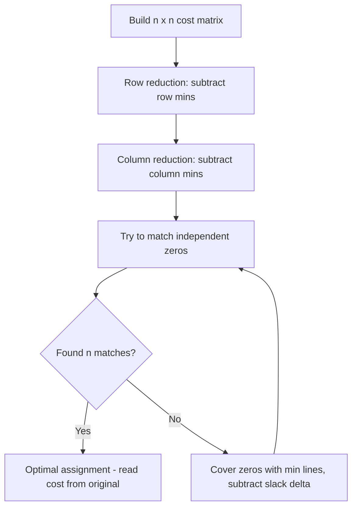

# Hungarian Algorithm (Kuhn-Munkres) — Junior Level

> **One-line summary:** The Hungarian algorithm finds the cheapest way to assign `n` workers to `n` jobs — one worker per job, one job per worker — that minimizes total cost, in `O(n³)` time, by reducing a square cost matrix and matching along its zero entries.

---

## Table of Contents

1. [Introduction](#introduction)
2. [Prerequisites](#prerequisites)
3. [Glossary](#glossary)
4. [Core Concepts](#core-concepts)
5. [Big-O Summary](#big-o-summary)
6. [Real-World Analogies](#real-world-analogies)
7. [Pros & Cons](#pros--cons)
8. [Step-by-Step Walkthrough](#step-by-step-walkthrough)
9. [Code Examples](#code-examples)
10. [Coding Patterns](#coding-patterns)
11. [Error Handling](#error-handling)
12. [Performance Tips](#performance-tips)
13. [Best Practices](#best-practices)
14. [Edge Cases & Pitfalls](#edge-cases--pitfalls)
15. [Common Mistakes](#common-mistakes)
16. [Cheat Sheet](#cheat-sheet)
17. [Visual Animation](#visual-animation)
18. [Summary](#summary)
19. [Further Reading](#further-reading)

---

## Introduction

The **assignment problem** is one of the cleanest optimization problems you will meet. You have `n` workers and `n` jobs. Assigning worker `i` to job `j` costs `cost[i][j]`. You must hand out every job to exactly one worker, and give every worker exactly one job. Among all the ways to do that, you want the one with the **smallest total cost**.

The number of ways to pair `n` workers with `n` jobs is `n!` (n factorial). For `n = 10` that is already 3.6 million; for `n = 20` it is bigger than the number of grains of sand on Earth. Checking every assignment by brute force is hopeless past a handful of items.

The **Hungarian algorithm** — also called the **Kuhn-Munkres algorithm** — solves the assignment problem exactly in `O(n³)` time. It was published by **Harold Kuhn (1955)**, who named it "Hungarian" to honor the earlier graph-theory work of the Hungarian mathematicians **Dénes Kőnig** and **Jenő Egerváry**. **James Munkres (1957)** later proved its polynomial running time, which is why the algorithm carries both names.

The central trick is surprisingly intuitive:

> Subtracting a constant from an entire row (or an entire column) of the cost matrix **never changes which assignment is cheapest** — it only shifts every total by the same amount. So we can keep subtracting until lots of zeros appear, then try to pick one zero in each row and column. Those zeros are the cheap assignments.

This file teaches the classic **matrix-reduction view** — the one you would do by hand on paper. The deeper "potentials and augmenting paths" view that makes the `O(n³)` bound clean is introduced at the [middle](./middle.md) level. For now, focus on: *what is the assignment problem, and how does reducing a matrix find the answer?*

---

## Prerequisites

Before reading this file you should be comfortable with:

- **2D arrays / matrices** — the algorithm lives in an `n × n` `cost[i][j]` grid.
- **Nested loops** — scanning rows and columns of a matrix.
- **The idea of a "matching"** — pairing items from two groups one-to-one.
- **Minimum of a set of numbers** — `min` over a row or column.
- **Big-O notation** — `O(n³)`, `O(n!)`.

Optional but helpful:

- Brief exposure to **bipartite graphs** (two groups, edges only across) — see sibling topics `22-bipartite-matching` and `23-hopcroft-karp`.
- Familiarity with **greedy algorithms** — so you can see *why* greedy fails here.

---

## Glossary

| Term | Meaning |
|------|---------|
| **Assignment problem** | Pair `n` workers with `n` jobs one-to-one to minimize total cost. |
| **Cost matrix** | An `n × n` grid where `cost[i][j]` is the cost of giving job `j` to worker `i`. |
| **Perfect matching** | A choice of `n` cells, exactly one per row and one per column. |
| **Assignment** | A perfect matching; the set of chosen worker→job pairs. |
| **Row reduction** | Subtracting each row's minimum from that whole row. |
| **Column reduction** | Subtracting each column's minimum from that whole column. |
| **Zero (tight) cell** | A cell whose reduced cost is `0` — a candidate for the assignment. |
| **Covering lines** | Horizontal/vertical lines that cover all zeros; the minimum number of lines is key. |
| **Potential / label** | A number per row (`u[i]`) and per column (`v[j]`) we subtract; the modern view of reduction. |
| **Augmenting path** | A zig-zag path that turns a partial matching into a larger one. |
| **Rectangular cost matrix** | More jobs than workers (or vice versa); padded to square before solving. |

---

## Core Concepts

### 1. The Cost Matrix

Everything starts with an `n × n` matrix. Rows are workers, columns are jobs, and `cost[i][j]` is the price of pairing them:

```
            job0  job1  job2
worker0  [   9     11    14  ]
worker1  [   6     15    13  ]
worker2  [   12    13    6   ]
```

An **assignment** picks one cell per row and per column — for example `(w0→job0, w1→job1, w2→job2)` costs `9 + 15 + 6 = 30`. We want the assignment with the lowest total.

### 2. The Subtraction Invariant (the key idea)

Here is the insight the whole algorithm rests on:

> If you subtract the same number `r` from **every** entry in a row, the cheapest assignment stays the cheapest. Every complete assignment uses **exactly one** cell from that row, so every total drops by exactly `r`. The *ordering* of assignments by cost is untouched.

The same holds for columns. So we are free to keep subtracting constants from rows and columns. We use this freedom to manufacture **zeros** — cells where the reduced cost is `0`. A zero means "after fair bookkeeping, this pairing is effectively free; it is a great candidate."

### 3. Row Reduction, then Column Reduction

The first two steps of the classic method:

1. **Row reduction:** for each row, find its minimum and subtract it from every cell in that row. Now every row has at least one zero.
2. **Column reduction:** for each column, find its minimum and subtract it from every cell in that column. Now every column also has at least one zero.

After these two passes, the matrix is full of zeros, and every assignment's cost has been reduced by a fixed total amount that we remember.

### 4. Try to Match on the Zeros

Now we look only at the zero cells and try to pick one zero in each row such that no two picks share a column. If we can pick `n` independent zeros (one per row, one per column), **we are done** — those zeros are the optimal assignment.

The reason this works: a complete assignment made entirely of zeros has reduced cost `0`, which is the smallest possible (reduced costs are never negative). So a zero-only assignment must be optimal. Translating back to the original matrix gives the true minimum cost.

### 5. When You Cannot Match — Add More Zeros

Sometimes the zeros are "clumped" and you cannot pick `n` independent ones. The classic fix uses **covering lines**:

1. Cover all the zeros with the **fewest possible** horizontal and vertical lines.
2. If you needed `n` lines, a perfect zero-matching exists — finish.
3. If you needed **fewer than `n`** lines, find the smallest uncovered value `δ`. Subtract `δ` from every uncovered cell and add `δ` to every doubly-covered cell. This creates new zeros without breaking the invariant. Repeat.

This "find the slack `δ` and relax" step is the heart of the algorithm and the part that most people get wrong by hand. The [middle](./middle.md) level reframes it cleanly with potentials.

---

## Big-O Summary

| Aspect | Complexity | Notes |
|--------|------------|-------|
| Time (modern `O(n³)` form) | **O(n³)** | The standard potentials / augmenting-path version. |
| Time (naive line-covering loops) | O(n⁴) | Easy to write, fine for small `n`; avoid for large `n`. |
| Space | **O(n²)** | The cost matrix plus a few `O(n)` label/match arrays. |
| Brute force (all permutations) | O(n · n!) | Only viable for `n ≤ ~10`. |
| Query the result after running | O(n) | Read the `n` chosen pairs. |
| Rectangular `r × c` | O(min(r,c)² · max(r,c)) | Pad to square, or run the augmenting form per row. |

Compare: brute force is `O(n!)` and explodes; the Hungarian algorithm is polynomial and handles `n` in the hundreds or low thousands comfortably.

---

## Real-World Analogies

| Concept | Analogy |
|---------|---------|
| Cost matrix | A spreadsheet where rows are taxi drivers, columns are waiting passengers, and each cell is the minutes for that driver to reach that passenger. |
| Minimizing total cost | A dispatcher assigning each driver one passenger so the **fleet's total wait** is smallest — not just each driver's own best. |
| Subtraction invariant | Giving every driver the same fuel bonus: it lowers everyone's number equally, so the *best plan* does not change. |
| Zeros | The "perfect fit" pairings that fall out once you have done fair bookkeeping. |
| The `δ` relaxation | When no perfect plan of free pairings exists, you nudge the books by the smallest slack to expose one more free pairing. |
| Greedy failure | Letting the fastest driver grab the nearest passenger first can strand another driver with a terrible long trip — the local best ruins the global total. |

Where the analogy breaks: real dispatch is dynamic (passengers arrive over time) and may not be one-to-one. The Hungarian algorithm solves the **static, balanced, one-to-one** snapshot — which is exactly the subproblem real systems call repeatedly.

---

## Pros & Cons

| Pros | Cons |
|------|------|
| Finds the **provably optimal** assignment, not an approximation. | `O(n³)` is too slow for `n` in the tens of thousands. |
| Polynomial `O(n³)` — crushes the `O(n!)` brute force. | Needs a **square** matrix; rectangular inputs must be padded. |
| Works on any real-valued costs (including negatives after a shift). | Solves only **one-to-one** assignment, not many-to-one. |
| The same code does **maximization** (negate the costs). | A single changed cost usually means re-solving from scratch. |
| Output is easy to use: `n` clean worker→job pairs. | The by-hand line-covering version is fiddly and error-prone. |
| Deterministic — same input always gives the same cost. | `O(n²)` memory: a 5000×5000 matrix is 200 MB of int32. |

**When to use:** balanced one-to-one assignment with a cost/score per pair, `n` up to a few thousand, and you need the *exact* optimum (task scheduling, object tracking, photo correspondence).

**When NOT to use:** huge `n`, many-to-one or capacitated assignment (use [min-cost max-flow](../21-min-cost-max-flow/junior.md)), or when a fast approximate matching is good enough (use a greedy or auction method).

---

## Step-by-Step Walkthrough

Take this `3 × 3` cost matrix (workers `0,1,2`; jobs `0,1,2`):

```
        j0   j1   j2
w0  [   9    11   14  ]
w1  [   6    15   13  ]
w2  [   12   13   6   ]
```

**Step 1 — Row reduction.** Subtract each row's minimum.

- Row 0 min = 9 → `[0, 2, 5]`
- Row 1 min = 6 → `[0, 9, 7]`
- Row 2 min = 6 → `[6, 7, 0]`

```
        j0   j1   j2
w0  [   0    2    5   ]
w1  [   0    9    7   ]
w2  [   6    7    0   ]
```

**Step 2 — Column reduction.** Subtract each column's minimum.

- Col 0 min = 0 → unchanged
- Col 1 min = 2 → `[0, 7, 5]`
- Col 2 min = 0 → unchanged

```
        j0   j1   j2
w0  [   0    0    5   ]
w1  [   0    7    7   ]
w2  [   6    5    0   ]
```

**Step 3 — Try to match on zeros.** Zeros are at `(0,0), (0,1), (1,0), (2,2)`.

- Row 1 has its only zero at column 0 → assign `w1 → j0`.
- Column 0 is now used, so row 0 must take its **other** zero, column 1 → assign `w0 → j1`.
- Row 2's only zero is column 2 → assign `w2 → j2`.

That is three independent zeros, one per row and column. **A perfect matching exists**, so we are done.

**Step 4 — Read off the cost** from the *original* matrix:

```
w0 → j1 : 11
w1 → j0 : 6
w2 → j2 : 6
-----------------
total   : 23
```

The optimal total cost is **23**. (Compare the naive diagonal `9 + 15 + 6 = 30` — the algorithm found a far better plan.)

> If step 3 had failed to find 3 independent zeros, we would cover the zeros with the fewest lines, find the smallest uncovered value `δ`, subtract it from uncovered cells, add it to doubly-covered cells, and retry. On this small example the first matching attempt already succeeded.

---

## Code Examples

### Example: Hungarian Algorithm (O(n³) potentials form)

This is the compact, competitive-programming-standard implementation using **potentials** (`u`, `v`) and augmenting paths. It is `1`-indexed internally to use index `0` as a virtual "free" slot — a common, robust template. It minimizes total cost over a square matrix.

#### Go

```go
package main

import "fmt"

const INF = 1 << 60

// hungarian solves the assignment problem for an n x n cost matrix.
// Returns the minimum total cost and assignment[j] = worker matched to job j.
func hungarian(cost [][]int) (int, []int) {
	n := len(cost)
	// u, v are row/column potentials; p[j] = row matched to column j (0 = none).
	u := make([]int, n+1)
	v := make([]int, n+1)
	p := make([]int, n+1)
	way := make([]int, n+1)

	for i := 1; i <= n; i++ {
		p[0] = i
		j0 := 0
		minv := make([]int, n+1)
		used := make([]bool, n+1)
		for j := 0; j <= n; j++ {
			minv[j] = INF
		}
		// Find an augmenting path for row i along tight edges.
		for {
			used[j0] = true
			i0 := p[j0]
			delta := INF
			j1 := -1
			for j := 1; j <= n; j++ {
				if used[j] {
					continue
				}
				cur := cost[i0-1][j-1] - u[i0] - v[j]
				if cur < minv[j] {
					minv[j] = cur
					way[j] = j0
				}
				if minv[j] < delta {
					delta = minv[j]
					j1 = j
				}
			}
			// Relax potentials by delta (the slack).
			for j := 0; j <= n; j++ {
				if used[j] {
					u[p[j]] += delta
					v[j] -= delta
				} else {
					minv[j] -= delta
				}
			}
			j0 = j1
			if p[j0] == 0 {
				break
			}
		}
		// Augment: follow the way[] pointers back, flipping matches.
		for j0 != 0 {
			j1 := way[j0]
			p[j0] = p[j1]
			j0 = j1
		}
	}

	assignment := make([]int, n)
	for j := 1; j <= n; j++ {
		assignment[j-1] = p[j] - 1 // job (j-1) is done by worker p[j]-1
	}
	total := 0
	for j := 0; j < n; j++ {
		total += cost[assignment[j]][j]
	}
	return total, assignment
}

func main() {
	cost := [][]int{
		{9, 11, 14},
		{6, 15, 13},
		{12, 13, 6},
	}
	total, assign := hungarian(cost)
	fmt.Println("min cost:", total) // 23
	for j, w := range assign {
		fmt.Printf("job %d -> worker %d\n", j, w)
	}
}
```

#### Java

```java
import java.util.Arrays;

public class Hungarian {
    static final int INF = Integer.MAX_VALUE / 2;

    // Returns {minCost, assignment...} where assignment[j] = worker for job j.
    static int[] hungarian(int[][] cost) {
        int n = cost.length;
        int[] u = new int[n + 1];
        int[] v = new int[n + 1];
        int[] p = new int[n + 1];   // p[j] = row matched to column j
        int[] way = new int[n + 1];

        for (int i = 1; i <= n; i++) {
            p[0] = i;
            int j0 = 0;
            int[] minv = new int[n + 1];
            boolean[] used = new boolean[n + 1];
            Arrays.fill(minv, INF);
            do {
                used[j0] = true;
                int i0 = p[j0], delta = INF, j1 = -1;
                for (int j = 1; j <= n; j++) {
                    if (used[j]) continue;
                    int cur = cost[i0 - 1][j - 1] - u[i0] - v[j];
                    if (cur < minv[j]) { minv[j] = cur; way[j] = j0; }
                    if (minv[j] < delta) { delta = minv[j]; j1 = j; }
                }
                for (int j = 0; j <= n; j++) {
                    if (used[j]) { u[p[j]] += delta; v[j] -= delta; }
                    else minv[j] -= delta;
                }
                j0 = j1;
            } while (p[j0] != 0);
            do {
                int j1 = way[j0];
                p[j0] = p[j1];
                j0 = j1;
            } while (j0 != 0);
        }

        int[] result = new int[n + 1];
        int total = 0;
        for (int j = 1; j <= n; j++) {
            result[j] = p[j] - 1;             // worker for job j-1
            total += cost[p[j] - 1][j - 1];
        }
        result[0] = total;
        return result;
    }

    public static void main(String[] args) {
        int[][] cost = {
            {9, 11, 14},
            {6, 15, 13},
            {12, 13, 6}
        };
        int[] r = hungarian(cost);
        System.out.println("min cost: " + r[0]); // 23
        for (int j = 1; j < r.length; j++)
            System.out.println("job " + (j - 1) + " -> worker " + r[j]);
    }
}
```

#### Python

```python
INF = float("inf")


def hungarian(cost):
    """Minimum-cost assignment for a square cost matrix.
    Returns (min_cost, assignment) where assignment[j] = worker for job j."""
    n = len(cost)
    u = [0] * (n + 1)
    v = [0] * (n + 1)
    p = [0] * (n + 1)     # p[j] = row matched to column j (0 = none)
    way = [0] * (n + 1)

    for i in range(1, n + 1):
        p[0] = i
        j0 = 0
        minv = [INF] * (n + 1)
        used = [False] * (n + 1)
        while True:
            used[j0] = True
            i0 = p[j0]
            delta = INF
            j1 = -1
            for j in range(1, n + 1):
                if used[j]:
                    continue
                cur = cost[i0 - 1][j - 1] - u[i0] - v[j]
                if cur < minv[j]:
                    minv[j] = cur
                    way[j] = j0
                if minv[j] < delta:
                    delta = minv[j]
                    j1 = j
            for j in range(n + 1):
                if used[j]:
                    u[p[j]] += delta
                    v[j] -= delta
                else:
                    minv[j] -= delta
            j0 = j1
            if p[j0] == 0:
                break
        while j0 != 0:
            j1 = way[j0]
            p[j0] = p[j1]
            j0 = j1

    assignment = [p[j] - 1 for j in range(1, n + 1)]  # worker for each job
    total = sum(cost[assignment[j]][j] for j in range(n))
    return total, assignment


if __name__ == "__main__":
    cost = [
        [9, 11, 14],
        [6, 15, 13],
        [12, 13, 6],
    ]
    total, assign = hungarian(cost)
    print("min cost:", total)  # 23
    for j, w in enumerate(assign):
        print(f"job {j} -> worker {w}")
```

**What it does:** computes the cheapest assignment for the `3 × 3` example, printing total cost `23` and the worker for each job.
**Run:** `go run main.go` | `javac Hungarian.java && java Hungarian` | `python hungarian.py`

---

## Coding Patterns

### Pattern 1: Maximization Instead of Minimization

**Intent:** You want to **maximize** total profit/score, not minimize cost.

```python
# Negate (or subtract from a big constant) to turn max into min.
BIG = max(max(row) for row in profit)
cost = [[BIG - profit[i][j] for j in range(n)] for i in range(n)]
total_cost, assign = hungarian(cost)
max_profit = sum(profit[assign[j]][j] for j in range(n))
```

### Pattern 2: Rectangular Matrix (Pad to Square)

**Intent:** More jobs than workers (or vice versa). Pad with dummy rows/columns of cost `0` so unmatched real items pair with dummies for free.

```python
def pad_square(cost):
    r, c = len(cost), len(cost[0])
    n = max(r, c)
    return [[cost[i][j] if i < r and j < c else 0
             for j in range(n)] for i in range(n)]
```

### Pattern 3: Forbidden Assignments

**Intent:** Worker `i` *cannot* do job `j` (illegal pairing). Use a very large cost so the optimum never picks it.

```python
FORBIDDEN = 10**9   # larger than any real total
cost[i][j] = FORBIDDEN
```



---

## Error Handling

| Error | Cause | Fix |
|-------|-------|-----|
| Non-square matrix crash | Algorithm assumes `n × n`. | Pad rectangular inputs to square with dummy `0`-cost cells. |
| Integer overflow on `INF + cost` | Using `MaxInt` as `INF` and adding to it. | Use `INF = MaxInt/2` so sums stay representable. |
| Wrong answer with negative costs | Some by-hand methods assume non-negative entries. | The potentials version handles negatives directly; or shift all costs up by a constant first. |
| Maximization gives the minimum | Forgot to negate when you wanted the max. | Negate costs (or `BIG - cost`) before solving. |
| Off-by-one in 1-indexed template | Mixing 0- and 1-indexed access. | Keep matrix `0`-indexed and the `u/v/p` arrays `1`-indexed consistently. |

---

## Performance Tips

- **Use the `O(n³)` potentials version**, not the `O(n⁴)` line-covering loops, for any `n` beyond ~50.
- **Store the matrix as a flat 1D array** (`cost[i*n + j]`) for cache locality on large `n`.
- **Pad rectangular matrices to the smaller dimension** when using the row-by-row augmenting form — work scales with the smaller side.
- **Avoid recomputing** `cost[i0][j] - u[i0] - v[j]` more than once per inner iteration; hoist `u[i0]` into a local.
- **Reuse buffers** (`minv`, `used`, `way`) across the outer loop if you reset them, to cut allocation churn in hot code.

---

## Best Practices

- **Always verify the matrix is square** before calling; pad explicitly and document the padding cost (`0`).
- **Pick `INF` as `MaxInt/2`** (or a domain large constant) so potential updates never overflow.
- **Keep the cost transform explicit** — write a named helper for max→min or profit→cost, not inline magic.
- **Return both the cost and the assignment**, not just the number; callers almost always need the pairs.
- **Test against brute force** on small `n` (≤ 8): generate random matrices, compare the Hungarian answer to the `O(n!)` permutation minimum.
- **Comment the relaxation step** (`δ` / potential update) — it is the part future readers will misread.

---

## Edge Cases & Pitfalls

- **Non-square input** — the most common bug. Pad to square first; never assume the caller did.
- **Negative costs** — fine for the potentials version, but mixing it with a non-negative-only method silently breaks. Know which version you have.
- **Ties** — multiple optimal assignments can exist; the algorithm returns *one* of them. Do not assume uniqueness.
- **Forbidden cells** — use a cost so large it can never appear in an optimal total, but small enough not to overflow when summed.
- **All-equal matrix** — every assignment is optimal; the algorithm still returns a valid one.
- **`n = 1`** — trivially the single cell; make sure the loop handles it.

---

## Common Mistakes

1. **Feeding a rectangular matrix** without padding — index errors or wrong results.
2. **Forgetting to negate** for maximization — you get the *worst* plan instead of the best.
3. **Using `MaxInt` as `INF`** — `INF + cost` overflows and fabricates a cheap phantom path.
4. **Greedy "assign each row its own minimum"** — locally cheapest, globally wrong (it can double-book a column).
5. **Reading the cost from the reduced matrix** — always sum the *original* costs for the final answer.
6. **Misapplying the `δ` step by hand** — subtracting from the wrong cells (uncovered vs doubly-covered) corrupts the matrix.

---

## Cheat Sheet

| Item | Value |
|------|-------|
| Problem | Minimum-cost perfect matching in a weighted bipartite graph |
| Time | O(n³) (potentials form) |
| Space | O(n²) |
| Negative costs | Supported (potentials form) |
| Maximization | Negate costs, then minimize |
| Rectangular | Pad to square with `0`-cost dummies |
| Output | `n` worker→job pairs + total cost |

Classic by-hand recipe:

```
1. Row-reduce  (subtract each row's min)
2. Col-reduce  (subtract each column's min)
3. Cover all zeros with the fewest lines
4. If lines == n  -> match the zeros, done
5. Else: delta = min uncovered; subtract delta from
   uncovered cells, add delta to doubly-covered; go to 3
```

Maximization transform:

```
cost[i][j] = BIG - profit[i][j]     # then minimize
```

---

## Visual Animation

> See [`animation.html`](./animation.html) for an interactive visual animation of the Hungarian algorithm.
>
> The animation demonstrates:
> - The cost matrix with row potentials `u[i]` and column potentials `v[j]`
> - **Tight (zero) cells** of the equality subgraph highlighted
> - The current partial matching and the augmenting path being traced
> - The potential-update (`δ` relaxation) step that exposes new tight edges
> - Step / Run / Reset controls, a Big-O table, and an operation log

---

## Summary

The Hungarian (Kuhn-Munkres) algorithm solves the **assignment problem**: pairing `n` workers with `n` jobs one-to-one at minimum total cost. Its engine is one simple invariant — subtracting a constant from a whole row or column never changes which assignment is cheapest — used to manufacture zeros, then match on them. By hand you row-reduce, column-reduce, cover zeros with lines, and relax by the smallest uncovered slack `δ` until a perfect zero-matching appears. In code, the clean `O(n³)` version uses row/column **potentials** and **augmenting paths**. It runs in `O(n³)` time and `O(n²)` space, handles negative costs and maximization, and demolishes the `O(n!)` brute force. Master the subtraction invariant and the `δ` step, and the rest follows.

---

## Next step:

Continue to [**middle.md**](./middle.md) to learn *why* the algorithm is correct, how potentials and tight edges replace the by-hand line-covering, and when to choose it over greedy, brute force, [Hopcroft-Karp](../23-hopcroft-karp/junior.md), or [min-cost max-flow](../21-min-cost-max-flow/junior.md).

---

## Further Reading

- *Introduction to Algorithms* (CLRS) — bipartite matching and flow background (Chapter 26).
- Harold W. Kuhn, *The Hungarian Method for the Assignment Problem*, Naval Research Logistics Quarterly, 1955.
- James Munkres, *Algorithms for the Assignment and Transportation Problems*, SIAM, 1957.
- cp-algorithms.com — "Hungarian algorithm for solving the assignment problem."
- Sibling topics: `22-bipartite-matching`, `23-hopcroft-karp`, `21-min-cost-max-flow`.
- SciPy: `scipy.optimize.linear_sum_assignment` — production-grade reference implementation.
