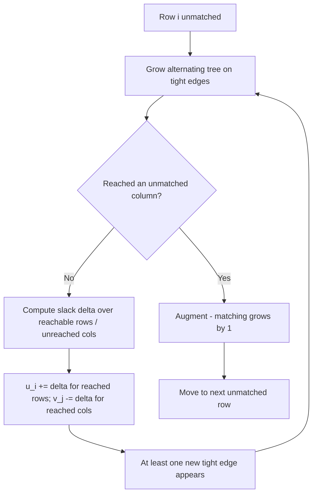
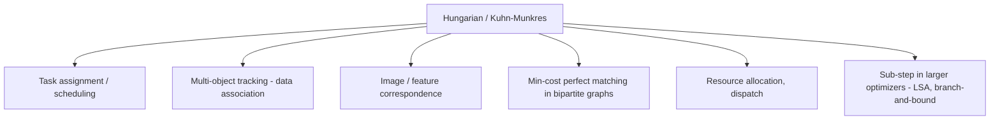

# Hungarian Algorithm (Kuhn-Munkres) — Middle Level

> **Focus:** *Why* the algorithm is correct, how **potentials** and **tight edges** replace by-hand line-covering, why the `δ` relaxation always makes progress, and when to choose it over greedy, brute force, Hopcroft-Karp, or min-cost max-flow.

---

## Table of Contents

1. [Introduction](#introduction)
2. [Deeper Concepts](#deeper-concepts)
3. [Comparison with Alternatives](#comparison-with-alternatives)
4. [Advanced Patterns](#advanced-patterns)
5. [Graph and Bipartite Applications](#graph-and-bipartite-applications)
6. [Algorithmic Integration](#algorithmic-integration)
7. [Code Examples](#code-examples)
8. [Error Handling](#error-handling)
9. [Performance Analysis](#performance-analysis)
10. [Best Practices](#best-practices)
11. [Visual Animation](#visual-animation)
12. [Summary](#summary)

---

## Introduction

At junior level the Hungarian algorithm is "row-reduce, column-reduce, match the zeros, relax by `δ` when stuck." At middle level you start asking the *engineering* questions:

- *Why* does subtracting row/column constants preserve the optimal assignment, and why does an all-zero matching prove optimality?
- *What exactly* are the row/column **potentials** `u[i]`, `v[j]`, and why are zeros really **tight edges** in an "equality subgraph"?
- *Why* does the `δ`-relaxation step always either grow the matching or expose a new tight edge — i.e. why does it terminate?
- *When* is greedy or a simple Kuhn's bipartite matching enough, and when do you genuinely need the cubic Hungarian machinery?
- *How* does the assignment problem relate to [Hopcroft-Karp](../23-hopcroft-karp/middle.md) (unweighted) and [min-cost max-flow](../21-min-cost-max-flow/middle.md) (the general case)?

These distinctions decide whether you ship an `O(n³)` solver that returns the provable optimum, or an `O(n!)` brute force that times out, or a greedy that quietly returns a worse plan.

---

## Deeper Concepts

### Potentials: the modern view of reduction

Instead of physically subtracting constants and mutating the matrix, keep two arrays:

```
u[i] = potential of row i    (the total subtracted from row i so far)
v[j] = potential of column j (the total subtracted from column j so far)
```

The **reduced cost** of cell `(i, j)` is then a *derived* quantity, never stored:

```
reduced(i, j) = cost[i][j] - u[i] - v[j]
```

"Row-reduce by the row min" is just `u[i] = min_j cost[i][j]`. "Column-reduce" is `v[j] = min_i (cost[i][j] - u[i])`. The whole by-hand matrix-mutation dance becomes bookkeeping on two `O(n)` arrays. This is not just tidier — it is what makes the clean `O(n³)` implementation possible.

The governing invariant the algorithm maintains is **dual feasibility**:

```
cost[i][j] - u[i] - v[j] >= 0     for all i, j   (reduced costs never negative)
```

As long as that holds, the matrix's optimum is unchanged and a zero-reduced-cost matching is optimal.

### Tight edges and the equality subgraph

A cell with `reduced(i, j) == 0` is a **tight edge**. The set of all tight edges forms the **equality subgraph** — a bipartite graph where an edge `(i, j)` exists iff `cost[i][j] = u[i] + v[j]`.

> **Key fact:** if the equality subgraph contains a **perfect matching**, that matching is the optimal assignment.

Why? Its total cost is `Σ (u[i] + v[j]) = Σ u[i] + Σ v[j]` (each row and column used once). And for *any* assignment `M`, `cost(M) = Σ cost[i][j] ≥ Σ (u[i] + v[j])` by dual feasibility. So the equality-subgraph matching achieves the lower bound `Σ u + Σ v` — nothing can beat it. This is **weak duality** (full proof in [professional.md](./professional.md)), and it is the entire reason the algorithm is correct.

So the algorithm has exactly two jobs:

1. **Match as much as possible** within the current equality subgraph (using augmenting paths, like unweighted bipartite matching).
2. **When stuck** (no augmenting path exists), **adjust potentials by `δ`** to add at least one new tight edge — without breaking dual feasibility — then try again.

### The `δ` relaxation, precisely

Suppose you ran augmenting-path matching on the equality subgraph and got stuck: starting from an unmatched row, you reached a set `S` of rows and `T` of columns via alternating tight edges, but could not extend. Define the slack

```
δ = min over reachable rows i in S, non-reached columns j not in T of  reduced(i, j)
```

This `δ > 0` is the smallest amount by which a reachable row's edge falls short of being tight. Update potentials:

```
for i in S:        u[i] += δ      (raise reached rows)
for j in T:        v[j] -= δ      (lower reached columns)
```

The effect:

- Reduced costs of edges between `S` and `T` are **unchanged** (`+δ` to row, `-δ` to column cancel) — existing tight edges stay tight.
- Reduced costs of edges from `S` to **non-`T`** columns drop by `δ` — at least one becomes `0`, a **new tight edge**.
- Dual feasibility is preserved (the new tight edge hits exactly `0`, never goes negative, by the choice of `δ`).

So every `δ`-step either lets the alternating tree grow (a new column becomes reachable) or directly exposes an augmenting path. Since each row is matched at most once and each augmentation is permanent, the algorithm terminates. The slick `O(n³)` template (shown at junior level) folds the matching and the `δ`-update into one tight inner loop using a running `minv[]` array of column slacks.



### Why greedy fails (and the algorithm does not)

Greedy "give each worker their cheapest job" can double-book a column: two workers may both prefer job 0. Fixing the conflict locally (give job 0 to the cheaper of the two, send the other to its second choice) can cascade into an arbitrarily bad total — there is no local repair that guarantees global optimality. The Hungarian algorithm avoids this by never *committing* greedily: it builds matchings only along tight edges and uses augmenting paths to *re-route* prior matches when that lowers the global total. The duality bound `Σ u + Σ v` certifies that the final matching is globally optimal, something no greedy heuristic can prove.

---

## Comparison with Alternatives

| Attribute | Hungarian (Kuhn-Munkres) | Min-cost max-flow (SPFA/Dijkstra) | Hopcroft-Karp | Greedy matching | Brute force |
|-----------|--------------------------|-----------------------------------|---------------|-----------------|-------------|
| Problem | Min-cost perfect matching (weighted, balanced) | Any min-cost flow incl. capacities | Max-**cardinality** matching (unweighted) | Heuristic matching | Exact, all permutations |
| Time | `O(n³)` | `O(V·E·log V)`–`O(V²·E)` typical | `O(E·√V)` | `O(E log E)` | `O(n·n!)` |
| Optimal? | **Yes (exact)** | **Yes (exact)** | Max size, **ignores weights** | **No** | Yes |
| Weights | **Yes** | **Yes** | No | Yes (greedily) | Yes |
| Capacities / many-to-one | No | **Yes** | No | — | — |
| Negative costs | **Yes** | Yes (with care) | n/a | Yes | Yes |
| Best for | Balanced `n×n` assignment, exact, dense | Capacitated / unbalanced / transportation | Pure cardinality matching | Quick approximation | Tiny `n` (≤ 10) sanity check |
| Code size | Medium (one tight template) | Large | Medium | Tiny | Tiny |

**Rules of thumb:**

- **Balanced one-to-one assignment, exact optimum, `n ≤ a few thousand`:** Hungarian. It is the specialized, fast, simple-to-template choice.
- **Capacities, supplies/demands, unbalanced many-to-one (transportation problem):** [min-cost max-flow](../21-min-cost-max-flow/middle.md). The assignment problem is a *special case* of MCMF, so MCMF always works — just slower and heavier than the dedicated Hungarian solver.
- **You only need the *largest* matching, weights irrelevant:** [Hopcroft-Karp](../23-hopcroft-karp/middle.md) at `O(E√V)`. Do not pay for weighted machinery you do not use.
- **You need a fast approximate answer and can tolerate suboptimality:** greedy or auction algorithms.
- **`n ≤ 8` and you want a correctness oracle:** brute force the `n!` permutations to test your Hungarian implementation.

The Hungarian algorithm is essentially "min-cost max-flow specialized to the unit-capacity bipartite case, with the flow steps replaced by augmenting paths on tight edges." Recognizing that relationship tells you exactly when to upgrade to full MCMF: the moment capacities or unbalanced supply enter the picture.

---

## Advanced Patterns

### Pattern: Maximization (assignment of profit)

To **maximize** total profit, transform to a min-cost problem. Either negate every entry, or subtract from a constant `BIG` at least as large as the maximum profit (keeps costs non-negative):

```
cost[i][j] = BIG - profit[i][j]
```

Solve the min problem; the maximum profit is `Σ profit[assign[j]][j]` over the returned assignment. The two transforms give the same assignment; `BIG - profit` is preferred when your implementation assumes non-negative costs.

### Pattern: Rectangular / unbalanced matrices

If there are `r` workers and `c` jobs with `r ≠ c`, pad to `n = max(r, c)` with dummy rows/columns of cost `0`. A real item matched to a dummy is "left unassigned" at no cost. Alternatively, the row-by-row augmenting form (process the smaller side only) naturally handles `r ≤ c` without padding, costing `O(r² · c)` — cheaper when one side is much smaller.

```python
def pad_to_square(cost, fill=0):
    r, c = len(cost), len(cost[0])
    n = max(r, c)
    return [[cost[i][j] if i < r and j < c else fill
             for j in range(n)] for i in range(n)]
```

### Pattern: Forbidden assignments

Disallow worker `i` doing job `j` by setting `cost[i][j]` to a sentinel `BIG` so large it can never appear in any optimal total but small enough to avoid overflow when summed (`BIG ≈ 10× the max plausible total`, not `MaxInt`). If a forbidden cell still appears in the answer, the instance was infeasible (no perfect matching avoiding forbidden cells exists).

### Pattern: Bottleneck assignment (minimize the maximum)

Sometimes you want to minimize the **largest** single assignment cost, not the sum (e.g. minimize the slowest task's finish time). Binary-search a threshold `T`: keep only edges with `cost ≤ T`, and test whether a perfect matching exists (unweighted Hopcroft-Karp). The smallest feasible `T` is the bottleneck optimum — `O(log(max cost) · E√V)`. This is a different objective; the Hungarian algorithm optimizes the *sum*, so reach for the binary-search-plus-matching pattern when the objective is the max.

---

## Graph and Bipartite Applications



- **Task assignment / scheduling** — `cost[i][j]` is the time or money for worker `i` to do job `j`; minimize the total. The textbook use case.
- **Multi-object tracking** — frame-to-frame *data association*: `cost[i][j]` is the dissimilarity between track `i` and detection `j` (distance, IoU mismatch). The optimal assignment links tracks to detections. This is the assignment step inside SORT and many Kalman-filter trackers.
- **Image / feature correspondence** — match keypoints between two images by descriptor distance; the Hungarian assignment finds the globally consistent pairing.
- **Min-cost perfect matching** — the assignment problem *is* min-cost perfect matching on a complete weighted bipartite graph, so any such matching problem maps directly here.
- **Resource / fleet dispatch** — assign vehicles to requests minimizing total travel — the static snapshot solved repeatedly as the world updates.

The common shape: two equal-size sets, a cost per cross-pair, and a need for the *globally* cheapest one-to-one linking. Whenever you see that shape, the Hungarian algorithm is the default tool.

---

## Algorithmic Integration

The assignment solver frequently appears as a **subroutine** inside a larger optimizer:

- **Branch-and-bound for TSP / scheduling** — the assignment-problem relaxation is a cheap, tight *lower bound* on a TSP tour (the assignment ignores the subtour constraint), computed at each node by the Hungarian algorithm.
- **Linear sum assignment in pipelines** — trackers, stereo matching, and entity-resolution systems call a `linear_sum_assignment` routine (SciPy's name) once per frame/batch; the Hungarian algorithm is its classic engine.
- **Dual decomposition** — the potentials `u`, `v` *are* an optimal dual solution to the assignment LP, so the algorithm doubles as a fast LP solver for this structured problem.

```python
# The assignment problem as a lower bound for branch-and-bound TSP.
def assignment_lower_bound(dist):
    # dist[i][j] = travel cost i->j; forbid the diagonal so no self-loop.
    n = len(dist)
    BIG = 10**9
    cost = [[dist[i][j] if i != j else BIG for j in range(n)] for i in range(n)]
    total, _ = hungarian(cost)   # hungarian() from junior.md
    return total                 # <= true optimal tour length
```

The deep connection: the Hungarian algorithm is a **primal-dual** method. It simultaneously maintains a feasible *dual* (the potentials, always satisfying `reduced ≥ 0`) and grows a *primal* matching restricted to tight edges, terminating exactly when the primal is perfect — at which point primal cost equals dual value, certifying optimality. This primal-dual template generalizes far beyond assignment (it underlies min-cost flow and much of combinatorial optimization), which is why understanding it here pays off broadly.

---

## Code Examples

### O(n³) Hungarian with explicit potentials and assignment recovery

This variant exposes the potentials `u`, `v` so you can read the dual solution and the certified lower bound, not just the matching.

#### Go

```go
package main

import "fmt"

const INF = 1 << 60

// solve returns minCost, assignment (job -> worker), and the dual potentials.
func solve(cost [][]int) (int, []int, []int, []int) {
	n := len(cost)
	u := make([]int, n+1)
	v := make([]int, n+1)
	p := make([]int, n+1)
	way := make([]int, n+1)

	for i := 1; i <= n; i++ {
		p[0] = i
		j0 := 0
		minv := make([]int, n+1)
		used := make([]bool, n+1)
		for j := range minv {
			minv[j] = INF
		}
		for {
			used[j0] = true
			i0, delta, j1 := p[j0], INF, -1
			for j := 1; j <= n; j++ {
				if used[j] {
					continue
				}
				cur := cost[i0-1][j-1] - u[i0] - v[j]
				if cur < minv[j] {
					minv[j], way[j] = cur, j0
				}
				if minv[j] < delta {
					delta, j1 = minv[j], j
				}
			}
			for j := 0; j <= n; j++ {
				if used[j] {
					u[p[j]] += delta
					v[j] -= delta
				} else {
					minv[j] -= delta
				}
			}
			j0 = j1
			if p[j0] == 0 {
				break
			}
		}
		for j0 != 0 {
			j1 := way[j0]
			p[j0] = p[j1]
			j0 = j1
		}
	}

	assign := make([]int, n)
	total := 0
	for j := 1; j <= n; j++ {
		assign[j-1] = p[j] - 1
		total += cost[p[j]-1][j-1]
	}
	return total, assign, u, v
}

func main() {
	cost := [][]int{
		{9, 11, 14},
		{6, 15, 13},
		{12, 13, 6},
	}
	total, assign, u, v := solve(cost)
	fmt.Println("min cost:", total)    // 23
	fmt.Println("assignment:", assign) // job -> worker
	fmt.Println("u:", u[1:], "v:", v[1:])
}
```

#### Java

```java
public class HungarianDual {
    static final int INF = Integer.MAX_VALUE / 2;

    static int solve(int[][] cost, int[] assignOut) {
        int n = cost.length;
        int[] u = new int[n + 1], v = new int[n + 1];
        int[] p = new int[n + 1], way = new int[n + 1];
        for (int i = 1; i <= n; i++) {
            p[0] = i;
            int j0 = 0;
            int[] minv = new int[n + 1];
            boolean[] used = new boolean[n + 1];
            java.util.Arrays.fill(minv, INF);
            do {
                used[j0] = true;
                int i0 = p[j0], delta = INF, j1 = -1;
                for (int j = 1; j <= n; j++) {
                    if (used[j]) continue;
                    int cur = cost[i0 - 1][j - 1] - u[i0] - v[j];
                    if (cur < minv[j]) { minv[j] = cur; way[j] = j0; }
                    if (minv[j] < delta) { delta = minv[j]; j1 = j; }
                }
                for (int j = 0; j <= n; j++) {
                    if (used[j]) { u[p[j]] += delta; v[j] -= delta; }
                    else minv[j] -= delta;
                }
                j0 = j1;
            } while (p[j0] != 0);
            do { int j1 = way[j0]; p[j0] = p[j1]; j0 = j1; } while (j0 != 0);
        }
        int total = 0;
        for (int j = 1; j <= n; j++) {
            assignOut[j - 1] = p[j] - 1;
            total += cost[p[j] - 1][j - 1];
        }
        return total;
    }

    public static void main(String[] args) {
        int[][] cost = {{9, 11, 14}, {6, 15, 13}, {12, 13, 6}};
        int[] assign = new int[cost.length];
        System.out.println("min cost: " + solve(cost, assign)); // 23
        System.out.println("assignment: " + java.util.Arrays.toString(assign));
    }
}
```

#### Python

```python
INF = float("inf")


def solve(cost):
    """Returns (min_cost, assignment, u, v); assignment[j] = worker for job j."""
    n = len(cost)
    u = [0] * (n + 1)
    v = [0] * (n + 1)
    p = [0] * (n + 1)
    way = [0] * (n + 1)
    for i in range(1, n + 1):
        p[0] = i
        j0 = 0
        minv = [INF] * (n + 1)
        used = [False] * (n + 1)
        while True:
            used[j0] = True
            i0, delta, j1 = p[j0], INF, -1
            for j in range(1, n + 1):
                if used[j]:
                    continue
                cur = cost[i0 - 1][j - 1] - u[i0] - v[j]
                if cur < minv[j]:
                    minv[j], way[j] = cur, j0
                if minv[j] < delta:
                    delta, j1 = minv[j], j
            for j in range(n + 1):
                if used[j]:
                    u[p[j]] += delta
                    v[j] -= delta
                else:
                    minv[j] -= delta
            j0 = j1
            if p[j0] == 0:
                break
        while j0 != 0:
            j1 = way[j0]
            p[j0] = p[j1]
            j0 = j1
    assignment = [p[j] - 1 for j in range(1, n + 1)]
    total = sum(cost[assignment[j]][j] for j in range(n))
    return total, assignment, u[1:], v[1:]


if __name__ == "__main__":
    cost = [[9, 11, 14], [6, 15, 13], [12, 13, 6]]
    total, assign, u, v = solve(cost)
    print("min cost:", total)        # 23
    print("assignment:", assign)
    print("dual u:", u, "v:", v)     # certifies the optimum: sum(u)+sum(v) == 23
```

**What it does:** solves the `3×3` example and additionally returns the dual potentials `u`, `v`. Note that `sum(u) + sum(v) == 23 == min cost` — the dual *certifies* optimality.

---

## Error Handling

| Scenario | What goes wrong | Correct approach |
|----------|----------------|------------------|
| Rectangular matrix passed in | Index out of range or wrong matching. | Pad to square with `0`-cost dummies, or use the `r ≤ c` row-augmenting form. |
| `INF` set to `MaxInt` | `INF - u - v` or `INF + δ` overflows. | Use `INF = MaxInt/2`; keep potential magnitudes bounded. |
| Maximization without transform | Returns the worst plan. | Apply `BIG - profit` (or negation) before solving. |
| Negative costs with a non-negative-only method | Wrong or non-terminating. | Use the potentials form (handles negatives), or shift all costs up by `-min`. |
| Infeasible forbidden-cell instance | A `BIG` cell appears in the answer. | Detect `BIG` in the result and report "no valid assignment." |
| Float costs with `==` tight-edge tests | Floating error makes "tight" flaky. | Use integer costs (scale floats) or an epsilon tolerance for tightness. |

---

## Performance Analysis

| n | `O(n³)` operations | Approx. time (compiled, int matrix) |
|---|--------------------|-------------------------------------|
| 50 | 1.25 × 10⁵ | < 1 ms |
| 100 | 10⁶ | ~1 ms |
| 500 | 1.25 × 10⁸ | ~50–100 ms |
| 1000 | 10⁹ | ~0.5–1 s |
| 2000 | 8 × 10⁹ | ~5–10 s |
| 5000 | 1.25 × 10¹¹ | minutes — usually too slow |

The `O(n³)` template's inner loop is a handful of integer ops over the `minv[]` slack array, very branch- and cache-friendly. Hoisting `u[i0]` into a local and skipping used columns are the main micro-optimizations; the algorithm has no early exit, so the work is fixed at `Θ(n³)`.

```python
import time, random

def bench(n):
    cost = [[random.randint(1, 1000) for _ in range(n)] for _ in range(n)]
    t = time.perf_counter()
    solve(cost)               # solve() from above
    return time.perf_counter() - t

for n in (50, 100, 200, 400):
    print(n, f"{bench(n):.3f}s")
```

Pure Python is ~50–100× slower than Go/Java here; for large `n` use `scipy.optimize.linear_sum_assignment` (a C implementation) or a compiled language. For `n` beyond a few thousand, reconsider whether you need an *exact* solution — approximate auction algorithms scale further.

---

## Best Practices

- **Use the potentials / augmenting-path `O(n³)` template**, not the `O(n⁴)` line-covering form, for anything but pedagogy.
- **Keep `INF = MaxInt/2`** and integer costs; scale floats to integers when you need exactness.
- **Return the assignment *and* the dual** when you can — the duals certify optimality and serve as lower bounds in larger optimizers.
- **Pad rectangular inputs explicitly** with a named helper; document the `0`-cost semantics.
- **Pick the right tool for the objective:** sum → Hungarian; max single cost → binary-search + Hopcroft-Karp; capacities → min-cost max-flow.
- **Test against brute force** on `n ≤ 8` with random matrices; it catches indexing and transform bugs instantly.
- **Verify the certificate:** assert `sum(u) + sum(v) == total cost` after solving — a cheap invariant that catches potential-update bugs.

### When NOT to reach for the Hungarian algorithm

The instinct to grab the cubic solver should be checked. If your problem has **capacities** (a worker can do `k` jobs, a job needs `m` workers) or **unbalanced supply/demand**, it is a *transportation* / min-cost-flow problem — model it as [min-cost max-flow](../21-min-cost-max-flow/middle.md), which handles those constraints natively; squeezing it into a square assignment loses the structure. If weights are irrelevant and you only need the *largest* matching, [Hopcroft-Karp](../23-hopcroft-karp/middle.md) is faster and simpler. If `n` is in the tens of thousands and an approximate answer suffices, auction or greedy algorithms scale where the cubic exact method cannot. The Hungarian algorithm earns its keep specifically for **balanced, one-to-one, exact, weighted** assignment with `n` up to a few thousand — outside that envelope, a different model usually wins.

---

## Worked δ-Update Trace

The δ-relaxation is the step most people get wrong, so trace it once on a matrix that *forces* one. Take:

```
        j0   j1   j2
w0  [   8    4    7   ]
w1  [   5    2    3   ]
w2  [   9    4    8   ]
```

**Row reduction** sets `u = (4, 2, 4)`, giving reduced costs:

```
c̄:     j0   j1   j2     tight (c̄=0)
w0  [   4    0    3   ]   (0,1)
w1  [   3    0    1   ]   (1,1)
w2  [   5    0    4   ]   (2,1)
```

Every tight edge points at **column j1** — a classic clump. We can match exactly one of `{w0, w1, w2}` to `j1`; the other two have no tight edge.

**Match what we can.** Say `w0–j1`. Now try to grow the tree from the next unmatched row `w1`:
- `w1`'s only tight edge is `(1, 1)` → reach `j1`, which is taken by `w0` → add `w0` to the tree.
- `w0`'s tight edges are all to `j1` (already reached). The tree **stalls**: `S = {w1, w0}`, `T = {j1}`.

**Compute δ.** Over reached rows `S = {w0, w1}` and unreached columns `{j0, j2}`:

```
δ = min( c̄[0][0], c̄[0][2], c̄[1][0], c̄[1][2] )
  = min( 4, 3, 3, 1 ) = 1     (achieved at (1, 2))
```

**Relax:** `u[0] += 1`, `u[1] += 1` (reached rows); `v[1] -= 1` (reached column). New reduced costs:

```
c̄:     j0   j1   j2     change
w0  [   3    0    2   ]   row 0: -1 except j1 (canceled)
w1  [   2    0    0   ]   (1,2) is now TIGHT  ← new edge!
w2  [   5    1    4   ]   unchanged (w2 not reached)
```

The new tight edge `(1, 2)` lets the search continue: `w1 → j2` (free) → **augment**. Final matching `w0–j1, w1–j2`, and we still need `w2`. Repeating the process matches `w2–j0` (after another tiny relaxation). The dual value `Σu + Σv` rose by exactly `δ = 1` at the relaxation — monotone progress, as promised.

The takeaways that prevent by-hand errors: (1) `δ` is taken over **reached rows → unreached columns only**, not the whole matrix; (2) you add `δ` to reached *rows* and subtract from reached *columns* — never the reverse; (3) edges *inside* `S × T` keep their reduced cost (the `+δ`/`-δ` cancel), so prior tight edges survive.

---

## Why the Equality-Subgraph Approach Beats Re-Reducing

A tempting but slower mental model is "keep physically reducing the matrix and re-scanning for a line cover each round" — the `O(n⁴)` form. The potentials view is strictly better for three reasons:

1. **No matrix mutation.** Reduced costs are *derived* (`c - u - v`), so a δ-update is `O(n)` array arithmetic on `u`/`v`, not an `O(n²)` rewrite of the matrix.
2. **Incremental tightness.** You never recompute the whole equality subgraph; a δ-update adds *at least one* edge to it, and you continue the same augmenting search rather than restarting.
3. **A running slack array.** The standard template keeps `minv[j]` = the smallest slack from the current tree to column `j`. Computing `δ = min_j minv[j]` is `O(n)`, and after the update every `minv[j]` shifts by `δ` in `O(n)`. This is exactly what collapses the per-phase cost from `O(n³)` (re-reduce + re-cover) to `O(n²)`, and the whole algorithm to `O(n³)`.

The conceptual unlock: **the line-cover/δ dance and the potential update are the same operation**, viewed combinatorially vs algebraically. König's minimum line cover *is* the dual; raising/lowering potentials *is* shifting the cover. Once you see them as one thing, the `O(n³)` template stops looking like magic and reads as "maintain the dual, grow the primal, repeat."

---

## Visual Animation

> See [`animation.html`](./animation.html) for an interactive view.
>
> The middle-level animation highlights:
> - The cost matrix with live row/column **potentials** `u[i]`, `v[j]`.
> - **Tight (reduced-cost-0) edges** forming the equality subgraph.
> - Growing the matching via augmenting paths on tight edges.
> - The `δ` slack computation and the potential update that creates a new tight edge.
> - The running certificate `Σ u + Σ v` converging to the optimal cost.

---

## Summary

The Hungarian algorithm is a **primal-dual** method for min-cost perfect matching. The dual variables — row/column **potentials** `u[i]`, `v[j]` — keep every **reduced cost** `cost[i][j] - u[i] - v[j]` non-negative (dual feasibility), so a matching using only **tight** (reduced-cost-0) edges achieves the lower bound `Σ u + Σ v` and is therefore optimal. The algorithm grows a matching inside the tight-edge **equality subgraph** with augmenting paths, and when stuck, **relaxes potentials by the slack `δ`** to expose at least one new tight edge — guaranteeing progress and termination in `O(n³)`. Choose it for balanced, exact, weighted one-to-one assignment; upgrade to [min-cost max-flow](../21-min-cost-max-flow/middle.md) for capacities and unbalanced supply, [Hopcroft-Karp](../23-hopcroft-karp/middle.md) for pure cardinality, and never let greedy's local choices fool you into shipping a suboptimal plan.

---

## Next step:

Continue to [**senior.md**](./senior.md) to see how real assignment systems (multi-object trackers, schedulers, dispatch) use the algorithm at scale — rectangular cost matrices, latency budgets, sparsity tricks, and when to swap the exact solver for an approximate one.
