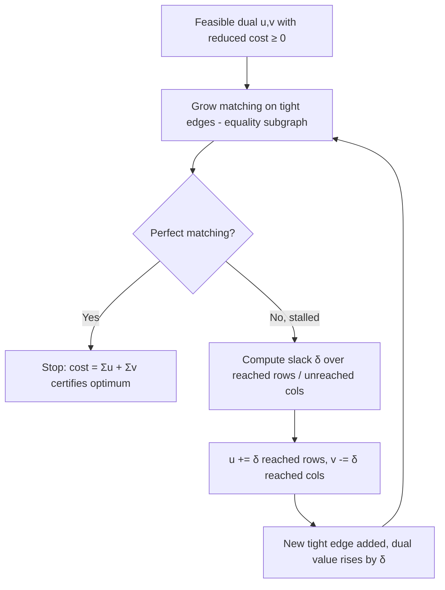

# Hungarian Algorithm (Kuhn-Munkres) — Mathematical Foundations and Complexity Theory

## Table of Contents
1. Formal Definition
2. The Assignment LP and Its Dual
3. Complementary Slackness — the Optimality Certificate
4. Correctness Proof — Primal-Dual Invariants
5. The δ-Relaxation and Termination
6. Complexity — O(n³) Time, O(n²) Space
7. König's Theorem, Total Unimodularity, and Integrality
8. The Equality Subgraph and Augmenting Paths
9. Comparison with Alternatives (asymptotics + constants)
10. Variants, Generalizations, and Open Directions
11. Worked Primal-Dual Trace
12. Reference Implementations
    - 12.1 Go — O(n³) potentials with dual recovery
    - 12.2 Java — augmenting-path Kuhn-Munkres
    - 12.3 Python — certificate verification
13. Summary

---

## 1. Formal Definition

Let `G = (X ∪ Y, E)` be a complete bipartite graph with `|X| = |Y| = n`, `X = {x_0, …, x_{n-1}}` the workers, `Y = {y_0, …, y_{n-1}}` the jobs, and a cost `c : X × Y → ℝ`, written `c[i][j]`.

**Definition 1.1 (Perfect matching).** A perfect matching `M` is a bijection `π : {0,…,n-1} → {0,…,n-1}` pairing `x_i` with `y_{π(i)}`. Its cost is `c(M) = Σ_i c[i][π(i)]`.

**Definition 1.2 (Assignment problem).** Find a perfect matching of minimum cost:

```text
minimize   Σ_i c[i][π(i)]   over all permutations π of {0,…,n-1}.
```

There are `n!` permutations; the Hungarian algorithm solves this in `O(n³)` without enumerating them.

**Definition 1.3 (Reduced cost / potentials).** Given row potentials `u ∈ ℝ^n` and column potentials `v ∈ ℝ^n`, the **reduced cost** is

```text
c̄[i][j] = c[i][j] - u[i] - v[j].
```

A pair `(i, j)` is **tight** (an **equality edge**) iff `c̄[i][j] = 0`. The potentials are **feasible** iff `c̄[i][j] ≥ 0` for all `i, j`.

---

## 2. The Assignment LP and Its Dual

The assignment problem is an integer program, but its **linear relaxation** has integral optima (§7), so we may study the LP.

**Primal LP.** Let `z[i][j] ∈ {0,1}` indicate that `x_i` is matched to `y_j`:

```text
minimize    Σ_{i,j} c[i][j] · z[i][j]
subject to  Σ_j z[i][j] = 1     for all i      (each worker one job)
            Σ_i z[i][j] = 1     for all j      (each job one worker)
            z[i][j] ≥ 0.
```

**Dual LP.** Introduce a dual variable `u[i]` for each row constraint and `v[j]` for each column constraint:

```text
maximize    Σ_i u[i] + Σ_j v[j]
subject to  u[i] + v[j] ≤ c[i][j]     for all i, j.
```

The dual constraint `u[i] + v[j] ≤ c[i][j]` is *exactly* dual feasibility `c̄[i][j] ≥ 0`. The dual objective `Σ u + Σ v` is the **lower bound** the algorithm tracks. The Hungarian algorithm is a **primal-dual** method: it maintains a feasible dual and drives the primal (a matching on tight edges) to optimality.

**Weak duality (immediate).** For any feasible `z` and feasible `(u, v)`:

```text
Σ_{i,j} c[i][j] z[i][j] ≥ Σ_{i,j} (u[i]+v[j]) z[i][j]
                       = Σ_i u[i] (Σ_j z[i][j]) + Σ_j v[j] (Σ_i z[i][j])
                       = Σ_i u[i] + Σ_j v[j].
```

So every matching costs at least `Σ u + Σ v`. Equality is what the algorithm achieves.

---

## 3. Complementary Slackness — the Optimality Certificate

**Theorem 3.1 (Complementary slackness).** A feasible primal `z` and a feasible dual `(u, v)` are *both optimal* iff

```text
z[i][j] > 0  ⟹  u[i] + v[j] = c[i][j]     (matched edges are tight).
```

**Proof.** From the weak-duality chain in §2, the only inequality is `Σ c·z ≥ Σ (u+v)·z`, with slack `Σ_{i,j} c̄[i][j] z[i][j]`. This slack is `0` iff every `z[i][j] > 0` has `c̄[i][j] = 0`. When the slack is `0`, primal cost equals dual value, so by weak duality both are optimal. ∎

**Corollary 3.2 (Certificate).** If `M` is a perfect matching using only tight edges and `(u, v)` is feasible, then `M` is a minimum-cost assignment, and `c(M) = Σ u + Σ v` is a *proof* of optimality requiring no comparison against other matchings.

This is the engine of correctness: the algorithm's goal is precisely to produce a perfect matching inside the **equality subgraph** `G_= = {(i,j) : c̄[i][j] = 0}` while keeping `(u, v)` feasible. The instant it does, Corollary 3.2 certifies optimality.

The primal-dual loop that achieves this is exactly:



---

## 4. Correctness Proof — Primal-Dual Invariants

The algorithm maintains three invariants across its iterations:

```text
(I1) Dual feasibility:  c̄[i][j] = c[i][j] - u[i] - v[j] ≥ 0 for all i, j.
(I2) Matching tightness: every matched edge (i, π(i)) is tight (c̄ = 0).
(I3) Monotone progress: each outer iteration increases |M| by exactly 1.
```

**Initialization.** Set `u[i] = min_j c[i][j]`, `v[j] = min_i (c[i][j] - u[i])` (or `u = v = 0` with the slick template's lazy updates). Then `c̄ ≥ 0` (I1) and `M = ∅` (vacuously I2).

**Theorem 4.1.** Starting from `M = ∅`, the algorithm terminates with a perfect matching satisfying (I1)–(I2), hence (by Corollary 3.2) a minimum-cost assignment.

**Proof.**

*Invariant maintenance.* Each outer iteration takes an unmatched row and searches the equality subgraph `G_=` for an augmenting path via alternating tight edges (Hungarian/Hopcroft tree). Two outcomes:

1. **Augmenting path found.** Flipping matched/unmatched edges along it increases `|M|` by 1 (I3). Every edge on the path is tight (the search only traverses `G_=`), so (I2) holds. The dual is untouched, so (I1) holds.

2. **No augmenting path.** Let `S ⊆ X`, `T ⊆ Y` be the rows/columns reached by the alternating search from the unmatched row. By the structure of the alternating tree, every matched edge from `S` goes to `T`, and there is no tight edge from `S` to `Y \ T` (else the search would extend). Define

   ```text
   δ = min { c̄[i][j] : i ∈ S, j ∈ Y \ T } > 0    (positive since no tight S→(Y\T) edge).
   ```

   Update `u[i] += δ` for `i ∈ S`, `v[j] -= δ` for `j ∈ T`. We verify (I1) is preserved (Lemma 4.2) and that at least one new tight edge from `S` to `Y \ T` appears, extending the alternating tree. Re-search; eventually an augmenting path is found.

*Termination.* Each augmentation permanently increases `|M|`, so after at most `n` augmentations `M` is perfect. Between augmentations, each δ-update strictly enlarges `T` (a new column becomes reachable), so at most `n` δ-updates occur per augmentation. Thus the algorithm halts.

*Optimality.* At termination `M` is perfect, (I1)–(I2) hold, so by Corollary 3.2 `M` is minimum-cost. ∎

**Lemma 4.2 (δ-update preserves feasibility).** After `u[i] += δ` (`i ∈ S`), `v[j] -= δ` (`j ∈ T`), the reduced costs change as:

```text
i ∈ S, j ∈ T:        c̄ -= δ then += δ  →  unchanged  (tight edges stay tight)
i ∈ S, j ∉ T:        c̄ -= δ            →  decreases, but ≥ 0 by choice of δ
i ∉ S, j ∈ T:        c̄ += δ            →  increases, stays ≥ 0
i ∉ S, j ∉ T:        c̄ unchanged.
```

**Proof.** Direct substitution of the four cases. For `i ∈ S, j ∉ T`, `c̄[i][j] -= δ ≥ 0` because `δ = min c̄` over exactly those pairs. All other cases trivially keep `c̄ ≥ 0`. ∎

This is the formal core: the δ-update is the *largest* dual improvement that keeps feasibility, and it strictly raises the dual objective by `δ·(|S| - |T|) = δ·1 > 0` (since `|S| = |T| + 1` in the alternating tree rooted at one unmatched row), so the dual monotonically increases — another proof of termination via the bounded optimal dual value.

---

## 5. The δ-Relaxation and Termination

The δ-step admits two complementary termination arguments:

1. **Combinatorial.** Each augmentation increases `|M|` (bounded by `n`); each δ-update enlarges `T` (bounded by `n` per phase). Total phases `≤ n`, total δ-updates `≤ n²`, giving the structure for the `O(n³)` bound (§6).

2. **Dual-monotone.** Each δ-update raises `Σ u + Σ v` by `δ > 0`. The dual objective is bounded above by the (finite) optimal primal cost (weak duality), so it cannot increase forever. Combined with feasibility (Lemma 4.2), the dual converges to the optimum.

The δ-relaxation is the *minimal* perturbation that makes progress: any smaller change adds no tight edge; any larger change violates feasibility. This minimality is why the algorithm is efficient — it never overshoots.

### 5.1 The `minv` slack array and the amortized δ-computation

Naively, recomputing `δ = min { c̄[i][j] : i ∈ S, j ∉ T }` from scratch costs `O(|S|·(n-|T|)) = O(n²)` per δ-step, and with up to `n` δ-steps per phase and `n` phases this would be `O(n⁴)`. The standard template removes a factor of `n` by maintaining, for each column `j ∉ T`, the running minimum slack from the current tree:

```text
minv[j] = min { c̄[i][j] : i ∈ S }   (smallest reduced cost from any reached row to column j).
```

**Lemma 5.1.** When a new row `i*` is added to `S`, updating `minv` costs `O(n)`: for each `j ∉ T`, `minv[j] ← min(minv[j], c̄[i*][j])`. When a δ-update is applied, every `minv[j]` for `j ∉ T` decreases by exactly `δ` (the row potentials of `S` rose by `δ`), which is `O(n)` to apply. Hence each phase touches `minv` `O(n)` times at `O(n)` cost = `O(n²)` per phase, `O(n³)` total.

**Proof.** Adding `i*` extends the min over `S` by one candidate per column — one comparison each. A δ-update raises `u[i] += δ` for all `i ∈ S`, so every slack `c̄[i][j] = c[i][j] - u[i] - v[j]` with `i ∈ S`, `j ∉ T` drops by `δ`; the minimum over `i ∈ S` therefore drops by `δ`, so `minv[j] -= δ`. No per-cell rescan of the `S × (Y∖T)` block is ever needed. ∎

This `minv` bookkeeping is precisely the inner `for j` loop of the reference template (§12): the line `cur := cost[i0][j] - u[i0] - v[j]; if cur < minv[j] {...}` performs the Lemma 5.1 update, and the `else { minv[j] -= delta }` branch performs the δ-decrement. The slack array is the data-structural reason the elegant `O(n³)` bound is achievable in a dozen lines.

---

## 6. Complexity — O(n³) Time, O(n²) Space

**Time.** The standard implementation runs `n` outer iterations (one per row to be matched). Each outer iteration runs an augmenting-path search interleaved with δ-updates:

- Maintaining a running `minv[j]` = minimum slack from the alternating set `S` to each column `j` lets each δ-computation be `O(n)` (scan columns) rather than `O(n²)`.
- Each outer iteration performs at most `n` δ-updates, each `O(n)` to apply and rescan, and the path traversal is `O(n)`.

```text
T(n) = Σ_{outer=1}^{n} [ ≤ n δ-updates × O(n) each ] = Σ_{i=1}^{n} O(n²) = O(n³).
```

This is the well-known `O(n³)` bound (Munkres 1957; the `minv` slack-array form is the standard competitive-programming template). A naive line-covering implementation that recomputes covers from scratch is `O(n⁴)`.

**Space.** The cost matrix is `Θ(n²)`. All auxiliary arrays — `u`, `v`, `p` (column→row match), `way` (path back-pointers), `minv`, `used` — are `Θ(n)`. Total `Θ(n²)`, dominated by the input matrix.

**No average-case speedup of the leading term.** Like Floyd-Warshall, the `Θ(n³)` work is structural; input structure (sparsity) only helps via gating/decomposition *outside* the dense solver (see [senior.md](./senior.md) §3).

**Rectangular `r × c`, `r ≤ c`.** Processing only the `r` smaller-side rows gives `O(r² · c)`, strictly better than padding to `O(c³)` when `r ≪ c`.

---

## 7. König's Theorem, Total Unimodularity, and Integrality

Why does the LP relaxation have an *integral* optimum, justifying §2's claim that solving the LP solves the integer assignment problem?

**Definition 7.1 (Total unimodularity).** A matrix `A` is *totally unimodular* (TU) if every square submatrix has determinant in `{-1, 0, +1}`.

**Theorem 7.2.** The constraint matrix of the assignment LP (the incidence matrix of a bipartite graph) is totally unimodular.

**Proof sketch.** The constraint matrix has exactly two `1`s per column (one row-constraint, one column-constraint). For bipartite incidence matrices, a standard induction on submatrix size (using that each column of any square submatrix has at most two ones, split between the `X` and `Y` constraint blocks) shows every minor is in `{-1, 0, 1}`. ∎

**Corollary 7.3 (Integrality).** Because the constraint matrix is TU and the right-hand side (`all 1`s) is integral, every vertex of the feasible polytope is integral. Hence an optimal LP vertex is a `{0,1}` matching, and **the LP optimum equals the IP optimum**. This is the formal reason the Hungarian algorithm — an LP method — returns an integral assignment.

**König's theorem (the unweighted shadow).** In the unweighted bipartite case, the maximum matching size equals the minimum vertex cover size. The Hungarian algorithm's δ-update is the *weighted* generalization: the alternating sets `S`, `T` (and their complements) play the role of a minimum vertex cover, and the potential adjustment is the dual of cover selection. The "cover all zeros with `n` lines" rule from the by-hand method is König's theorem applied to the equality subgraph — the minimum number of lines covering all zeros equals the maximum matching in `G_=`.

---

## 8. The Equality Subgraph and Augmenting Paths

**Definition 8.1.** The **equality subgraph** is `G_= = (X ∪ Y, E_=)` with `E_= = {(i,j) : c̄[i][j] = 0}`. Under (I1), `G_=` contains exactly the tight edges.

**Lemma 8.2.** A matching `M ⊆ E_=` is maximum in `G_=` iff `G_=` has no `M`-augmenting path.

This is **Berge's theorem** specialized to bipartite graphs. The Hungarian algorithm alternates between:

- **Primal step:** grow `M` to a maximum matching of the *current* `G_=` via augmenting paths (exactly unweighted bipartite matching, cf. [Hopcroft-Karp](../23-hopcroft-karp/professional.md)).
- **Dual step:** when `M` is maximum in `G_=` but not perfect, the δ-update *adds edges* to `G_=` (new tight edges) so the next primal step can augment further.

**Proposition 8.3.** When `M` is maximum-but-imperfect in `G_=`, the alternating sets `S`, `T` from the failed search satisfy `|S| > |T|`, so there exists `i ∈ S`, `j ∈ Y\T` with `c̄[i][j] = δ > 0`; the δ-update makes `(i,j)` tight, adding it to `G_=` and enabling an augmenting path through it. Thus every dual step is *productive* — it strictly grows `G_=` toward admitting a perfect matching, and after `O(n)` such steps per phase a perfect matching exists (since a perfect matching of the complete graph always exists and the potentials converge to make its edges tight).

---

## 9. Comparison with Alternatives (asymptotics + constants)

### 9.1 Min-cost perfect matching / assignment methods

| Method | Time | Notes |
|---|---|---|
| Hungarian / Kuhn-Munkres | `Θ(n³)` | Dense, exact, simple template. |
| Jonker-Volgenant (LAPJV) | `O(n³)` worst, faster in practice | Shortest-augmenting-path with better constants; SciPy's basis. |
| Min-cost max-flow (SSP + Dijkstra/potentials) | `O(n · E log V)` = `O(n³ log n)` dense | General; assignment is the unit-capacity special case. |
| Auction algorithm (Bertsekas) | `O(n² · max|c| / ε)`-ish | `ε`-scaling, near-optimal, parallelizable. |
| Brute force | `Θ(n · n!)` | Oracle only, `n ≤ ~10`. |
| Hopcroft-Karp (unweighted) | `O(E√V)` | Cardinality only — different problem. |

For dense assignment the Hungarian/LAPJV family at `Θ(n³)` beats the general MCMF reduction (`O(n³ log n)`) by a log factor and is simpler, because it exploits the unit-capacity bipartite structure directly. Auction methods win for very large `n` when near-optimal suffices and parallelism is available.

### 9.2 Constant factors
The `minv`-slack template's inner loop is a few integer ops over a contiguous array — branch-light and cache-friendly, one of the leaner `Θ(n³)` kernels. LAPJV adds shortest-augmenting-path bookkeeping that lowers the *practical* constant on many inputs (especially sparse-ish costs) at the price of more code; it is the right production choice (and what `scipy.optimize.linear_sum_assignment` uses) when `n` is large.

---

## 10. Variants, Generalizations, and Open Directions

1. **Maximization.** Negate or use `BIG - c`; the duality and proofs carry over with reversed inequalities.

2. **Rectangular / unbalanced.** Pad to square (`0`-cost dummies) or run the smaller-side augmenting form (`O(r²c)`). The LP integrality (§7) still holds.

3. **The transportation problem.** Generalize the right-hand side from `all 1`s to arbitrary supplies `a_i` and demands `b_j` (`Σa = Σb`). Still TU, still integral; solved by min-cost flow / transportation simplex. Assignment is the special case `a = b = 1`.

4. **Min-cost flow reduction.** Build a bipartite flow network: source→`x_i` (cap 1, cost 0), `x_i`→`y_j` (cap 1, cost `c[i][j]`), `y_j`→sink (cap 1, cost 0). A min-cost max-flow of value `n` is the optimal assignment. The Hungarian δ-update is exactly the *potential/reduced-cost reweighting* of successive-shortest-path MCMF specialized to this network — the two algorithms are the same primal-dual idea (see [21-min-cost-max-flow](../21-min-cost-max-flow/professional.md)).

5. **Online / dynamic assignment.** Adding/removing a row or changing a cost has no `o(n²)` exact update in general; incremental heuristics warm-start from prior duals but lack worst-case guarantees. Fully dynamic min-cost matching with good update bounds is an active research area.

6. **Sub-cubic prospects.** Like APSP, dense assignment is tied to min-plus / matrix-product barriers; no truly sub-cubic *combinatorial* algorithm is known for general real costs, though scaling algorithms achieve `O(n^{2.5} log(nC))` for integer costs bounded by `C` (Gabow-Tarjan), beating `n³` when `C` is small.

7. **Bottleneck assignment.** Minimizing the maximum edge (not the sum) is solved by threshold binary search + bipartite feasibility, `O(log C · E√V)` — a different objective with different optimal structure.

---

## 11. Worked Primal-Dual Trace

Take the `3×3` matrix and track the dual `(u, v)` and the equality subgraph.

```text
        j0   j1   j2
w0  [   9    11   14  ]
w1  [   6    15   13  ]
w2  [   12   13   6   ]
```

**Initialize duals** with row minima `u = (9, 6, 6)`, then column adjustments. Reduced costs `c̄[i][j] = c[i][j] - u[i] - v[j]` after row reduction (`v = 0`):

```text
        j0   j1   j2
w0  [   0    2    5   ]
w1  [   0    9    7   ]
w2  [   6    7    0   ]
```

Column reduction sets `v = (0, 2, 0)` (column-1 minimum is 2):

```text
c̄:     j0   j1   j2          tight edges (c̄=0):
w0  [   0    0    5   ]        (0,0), (0,1)
w1  [   0    7    7   ]        (1,0)
w2  [   6    5    0   ]        (2,2)
```

Dual value so far: `Σu + Σv = (9+6+6) + (0+2+0) = 23`.

**Match on `G_=`.**
- Row 1's only tight edge is `(1,0)` → match `w1–j0`.
- Row 0 must use its other tight edge `(0,1)` (since `j0` is taken) → match `w0–j1`.
- Row 2's tight edge `(2,2)` → match `w2–j2`.

A perfect matching on tight edges exists: `π = (1, 0, 2)` (worker→job: `w0→j1, w1→j0, w2→j2`).

**Certificate.** Cost `= 11 + 6 + 6 = 23`, and `Σu + Σv = 23`. By Corollary 3.2 this matching is **provably optimal** — no comparison against the other `3! - 1 = 5` permutations is needed; the dual value *is* the proof.

This example reduced to a perfect tight matching without a δ-update. To see a δ-update, perturb `c[2][2]` from `6` to `8`: now `(2,2)` is no longer tight, row 2 has no tight edge, the search from `w2` stalls with `S = {w2}`, `T = ∅`, `δ = min(c̄[2][0], c̄[2][1], c̄[2][2]) = min(6,5,2) = 2`, and the update `u[2] += 2`, leaving column potentials, makes `(2,2)` tight again — exposing the augmenting path. The dual value rises by `δ = 2` to the new optimum `25`.

---

## 12. Reference Implementations

All three target the same `Θ(n³)` work; code order is Go, Java, Python.

### 12.1 Go — O(n³) potentials with dual recovery

```go
package main

import "fmt"

const INF = 1 << 60

// assignment returns minCost, match (col->row), and dual potentials u, v.
// Maintains dual feasibility c[i][j] - u[i] - v[j] >= 0 throughout.
func assignment(cost [][]int) (int, []int, []int, []int) {
	n := len(cost)
	u := make([]int, n+1) // row potentials (1-indexed)
	v := make([]int, n+1) // column potentials
	p := make([]int, n+1) // p[j] = row matched to column j
	way := make([]int, n+1)

	for i := 1; i <= n; i++ {
		p[0] = i
		j0 := 0
		minv := make([]int, n+1)
		used := make([]bool, n+1)
		for j := range minv {
			minv[j] = INF
		}
		for {
			used[j0] = true
			i0, delta, j1 := p[j0], INF, -1
			for j := 1; j <= n; j++ {
				if used[j] {
					continue
				}
				cur := cost[i0-1][j-1] - u[i0] - v[j] // reduced cost
				if cur < minv[j] {
					minv[j], way[j] = cur, j0
				}
				if minv[j] < delta {
					delta, j1 = minv[j], j
				}
			}
			for j := 0; j <= n; j++ { // δ-relaxation: Lemma 4.2
				if used[j] {
					u[p[j]] += delta
					v[j] -= delta
				} else {
					minv[j] -= delta
				}
			}
			j0 = j1
			if p[j0] == 0 {
				break
			}
		}
		for j0 != 0 { // augment along the alternating path
			j1 := way[j0]
			p[j0] = p[j1]
			j0 = j1
		}
	}

	match := make([]int, n+1)
	total := 0
	for j := 1; j <= n; j++ {
		match[j] = p[j]
		total += cost[p[j]-1][j-1]
	}
	return total, match, u, v
}

func main() {
	cost := [][]int{{9, 11, 14}, {6, 15, 13}, {12, 13, 6}}
	total, _, u, v := assignment(cost)
	dual := 0
	for i := 1; i <= len(cost); i++ {
		dual += u[i] + v[i]
	}
	fmt.Println("cost:", total, "dual:", dual) // 23 23 — certificate holds
}
```

### 12.2 Java — augmenting-path Kuhn-Munkres

```java
import java.util.*;

public final class KuhnMunkres {
    static final int INF = Integer.MAX_VALUE / 2;

    static int solve(int[][] c, int[] matchOut) {
        int n = c.length;
        int[] u = new int[n + 1], v = new int[n + 1];
        int[] p = new int[n + 1], way = new int[n + 1];
        for (int i = 1; i <= n; i++) {
            p[0] = i;
            int j0 = 0;
            int[] minv = new int[n + 1];
            boolean[] used = new boolean[n + 1];
            Arrays.fill(minv, INF);
            do {
                used[j0] = true;
                int i0 = p[j0], delta = INF, j1 = -1;
                for (int j = 1; j <= n; j++) {
                    if (used[j]) continue;
                    int cur = c[i0 - 1][j - 1] - u[i0] - v[j];
                    if (cur < minv[j]) { minv[j] = cur; way[j] = j0; }
                    if (minv[j] < delta) { delta = minv[j]; j1 = j; }
                }
                for (int j = 0; j <= n; j++) {
                    if (used[j]) { u[p[j]] += delta; v[j] -= delta; }
                    else minv[j] -= delta;
                }
                j0 = j1;
            } while (p[j0] != 0);
            do { int j1 = way[j0]; p[j0] = p[j1]; j0 = j1; } while (j0 != 0);
        }
        int total = 0;
        for (int j = 1; j <= n; j++) { matchOut[j - 1] = p[j] - 1; total += c[p[j] - 1][j - 1]; }
        return total;
    }

    public static void main(String[] args) {
        int[][] c = {{9, 11, 14}, {6, 15, 13}, {12, 13, 6}};
        int[] match = new int[c.length];
        System.out.println("cost: " + solve(c, match)); // 23
        System.out.println("match (job->worker): " + Arrays.toString(match));
    }
}
```

### 12.3 Python — certificate verification

This implementation solves *and* verifies the complementary-slackness certificate, catching any potential-update bug.

```python
INF = float("inf")


def solve_and_certify(cost):
    n = len(cost)
    u = [0] * (n + 1)
    v = [0] * (n + 1)
    p = [0] * (n + 1)
    way = [0] * (n + 1)
    for i in range(1, n + 1):
        p[0] = i
        j0 = 0
        minv = [INF] * (n + 1)
        used = [False] * (n + 1)
        while True:
            used[j0] = True
            i0, delta, j1 = p[j0], INF, -1
            for j in range(1, n + 1):
                if used[j]:
                    continue
                cur = cost[i0 - 1][j - 1] - u[i0] - v[j]
                if cur < minv[j]:
                    minv[j], way[j] = cur, j0
                if minv[j] < delta:
                    delta, j1 = minv[j], j
            for j in range(n + 1):
                if used[j]:
                    u[p[j]] += delta
                    v[j] -= delta
                else:
                    minv[j] -= delta
            j0 = j1
            if p[j0] == 0:
                break
        while j0 != 0:
            j1 = way[j0]
            p[j0] = p[j1]
            j0 = j1

    assign = [p[j] - 1 for j in range(1, n + 1)]   # worker for each job
    total = sum(cost[assign[j]][j] for j in range(n))

    # --- Verify the certificate (Section 3) ---
    ru, rv = u[1:], v[1:]
    # 1. dual feasibility: c[i][j] - u[i] - v[j] >= 0 for all i, j
    assert all(cost[i][j] - ru[i] - rv[j] >= -1e-9
               for i in range(n) for j in range(n)), "dual infeasible"
    # 2. complementary slackness: matched edges are tight
    assert all(abs(cost[assign[j]][j] - ru[assign[j]] - rv[j]) < 1e-9
               for j in range(n)), "matched edge not tight"
    # 3. strong duality: primal cost == dual value
    assert abs(total - (sum(ru) + sum(rv))) < 1e-9, "duality gap"
    return total, assign


if __name__ == "__main__":
    cost = [[9, 11, 14], [6, 15, 13], [12, 13, 6]]
    total, assign = solve_and_certify(cost)
    print("certified optimal cost:", total)  # 23, all assertions pass
    print("assignment (job->worker):", assign)
```

The three assertions are exactly the complementary-slackness conditions of Theorem 3.1 — if they pass, the answer is *provably* optimal, no oracle needed.

---

## 13. Summary

- **Definition.** Minimum-cost perfect matching on a complete weighted bipartite graph; equivalently the assignment LP, which is integral by total unimodularity (§7).
- **Duality.** The dual `max Σu + Σv` s.t. `u[i]+v[j] ≤ c[i][j]` gives the lower bound; the row/column **potentials** are the dual variables. Weak duality: every matching costs `≥ Σu + Σv`.
- **Certificate.** Complementary slackness: a perfect matching on **tight** edges (`c̄ = 0`) with feasible duals is optimal, and `Σu + Σv = c(M)` *proves* it — no enumeration.
- **Correctness.** Primal-dual invariants (I1) dual feasibility, (I2) matched edges tight, (I3) +1 matching per phase; the **δ-update** (Lemma 4.2) is the largest dual step preserving feasibility, strictly raising the bounded dual objective → termination.
- **Complexity.** `Θ(n³)` time via the `minv`-slack template, `Θ(n²)` space; `O(r²c)` for rectangular `r ≤ c`; no average-case speedup of the leading term.
- **Connections.** König's theorem (the unweighted shadow of the line-cover/δ duality); min-cost flow (assignment is the unit-capacity bipartite special case, δ-update = SSP reweighting); Gabow-Tarjan scaling for small integer costs.
- **Open.** No truly sub-cubic combinatorial algorithm for general real costs; dynamic exact updates remain hard.

Kuhn (1955) named and devised the method on Kőnig–Egerváry duality; Munkres (1957) proved the polynomial bound; the LP-duality and total-unimodularity framing (Dantzig, Hoffman–Kruskal) explains integrality; Jonker-Volgenant and Gabow-Tarjan give the fast practical and scaling variants. Seventy years on, the Hungarian algorithm remains the canonical primal-dual combinatorial optimization method and the default exact assignment solver.

### Why this matters beyond assignment

The single most transferable idea here is the **primal-dual scheme**: maintain a *feasible dual* that lower-bounds the objective, grow a *restricted primal* that uses only tight constraints, and stop when the primal is complete — at which point primal value meets dual value and complementary slackness *certifies* optimality. That exact template, instantiated differently, gives the successive-shortest-path min-cost flow algorithm (§10.4), the primal-dual approximation algorithms for set cover and Steiner tree, and large parts of LP-based combinatorial optimization. The Hungarian algorithm is the cleanest, smallest setting in which to internalize it: the dual is two arrays of potentials, the tight constraints are the equality subgraph, and the certificate is a one-line equality `Σu + Σv = c(M)`. Master it here and the pattern reappears everywhere a "lower bound that the construction achieves" proves a combinatorial optimum.
