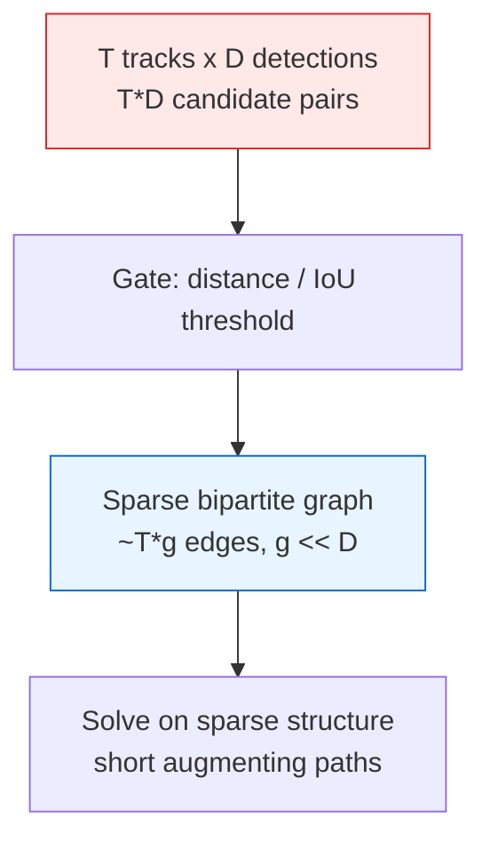

# Hungarian Algorithm (Kuhn-Munkres) — Senior Level

> A 200×200 assignment solves in a millisecond — but the moment the Hungarian algorithm becomes the per-frame data-association step in a multi-object tracker, the per-tick scheduler in a dispatch service, or the inner loop of a branch-and-bound optimizer, every property (cubic time, quadratic memory, square-matrix requirement, exact-only output, full re-solve on any change) turns into a latency-budget and capacity-planning concern.

## Table of Contents
1. [Introduction](#1-introduction)
2. [System Design with Assignment Solvers](#2-system-design-with-assignment-solvers)
3. [Rectangular and Sparse Cost Matrices at Scale](#3-rectangular-and-sparse-cost-matrices-at-scale)
4. [Concurrency and Parallelism](#4-concurrency-and-parallelism)
5. [Comparison at Scale](#5-comparison-at-scale)
6. [Architecture Patterns](#6-architecture-patterns)
7. [Code Examples](#7-code-examples)
8. [Observability](#8-observability)
9. [Failure Modes](#9-failure-modes)
10. [Capacity Planning](#10-capacity-planning)
11. [Summary](#11-summary)

---

## 1. Introduction

At the senior level the question is no longer "how does the `δ`-relaxation work" but "where does an exact assignment solver belong in my system, and what breaks when it does?" The Hungarian algorithm produces an *optimal* one-to-one matching in `O(n³)` time over an `O(n²)` cost matrix. That description alone tells you three things:

- It is a **synchronous, per-batch** computation — you call it, block, and get an answer.
- Its input is an **`O(n²)` cost matrix** that you must *build* (often the dominant cost) before solving.
- Any change to the inputs forces a **full re-solve** — there is no cheap incremental update.

The interesting senior decisions are therefore architectural:

1. Is exact optimality worth the cubic cost here, or does an approximate matcher meet the SLA?
2. How do you build the cost matrix cheaply when most pairs are irrelevant (gating/sparsity)?
3. How do you handle the real input, which is almost always **rectangular** (tracks ≠ detections, drivers ≠ riders)?
4. How do you keep a per-frame/per-tick solver inside its latency budget as `n` grows?
5. How do you observe, bound, and degrade gracefully when an occasional huge batch arrives?

The canonical senior context is **multi-object tracking**: every video frame, associate existing tracks to new detections by an optimal assignment. The solver runs 30–60 times per second, the matrix is rebuilt each frame from detector outputs, and a missed deadline drops a frame. Everything below is framed by that kind of hot-loop deployment.

---

## 2. System Design with Assignment Solvers

### 2.1 Exact vs approximate

```mermaid
flowchart LR
    A[Greedy / nearest<br/>O(n^2) or less<br/>fast, suboptimal] --> B[Auction algorithm<br/>O(n^2 log n / eps)<br/>near-optimal, tunable] --> C[Hungarian<br/>O(n^3) exact<br/>provably optimal]
    style A fill:#e8f4ff,stroke:#0366d6
    style B fill:#fff4e8,stroke:#d97706
    style C fill:#ffe8e8,stroke:#dc2626
```

| Approach | When right | When wrong |
| --- | --- | --- |
| Greedy / nearest-neighbor | Loose objective, very large `n`, real-time floor. | Conflicts cascade into a bad global total; quality matters. |
| Auction / approximate | Large `n`, near-optimal acceptable, tunable `ε`. | You need the *certified* exact optimum. |
| Hungarian (exact) | Balanced/small-`n`, exact optimum required, dense costs. | `n` in tens of thousands; tight real-time floor; capacities. |

The most expensive mistake is reaching for the cubic exact solver on a 10,000×10,000 per-frame matrix when a gated, sparse, or approximate matcher would meet the deadline with quality the downstream pipeline cannot even distinguish.

### 2.1.1 The hidden cost: re-solve on every change

A property easy to overlook until production: the Hungarian algorithm has **no cheap incremental update**. A single changed cost, a new track, or a removed detection generally forces a full re-solve, because one altered edge can ripple through the entire optimal matching. In a per-frame loop this is fine — you rebuild and re-solve anyway. But in a request/response service where inputs trickle in (a marketplace adding one rider at a time), naively re-solving on every arrival is `O(n³)` per event. The mitigations are batching (collect changes over a window, re-solve once), warm-starting duals from the previous solution to shrink the constant, and component-local re-solves (§3.3) so only the affected region pays. Treat "this answer is a full recomputation" as a first-class architectural fact, not a detail.

### 2.2 What the exact solver actually buys you

Exactness buys **a certificate**: the dual potentials prove no assignment is cheaper. In domains where a wrong association is expensive — tracking a missile, matching a payment to an invoice, allocating an organ donor — that guarantee justifies the cubic cost. In domains where "good enough, fast" wins — game AI pathing, low-stakes ad matching — the certificate is worthless and the cubic cost is pure waste. The senior call is naming, explicitly, which regime you are in.

### 2.3 Anatomy of an assignment step in a pipeline

A production assignment step is three decoupled stages, each with its own cost and failure profile:

1. **Cost construction.** Turn raw inputs (track states, detections; driver positions, ride requests) into the `cost[i][j]` matrix. This is frequently the *dominant* cost: computing `n²` pairwise distances, IoUs, or descriptor differences can exceed the `O(n³)` solve when the per-pair cost is expensive. Gating (§3) prunes it.
2. **Solve.** Run the Hungarian algorithm on the (square, possibly padded) matrix. `O(n³)`, deterministic, blocking.
3. **Post-process.** Reject assignments whose cost exceeds a gate threshold (a "match" that is too expensive is really *no match*), spawn/retire unmatched items, and emit the result.

```mermaid
flowchart LR
    R[Raw inputs<br/>tracks + detections] -->|gating + features| C[Cost construction<br/>n x n matrix, O(n^2) pairs]
    C -->|pad to square| H[Hungarian solve<br/>O(n^3), blocking]
    H -->|matching + duals| P[Post-process<br/>gate rejects, spawn/retire]
    P --> O[Associations out]
```

The architectural lesson: **the solver is rarely the whole cost.** Cost construction and post-processing often dominate, so optimizing only the `O(n³)` solve while ignoring `O(n²)` feature computation is a classic misallocation. Profile the whole step.

---

## 3. Rectangular and Sparse Cost Matrices at Scale

### 3.1 The rectangular reality

Real assignment inputs are almost never square. A tracker has `T` tracks and `D` detections with `T ≠ D`; a dispatcher has `R` drivers and `K` requests. Two standard handlings:

- **Pad to square** `n = max(T, D)` with dummy rows/columns of cost `0` (or a "no-match" gate cost). Simple, but you pay `O(max(T,D)³)` even when one side is tiny.
- **Rectangular augmenting form.** The row-by-row potentials template naturally processes the *smaller* side: with `T ≤ D`, cost is `O(T² · D)` — far cheaper when `T ≪ D`. Prefer this when the sides are very unbalanced (10 tracks, 500 detections).

Always decide the **semantics of "unmatched"** first: a track with no good detection should *stay unmatched* (coasting), not be force-paired with a dummy that then looks like a real association. Encode that with a **gate cost** — a finite threshold above which a pairing is rejected in post-processing.

### 3.2 Sparsity and gating

Most pairs are impossible: a track on the left of the frame cannot match a detection on the right. **Gating** prunes these before building the matrix — only pairs within a distance/IoU threshold get a finite cost; the rest are forbidden. This shrinks the effective problem dramatically:

- Cost construction drops from `O(T·D)` dense to `O(T·g)` where `g` is the average gated candidates per track.
- The solve can run on the gated bipartite graph; with few candidates per row, augmenting paths are short.



The senior tradeoff: gating too tightly drops valid matches (a fast-moving object leaves the gate); gating too loosely keeps the matrix dense and slow. Tune the gate to the dynamics, and instrument the fraction of rejected-by-gate associations as a quality signal.

### 3.3 Block-diagonal decomposition

If gating splits the bipartite graph into **connected components**, each component is an *independent* assignment subproblem. Solving the components separately turns one `O(n³)` solve into several `O(n_c³)` solves with `Σ n_c = n` — and `Σ n_c³ ≪ (Σ n_c)³`. A union-find over the gated edges finds the components in near-linear time. This is the single biggest practical speedup for sparse trackers: a crowded scene that *looks* like a 500×500 problem is often a dozen near-independent 40×40 problems.

---

## 4. Concurrency and Parallelism

### 4.1 What parallelizes

The `O(n³)` Hungarian core is **inherently sequential** across its outer loop — each row's augmentation depends on the potentials left by previous rows. You cannot trivially parallelize the augmenting-path search. What *does* parallelize:

- **Cost construction.** The `O(n²)` pairwise costs are embarrassingly parallel — compute the matrix across all cores or on a GPU. Since this often dominates, parallelizing it is the highest-leverage win.
- **Independent components** (§3.3). Block-diagonal subproblems solve concurrently, one per worker thread.
- **Multiple independent batches.** A tracker processing several camera streams runs one solver per stream in parallel; the solver itself stays single-threaded.

### 4.2 What does not parallelize

The inner augmenting-path / potential-update loop. Research GPU/SIMD Hungarian implementations exist (e.g. parallelizing the `minv[]` slack scan and the `δ` reduction), giving constant-factor speedups for large dense `n`, but they are complex and rarely worth it below `n ≈ 1000`. For the common small-to-medium hot loop, **parallelize the matrix build, keep the solve serial, and decompose by component.**

### 4.2.1 GPU cost construction in practice

When the cost is a pairwise feature distance — descriptor differences, IoUs, Mahalanobis distances under a Kalman filter — the `O(n²)` build is a dense matrix-of-distances computation that maps perfectly onto a GPU: one thread per `(i, j)` cell. For a tracker already running its detector on the GPU, building the cost matrix there avoids a round-trip to host memory, and the only data crossing back to the CPU is the (small) matrix itself for the serial solve. The senior tradeoff is the transfer: a `1000×1000` `float32` matrix is 4 MB per frame, cheap; but at 60 fps that is 240 MB/s of PCIe traffic, non-trivial if several streams share the bus. Gating helps here too — a sparse cost representation transfers only the gated cells. The rule: parallelize where the work is (`O(n²)` build on GPU), keep the inherently serial `O(n³)` solve on the CPU, and minimize what crosses between them.

### 4.3 Serving concurrency

In a request/response assignment service (e.g. a dispatch microservice), the solver is a pure function: given a matrix, return a matching. Run a pool of stateless solver workers; each handles one request end-to-end on its own thread. No shared mutable state means lock-free scaling on QPS, bounded only by CPU. Size the pool to cores and cap per-request `n` to keep tail latency bounded (a single huge batch must not monopolize a worker — see §9.5).

---

## 5. Comparison at Scale

| Approach | Build | Solve | Update | Memory | When |
| --- | --- | --- | --- | --- | --- |
| Hungarian (dense) | `O(n²)` cost matrix | `O(n³)` | full re-solve | `O(n²)` | Balanced, small/medium, exact. |
| Hungarian (gated + components) | `O(n·g)` | `Σ O(n_c³)` | full re-solve | `O(n·g)` | Sparse, real-time trackers. |
| Auction algorithm | `O(n²)` | `O(n² log n /ε)`-ish | warm-startable | `O(n²)` | Large `n`, near-optimal OK. |
| Min-cost max-flow | `O(E)` graph | `O(V E log V)`+ | re-solve | `O(V+E)` | Capacities, unbalanced supply. |
| Greedy / nearest | `O(n·g)` | `O(E log E)` | trivial | `O(n·g)` | Real-time floor, loose quality. |

The Hungarian algorithm wins decisively in the **balanced, exact, small-to-medium, dense** regime. Above a few thousand items, or under a hard real-time floor, gating + component decomposition keeps it viable; past that, auction/approximate methods or a flow model take over.

### 5.1 Reading the regime boundary in practice

The decision is a function of four numbers: `n`, the average gated degree `g`, the per-pair cost-construction time, and the latency budget. A useful sequence: (1) gate aggressively and measure `g` — if `g` stays small, the effective problem is sparse and component decomposition likely keeps you in the millisecond range regardless of nominal `n`; (2) if components stay large and `n` is in the thousands with a tight per-frame budget, the cubic solve is the bottleneck — switch to auction/approximate and measure whether downstream quality even changes; (3) if capacities or unbalanced supply appear, the problem is no longer assignment — model it as min-cost flow. The overriding axis is the **budget**: a 16 ms per-frame floor at 60 fps simply does not admit an unbounded cubic solve, so the architecture must cap or approximate, not hope `n` stays small.

---

## 6. Architecture Patterns

### 6.1 Build-gate-solve-gate

The standard tracker/dispatch loop: build a gated cost matrix, solve exactly on the (small) gated problem, then gate the *output* — reject any matched pair whose cost exceeds the no-match threshold, treating it as unmatched. The two gates (input pruning, output rejection) are what make an exact solver practical in real time: the input gate keeps `n` effective small; the output gate keeps the exact optimum from forcing nonsensical pairings just because the math allowed them.

### 6.2 Warm-starting and incrementality

The Hungarian algorithm has no clean incremental update, but in a frame-to-frame loop the *previous* matching is a strong hint. Two practical tactics: (1) seed the dual potentials from the previous frame so the first augmentations are cheap when the scene barely changed; (2) only re-solve components that *changed* (a track entered/left a component) and reuse last frame's answer for untouched components. Neither is asymptotically better, but both cut the constant dramatically in the common "small delta per frame" case. When the scene churns heavily, fall back to a cold full solve.

### 6.3 Tiered solving (fast path / exact path)

Run a cheap greedy matcher first. If its result is "obviously good" (every match well inside its gate, no contested pairs), accept it and skip the exact solve. Only when greedy produces *conflicts* (two tracks contend for one detection) do you invoke the Hungarian algorithm — and often only on the conflicted sub-component. This bounds the expensive path to the genuinely ambiguous cases, which in calm scenes is rare. The pattern trades a little worst-case latency for a much better average case, and is widely used in real-time trackers.

### 6.4 Cascade matching (the DeepSORT pattern)

Production trackers rarely solve one flat assignment. They run a **cascade**: match high-confidence/recently-seen tracks first, then progressively match older or lower-confidence tracks against the *remaining* detections. Each stage is its own (smaller) assignment problem on the leftovers of the previous stage. The rationale is that a track seen one frame ago should claim its detection before a track that has been coasting for ten frames competes for it — solving one big assignment would let a stale track "steal" a detection from a fresh one if the raw costs happened to favor it. The cascade encodes a *priority* the flat objective cannot express. Architecturally this means the assignment solver is invoked several times per frame on shrinking matrices, which is *cheaper* than one big solve (smaller `n³` per stage) and also higher quality for the tracking objective — a rare win-win that falls out of respecting domain priorities rather than trusting the global optimum blindly.

### 6.5 Service decomposition

```
   inputs        +------------------+      +---------------+      +-----------+
  (tracks,  ---> | cost builder     |----> | Hungarian     |----> | gate +    |
 detections)     | (parallel, GPU)  |      | solver pool   |      | emit      |
                 +------------------+      | (stateless)   |      +-----------+
                                           +---------------+
```

Separate cost construction (parallel, possibly GPU) from the stateless solver pool. The matrix is the contract between them; the solver pool scales on QPS independent of how the matrix is built. Cap per-request `n` and time-box the solve.

---

## 7. Code Examples

### 7.1 Go — gated, component-decomposed assignment driver

```go
package main

import "fmt"

const INF = 1 << 60

// gatedAssign builds a gated cost matrix, splits into connected components,
// and solves each independently. tracks x detections, gate = max allowed cost.
func gatedAssign(cost [][]int, gate int) []int {
	T, D := len(cost), len(cost[0])
	// Union-find over gated edges to find components.
	parent := make([]int, T+D)
	for i := range parent {
		parent[i] = i
	}
	var find func(int) int
	find = func(x int) int {
		for parent[x] != x {
			parent[x] = parent[parent[x]]
			x = parent[x]
		}
		return x
	}
	union := func(a, b int) { parent[find(a)] = find(b) }

	for i := 0; i < T; i++ {
		for j := 0; j < D; j++ {
			if cost[i][j] <= gate {
				union(i, T+j) // detection nodes offset by T
			}
		}
	}

	assign := make([]int, T)
	for i := range assign {
		assign[i] = -1 // unmatched (coasting)
	}
	// Group rows by component, solve each padded square subproblem.
	comp := map[int][]int{}
	for i := 0; i < T; i++ {
		comp[find(i)] = append(comp[find(i)], i)
	}
	for _, rows := range comp {
		colsSet := map[int]bool{}
		for _, i := range rows {
			for j := 0; j < D; j++ {
				if cost[i][j] <= gate {
					colsSet[j] = true
				}
			}
		}
		cols := []int{}
		for j := range colsSet {
			cols = append(cols, j)
		}
		if len(rows) == 0 || len(cols) == 0 {
			continue
		}
		sub := buildSquare(cost, rows, cols, gate)
		_, m := hungarian(sub) // m[localCol] = localRow
		for lc, lr := range m {
			if lc < len(cols) && lr < len(rows) {
				if cost[rows[lr]][cols[lc]] <= gate {
					assign[rows[lr]] = cols[lc]
				}
			}
		}
	}
	return assign
}

func buildSquare(cost [][]int, rows, cols []int, gate int) [][]int {
	n := len(rows)
	if len(cols) > n {
		n = len(cols)
	}
	sub := make([][]int, n)
	for i := 0; i < n; i++ {
		sub[i] = make([]int, n)
		for j := 0; j < n; j++ {
			if i < len(rows) && j < len(cols) && cost[rows[i]][cols[j]] <= gate {
				sub[i][j] = cost[rows[i]][cols[j]]
			} else {
				sub[i][j] = gate + 1 // pad / forbidden
			}
		}
	}
	return sub
}

// hungarian: see junior.md (returns total, assignment[col]=row).
func hungarian(cost [][]int) (int, []int) { /* ... as in junior.md ... */ return 0, nil }

func main() {
	cost := [][]int{
		{4, 99, 99},
		{99, 2, 99},
		{99, 99, 7},
	}
	fmt.Println(gatedAssign(cost, 50)) // each track matched within its gate
}
```

### 7.2 Java — stateless solver worker with a time/size cap

```java
import java.util.*;
import java.util.concurrent.*;

public final class AssignmentService {
    static final int INF = Integer.MAX_VALUE / 2;
    static final int MAX_N = 1500; // refuse oversized batches

    // Submit a matrix; returns the assignment or throws if too big.
    static int[] assign(int[][] cost) {
        int n = cost.length;
        if (n > MAX_N) throw new IllegalArgumentException("batch too large: " + n);
        int[] out = new int[n];
        solve(cost, out);           // solve(): see middle.md HungarianDual
        return out;
    }

    static void solve(int[][] cost, int[] assignOut) { /* ... middle.md ... */ }

    public static void main(String[] args) throws Exception {
        ExecutorService pool = Executors.newFixedThreadPool(
            Runtime.getRuntime().availableProcessors());
        int[][] m = {{9, 11, 14}, {6, 15, 13}, {12, 13, 6}};
        Future<int[]> f = pool.submit(() -> assign(m));
        // time-box the solve so one huge batch can't stall a worker forever.
        try {
            System.out.println(Arrays.toString(f.get(50, TimeUnit.MILLISECONDS)));
        } catch (TimeoutException te) {
            f.cancel(true);
            System.out.println("solve exceeded budget; fell back to greedy");
        }
        pool.shutdown();
    }
}
```

### 7.3 Python — production via SciPy with rectangular + gating

```python
import numpy as np
from scipy.optimize import linear_sum_assignment


def associate(cost, gate):
    """cost: (T, D) array, gate: max allowed pairing cost.
    Returns dict track_idx -> detection_idx for accepted matches only."""
    cost = np.asarray(cost, dtype=float)
    # Forbid gated-out pairs with a large finite cost (keeps it solvable).
    big = gate * 10 + cost[np.isfinite(cost)].max(initial=0) + 1
    work = np.where(cost <= gate, cost, big)

    # linear_sum_assignment handles rectangular matrices directly.
    rows, cols = linear_sum_assignment(work)

    matches = {}
    for r, c in zip(rows, cols):
        if cost[r, c] <= gate:        # output gate: reject too-expensive matches
            matches[int(r)] = int(c)
    return matches


if __name__ == "__main__":
    # 3 tracks, 4 detections (rectangular) — one track will coast.
    cost = [
        [2,   90,  90,  90],
        [90,  3,   90,  90],
        [90,  90,  90,  90],   # this track has no detection within gate
    ]
    print(associate(cost, gate=50))  # {0: 0, 1: 1}  (track 2 unmatched)
```

SciPy's `linear_sum_assignment` is a tuned C implementation of the Jonker-Volgenant / Hungarian family, handles rectangular matrices natively, and is the right default in Python — only hand-roll the solver when you need the dual potentials or a custom sparse representation.

---

## 8. Observability

A per-frame/per-request solver is invisible until it blows its latency budget or starts emitting bad associations. Wire these from day one.

| Metric | Type | Why |
| --- | --- | --- |
| `assign_solve_duration_seconds` | histogram | Cubic growth surfaces here; alert on p99 vs budget. |
| `assign_matrix_n` | histogram | The driver of `n³`; track the distribution, not just the mean. |
| `assign_cost_build_duration_seconds` | histogram | Often dominates the solve; profile the whole step. |
| `assign_gated_degree_avg` | gauge | Sparsity health; a rising degree means the gate is loosening. |
| `assign_components_count` | gauge | Decomposition effectiveness; few large components = slow. |
| `assign_unmatched_ratio` | gauge | Quality: too many coasting tracks signals gate or detector trouble. |
| `assign_gate_reject_ratio` | gauge | Fraction of optimal matches rejected by the output gate. |
| `assign_fallback_total{reason}` | counter | Timeouts/oversize batches that hit the approximate path. |

The most useful single signal is `assign_solve_duration_seconds` p99 versus the frame/request budget — it catches the slow-batch tail that a mean hides. Pair it with `assign_matrix_n`'s p99 to attribute slow solves to genuinely large batches versus pathological inputs.

### 8.0 What "slow" looks like before it's a timeout

Because the dense solve is a fixed `Θ(n³)` march with no early exit, a *latency regression* shows up as a gradual rightward creep of the `assign_solve_duration_seconds` histogram long before any single request times out. The leading indicator is usually not the solver at all but `assign_matrix_n` and `assign_gated_degree_avg` drifting up — a detector that started returning more boxes, or a gate that loosened after a config change, silently grows the effective problem. Wire an alert on the *product* trend (`n` × degree), not just p99 latency, so you catch the cause (input growth) before the symptom (budget overrun). Pair it with `assign_components_count`: if components collapse from "many small" to "few large," decomposition stopped helping and the cubic term is about to dominate — a different remediation (re-tune the gate) than "the solver got slow."

### 8.1 Quality observability

Latency is only half the story; an assignment can be *fast and wrong*. Track `assign_unmatched_ratio` and `assign_gate_reject_ratio` as quality canaries: a sudden spike means the detector degraded, the gate drifted, or the scene changed character — all of which silently corrupt downstream tracking without throwing any error. For high-stakes domains, periodically re-solve a sampled batch exactly and compare to the production (possibly approximate) matcher, logging the optimality gap as `assign_optimality_gap_ratio`. A gap creeping above tolerance is the signal to retune the approximation or fall back to exact.

---

## 9. Failure Modes

### 9.1 Non-square / unbalanced input
Forgetting that real input is rectangular leads to index errors or silent wrong matchings. Always pad to square *or* use the rectangular form, and define unmatched semantics explicitly (coast, do not force-pair with a dummy).

### 9.2 Integer overflow in potentials
`INF = MaxInt` plus a cost overflows during `δ`-updates, fabricating a cheap phantom assignment. Standardize on `INF = MaxInt/2` and add an invariant test (`sum(u)+sum(v) == total`).

### 9.3 Latency-budget blowout
`n` creeps up, `n³` overruns the per-frame budget, frames drop. Mitigations: gate harder, decompose into components, cap per-request `n`, time-box and fall back to greedy/auction.

### 9.4 Float-cost tightness flakiness
Floating-point cost equality makes "tight edge" tests non-deterministic, occasionally producing different (still-optimal-cost but different-pairing) results run-to-run. Scale floats to integers, or use an epsilon — and never assume the *specific* matching is reproducible, only its cost.

### 9.5 One huge batch starves the pool
A pathological scene produces a 5000×5000 matrix; one solver worker spends seconds on it while requests queue. Cap `n`, run oversized batches on a separate slow-lane pool, and time-box with a greedy fallback so the fast lane stays responsive.

### 9.6 Forced bad matches from missing output gate
Without an output gate, the exact optimum *will* pair a track to a far-away detection if that is the cheapest *complete* matching — producing a teleporting track. Always reject matched pairs above the no-match threshold in post-processing; the math optimizes the sum, not physical plausibility.

### 9.7 Stale or inconsistent cost construction
If the cost matrix mixes inputs from two different time steps (some detections from frame `t`, some from `t-1` due to a race), the optimal matching is for a world that never existed. Build the matrix from a single consistent snapshot of inputs; record the snapshot/frame id alongside the result.

### 9.7.1 Gate drift over time
A gate radius tuned for one deployment slowly becomes wrong as the world changes — a camera moves, object speeds shift, detector confidence recalibrates. Too-tight gates silently drop valid matches (tracks fragment); too-loose gates re-densify the matrix and blow the latency budget. The failure is gradual and invisible without instrumentation: track these as `assign_gated_degree_avg` (rising = loosening) and `assign_unmatched_ratio` (rising = over-tight or detector degraded), and treat a sustained drift as a retune trigger, not an incident. Gate parameters are configuration, not constants; budget for revisiting them.

### 9.8 Assuming uniqueness
Multiple distinct assignments can share the optimal cost. Code that assumes a unique answer (e.g. caching "the" matching) breaks when ties resolve differently. Treat the cost as the contract and the specific pairing as one valid witness.

---

## 10. Capacity Planning

### 10.1 Time wall
- Compiled, single core: `n = 100` in ~1 ms, `n = 500` in ~50–100 ms, `n = 1000` in ~0.5–1 s, `n = 2000` in ~5–10 s.
- At 30 fps the per-frame budget is ~33 ms, at 60 fps ~16 ms. That caps the *dense* `n` at roughly a few hundred before you must gate, decompose, or approximate.
- Component decomposition is the multiplier: a 500-item scene that splits into a dozen ~40-item components solves in roughly `12 × 40³ ≈ 7.7×10⁵` ops instead of `500³ = 1.25×10⁸` — over 100× faster.

### 10.2 Memory wall
- Dense `int32` matrix: `4·n²` bytes. `n = 1000` → 4 MB; `n = 5000` → 100 MB; `n = 10000` → 400 MB.
- The solver's own working arrays (`u`, `v`, `p`, `way`, `minv`, `used`) are `O(n)` — negligible. The matrix dominates.
- Sparse/gated representation cuts this to `O(n·g)`, often orders of magnitude less, and is mandatory once `n` reaches the thousands.

### 10.3 The n³ time table (the number to memorize)

| n | `n³` ops | Dense solve (compiled, ~10⁹ ops/s) | `int32` matrix (`4n²`) |
| --- | --- | --- | --- |
| 100 | 10⁶ | ~1 ms | 40 KB |
| 250 | 1.6 × 10⁷ | ~16 ms | 250 KB |
| 500 | 1.25 × 10⁸ | ~80 ms | 1 MB |
| 1,000 | 10⁹ | ~0.7 s | 4 MB |
| 2,000 | 8 × 10⁹ | ~6 s | 16 MB |
| 5,000 | 1.25 × 10¹¹ | minutes | 100 MB |

The lesson: **time is the wall you hit first**, not memory. A 1000-item matrix is only 4 MB but already takes most of a second to solve exactly — far past a real-time frame budget. This is why production trackers live or die on gating and decomposition (§3), not on raw solver speed.

### 10.4 Sizing example
A 30 fps tracker averages 40 tracks and 60 detections per frame, well-separated into ~5 components of ≤ 20 items. Per frame: cost build `O(40·60) = 2400` gated pairs, solve `Σ 20³ ≈ 4×10⁴` ops — sub-millisecond total, comfortably inside the 33 ms budget with room for the detector. Hungarian (exact) is the right call: tiny, exact, certifiable.

A cautionary second sizing: a marketplace wants to match 8,000 drivers to 8,000 riders every 2 seconds, dense (every driver could in principle reach every rider). Dense Hungarian is `8000³ ≈ 5×10¹¹` ops — minutes, far past the 2 s budget. The senior call: gate by geography (a driver only matches nearby riders), which both sparsifies and decomposes the problem into per-region subproblems, *and* consider whether near-optimal (auction) suffices, since a marketplace rarely needs a *certified* optimum.

### 10.4.1 A decision checklist for the cost-construction budget

Cost construction is the stage seniors most often under-budget, because it scales with the *expense per pair*, not just `n`. Walk this checklist before assuming the `O(n³)` solve is the bottleneck:

- **How expensive is one `cost[i][j]`?** A subtraction is free; a 256-d descriptor distance or a Kalman-gated Mahalanobis distance is not. At `n = 500` that is 250,000 such evaluations per frame.
- **Can pairs be pruned before evaluation?** Gating by a cheap proxy (bounding-box overlap, coarse grid bucket) avoids computing the expensive feature distance for pairs that are obviously incompatible.
- **Is the build parallelizable / GPU-able?** Pairwise distances are embarrassingly parallel (§4.2.1); if the detector is already on the GPU, build there.
- **What crosses the CPU/GPU boundary?** Only the (small) matrix needs to return for the serial solve; keep raw features on-device.
- **Does the build dominate the solve?** Profile both. If build ≫ solve, optimizing the solver is wasted effort — attack the build (gating, parallelism, cheaper features) instead.

The recurring senior mistake is benchmarking the Hungarian solver in isolation, declaring it "fast enough," and shipping a pipeline that misses its deadline because the matrix build — never measured — was three times slower than the solve.

### 10.5 When to leave the exact Hungarian solver
Move to gating+decomposition, an auction/approximate method, or a min-cost-flow model when any holds:
- `n` (after gating) exceeds a few thousand and the dense solve overruns the budget.
- The problem has capacities or unbalanced supply/demand (it is transportation, not assignment).
- A near-optimal answer is acceptable and `n` is large.
- The matrix cannot be built cheaply enough for the per-tick deadline.

---

## 11. Summary

- The Hungarian algorithm is a **synchronous, per-batch** exact solver producing a certified-optimal matching in `O(n³)` over an `O(n²)` cost matrix; treat it as a hot-loop subroutine, not a service in itself.
- **Cost construction often dominates** the solve — parallelize it (CPU/GPU) and profile the whole build-solve-post-process step.
- Real input is **rectangular and sparse**: pad-to-square or use the rectangular form; **gate** to prune impossible pairs; **decompose into connected components** for the biggest practical speedup.
- The solve core is **sequential**; parallelize cost construction, independent components, and independent batches instead.
- Bound the hot loop: **cap `n`**, **time-box** the solve, and **fall back** to greedy/auction when the exact path would miss the deadline.
- Always apply an **output gate** — the exact optimum will force physically implausible pairings if the math allows; reject too-expensive matches as "unmatched."
- Watch the **time wall** (`O(n³)`) before the memory wall (`O(n²)`); both push you to gating/decomposition or approximate methods above a few thousand items.
- Track **quality** (`unmatched_ratio`, `gate_reject_ratio`, optimality gap), not just latency — a fast-but-wrong assignment fails silently.

### Operational checklist before shipping an assignment step

- **Decide exact vs approximate** explicitly per domain — does this use case need the certificate, or just "good and fast"?
- **Gate the input** to keep `n` effective small, and **gate the output** to reject implausible forced matches.
- **Handle rectangular input** with defined unmatched semantics; never silently force-pair with dummies.
- **Decompose by connected component** — the single biggest real-world speedup for sparse problems.
- **Cap and time-box** the solve; route oversized batches to a slow lane with a greedy fallback.
- **Build from a consistent snapshot**; record the frame/snapshot id with each result.
- **Instrument quality**, not just latency; alert on unmatched/reject ratios and optimality gap.
- **Plan the exit:** know the `n` (post-gating) at which you migrate to auction/approximate or a flow model.
- **Budget the matrix build, not just the solve:** the cost-construction stage often dominates and is the one teams forget to measure (§10.4.1).

References to study further: Jonker-Volgenant (a faster sparse assignment variant, the basis of SciPy's solver), auction algorithms (Bertsekas) for the large-`n` near-optimal regime, the DeepSORT cascade-matching pattern for real-time tracking, and the min-cost-flow formulation (see [21-min-cost-max-flow](../21-min-cost-max-flow/senior.md)) for capacitated/unbalanced problems.

---

## Next step:

Continue to [**professional.md**](./professional.md) for the formal primal-dual correctness proof, complementary slackness, the `O(n³)` complexity argument, the LP-duality view, and the connection to König's theorem and total unimodularity.
