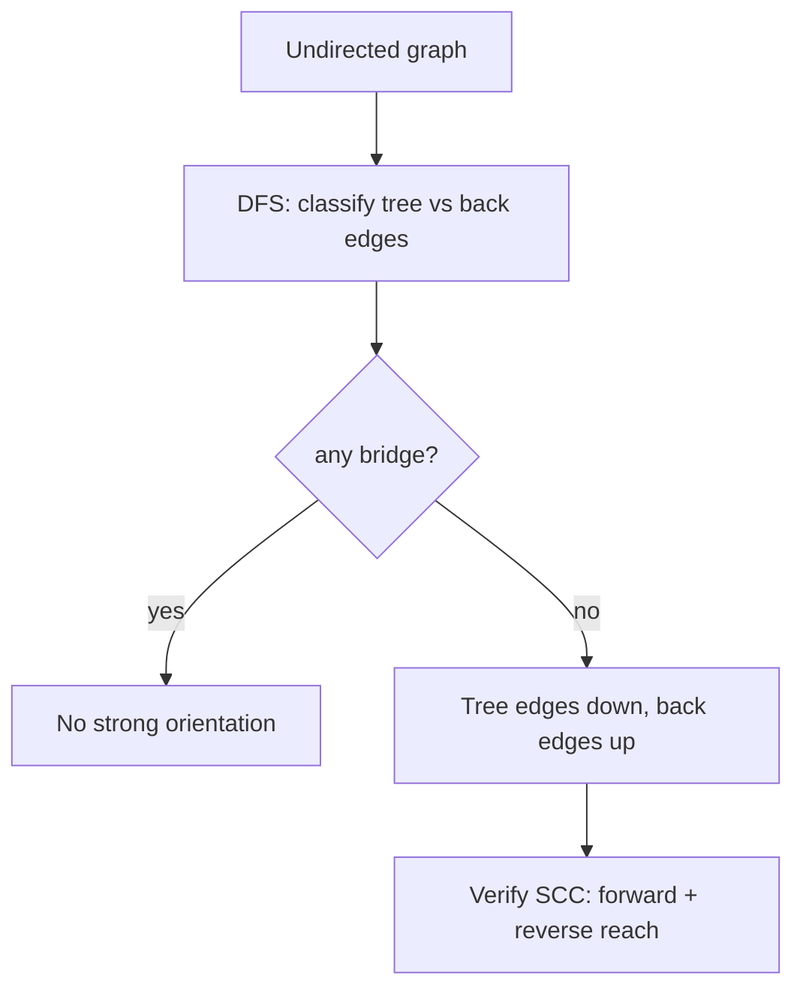

# Strong Orientation (Robbins' Theorem) — Junior Level

> **One-line summary:** A *strong orientation* assigns a direction to every undirected edge so that the resulting directed graph is *strongly connected* (everyone can reach everyone). **Robbins' Theorem** says a connected undirected graph admits a strong orientation **if and only if** it is *2-edge-connected* — i.e. it has **no bridges**. The construction is a single DFS: orient tree edges "down" (away from the root) and back edges "up" (toward the ancestor).

---

## Table of Contents

1. [Introduction](#introduction)
2. [Prerequisites](#prerequisites)
3. [Glossary](#glossary)
4. [Core Concepts](#core-concepts)
5. [Big-O Summary](#big-o-summary)
6. [Real-World Analogies](#real-world-analogies)
7. [Pros & Cons](#pros--cons)
8. [Step-by-Step Walkthrough](#step-by-step-walkthrough)
9. [Code Examples](#code-examples)
10. [Coding Patterns](#coding-patterns)
11. [Error Handling](#error-handling)
12. [Performance Tips](#performance-tips)
13. [Best Practices](#best-practices)
14. [Edge Cases & Pitfalls](#edge-cases--pitfalls)
15. [Common Mistakes](#common-mistakes)
16. [Cheat Sheet](#cheat-sheet)
17. [Visual Animation](#visual-animation)
18. [Summary](#summary)
19. [Further Reading](#further-reading)

---

## Introduction

Imagine a city planner who wants to convert every two-way street into a **one-way** street. The goal: even after all the streets become one-way, you should still be able to drive from **any** intersection to **any other** intersection. The question is — *is that always possible*, and *if so, which direction do we pick for each street?*

This is the **strong orientation** problem, and the answer was given by **Herbert Robbins in 1939** in a short, beautiful paper. **Robbins' Theorem** states:

> A connected undirected graph can be oriented (every edge given a one-way direction) so that the result is **strongly connected** if and only if the graph has **no bridges** — that is, it is **2-edge-connected**.

A **bridge** is an edge whose removal disconnects the graph. The intuition is immediate: if a street is the *only* connection between two halves of the city, and you make it one-way, then traffic on the wrong side can never get back. No matter what you do with a bridge, one direction is forever cut off — so a bridge is a hard obstruction to a strong orientation.

The surprise of Robbins' Theorem is the *converse*: as long as there are **no** bridges, a strong orientation **always** exists, and we can find it with a single **depth-first search (DFS)**. The recipe is wonderfully simple:

1. Run a DFS from any starting vertex.
2. Each **tree edge** (an edge DFS used to discover a new vertex) is oriented **downward**, in the direction the DFS traversed it — from parent to child, away from the root.
3. Each **back edge** (an edge that points back to an already-visited ancestor) is oriented **upward**, toward that ancestor.

That's it. Tree edges flow down, back edges flow up, and — when no bridge exists — every vertex can both descend toward the leaves and climb back to the root, which makes the whole graph strongly connected.

This topic ties directly to bridge detection, covered in the sibling topic **11-articulation-points-bridges**. If you can find bridges, you can test the precondition of Robbins' Theorem; if there are none, the DFS orientation just works.

---

## Prerequisites

Before reading this file you should be comfortable with:

- **Undirected and directed graphs** — vertices, edges, adjacency lists.
- **Depth-first search (DFS)** — the recursive traversal, the call stack, "visited" marking. See sibling **03-dfs**.
- **The notion of connectivity** — when is a graph "all one piece"?
- **Tree edges vs back edges** — the classification DFS produces on an undirected graph.
- **Recursion and the implicit call stack** — orientation is done during the DFS recursion.
- **Big-O notation** — `O(V + E)` for a linear graph pass.

Optional but helpful:

- A first look at **bridges and articulation points** (sibling **11-articulation-points-bridges**).
- The idea of **strongly connected components** (sibling **08-tarjan-scc**) — we use an SCC check to *verify* our orientation.

---

## Glossary

| Term | Meaning |
|------|---------|
| **Orientation** | An assignment of a direction to every undirected edge, turning the graph into a directed graph (digraph). |
| **Strong orientation** | An orientation whose result is *strongly connected*. |
| **Strongly connected** | In a directed graph, every vertex can reach every other vertex by following edge directions. |
| **Bridge (cut edge)** | An edge whose removal increases the number of connected components — the only link between two parts. |
| **2-edge-connected** | A connected graph that stays connected after removing any single edge; equivalently, a bridgeless graph. |
| **Tree edge** | A DFS edge that discovers a previously unvisited vertex (parent → child). |
| **Back edge** | A non-tree edge from a vertex to one of its DFS *ancestors*. |
| **Robbins' Theorem** | A connected graph has a strong orientation ⟺ it is bridgeless (2-edge-connected). |
| **DFS tree** | The spanning tree formed by the tree edges of a DFS. |
| **Mixed graph** | A graph where some edges are already directed and others are undirected; we orient only the undirected ones. |
| **Multigraph** | A graph allowing multiple parallel edges between the same pair of vertices. |
| **SCC** | Strongly Connected Component — a maximal set of mutually reachable vertices. |

---

## Core Concepts

### 1. What an orientation is

Start with an **undirected** edge `{u, v}`. To *orient* it, you pick one of the two arrows: `u → v` or `v → u`. Do this for **every** edge and you get a directed graph. There are `2^E` possible orientations of a graph with `E` edges — most of them are *not* strongly connected. Strong orientation asks for one that *is*.

### 2. Why a bridge kills strong orientation

Suppose edge `{u, v}` is a **bridge**. Removing it splits the graph into a part `A` containing `u` and a part `B` containing `v`, with no other edge between them. If we orient the bridge as `u → v`, then once you are in `B` you can **never** get back to `A` — the only door is one-way and points the wrong way. If we orient it `v → u`, the symmetric problem dooms `A`. Either way, the result is **not** strongly connected. So:

> **A bridge can never be part of a strong orientation.** If a connected graph has even one bridge, no strong orientation exists.

### 3. Robbins' Theorem — the precondition

```
Connected graph G has a strong orientation
        ⟺
G is 2-edge-connected (has no bridges).
```

The "⟹" direction is the bridge argument above (contrapositive: a bridge ⇒ no strong orientation). The "⟸" direction — *no bridges ⇒ a strong orientation exists* — is the constructive part, proved by the DFS algorithm. The full both-directions proof lives in [`professional.md`](./professional.md).

### 4. The DFS construction

Run DFS from any root `r`. DFS on an undirected graph classifies every edge as either a **tree edge** or a **back edge** (there are no cross or forward edges in undirected DFS).

- **Tree edge** `parent → child`: orient it **down**, the way DFS walked it.
- **Back edge** `descendant → ancestor`: orient it **up**, toward the ancestor.

```
Orient(u):
    visited[u] = true
    for each neighbor v of u via edge e (not yet oriented):
        if not visited[v]:
            orient e as u -> v        # tree edge, downward
            Orient(v)
        else if v is an ancestor of u:
            orient e as u -> v        # back edge, upward
```

**Why it works (intuition):** From the root you can always descend to any vertex along tree edges. To get *back* to the root from a vertex `x`, you climb: if `x` has a back edge to an ancestor `a`, hop up to `a`; otherwise climb is guaranteed because *no bridge* means every tree edge is "covered" by some back edge that reaches above it. The absence of bridges is exactly the guarantee that every subtree has an escape route upward.

### 5. Tree edges vs back edges — getting the classification right

In an undirected graph, each physical edge appears twice in adjacency lists (once for each endpoint). When DFS at `u` looks at edge `{u, v}`:

- If `v` is unvisited → **tree edge**, recurse.
- If `v` is visited *and* `v` is an ancestor (discovered earlier, still on the recursion stack) → **back edge**.
- The reverse traversal of the same edge from `v` later must be **skipped** so you don't orient one edge twice. We track this with an edge id or a "parent edge" guard.

---

## Big-O Summary

| Operation | Time | Space | Notes |
|-----------|------|-------|-------|
| Build adjacency list | **O(V + E)** | O(V + E) | Standard graph setup. |
| Detect bridges (precondition) | **O(V + E)** | O(V) | DFS low-link, see **11-articulation-points-bridges**. |
| DFS strong orientation | **O(V + E)** | O(V) | One DFS pass; recursion stack `O(V)`. |
| Verify strongly connected | **O(V + E)** | O(V) | One forward DFS/BFS + one on the reverse graph (Kosaraju-style). |
| Total pipeline | **O(V + E)** | O(V + E) | Linear in graph size. |

The entire algorithm — check the precondition, orient, verify — is **linear** in the size of the graph. There is no `log` factor anywhere; this is one of the cleanest linear graph algorithms you will meet.

---

## Real-World Analogies

| Concept | Analogy |
|---------|---------|
| Strong orientation | Converting a town's two-way streets to one-way streets while keeping *every* intersection reachable from *every* other. |
| Bridge edge | A single bridge over a river connecting two halves of a city — make it one-way and one bank is stranded. |
| 2-edge-connected | A road network with at least two independent routes between any two regions, so no single road is a choke point. |
| Tree edge down | The "outbound" lanes the survey crew drove as they explored new streets. |
| Back edge up | A shortcut alley that loops you back toward downtown (an ancestor) so you are never trapped. |
| Verifying strong connectivity | A delivery test: start a courier from each depot and confirm they can reach all addresses and return. |

Where the analogy breaks: a real street can be widened into two one-way lanes; in graph orientation each *edge* gets exactly **one** direction — you cannot split it. Parallel streets between the same two intersections (a **multigraph**) are the graph equivalent of two separate roads, and two of those are *not* a bridge.

---

## Pros & Cons

| Pros | Cons |
|------|------|
| Linear `O(V + E)` — as fast as a single DFS. | Only works when the graph is bridgeless; otherwise *no* orientation exists. |
| Constructive: the DFS *builds* a valid orientation, it does not just test feasibility. | The orientation is not unique — many valid ones exist, and the DFS picks one arbitrarily. |
| Tiny code: orientation is a few lines inside an ordinary DFS. | Mixed graphs (some edges pre-directed) need a more complex flow-based test (Boesch–Tindell), not plain DFS. |
| Generalizes cleanly to *2-edge-connected components* for graphs that do have bridges. | You must correctly distinguish tree edges from back edges; getting it wrong silently produces a bad orientation. |
| Verifiable with a cheap SCC check. | Recursion depth `O(V)` can overflow the stack on long path-like graphs; needs an explicit stack for huge inputs. |

**When to use:** one-way street planning, sensor/communication networks that must stay mutually reachable on directed links, any problem of the form "direct every link, keep everyone reachable."

**When NOT to use:** when the graph has bridges (impossible — orient per 2-edge-connected component instead), or when some edges are pre-directed (use the flow-based mixed-graph method).

---

## Step-by-Step Walkthrough

Take this small **bridgeless** graph (a square with one diagonal):

```
    0 ---- 1
    |    / |
    |   /  |
    |  /   |
    2 ---- 3
```

Edges: `{0,1}, {0,2}, {1,2}, {1,3}, {2,3}`. There are no bridges — every edge sits on a cycle.

Run DFS from root `0`. Suppose neighbors are visited in ascending order.

```
Enter 0  (visited: 0)
  edge {0,1}: 1 unvisited  -> TREE  orient 0 -> 1
  Enter 1  (visited: 0,1)
    edge {1,0}: 0 is parent -> skip (already-oriented parent edge)
    edge {1,2}: 2 unvisited -> TREE  orient 1 -> 2
    Enter 2  (visited: 0,1,2)
      edge {2,0}: 0 is ancestor, visited -> BACK  orient 2 -> 0
      edge {2,1}: 1 is parent -> skip
      edge {2,3}: 3 unvisited -> TREE  orient 2 -> 3
      Enter 3  (visited: 0,1,2,3)
        edge {3,1}: 1 is ancestor, visited -> BACK  orient 3 -> 1
        edge {3,2}: 2 is parent -> skip
      Leave 3
    Leave 2
  Leave 1
Leave 0
```

Final orientation:

```
0 -> 1   (tree)
1 -> 2   (tree)
2 -> 3   (tree)
2 -> 0   (back)
3 -> 1   (back)
```

**Check it is strongly connected.** From `0`: `0→1→2→3`, and `2→0`, `3→1` close the loops. Reachability:

- `0 → 1 → 2 → 3` (down the tree), and back up via `2→0` and `3→1`.
- From `3`: `3→1→2→0` and `3→1→2→3`. Everyone reaches everyone. 

Now imagine we *added* a pendant vertex `4` attached only by edge `{3,4}`. That edge is a **bridge**. Orienting `3→4` traps `4` (it can never leave); orienting `4→3` means `4` is unreachable. No strong orientation exists — exactly Robbins' precondition failing.

---

## Code Examples

### Example: DFS Strong Orientation + SCC Verification

The program builds an undirected graph, checks for bridges, orients edges via DFS, and **verifies** the result is strongly connected with a Kosaraju-style two-pass reachability check.

#### Go

```go
package main

import "fmt"

type Edge struct {
	to  int
	id  int // unique id shared by both directions of the same physical edge
}

type Graph struct {
	n     int
	adj   [][]Edge
	m     int          // number of physical edges
	dir   map[int][2]int // edge id -> oriented (from, to)
	disc  []int
	low   []int
	timer int
	bridge bool
}

func NewGraph(n int) *Graph {
	return &Graph{n: n, adj: make([][]Edge, n), dir: map[int][2]int{}}
}

func (g *Graph) AddEdge(u, v int) {
	g.adj[u] = append(g.adj[u], Edge{v, g.m})
	g.adj[v] = append(g.adj[v], Edge{u, g.m})
	g.m++
}

// orientDFS visits u, orienting tree edges down and back edges up.
// parentEdge is the edge id used to enter u (skip it once).
func (g *Graph) orientDFS(u, parentEdge int) {
	g.disc[u] = g.timer
	g.low[u] = g.timer
	g.timer++
	for _, e := range g.adj[u] {
		if e.id == parentEdge {
			continue // don't reuse the edge we came in on
		}
		if g.disc[e.to] == -1 {
			g.dir[e.id] = [2]int{u, e.to} // tree edge: down
			g.orientDFS(e.to, e.id)
			if g.low[e.to] < g.low[u] {
				g.low[u] = g.low[e.to]
			}
			if g.low[e.to] > g.disc[u] {
				g.bridge = true // tree edge with no back edge above it
			}
		} else if g.disc[e.to] < g.disc[u] {
			// back edge to an ancestor: up
			if _, done := g.dir[e.id]; !done {
				g.dir[e.id] = [2]int{u, e.to}
			}
			if g.disc[e.to] < g.low[u] {
				g.low[u] = g.disc[e.to]
			}
		}
	}
}

func (g *Graph) Orient() (map[int][2]int, bool) {
	g.disc = make([]int, g.n)
	g.low = make([]int, g.n)
	for i := range g.disc {
		g.disc[i] = -1
	}
	g.orientDFS(0, -1)
	if g.bridge {
		return nil, false // Robbins' precondition failed
	}
	return g.dir, true
}

// dfsReach follows directed edges from s and marks reachable vertices.
func dfsReach(n int, out [][]int, s int) []bool {
	seen := make([]bool, n)
	var rec func(int)
	rec = func(u int) {
		seen[u] = true
		for _, v := range out[u] {
			if !seen[v] {
				rec(v)
			}
		}
	}
	rec(s)
	return seen
}

func stronglyConnected(n int, dir map[int][2]int) bool {
	out := make([][]int, n)
	in := make([][]int, n)
	for _, fromTo := range dir {
		out[fromTo[0]] = append(out[fromTo[0]], fromTo[1])
		in[fromTo[1]] = append(in[fromTo[1]], fromTo[0])
	}
	fwd := dfsReach(n, out, 0)
	rev := dfsReach(n, in, 0)
	for i := 0; i < n; i++ {
		if !fwd[i] || !rev[i] {
			return false
		}
	}
	return true
}

func main() {
	g := NewGraph(4)
	g.AddEdge(0, 1)
	g.AddEdge(0, 2)
	g.AddEdge(1, 2)
	g.AddEdge(1, 3)
	g.AddEdge(2, 3)

	dir, ok := g.Orient()
	if !ok {
		fmt.Println("No strong orientation: graph has a bridge")
		return
	}
	for id := 0; id < g.m; id++ {
		ft := dir[id]
		fmt.Printf("edge %d: %d -> %d\n", id, ft[0], ft[1])
	}
	fmt.Println("strongly connected:", stronglyConnected(g.n, dir))
}
```

#### Java

```java
import java.util.*;

public class StrongOrientation {
    int n, m = 0;
    List<int[]>[] adj;            // each entry: {to, edgeId}
    int[] from, to, disc, low;
    int timer = 0;
    boolean bridge = false;

    @SuppressWarnings("unchecked")
    StrongOrientation(int n) {
        this.n = n;
        adj = new List[n];
        for (int i = 0; i < n; i++) adj[i] = new ArrayList<>();
        from = new int[0]; to = new int[0]; // grown below
    }

    List<int[]> edges = new ArrayList<>(); // {from, to} per oriented edge id

    void addEdge(int u, int v) {
        adj[u].add(new int[]{v, m});
        adj[v].add(new int[]{u, m});
        edges.add(new int[]{-1, -1});
        m++;
    }

    void orientDFS(int u, int parentEdge) {
        disc[u] = low[u] = timer++;
        for (int[] e : adj[u]) {
            int v = e[0], id = e[1];
            if (id == parentEdge) continue;
            if (disc[v] == -1) {
                edges.set(id, new int[]{u, v});       // tree edge: down
                orientDFS(v, id);
                low[u] = Math.min(low[u], low[v]);
                if (low[v] > disc[u]) bridge = true;  // bridge!
            } else if (disc[v] < disc[u]) {
                if (edges.get(id)[0] == -1)
                    edges.set(id, new int[]{u, v});   // back edge: up
                low[u] = Math.min(low[u], disc[v]);
            }
        }
    }

    boolean orient() {
        disc = new int[n]; low = new int[n];
        Arrays.fill(disc, -1);
        orientDFS(0, -1);
        return !bridge;
    }

    static boolean[] reach(int n, List<Integer>[] g, int s) {
        boolean[] seen = new boolean[n];
        Deque<Integer> st = new ArrayDeque<>();
        st.push(s); seen[s] = true;
        while (!st.isEmpty()) {
            int u = st.pop();
            for (int v : g[u]) if (!seen[v]) { seen[v] = true; st.push(v); }
        }
        return seen;
    }

    @SuppressWarnings("unchecked")
    boolean stronglyConnected() {
        List<Integer>[] out = new List[n], in = new List[n];
        for (int i = 0; i < n; i++) { out[i] = new ArrayList<>(); in[i] = new ArrayList<>(); }
        for (int[] ft : edges) { out[ft[0]].add(ft[1]); in[ft[1]].add(ft[0]); }
        boolean[] f = reach(n, out, 0), r = reach(n, in, 0);
        for (int i = 0; i < n; i++) if (!f[i] || !r[i]) return false;
        return true;
    }

    public static void main(String[] args) {
        StrongOrientation g = new StrongOrientation(4);
        g.addEdge(0, 1); g.addEdge(0, 2); g.addEdge(1, 2);
        g.addEdge(1, 3); g.addEdge(2, 3);
        if (!g.orient()) { System.out.println("No strong orientation: bridge present"); return; }
        for (int id = 0; id < g.m; id++) {
            int[] ft = g.edges.get(id);
            System.out.printf("edge %d: %d -> %d%n", id, ft[0], ft[1]);
        }
        System.out.println("strongly connected: " + g.stronglyConnected());
    }
}
```

#### Python

```python
import sys
sys.setrecursionlimit(1_000_000)


class StrongOrientation:
    def __init__(self, n):
        self.n = n
        self.adj = [[] for _ in range(n)]   # (to, edge_id)
        self.m = 0
        self.edges = []                     # oriented (from, to) per id
        self.disc = [-1] * n
        self.low = [0] * n
        self.timer = 0
        self.bridge = False

    def add_edge(self, u, v):
        self.adj[u].append((v, self.m))
        self.adj[v].append((u, self.m))
        self.edges.append((-1, -1))
        self.m += 1

    def _dfs(self, u, parent_edge):
        self.disc[u] = self.low[u] = self.timer
        self.timer += 1
        for v, eid in self.adj[u]:
            if eid == parent_edge:
                continue
            if self.disc[v] == -1:
                self.edges[eid] = (u, v)              # tree edge: down
                self._dfs(v, eid)
                self.low[u] = min(self.low[u], self.low[v])
                if self.low[v] > self.disc[u]:
                    self.bridge = True                # bridge detected
            elif self.disc[v] < self.disc[u]:
                if self.edges[eid] == (-1, -1):
                    self.edges[eid] = (u, v)          # back edge: up
                self.low[u] = min(self.low[u], self.disc[v])

    def orient(self):
        self._dfs(0, -1)
        return not self.bridge

    def strongly_connected(self):
        out = [[] for _ in range(self.n)]
        inc = [[] for _ in range(self.n)]
        for f, t in self.edges:
            out[f].append(t)
            inc[t].append(f)

        def reach(g, s):
            seen = [False] * self.n
            stack = [s]
            seen[s] = True
            while stack:
                u = stack.pop()
                for w in g[u]:
                    if not seen[w]:
                        seen[w] = True
                        stack.append(w)
            return seen

        f, r = reach(out, 0), reach(inc, 0)
        return all(f) and all(r)


if __name__ == "__main__":
    g = StrongOrientation(4)
    for u, v in [(0, 1), (0, 2), (1, 2), (1, 3), (2, 3)]:
        g.add_edge(u, v)
    if not g.orient():
        print("No strong orientation: bridge present")
    else:
        for eid, (f, t) in enumerate(g.edges):
            print(f"edge {eid}: {f} -> {t}")
        print("strongly connected:", g.strongly_connected())
```

**What it does:** orients every edge via one DFS (tree edges down, back edges up), bails out if it ever detects a bridge, and confirms the result with a forward + reverse reachability check.
**Run:** `go run main.go` | `javac StrongOrientation.java && java StrongOrientation` | `python strong_orientation.py`

---

## Coding Patterns

### Pattern 1: Orient-during-DFS

**Intent:** Do the orientation *while* exploring. The moment DFS crosses a tree edge, record its direction; the moment it sees a back edge, record the opposite. No second pass is needed.

```
on tree edge (u -> v):   direction[edge] = (u, v)
on back edge (u .. v):   direction[edge] = (u, v)   # u is descendant, v is ancestor
```

### Pattern 2: Fold bridge detection into the same pass

**Intent:** Robbins' precondition (bridgeless) is exactly the `low[v] > disc[u]` test from bridge-finding (sibling **11-articulation-points-bridges**). Compute `low` while you orient, and if any tree edge is a bridge, declare "no strong orientation" immediately.

### Pattern 3: Verify, don't trust

**Intent:** After orienting, run an SCC / two-pass reachability check. Cheap insurance against an off-by-one in edge classification.

```python
assert strongly_connected(oriented_edges)
```



---

## Error Handling

| Error | Cause | Fix |
|-------|-------|-----|
| Orientation not strongly connected | A bridge slipped through; precondition not checked. | Compute `low[]` during DFS and reject if `low[v] > disc[u]` for any tree edge. |
| Same edge oriented twice (or reversed) | Each undirected edge appears twice in adjacency lists. | Tag every physical edge with a shared `id`; skip the `parentEdge`; set direction only once. |
| `RecursionError` / stack overflow | Deep recursion on a long path graph. | Raise the recursion limit or convert to an explicit stack. |
| Wrong "ancestor" test | Treating a *visited-but-not-ancestor* vertex as a back-edge target. | In undirected DFS there are no cross edges; a visited non-parent neighbor *is* an ancestor — but still guard with `disc[v] < disc[u]`. |
| Disconnected input | Robbins' Theorem assumes the graph is connected. | Check connectivity first; an unconnected graph can never be strongly oriented. |

---

## Performance Tips

- **One DFS does it all** — orientation, bridge check, and `low` computation share a single traversal. Don't run three separate passes.
- **Use edge ids, not coordinate pairs**, to mark "already oriented." Comparing `(u, v)` pairs is error-prone for multigraphs.
- **Prefer an explicit stack** for graphs with more than ~10⁵ vertices in languages with shallow default recursion limits (Python, sometimes the JVM).
- **Adjacency lists, not matrices** — orientation is `O(V + E)`; a matrix forces `O(V²)`.
- **Cache `disc`/`low` in local arrays** rather than maps for dense integer vertex ids.

---

## Best Practices

- Always **check the bridgeless precondition** before claiming an orientation exists; never assume the input is 2-edge-connected.
- **Verify** the result with an SCC or two-pass reachability check in tests.
- Keep a **single source of truth** for edge ids so each physical edge is oriented exactly once.
- Document the **root choice** — any root works for a connected bridgeless graph, but state which one you used.
- For graphs *with* bridges, orient each **2-edge-connected component** independently and leave bridges undirected or handle them separately (see [`middle.md`](./middle.md)).
- Treat **parallel edges** carefully: two parallel edges between `u` and `v` form a cycle and are *not* a bridge.

---

## Edge Cases & Pitfalls

- **A single bridge** — even one bridge makes a strong orientation impossible. This is the headline pitfall.
- **The root vertex** — needs no special handling; orientation works from any root. Beginners sometimes try to "orient toward the root" first; you don't.
- **Self-loops** — an edge `{u, u}` is irrelevant to connectivity; orient it arbitrarily or drop it.
- **Parallel edges (multigraph)** — two edges between `u` and `v` are *not* a bridge; orient one each way to form a 2-cycle. A naive "skip parent" guard that skips by *vertex* instead of *edge id* will wrongly treat the second parallel edge as the parent and miss it.
- **A tree (acyclic graph)** — every edge of a tree is a bridge, so a tree has *no* strong orientation at all.
- **Disconnected graph** — Robbins assumes connectivity; handle components separately, but each must itself be bridgeless.

---

## Common Mistakes

1. **Forgetting the bridge precondition** — running the DFS orientation on a graph with bridges and getting a silently wrong (non-strongly-connected) result.
2. **Skipping the parent by vertex, not by edge** — breaks on multigraphs; use the edge id.
3. **Orienting an edge twice** — once from each endpoint's adjacency entry. Guard with "set direction only if unset."
4. **Confusing tree and back edges** — orienting a back edge "down" or a tree edge "up" destroys strong connectivity.
5. **Assuming the orientation is unique** — it is not; different DFS orders give different (all valid) orientations.
6. **Not verifying** — trusting the construction without an SCC check, then shipping a subtle bug.
7. **Trying plain DFS on a mixed graph** — pre-directed edges need the flow-based Boesch–Tindell method, not the DFS recipe.

---

## Cheat Sheet

| Item | Rule |
|------|------|
| Exists? | ⟺ graph is connected **and** bridgeless (2-edge-connected). |
| Tree edge | Orient **down** (parent → child), the direction DFS traversed. |
| Back edge | Orient **up** (descendant → ancestor). |
| Bridge test | `low[child] > disc[u]` ⇒ bridge ⇒ no strong orientation. |
| Complexity | `O(V + E)` time, `O(V)` extra space. |
| Verify | Forward reach from root + reverse reach from root, both must cover all vertices. |
| Tree of a graph | Every edge of a tree is a bridge ⇒ no orientation. |
| Multigraph | Two parallel edges are **not** a bridge. |

DFS orientation core:

```
dfs(u, parentEdgeId):
    disc[u] = low[u] = timer++
    for (v, eid) in adj[u]:
        if eid == parentEdgeId: continue
        if disc[v] == -1:                 # tree edge
            dir[eid] = (u, v)             # down
            dfs(v, eid)
            low[u] = min(low[u], low[v])
            if low[v] > disc[u]: bridge = true
        elif disc[v] < disc[u]:           # back edge
            if dir[eid] unset: dir[eid] = (u, v)   # up
            low[u] = min(low[u], disc[v])
```

---

## Visual Animation

> See [`animation.html`](./animation.html) for an interactive visual animation of strong orientation.
>
> The animation demonstrates:
> - A small bridgeless graph with DFS exploring it step by step.
> - Tree edges being oriented **down** (parent → child) in one color.
> - Back edges being oriented **up** (descendant → ancestor) in another color.
> - A **bridge flag** if you toggle in an edge that has no covering back edge — showing "no strong orientation."
> - Step / Run / Reset controls.

---

## Summary

A **strong orientation** turns every undirected edge into a one-way arrow so the whole graph stays strongly connected. **Robbins' Theorem** tells you exactly when this is possible — *if and only if the connected graph is bridgeless* — and the proof is constructive: a single DFS that orients **tree edges down** and **back edges up**. Because a bridge is the only obstruction, and the DFS handles everything else, the algorithm is linear `O(V + E)`. Always check the bridgeless precondition (it is the same `low[v] > disc[u]` test you use to find bridges in sibling **11-articulation-points-bridges**), and always verify the result with a quick strongly-connected-component check.

---

## Further Reading

- H. E. Robbins (1939), *A Theorem on Graphs, with an Application to a Problem of Traffic Control*, American Mathematical Monthly 46(5):281–283 — the original one-page paper.
- *Introduction to Algorithms* (CLRS), Chapter 22 — DFS, tree/back edge classification.
- Sibling topic **11-articulation-points-bridges** — bridge detection via DFS low-link.
- Sibling topic **08-tarjan-scc** — strongly connected components, used to verify orientations.
- cp-algorithms.com — "Strong Orientation" article.
- Bang-Jensen & Gutin, *Digraphs: Theory, Algorithms and Applications* — orientation theory, including mixed graphs.
</content>
