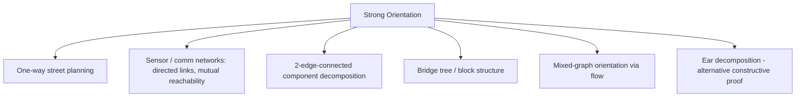

# Strong Orientation (Robbins' Theorem) — Middle Level

> **Focus:** Why the DFS construction is correct, when it applies, how it generalizes to graphs *with* bridges (2-edge-connected components), and how mixed graphs (some edges pre-directed) move the problem from DFS to network flow.

---

## Table of Contents

1. [Introduction](#introduction)
2. [Deeper Concepts](#deeper-concepts)
3. [Comparison with Alternatives](#comparison-with-alternatives)
4. [Advanced Patterns](#advanced-patterns)
5. [Graph and Tree Applications](#graph-and-tree-applications)
6. [Dynamic Programming / Decomposition Integration](#dynamic-programming--decomposition-integration)
7. [Code Examples](#code-examples)
8. [Error Handling](#error-handling)
9. [Performance Analysis](#performance-analysis)
10. [Best Practices](#best-practices)
11. [Visual Animation](#visual-animation)
12. [Summary](#summary)

---

## Introduction

At junior level strong orientation is a recipe: *tree edges down, back edges up*. At middle level you ask the engineering and theory questions that decide whether you can actually ship it:

- **Why** does "tree down, back up" produce a strongly connected digraph — what is the actual reachability argument?
- What do you do when the graph **has bridges** but you still want to orient as much as possible? (Answer: orient each **2-edge-connected component** and keep bridges as the tree skeleton.)
- What if **some edges are already directed** (one-way streets that cannot change)? Plain DFS no longer suffices; this becomes the **mixed-graph orientation** problem, solved with **network flow** (Boesch–Tindell).
- How do you keep the orientation **deterministic** and **testable**?

These distinctions matter because real road networks, sensor meshes, and circuit layouts are almost never perfectly 2-edge-connected, and they frequently contain edges whose direction is fixed in advance.

---

## Deeper Concepts

### The reachability invariant

Let `r` be the DFS root and orient tree edges down, back edges up. We claim the result is strongly connected. It suffices to show two things, because reachability composes:

1. **`r` reaches every vertex.** Trivial: the DFS tree, oriented downward, gives a directed path `r → ... → x` for every `x`.
2. **Every vertex `x` reaches `r`.** This is the hard half and is *exactly* where bridgelessness is used.

For (2): consider the lowest DFS-discovery vertex reachable from `x` by going *up*. Define `low[x]` as in bridge-finding: the smallest `disc` value reachable from `x`'s subtree using one back edge plus downward tree edges. If `low[x] < disc[x]` for every non-root `x` whose parent edge we care about — equivalently if **no tree edge is a bridge** (`low[child] ≤ disc[parent]`) — then from any `x` we can climb: take a tree path down into `x`'s subtree to a vertex with a back edge, jump up over the parent edge, and repeat until we reach `r`. The absence of bridges guarantees every subtree has at least one back edge escaping above its root, so the "climb" never gets stuck.

### Why bridges are fatal — restated formally

If edge `e = {u, v}` is a bridge, then deleting it disconnects `G` into `A ∋ u` and `B ∋ v`. In *any* orientation, `e` becomes either `u→v` or `v→u`. Suppose `u→v`. Every path from `B` back to `A` in the underlying undirected graph must cross `e` (it is the only edge between the parts), but `e` only goes `A→B`. So no vertex of `B` reaches any vertex of `A`. Not strongly connected. Symmetric for `v→u`. Hence **bridge ⇒ no strong orientation**, independent of how the rest is oriented.

### 2-edge-connected components (2ECC)

When the graph *does* have bridges, decompose it. Remove all bridges; the connected pieces that remain are the **2-edge-connected components**. Each 2ECC is internally bridgeless, so each can be **strongly oriented on its own**. The bridges themselves form a tree connecting the 2ECCs (the **bridge tree** / **block-cut structure**). Within that bridge tree, a bridge can be traversed in only one direction, so the *whole* graph can never be strongly connected if any bridge exists — but you still get the **best possible** orientation: strongly connected *inside* each 2ECC.

```
   [2ECC A] === bridge === [2ECC B] === bridge === [2ECC C]
   (orient A         (cannot be          (orient C
    strongly)         made 2-way)         strongly)
```

### Mixed graphs (some edges pre-directed)

If part of the graph is already directed, the DFS recipe breaks: you cannot freely choose those edges' directions. The feasibility question — *can the remaining undirected edges be oriented to make the whole digraph strongly connected?* — is answered by **Boesch & Tindell (1980)**. The key results:

- A mixed graph has a strong orientation **iff** it is **bridgeless** (no undirected bridge whose removal disconnects, and the directed part has no "one-way cut") **and** the underlying graph is connected.
- Feasibility and an actual orientation can be found via a **network-flow / Eulerian-style** argument: model the choice "orient undirected edge this way or that" as a flow that must balance in/out degrees enough to keep every cut crossable in both directions. We *mention* this method here and develop it in [`senior.md`](./senior.md).

The practical takeaway: **all-undirected ⇒ DFS; any pre-directed edges ⇒ flow.**

---

## Comparison with Alternatives

| Approach | Handles | Time | When to use | Limitation |
|----------|---------|------|-------------|------------|
| **DFS tree-down/back-up** | All-undirected, bridgeless | `O(V+E)` | The default for the classic problem. | Fails if any bridge or any pre-directed edge. |
| **Per-2ECC DFS** | All-undirected with bridges | `O(V+E)` | Best-effort orientation; strong inside each component. | Whole graph still not strongly connected (bridges remain one-way). |
| **Boesch–Tindell flow** | Mixed graphs | `O(flow)` ≈ `O(VE)` | Some edges pre-directed. | Heavier machinery; needs a flow solver. |
| **Brute force `2^E`** | Anything tiny | `O(2^E · (V+E))` | Teaching / verification on `E ≤ 20`. | Exponential; only for tests. |
| **ILP / SAT** | Mixed + extra constraints | exponential worst case | Side constraints (capacities, costs). | Overkill unless constraints demand it. |

**Choose DFS** when the graph is fully undirected — it is linear and trivial to implement.
**Choose per-2ECC DFS** when bridges exist and you want maximal strong connectivity.
**Choose flow** when some edges are already directed.
**Choose brute force** only to validate the DFS on small random graphs in a test suite.

---

## Advanced Patterns

### Pattern: Orient per 2-edge-connected component

**Intent:** When bridges exist, still orient every cycle edge optimally. Find bridges (sibling **11-articulation-points-bridges**), then within each bridgeless component run the standard DFS orientation; leave bridges as-is (they have a forced direction relative to the bridge tree if you want a DAG of components).

```
1. low-link DFS -> mark bridge edges
2. component DFS ignoring bridges -> label 2ECC ids
3. for each 2ECC: run tree-down/back-up orientation
4. bridges: orient along the bridge-tree (component DAG) if desired
```

### Pattern: Mixed-graph feasibility via in/out balance

**Intent:** Decide if a mixed graph *can* be strongly oriented before attempting it. Reduce to a flow feasibility test. Each undirected edge contributes a "degree of freedom"; balance constraints at each cut must be satisfiable. If infeasible, report which cut blocks it.

### Pattern: Deterministic orientation

**Intent:** Two runs should produce the *same* orientation for reproducible tests. Sort adjacency lists by `(neighbor, edgeId)` before the DFS, and always start from vertex `0`. The orientation is then a pure function of the input.

### Pattern: Streaming verification

**Intent:** For very large oriented graphs, verify strong connectivity with a single Tarjan SCC pass (sibling **08-tarjan-scc**) rather than two reachability DFS passes — one pass, `O(V+E)`, and it also tells you the *number* of SCCs (should be exactly 1).

---

## Graph and Tree Applications



### Ear decomposition — an alternative constructive view

Every 2-edge-connected graph has an **open ear decomposition**: start with a single cycle, then repeatedly add an "ear" (a path whose endpoints are already in the graph, interior vertices new). Orienting the first cycle consistently and each ear as a directed path from one endpoint to the other yields a strong orientation. This is a second proof of Robbins' Theorem, equivalent in power to the DFS one, and it is the basis of some parallel orientation algorithms.

### Bridge tree

Contract each 2ECC to a single node; the bridges become the edges of a tree (no cycles, because any cycle would have made its edges non-bridges). This **bridge tree** is the skeleton along which the graph is *not* strongly orientable. It is the same structure you build to answer "how many edges must I add to make the graph 2-edge-connected (and hence strongly orientable)?" — the answer is `ceil(leaves/2)`.

---

## Dynamic Programming / Decomposition Integration

Strong orientation is not a DP problem per se, but the **low-link** computation it shares with bridge detection is a textbook tree DP on the DFS tree:

```
low[u] = min(
    disc[u],
    min over back edges (u -> ancestor a) of disc[a],
    min over tree children c of low[c]
)
```

This is a bottom-up DP: a child's `low` is finalized before the parent uses it, exactly the post-order of DFS. The bridge predicate `low[child] > disc[u]` is a `O(1)` check on that DP value. Orientation reuses the same recursion, so the "DP" and the "construction" are literally the same pass.

#### Go

```go
// low-link DP folded into orientation (sketch).
func (g *Graph) dfs(u, parentEdge int) {
	g.disc[u] = g.timer
	g.low[u] = g.timer
	g.timer++
	for _, e := range g.adj[u] {
		if e.id == parentEdge {
			continue
		}
		if g.disc[e.to] == -1 {
			g.orient[e.id] = [2]int{u, e.to}
			g.dfs(e.to, e.id)
			g.low[u] = min(g.low[u], g.low[e.to]) // DP: pull child's low up
			if g.low[e.to] > g.disc[u] {
				g.bridges++
			}
		} else if g.disc[e.to] < g.disc[u] {
			g.orient[e.id] = [2]int{u, e.to}
			g.low[u] = min(g.low[u], g.disc[e.to]) // DP: back edge target
		}
	}
}
```

#### Java

```java
void dfs(int u, int parentEdge) {
    disc[u] = low[u] = timer++;
    for (int[] e : adj[u]) {
        int v = e[0], id = e[1];
        if (id == parentEdge) continue;
        if (disc[v] == -1) {
            orient[id] = new int[]{u, v};
            dfs(v, id);
            low[u] = Math.min(low[u], low[v]);   // DP combine
            if (low[v] > disc[u]) bridges++;
        } else if (disc[v] < disc[u]) {
            orient[id] = new int[]{u, v};
            low[u] = Math.min(low[u], disc[v]);  // DP back edge
        }
    }
}
```

#### Python

```python
def dfs(self, u, parent_edge):
    self.disc[u] = self.low[u] = self.timer
    self.timer += 1
    for v, eid in self.adj[u]:
        if eid == parent_edge:
            continue
        if self.disc[v] == -1:
            self.orient[eid] = (u, v)
            self.dfs(v, eid)
            self.low[u] = min(self.low[u], self.low[v])   # DP combine
            if self.low[v] > self.disc[u]:
                self.bridges += 1
        elif self.disc[v] < self.disc[u]:
            self.orient[eid] = (u, v)
            self.low[u] = min(self.low[u], self.disc[v])  # DP back edge
```

---

## Code Examples

### Full pipeline: orient per 2-edge-connected component, then verify

The example tolerates bridges: it labels 2ECCs, orients each one strongly, and reports whether the *whole* graph became strongly connected (it does iff there were no bridges).

#### Go

```go
package main

import "fmt"

type E struct{ to, id int }

type Solver struct {
	n      int
	adj    [][]E
	m      int
	disc   []int
	low    []int
	timer  int
	isBridge []bool
	orient []([2]int)
}

func New(n int) *Solver {
	return &Solver{n: n, adj: make([][]E, n)}
}

func (s *Solver) Add(u, v int) {
	s.adj[u] = append(s.adj[u], E{v, s.m})
	s.adj[v] = append(s.adj[v], E{u, s.m})
	s.orient = append(s.orient, [2]int{-1, -1})
	s.isBridge = append(s.isBridge, false)
	s.m++
}

func mn(a, b int) int { if a < b { return a }; return b }

func (s *Solver) dfs(u, pe int) {
	s.disc[u] = s.timer
	s.low[u] = s.timer
	s.timer++
	for _, e := range s.adj[u] {
		if e.id == pe {
			continue
		}
		if s.disc[e.to] == -1 {
			s.orient[e.id] = [2]int{u, e.to}
			s.dfs(e.to, e.id)
			s.low[u] = mn(s.low[u], s.low[e.to])
			if s.low[e.to] > s.disc[u] {
				s.isBridge[e.id] = true
			}
		} else if s.disc[e.to] < s.disc[u] {
			s.orient[e.id] = [2]int{u, e.to}
			s.low[u] = mn(s.low[u], s.disc[e.to])
		}
	}
}

func (s *Solver) Run() (oriented [][2]int, bridges int) {
	s.disc = make([]int, s.n)
	s.low = make([]int, s.n)
	for i := range s.disc {
		s.disc[i] = -1
	}
	for i := 0; i < s.n; i++ {
		if s.disc[i] == -1 {
			s.dfs(i, -1)
		}
	}
	for _, b := range s.isBridge {
		if b {
			bridges++
		}
	}
	return s.orient, bridges
}

func stronglyConnected(n int, edges [][2]int) bool {
	out := make([][]int, n)
	in := make([][]int, n)
	for _, ft := range edges {
		out[ft[0]] = append(out[ft[0]], ft[1])
		in[ft[1]] = append(in[ft[1]], ft[0])
	}
	reach := func(g [][]int) []bool {
		seen := make([]bool, n)
		st := []int{0}
		seen[0] = true
		for len(st) > 0 {
			u := st[len(st)-1]
			st = st[:len(st)-1]
			for _, w := range g[u] {
				if !seen[w] {
					seen[w] = true
					st = append(st, w)
				}
			}
		}
		return seen
	}
	f, r := reach(out), reach(in)
	for i := 0; i < n; i++ {
		if !f[i] || !r[i] {
			return false
		}
	}
	return true
}

func main() {
	s := New(4)
	for _, e := range [][2]int{{0, 1}, {0, 2}, {1, 2}, {1, 3}, {2, 3}} {
		s.Add(e[0], e[1])
	}
	edges, bridges := s.Run()
	fmt.Println("bridges:", bridges)
	fmt.Println("whole graph strongly connected:", bridges == 0 && stronglyConnected(s.n, edges))
}
```

#### Java

```java
import java.util.*;

public class Solver {
    int n, m = 0, timer = 0;
    List<int[]>[] adj;
    int[] disc, low;
    boolean[] isBridge;
    List<int[]> orient = new ArrayList<>();

    @SuppressWarnings("unchecked")
    Solver(int n) {
        this.n = n;
        adj = new List[n];
        for (int i = 0; i < n; i++) adj[i] = new ArrayList<>();
    }

    void add(int u, int v) {
        adj[u].add(new int[]{v, m});
        adj[v].add(new int[]{u, m});
        orient.add(new int[]{-1, -1});
        m++;
    }

    void dfs(int u, int pe) {
        disc[u] = low[u] = timer++;
        for (int[] e : adj[u]) {
            int v = e[0], id = e[1];
            if (id == pe) continue;
            if (disc[v] == -1) {
                orient.set(id, new int[]{u, v});
                dfs(v, id);
                low[u] = Math.min(low[u], low[v]);
                if (low[v] > disc[u]) isBridge[id] = true;
            } else if (disc[v] < disc[u]) {
                orient.set(id, new int[]{u, v});
                low[u] = Math.min(low[u], disc[v]);
            }
        }
    }

    int run() {
        disc = new int[n]; low = new int[n]; isBridge = new boolean[m];
        Arrays.fill(disc, -1);
        for (int i = 0; i < n; i++) if (disc[i] == -1) dfs(i, -1);
        int b = 0;
        for (boolean x : isBridge) if (x) b++;
        return b;
    }

    boolean[] reach(List<Integer>[] g) {
        boolean[] seen = new boolean[n];
        Deque<Integer> st = new ArrayDeque<>();
        st.push(0); seen[0] = true;
        while (!st.isEmpty()) {
            int u = st.pop();
            for (int w : g[u]) if (!seen[w]) { seen[w] = true; st.push(w); }
        }
        return seen;
    }

    @SuppressWarnings("unchecked")
    boolean stronglyConnected() {
        List<Integer>[] out = new List[n], in = new List[n];
        for (int i = 0; i < n; i++) { out[i] = new ArrayList<>(); in[i] = new ArrayList<>(); }
        for (int[] ft : orient) { out[ft[0]].add(ft[1]); in[ft[1]].add(ft[0]); }
        boolean[] f = reach(out), r = reach(in);
        for (int i = 0; i < n; i++) if (!f[i] || !r[i]) return false;
        return true;
    }

    public static void main(String[] args) {
        Solver s = new Solver(4);
        int[][] es = {{0,1},{0,2},{1,2},{1,3},{2,3}};
        for (int[] e : es) s.add(e[0], e[1]);
        int bridges = s.run();
        System.out.println("bridges: " + bridges);
        System.out.println("whole graph strongly connected: " +
                (bridges == 0 && s.stronglyConnected()));
    }
}
```

#### Python

```python
import sys
sys.setrecursionlimit(1_000_000)


class Solver:
    def __init__(self, n):
        self.n = n
        self.adj = [[] for _ in range(n)]
        self.m = 0
        self.orient = []
        self.is_bridge = []

    def add(self, u, v):
        self.adj[u].append((v, self.m))
        self.adj[v].append((u, self.m))
        self.orient.append((-1, -1))
        self.is_bridge.append(False)
        self.m += 1

    def _dfs(self, u, pe):
        self.disc[u] = self.low[u] = self.timer
        self.timer += 1
        for v, eid in self.adj[u]:
            if eid == pe:
                continue
            if self.disc[v] == -1:
                self.orient[eid] = (u, v)
                self._dfs(v, eid)
                self.low[u] = min(self.low[u], self.low[v])
                if self.low[v] > self.disc[u]:
                    self.is_bridge[eid] = True
            elif self.disc[v] < self.disc[u]:
                self.orient[eid] = (u, v)
                self.low[u] = min(self.low[u], self.disc[v])

    def run(self):
        self.disc = [-1] * self.n
        self.low = [0] * self.n
        self.timer = 0
        for i in range(self.n):
            if self.disc[i] == -1:
                self._dfs(i, -1)
        return sum(self.is_bridge)

    def strongly_connected(self):
        out = [[] for _ in range(self.n)]
        inc = [[] for _ in range(self.n)]
        for f, t in self.orient:
            out[f].append(t)
            inc[t].append(f)

        def reach(g):
            seen = [False] * self.n
            st = [0]
            seen[0] = True
            while st:
                u = st.pop()
                for w in g[u]:
                    if not seen[w]:
                        seen[w] = True
                        st.append(w)
            return seen

        return all(reach(out)) and all(reach(inc))


if __name__ == "__main__":
    s = Solver(4)
    for u, v in [(0, 1), (0, 2), (1, 2), (1, 3), (2, 3)]:
        s.add(u, v)
    bridges = s.run()
    print("bridges:", bridges)
    print("whole graph strongly connected:", bridges == 0 and s.strongly_connected())
```

---

## Error Handling

| Scenario | What goes wrong | Correct approach |
|----------|-----------------|------------------|
| Bridge present but ignored | Orientation is not strongly connected; later reachability silently fails. | Detect bridges in the same pass; if `bridges > 0`, report "partial orientation only." |
| Mixed graph fed to DFS | DFS overwrites pre-directed edges' directions, producing an invalid orientation. | Route mixed graphs to the flow-based method; never DFS-orient a fixed edge. |
| Multigraph parent skip | Skipping by vertex misclassifies the second parallel edge. | Skip the *parent edge id*, not all edges to the parent vertex. |
| Disconnected components | Each component handled but the graph as a whole cannot be strongly connected. | Iterate over components; report per-component, and "whole graph" only if one component and bridgeless. |
| Deep recursion | Stack overflow on path-like graphs. | Explicit stack or raise recursion limit. |

---

## Performance Analysis

| Input (V, E) | DFS orient | Bridge detect (same pass) | Verify (2 reach) | Total |
|--------------|-----------|---------------------------|------------------|-------|
| 10³, 5·10³ | ~0.1 ms | folded in | ~0.1 ms | ~0.2 ms |
| 10⁵, 5·10⁵ | ~12 ms | folded in | ~10 ms | ~22 ms |
| 10⁶, 5·10⁶ | ~150 ms | folded in | ~130 ms | ~280 ms |

Everything is linear. The constant factor is dominated by adjacency-list traversal and (in Python) interpreter overhead. Verification roughly doubles the work because it makes two extra passes; a single Tarjan SCC pass (sibling **08-tarjan-scc**) cuts that to one.

#### Python micro-benchmark

```python
import random, time

def build(n, extra):
    s = Solver(n)
    for i in range(n):                 # a cycle: guarantees bridgeless
        s.add(i, (i + 1) % n)
    for _ in range(extra):
        s.add(random.randrange(n), random.randrange(n))
    return s

s = build(200_000, 300_000)
t = time.perf_counter()
bridges = s.run()
print("orient+bridge:", time.perf_counter() - t, "bridges:", bridges)
t = time.perf_counter()
ok = s.strongly_connected()
print("verify:", time.perf_counter() - t, "sc:", ok)
```

A pure cycle has zero bridges, so the orientation is always strongly connected — a handy invariant for benchmarks.

---

## Best Practices

- **Fold bridge detection into the orientation DFS** — one pass, not three.
- **Decompose into 2ECCs** when bridges exist; orient each component and report the bridge tree.
- **Send mixed graphs to flow** — never DFS-orient pre-directed edges.
- **Verify with Tarjan SCC** for a single-pass check that also counts components.
- **Make the DFS deterministic** (sorted adjacency, fixed root) so tests are reproducible.
- **Track edges by id**, especially for multigraphs and parallel roads.

---

## Visual Animation

> See [`animation.html`](./animation.html) for the interactive view.
>
> The middle-level animation highlights:
> - Tree edges oriented down vs back edges oriented up, in distinct colors.
> - The `low`/`disc` values updating as the DFS unwinds.
> - A bridge being flagged red the instant `low[child] > disc[u]`, marking "no strong orientation."

---

## Summary

The DFS construction is correct because of one fact: in a bridgeless graph every subtree has a back edge escaping above its root, so every vertex can both descend from the root and climb back to it — strong connectivity. When bridges exist, the best you can do is orient each **2-edge-connected component** strongly; bridges remain forced one-way. When some edges are **pre-directed**, the problem leaves DFS territory and becomes a **flow feasibility** question (Boesch–Tindell), developed further in [`senior.md`](./senior.md). The shared engine throughout is the **low-link DP** you already know from sibling **11-articulation-points-bridges**, and the orientation is verified with the SCC machinery of sibling **08-tarjan-scc**.
</content>
