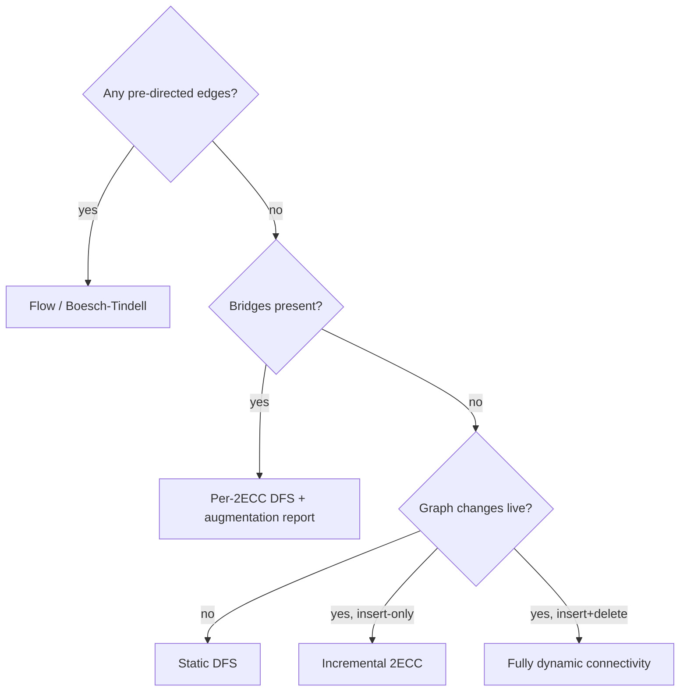
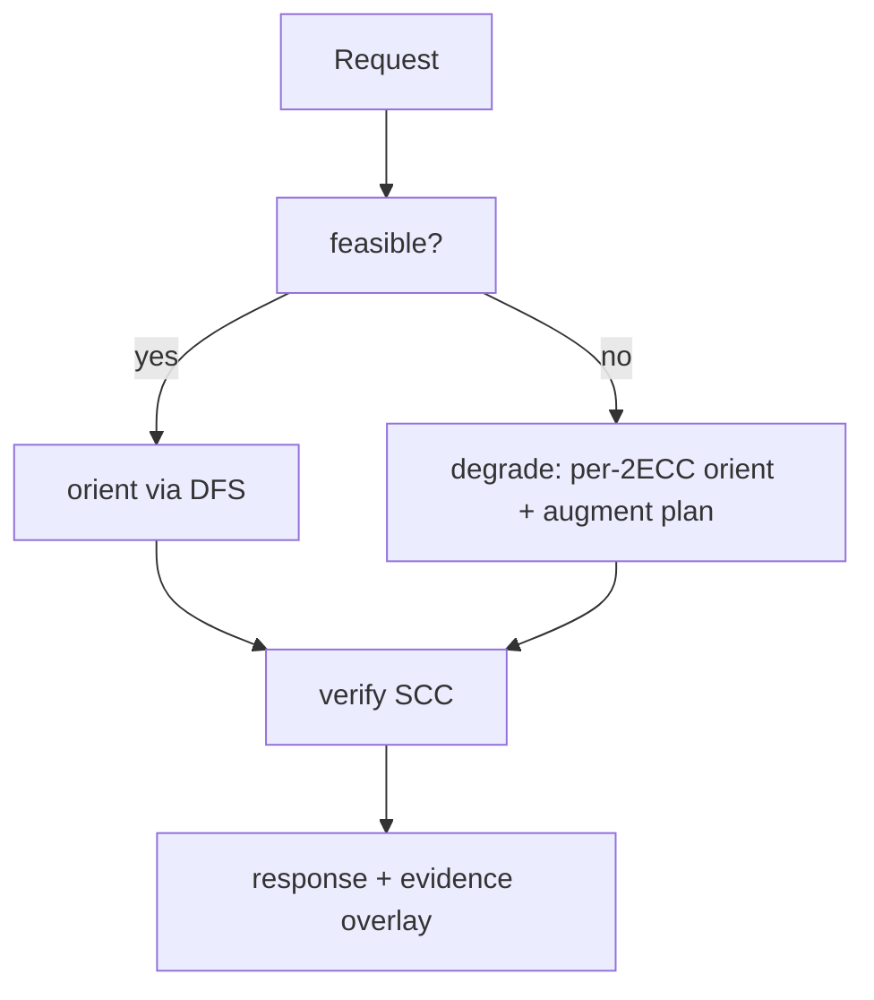

# Strong Orientation (Robbins' Theorem) — Senior Level

> Robbins' Theorem is a one-line existence result, but turning it into a service — "orient this 40,000-edge road network and keep the city reachable, under live edits, with some streets permanently one-way" — exposes every operational concern: mixed constraints, incremental maintenance, scale, observability, and graceful degradation when the precondition fails.

## Table of Contents
1. [Introduction](#1-introduction)
2. [System Design with Strong Orientation](#2-system-design-with-strong-orientation)
3. [Mixed-Graph Orientation via Network Flow](#3-mixed-graph-orientation-via-network-flow)
4. [Incremental and Dynamic Orientation](#4-incremental-and-dynamic-orientation)
5. [Comparison with Alternatives at Scale](#5-comparison-with-alternatives-at-scale)
6. [Architecture Patterns](#6-architecture-patterns)
7. [Code Examples](#7-code-examples)
8. [Observability](#8-observability)
9. [Failure Modes](#9-failure-modes)
10. [Capacity Planning](#10-capacity-planning)
11. [Summary](#11-summary)

---

## 1. Introduction

At senior level the algorithm itself — DFS, tree down, back up — is a solved, two-page problem. The interesting work is everything around it:

- The input is rarely a clean, fully-undirected, 2-edge-connected graph. Real road networks have **bridges** (a single span over a river), **pre-directed edges** (existing one-way streets), **forbidden directions**, and they **change** (construction closes a road).
- "No strong orientation exists" is not an acceptable error to throw at an operator. You need **graceful degradation**: orient what you can (per 2-edge-connected component), name the bridges that block full connectivity, and recommend the cheapest set of edges to add.
- At city or continental scale the graph has 10⁵–10⁷ edges and the orientation must be **recomputed incrementally** as edges open and close, not from scratch each time.

This document treats strong orientation as a **component of a system**: how it is exposed, how it degrades, how it is monitored, and how it scales. The throughline is that the textbook algorithm is the easy 10%; the surrounding 90% — feasibility evidence, graceful degradation, incremental maintenance, reproducibility, and an always-on correctness certificate — is where senior engineering judgment is exercised and where production incidents are prevented.

---

## 2. System Design with Strong Orientation

### 2.1 Three tiers of orientation problem

```mermaid
flowchart LR
    A[All-undirected, bridgeless<br/>DFS, O(V+E)<br/>milliseconds] --> B[Has bridges OR pre-directed edges<br/>2ECC decomposition + flow<br/>seconds] --> C[Live, edited graph<br/>incremental 2ECC maintenance<br/>continuous]
    style A fill:#e8f4ff,stroke:#0366d6
    style B fill:#fff4e8,stroke:#d97706
    style C fill:#ffe8e8,stroke:#dc2626
```

| Tier | When right | When wrong |
| --- | --- | --- |
| Plain DFS orientation | Static, fully undirected, guaranteed bridgeless. | Any pre-directed edge or bridge — silently wrong. |
| 2ECC + flow | Static but realistic: bridges and one-way streets present. | The graph changes faster than a full recompute. |
| Incremental maintenance | Live edits (open/close roads) at high frequency. | The graph is static — incremental machinery is wasted complexity. |

### 2.2 The orientation service contract

A production orientation service should expose, not just `orient(graph) -> directions`, but:

- `feasible(graph) -> {YES | NO, blocking_bridges, blocking_cuts}` — the precondition with *evidence*.
- `orient(graph) -> directions` — strong if feasible, else per-component strong.
- `augment(graph) -> edges_to_add` — the minimum edges to make it fully orientable (the bridge-tree leaf-pairing result, `ceil(leaves/2)`).
- `verify(directions) -> bool` — an independent SCC check (sibling **08-tarjan-scc**), run on every response in staging.

Separating *feasibility* from *construction* matters: an operator usually wants to know **why** the city cannot be made one-way before they care about the directions.

### 2.3 The degradation ladder

When a strong orientation does not exist, descend the ladder rather than failing:

1. Orient each **2-edge-connected component** strongly.
2. Orient **bridges** along the bridge tree to form a DAG of components (still reachable in *one* direction).
3. Report the **bridge tree leaves** and the `ceil(L/2)` edges that would fix it.
4. Surface all of this to the operator with a map overlay.

Each rung delivers strictly more value than a bare error. Rung 1 alone often satisfies the real requirement ("make each neighborhood one-way"); rungs 3–4 turn an "impossible" into a costed engineering proposal. A service that only returns "NO" forces the operator to do this analysis by hand — a poor experience and a missed product opportunity.

### 2.4 Reproducibility and idempotency

A planning tool must be reproducible: the same input graph must yield the same orientation across runs, machines, and versions, or planners cannot review diffs. Achieve this by (a) fixing the root (always vertex `0` or a stable hash of intersection ids), (b) sorting adjacency lists by `(neighbor_id, edge_id)` before the DFS, and (c) pinning the algorithm version. With these, `orient()` is a pure function of the input, and re-running after an unrelated config change produces a byte-identical result — essential for change review and audit.

---

## 3. Mixed-Graph Orientation via Network Flow

### 3.1 Why DFS is not enough

Plain DFS chooses every edge's direction freely. With pre-directed edges, those choices are taken away, and the question "can the undirected edges be oriented to make the whole digraph strongly connected?" is no longer answered by tree-down/back-up. This is the **mixed-graph strong orientation** problem, characterized by **Boesch & Tindell (1980)**: a mixed graph is strongly orientable iff its underlying graph is connected and bridgeless **and** it has no "directed cut" — no set of vertices `S` whose boundary edges all point the same way once the directed ones are fixed.

### 3.2 The flow reduction (Eulerian-style balancing)

The standard constructive approach reduces to a **flow / degree-balancing** problem. Intuition: orienting the undirected edges is equivalent to choosing, for each undirected edge, which endpoint gains an out-degree. Strong connectivity in a mixed graph reduces (after handling cut conditions) to making the directed graph have a closed walk covering all edges — an **Eulerian-style** balance where every vertex's in-degree can match its out-degree closely enough to keep all cuts crossable both ways. Concretely:

1. Fix the pre-directed edges; compute the surplus `b(v) = outdeg(v) - indeg(v)` from them.
2. Build a flow network: each undirected edge is an arc whose flow decides its orientation; node balance constraints encode "keep every cut crossable."
3. A feasible integral flow ⟺ a valid mixed strong orientation. Read the orientation off the flow.

This runs in polynomial time — roughly `O(VE)` with a standard max-flow (sibling **16-max-flow-edmonds-karp-dinic**). We keep the development at the architecture level here; the formal characterization and proof are in [`professional.md`](./professional.md).

### 3.3 When to reach for flow

- Any pre-directed edges → flow (or a hybrid: DFS the fully-undirected 2ECCs, flow only the mixed ones).
- Side constraints (forbidden directions, capacities) → ILP/flow with extra arcs.
- Pure undirected → never; DFS is strictly simpler and faster.

### 3.4 Operational reality of mixed graphs

In practice, pre-directed edges cluster: downtown grids with existing one-way systems, highway ramps, transit-only lanes. These clusters are usually a small fraction of total edges and confined to a few 2ECCs. The hybrid strategy exploits this: run the linear DFS everywhere, and invoke the `O(VE)` flow solver only on the (small, rare) mixed components. The net cost stays close to linear because the expensive solver touches only a sliver of the graph. If you ever find flow dominating runtime, it usually signals that the input was mislabeled — undirected edges accidentally marked directed — and is worth auditing at ingest.

---

## 4. Incremental and Dynamic Orientation

### 4.1 The problem

A road network changes: construction closes edge `e` (deletion), a new ramp opens (insertion). Recomputing the entire orientation on every edit is `O(V+E)` per edit — fine for a one-off, wasteful at 100 edits/second over a 10⁷-edge graph.

### 4.2 What actually changes

Orientation stability hinges on the **2-edge-connected structure**:

- **Adding an edge** can only *merge* 2ECCs and *remove* bridges (never create one). It can flip a "no orientation" answer to "yes."
- **Deleting an edge** can *split* a 2ECC and *create* bridges. It can flip "yes" to "no."

So the dynamic problem is really **dynamic 2-edge-connectivity** (sibling **30-online-bridges** covers incremental bridge maintenance). Maintain the bridge tree under edge insertions with a DSU-on-tree / small-to-large merge (sibling **21-small-to-large-merging**); each insertion is near-`O(α)` amortized. Full dynamic (insert *and* delete) connectivity uses heavier structures (Holm–de Lichtenberg–Thorup), `O(log² n)` amortized.

### 4.3 Local re-orientation

You rarely need to re-orient the whole graph. When a 2ECC's structure is unchanged, its internal orientation stays valid. Only the affected component(s) need re-running. Keep a component → edge index so an edit touches `O(component size)`, not `O(graph)`.

### 4.4 A concrete dynamic scenario

Consider a city graph already oriented. Three live events arrive:

1. **Construction closes a residential street** inside a dense 2ECC. The component has many alternate cycles, so the closure does not create a bridge. Action: re-run the DFS orientation *only on that component*; the rest of the city is untouched. Latency: microseconds for a small component.
2. **A bridge over a river is closed** for repair. This deletes a bridge edge — but a bridge was already not strongly orientable, so the two sides were already only one-way-connected through it. Closing it disconnects them entirely. Action: alert that connectivity dropped; the feasibility answer was already "NO" and remains "NO," now with one more component.
3. **A new connector road opens** between two previously bridge-separated blocks. This *insertion* can merge two 2ECCs and remove a bridge. Action: union the two components, re-run orientation on the merged component, and re-check whether the whole city is now bridgeless. This is the case where the feasibility answer can flip from "NO" to "YES."

The asymmetry is the headline: insertions can only *improve* orientability (merge components, kill bridges); deletions can only *worsen* it (split components, create bridges). An insert-only workload is therefore much cheaper to maintain than a delete-heavy one.

### 4.5 Choosing the maintenance structure

| Edit pattern | Structure | Per-edit cost |
|--------------|-----------|---------------|
| Insert-only | Union-find over 2ECCs (sibling **21-small-to-large-merging**) | near-`O(α)` amortized |
| Delete-only | Reverse-time insert + offline | near-`O(α)` if offline |
| Mixed insert/delete | Holm–de Lichtenberg–Thorup fully dynamic | `O(log² n)` amortized |
| Rare edits | Recompute from scratch | `O(V+E)` |

Pick the lightest structure that covers your actual edit distribution; do not pay for fully-dynamic machinery if your graph only grows.

---

## 5. Comparison with Alternatives at Scale

| Method | Scope | Cost per build | Cost per edit | Memory | Notes |
|--------|-------|----------------|---------------|--------|-------|
| Static DFS | undirected bridgeless | `O(V+E)` | full rebuild | `O(V+E)` | Simplest; baseline. |
| Static 2ECC + DFS | undirected w/ bridges | `O(V+E)` | full rebuild | `O(V+E)` | Best-effort orientation. |
| Flow (mixed) | mixed graphs | `O(VE)` | full rebuild | `O(V+E)` | Needs flow solver. |
| Incremental 2ECC (insert-only) | live, additive | amortized `O(α)` | `O(α)` per insert | `O(V+E)` | Online bridges, small-to-large. |
| Fully dynamic | live, insert+delete | `O(log² n)` | `O(log² n)` | `O(V log n)` | HDT structure; complex. |
| Recompute from scratch | anything | `O(V+E)` | `O(V+E)` | `O(V+E)` | Fine below ~1 edit/sec. |

**Rule of thumb:** static + undirected → DFS; static + realistic → 2ECC/flow; insert-only live → online bridges; full churn → fully dynamic connectivity (only if the edit rate truly demands it).

### 5.1 Decision flow for picking an approach



Walking this tree at design time prevents the two classic mistakes: reaching for flow when the graph is fully undirected (wasteful), and reaching for fully-dynamic machinery when the graph only grows (over-engineered).

---

## 6. Architecture Patterns

### 6.1 Feasibility-first API

Split the endpoint so callers can ask the cheap question first.



### 6.2 Precompute + cache the bridge tree

The bridge tree is small (one node per 2ECC) and changes slowly. Cache it; recompute orientation only for components whose internal structure changed.

### 6.3 Sharding by component

2ECCs are independent for orientation purposes. Orient them in parallel across workers; only the bridge tree needs a coordinating pass. This is embarrassingly parallel for graphs with many small components.

### 6.4 Hybrid DFS+flow

Run DFS on the all-undirected 2ECCs (cheap) and reserve the flow solver for components that contain pre-directed edges. Most real components are fully undirected, so flow is invoked rarely.

### 6.5 Case study — one-way-street planning for a mid-size city

A concrete deployment shape. Input: `V ≈ 3·10⁵` intersections, `E ≈ 7·10⁵` streets, of which ~5% are already one-way (pre-directed). Pipeline:

1. **Ingest & validate.** Parse the street graph, tag pre-directed edges, check connectivity. Reject (or split) disconnected inputs.
2. **Decompose.** Low-link DFS marks bridges and labels 2ECCs. ~40 bridges found (river crossings, highway on-ramps), giving ~40 components plus a bridge tree.
3. **Orient.** For each fully-undirected 2ECC (the vast majority), DFS-orient. For the handful containing pre-directed edges, run the flow solver. Bridges stay as their fixed/forced direction.
4. **Verify.** Independent SCC check per component; every component must be one SCC. The whole-graph SCC count equals the number of components (bridges prevent full collapse).
5. **Report.** "City is NOT fully one-way-able due to 40 bridges (mapped). Each district is internally one-way-able. Adding `⌈L/2⌉ ≈ 12` connector roads would make the whole city one-way-able." Plus the per-street directions.

End-to-end runs in ~150 ms single-threaded in Go. The operator receives directions, a map of blocking bridges, and a costed fix — not a bare yes/no.

### 6.5.1 Output schema for the case study

A clean response object makes the degradation ladder consumable by a UI:

```json
{
  "feasible": false,
  "blocking_bridges": [{"u": 14, "v": 88, "label": "River Span A"}],
  "components": 40,
  "orientation": [{"edge": 0, "from": 3, "to": 7}, "..."],
  "augmentation": {"edges_needed": 12, "suggested": [[5, 902], "..."]},
  "verified": true
}
```

The `verified` flag is the SCC certificate; a UI should refuse to render directions when it is `false`. The `augmentation.suggested` list turns "impossible" into a concrete proposal a planner can price out.

### 6.6 Why split feasibility from construction architecturally

The two endpoints have different cost and cache profiles. `feasible()` is a single low-link DFS with no edge-orientation bookkeeping, so it is cheaper and its result (the bridge set) changes slowly. `orient()` produces `O(E)` output and is regenerated more often. Separating them lets you cache feasibility aggressively, serve "can the city be one-way-d?" dashboards cheaply, and only pay for full orientation when a planner actually commits to it.

---

## 7. Code Examples

### 7.1 Feasibility with evidence (which bridges block full orientation)

#### Go

```go
package main

import "fmt"

type E struct{ to, id int }

type Net struct {
	n     int
	adj   [][]E
	m     int
	disc  []int
	low   []int
	timer int
	bridgeEdges [][2]int
}

func NewNet(n int) *Net { return &Net{n: n, adj: make([][]E, n)} }

func (g *Net) Add(u, v int) {
	g.adj[u] = append(g.adj[u], E{v, g.m})
	g.adj[v] = append(g.adj[v], E{u, g.m})
	g.m++
}

func (g *Net) dfs(u, pe int) {
	g.disc[u] = g.timer
	g.low[u] = g.timer
	g.timer++
	for _, e := range g.adj[u] {
		if e.id == pe {
			continue
		}
		if g.disc[e.to] == -1 {
			g.dfs(e.to, e.id)
			if g.low[e.to] < g.low[u] {
				g.low[u] = g.low[e.to]
			}
			if g.low[e.to] > g.disc[u] {
				g.bridgeEdges = append(g.bridgeEdges, [2]int{u, e.to})
			}
		} else if g.disc[e.to] < g.disc[u] {
			if g.disc[e.to] < g.low[u] {
				g.low[u] = g.disc[e.to]
			}
		}
	}
}

// Feasible returns whether a full strong orientation exists, plus the
// blocking bridges as evidence for an operator.
func (g *Net) Feasible() (bool, [][2]int) {
	g.disc = make([]int, g.n)
	g.low = make([]int, g.n)
	for i := range g.disc {
		g.disc[i] = -1
	}
	for i := 0; i < g.n; i++ {
		if g.disc[i] == -1 {
			g.dfs(i, -1)
		}
	}
	return len(g.bridgeEdges) == 0, g.bridgeEdges
}

func main() {
	g := NewNet(6)
	// Two triangles joined by a single bridge edge 2-3.
	for _, e := range [][2]int{{0, 1}, {1, 2}, {2, 0}, {2, 3}, {3, 4}, {4, 5}, {5, 3}} {
		g.Add(e[0], e[1])
	}
	ok, bridges := g.Feasible()
	fmt.Println("strongly orientable:", ok)
	fmt.Println("blocking bridges:", bridges)
}
```

#### Java

```java
import java.util.*;

public class Net {
    int n, m = 0, timer = 0;
    List<int[]>[] adj;
    int[] disc, low;
    List<int[]> bridges = new ArrayList<>();

    @SuppressWarnings("unchecked")
    Net(int n) {
        this.n = n;
        adj = new List[n];
        for (int i = 0; i < n; i++) adj[i] = new ArrayList<>();
    }

    void add(int u, int v) {
        adj[u].add(new int[]{v, m});
        adj[v].add(new int[]{u, m});
        m++;
    }

    void dfs(int u, int pe) {
        disc[u] = low[u] = timer++;
        for (int[] e : adj[u]) {
            int v = e[0], id = e[1];
            if (id == pe) continue;
            if (disc[v] == -1) {
                dfs(v, id);
                low[u] = Math.min(low[u], low[v]);
                if (low[v] > disc[u]) bridges.add(new int[]{u, v});
            } else if (disc[v] < disc[u]) {
                low[u] = Math.min(low[u], disc[v]);
            }
        }
    }

    boolean feasible() {
        disc = new int[n]; low = new int[n];
        Arrays.fill(disc, -1);
        for (int i = 0; i < n; i++) if (disc[i] == -1) dfs(i, -1);
        return bridges.isEmpty();
    }

    public static void main(String[] args) {
        Net g = new Net(6);
        int[][] es = {{0,1},{1,2},{2,0},{2,3},{3,4},{4,5},{5,3}};
        for (int[] e : es) g.add(e[0], e[1]);
        boolean ok = g.feasible();
        System.out.println("strongly orientable: " + ok);
        for (int[] b : g.bridges) System.out.println("blocking bridge: " + b[0] + "-" + b[1]);
    }
}
```

#### Python

```python
import sys
sys.setrecursionlimit(1_000_000)


class Net:
    def __init__(self, n):
        self.n = n
        self.adj = [[] for _ in range(n)]
        self.m = 0
        self.bridges = []

    def add(self, u, v):
        self.adj[u].append((v, self.m))
        self.adj[v].append((u, self.m))
        self.m += 1

    def _dfs(self, u, pe):
        self.disc[u] = self.low[u] = self.timer
        self.timer += 1
        for v, eid in self.adj[u]:
            if eid == pe:
                continue
            if self.disc[v] == -1:
                self._dfs(v, eid)
                self.low[u] = min(self.low[u], self.low[v])
                if self.low[v] > self.disc[u]:
                    self.bridges.append((u, v))
            elif self.disc[v] < self.disc[u]:
                self.low[u] = min(self.low[u], self.disc[v])

    def feasible(self):
        self.disc = [-1] * self.n
        self.low = [0] * self.n
        self.timer = 0
        for i in range(self.n):
            if self.disc[i] == -1:
                self._dfs(i, -1)
        return len(self.bridges) == 0


if __name__ == "__main__":
    g = Net(6)
    for u, v in [(0, 1), (1, 2), (2, 0), (2, 3), (3, 4), (4, 5), (5, 3)]:
        g.add(u, v)
    print("strongly orientable:", g.feasible())
    print("blocking bridges:", g.bridges)
```

The example deliberately joins two triangles by a single edge `2-3`. Each triangle is bridgeless, but the joining edge is a bridge, so the *whole* graph is not strongly orientable — and the service reports exactly which edge blocks it.

### 7.2 Augmentation count (how many edges to add to fix it)

Build the bridge tree; if it has `L` leaves, adding `ceil(L/2)` well-chosen edges makes the graph 2-edge-connected and hence fully orientable. This is the operator's "what would it cost to fix the city?" answer.

```python
def edges_to_make_orientable(bridge_tree_degree):
    leaves = sum(1 for d in bridge_tree_degree if d == 1)
    if leaves <= 1:
        return 0           # already 2-edge-connected (single node) 
    return (leaves + 1) // 2
```

---

## 8. Observability

A production orientation service should emit:

| Signal | Why it matters |
|--------|----------------|
| `feasible{result}` counter | Track how often the city is fully orientable vs degraded. |
| `bridges_blocking` gauge | Number of bridges currently preventing full orientation. |
| `orient_latency_ms` histogram | DFS / flow build time; alert on tail blowups. |
| `components_2ecc` gauge | Number of 2-edge-connected components; spikes signal fragmentation. |
| `verify_failures` counter | SCC re-check failures — should be **zero**; any nonzero is a correctness bug. |
| `incremental_edits/sec` | Edit rate; decides static-rebuild vs incremental. |
| `augment_edges_recommended` gauge | The `ceil(L/2)` fix size — a planning metric. |

The single most important alert: **`verify_failures > 0`**. The orientation must *always* pass an independent SCC check (sibling **08-tarjan-scc**); a failure means the construction produced a non-strongly-connected result, which is a hard correctness defect.

### 8.1 Alerting playbook

| Alert | Severity | Likely cause | First action |
|-------|----------|--------------|--------------|
| `verify_failures > 0` | P1 (page) | Construction bug: double-orient, multigraph skip, `>` vs `≥`. | Roll back to last-known-good orientation; reproduce on the failing graph. |
| `bridges_blocking` rises sharply | P2 | An edge deletion (road closure) created bridges. | Confirm against edit log; surface affected districts. |
| `components_2ecc` spikes | P2 | Graph fragmenting under deletions. | Check for an edit storm; consider freezing edits. |
| `orient_latency_ms` p99 blowup | P3 | A giant component or recursion-depth fallback. | Check component size distribution; switch to iterative DFS. |
| `incremental_edits/sec` over threshold | P3 | Workload outgrew static recompute. | Enable incremental 2ECC maintenance. |

### 8.2 What "good" looks like

A healthy steady state: `verify_failures = 0` always; `bridges_blocking` flat and small; `orient_latency_ms` p99 well under your SLA; `components_2ecc` stable. The single golden signal a reviewer should check first is `verify_failures` — it is binary, cheap, and catches the only class of defect that silently corrupts the product.

---

## 9. Failure Modes

| Failure | Symptom | Mitigation |
|---------|---------|------------|
| Hidden bridge | Orientation passes DFS but verify fails. | Always run the independent SCC verify; never trust the construction alone. |
| Mixed graph DFS'd | Pre-directed edge overwritten; invalid orientation. | Detect pre-directed edges at ingest; route to flow. |
| Stack overflow | Crash on a long, path-heavy region. | Explicit-stack DFS for `V > 10⁵`. |
| Stale cache after edit | Orientation reflects an old graph. | Invalidate the affected component's cache on every edit. |
| Multigraph misparse | Parallel edge treated as a bridge. | Use edge ids; never skip by vertex. |
| Edit storm | Full recompute thrashes CPU. | Switch to incremental 2ECC maintenance above a threshold edit rate. |
| Disconnected after deletion | A whole region becomes unreachable. | Re-check connectivity per edit; alert if components increase. |

### 9.1 The one failure that must never ship

Of all the rows above, the catastrophic one is a **silently wrong orientation** — the construction "succeeds," directions are published, and only later does someone discover a district is one-way-trapped. Every other failure is loud (a crash, an alert, a visible disconnection). This one is silent, which is why the independent SCC verify (Proposition in [`professional.md`](./professional.md)) runs on *every* response in staging and on a sampled basis in production. Treat `verify_failures > 0` as a release blocker: no orientation ships without its strong-connectivity certificate.

---

## 10. Capacity Planning

- **Memory:** adjacency lists dominate — roughly `O(V + E)` machine words plus `disc`/`low` arrays (`2V`). A 10⁷-edge graph with 8-byte ids is ~160 MB for the lists; comfortably in RAM on one node.
- **CPU (static):** one DFS at ~10⁷–10⁸ edges/sec in Go/Java; sub-second for a continental road graph. Python is ~10–30× slower; use it for tooling, not the hot path.
- **CPU (incremental):** insert-only with online bridges (sibling **30-online-bridges**) is near-constant amortized per edit — millions of edits/sec feasible.
- **Flow path:** mixed-graph orientation via max-flow is `O(VE)`; reserve it for the (usually few) components that actually contain pre-directed edges, not the whole graph.
- **Parallelism:** components are independent — scale orientation horizontally by component; only the bridge-tree pass is serial and it is tiny.

Sizing example: a metro road network of `V = 3·10⁵` intersections and `E = 7·10⁵` streets orients in well under 100 ms single-threaded in Go, fits in ~30 MB, and re-orients a single affected component on each edit in microseconds.

### 10.1 Throughput reference (single node, Go)

| Scale | V | E | Static orient | Memory | Notes |
|-------|---|---|---------------|--------|-------|
| Town | 10⁴ | 2·10⁴ | ~2 ms | ~2 MB | trivially in RAM |
| City | 3·10⁵ | 7·10⁵ | ~120 ms | ~30 MB | the case study above |
| Metro region | 2·10⁶ | 5·10⁶ | ~1.2 s | ~200 MB | still single-node |
| Continental | 10⁷ | 3·10⁷ | ~8 s | ~1.2 GB | consider sharding by region |

Beyond ~10⁷ edges, shard by geographic region (regions are near-independent, joined by few inter-region bridges) and orient each region in parallel; only the small inter-region bridge tree needs a coordinating pass. This keeps wall-clock time near the per-region cost regardless of total size.

### 10.2 Stack-depth budgeting

Recursive DFS depth equals the longest root-to-leaf path in the DFS tree, which on a long, sparse, path-like region can approach `V`. At `V = 10⁶` that is a 1M-deep recursion — far past the default stack of most runtimes (Go grows its goroutine stack but still has a 1 GB cap; the JVM and CPython overflow much sooner). Mitigations, in order of preference: (a) convert to an explicit-stack DFS for any region with `V > 10⁵`; (b) on the JVM, run the DFS on a thread created with a large stack size; (c) in Python, raise `sys.setrecursionlimit` *and* the OS stack with `threading.stack_size`. The explicit-stack version is the only one that is truly safe at continental scale and is what production code should use by default.

### 10.3 Cost of verification at scale

The independent SCC verify roughly doubles CPU per orientation (two extra reachability passes, or one Tarjan pass). At city scale this is ~100 ms extra — cheap insurance, always on. At continental scale (~8 s orient) the verify adds ~8 s; there you may verify per-region in parallel and sample whole-graph checks rather than running the full verify on every request. The principle stands: never publish an orientation that has not been certified, even if the certification is sampled in the largest deployments.

---

## 11. Summary

Robbins' Theorem is trivial to *state* and almost trivial to *implement*, but a senior treatment is about the surrounding system: split **feasibility** (with bridge *evidence*) from **construction**; **degrade gracefully** to per-2ECC orientation and an augmentation plan when the precondition fails; reach for **network flow** only when edges are pre-directed (mixed graphs, Boesch–Tindell); and maintain the orientation **incrementally** via dynamic 2-edge-connectivity (siblings **30-online-bridges**, **21-small-to-large-merging**) when the graph is live. Above all, **verify every result with an independent SCC check** (sibling **08-tarjan-scc**) — the construction is simple enough to get subtly wrong, and a non-strongly-connected "strong orientation" is the one failure mode that must never reach production.

The senior mindset, in one sentence: the algorithm is a two-page DFS, but the *service* around it — feasibility-with-evidence, graceful degradation, incremental maintenance, reproducibility, and an always-on correctness certificate — is where the real engineering lives. Master the surrounding system and the orientation itself becomes the easy part.
</content>
