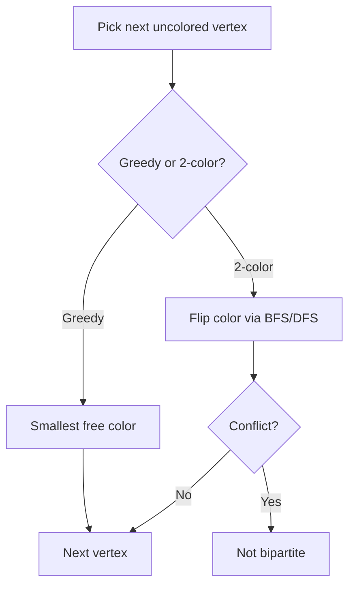

# Graph Coloring — Junior Level

> **One-line summary:** Graph coloring assigns a "color" (a label) to every vertex so that no two vertices joined by an edge share the same color; the smallest number of colors that works is the *chromatic number* `χ(G)`. The simplest practical method is greedy coloring, and the most important special case is 2-coloring, which exactly detects bipartite graphs.

---

## Table of Contents

1. [Introduction](#introduction)
2. [Prerequisites](#prerequisites)
3. [Glossary](#glossary)
4. [Core Concepts](#core-concepts)
5. [Big-O Summary](#big-o-summary)
6. [Real-World Analogies](#real-world-analogies)
7. [Pros & Cons](#pros--cons)
8. [Step-by-Step Walkthrough](#step-by-step-walkthrough)
9. [Code Examples](#code-examples)
10. [Coding Patterns](#coding-patterns)
11. [Error Handling](#error-handling)
12. [Performance Tips](#performance-tips)
13. [Best Practices](#best-practices)
14. [Edge Cases & Pitfalls](#edge-cases--pitfalls)
15. [Common Mistakes](#common-mistakes)
16. [Cheat Sheet](#cheat-sheet)
17. [Visual Animation](#visual-animation)
18. [Summary](#summary)
19. [Further Reading](#further-reading)

---

## Introduction

**Graph coloring** is one of those problems that sounds like a children's puzzle and turns out to sit at the heart of compilers, exam timetables, mobile-phone networks, and Sudoku solvers. The puzzle is: you have a graph (dots connected by lines), and you want to paint every dot with a color so that *no line connects two dots of the same color*. The only thing you are trying to minimize is **how many different colors** you need.

That minimum number has a name: the **chromatic number**, written `χ(G)` (the Greek letter chi). A triangle needs 3 colors. A square (4-cycle) needs only 2. A single line with no connections needs 1. The famous **four-color theorem** says any map drawn on a flat plane needs at most 4 colors so that neighboring countries differ — that result took over a century and a computer to prove.

Why should a junior engineer care? Because the *same* abstract problem appears everywhere once you learn to see it:

- A compiler deciding which CPU **registers** to assign to variables: two variables that are "alive" at the same time conflict (an edge), and registers are colors.
- A university scheduling **exams**: two exams sharing a student conflict, and time-slots are colors.
- A network assigning **radio frequencies**: two transmitters close enough to interfere conflict, and frequencies are colors.
- **Sudoku**: each cell is a vertex, cells in the same row/column/box are connected, and the 9 digits are colors.

In this junior file we focus on the two techniques you will actually write first: **greedy coloring** (walk the vertices in some order, give each the smallest color not used by its neighbors) and **2-coloring / bipartite checking** (a BFS or DFS that tries to split vertices into two camps). Greedy is fast and simple but *not always optimal*. The 2-coloring check, by contrast, is *exact*: a graph is 2-colorable if and only if it has no odd-length cycle.

---

## Prerequisites

Before reading this file you should be comfortable with:

- **Graph basics** — vertices, edges, adjacency lists, undirected graphs.
- **BFS and DFS** — the two standard graph traversals (see the sibling topic `02-bfs`).
- **Arrays / hash maps** — to store a color per vertex.
- **Loops and conditionals** — greedy coloring is a double loop.
- **Big-O notation** — `O(V + E)`, `O(V·Δ)`.
- **The idea of an adjacency list** — `adj[u]` returns the neighbors of `u`.

Optional but helpful:

- A little exposure to **Sudoku** or **map coloring** as motivating puzzles.
- The concept of a **cycle** in a graph (especially odd vs even length).

---

## Glossary

| Term | Meaning |
|------|---------|
| **Vertex coloring** | Assigning a color to each vertex so adjacent vertices differ. (Default meaning of "graph coloring".) |
| **Proper coloring** | A coloring with no two adjacent vertices sharing a color. The only kind we want. |
| **Color** | A label, usually `0, 1, 2, …`. Colors have no order or meaning beyond "different from neighbors". |
| **Chromatic number `χ(G)`** | The minimum number of colors in any proper coloring of `G`. |
| **`k`-colorable** | A graph that has a proper coloring using at most `k` colors. |
| **Bipartite** | A graph whose vertices split into two groups with no edge inside a group — exactly the 2-colorable graphs. |
| **Greedy coloring** | Process vertices in some order; give each the smallest color unused by its already-colored neighbors. |
| **Degree `deg(v)`** | The number of edges touching vertex `v`. |
| **Δ (Delta)** | The maximum degree in the graph. |
| **Saturation degree** | The number of *distinct colors* already used among a vertex's neighbors (used by DSATUR). |
| **Odd cycle** | A cycle with an odd number of edges (triangle = length 3). Its presence blocks 2-coloring. |
| **Edge coloring** | A different problem: color the *edges* so edges sharing a vertex differ. (Don't confuse with vertex coloring.) |

---

## Core Concepts

### 1. What "proper" means

A coloring is just a function `color: V → {0, 1, 2, …}`. It is **proper** when, for every edge `(u, v)`, we have `color[u] ≠ color[v]`. That is the *only* rule. Colors are not numbers you compare — `0` is not "less than" `1` in any meaningful way. We use integers purely because they are convenient labels and easy to count.

The whole game is: find a proper coloring that uses **as few colors as possible**. The minimum is `χ(G)`.

### 2. Easy bounds on `χ(G)`

You can bracket the chromatic number without solving it exactly:

- **Lower bound:** if the graph contains a *clique* (a set of `k` mutually-connected vertices) then `χ(G) ≥ k`, because every vertex in a clique must differ from every other. A triangle is a 3-clique, forcing `χ ≥ 3`.
- **Upper bound:** `χ(G) ≤ Δ + 1`, where `Δ` is the maximum degree. Greedy coloring proves this: a vertex has at most `Δ` neighbors, so at most `Δ` colors are blocked, leaving at least one of the first `Δ + 1` colors free.

These two facts already tell you a lot. For a triangle, `χ ≥ 3` (clique) and `χ ≤ Δ + 1 = 3`, so `χ = 3` exactly.

### 3. Greedy coloring

The greedy algorithm is the first one everyone writes:

```
greedy_color(graph):
    color = array of -1 (uncolored) for each vertex
    for v in some vertex order:
        used = set of colors of already-colored neighbors of v
        c = smallest non-negative integer not in used
        color[v] = c
    return color
```

It always produces a *proper* coloring and never uses more than `Δ + 1` colors. The catch: the **number of colors depends on the order** you visit vertices. A bad order can use many more colors than necessary, even on a graph that needs only 2.

### 4. Vertex ordering matters

Because greedy is order-dependent, people add heuristics to pick a *good* order:

- **Welsh–Powell:** sort vertices by **descending degree**, then greedy-color. High-degree vertices are the "hard" ones, so color them first while choices are plentiful.
- **DSATUR (saturation degree):** dynamically pick the *uncolored vertex whose neighbors already use the most distinct colors* (highest saturation), breaking ties by degree. DSATUR is exact on bipartite graphs and very strong in practice. We show the full version in [`middle.md`](./middle.md).

### 5. 2-coloring and bipartite detection

If you only allow **two** colors, greedy is no longer the tool — you use a BFS/DFS that *forces* alternation. Color the start vertex `0`; color every neighbor `1`; color *their* neighbors `0`; and so on. If you ever try to color a vertex with a color different from one it already has, the graph is **not** 2-colorable.

The deep fact (see `02-bfs`): **a graph is 2-colorable ⟺ it is bipartite ⟺ it has no odd-length cycle.** The BFS that 2-colors a graph is exactly the BFS that detects bipartiteness, and the vertex where it fails lies on an odd cycle.

---

## Big-O Summary

| Operation | Time | Space | Notes |
|-----------|------|-------|-------|
| Greedy coloring (fixed order) | **O(V + E)** | O(V) | Each edge examined a constant number of times. |
| Welsh–Powell (sort by degree) | **O(V log V + E)** | O(V) | Sorting dominates the extra cost. |
| DSATUR | **O((V + E) log V)** | O(V + E) | With a priority queue keyed on saturation. |
| 2-coloring / bipartite check (BFS or DFS) | **O(V + E)** | O(V) | One traversal; see `02-bfs`. |
| Computing `χ(G)` exactly | **exponential** | — | NP-hard; see [`professional.md`](./professional.md). |
| `m`-coloring feasibility (backtracking) | **O(mᵛ)** worst case | O(V) | Try all color assignments with pruning. |

The key headline: *checking* and *greedily* coloring are linear; finding the **true minimum** `χ(G)` is NP-hard and there is no known polynomial algorithm.

---

## Real-World Analogies

| Concept | Analogy |
|---------|---------|
| Proper coloring | Seating dinner guests so that no two people who dislike each other sit at the same table; tables are colors. |
| Chromatic number | The *fewest tables* you can get away with while keeping every feuding pair apart. |
| Greedy coloring | Seating guests one by one as they arrive, putting each at the first table that has no enemy of theirs. |
| Order dependence | If the troublemakers arrive last, you may need extra tables you would not have needed if they had come first. |
| Welsh–Powell | Seat the most-connected (most-feuding) guests first, while many tables are still empty. |
| 2-coloring / bipartite | Splitting a class into two debate teams so every rivalry crosses between teams — possible only if there is no "love triangle" of mutual rivalry (odd cycle). |
| Odd cycle blocks 2-coloring | Three people who all dislike each other can never be split into two teams without a conflict. |

Where the analogy breaks: real tables have capacity limits; graph colors do not. Each color class can hold any number of mutually non-adjacent vertices.

---

## Pros & Cons

| Pros | Cons |
|------|------|
| Greedy coloring is trivial to implement and runs in `O(V + E)`. | Greedy is *not* optimal and the color count depends on vertex order. |
| 2-coloring (bipartite check) is exact and linear. | Beyond 2 colors, deciding `k`-colorability is NP-hard (3-coloring already is). |
| `χ ≤ Δ + 1` gives a free, always-valid upper bound. | The gap between greedy's result and `χ(G)` can be large on adversarial graphs. |
| Models a huge variety of real problems (registers, schedules, frequencies). | Confusing vertex vs edge coloring leads to subtle bugs. |
| Heuristics (Welsh–Powell, DSATUR) are simple and dramatically improve quality. | Exact `χ(G)` needs exponential time even with the best known algorithms. |

**When to use:** scheduling with conflicts, register allocation, frequency assignment, any "assign labels so conflicting items differ" task, bipartite detection.

**When NOT to use:** when you literally need the *provably minimum* number of colors on a large general graph in guaranteed polynomial time — that does not exist (assuming P ≠ NP).

---

## Step-by-Step Walkthrough

### Greedy coloring of a small graph

Vertices `0..4`, edges: `0-1, 0-2, 1-2, 1-3, 2-3, 3-4`. We color in order `0, 1, 2, 3, 4`.

```
vertex 0: neighbors {1,2} uncolored → used={} → color 0     colors: [0, -, -, -, -]
vertex 1: neighbors {0,2,3}, colored={0:0} → used={0} → color 1   colors: [0, 1, -, -, -]
vertex 2: neighbors {0,1,3}, colored={0:0,1:1} → used={0,1} → color 2  colors: [0, 1, 2, -, -]
vertex 3: neighbors {1,2,4}, colored={1:1,2:2} → used={1,2} → color 0   colors: [0, 1, 2, 0, -]
vertex 4: neighbors {3}, colored={3:0} → used={0} → color 1            colors: [0, 1, 2, 0, 1]
```

Result: 3 colors. The triangle `0-1-2` forces at least 3, so this is optimal here.

### 2-coloring (bipartite) walkthrough

Vertices `0..3`, edges of a 4-cycle: `0-1, 1-2, 2-3, 3-0`. BFS from `0`:

```
color[0] = 0          queue: [0]
pop 0 → neighbors 1, 3 → color 1     colors: [0, 1, -, 1]   queue: [1, 3]
pop 1 → neighbors 0(=0 ok), 2 → color 0   colors: [0, 1, 0, 1]   queue: [3, 2]
pop 3 → neighbors 0(=0 ok), 2(=0 ok)      no conflict
pop 2 → neighbors 1(=1 ok), 3(=1 ok)      no conflict
```

No conflict → the 4-cycle is **bipartite** (even cycle). Now try a *triangle* `0-1, 1-2, 2-0`:

```
color[0] = 0
pop 0 → color 1 to 1 and 2          colors: [0, 1, 1]
pop 1 → neighbor 2 already colored 1, but 1's color is also 1 → CONFLICT
```

Conflict → the triangle is **not** 2-colorable (it is an odd cycle).

---

## Code Examples

### Example 1: Greedy vertex coloring

#### Go

```go
package main

import "fmt"

// greedyColor returns a proper coloring of an undirected graph given as an
// adjacency list. Vertices are 0..n-1. color[v] is the color of vertex v.
func greedyColor(n int, adj [][]int) []int {
	color := make([]int, n)
	for i := range color {
		color[i] = -1 // uncolored
	}
	for v := 0; v < n; v++ {
		used := make([]bool, n+1) // used[c] = some neighbor already has color c
		for _, u := range adj[v] {
			if color[u] != -1 {
				used[color[u]] = true
			}
		}
		c := 0
		for used[c] {
			c++
		}
		color[v] = c
	}
	return color
}

func main() {
	adj := [][]int{
		{1, 2},    // 0
		{0, 2, 3}, // 1
		{0, 1, 3}, // 2
		{1, 2, 4}, // 3
		{3},       // 4
	}
	color := greedyColor(5, adj)
	fmt.Println(color) // e.g. [0 1 2 0 1] → 3 colors
}
```

#### Java

```java
import java.util.*;

public class GreedyColoring {
    static int[] greedyColor(int n, List<List<Integer>> adj) {
        int[] color = new int[n];
        Arrays.fill(color, -1);
        for (int v = 0; v < n; v++) {
            boolean[] used = new boolean[n + 1];
            for (int u : adj.get(v)) {
                if (color[u] != -1) used[color[u]] = true;
            }
            int c = 0;
            while (used[c]) c++;
            color[v] = c;
        }
        return color;
    }

    public static void main(String[] args) {
        int[][] edges = {{0, 1}, {0, 2}, {1, 2}, {1, 3}, {2, 3}, {3, 4}};
        int n = 5;
        List<List<Integer>> adj = new ArrayList<>();
        for (int i = 0; i < n; i++) adj.add(new ArrayList<>());
        for (int[] e : edges) {
            adj.get(e[0]).add(e[1]);
            adj.get(e[1]).add(e[0]);
        }
        System.out.println(Arrays.toString(greedyColor(n, adj)));
    }
}
```

#### Python

```python
def greedy_color(n, adj):
    color = [-1] * n
    for v in range(n):
        used = set(color[u] for u in adj[v] if color[u] != -1)
        c = 0
        while c in used:
            c += 1
        color[v] = c
    return color


if __name__ == "__main__":
    edges = [(0, 1), (0, 2), (1, 2), (1, 3), (2, 3), (3, 4)]
    n = 5
    adj = [[] for _ in range(n)]
    for a, b in edges:
        adj[a].append(b)
        adj[b].append(a)
    print(greedy_color(n, adj))  # e.g. [0, 1, 2, 0, 1]
```

**What it does:** colors each vertex in index order with the smallest free color.
**Run:** `go run main.go` | `javac GreedyColoring.java && java GreedyColoring` | `python greedy.py`

### Example 2: 2-coloring / bipartite check (BFS)

#### Go

```go
package main

import "fmt"

// isBipartite tries a 2-coloring with BFS. Returns the coloring and whether it
// succeeded. Handles disconnected graphs by restarting from every vertex.
func isBipartite(n int, adj [][]int) ([]int, bool) {
	color := make([]int, n)
	for i := range color {
		color[i] = -1
	}
	for start := 0; start < n; start++ {
		if color[start] != -1 {
			continue
		}
		color[start] = 0
		queue := []int{start}
		for len(queue) > 0 {
			u := queue[0]
			queue = queue[1:]
			for _, v := range adj[u] {
				if color[v] == -1 {
					color[v] = 1 - color[u] // flip 0<->1
					queue = append(queue, v)
				} else if color[v] == color[u] {
					return color, false // odd cycle found
				}
			}
		}
	}
	return color, true
}

func main() {
	// 4-cycle: bipartite
	adj := [][]int{{1, 3}, {0, 2}, {1, 3}, {0, 2}}
	_, ok := isBipartite(4, adj)
	fmt.Println(ok) // true

	// triangle: not bipartite
	tri := [][]int{{1, 2}, {0, 2}, {0, 1}}
	_, ok2 := isBipartite(3, tri)
	fmt.Println(ok2) // false
}
```

#### Java

```java
import java.util.*;

public class Bipartite {
    static boolean isBipartite(int n, List<List<Integer>> adj) {
        int[] color = new int[n];
        Arrays.fill(color, -1);
        for (int start = 0; start < n; start++) {
            if (color[start] != -1) continue;
            color[start] = 0;
            Deque<Integer> queue = new ArrayDeque<>();
            queue.add(start);
            while (!queue.isEmpty()) {
                int u = queue.poll();
                for (int v : adj.get(u)) {
                    if (color[v] == -1) {
                        color[v] = 1 - color[u];
                        queue.add(v);
                    } else if (color[v] == color[u]) {
                        return false; // odd cycle
                    }
                }
            }
        }
        return true;
    }

    public static void main(String[] args) {
        List<List<Integer>> sq = build(4, new int[][]{{0, 1}, {1, 2}, {2, 3}, {3, 0}});
        System.out.println(isBipartite(4, sq)); // true
        List<List<Integer>> tri = build(3, new int[][]{{0, 1}, {1, 2}, {2, 0}});
        System.out.println(isBipartite(3, tri)); // false
    }

    static List<List<Integer>> build(int n, int[][] edges) {
        List<List<Integer>> adj = new ArrayList<>();
        for (int i = 0; i < n; i++) adj.add(new ArrayList<>());
        for (int[] e : edges) {
            adj.get(e[0]).add(e[1]);
            adj.get(e[1]).add(e[0]);
        }
        return adj;
    }
}
```

#### Python

```python
from collections import deque


def is_bipartite(n, adj):
    color = [-1] * n
    for start in range(n):
        if color[start] != -1:
            continue
        color[start] = 0
        queue = deque([start])
        while queue:
            u = queue.popleft()
            for v in adj[u]:
                if color[v] == -1:
                    color[v] = 1 - color[u]
                    queue.append(v)
                elif color[v] == color[u]:
                    return False  # odd cycle
    return True


if __name__ == "__main__":
    square = [[1, 3], [0, 2], [1, 3], [0, 2]]
    print(is_bipartite(4, square))  # True
    triangle = [[1, 2], [0, 2], [0, 1]]
    print(is_bipartite(3, triangle))  # False
```

**What it does:** alternates two colors level by level; reports failure when an edge joins same-colored vertices.
**Run:** same commands as above with the new file names.

---

## Coding Patterns

### Pattern 1: "Smallest available color"

**Intent:** the core of every greedy coloring. Collect the colors of already-colored neighbors, then scan `0, 1, 2, …` for the first one not in that set.

```python
used = {color[u] for u in adj[v] if color[u] != -1}
c = 0
while c in used:
    c += 1
color[v] = c
```

Use a boolean array instead of a set when colors are small and dense — it avoids hashing in hot loops.

### Pattern 2: "Alternate two colors with a traversal"

**Intent:** 2-coloring. When you only have two colors, do not run greedy — *force* the opposite color on each neighbor and check for a clash. This is the bipartite-detection pattern shared with `02-bfs`.

```python
color[v] = 1 - color[u]   # flip the parent's color
```

### Pattern 3: "Restart from every component"

**Intent:** disconnected graphs. Both greedy and 2-coloring must loop over *all* start vertices and skip ones already colored, otherwise vertices in other components stay uncolored.



---

## Error Handling

| Error | Cause | Fix |
|-------|-------|-----|
| Some vertices left uncolored (`-1`) | Forgot to restart from every component in a disconnected graph. | Loop `start` over all vertices; skip already-colored ones. |
| Improper coloring (adjacent same color) | Read a neighbor's color *before* it was set, or self-loop on a vertex. | Color vertices in a consistent pass; reject or ignore self-loops (a self-loop makes the graph uncolorable). |
| Index out of range on `used[c]` | Sized the `used` array too small. | Size it `n + 1` (a vertex has at most `Δ ≤ n - 1` neighbors, so color `≤ Δ`). |
| Bipartite check returns wrong answer | Only ran BFS from vertex 0, missing other components. | Always iterate all start vertices. |
| Treating colors as comparable numbers | Sorting or doing arithmetic on color labels. | Colors are labels only; compare with `==`/`≠`, never `<`. |

---

## Performance Tips

- **Use a boolean `used[]` array, not a hash set**, when colors are small integers — no hashing, better cache behavior.
- **Reuse the `used` buffer** across vertices by clearing only the entries you set, instead of reallocating each iteration.
- **Sort once** for Welsh–Powell; do not re-sort inside the loop.
- **Prefer BFS or iterative DFS** for 2-coloring on large graphs to avoid recursion-stack overflow.
- **Stop early** in the bipartite check the moment a conflict appears — there is no point finishing the traversal.

---

## Best Practices

- Always state whether you are doing **vertex** coloring or **edge** coloring; they are different problems.
- For 2 colors, use the **BFS/DFS bipartite check**, not greedy — it is exact and gives you the partition for free.
- Treat greedy's color count as an **upper bound**, never as `χ(G)`; document that it is a heuristic.
- Validate the result: after coloring, scan every edge and assert the endpoints differ. Cheap insurance.
- Pick a sensible **vertex order** (Welsh–Powell by degree) — it costs almost nothing and usually helps.

---

## Edge Cases & Pitfalls

- **Empty graph (no edges):** every vertex can share color `0`; `χ = 1` (or `0` if there are no vertices).
- **Self-loop:** a vertex adjacent to itself can never be properly colored; detect and reject.
- **Single vertex:** `χ = 1`.
- **Disconnected graph:** color each component independently; `χ` is the max over components.
- **Complete graph `Kₙ`:** every pair is adjacent, so `χ = n` — the worst case for coloring.
- **Odd cycle:** never 2-colorable; needs exactly 3 colors.
- **Multi-edges (parallel edges):** harmless for vertex coloring — they impose the same single constraint as one edge.

---

## Common Mistakes

1. **Assuming greedy gives `χ(G)`.** It gives *a* valid coloring, often not the minimum, and the count depends on order.
2. **Forgetting disconnected components.** Running the traversal from a single source colors only one component.
3. **Confusing vertex and edge coloring.** Vertex coloring colors dots; edge coloring colors lines (Vizing's theorem governs the latter).
4. **Using greedy for 2-coloring.** Greedy can use 2 colors on a bipartite graph *only with a lucky order*; the BFS/DFS check is the correct exact tool.
5. **Comparing color labels with `<`.** Colors are categories, not magnitudes.
6. **Sizing the `used` array to the number of colors instead of `n + 1`,** causing an out-of-bounds when a high-degree vertex is reached.

---

## Cheat Sheet

| Task | Method | Time | Optimal? |
|------|--------|------|----------|
| Color a graph quickly | Greedy (any order) | O(V + E) | No |
| Color with fewer colors | Welsh–Powell (degree order) | O(V log V + E) | No (but better) |
| Color with even fewer | DSATUR | O((V+E) log V) | Exact on bipartite |
| Check 2-colorability | BFS/DFS bipartite | O(V + E) | Yes |
| Find true minimum `χ(G)` | Backtracking / exact exponential | exponential | Yes |

Key facts:

```
χ(G) ≥ size of largest clique
χ(G) ≤ Δ + 1                      (greedy bound)
G is 2-colorable  ⟺  G is bipartite  ⟺  G has no odd cycle
A complete graph Kₙ has χ = n
```

---

## Visual Animation

> See [`animation.html`](./animation.html) for an interactive visual animation of graph coloring.
>
> The animation demonstrates:
> - Greedy coloring choosing the smallest free color, vertex by vertex
> - DSATUR picking the highest-saturation vertex each step
> - 2-coloring a graph with BFS and flagging an odd-cycle conflict
> - Step / Run / Reset controls and a running color count

---

## Summary

Graph coloring assigns colors to vertices so neighbors differ, minimizing the color count `χ(G)`. **Greedy coloring** is the workhorse — linear, simple, always proper, but order-dependent and not optimal. **2-coloring** via BFS/DFS is the one exact, fast case: it decides bipartiteness, equivalent to "no odd cycle." The bounds `χ ≥ clique size` and `χ ≤ Δ + 1` bracket the answer. Master greedy and the bipartite check here; the heuristics (Welsh–Powell, DSATUR) and the hard theory (NP-hardness, Brooks, Vizing) come in the later files.

---

## Further Reading

- *Introduction to Algorithms* (CLRS) — graph traversal foundations used by the bipartite check.
- *Graph Theory* (Bondy & Murty) — chromatic number, cliques, and bounds.
- Sibling topic `02-bfs` — bipartite detection via breadth-first search.
- Sibling topic `28-np-hard-tsp-hamiltonian` — neighboring NP-hard graph problems.
- visualgo.net — "Graph Traversal" and coloring visualizations.
- Welsh, D. J. A. & Powell, M. B. (1967) — the original degree-ordering heuristic paper.
