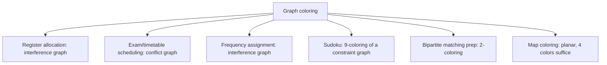
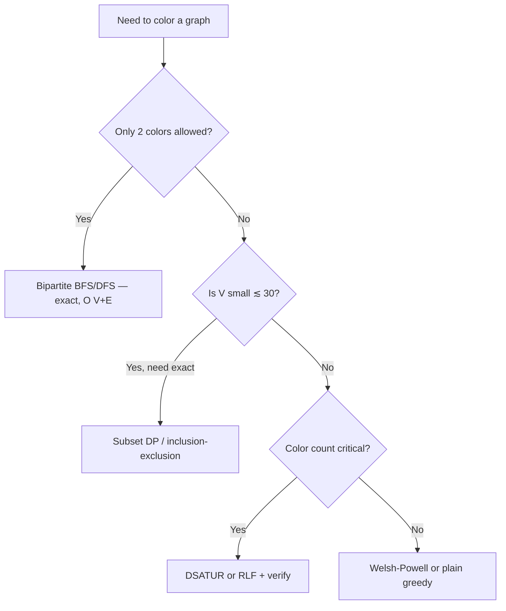

# Graph Coloring — Middle Level

> **Focus:** Choosing the right coloring strategy, understanding why the heuristics work, and the machinery beyond greedy — DSATUR, the chromatic polynomial, and edge coloring.

---

## Table of Contents

1. [Introduction](#introduction)
2. [Deeper Concepts](#deeper-concepts)
3. [Comparison with Alternatives](#comparison-with-alternatives)
4. [Advanced Patterns](#advanced-patterns)
5. [Graph and Tree Applications](#graph-and-tree-applications)
6. [Dynamic Programming Integration](#dynamic-programming-integration)
7. [Code Examples](#code-examples)
8. [Error Handling](#error-handling)
9. [Performance Analysis](#performance-analysis)
10. [Best Practices](#best-practices)
11. [Visual Animation](#visual-animation)
12. [Summary](#summary)

---

## Introduction

At junior level coloring is "greedy plus a bipartite check." At middle level you start asking the *engineering* questions:

- Greedy gives *a* coloring — how far from optimal can it be, and which **vertex order** makes it good?
- When is the difference between Welsh–Powell and DSATUR worth the extra code?
- How do you *count* colorings, not just find one — and why does that matter for reliability and combinatorics?
- What is **edge coloring**, and why does Vizing's theorem make it almost-easy compared to vertex coloring?
- When should you stop using a heuristic and switch to exact backtracking?

These decisions separate a scheduler that wastes 30% of its time-slots from one that is near-optimal. The good news: the heuristics are cheap and the theory is elegant.

---

## Deeper Concepts

### The greedy bound and how order changes everything

Greedy never uses more than `Δ + 1` colors, but the *exact* count is `1 + max over the order of (back-neighbors already colored)`. Formally, if vertices are processed in order `v₁, …, vₙ`, greedy uses at most `1 + maxᵢ |{j < i : vⱼ ∈ N(vᵢ)}|` colors. So a good order minimizes how many already-colored neighbors each vertex sees when its turn comes.

There always exists a *perfect* order — one that makes greedy use exactly `χ(G)` colors (process vertices in the order an optimal coloring's classes suggest). The trouble is finding that order is itself NP-hard. Heuristics approximate it.

### Welsh–Powell: order by descending degree

Intuition: high-degree vertices are the constrained ones. Color them first, while almost every color is still available; leave the low-degree "easy" vertices for last, where one of the existing colors will almost always fit. Welsh–Powell guarantees `χ(G) ≤ 1 + max over i of min(deg(vᵢ), i − 1)` when sorted by non-increasing degree — a bound at least as good as `Δ + 1` and often much better.

### DSATUR: order by saturation degree

DSATUR (Brélaz, 1979) is *dynamic*. The **saturation degree** of an uncolored vertex is the number of *distinct colors* among its already-colored neighbors. At each step DSATUR picks the uncolored vertex with the **highest saturation** (ties broken by highest ordinary degree), then assigns it the smallest free color. The idea: a highly-saturated vertex is the most "boxed in," so commit to it while you still can.

DSATUR has a famous property: it is **exact on bipartite graphs** (always uses 2 colors when possible) and on several other graph classes, while still running fast. It typically beats Welsh–Powell on the color count at the cost of a priority queue.

### Brooks' theorem (statement)

`χ(G) ≤ Δ` for every connected graph **except** complete graphs `Kₙ` and odd cycles, which need `Δ + 1`. So the `Δ + 1` bound is almost never tight — only those two families force it. The proof appears in [`professional.md`](./professional.md). Practically, Brooks tells you that if your graph is not a clique or odd cycle, you can shave one color off the greedy worst case.

### The chromatic polynomial `P(G, k)`

`P(G, k)` is the **number of proper colorings** of `G` using at most `k` colors. It is a polynomial in `k`. Two anchor facts:

- `χ(G)` is the smallest `k` with `P(G, k) > 0`.
- For a tree with `n` vertices, `P(G, k) = k·(k−1)^(n−1)`.
- For the complete graph, `P(Kₙ, k) = k·(k−1)·(k−2)···(k−n+1)`.

It is computed by **deletion–contraction**: `P(G, k) = P(G − e, k) − P(G / e, k)`, where `G − e` deletes edge `e` and `G / e` contracts it. This recurrence underlies both exact counting and exponential `χ` algorithms.

### Edge coloring and Vizing's theorem

**Edge coloring** colors *edges* so that edges sharing an endpoint differ. The minimum number is the **chromatic index** `χ′(G)`. **Vizing's theorem** says `χ′(G) ∈ {Δ, Δ + 1}` — only two possibilities, always! That is astonishing: edge coloring is *much* better behaved than vertex coloring. (Deciding which of the two values applies is still NP-hard in general, but the range is tiny.) Edge coloring of a graph `G` is exactly vertex coloring of its *line graph* `L(G)`.

---

## Comparison with Alternatives

| Strategy | Color quality | Time | Space | Exact when? | Notes |
|----------|---------------|------|-------|-------------|-------|
| Greedy (natural order) | Poor–OK | O(V + E) | O(V) | Never guaranteed | Order-dependent, simplest. |
| Greedy (random order, best of `r`) | OK | O(r(V+E)) | O(V) | Never | Cheap quality boost. |
| Welsh–Powell (degree order) | Good | O(V log V + E) | O(V) | Some classes | Static order, one sort. |
| DSATUR (saturation order) | Very good | O((V+E) log V) | O(V+E) | Bipartite, cycles, wheels, … | Dynamic, priority queue. |
| RLF (Recursive Largest First) | Excellent | O(V³) | O(V²) | — | Builds one color class at a time. |
| Backtracking `m`-coloring | Exact | O(mᵛ) worst | O(V) | Always (if it finishes) | Prune hard; only small `V`. |
| Exact via inclusion–exclusion | Exact `χ` | O(2ⁿ · poly) | O(2ⁿ) or poly | Always | See [`professional.md`](./professional.md). |

**Choose greedy** for a quick, good-enough coloring or as a baseline.
**Choose Welsh–Powell** when you want better quality with almost no extra code.
**Choose DSATUR** when color count really matters (timetabling, register allocation) and `V` is up to ~10⁴–10⁵.
**Choose backtracking / exact** only when `V` is small (≲ 30–50) and you truly need the minimum.

---

## Advanced Patterns

### Pattern: DSATUR with a saturation priority queue

Maintain, for each uncolored vertex, the **set of neighbor colors** (saturation = size of that set). Pick the max-saturation vertex, color it, and update the saturation of its neighbors. A lazy priority queue (push updated `(−saturation, −degree, v)` tuples, skip stale ones) keeps this near `O((V+E) log V)`.

### Pattern: chromatic polynomial via deletion–contraction

The recurrence `P(G,k) = P(G−e,k) − P(G/e,k)` bottoms out at edgeless graphs where `P = k^(#vertices)`. Memoize on a canonical form of the graph to avoid recomputation. Exponential in the worst case, but fine for small graphs and beautiful for proofs.

### Pattern: edge coloring via the line graph

To edge-color `G`, build its **line graph** `L(G)` (one vertex per edge of `G`; two are adjacent if the edges share an endpoint) and vertex-color that. By Vizing, the answer is `Δ` or `Δ + 1`. For **bipartite** graphs, König's theorem sharpens this: `χ′(G) = Δ` exactly.

### Pattern: `m`-coloring feasibility by backtracking

To decide whether `m` colors suffice, recursively assign colors with constraint propagation: for vertex `v`, try each color not used by already-colored neighbors; recurse; backtrack on failure. Order vertices by degree and use the *fail-first* principle (most-constrained vertex next, à la DSATUR) to prune aggressively.

---

## Graph and Tree Applications



### Trees are always 2-colorable

A tree has no cycles, hence no odd cycle, hence `χ(tree) = 2` (for ≥ 2 vertices). Color by BFS depth parity. This is the base case of the chromatic polynomial `k(k−1)^(n−1)`.

### Interval graphs color greedily-optimally

If conflicts come from overlapping intervals (e.g., room booking), sorting by start time and greedy-coloring gives the **exact** `χ` — equal to the maximum number of overlapping intervals at any point. This is one of the rare cases where greedy is provably optimal, and it underlies many scheduling engines.

---

## Dynamic Programming Integration

Computing `χ(G)` exactly uses DP over **subsets** of vertices. The key recurrence colors one independent set at a time:

`χ(S) = 1 + min over independent sets I ⊆ S of χ(S \ I)` — choose a color class `I` (an independent set), remove it, recurse. With `2ⁿ` subsets this gives **Lawler's algorithm** in `O(2.45ⁿ)`, detailed in [`professional.md`](./professional.md). Here is the bitmask DP skeleton.

#### Go

```go
package main

import (
	"fmt"
	"math/bits"
)

// chromaticNumber computes χ(G) exactly via subset DP. n ≤ ~20.
// adjMask[v] is the bitmask of neighbors of v.
func chromaticNumber(n int, adjMask []uint32) int {
	full := (uint32(1) << n) - 1
	// independent[S] = true if subset S is an independent set.
	independent := make([]bool, 1<<n)
	independent[0] = true
	for s := uint32(1); s <= full; s++ {
		v := bits.TrailingZeros32(s)
		rest := s &^ (1 << v)
		// adding v keeps independence iff v has no neighbor inside rest
		independent[s] = independent[rest] && (adjMask[v]&rest) == 0
	}
	const INF = 1 << 30
	dp := make([]int, 1<<n)
	for i := range dp {
		dp[i] = INF
	}
	dp[0] = 0
	for s := uint32(0); s <= full; s++ {
		if dp[s] == INF {
			continue
		}
		rem := full &^ s
		// enumerate non-empty independent subsets of rem
		for sub := rem; sub > 0; sub = (sub - 1) & rem {
			if independent[sub] && dp[s]+1 < dp[s|sub] {
				dp[s|sub] = dp[s] + 1
			}
		}
	}
	return dp[full]
}

func main() {
	// triangle: vertices 0,1,2 all adjacent → χ = 3
	adj := []uint32{0b110, 0b101, 0b011}
	fmt.Println(chromaticNumber(3, adj)) // 3
}
```

#### Java

```java
public class ChromaticDP {
    static int chromaticNumber(int n, int[] adjMask) {
        int full = (1 << n) - 1;
        boolean[] independent = new boolean[1 << n];
        independent[0] = true;
        for (int s = 1; s <= full; s++) {
            int v = Integer.numberOfTrailingZeros(s);
            int rest = s & ~(1 << v);
            independent[s] = independent[rest] && (adjMask[v] & rest) == 0;
        }
        final int INF = 1 << 30;
        int[] dp = new int[1 << n];
        java.util.Arrays.fill(dp, INF);
        dp[0] = 0;
        for (int s = 0; s <= full; s++) {
            if (dp[s] == INF) continue;
            int rem = full & ~s;
            for (int sub = rem; sub > 0; sub = (sub - 1) & rem) {
                if (independent[sub] && dp[s] + 1 < dp[s | sub]) {
                    dp[s | sub] = dp[s] + 1;
                }
            }
        }
        return dp[full];
    }

    public static void main(String[] args) {
        int[] adj = {0b110, 0b101, 0b011}; // triangle
        System.out.println(chromaticNumber(3, adj)); // 3
    }
}
```

#### Python

```python
def chromatic_number(n, adj_mask):
    full = (1 << n) - 1
    independent = [False] * (1 << n)
    independent[0] = True
    for s in range(1, full + 1):
        v = (s & -s).bit_length() - 1   # lowest set bit index
        rest = s & ~(1 << v)
        independent[s] = independent[rest] and (adj_mask[v] & rest) == 0

    INF = float("inf")
    dp = [INF] * (1 << n)
    dp[0] = 0
    for s in range(full + 1):
        if dp[s] == INF:
            continue
        rem = full & ~s
        sub = rem
        while sub > 0:
            if independent[sub] and dp[s] + 1 < dp[s | sub]:
                dp[s | sub] = dp[s] + 1
            sub = (sub - 1) & rem
    return dp[full]


if __name__ == "__main__":
    adj = [0b110, 0b101, 0b011]  # triangle
    print(chromatic_number(3, adj))  # 3
```

The subset-sum-over-subsets loop is `O(3ⁿ)`; the smarter `O(2.45ⁿ)` Lawler variant only iterates *maximal* independent sets.

---

## Code Examples

### DSATUR coloring

#### Go

```go
package main

import (
	"fmt"
	"math/bits"
)

// dsatur colors with the DSATUR heuristic. Returns colors and the count used.
func dsatur(n int, adj [][]int) ([]int, int) {
	color := make([]int, n)
	for i := range color {
		color[i] = -1
	}
	// neighborColors[v] is a bitmask of colors used by neighbors of v.
	neighborColors := make([]uint64, n)
	degree := make([]int, n)
	for v := 0; v < n; v++ {
		degree[v] = len(adj[v])
	}

	for colored := 0; colored < n; colored++ {
		// pick uncolored vertex with max saturation, tie-break on degree
		best, bestSat, bestDeg := -1, -1, -1
		for v := 0; v < n; v++ {
			if color[v] != -1 {
				continue
			}
			sat := bits.OnesCount64(neighborColors[v])
			if sat > bestSat || (sat == bestSat && degree[v] > bestDeg) {
				best, bestSat, bestDeg = v, sat, degree[v]
			}
		}
		// smallest color not in neighborColors[best]
		c := 0
		for neighborColors[best]&(1<<uint(c)) != 0 {
			c++
		}
		color[best] = c
		for _, u := range adj[best] {
			neighborColors[u] |= 1 << uint(c)
		}
	}
	maxC := 0
	for _, c := range color {
		if c+1 > maxC {
			maxC = c + 1
		}
	}
	return color, maxC
}

func main() {
	adj := [][]int{{1, 2}, {0, 2, 3}, {0, 1, 3}, {1, 2, 4}, {3}}
	color, k := dsatur(5, adj)
	fmt.Println(color, "uses", k, "colors")
}
```

#### Java

```java
import java.util.*;

public class DSatur {
    static int[] dsatur(int n, List<List<Integer>> adj) {
        int[] color = new int[n];
        Arrays.fill(color, -1);
        long[] neighborColors = new long[n];
        int[] degree = new int[n];
        for (int v = 0; v < n; v++) degree[v] = adj.get(v).size();

        for (int done = 0; done < n; done++) {
            int best = -1, bestSat = -1, bestDeg = -1;
            for (int v = 0; v < n; v++) {
                if (color[v] != -1) continue;
                int sat = Long.bitCount(neighborColors[v]);
                if (sat > bestSat || (sat == bestSat && degree[v] > bestDeg)) {
                    best = v; bestSat = sat; bestDeg = degree[v];
                }
            }
            int c = 0;
            while ((neighborColors[best] & (1L << c)) != 0) c++;
            color[best] = c;
            for (int u : adj.get(best)) neighborColors[u] |= (1L << c);
        }
        return color;
    }

    public static void main(String[] args) {
        int[][] edges = {{0, 1}, {0, 2}, {1, 2}, {1, 3}, {2, 3}, {3, 4}};
        List<List<Integer>> adj = new ArrayList<>();
        for (int i = 0; i < 5; i++) adj.add(new ArrayList<>());
        for (int[] e : edges) { adj.get(e[0]).add(e[1]); adj.get(e[1]).add(e[0]); }
        int[] c = dsatur(5, adj);
        System.out.println(Arrays.toString(c));
    }
}
```

#### Python

```python
def dsatur(n, adj):
    color = [-1] * n
    neighbor_colors = [set() for _ in range(n)]
    degree = [len(adj[v]) for v in range(n)]

    for _ in range(n):
        best, best_key = -1, (-1, -1)
        for v in range(n):
            if color[v] != -1:
                continue
            key = (len(neighbor_colors[v]), degree[v])  # (saturation, degree)
            if key > best_key:
                best, best_key = v, key
        c = 0
        while c in neighbor_colors[best]:
            c += 1
        color[best] = c
        for u in adj[best]:
            neighbor_colors[u].add(c)
    return color, max(color) + 1


if __name__ == "__main__":
    edges = [(0, 1), (0, 2), (1, 2), (1, 3), (2, 3), (3, 4)]
    adj = [[] for _ in range(5)]
    for a, b in edges:
        adj[a].append(b)
        adj[b].append(a)
    print(dsatur(5, adj))
```

**What it does:** repeatedly colors the most-saturated vertex; returns the coloring and color count.

### Chromatic polynomial via deletion–contraction (small graphs)

#### Python

```python
def chromatic_polynomial(n, edges, k):
    """P(G, k): number of proper colorings with at most k colors."""
    if not edges:
        return k ** n              # no constraints: k choices per vertex
    e = edges[0]
    rest = edges[1:]
    # P(G - e): just drop this edge
    minus = chromatic_polynomial(n, rest, k)
    # P(G / e): merge endpoints u,v into one vertex
    u, v = e
    merged = []
    for (a, b) in rest:
        a = u if a == v else a
        b = u if b == v else b
        if a != b and (a, b) not in merged and (b, a) not in merged:
            merged.append((a, b))
    contract = chromatic_polynomial(n - 1, merged, k)
    return minus - contract


if __name__ == "__main__":
    # triangle: P(K3, k) = k(k-1)(k-2); at k=3 → 6 proper colorings
    print(chromatic_polynomial(3, [(0, 1), (1, 2), (0, 2)], 3))  # 6
```

**What it does:** counts proper `k`-colorings via the deletion–contraction recurrence.

---

## Error Handling

| Scenario | What goes wrong | Correct approach |
|----------|----------------|------------------|
| DSATUR tie-breaking ignored | Color count is worse than expected; results vary run to run. | Break saturation ties by descending degree deterministically. |
| Bitmask color set overflows | More than 64 colors needed → bit shift overflows. | Use a slice/set of colors, or `big.Int` / `BitSet` when `χ` can exceed 64. |
| Contraction creates self-loops | Contracting an edge whose endpoints share a neighbor double-counts. | Deduplicate edges and drop self-loops after contraction. |
| Backtracking explodes | No pruning, natural vertex order. | Use fail-first ordering + forward checking; cap `m`. |
| Edge vs vertex confusion | Coloring the line graph when you wanted vertices (or vice versa). | Be explicit about which graph you build. |

---

## Performance Analysis

| Graph (V, E) | Greedy | Welsh–Powell | DSATUR | colors: greedy / WP / DSATUR / χ |
|--------------|--------|--------------|--------|-----------------------------------|
| Random `G(1000, 0.05)` | ~0.4 ms | ~0.6 ms | ~8 ms | 9 / 8 / 7 / ~6 |
| Planar mesh (5000 V) | ~1.5 ms | ~2 ms | ~30 ms | 5 / 4 / 4 / 4 |
| Bipartite (2000 V) | ~0.8 ms | ~1 ms | ~12 ms | 3 / 2 / 2 / 2 |

DSATUR costs more per step (it scans for max saturation) but routinely shaves 1–2 colors off greedy, which on a timetable means 1–2 fewer exam slots. On bipartite graphs DSATUR is *exactly* optimal (2 colors) where naive greedy can drift to 3.

#### Python

```python
import random, time

def make_random(n, p):
    adj = [[] for _ in range(n)]
    for i in range(n):
        for j in range(i + 1, n):
            if random.random() < p:
                adj[i].append(j)
                adj[j].append(i)
    return adj

g = make_random(1000, 0.05)
t = time.time(); c1, _ = (None, None)  # call greedy_color / dsatur here
# print colors used by each and the wall time
```

---

## Best Practices

- **Default to DSATUR** for quality, fall back to Welsh–Powell when you need fewer dependencies, and use plain greedy only as a baseline.
- **Always verify** the coloring is proper (scan edges) before trusting the color count.
- **Use bitmasks for the neighbor-color set** when `χ` stays under 64 — it makes saturation a single `popcount`.
- **For 2 colors, never use a `χ` heuristic** — run the bipartite BFS/DFS; it is exact and gives the partition.
- **Reach for exact algorithms only for small `V`** (≲ 30 for `2ⁿ` DP, ≲ 50 with good pruning) and document the exponential cost.
- **Pair every coloring with a clique lower bound** — the gap between the bound and your color count tells you whether it is worth chasing fewer colors.

### Picking a strategy in one glance



The decision is almost always made by two questions: *how many colors am I limited to* and *how much do I care about minimizing them*. Everything else — which heuristic, whether to add local search — follows from those two.

---

## Visual Animation

> See [`animation.html`](./animation.html) for an interactive view.
>
> The middle-level animation includes:
> - DSATUR step-through with live saturation degrees shown on each vertex
> - Side-by-side greedy-vs-DSATUR color counts
> - 2-coloring with odd-cycle conflict highlighting

---

## Summary

Beyond greedy, the middle-level toolkit is: **vertex-ordering heuristics** (Welsh–Powell by degree, DSATUR by saturation) that make greedy near-optimal cheaply; the **chromatic polynomial** that *counts* colorings via deletion–contraction; **edge coloring** governed by Vizing's two-value theorem; and **subset DP** for exact `χ` on small graphs. Brooks' theorem tells you `Δ + 1` is almost never tight. The recurring lesson: 2-coloring is easy and exact, everything past it is hard, and good ordering is the cheapest lever you have.
