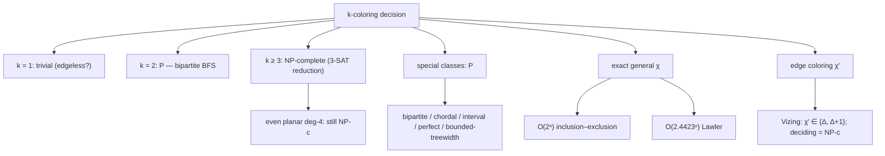

# Graph Coloring — Mathematical Foundations and Complexity Theory

## Table of Contents
1. Formal Definitions
2. The Greedy Bound and a Correctness Proof
3. Brooks' Theorem (Proof Sketch)
4. Bipartiteness ⟺ 2-Colorable ⟺ No Odd Cycle (Proof)
5. NP-Hardness of χ and of 3-Coloring
6. The Chromatic Polynomial via Deletion–Contraction (Proof)
7. Exact χ by Inclusion–Exclusion in O(2ⁿ·poly)
8. Lawler's O(2.4423ⁿ) Algorithm
9. Edge Coloring and Vizing's Theorem
10. Lower Bounds, Approximation Hardness, and Open Problems
11. Summary
12. Further Reading

---

## 0. Orientation: the complexity landscape in one picture

Before the proofs, here is the terrain. Graph coloring is the canonical example of a problem with a razor-sharp easy/hard boundary, and almost every theorem below is a precise statement of *where* that boundary lies.



The reader should leave this file able to place any coloring question on this map: *is it 2 colors (easy), a special class (easy), small (exact), edges (Vizing window), or general vertices (hard)?*

---

## 1. Formal Definitions

Let `G = (V, E)` be a finite simple undirected graph, `n = |V|`, `m = |E|`.

**Definition 1.1 (Proper k-coloring).** A function `c : V → {1, …, k}` is a *proper k-coloring* if for every edge `{u, v} ∈ E`, `c(u) ≠ c(v)`.

**Definition 1.2 (Chromatic number).**
```
χ(G) = min { k : a proper k-coloring of G exists }.
```

**Definition 1.3 (Color classes).** A proper coloring partitions `V` into *color classes* `V₁, …, V_k`, where `Vᵢ = c⁻¹(i)`. Each `Vᵢ` is an **independent set** (no edge inside it). Hence `χ(G)` equals the minimum number of independent sets needed to cover `V` — the *vertex partition into independent sets*.

**Definition 1.4 (Clique number).** `ω(G)` is the size of the largest clique (complete subgraph). Since every vertex of a clique needs a distinct color:
```
χ(G) ≥ ω(G).                              (clique lower bound)
```

**Definition 1.5 (Maximum degree).** `Δ(G) = maxᵥ deg(v)`.

**Definition 1.6 (Chromatic index / edge coloring).** A proper *edge* `k`-coloring assigns colors to `E` so that edges sharing an endpoint differ; `χ′(G)` is the minimum such `k`. Equivalently `χ′(G) = χ(L(G))`, the vertex chromatic number of the line graph.

**Definition 1.6b (Independent set, clique cover).** An *independent set* is a vertex set with no internal edge; `α(G)` is the size of the largest one. A *clique cover* partitions `V` into cliques. Note the duality: a proper coloring of `G` is a partition into independent sets, which is exactly a clique cover of the complement `Ḡ`. Hence `χ(G) = θ(Ḡ)` (clique cover number of the complement), and `α(G) = ω(Ḡ)`. These complement dualities recur throughout the theory and underlie the Lovász theta sandwich `ω(G) ≤ θ(Ḡ) ≤ χ(G)`.

**Definition 1.7 (Chromatic polynomial).** `P(G, k)` is the number of *distinct* proper colorings of `G` with at most `k` colors (colors are labeled). `χ(G) = min { k ∈ ℕ : P(G, k) > 0 }`.

**Proposition 1.8 (Basic identities).** The following bound `χ` from above and below:
```
ω(G) ≤ χ(G) ≤ Δ(G) + 1,
χ(G) ≥ n / α(G),
χ(G) · α(G) ≥ n,
χ(G) ≥ n²/(n² − 2m),
```
where `α(G)` is the independence number (largest independent set) and `m = |E|`. The bound `χ ≥ n/α` holds because each color class is an independent set of size at most `α`, so you need at least `n/α` of them to cover `n` vertices. The Hoffman/Wilf eigenvalue bounds `χ ≥ 1 + λ_max/|λ_min|` (using the adjacency spectrum) give further, sometimes much stronger, lower bounds — useful when no large clique is visible.

**Proposition 1.9 (Monotonicity).** Coloring is *hereditary*: `χ(H) ≤ χ(G)` for any subgraph `H ⊆ G`, and adding an edge can only keep `χ` equal or increase it by at most 1. Contracting an edge can increase `χ` arbitrarily. These monotonicities justify both the clique lower bound and the deletion–contraction recurrence.

---

## 2. The Greedy Bound and a Correctness Proof

**Theorem 2.1.** For any graph `G`, `χ(G) ≤ Δ(G) + 1`, and the greedy algorithm achieves it under any vertex order.

**Greedy algorithm.** Process `v₁, …, vₙ` in some fixed order. Assign `c(vᵢ)` the smallest color in `{1, 2, …}` not used by already-colored neighbors of `vᵢ`.

**Proof.** When `vᵢ` is colored, the only forbidden colors are those of its already-colored neighbors, of which there are at most `deg(vᵢ) ≤ Δ`. Among the colors `{1, …, Δ+1}`, at least one is free (pigeonhole: `Δ` forbidden values cannot exhaust `Δ + 1` slots). So `c(vᵢ) ≤ Δ + 1`. The result is proper because each vertex avoids all *colored* neighbors, and every edge has a later-colored endpoint that performs this avoidance. ∎

**Theorem 2.2 (Order-dependent count).** Greedy on the order `v₁, …, vₙ` uses exactly
```
1 + maxᵢ | { j < i : {vⱼ, vᵢ} ∈ E } |   (in the worst placement of free colors)
```
and there exists an order (the *Grundy-optimal* / perfect order derived from an optimal coloring) for which greedy uses exactly `χ(G)` colors.

**Proof of existence of a perfect order.** Take an optimal coloring with classes `V₁, …, V_{χ}`. List all of `V₁`, then all of `V₂`, …, then `V_{χ}`. When coloring a vertex `v ∈ Vₜ`, all of its neighbors in classes `V₁, …, V_{t−1}` are already colored and they occupy at most colors `1, …, t−1` (one might be missing), so greedy assigns `v` a color `≤ t`. Hence greedy never exceeds `χ`. Since `χ` is the minimum, it uses exactly `χ`. ∎

The catch: producing such an order is NP-hard (it would solve the coloring), so heuristics like DSATUR only *approximate* the perfect order.

**Definition 2.3 (Grundy number).** The **Grundy number** `Γ(G)` is the *largest* number of colors greedy can use over all vertex orders — the worst case. `χ(G) ≤ Γ(G) ≤ Δ + 1`. Graphs where `Γ` is much larger than `χ` exist (e.g. the crown graph / complete bipartite with a perfect matching removed shows `Γ` can be `Θ(n)` while `χ = 2`). This quantifies *how bad* a bad order can be, and motivates DSATUR over arbitrary greedy.

**Complexity of the heuristics.**

| Algorithm | Time | Color guarantee |
|-----------|------|------------------|
| Greedy (fixed order) | `O(n + m)` | `≤ Δ + 1`, between `χ` and `Γ` |
| Welsh–Powell | `O(n log n + m)` | `≤ 1 + maxᵢ min(deg(vᵢ), i−1)` |
| DSATUR | `O((n + m) log n)` | exact on bipartite/cycles/wheels; strong elsewhere |
| RLF | `O(n³)` | typically best heuristic color count |
| Exact (IE / Lawler) | `O(2ⁿ)` / `O(2.4423ⁿ)` | optimal |

---

## 3. Brooks' Theorem (Proof Sketch)

**Theorem 3.1 (Brooks, 1941).** Let `G` be a connected graph. Then `χ(G) ≤ Δ(G)` **unless** `G` is a complete graph `K_{Δ+1}` or an odd cycle, in which cases `χ(G) = Δ(G) + 1`.

**Why the exceptions.** `K_{n}` has `Δ = n − 1` and `χ = n = Δ + 1`. An odd cycle `C_{2t+1}` has `Δ = 2` and `χ = 3 = Δ + 1`. Brooks says these are the *only* connected graphs that hit the trivial `Δ + 1` bound.

**Proof sketch.** Assume `G` connected, not complete, not an odd cycle.

- If `Δ ≤ 2`: `G` is a path or an even cycle (the odd cycle is excluded), both of which are 2-colorable, so `χ ≤ 2 ≤ Δ`.
- If `Δ ≥ 3`: the strategy is to find a vertex ordering `v₁, …, vₙ` such that **every vertex except the last has a later neighbor**, and the last vertex `vₙ` has at most `Δ − 1` *distinct* colors among its neighbors when greedy reaches it. Greedy on such an order uses ≤ `Δ` colors.
  - If `G` is not regular, root a BFS/DFS at a maximum-degree vertex `r` and order vertices by *decreasing* distance from `r` (so `r` is last). Each non-root vertex has a parent (a later neighbor), guaranteeing it sees `< deg(v) ≤ Δ` colored neighbors; `r` has degree `Δ` but, being non-regular elsewhere, the structure leaves it a free color.
  - If `G` is `Δ`-regular and 2-connected and not complete: one uses the existence of two non-adjacent neighbors `v₁, v₂` of a vertex `vₙ` whose removal keeps `G − {v₁, v₂}` connected (a result enabled by 2-connectivity). Color `v₁, v₂` the same color first; then order the rest by decreasing distance from `vₙ`. Each vertex again has a later neighbor, and `vₙ` sees its `Δ` neighbors using at most `Δ − 1` distinct colors (because `v₁, v₂` share one), leaving a free color.

This gives `χ ≤ Δ`. The full argument (Lovász's short proof) carefully handles 1-cut vertices and the regular case. ∎

**Consequence.** In practice, the only conflict graphs forcing `Δ + 1` colors are cliques and odd cycles; everything else can be colored within `Δ`.

**The Kempe-chain tool inside the proof.** Both Brooks' theorem and Vizing's theorem (§9) lean on the same device: a **Kempe chain** is a maximal connected subgraph induced by exactly two colors `{a, b}`. Swapping `a ↔ b` throughout one such component keeps the coloring proper, because every boundary vertex of the component has no neighbor of the other color inside it. This local recoloring is the universal "free move" of coloring proofs and of practical local-search engines (see [`senior.md`](./senior.md)). A vertex `v` with `< Δ` distinct colors on its neighbors has a free color; the proofs work by *manufacturing* such a situation via chain swaps.

**Lovász's clean argument (high level).** For a `Δ`-regular 2-connected non-complete graph, Lovász picks a vertex `vₙ` and two non-adjacent neighbors `a, b` of `vₙ` such that `G − a − b` is connected (existence guaranteed by 2-connectivity and non-completeness). He colors `a, b` identically, then orders the rest by decreasing BFS distance from `vₙ` so every vertex but `vₙ` has a later-colored neighbor. Greedy then colors everyone in `≤ Δ` colors: each interior vertex sees `< Δ` colored neighbors, and `vₙ` sees its `Δ` neighbors using only `Δ − 1` colors because `a` and `b` share one. The 1-connected case reduces to blocks via induction. This is the full content behind the sketch above.

---

## 4. Bipartiteness ⟺ 2-Colorable ⟺ No Odd Cycle (Proof)

**Theorem 4.1.** For a graph `G`, the following are equivalent:
(a) `G` is 2-colorable (`χ(G) ≤ 2`);
(b) `G` is bipartite;
(c) `G` contains no cycle of odd length.

**Proof.**

**(a) ⟺ (b).** A 2-coloring partitions `V` into `V₁, V₂`, each independent — that *is* a bipartition. Conversely a bipartition `(A, B)` gives the 2-coloring `c(A) = 1, c(B) = 2`. The two notions are definitionally identical.

**(b) ⟹ (c).** Suppose `G` is bipartite with parts `A, B`. Any cycle alternates between `A` and `B` on each step. Returning to the start requires an even number of steps, so every cycle has even length. Hence no odd cycle.

**(c) ⟹ (a).** Assume `G` has no odd cycle. Run BFS from each component root `r`, setting `c(v) = dist(r, v) mod 2`. We claim this is proper. Take any edge `{u, v}`. In BFS, `|dist(r,u) − dist(r,v)| ≤ 1`. If `dist(r,u) = dist(r,v)`, then `u` and `v` are at the same BFS level; the tree paths `r⇝u` and `r⇝v` plus the edge `{u,v}` form a closed walk. Letting `w` be the lowest common ancestor, the cycle `w⇝u → v⇝w` has length `(d_u − d_w) + 1 + (d_v − d_w) = 2(d − d_w) + 1`, which is **odd** — contradicting (c). Therefore `dist(r,u) ≠ dist(r,v)`, they differ by 1, and `c(u) ≠ c(v)`. The coloring is proper, so `χ ≤ 2`. ∎

**Algorithmic corollary.** The BFS that builds this parity coloring is exactly the bipartite-detection BFS (sibling topic `02-bfs`): it succeeds iff `G` is bipartite, and the edge where two equal-level endpoints meet exhibits an odd cycle. This is the unique polynomial-time case of vertex coloring optimality.

---

## 5. NP-Hardness of χ and of 3-Coloring

**Theorem 5.1.** Deciding whether `χ(G) ≤ 3` (the **3-COLORING** problem) is NP-complete.

**Proof (reduction from 3-SAT, sketch).** 3-COLORING is in NP: a coloring is a polynomial-size certificate checkable in `O(m)`. For hardness, reduce 3-SAT. Build a gadget graph with three special colors interpreted as **True (T)**, **False (F)**, and **Base (B)**:

- A *truth triangle* `{T, F, B}` (a `K₃`) fixes three reference colors; every other gadget connects to `B` so it must be colored `T` or `F`.
- Each variable `xᵢ` gets two vertices `xᵢ, ¬xᵢ` joined to each other and to `B`, forcing them to opposite truth colors (one `T`, one `F`).
- Each clause `(ℓ₁ ∨ ℓ₂ ∨ ℓ₃)` gets an **OR-gadget** (a small fixed subgraph) wired to the three literal vertices and to `T/F` such that the gadget is 3-colorable **iff at least one literal is colored `T`**.

The whole construction is polynomial in the formula size, and the graph is 3-colorable iff the formula is satisfiable. Hence 3-COLORING is NP-complete. ∎

**Corollary 5.2.** Computing `χ(G)` is NP-hard (a polynomial χ-oracle decides 3-COLORING). Moreover the *optimization* problem inherits hardness.

**Theorem 5.3 (Inapproximability).** Unless P = NP, `χ(G)` cannot be approximated within `n^{1−ε}` for any `ε > 0` (Feige–Kilian / Zuckerman, via PCP). So no polynomial algorithm even gets *close* in the worst case. This is why production systems rely on heuristics with no worst-case guarantee, plus instance-specific lower bounds (cliques).

**Note.** 2-COLORING is in P (§4), but 3-COLORING is NP-complete — the complexity jump from 2 to 3 colors is the sharpest in the field. 3-coloring stays NP-complete even for planar graphs of max degree 4.

### 5.1 The OR-gadget in detail

The crux of the 3-SAT reduction is the clause gadget. For a clause `(ℓ₁ ∨ ℓ₂ ∨ ℓ₃)`, the standard gadget chains two "OR-gates." A single OR-gate takes two input literal vertices `a, b` and produces an output vertex `o` such that, with the reference colors `T, F, B` fixed by the truth triangle:

- the gate is properly 3-colorable for *every* assignment of `T/F` to `a, b`, **and**
- the output `o` can be colored `T` **iff** at least one of `a, b` is `T`; if both are `F`, then `o` is forced to `F`.

The gadget is a fixed 5-vertex subgraph (two inner triangle-sharing vertices wired to `a`, `b`, and `o`, plus a connection to `B`). Chaining two gates — `OR(ℓ₁, ℓ₂) = o₁`, then `OR(o₁, ℓ₃) = o₂` — yields a clause output `o₂` colorable `T` iff some literal is `T`. Finally wire `o₂` so that it is **forced to `T`** (connect it to `F` and `B`). The whole clause is 3-colorable iff the clause is satisfied. Summing over all clauses and variables, the graph is 3-colorable iff the formula is satisfiable, and the reduction is clearly polynomial-size and polynomial-time. ∎

### 5.2 Hardness on restricted classes

3-COLORING remains NP-complete under surprisingly strong restrictions:

- **Planar graphs of maximum degree 4** (Garey–Johnson–Stockmeyer). The four-color theorem makes planar graphs 4-colorable, but *deciding* 3-colorability stays hard.
- **Graphs with no induced path `P₆`** and several other hereditary classes.
- **Triangle-free planar graphs are always 3-colorable** (Grötzsch's theorem) — a rare class where the answer is "yes" for free, so the *decision* is trivial though *finding* the coloring took clever algorithms.

These boundary results are why practitioners cannot rely on "my graph is sparse/planar/low-degree" to make exact coloring tractable; only very specific structure (bounded treewidth, perfection, intervals) buys polynomial time.

---

## 6. The Chromatic Polynomial via Deletion–Contraction (Proof)

**Theorem 6.1 (Deletion–Contraction).** For any edge `e = {u, v} ∈ E`,
```
P(G, k) = P(G − e, k) − P(G / e, k),
```
where `G − e` deletes `e` and `G / e` contracts `e` (merge `u, v`, remove resulting loops/parallels).

**Proof.** Count proper colorings of `G − e` (which has *no* constraint between `u` and `v`) and split them by whether `c(u) = c(v)`:

- Colorings of `G − e` with `c(u) ≠ c(v)` are exactly the proper colorings of `G` (the edge `e` is now satisfied). Count: `P(G, k)`.
- Colorings of `G − e` with `c(u) = c(v)` correspond bijectively to proper colorings of `G / e` (identifying `u, v` into one vertex that carries their shared color). Count: `P(G / e, k)`.

These two classes partition all proper colorings of `G − e`, so
```
P(G − e, k) = P(G, k) + P(G / e, k)  ⇒  P(G, k) = P(G − e, k) − P(G / e, k). ∎
```

**Corollary 6.2 (Polynomiality).** By induction on `m`: the edgeless graph on `n` vertices has `P = kⁿ` (a polynomial), and deletion–contraction subtracts two polynomials, so `P(G, k)` is a polynomial in `k` of degree `n`, with leading term `kⁿ` and integer, alternating-sign coefficients.

**Examples.**
- Tree on `n` vertices: `P = k(k−1)^{n−1}`. (Root it; each child has one already-colored parent.)
- Complete graph: `P(Kₙ, k) = k(k−1)(k−2)···(k−n+1)` (falling factorial).
- Cycle `Cₙ`: `P(Cₙ, k) = (k−1)ⁿ + (−1)ⁿ(k−1)`.
- Disjoint union: `P(G ∪ H, k) = P(G, k) · P(H, k)` — colorings of independent components multiply.
- Gluing at a vertex (1-sum): `P(G ·_v H, k) = P(G, k) · P(H, k) / k` — divide out the shared vertex's `k` choices.

These multiplicative rules, combined with deletion–contraction, let you compute `P` for any graph built from simple pieces without enumerating colorings, and they explain why series-parallel and other "tree-like" graphs have closed-form chromatic polynomials.

`χ(G)` is the least integer `k` with `P(G, k) > 0`; e.g. `P(C₅, 2) = 1 + (−1) = 0` and `P(C₅, 3) = 2⁵ − 2 = 30 > 0`, confirming `χ(C₅) = 3`.

**Theorem 6.3 (Coefficient facts — Whitney, Birkhoff).** Write `P(G, k) = Σ_{i} (−1)^{n−i} a_i k^i` with `a_i ≥ 0`. Then:
- `a_n = 1` (leading coefficient).
- `a_{n−1} = m` (number of edges).
- The signs strictly alternate, and `P(G, 0) = 0`, `P(G, 1) = 0` whenever `G` has any edge.
- The coefficients are given by Whitney's broken-circuit theorem: `a_i` counts spanning subgraphs with `i` connected components and no "broken circuit," a purely combinatorial characterization.

**Theorem 6.4 (Acyclic orientations — Stanley).** `P(G, −1) = (−1)ⁿ · (number of acyclic orientations of G)`. This *reciprocity* result links proper colorings to orientations and is a gateway to the Tutte polynomial, of which the chromatic polynomial is a one-variable specialization: `P(G, k) = (−1)^{n−c} k^c · T_G(1 − k, 0)`, where `c` is the number of components.

**Worked deletion–contraction (path `P₃`, vertices a–b–c).**
```
P(P₃, k) = P(P₃ − bc, k) − P(P₃ / bc, k)
         = P(edge ab + isolated c, k) − P(edge a-(bc), k)
         = k(k−1)·k  −  k(k−1)
         = k²(k−1) − k(k−1) = k(k−1)(k−1) = k(k−1)²,
```
matching the tree formula `k(k−1)^{n−1}` with `n = 3`.

---

## 7. Exact χ by Inclusion–Exclusion in O(2ⁿ·poly)

**Theorem 7.1 (Björklund–Husfeldt–Koivisto, 2006).** `χ(G)` can be computed in `O(2ⁿ · n^{O(1)})` time and `O(2ⁿ)` space (or polynomial space with a slowdown).

**Setup.** Let `s(S)` = number of independent sets contained in subset `S ⊆ V`. Let `c_k(V)` = number of ways to cover `V` by an ordered tuple of `k` independent sets (classes may overlap; we only need *coverability*). By inclusion–exclusion over which vertices are *missed*:
```
c_k(V) = Σ_{S ⊆ V} (−1)^{|V \ S|} · s(S)^k.
```

**Why it works.** `s(S)^k` counts ordered `k`-tuples of independent sets all drawn from inside `S`. The signed sum sieves out every tuple that fails to cover all of `V`, leaving exactly the tuples of `k` independent sets whose union is `V`. The graph is `k`-colorable **iff** `c_k(V) > 0` (some cover by `k` independent sets exists; a cover by independent sets is precisely a proper `k`-coloring after making classes disjoint).

**Algorithm.**
1. Compute `s(S)` for all `2ⁿ` subsets by the recurrence
   `s(S) = s(S − {v}) + s(S − {v} − N(v))` for any `v ∈ S` (a vertex is either out of the independent set, or in it and forbids its neighbors). `O(2ⁿ · n)`. The recurrence is a clean partition: independent subsets of `S` either avoid the chosen pivot `v` (counted by `s(S − {v})`) or contain `v`, in which case they must avoid all of `v`'s neighbors (counted by `s(S − {v} − N(v))`). These two cases are disjoint and exhaustive, so the counts add.
2. For `k = 1, 2, …`: evaluate `c_k(V) = Σ_S (−1)^{n−|S|} s(S)^k`. The first `k` with `c_k(V) > 0` is `χ(G)`. Each evaluation is `O(2ⁿ)`.

**Worked check on `K₃` (triangle, χ = 3).** Independent subsets of `{1,2,3}` (all pairwise adjacent) are exactly `∅` and the three singletons, so `s(∅) = 1`, `s({i}) = 2` for each singleton (∅ and itself), `s({i,j}) = 3`, `s(V) = 4`. For `k = 2`:
```
c_2(V) = (+1)·4²  + (−1)·3·3²  + (+1)·3·2²  + (−1)·1·1²
       = 16 − 27 + 12 − 1 = 0,
```
so `K₃` is not 2-colorable. For `k = 3` the analogous sum is positive (it equals `3! = 6`, the proper 3-colorings), confirming `χ(K₃) = 3`. This matches the chromatic polynomial `P(K₃, k) = k(k−1)(k−2)`, which is `0` at `k = 2` and `6` at `k = 3`.

Total: `O(2ⁿ · n)`, since `χ ≤ n`. This is the asymptotically simplest exact algorithm and dramatically better than the naive `O(kⁿ)` brute force.

**Correctness in detail.** Fix `k`. Each ordered `k`-tuple `(I₁, …, I_k)` of independent sets contributes `1` to `s(S)^k` for *every* `S ⊇ I₁ ∪ … ∪ I_k`. Let `U = I₁ ∪ … ∪ I_k`. The signed total contributed by this tuple across all `S` is
```
Σ_{S : U ⊆ S ⊆ V} (−1)^{n−|S|} = Σ_{T ⊆ V∖U} (−1)^{n−|U|−|T|}.
```
That inner sum is `0` unless `V ∖ U = ∅` (i.e. `U = V`), by the binomial identity `Σ_T (−1)^{|T|} = 0` over a nonempty set. So only tuples that *cover* `V` survive, each contributing exactly `±1` that resolves to `+1`. Therefore `c_k(V)` counts exactly the ordered `k`-tuples of independent sets whose union is `V` — which is positive iff a proper `k`-coloring exists (split overlaps arbitrarily to make classes disjoint). This is the inclusion–exclusion sieve made precise. ∎

**Reference implementation (counts independent subsets, the heart of the method).**

#### Python

```python
def chromatic_via_inclusion_exclusion(n, adj_mask):
    full = (1 << n) - 1
    # s[S] = number of independent subsets contained in S
    s = [0] * (1 << n)
    s[0] = 1
    for S in range(1, 1 << n):
        v = (S & -S).bit_length() - 1            # a vertex in S
        without_v = S & ~(1 << v)
        without_closed = without_v & ~adj_mask[v]  # remove v and its neighbors
        s[S] = s[without_v] + s[without_closed]

    def coverable(k):
        total = 0
        for S in range(full + 1):
            sign = -1 if (n - bin(S).count("1")) & 1 else 1
            total += sign * (s[S] ** k)
        return total > 0

    k = 1
    while not coverable(k):
        k += 1
    return k


if __name__ == "__main__":
    # C5 (5-cycle): chromatic number 3
    adj = [0] * 5
    for a, b in [(0, 1), (1, 2), (2, 3), (3, 4), (4, 0)]:
        adj[a] |= 1 << b
        adj[b] |= 1 << a
    print(chromatic_via_inclusion_exclusion(5, adj))  # 3
```

#### Go

```go
package main

import (
	"fmt"
	"math/bits"
)

func chromaticIE(n int, adjMask []uint32) int {
	full := 1 << n
	s := make([]int64, full) // s[S] = # independent subsets of S
	s[0] = 1
	for S := 1; S < full; S++ {
		v := bits.TrailingZeros32(uint32(S))
		woV := S &^ (1 << v)
		woClosed := woV &^ int(adjMask[v])
		s[S] = s[woV] + s[woClosed]
	}
	coverable := func(k int) bool {
		var total int64
		for S := 0; S < full; S++ {
			pow := int64(1)
			for i := 0; i < k; i++ {
				pow *= s[S]
			}
			if (n-bits.OnesCount32(uint32(S)))&1 == 1 {
				total -= pow
			} else {
				total += pow
			}
		}
		return total > 0
	}
	for k := 1; ; k++ {
		if coverable(k) {
			return k
		}
	}
}

func main() {
	adj := []uint32{0b10010, 0b00101, 0b01010, 0b10100, 0b01001} // C5
	fmt.Println(chromaticIE(5, adj)) // 3
}
```

**Numerical caution.** `s(S)^k` grows astronomically for large `n` (it can exceed `2^{64}`). Production implementations carry the computation modulo a few large primes and use the Chinese Remainder Theorem to detect `c_k(V) ≠ 0`, since "is the count nonzero" only needs a residue that is nonzero modulo at least one prime. This keeps the method within fixed-width integers while preserving correctness of the *decision*.

---

## 8. Lawler's O(2.4423ⁿ) Algorithm

**Theorem 8.1 (Lawler, 1976).** `χ(G)` can be computed in `O(2.4423ⁿ)` time via subset dynamic programming over **maximal independent sets**.

This was, for thirty years, the fastest known exact algorithm, and it is historically the first to break the trivial `O(kⁿ)` brute force decisively. Its idea — *peel off one color class (a maximal independent set) at a time and recurse on the remainder* — directly mirrors the practical "construct" phase of schedulers, which is why it remains pedagogically central even after the `O(2ⁿ)` inclusion–exclusion method superseded it asymptotically.

**Recurrence.** For `S ⊆ V`, let `χ(S)` be the chromatic number of the induced subgraph `G[S]`. Then
```
χ(S) = 1 + min { χ(S \ I) : I is a maximal independent set of G[S] }.
```
We may restrict to *maximal* independent sets `I` without loss: an optimal coloring always has a color class that is maximal (you can extend any class to a maximal one without increasing the count).

**Complexity.** The DP fills `2ⁿ` subset entries. The cost is bounded by the total number of `(S, I)` pairs where `I` is a maximal independent set of `G[S]`. A theorem of Moon–Moser bounds the maximal independent sets of an `n`-vertex graph by `3^{n/3} ≈ 1.4423ⁿ`; summing over all subsets gives `Σ_i C(n,i) · 3^{i/3} = (1 + 3^{1/3})ⁿ ≈ 2.4423ⁿ`. This was the best known for decades; the inclusion–exclusion method of §7 later achieved a cleaner `O(2ⁿ)`.

**Why maximal suffices (proof).** Suppose an optimal coloring uses class `C` as the color-1 set, and `C` is not maximal — some vertex `x ∉ C` has no neighbor in `C`. Move `x` into class 1. This stays proper (x has no color-1 neighbor) and does not increase the number of classes. Repeating until class 1 is maximal shows an optimal coloring with a *maximal* first class always exists. Hence restricting `I` to maximal independent sets in the recurrence loses no optimality while cutting the branching factor from `2^{|S|}` independent subsets to `3^{|S|/3}` maximal ones. ∎

**Memory–time trade-off.** The full `2ⁿ`-entry DP table needs `O(2ⁿ)` space. A polynomial-space variant recomputes via recursion with memoization limited to a frontier, trading a polynomial slowdown for `O(poly·2^{n/2})`-ish space — relevant when `n ≈ 30` makes `2ⁿ` integers infeasible to store but time is available.

**Practical note.** Both exact methods are usable only for `n ≲ 25–30`. The `2ⁿ` method wins on time; Lawler's wins when maximal independent sets are scarce. Production uses them on small residual cores after heuristic decomposition (see [`senior.md`](./senior.md)).

**Branch-and-bound in practice.** For instances slightly beyond the reach of pure subset DP, the exact algorithm of choice is branch-and-bound with the DSATUR branching rule:

1. Maintain a current best `χ_ub` (upper bound) from a heuristic coloring and a lower bound `χ_lb` from a maximal clique.
2. Branch on the most-saturated uncolored vertex (DSATUR order), trying each feasible color plus *one* new color (symmetry breaking: never introduce two fresh colors at the same vertex — they are interchangeable).
3. Prune a node when the colors used so far reach `χ_ub`, or when `χ_lb = χ_ub` (optimal found).

The clique lower bound and the symmetry-breaking rule are what make this finish on graphs with `n` in the dozens to low hundreds, far beyond `2ⁿ`. The worst case is still exponential, but typical structured instances (timetables, register graphs) solve quickly because they have small `χ` and tight clique bounds.

**Theorem 8.2 (Fixed-parameter view).** 3-coloring (and `k`-coloring for fixed `k`) is not believed to be fixed-parameter tractable in the natural parameter (it is NP-complete for `k ≥ 3`), but it *is* polynomial when parameterized by **treewidth**: a tree decomposition of width `w` colors in `O(k^w · poly)` via DP over bags. This is why coloring is easy on series-parallel graphs, outerplanar graphs, and other bounded-treewidth families — a practically important escape hatch.

---

## 9. Edge Coloring and Vizing's Theorem

**Theorem 9.1 (Vizing, 1964).** For every simple graph `G`,
```
Δ(G) ≤ χ′(G) ≤ Δ(G) + 1.
```

So the chromatic index takes only **two** possible values. Graphs with `χ′ = Δ` are *Class 1*; those with `χ′ = Δ + 1` are *Class 2*. (Deciding the class is NP-complete in general — Holyer's theorem — but the *value* is pinned to a window of two.)

**Lower bound.** `χ′ ≥ Δ` is immediate: the `Δ` edges at a maximum-degree vertex pairwise share that vertex, so they need `Δ` distinct colors.

**Upper bound proof sketch (`χ′ ≤ Δ + 1`).** Color edges one at a time with palette `{1, …, Δ+1}`. Suppose all but edge `e = uv₀` are colored. Vertex `u` has at most `Δ` colored edges, so a color `α` is *missing* at `u`; similarly some `β` is missing at `v₀`. If `α = β`, color `e` with it. Otherwise build a **Vizing fan**: a maximal sequence `v₀, v₁, …` of neighbors of `u` where the edge `uvᵢ₊₁` carries the color missing at `vᵢ`. Using an **α/β Kempe chain** (the maximal path alternating colors `α` and `β`), one can shift colors along the fan and the chain to free a color for `e`. The argument always terminates because the chain is a simple path. ∎

**König's theorem (bipartite refinement).** If `G` is bipartite then `χ′(G) = Δ` exactly (every bipartite graph is Class 1). This is why bipartite edge coloring — and therefore optimal *bipartite matching decomposition* — is polynomial: a `Δ`-edge-coloring decomposes a `Δ`-regular bipartite graph into `Δ` perfect matchings.

**Proof of König's edge-coloring theorem (sketch).** Embed `G` into a `Δ`-regular bipartite graph `G⁺` by adding dummy vertices/edges (always possible: a bipartite graph with max degree `Δ` extends to `Δ`-regular bipartite). A `Δ`-regular bipartite graph has a perfect matching (Hall's theorem: every vertex subset `S` on one side has `|N(S)| ≥ |S|` because edge counts force it). Remove that matching as color 1; the remainder is `(Δ−1)`-regular bipartite. Induct: extract `Δ` perfect matchings, one per color. Restricting back to `G` gives a proper `Δ`-edge-coloring. ∎

**The class-deciding NP-completeness (Holyer).** Even for *cubic* (`Δ = 3`) graphs, deciding whether `χ′ = 3` or `χ′ = 4` is NP-complete. So Vizing pins the answer to two values, but the *exact* value is as hard as 3-SAT in general. A cubic graph with `χ′ = 4` is called a *snark* (e.g. the Petersen graph) — these are exactly the cubic graphs *not* 3-edge-colorable, and they connect to the four-color theorem (a planar cubic bridgeless graph is 3-edge-colorable iff the underlying map is 4-face-colorable, by Tait's theorem).

**Contrast with vertex coloring.** Vertex `χ` has no constant-width window — it ranges over `[ω, Δ+1]` and is inapproximable. Edge `χ′` is always within 1 of `Δ`. Confusing the two (vertex vs edge) is a classic source of bugs; they are different problems with very different complexity profiles.

**Constructive Vizing in `O(mn)`.** The proof of the upper bound is *algorithmic*: processing edges one at a time and resolving each with a fan + Kempe chain gives a `(Δ+1)`-edge-coloring in `O(mn)` time (Misra–Gries algorithm). So while *deciding the class* (whether `χ′ = Δ` or `Δ+1`) is NP-complete, *producing* a `(Δ+1)`-coloring — which is at most one color above optimal — is polynomial. For most engineering purposes one extra color is acceptable, so edge coloring is effectively a solved problem in practice, unlike vertex coloring.

**Total coloring.** A *total coloring* colors vertices *and* edges so that adjacent/incident objects all differ. The total chromatic number `χ″` satisfies `χ″ ≥ Δ + 1` trivially, and the **total coloring conjecture** (still open) posits `χ″ ≤ Δ + 2`. It unifies vertex and edge coloring and is the subject of active research; bounds of `Δ + O(1)` are known via probabilistic arguments (Molloy–Reed).

---

## 10. Lower Bounds, Approximation Hardness, and Open Problems

- **Clique lower bound:** `χ ≥ ω`. Tight for *perfect* graphs (where `χ(H) = ω(H)` for every induced subgraph `H`); these include bipartite, chordal, and interval graphs, all colorable in polynomial time. In practice, compute a *heuristic* maximum clique (greedy or Tomita's branch-and-bound) to get a usable floor even though exact `ω` is itself NP-hard — any clique you can exhibit is a valid lower bound on `χ`.
- **Fractional and Lovász-theta bounds:** `ω ≤ θ(Ḡ) ≤ χ` (the Lovász theta function), computable in polynomial time via semidefinite programming — a rare poly-time *bound* sandwiching the NP-hard `χ`.
- **Approximation hardness:** `χ` is inapproximable within `n^{1−ε}` unless P = NP (§5). No constant-factor approximation exists. The best *positive* result is an `O(n (log log n)² / (log n)³)`-factor approximation (Halldórsson) — sublinear but still very far from constant, underscoring how hard even approximate coloring is.
- **Hadwiger's conjecture (open):** every graph with no `K_t` minor is `(t−1)`-colorable — a vast generalization of the four-color theorem (the `t = 5` case), proven only up to `t = 6`. It is widely regarded as one of the deepest open problems in graph theory; even an `O(t · polylog t)` bound in place of `t − 1` was a major recent result (Delcourt–Postle, building on Norin–Song).
- **Four-color theorem (proved):** every planar graph is 4-colorable (Appel–Haken 1976, computer-assisted; Robertson–Sanders–Seymour–Thomas 1997 cleaner proof). Deciding 3-colorability of planar graphs remains NP-complete.

  *Why 4 and not fewer?* `K₄` is planar and needs 4 colors, so 3 never suffices in general. The five-color theorem (every planar graph is 5-colorable) has a short, classical proof via a degree-≤5 vertex and a Kempe-chain argument; tightening 5 to 4 is what required the massive computer-assisted case analysis (1482 reducible configurations in the modern proof). The theorem is *existential* — it guarantees a 4-coloring exists — but a *quadratic-time algorithm* to find one also exists (Robertson et al.), so map coloring is polynomial even though general 3-coloring is not.
- **Total coloring conjecture (open):** the total chromatic number (vertices + edges) is at most `Δ + 2`.

### 10.0 The clique bound is not tight — Mycielski's construction

A natural hope is that `χ = ω` always, i.e. that high chromatic number is *caused* by large cliques. This is **false**, and dramatically so.

**Theorem 10.1 (Mycielski, 1955).** For every `k` there exists a **triangle-free** graph (`ω = 2`) with `χ = k`.

**Construction.** From a graph `G` with vertices `v₁, …, vₙ`, the *Mycielskian* `μ(G)` adds a copy `u₁, …, uₙ` and one apex `w`:
- each `uᵢ` is joined to the neighbors of `vᵢ` in `G` (but not to `vᵢ` itself, and `uᵢ` are mutually non-adjacent),
- `w` is joined to all `uᵢ`.

Then `μ(G)` is triangle-free if `G` is, and `χ(μ(G)) = χ(G) + 1`. Starting from `K₂` (`χ = 2`, triangle-free) and iterating gives the **Grötzsch graph** (`χ = 4`, triangle-free, 11 vertices) and beyond. This proves the clique lower bound `χ ≥ ω` can be *arbitrarily loose*: no local obstruction (a clique) explains the coloring difficulty. It is a key reason `χ` resists polynomial algorithms — the hardness is global, not local.

### 10.0b Random graphs

For the Erdős–Rényi random graph `G(n, 1/2)`, almost surely
```
χ(G(n, 1/2)) = (1 + o(1)) · n / (2 log₂ n).
```
(Bollobás, 1988). So a typical dense graph needs about `n / (2 log₂ n)` colors — far more than the `Θ(log n)`-size largest clique, again illustrating the `χ`–`ω` gap. This concentration result also means heuristics like DSATUR have a well-defined target to aim at on random instances, and their empirical color counts cluster near this value.

These results frame the practical reality: exact `χ` is intractable and even hard to approximate, so the field lives on **heuristics** (DSATUR, RLF), **exact methods for tiny `n`** (§7–8), and **special graph classes** (perfect graphs) where polynomial optimality is recovered.

### 10.1 Polynomial-time colorable classes

The escape hatches from NP-hardness are entire graph families where `χ` is computable in polynomial time:

| Class | Why colorable in P | χ characterization |
|-------|--------------------|--------------------|
| **Bipartite** | Parity BFS (§4) | `χ ≤ 2`; `χ = 2` iff any edge exists |
| **Trees / forests** | Special bipartite | `χ = 2` (≥ 2 vertices), `1` if edgeless |
| **Interval graphs** | Sort by left endpoint, greedy | `χ = ω = ` max overlap |
| **Chordal graphs** | Perfect elimination order | `χ = ω`; reverse-PEO greedy is optimal |
| **Comparability graphs** | Dilworth / antichain cover | `χ = ω` |
| **Bounded treewidth `w`** | DP over tree decomposition | `O(k^w·poly)` |
| **Perfect graphs** | Lovász theta / ellipsoid SDP | `χ = ω` for all induced subgraphs |

**Theorem 10.2 (Perfect graphs, Grötschel–Lovász–Schrijver).** For perfect graphs, `χ`, `ω`, the maximum independent set, and the minimum clique cover are *all* computable in polynomial time via the Lovász theta function and semidefinite programming. This is striking because each of these problems is NP-hard on general graphs.

**Theorem 10.3 (Strong Perfect Graph Theorem, Chudnovsky–Robertson–Seymour–Thomas, 2006).** A graph is perfect iff it contains no odd hole (induced odd cycle of length ≥ 5) and no odd antihole. This finally characterized the class Berge conjectured in 1961, and it tells you exactly which graphs enjoy `χ = ω` everywhere.

### 10.2 Chordal graphs and the elimination ordering

A graph is **chordal** if every cycle of length ≥ 4 has a chord. Chordal graphs admit a **perfect elimination ordering (PEO)**: an order `v₁, …, vₙ` where each `vᵢ`'s later neighbors form a clique. Greedy coloring on the *reverse* PEO uses exactly `ω = χ` colors. A PEO is found in linear time by **lexicographic BFS**. This is the theoretical backbone of SSA register allocation (interference graphs of SSA programs are chordal), explaining why modern compilers color registers optimally in polynomial time despite the general problem being NP-hard.

---

## 11. Summary

The mathematics of graph coloring is a study in sharp complexity boundaries. The greedy bound `χ ≤ Δ + 1` is elementary and constructive; **Brooks' theorem** shows it is essentially never tight (only cliques and odd cycles). **2-coloring is exactly bipartiteness is exactly "no odd cycle"** — the one polynomial, optimal case, provable by a parity BFS. From 3 colors on, the problem is **NP-complete** and **inapproximable within `n^{1−ε}`**. The **chromatic polynomial** counts colorings via deletion–contraction and pins `χ` as its smallest positive root; exact `χ` is computable in **`O(2ⁿ)`** by inclusion–exclusion or **`O(2.4423ⁿ)`** by Lawler's maximal-independent-set DP. **Edge coloring** is far gentler: **Vizing's theorem** confines `χ′` to `{Δ, Δ+1}`, and König's theorem makes the bipartite case exactly `Δ`. The gap between the easy edge problem and the brutal vertex problem is the single most important thing to internalize.

The deepest practical lessons from the theory:

1. **The clique bound `χ ≥ ω` can be arbitrarily loose** (Mycielski) — high `χ` is a *global* phenomenon, not explained by any local clique. This is why no purely local heuristic can guarantee optimality.
2. **The polynomial escape hatches are structural, not statistical** — bipartite, chordal, interval, comparability, bounded-treewidth, and perfect graphs are colorable in P; "sparse" or "planar" alone is not enough (3-coloring is NP-complete even for planar degree-4 graphs).
3. **Edge coloring is effectively solved** — Misra–Gries produces a `(Δ+1)`-edge-coloring in `O(mn)`, at most one color from optimal; vertex coloring has no such luxury.
4. **Exact `χ` is reachable only for tiny `n` or special structure** — `O(2ⁿ)` for general `n ≲ 25`, branch-and-bound with clique bounds for structured instances in the dozens to hundreds, polynomial for the special classes above.

A senior practitioner internalizes these as a decision tree: *Is it 2 colors? Use BFS. Is it a special class? Use the polynomial algorithm. Is it small? Solve exactly. Otherwise, run DSATUR/RLF, validate every edge, bound the gap with a clique, and accept "good enough."*

---

## 12. Further Reading

- Cormen, Leiserson, Rivest, Stein — *Introduction to Algorithms* — graph coloring and NP-completeness foundations.
- Diestel — *Graph Theory* — Brooks' theorem, Vizing's theorem, perfect graphs, full proofs.
- Jensen & Toft — *Graph Coloring Problems* — the encyclopedic reference, open problems.
- Björklund, Husfeldt, Koivisto (2009) — "Set partitioning via inclusion–exclusion" — the `O(2ⁿ)` `χ` algorithm.
- Chudnovsky, Robertson, Seymour, Thomas (2006) — the Strong Perfect Graph Theorem.
- Misra & Gries (1992) — a constructive proof of Vizing's theorem.
- Sibling topics: `02-bfs` (bipartite detection), `28-np-hard-tsp-hamiltonian` (neighboring NP-hard problems).

---

## Appendix: Quick Theorem Index

| Result | Statement | Status |
|--------|-----------|--------|
| Greedy bound | `χ ≤ Δ + 1` | Elementary |
| Brooks | `χ ≤ Δ` unless `Kₙ` or odd cycle | Theorem |
| 2-color ⟺ bipartite ⟺ no odd cycle | Three-way equivalence | Theorem |
| 3-COLORING | NP-complete (even planar deg-4) | Theorem |
| `χ` inapproximability | within `n^{1−ε}` unless P = NP | Theorem |
| Deletion–contraction | `P(G,k)=P(G−e,k)−P(G/e,k)` | Identity |
| Stanley reciprocity | `P(G,−1)=(−1)ⁿ·#acyclic orientations` | Theorem |
| Inclusion–exclusion `χ` | `O(2ⁿ·n)` exact | Algorithm |
| Lawler `χ` | `O(2.4423ⁿ)` exact | Algorithm |
| Vizing | `χ′ ∈ {Δ, Δ+1}` | Theorem |
| König | bipartite ⇒ `χ′ = Δ` | Theorem |
| Holyer | deciding `χ′` is NP-complete | Theorem |
| Mycielski | triangle-free graphs with `χ` arbitrarily large | Construction |
| Four-color | planar ⇒ 4-colorable | Theorem (computer-assisted) |
| Strong Perfect Graph | perfect ⟺ no odd hole/antihole | Theorem |
| Hadwiger | no `K_t` minor ⇒ `(t−1)`-colorable | Conjecture (open) |
| Total coloring | `χ″ ≤ Δ + 2` | Conjecture (open) |

Use this as a recall checklist: a senior engineer should be able to state each row and say whether it makes coloring *easier* (an algorithm or a polynomial class) or merely *bounds* the difficulty (a theorem about `χ`'s value).
