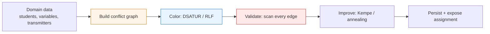

# Graph Coloring — Senior Level

> Graph coloring is rarely a standalone service; it is the algorithm hiding inside a compiler's register allocator, a university's timetabling engine, and a telecom's spectrum planner. At senior level the question is not "how do I color a graph" but "where does coloring sit in this system, what does it cost when the graph is huge or changes constantly, and what do I do when the optimal answer is unreachable in the time I have?"

## Table of Contents
1. [Introduction](#1-introduction)
2. [Register Allocation by Graph Coloring](#2-register-allocation-by-graph-coloring)
3. [Timetabling and Scheduling Engines](#3-timetabling-and-scheduling-engines)
4. [Frequency and Channel Assignment](#4-frequency-and-channel-assignment)
5. [Architecture Patterns for Coloring at Scale](#5-architecture-patterns-for-coloring-at-scale)
6. [Incremental and Dynamic Recoloring](#6-incremental-and-dynamic-recoloring)
7. [Code Examples](#7-code-examples)
8. [Choosing a Heuristic at Scale](#8-choosing-a-heuristic-at-scale)
9. [Observability](#9-observability)
10. [Failure Modes](#10-failure-modes)
11. [Capacity Planning and Summary](#11-capacity-planning-and-summary)

---

## 1. Introduction

A senior engineer meets graph coloring most often *embedded* in a larger system. The graph is never handed to you cleanly — you have to *build the conflict graph* from domain data, and that construction step is usually where the bugs and the performance cliffs live. Three production lenses recur:

- **Register allocation** — variables are vertices, simultaneous liveness is an edge, machine registers are colors. Coloring failures become *spills* (extra memory traffic), so the cost function is "minimize spills," not "minimize colors."
- **Scheduling / timetabling** — events are vertices, shared resources are edges, time-slots are colors. Coloring failures become "no feasible timetable," and soft constraints (preferences) ride on top of the hard coloring constraint.
- **Frequency assignment** — transmitters are vertices, interference is an edge, frequencies are colors. Here colors carry a *distance* metric (adjacent channels also interfere), turning it into a generalized coloring.

Because exact `χ(G)` is NP-hard, senior decisions are about **trading optimality for time**: pick a heuristic (DSATUR, RLF), bound the search, accept a coloring that is "good enough," and reserve exact methods for the small, hot subproblems. The rest of this file is those trade-offs in production terms.

A recurring senior anti-pattern worth flagging up front: **reaching for an exact solver too early**. Because computing `χ` is NP-hard, engineers sometimes assume they need an ILP/CP solver from day one. In reality, a DSATUR coloring plus a clique lower bound almost always answers "is this near-optimal?" in milliseconds, and a time-boxed local-search phase closes most of the remaining gap. The exact solver is reserved for the small, dense *residual core* that survives heuristic decomposition — typically a handful of vertices, not the whole graph. Spending the engineering budget on *building the conflict graph correctly* and *validating every edge* pays off far more than chasing the last color with an exponential solver.

---

## 2. Register Allocation by Graph Coloring

### 2.1 The interference graph

In a compiler back end, each program variable (more precisely each *live range* of a virtual register) becomes a vertex. Two live ranges **interfere** — get an edge — if they are simultaneously live at some program point, because they cannot share a physical register. The machine offers `k` physical registers; a proper `k`-coloring is a valid register assignment, and any vertex that cannot be colored is **spilled** to the stack.

This is **Chaitin's algorithm** (1981) and its refinement **Chaitin–Briggs**. The pipeline:

1. Build the interference graph from liveness analysis.
2. **Simplify:** repeatedly remove any vertex with degree `< k` and push it on a stack. Such a vertex is *trivially colorable* — fewer than `k` neighbors means a free color always exists.
3. **Spill:** if every remaining vertex has degree `≥ k`, pick a spill candidate (lowest spill-cost / degree heuristic), mark it as a potential spill, remove it, continue simplify.
4. **Select:** pop vertices off the stack, assigning each the lowest free color. A potential spill that finds a free color is saved (optimistic coloring, the Briggs improvement); otherwise it becomes an actual spill.

### 2.2 Why this is the canonical application

The `degree < k` simplify rule is the operational heart of the `χ ≤ Δ + 1` bound: if you can keep peeling low-degree vertices, you never need more than `k` colors. Coalescing (merging non-interfering move-related nodes) complicates the graph but reduces register-to-register copies. The senior insight: register allocation is *not* "minimize colors" — `k` is fixed by hardware — it is "minimize spill cost subject to `k` colors," a weighted variant.

### 2.3 SSA changes the game

On **SSA form**, interference graphs are **chordal**, and chordal graphs are *perfectly colorable in polynomial time* by a perfect elimination ordering. Modern allocators (LLVM's greedy allocator is a pragmatic descendant) exploit this: coloring becomes tractable, and the hard part shifts to spill placement and coalescing.

### 2.4 Spill-cost heuristics

When the simplify phase stalls (every remaining vertex has degree `≥ k`), you must pick a *spill candidate*. The classic Chaitin heuristic minimizes `spill_cost(v) / degree(v)`, where `spill_cost` estimates the dynamic memory traffic of spilling `v` (loop-nesting depth weighted use/def count). Spilling a high-degree, low-cost vertex removes the most interference for the least runtime penalty. The senior subtlety: a variable used inside a hot loop should almost never be spilled even if its degree is high, because the loop multiplies its cost — so the cost model must be loop-aware, or the allocator will produce code that is "correct" but slow.

**Rematerialization** is the escape hatch: instead of spilling a value to memory and reloading it, recompute it from constants or already-available values (e.g. an address that is `base + constant`). This avoids the load entirely and is often cheaper than a memory round-trip, especially for values with trivial defining expressions.

### 2.5 Coalescing tension

Move instructions `b = a` create *move-related* node pairs. **Coalescing** merges `a` and `b` into one node when they do not interfere, eliminating the copy — but merging raises the merged node's degree and can make the graph harder to color (more spills). The two goals pull against each other. **Conservative (Briggs) coalescing** merges only when the result is provably still `k`-colorable (the merged node has fewer than `k` neighbors of significant degree); **iterated register coalescing** (George–Appel) interleaves coalescing with simplify to get the best of both. This tension — fewer copies vs fewer spills — is the defining engineering trade-off of a production allocator.

---

## 3. Timetabling and Scheduling Engines

### 3.1 Exams, courses, and shifts as coloring

A timetabling engine models conflicts as edges: two exams sharing a student, two courses needing the same room, two shifts requiring the same nurse. Time-slots (or rooms) are colors. The minimum number of slots needed is `χ` of the conflict graph. Real engines layer:

- **Hard constraints** → graph edges (must differ).
- **Soft constraints** → an objective on top (prefer mornings, avoid back-to-back) handled by local search after a feasible coloring is found.
- **Capacity** → a generalized "bounded coloring" where each color class has a maximum size (room capacity).

### 3.2 The two-phase pattern

A robust scheduler runs **construct then improve**:

1. **Construct** a feasible coloring fast with DSATUR or RLF — this gives a valid timetable, possibly with more slots than ideal.
2. **Improve** with local search (Kempe-chain swaps, simulated annealing, tabu search) to reduce slot count and optimize soft constraints, *never* violating the hard coloring constraint.

A **Kempe chain** swap is the key local move: pick two colors `a, b` and a connected component of the subgraph induced by those two colors; swapping `a ↔ b` in that component preserves properness. This lets you escape a coloring's local structure without a full recolor.

### 3.3 When to escalate to a solver

For small or highly-constrained instances, a CP/ILP solver (OR-Tools, Gurobi) finds the true optimum. The senior call: heuristics scale to tens of thousands of events; exact solvers are for hundreds with hard guarantees. Many production systems run the heuristic for the bulk and the solver on the residual conflict core.

### 3.4 Bounded color classes (room capacity)

Pure coloring assumes a color class can hold unlimited vertices. Real timetables cap each slot by *room capacity* — at most `C` exams in one time-slot. This is **bounded (equitable) coloring**, a harder variant: greedy must skip a color once its class is full, and DSATUR's "smallest free color" becomes "smallest free *non-full* color." The capacity constraint can force more colors than `χ`, so the lower bound shifts from `ω` to `max(ω, ⌈n / C⌉)`. Senior schedulers model capacity as a first-class constraint rather than bolting it on afterward, because retrofitting capacity onto an uncapped coloring usually means a full re-solve.

---

## 4. Frequency and Channel Assignment

In cellular and Wi-Fi networks, each cell/AP is a vertex; an edge means two cells are close enough that the *same* channel interferes. Assigning channels is graph coloring. But there is a twist: **adjacent-channel interference** means colors carry a distance — channel 1 and channel 2 partially interfere, not just identical channels. This is **T-coloring / L(2,1)-labeling**: assign integer labels so that `|color[u] − color[v]| ≥` some threshold that depends on graph distance.

The practical pipeline is the same construct-then-improve loop, but the conflict graph is *geometric* (built from coverage radii) and often *dynamic* (APs come and go). Senior teams maintain the conflict graph incrementally and recolor only the affected neighborhood (see §6).

### 4.1 Why distance-aware coloring is harder

Plain coloring forbids only *equal* colors on adjacent vertices. Distance-aware coloring (L(2,1)-labeling) forbids a *band* of colors: distance-1 neighbors must differ by ≥ 2, distance-2 neighbors by ≥ 1. This means the "smallest free color" scan must skip not just used colors but also the colors immediately adjacent to a neighbor's color. The objective is the **span** (largest label minus smallest), not the count, because spectrum is a contiguous resource — you cannot use channels 1 and 100 and call it "2 colors"; you have consumed a span of 100. The Griggs–Yeh bound `span ≤ Δ² + Δ` tells capacity planners how much spectrum a dense deployment can demand, which directly drives licensing and hardware decisions.

### 4.2 The reuse-distance trade-off

In cellular networks, the same channel can be reused in cells that are *far enough apart* (the reuse distance). This is graph coloring on a graph where edges encode "too close to reuse." Tighter reuse (more aggressive coloring) packs more capacity into the same spectrum but risks interference if the propagation model is wrong. Senior teams treat the conflict graph as a *tunable* artifact: widen the interference radius for safety margin, narrow it to reclaim capacity, and recolor incrementally as measurements come in.

---

## 5. Architecture Patterns for Coloring at Scale

### 5.1 Build-graph, color, validate, persist



The **validate** stage is non-negotiable at senior level: a single bad edge in a register allocator is a miscompile; in a timetable it is a student double-booked. Always re-scan every edge after coloring and after every improvement move.

### 5.2 Partition large graphs

For very large conflict graphs, partition into weakly-connected (or lightly-connected) components and color them independently — `χ` of the whole is the max over components. When components share a few cross edges, color the dense cores first, then reconcile boundaries. This is the same divide pattern used by distributed schedulers.

### 5.3 Precompute lower bounds

A large **clique** in the conflict graph is a lower bound on `χ`. Finding a big clique (even a heuristic one) tells the engine "you will need at least `k` slots," which both guides search and gives the on-call engineer a sanity floor: if the heuristic uses far more than the clique bound, something is wrong with the graph build.

### 5.4 Test the graph builder, not just the colorer

The single highest-leverage senior practice: write unit tests against the *conflict-graph construction*, separate from the coloring. A coloring algorithm is a well-understood, easily-tested function; the *graph builder* is where domain logic lives and where bugs hide. Test that:

- Every conflict the domain implies produces an edge (no missing edges → improper schedules that "validate" against a wrong graph).
- No spurious edges are added (false conflicts → unnecessary colors).
- Self-loops and contradictory constraints are surfaced as data errors, not silently colored.

A miscolored schedule almost always traces back to a missing or extra edge, not to the colorer. Catching it at the builder boundary is an order of magnitude cheaper than debugging a production double-booking.

---

## 6. Incremental and Dynamic Recoloring

Real systems mutate: a student adds a course, a new AP comes online, a variable's live range changes after an optimization pass. Recoloring the whole graph each time is wasteful.

- **Local repair:** when an edge is added between same-colored vertices, recolor only the smaller endpoint's neighborhood, using a Kempe chain to absorb the change. Most edits touch `O(Δ)` vertices, not the whole graph.
- **Bounded blast radius:** cap how far a recolor propagates; if it exceeds a threshold, schedule a full recolor offline.
- **Versioned colorings:** keep the old coloring live (read traffic) while computing the new one; swap atomically. Critical when the coloring backs a running schedule.

The trade-off mirrors caching: incremental recoloring is cheap and usually correct, but drift accumulates, so periodic full recolors keep quality from degrading.

### 6.1 A concrete incremental protocol

When edge `{u, v}` is added and `color[u] == color[v]`:

1. **Try a local recolor of `v`:** find the smallest color not used by `v`'s neighbors. If one exists within the current palette, assign it. `O(deg(v))`. Done.
2. **If none exists, attempt a Kempe swap:** pick a color `a ≠ color[v]` and run a Kempe chain from `v` over colors `{color[v], a}`. If the swap frees a color at `v` without creating a conflict, apply it.
3. **If still stuck, introduce a new color** (increment the palette) and assign it to `v`. This is always safe but grows the color count — track how often it happens.
4. **Periodically, if the new-color count has crept up,** schedule an offline full recolor to compact the palette back toward `χ`.

Most real edits resolve at step 1 or 2, touching `O(Δ)` vertices. Steps 3–4 are the drift-control valve.

### 6.2 Versioned, atomic swaps

For a coloring that backs a *running* system (a live timetable, an active channel plan), never mutate in place. Compute the new coloring on a copy, validate every edge, then swap the pointer atomically. Readers always see a consistent, proper coloring; a half-applied recolor that double-books a room or assigns two transmitters the same channel is the kind of bug that pages people at 3 a.m.

---

## 7. Code Examples

### 7.1 Chaitin-style simplify/select register allocator (core)

#### Go

```go
package main

import "fmt"

// allocate runs the simplify/select core of Chaitin–Briggs with k registers.
// Returns the color (register) per vertex, and the set of spilled vertices.
func allocate(n, k int, adj [][]int) ([]int, []int) {
	deg := make([]int, n)
	removed := make([]bool, n)
	for v := 0; v < n; v++ {
		deg[v] = len(adj[v])
	}
	stack := []int{}
	var spills []int

	for count := 0; count < n; count++ {
		// find a trivially colorable vertex (deg < k)
		pick := -1
		for v := 0; v < n; v++ {
			if !removed[v] && deg[v] < k {
				pick = v
				break
			}
		}
		if pick == -1 {
			// optimistic spill: remove the highest-degree remaining vertex
			best := -1
			for v := 0; v < n; v++ {
				if !removed[v] && (best == -1 || deg[v] > deg[best]) {
					best = v
				}
			}
			pick = best
		}
		removed[pick] = true
		stack = append(stack, pick)
		for _, u := range adj[pick] {
			if !removed[u] {
				deg[u]--
			}
		}
	}

	color := make([]int, n)
	for i := range color {
		color[i] = -1
	}
	// select: pop and assign lowest free color
	for i := len(stack) - 1; i >= 0; i-- {
		v := stack[i]
		used := make([]bool, k)
		for _, u := range adj[v] {
			if color[u] != -1 && color[u] < k {
				used[color[u]] = true
			}
		}
		c := -1
		for r := 0; r < k; r++ {
			if !used[r] {
				c = r
				break
			}
		}
		if c == -1 {
			spills = append(spills, v) // actual spill
		} else {
			color[v] = c
		}
	}
	return color, spills
}

func main() {
	// 4 variables, k=2 registers; a triangle forces a spill.
	adj := [][]int{{1, 2}, {0, 2}, {0, 1}, {0}}
	color, spills := allocate(4, 2, adj)
	fmt.Println("registers:", color, "spills:", spills)
}
```

#### Java

```java
import java.util.*;

public class RegAlloc {
    static int[] allocate(int n, int k, List<List<Integer>> adj, List<Integer> spills) {
        int[] deg = new int[n];
        boolean[] removed = new boolean[n];
        for (int v = 0; v < n; v++) deg[v] = adj.get(v).size();
        Deque<Integer> stack = new ArrayDeque<>();

        for (int c = 0; c < n; c++) {
            int pick = -1;
            for (int v = 0; v < n; v++)
                if (!removed[v] && deg[v] < k) { pick = v; break; }
            if (pick == -1) {
                int best = -1;
                for (int v = 0; v < n; v++)
                    if (!removed[v] && (best == -1 || deg[v] > deg[best])) best = v;
                pick = best;
            }
            removed[pick] = true;
            stack.push(pick);
            for (int u : adj.get(pick)) if (!removed[u]) deg[u]--;
        }

        int[] color = new int[n];
        Arrays.fill(color, -1);
        while (!stack.isEmpty()) {
            int v = stack.pop();
            boolean[] used = new boolean[k];
            for (int u : adj.get(v))
                if (color[u] >= 0 && color[u] < k) used[color[u]] = true;
            int chosen = -1;
            for (int r = 0; r < k; r++) if (!used[r]) { chosen = r; break; }
            if (chosen == -1) spills.add(v); else color[v] = chosen;
        }
        return color;
    }

    public static void main(String[] args) {
        List<List<Integer>> adj = new ArrayList<>();
        int[][] edges = {{0, 1}, {0, 2}, {1, 2}, {0, 3}};
        for (int i = 0; i < 4; i++) adj.add(new ArrayList<>());
        for (int[] e : edges) { adj.get(e[0]).add(e[1]); adj.get(e[1]).add(e[0]); }
        List<Integer> spills = new ArrayList<>();
        System.out.println(Arrays.toString(allocate(4, 2, adj, spills)) + " spills=" + spills);
    }
}
```

#### Python

```python
def allocate(n, k, adj):
    deg = [len(adj[v]) for v in range(n)]
    removed = [False] * n
    stack = []
    for _ in range(n):
        pick = next((v for v in range(n) if not removed[v] and deg[v] < k), -1)
        if pick == -1:  # optimistic spill: remove highest-degree vertex
            pick = max((v for v in range(n) if not removed[v]), key=lambda v: deg[v])
        removed[pick] = True
        stack.append(pick)
        for u in adj[pick]:
            if not removed[u]:
                deg[u] -= 1

    color = [-1] * n
    spills = []
    while stack:
        v = stack.pop()
        used = {color[u] for u in adj[v] if 0 <= color[u] < k}
        chosen = next((r for r in range(k) if r not in used), -1)
        if chosen == -1:
            spills.append(v)
        else:
            color[v] = chosen
    return color, spills


if __name__ == "__main__":
    adj = [[1, 2], [0, 2], [0, 1], [0]]
    print(allocate(4, 2, adj))  # triangle forces a spill with k=2
```

### 7.2 Kempe-chain swap (scheduling improvement move)

#### Python

```python
def kempe_swap(adj, color, start, a, b):
    """Swap colors a<->b in the a/b component containing `start`. Stays proper."""
    if color[start] not in (a, b):
        return
    seen, stack = set(), [start]
    while stack:
        v = stack.pop()
        if v in seen:
            continue
        seen.add(v)
        color[v] = b if color[v] == a else a
        for u in adj[v]:
            if u not in seen and color[u] in (a, b):
                stack.append(u)
    return seen
```

**What it does:** flips two colors on a connected two-colored region — the fundamental local move used by timetabling improvement loops without ever breaking properness.

### 7.3 RLF (Recursive Largest First) — building one color class at a time

When color count matters more than speed, RLF often beats DSATUR. Instead of coloring vertex-by-vertex, RLF builds one **independent set** (color class) at a time, greedily maximizing it, then removes it and recurses on the rest.

#### Python

```python
def rlf(n, adj):
    color = [-1] * n
    uncolored = set(range(n))
    c = 0
    while uncolored:
        # build a maximal independent set greedily within `uncolored`
        avail = set(uncolored)
        cls = set()
        # seed with the highest-degree-within-avail vertex
        while avail:
            v = max(avail, key=lambda x: sum(1 for u in adj[x] if u in avail))
            cls.add(v)
            avail.discard(v)
            avail -= {u for u in adj[v]}      # remove v's neighbors from candidates
        for v in cls:
            color[v] = c
            uncolored.discard(v)
        c += 1
    return color, c


if __name__ == "__main__":
    adj = [[1, 2], [0, 2, 3], [0, 1, 3], [1, 2, 4], [3]]
    print(rlf(5, adj))
```

**What it does:** peels off large independent sets one color at a time — directly mirroring Lawler's "one maximal independent set per color" recurrence from [`professional.md`](./professional.md), but greedy instead of exact. RLF is `O(n³)` and typically yields the fewest colors of the polynomial heuristics, at the cost of speed.

### 7.4 DSATUR with a lazy priority queue (production form)

The naive DSATUR rescans all vertices for max saturation each step (`O(V²)`). At scale you use a lazy priority queue keyed on `(−saturation, −degree)`; push updated entries when saturation changes and skip stale pops.

#### Python

```python
import heapq

def dsatur_pq(n, adj):
    color = [-1] * n
    sat = [0] * n               # current saturation
    neighbor_colors = [set() for _ in range(n)]
    deg = [len(adj[v]) for v in range(n)]
    pq = [(0, -deg[v], v) for v in range(n)]  # (-sat is 0 initially)
    heapq.heapify(pq)
    colored = 0
    while colored < n and pq:
        negsat, negdeg, v = heapq.heappop(pq)
        if color[v] != -1 or -negsat != sat[v]:
            continue            # stale entry — skip
        c = 0
        while c in neighbor_colors[v]:
            c += 1
        color[v] = c
        colored += 1
        for u in adj[v]:
            if color[u] == -1 and c not in neighbor_colors[u]:
                neighbor_colors[u].add(c)
                sat[u] += 1
                heapq.heappush(pq, (-sat[u], -deg[u], u))  # refreshed entry
    return color, max(color) + 1


if __name__ == "__main__":
    adj = [[1, 2], [0, 2, 3], [0, 1, 3], [1, 2, 4], [3]]
    print(dsatur_pq(5, adj))
```

**What it does:** the same DSATUR coloring as the naive version, but each step is `O(log V)` amortized via lazy deletion — the standard pattern for making saturation-driven coloring scale to `V` in the hundreds of thousands. Stale entries (where the recorded saturation no longer matches `sat[v]`) are simply discarded on pop.

---

## 8. Choosing a Heuristic at Scale

The senior decision is rarely "which is optimal" (none is) but "which trade-off fits this workload." A practical decision table:

| Workload | Graph size | Color count critical? | Recommended |
|----------|-----------|------------------------|-------------|
| Register allocation | `V ≲ 10⁴`, chordal (SSA) | `k` fixed by hardware | Chaitin–Briggs simplify/select |
| Exam/course timetable | `V ≲ 10⁴` | Yes (each color = a slot) | DSATUR + Kempe local search, or RLF |
| Frequency/channel plan | `V ≲ 10³`, geometric, dynamic | Yes (spectrum is scarce) | DSATUR + incremental recolor |
| Bulk, latency-critical | `V` up to 10⁶, sparse | No (any valid coloring) | Welsh–Powell or plain greedy |
| Small hard core | `V ≲ 30` | Must be exact | Inclusion–exclusion / branch-and-bound |

**Hybrid is the norm.** Production systems rarely run one algorithm. The standard pipeline is: compute a clique lower bound; run a fast heuristic (DSATUR/RLF) for the bulk; isolate the dense residual "core" that resists; solve *that* exactly with branch-and-bound; then run a time-boxed local-search improvement (Kempe swaps, tabu, annealing) over the whole. Each stage is cheap relative to the value of one fewer color.

**Why DSATUR's tie-break matters at scale.** On large graphs, the saturation distribution is flat early (many ties at saturation 0). The degree tie-break is what gives DSATUR its quality; a careless implementation that breaks ties by vertex index degrades toward plain greedy. Always tie-break on degree, and consider a secondary tie-break on *future* saturation (sum of uncolored-neighbor degrees) for the hardest instances.

**Determinism.** For reproducibility (a re-run must produce the same timetable), fix all tie-breaks deterministically and seed any randomized improvement. A non-deterministic colorer makes incidents impossible to reproduce and diffs impossible to review.

---

## 9. Observability

What a senior engineer instruments around a coloring engine:

- **Colors used vs lower bound** — emit `colors_used` and the best-known clique lower bound. A widening gap signals a degrading heuristic or a graph-build bug.
- **Spill rate** (register allocation) — spills per thousand instructions; a spike after a compiler change is a regression.
- **Conflict-graph density** — `E / V`; sudden jumps mean the upstream data changed shape and the coloring will get harder.
- **Recolor blast radius** — how many vertices each incremental edit touched; a long tail means it is time for a full recolor.
- **Validation failures** — count of improper edges found post-coloring. This must always be **zero**; alert immediately if not.
- **Wall time per color** — DSATUR's max-saturation scan is the usual hotspot; track p50/p99.
- **New-color introductions per incremental edit** — the drift signal from §6.1. A rising trend means it is time for a full recolor.
- **Improvement-phase progress** — colors saved by local search per unit time; when it flatlines, stop the loop and ship the current coloring.

A useful dashboard puts `colors_used` and the `clique_lower_bound` on the same chart. When the two lines are close, the coloring is near-optimal and there is nothing to chase; when they diverge, either the heuristic is struggling or the graph build changed shape. This single comparison answers most "is the scheduler healthy?" questions at a glance.

---

## 10. Failure Modes

| Failure | Symptom | Mitigation |
|---------|---------|------------|
| Heuristic uses far more colors than `χ` | Timetable needs extra slots; allocator spills too much. | Add clique lower bound; switch to DSATUR/RLF; run improvement phase. |
| Graph build is wrong | Improper coloring or impossible constraints. | Validate edges against domain rules; unit-test the graph builder, not just the colorer. |
| Self-loop / inconsistent constraint | Vertex uncolorable; engine loops or throws. | Detect self-loops and contradictory hard constraints up front; surface as data errors. |
| Exact solver times out | Scheduling job hangs. | Bound search time; fall back to the heuristic result already in hand. |
| Incremental recolor drift | Quality slowly degrades over many edits. | Periodic full recolor; track blast radius and color count over time. |
| Color count exceeds register file | Spills cascade, perf cliff. | Spill-cost-aware candidate selection; coalescing; rematerialization. |
| Non-deterministic coloring | A re-run produces a different schedule; diffs unreviewable. | Fix all tie-breaks deterministically; seed any randomized improvement. |
| Capacity ignored | Slots overflow room limits. | Model bounded coloring; lower bound becomes `max(ω, ⌈n/C⌉)`. |
| Improper after incremental edit | A live double-booking slips in. | Validate the new coloring on a copy, then swap atomically (§6.2). |

---

## 11. Capacity Planning and Summary

- **Memory:** the conflict graph dominates. An adjacency list is `O(V + E)`; dense interference graphs (`E ≈ V²`) blow up — for `V = 10⁵` and density 0.1, that is `~5·10⁸` edges. Partition or use bitsets.
- **Time:** greedy/Welsh–Powell are `O(V + E)`; DSATUR is `O((V+E) log V)`. For `V = 10⁶` sparse graphs, DSATUR is seconds; for dense graphs, partition first.
- **Exact budget:** the `O(2ⁿ)` inclusion–exclusion and `O(2.45ⁿ)` Lawler methods are only viable for `n ≲ 25–30`. Reserve them for residual cores after heuristic decomposition.
- **Improvement phase:** simulated annealing / tabu search cost is tunable; budget it as a fixed wall-clock slice and keep the best feasible coloring found so far.
- **Headroom:** size the color budget (slots, registers, channels) with margin above the clique lower bound; running at exactly `χ` leaves no room for incremental edits.

### Summary

At senior level graph coloring is a *component*, not an algorithm. The recurring architecture is **build the conflict graph → color with a strong heuristic (DSATUR/RLF) → validate every edge → improve with Kempe-chain local search → persist and recolor incrementally**. The canonical applications — register allocation (Chaitin–Briggs simplify/select, chordal SSA graphs), timetabling (construct-then-improve), and frequency assignment (geometric, distance-aware coloring) — all trade exact optimality for bounded time because `χ` is NP-hard. The senior skills are: building the graph correctly, choosing how much optimality to buy, validating relentlessly, and recoloring incrementally without letting quality drift.

The three applications share a deep structural lesson worth stating plainly: **the algorithm is the easy part**. Greedy/DSATUR/RLF are a few dozen lines. The hard, incident-prone work is (1) *building the conflict graph correctly* from messy domain data, (2) *choosing the optimality budget* against a wall-clock SLA, (3) *validating every edge* so a coloring bug never reaches production, and (4) *recoloring incrementally* as the world changes without a full rebuild. A senior engineer spends 90% of their effort on those four and treats the coloring routine itself as a well-understood library call.

Finally, always keep a **lower bound** (a clique) next to your **upper bound** (the heuristic's color count). The gap between them is your honesty metric: it tells you, at a glance, whether the schedule could plausibly be tightened or whether you are already provably near-optimal — and it is the single most useful number to surface to both on-call engineers and product stakeholders.
