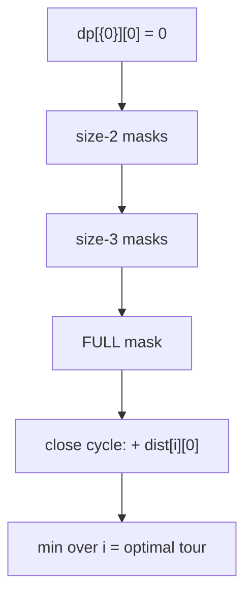

# NP-Hard: TSP & Hamiltonian Path/Cycle — Junior Level

> **One-line summary:** A **Hamiltonian path** visits every vertex of a graph exactly once; a **Hamiltonian cycle** does the same and returns to the start. The **Traveling Salesman Problem (TSP)** asks for the *shortest* Hamiltonian cycle in a weighted graph. Deciding whether a Hamiltonian cycle exists is **NP-complete**; finding the optimal TSP tour is **NP-hard**. The cleanest exact method that beats brute force is **Held–Karp**, a bitmask dynamic program running in `O(2ⁿ · n²)` time and `O(2ⁿ · n)` space.

---

## Table of Contents

1. [Introduction](#introduction)
2. [Prerequisites](#prerequisites)
3. [Glossary](#glossary)
4. [Core Concepts](#core-concepts)
5. [Big-O Summary](#big-o-summary)
6. [Real-World Analogies](#real-world-analogies)
7. [Pros & Cons](#pros--cons)
8. [Step-by-Step Walkthrough](#step-by-step-walkthrough)
9. [Code Examples](#code-examples)
10. [Coding Patterns](#coding-patterns)
11. [Error Handling](#error-handling)
12. [Performance Tips](#performance-tips)
13. [Best Practices](#best-practices)
14. [Edge Cases & Pitfalls](#edge-cases--pitfalls)
15. [Common Mistakes](#common-mistakes)
16. [Cheat Sheet](#cheat-sheet)
17. [Visual Animation](#visual-animation)
18. [Summary](#summary)
19. [Further Reading](#further-reading)

---

## Introduction

Imagine a delivery driver who must visit ten houses and come back to the depot, and you want the route that drives the fewest total kilometres. That is the **Traveling Salesman Problem**, and it is one of the most famous problems in all of computer science — not because it is hard to *describe*, but because it is hard to *solve quickly*.

Two related ideas sit at the heart of this topic:

1. A **Hamiltonian path** is a route that touches *every* vertex exactly once. A **Hamiltonian cycle** is the same idea, but the route closes back to where it started. (Compare this with an **Eulerian path**, sibling topic `12-eulerian-path-circuit`, which visits every *edge* once — a famously *easy* problem. Visiting every *vertex* once is famously *hard*. That contrast is worth remembering.)
2. The **Traveling Salesman Problem** takes a weighted graph and asks for the Hamiltonian cycle of minimum total weight.

Why are these hard? For `n` cities there are `(n-1)!/2` distinct tours. At `n = 15` that is already over 43 billion. Brute force — try every permutation — is `O(n!)`, which explodes past any computer's patience around `n = 12`.

The good news is that we can do *much* better than `n!` while still finding the exact optimum. **Held–Karp** (1962) uses dynamic programming over *subsets* of cities to bring the cost down to `O(2ⁿ · n²)`. That is still exponential, but `2ⁿ` is dramatically smaller than `n!`: at `n = 20`, `n!` is about `2.4 × 10¹⁸`, while `2²⁰ · 20² ≈ 4 × 10⁸` — a billion-fold improvement that makes `n ≈ 20` actually feasible.

At junior level, your goal is to (a) understand what these problems ask, (b) know *why* brute force is hopeless, and (c) be able to code Held–Karp on a small instance and trust its answer. Approximation algorithms and heuristics for large `n` come in the later files.

---

## Prerequisites

Before reading this file you should be comfortable with:

- **Graphs** — vertices, edges, weights, adjacency matrices (sibling `01-representation`).
- **Bitmasks** — representing a subset of `n` items as the bits of an integer. `mask & (1<<i)` tests bit `i`; `mask | (1<<i)` sets it.
- **Dynamic programming** — filling a table where each entry is built from smaller, already-solved entries (sibling `13-dynamic-programming`, especially the bitmask-DP subtopic).
- **Permutations / recursion** — to understand the brute-force baseline.
- **Big-O notation** — `O(n!)`, `O(2ⁿ · n²)`, the difference between them.

Optional but helpful:

- A quick look at **minimum spanning trees** (sibling `10-mst-kruskal-prim`) — the MST reappears as a lower bound and as the basis of the 2-approximation in `middle.md`.

---

## Glossary

| Term | Meaning |
|------|---------|
| **Hamiltonian path** | A path that visits every vertex of a graph exactly once. |
| **Hamiltonian cycle** | A cycle that visits every vertex exactly once and returns to the start. |
| **Traveling Salesman Problem (TSP)** | Find the minimum-weight Hamiltonian cycle in a weighted complete graph. |
| **Tour** | A candidate Hamiltonian cycle; its **length/cost** is the sum of its edge weights. |
| **NP-complete** | The class of decision problems that are both in NP and NP-hard (e.g. "does a Hamiltonian cycle exist?"). |
| **NP-hard** | At least as hard as the hardest problems in NP; TSP optimization is NP-hard (it is an optimization, not a yes/no problem, so it is not "complete"). |
| **Held–Karp** | The `O(2ⁿ · n²)` bitmask DP that solves TSP exactly. |
| **`dp[mask][i]`** | Shortest path that starts at city 0, visits exactly the set of cities in `mask`, and currently sits at city `i`. |
| **Metric TSP** | TSP where weights satisfy the **triangle inequality** `d(a,c) ≤ d(a,b) + d(b,c)`. Approximable. |
| **Symmetric / asymmetric TSP** | Symmetric: `d(i,j) = d(j,i)`. Asymmetric (ATSP): the two directions can differ. |
| **Brute force** | Enumerate all `(n-1)!/2` tours and keep the best. `O(n!)`. |

---

## Core Concepts

### 1. Hamiltonian path vs Hamiltonian cycle

Given a graph, a **Hamiltonian path** is an ordering of all `n` vertices `v₁, v₂, …, vₙ` such that each consecutive pair `(vₖ, vₖ₊₁)` is connected by an edge. A **Hamiltonian cycle** additionally requires an edge from `vₙ` back to `v₁`.

```
Vertices: A B C D, edges drawn as lines

   A --- B
   |  X  |          A Hamiltonian cycle: A → B → D → C → A
   C --- D          A Hamiltonian path:  A → B → D → C
```

Deciding whether *any* Hamiltonian cycle exists is a yes/no (decision) problem, and it is **NP-complete**. There is no known polynomial algorithm, and most computer scientists believe none exists (this is the P ≠ NP conjecture).

### 2. The Traveling Salesman Problem

Now attach a weight to every edge (a distance, a cost, a time). TSP asks: among all Hamiltonian cycles, which has the **smallest total weight**? Because we usually assume a *complete* graph (you can always travel directly between any two cities), a Hamiltonian cycle always exists — the only question is which one is cheapest.

```
       2
   A ----- B
   |  \3 /  |
  4|   \/  |5
   |   /\  |
   C ----- D
       1
Tour A→B→D→C→A = 2 + 5 + 1 + 4 = 12
```

### 3. Why brute force fails

Fix the start at city 0 (a tour is a cycle, so the starting point does not matter). That leaves `(n-1)!` orderings of the rest, and each tour is counted twice (forward and backward), so `(n-1)!/2` distinct tours. Even ignoring the `/2`, the factorial growth is brutal:

| n | (n-1)! tours | feasible? |
|---|--------------|-----------|
| 5 | 24 | trivial |
| 10 | 362,880 | instant |
| 13 | ~4.8 × 10⁸ | seconds |
| 15 | ~8.7 × 10¹⁰ | minutes–hours |
| 20 | ~1.2 × 10¹⁷ | no |

### 4. The Held–Karp idea: DP over subsets

The key insight: a shortest path that visits a set `S` of cities and *ends at city `i`* does not care *in what order* the other cities of `S` were visited — only *which* cities are in `S` and *where you currently are*. That is the hallmark of optimal substructure, and it lets us collapse the factorial into a table indexed by `(subset, current city)`.

Define:

```
dp[mask][i] = length of the shortest path that
              - starts at city 0,
              - visits exactly the cities whose bits are set in `mask`,
              - and ends at city i   (bit i must be set in mask).
```

Base case: `dp[{0}][0] = 0` — sitting at the start, having visited only the start.

Transition: to reach `dp[mask][i]`, we came from some city `j` already in `mask` (with `j ≠ i`), having visited `mask` without `i`:

```
dp[mask][i] = min over j in mask, j ≠ i of
              dp[mask without i][j] + dist[j][i]
```

Answer (closing the cycle back to 0):

```
TSP = min over i ≠ 0 of dp[FULL][i] + dist[i][0]      where FULL = (1<<n) - 1
```

If you only need a Hamiltonian *path* (no return to start), drop the `+ dist[i][0]` and take `min over i of dp[FULL][i]`. If you only need to know whether a Hamiltonian path *exists* in a non-complete graph, replace the distances with a boolean reachability test — see the coding challenge in `interview.md`.

### 5. Counting the work

There are `2ⁿ` masks and `n` choices for the ending city `i`, so `2ⁿ · n` table entries. Each entry scans `n` possible predecessors `j`. Total: `O(2ⁿ · n²)` time. The table itself holds `2ⁿ · n` numbers, so `O(2ⁿ · n)` space. That space is the real limit in practice: at `n = 20`, the table has `2²⁰ · 20 ≈ 2.1 × 10⁷` entries — fine — but at `n = 25` it is `8 × 10⁸`, which strains memory. Held–Karp is a tool for `n ≤ ~20`.

---

## Big-O Summary

| Approach | Time | Space | Practical n | Finds optimum? |
|----------|------|-------|-------------|----------------|
| Brute force (all permutations) | **O(n!)** | O(n) | ≤ 11–12 | yes |
| Held–Karp bitmask DP | **O(2ⁿ · n²)** | **O(2ⁿ · n)** | ≤ ~20 | yes |
| Branch-and-bound | O(n!) worst, far less typical | O(n) | ≤ ~40 (lucky) | yes |
| MST 2-approximation (metric) | O(n²) or O(E log V) | O(n) | huge | within 2× |
| Christofides (metric) | O(n³) | O(n²) | thousands | within 1.5× |
| Nearest-neighbor heuristic | O(n²) | O(n) | huge | no guarantee |
| 2-opt local search | O(n²) per pass | O(n) | huge | no guarantee |

The two exact methods (brute force, Held–Karp) appear here; the approximations and heuristics are detailed in `middle.md` and beyond. The headline at junior level: **Held–Karp turns an `n!` wall into a `2ⁿ` wall**, which is the difference between `n = 12` and `n = 20`.

---

## Real-World Analogies

| Concept | Analogy |
|---------|---------|
| TSP tour | A school-bus route that must pick up every child and return to the garage with the least total driving. |
| Hamiltonian cycle existence | Planning a road trip that hits every city on your bucket list once and ends at home — sometimes the road network simply makes it impossible. |
| Brute force | Writing out every possible visiting order on index cards and adding up the mileage on each. Hopeless past a dozen cities. |
| Held–Karp's `dp[mask][i]` | A travel log that records, for "the set of cities I've covered so far" and "where I'm standing right now," the cheapest way I could have gotten here — regardless of the order I took. |
| Optimal substructure | If the cheapest full trip passes through city `i` last-but-one, then the part before `i` must itself be the cheapest way to cover those cities ending at `i`. |
| Triangle inequality (metric) | On a real map a detour through a third town is never *shorter* than going direct — this is what makes good approximation possible. |

Where the analogy breaks: a real bus route has time windows, capacities, and one-way streets. Classic TSP ignores all of that; those extensions (the *Vehicle Routing Problem*) are even harder and are touched on in `senior.md`.

---

## Pros & Cons

This section weighs **Held–Karp** specifically, since it is the junior-level workhorse.

| Pros | Cons |
|------|------|
| Finds the *exact* optimal tour, not an approximation. | Exponential: unusable past `n ≈ 20`. |
| Dramatically faster than brute force (`2ⁿ` vs `n!`). | `O(2ⁿ · n)` memory is the binding constraint — runs out of RAM before time. |
| Simple, ~40 lines, once you understand bitmasks. | Needs a *complete* distance matrix (or `∞` for missing edges). |
| Works for both symmetric and asymmetric TSP unchanged. | No early exit on "good enough" — always does full work. |
| Reconstructs the actual tour, not just its length, with a parent table. | Bitmask requires `n` to fit in an integer's bits (≤ 63 in practice, ≤ ~20 in memory). |

**When to use Held–Karp:** exact answer required, `n ≤ ~20`, e.g. optimal PCB drilling order for a small board, a tight delivery loop, or as the exact "ground truth" to test heuristics against.

**When NOT to use:** `n` in the hundreds or thousands (use the 2-approximation, Christofides, or 2-opt from later files), or when an approximate route is acceptable and speed matters.

---

## Step-by-Step Walkthrough

Let us run Held–Karp by hand on **4 cities** with this symmetric distance matrix (rows/cols = cities 0,1,2,3):

```
      0   1   2   3
  0 [ 0  10  15  20 ]
  1 [10   0  35  25 ]
  2 [15  35   0  30 ]
  3 [20  25  30   0 ]
```

We always start at city 0. Masks include bit 0. We write masks as sets for readability.

**Base:** `dp[{0}][0] = 0`.

**Subsets of size 2** (start + one more city), reached directly from 0:

```
dp[{0,1}][1] = dp[{0}][0] + dist[0][1] = 0 + 10 = 10
dp[{0,2}][2] = 0 + 15 = 15
dp[{0,3}][3] = 0 + 20 = 20
```

**Subsets of size 3.** Example `dp[{0,1,2}][2]` — covered cities {0,1,2}, now at 2. Came from 1 (the only other non-zero city in the set):

```
dp[{0,1,2}][2] = dp[{0,1}][1] + dist[1][2] = 10 + 35 = 45
dp[{0,1,2}][1] = dp[{0,2}][2] + dist[2][1] = 15 + 35 = 50
dp[{0,1,3}][3] = dp[{0,1}][1] + dist[1][3] = 10 + 25 = 35
dp[{0,1,3}][1] = dp[{0,3}][3] + dist[3][1] = 20 + 25 = 45
dp[{0,2,3}][3] = dp[{0,2}][2] + dist[2][3] = 15 + 30 = 45
dp[{0,2,3}][2] = dp[{0,3}][3] + dist[3][2] = 20 + 30 = 50
```

**Full set `{0,1,2,3}`.** End at each non-zero city, choosing the best predecessor:

```
dp[FULL][1] = min( dp[{0,2,3}][2] + d[2][1],  dp[{0,2,3}][3] + d[3][1] )
            = min( 50 + 35,  45 + 25 ) = min(85, 70) = 70
dp[FULL][2] = min( dp[{0,1,3}][1] + d[1][2],  dp[{0,1,3}][3] + d[3][2] )
            = min( 45 + 35,  35 + 30 ) = min(80, 65) = 65
dp[FULL][3] = min( dp[{0,1,2}][1] + d[1][3],  dp[{0,1,2}][2] + d[2][3] )
            = min( 50 + 25,  45 + 30 ) = min(75, 75) = 75
```

**Close the cycle back to 0:**

```
end at 1: 70 + d[1][0] = 70 + 10 = 80
end at 2: 65 + d[2][0] = 65 + 15 = 80
end at 3: 75 + d[3][0] = 75 + 20 = 95
```

**Optimal tour length = 80.** Tracing back from "end at 1": `0 → 2 → 3 → 1 → 0` gives `15 + 30 + 25 + 10 = 80`. ✓ This matches the brute-force answer.

---

## Code Examples

### Example: Held–Karp (shortest Hamiltonian cycle) with tour reconstruction

All three solve the same 4-city instance from the walkthrough and print length `80` plus a tour.

#### Go

```go
package main

import (
	"fmt"
	"math"
)

func heldKarp(dist [][]int) (int, []int) {
	n := len(dist)
	const INF = math.MaxInt32
	full := (1 << n) - 1
	// dp[mask][i]: shortest path from 0, visiting `mask`, ending at i.
	dp := make([][]int, 1<<n)
	parent := make([][]int, 1<<n)
	for m := range dp {
		dp[m] = make([]int, n)
		parent[m] = make([]int, n)
		for i := range dp[m] {
			dp[m][i] = INF
			parent[m][i] = -1
		}
	}
	dp[1][0] = 0 // mask {0}, at city 0

	for mask := 1; mask <= full; mask++ {
		if mask&1 == 0 {
			continue // every path starts at 0
		}
		for i := 0; i < n; i++ {
			if dp[mask][i] == INF || mask&(1<<i) == 0 {
				continue
			}
			for j := 0; j < n; j++ {
				if mask&(1<<j) != 0 {
					continue // j already visited
				}
				nm := mask | (1 << j)
				nd := dp[mask][i] + dist[i][j]
				if nd < dp[nm][j] {
					dp[nm][j] = nd
					parent[nm][j] = i
				}
			}
		}
	}

	best, last := INF, -1
	for i := 1; i < n; i++ {
		if dp[full][i]+dist[i][0] < best {
			best = dp[full][i] + dist[i][0]
			last = i
		}
	}
	// Reconstruct the tour by walking parents back.
	tour := []int{}
	mask, cur := full, last
	for cur != -1 {
		tour = append(tour, cur)
		p := parent[mask][cur]
		mask ^= 1 << cur
		cur = p
	}
	// tour currently ends ... 0; reverse it and close.
	for l, r := 0, len(tour)-1; l < r; l, r = l+1, r-1 {
		tour[l], tour[r] = tour[r], tour[l]
	}
	tour = append(tour, 0)
	return best, tour
}

func main() {
	dist := [][]int{
		{0, 10, 15, 20},
		{10, 0, 35, 25},
		{15, 35, 0, 30},
		{20, 25, 30, 0},
	}
	length, tour := heldKarp(dist)
	fmt.Println("length:", length) // 80
	fmt.Println("tour  :", tour)   // [0 2 3 1 0] or a symmetric equivalent
}
```

#### Java

```java
import java.util.*;

public class HeldKarp {
    static int[] solve(int[][] dist, int[] outLen) {
        int n = dist.length;
        final int INF = Integer.MAX_VALUE / 2;
        int full = (1 << n) - 1;
        int[][] dp = new int[1 << n][n];
        int[][] parent = new int[1 << n][n];
        for (int[] row : dp) Arrays.fill(row, INF);
        for (int[] row : parent) Arrays.fill(row, -1);
        dp[1][0] = 0; // mask {0}, at city 0

        for (int mask = 1; mask <= full; mask++) {
            if ((mask & 1) == 0) continue;
            for (int i = 0; i < n; i++) {
                if (dp[mask][i] == INF || (mask & (1 << i)) == 0) continue;
                for (int j = 0; j < n; j++) {
                    if ((mask & (1 << j)) != 0) continue;
                    int nm = mask | (1 << j);
                    int nd = dp[mask][i] + dist[i][j];
                    if (nd < dp[nm][j]) {
                        dp[nm][j] = nd;
                        parent[nm][j] = i;
                    }
                }
            }
        }

        int best = INF, last = -1;
        for (int i = 1; i < n; i++) {
            if (dp[full][i] + dist[i][0] < best) {
                best = dp[full][i] + dist[i][0];
                last = i;
            }
        }
        outLen[0] = best;

        List<Integer> tour = new ArrayList<>();
        int mask = full, cur = last;
        while (cur != -1) {
            tour.add(cur);
            int p = parent[mask][cur];
            mask ^= (1 << cur);
            cur = p;
        }
        Collections.reverse(tour);
        tour.add(0);
        return tour.stream().mapToInt(Integer::intValue).toArray();
    }

    public static void main(String[] args) {
        int[][] dist = {
            {0, 10, 15, 20},
            {10, 0, 35, 25},
            {15, 35, 0, 30},
            {20, 25, 30, 0},
        };
        int[] len = new int[1];
        int[] tour = solve(dist, len);
        System.out.println("length: " + len[0]);          // 80
        System.out.println("tour  : " + Arrays.toString(tour));
    }
}
```

#### Python

```python
import math


def held_karp(dist):
    n = len(dist)
    INF = math.inf
    full = (1 << n) - 1
    # dp[mask][i]: shortest path from 0, visiting `mask`, ending at i.
    dp = [[INF] * n for _ in range(1 << n)]
    parent = [[-1] * n for _ in range(1 << n)]
    dp[1][0] = 0  # mask {0}, at city 0

    for mask in range(1, full + 1):
        if not (mask & 1):
            continue
        for i in range(n):
            if dp[mask][i] == INF or not (mask & (1 << i)):
                continue
            for j in range(n):
                if mask & (1 << j):
                    continue
                nm = mask | (1 << j)
                nd = dp[mask][i] + dist[i][j]
                if nd < dp[nm][j]:
                    dp[nm][j] = nd
                    parent[nm][j] = i

    best, last = INF, -1
    for i in range(1, n):
        if dp[full][i] + dist[i][0] < best:
            best = dp[full][i] + dist[i][0]
            last = i

    tour, mask, cur = [], full, last
    while cur != -1:
        tour.append(cur)
        p = parent[mask][cur]
        mask ^= (1 << cur)
        cur = p
    tour.reverse()
    tour.append(0)
    return best, tour


if __name__ == "__main__":
    dist = [
        [0, 10, 15, 20],
        [10, 0, 35, 25],
        [15, 35, 0, 30],
        [20, 25, 30, 0],
    ]
    length, tour = held_karp(dist)
    print("length:", length)  # 80
    print("tour  :", tour)     # [0, 2, 3, 1, 0]
```

**What it does:** fills the `dp[mask][i]` table, closes the cycle to city 0, then reconstructs the actual tour via a `parent` table.
**Run:** `go run main.go` | `javac HeldKarp.java && java HeldKarp` | `python held_karp.py`

---

## Coding Patterns

### Pattern 1: Iterate masks in increasing order

Because `dp[mask | (1<<j)]` always has *more* bits set than `dp[mask]`, looping `mask` from small to large guarantees every predecessor is already computed before you use it. This is the bitmask-DP analogue of the topological order requirement in ordinary DP.

```python
for mask in range(1, (1 << n)):
    if not (mask & 1):       # enforce start at city 0
        continue
    ...
```

### Pattern 2: Push transitions instead of pull

There are two ways to write the recurrence. **Pull** (compute `dp[mask][i]` from predecessors) and **push** (from `dp[mask][i]`, relax all successors `dp[mask|1<<j][j]`). The code above uses **push** — it is slightly easier to write because you never have to subtract a bit to find the previous mask. Both are `O(2ⁿ · n²)`.

### Pattern 3: Hamiltonian-path existence via boolean DP

Drop the distances entirely. `reach[mask][i] = true` if some path covers exactly `mask` ending at `i`. Then a Hamiltonian path exists iff `reach[FULL][i]` is true for any `i`. This is the same skeleton with `+` replaced by `and` over an adjacency check — see the challenge in `interview.md`.

```python
reach = [[False]*n for _ in range(1<<n)]
for i in range(n):
    reach[1<<i][i] = True          # path of length 1 starting anywhere
for mask in range(1<<n):
    for i in range(n):
        if not reach[mask][i]: continue
        for j in range(n):
            if not (mask & (1<<j)) and adj[i][j]:
                reach[mask | (1<<j)][j] = True
```



---

## Error Handling

| Error | Cause | Fix |
|-------|-------|-----|
| `IndexError` / `1<<n` overflow | `n` too large for the integer width (≥ 31 in Java `int`, ≥ 63 in Go/Python practical limits). | Cap `n ≤ 20` for Held–Karp; for larger `n` switch to a heuristic. |
| `MemoryError` allocating `dp` | `2ⁿ · n` entries exceeds RAM around `n ≥ 24`. | Reduce `n`, use `O(2ⁿ)` rolling tricks, or switch algorithms. |
| Wrong answer, off by `dist[i][0]` | Forgot to close the cycle (computed a *path* instead of a *cycle*). | Add `+ dist[i][0]` when reading the final answer. |
| Integer overflow in sums | `INF + dist` wraps to a negative number and looks "better." | Use `INF = MAXINT/2` (Java/Go) so `INF + w` never overflows. |
| `dp[mask][i]` read before written | Iterated masks in the wrong order, or used an uninitialized cell. | Initialize all to `INF`, iterate masks ascending, skip `INF` cells. |

---

## Performance Tips

- **Use a flat 1-D array** `dp[mask*n + i]` instead of a 2-D array for better cache locality and fewer allocations in hot loops.
- **Skip masks without bit 0** — every valid path starts at city 0, so half the masks are dead and can be `continue`d immediately.
- **Precompute `dist` as a contiguous matrix**; pointer-chasing an adjacency list inside the inner loop is slow.
- **Short-circuit `INF` cells** (`if dp[mask][i] == INF: continue`) so you never waste the inner `n`-loop on unreachable states.
- **For Hamiltonian-path *existence* only**, use bits in a `uint64` bitset per `i` instead of a 2-D boolean table — far less memory.

---

## Best Practices

- Always write the **brute-force permutation** version first and test Held–Karp against it for `n ≤ 9` on random matrices. (This is exactly how the code in this topic was verified — 200 random trials, all matching.)
- Document whether your solver returns a **path** or a **cycle**, and whether the graph is **symmetric or asymmetric** — these are the two most common misunderstandings.
- Keep a `parent` table from the start; bolting on tour reconstruction afterward is error-prone.
- Use `INF = MAXINT / 2`, never the true max, to keep `INF + w` safe from overflow.
- For anything beyond `n ≈ 20`, stop reaching for an exact solver and reach for the heuristics in `middle.md`.

---

## Edge Cases & Pitfalls

- **`n = 1`** — the tour is just the start; length 0. Make sure your loops do not read `dist[i][0]` with `i = 0`.
- **`n = 2`** — the only cycle is `0 → 1 → 0`, length `dist[0][1] + dist[1][0]`.
- **Disconnected / missing edges** — for a non-complete graph, set missing `dist[i][j] = ∞`. If the final answer is still `∞`, no Hamiltonian cycle exists.
- **Asymmetric distances** — `dist[i][j] ≠ dist[j][i]` is fine for Held–Karp (it never assumes symmetry), but breaks the metric approximations in `middle.md`.
- **Negative weights** — Held–Karp still works (no negative-cycle issue, since each city is visited once), but the metric approximations assume non-negative, triangle-inequality weights.
- **Path vs cycle confusion** — the single most common bug; decide which you want before you code.

---

## Common Mistakes

1. **Computing a path but reporting it as a tour** — forgetting `+ dist[i][0]`. The number will look plausible but be too small.
2. **Iterating masks in the wrong order** — reading `dp` cells that have not been filled yet. Always go from small masks to large.
3. **Letting `INF + w` overflow** — using the true `MAXINT` so a sum wraps negative and is wrongly chosen as the minimum.
4. **Assuming the start matters** — it does not for a *cycle*; fixing the start at 0 removes redundant work, it does not change the optimum.
5. **Trying Held–Karp at `n = 30`** — it will not fit in memory. Know the `n ≤ 20` ceiling.
6. **Confusing Eulerian and Hamiltonian** — Eulerian = every *edge* once (easy, sibling `12-eulerian-path-circuit`); Hamiltonian = every *vertex* once (hard).
7. **Expecting an approximation guarantee on a non-metric graph** — the 2× and 1.5× bounds in later files require the triangle inequality.

---

## Cheat Sheet

| Quantity | Formula / value |
|----------|-----------------|
| Distinct tours | `(n-1)! / 2` (symmetric) |
| Brute-force time | `O(n!)` |
| Held–Karp time | `O(2ⁿ · n²)` |
| Held–Karp space | `O(2ⁿ · n)` |
| Practical Held–Karp ceiling | `n ≤ ~20` |
| DP state | `dp[mask][i]` = shortest path from 0, visiting `mask`, ending at `i` |
| Base case | `dp[1][0] = 0` (mask `{0}`, at city 0) |
| Transition | `dp[m\|1<<j][j] = min(…, dp[m][i] + dist[i][j])` |
| Cycle answer | `min over i≠0 of dp[FULL][i] + dist[i][0]` |
| Path answer | `min over i of dp[FULL][i]` |

Bitmask one-liners:

```text
test bit i:   mask & (1 << i)
set bit i:    mask | (1 << i)
clear bit i:  mask & ~(1 << i)   or   mask ^ (1 << i) if known set
full mask:    (1 << n) - 1
```

---

## Visual Animation

> See [`animation.html`](./animation.html) for an interactive visual animation.
>
> The animation demonstrates:
> - The Held–Karp `dp[mask][i]` table filling row by row as masks grow.
> - A tour drawn on points in the plane, improving as 2-opt removes crossings.
> - Step / Run / Reset controls so you can watch each transition.

---

## Summary

A **Hamiltonian cycle** visits every vertex once and returns to start; finding *whether one exists* is **NP-complete**, and finding the *shortest* one — the **TSP** — is **NP-hard**. Brute force is `O(n!)` and dies near `n = 12`. **Held–Karp** is the junior-level breakthrough: a bitmask DP with state `dp[mask][i]` (shortest path from 0 covering `mask`, ending at `i`) that finds the *exact* optimum in `O(2ⁿ · n²)` time and `O(2ⁿ · n)` space, pushing the practical ceiling to about `n = 20`. Master the recurrence, the mask ordering, and the cycle-closing step, and you can solve any small TSP exactly — and verify it against brute force, exactly as we did here.

---

## Further Reading

- Held, M. & Karp, R. (1962). "A Dynamic Programming Approach to Sequencing Problems." — the original paper.
- *Introduction to Algorithms* (CLRS), Chapter 34 — "NP-Completeness," and Chapter 35 — "Approximation Algorithms" (TSP).
- *The Traveling Salesman Problem: A Computational Study* (Applegate, Bixby, Chvátal, Cook) — the definitive modern reference.
- cp-algorithms.com — "Travelling Salesman: Bitmask DP."
- Sibling topics: `10-mst-kruskal-prim` (used by approximations), `13-dynamic-programming` (bitmask DP), `12-eulerian-path-circuit` (the easy cousin), `27-graph-coloring` (another NP-hard graph problem).
</content>
</invoke>
