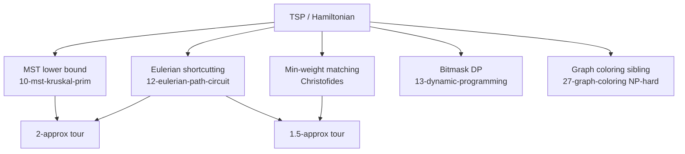

# NP-Hard: TSP & Hamiltonian Path/Cycle — Middle Level

> **Focus:** Choosing the right tool for the size and type of instance — exact (Held–Karp, branch-and-bound), approximate-with-guarantee (MST 2-approx, Christofides 1.5-approx), and fast heuristics (nearest-neighbor, greedy edge, 2-opt) — and understanding *why* each works only under its assumptions.

---

## Table of Contents

1. [Introduction](#introduction)
2. [Deeper Concepts](#deeper-concepts)
3. [Comparison with Alternatives](#comparison-with-alternatives)
4. [Advanced Patterns](#advanced-patterns)
5. [Graph and Tree Applications](#graph-and-tree-applications)
6. [Dynamic Programming Integration](#dynamic-programming-integration)
7. [Code Examples](#code-examples)
8. [Error Handling](#error-handling)
9. [Performance Analysis](#performance-analysis)
10. [Best Practices](#best-practices)
11. [Visual Animation](#visual-animation)
12. [Summary](#summary)

---

## Introduction

At junior level TSP is "Held–Karp on small `n`." At middle level the real engineering question appears: **the instance is too big for an exact solver — now what?** A delivery company with 800 stops cannot wait for `2⁸⁰⁰`. The middle-level answer is a *ladder of trade-offs*:

- `n ≤ 20`: solve it **exactly** with Held–Karp.
- `n ≤ ~40–60` and you are patient: **branch-and-bound** with a good lower bound can still find the optimum.
- `n` in the hundreds–thousands, weights are **metric**: use an **approximation with a proven guarantee** — MST-doubling (≤ 2× optimal) or Christofides (≤ 1.5× optimal).
- `n` huge, any structure: run **fast heuristics** (nearest-neighbor to seed, then 2-opt / Or-opt / Lin–Kernighan to polish) — no guarantee, but excellent in practice.

The pivotal distinction that decides which rungs you can stand on is **metric vs non-metric**. If the weights satisfy the **triangle inequality** `d(a,c) ≤ d(a,b) + d(b,c)` — true for straight-line distances, road times under normal conditions, etc. — then 2-approx and Christofides apply. If they do not, *general TSP is inapproximable* (no constant-factor polynomial algorithm exists unless P = NP — proved in `professional.md`), and you are limited to exact methods or guarantee-free heuristics.

---

## Deeper Concepts

### The triangle inequality is the hinge

**Metric TSP** assumes `d(i,j) ≤ d(i,k) + d(k,j)` for all `i, j, k`. Geometrically: a detour is never a shortcut. This single property is what lets us take a structure that "visits cities possibly more than once" (a walk around a tree) and *shortcut* it into a true tour without increasing its length. Every approximation guarantee in this topic is, at its core, a triangle-inequality argument.

### Lower bounds: why an MST bounds the tour from below

Take the optimal tour and delete any one edge. What remains is a **Hamiltonian path** — a spanning tree (a very thin one). Any spanning tree weighs at least as much as the *minimum* spanning tree. Therefore:

```
weight(MST) ≤ weight(optimal Hamiltonian path) ≤ weight(optimal tour)
```

So `MST` is a **lower bound** on the optimal tour. Lower bounds are the fuel of branch-and-bound (to prune) and the scaffold of the 2-approximation (to bound from above). The MST itself comes from sibling topic `10-mst-kruskal-prim`.

### The MST-doubling 2-approximation (metric)

1. Build the MST `T` (Kruskal or Prim).
2. **Double** every edge of `T` → an Eulerian multigraph (every vertex now has even degree).
3. Find an **Eulerian circuit** of the doubled tree (sibling `12-eulerian-path-circuit`).
4. **Shortcut** the Eulerian circuit: walk it, and whenever it revisits an already-seen vertex, skip straight to the next unseen one. The triangle inequality guarantees each shortcut only *shortens* the walk.

Result: a tour of length `≤ 2 · weight(MST) ≤ 2 · OPT`. The doubling step is where the factor of 2 comes from.

### Christofides' 1.5-approximation (metric)

The wasteful part of doubling is that we duplicate *every* edge just to fix parity. Christofides (1976) fixes parity cheaply:

1. Build the MST `T`.
2. Find the set `O` of **odd-degree** vertices in `T`. (There is always an even number of them — handshake lemma.)
3. Compute a **minimum-weight perfect matching** `M` on `O` (using the *metric* distances). This is polynomial via Edmonds' blossom algorithm, `O(n³)`.
4. Combine `T ∪ M` → every vertex now has even degree → an Eulerian multigraph.
5. Find an Eulerian circuit and **shortcut** it into a tour.

Result: `≤ 1.5 · OPT`. The improvement over doubling: instead of paying `weight(T)` again, you pay only `weight(M) ≤ 0.5 · OPT` (the matching argument is proved in `professional.md`). For 40+ years Christofides was the best known *guarantee* for metric TSP; a 2020 result by Karlin–Klein–Oveis Gharan nudged it microscopically below 1.5, but Christofides remains the practical and pedagogical reference point.

### General (non-metric) TSP is inapproximable

If weights can be arbitrary, then no polynomial algorithm can guarantee *any* constant factor of optimal (unless P = NP). The proof reduces Hamiltonian-cycle (NP-complete) to TSP with a gigantic penalty on non-edges — see `professional.md`. Practical takeaway: **never claim a 2× or 1.5× guarantee on a non-metric instance.**

### Symmetric vs asymmetric

- **Symmetric TSP (STSP):** `d(i,j) = d(j,i)`. Christofides and MST-doubling apply.
- **Asymmetric TSP (ATSP):** directions differ (one-way streets, wind on flights). Christofides does *not* apply directly; ATSP has its own (much weaker, historically `O(log n)`, later `O(1)`) approximation results. Held–Karp, however, works unchanged for both.

---

## Comparison with Alternatives

| Method | Time | Guarantee | Needs metric? | Practical `n` | Use when |
|--------|------|-----------|---------------|---------------|----------|
| Brute force | O(n!) | exact | no | ≤ 11 | teaching / tiny |
| Held–Karp DP | O(2ⁿ·n²) | exact | no | ≤ 20 | exact, small |
| Branch-and-bound | exp. worst | exact | no | ≤ ~40–60 | exact, medium, patient |
| MST 2-approx | O(n² ) | ≤ 2·OPT | **yes** | huge | quick guaranteed bound |
| Christofides | O(n³) | ≤ 1.5·OPT | **yes** | thousands | best guarantee, metric |
| Nearest-neighbor | O(n²) | none (Θ(log n)·OPT worst) | no | huge | fast seed tour |
| Greedy edge | O(n² log n) | none | no | huge | fast seed tour |
| 2-opt | O(n²)/pass | local optimum | no | huge | polish any tour |
| Or-opt / Lin–Kernighan | O(n²·)–O(n²·⁲) | local optimum, very strong | no | huge | state-of-the-art heuristic |
| OR-Tools / LKH solvers | varies | near-optimal in practice | no | 10⁵+ | production routing |

**Decision rule of thumb:**

```
n ≤ 20            → Held–Karp (exact)
n ≤ 50, patient   → branch-and-bound (exact)
metric, big       → Christofides (1.5×) or 2-approx (fast)
non-metric, big   → nearest-neighbor seed + 2-opt / LK (no guarantee)
production scale  → OR-Tools / LKH / Concorde
```

---

## Advanced Patterns

### Pattern: Branch-and-bound with an MST lower bound

Branch-and-bound explores the tree of partial tours but **prunes** any branch whose lower bound already exceeds the best complete tour found so far. The quality of the *lower bound* decides how much you prune.

- **Cheapest lower bound:** sum of each vertex's two cheapest incident edges, halved (every vertex has degree 2 in a tour).
- **Reduced-cost bound:** subtract each row's minimum and each column's minimum from the matrix (the subtracted amount is a guaranteed lower bound on any tour) — the classic Little et al. (1963) bound.
- **MST / 1-tree bound:** for the *unvisited* portion, the MST is a valid lower bound; the **Held–Karp 1-tree relaxation** sharpens this further.

With a good bound and a good initial tour (from nearest-neighbor), branch-and-bound routinely solves `n = 40–60` exactly.

### Pattern: Nearest-neighbor construction

Start at a city, repeatedly hop to the nearest unvisited city, close the loop. `O(n²)`. Fast and intuitive, but can be `Θ(log n) · OPT` in the worst case — it greedily commits and is forced into expensive "return" edges at the end. Use it as a *seed*, not a final answer.

### Pattern: 2-opt local search

A 2-opt move removes two edges `(a,b)` and `(c,d)` and reconnects as `(a,c)` and `(b,d)`, **reversing** the segment between. For a Euclidean tour this exactly "uncrosses" two crossing edges. Repeat until no improving move exists → a **2-optimal** tour, typically within ~5% of optimal.

```
before:  ... a → b ... c → d ...   (edges a-b and c-d cross)
after:   ... a → c ... b → d ...   (segment b..c reversed)
gain = d(a,b) + d(c,d) − d(a,c) − d(b,d)   apply move if gain > 0
```

### Pattern: Or-opt and Lin–Kernighan

- **Or-opt** moves a short chain of 1–3 consecutive cities to a better position. Cheaper than full 2-opt, catches a different class of improvements.
- **Lin–Kernighan (LK)** generalizes 2-opt to variable-depth `k`-opt moves chosen adaptively. The LKH implementation (Helsgaun) is the practical gold standard, solving instances with millions of cities to within a fraction of a percent of optimal.

The usual production recipe: **nearest-neighbor or greedy-edge to seed → 2-opt/Or-opt to clean up → Lin–Kernighan to finish.**

---

## Graph and Tree Applications



TSP sits at the crossroads of several graph tools you already know:

- The **MST** (`10-mst-kruskal-prim`) is both a lower bound and the backbone of both approximations.
- The **Eulerian circuit** (`12-eulerian-path-circuit`) is the walk we shortcut into a tour.
- **Minimum-weight perfect matching** patches odd-degree parity in Christofides.
- **Bitmask DP** (`13-dynamic-programming`) is Held–Karp itself.
- TSP is a sibling NP-hard problem to **graph coloring** (`27-graph-coloring`); both resist polynomial exact algorithms.

---

## Dynamic Programming Integration

Held–Karp *is* the DP, but middle-level work often needs **variants**:

- **Open path** (no return): answer is `min over i of dp[FULL][i]` — drop the closing edge.
- **Fixed endpoints** (start `s`, end `t`): seed `dp[{s}][s] = 0`, answer `dp[FULL][t]`.
- **Bitmask DP with profit** (e.g. "visit a *subset* maximizing reward minus travel"): `dp[mask][i]` plus a reward term — this is the *prize-collecting* / *orienteering* family.
- **Counting Hamiltonian paths:** replace `min` with `+` to count, instead of optimize, paths covering `mask` ending at `i`.

#### Go

```go
// Hamiltonian PATH (open, any endpoints) shortest length via Held-Karp.
func shortestHamPath(dist [][]int) int {
	n := len(dist)
	const INF = 1 << 29
	dp := make([][]int, 1<<n)
	for m := range dp {
		dp[m] = make([]int, n)
		for i := range dp[m] {
			dp[m][i] = INF
		}
	}
	for i := 0; i < n; i++ {
		dp[1<<i][i] = 0 // a path may start anywhere
	}
	for mask := 0; mask < (1 << n); mask++ {
		for i := 0; i < n; i++ {
			if dp[mask][i] == INF || mask&(1<<i) == 0 {
				continue
			}
			for j := 0; j < n; j++ {
				if mask&(1<<j) != 0 {
					continue
				}
				nm := mask | (1 << j)
				if dp[mask][i]+dist[i][j] < dp[nm][j] {
					dp[nm][j] = dp[mask][i] + dist[i][j]
				}
			}
		}
	}
	best := INF
	for i := 0; i < n; i++ {
		if dp[(1<<n)-1][i] < best {
			best = dp[(1<<n)-1][i]
		}
	}
	return best
}
```

#### Java

```java
// Shortest open Hamiltonian path (any start, any end).
static int shortestHamPath(int[][] dist) {
    int n = dist.length, INF = 1 << 29;
    int[][] dp = new int[1 << n][n];
    for (int[] row : dp) java.util.Arrays.fill(row, INF);
    for (int i = 0; i < n; i++) dp[1 << i][i] = 0;
    for (int mask = 0; mask < (1 << n); mask++)
        for (int i = 0; i < n; i++) {
            if (dp[mask][i] == INF || (mask & (1 << i)) == 0) continue;
            for (int j = 0; j < n; j++) {
                if ((mask & (1 << j)) != 0) continue;
                int nm = mask | (1 << j);
                dp[nm][j] = Math.min(dp[nm][j], dp[mask][i] + dist[i][j]);
            }
        }
    int best = INF;
    for (int i = 0; i < n; i++) best = Math.min(best, dp[(1 << n) - 1][i]);
    return best;
}
```

#### Python

```python
def shortest_ham_path(dist):
    n = len(dist)
    INF = 1 << 29
    dp = [[INF] * n for _ in range(1 << n)]
    for i in range(n):
        dp[1 << i][i] = 0           # a path may start anywhere
    for mask in range(1 << n):
        for i in range(n):
            if dp[mask][i] == INF or not (mask & (1 << i)):
                continue
            for j in range(n):
                if mask & (1 << j):
                    continue
                nm = mask | (1 << j)
                if dp[mask][i] + dist[i][j] < dp[nm][j]:
                    dp[nm][j] = dp[mask][i] + dist[i][j]
    full = (1 << n) - 1
    return min(dp[full][i] for i in range(n))
```

---

## Code Examples

### Example A: Nearest-neighbor seed + 2-opt improvement

#### Go

```go
package main

import (
	"fmt"
	"math"
)

func tourLen(t []int, d [][]float64) float64 {
	s := 0.0
	for i := 0; i < len(t); i++ {
		s += d[t[i]][t[(i+1)%len(t)]]
	}
	return s
}

func nearestNeighbor(d [][]float64) []int {
	n := len(d)
	seen := make([]bool, n)
	tour := []int{0}
	seen[0] = true
	for len(tour) < n {
		last := tour[len(tour)-1]
		best, bd := -1, math.Inf(1)
		for j := 0; j < n; j++ {
			if !seen[j] && d[last][j] < bd {
				bd, best = d[last][j], j
			}
		}
		seen[best] = true
		tour = append(tour, best)
	}
	return tour
}

func twoOpt(tour []int, d [][]float64) []int {
	n := len(tour)
	improved := true
	for improved {
		improved = false
		for i := 0; i < n-1; i++ {
			for k := i + 1; k < n; k++ {
				a, b := tour[i], tour[(i+1)%n]
				c, e := tour[k], tour[(k+1)%n]
				if a == c || a == e || b == c {
					continue
				}
				delta := d[a][c] + d[b][e] - d[a][b] - d[c][e]
				if delta < -1e-9 {
					for l, r := i+1, k; l < r; l, r = l+1, r-1 {
						tour[l], tour[r] = tour[r], tour[l]
					}
					improved = true
				}
			}
		}
	}
	return tour
}

func main() {
	pts := [][2]float64{{0, 0}, {1, 5}, {5, 2}, {6, 6}, {8, 3}, {2, 8}}
	n := len(pts)
	d := make([][]float64, n)
	for i := range d {
		d[i] = make([]float64, n)
		for j := range d[i] {
			dx, dy := pts[i][0]-pts[j][0], pts[i][1]-pts[j][1]
			d[i][j] = math.Hypot(dx, dy)
		}
	}
	t := nearestNeighbor(d)
	fmt.Printf("NN   : %.2f\n", tourLen(t, d))
	t = twoOpt(t, d)
	fmt.Printf("2-opt: %.2f\n", tourLen(t, d))
}
```

#### Java

```java
import java.util.*;

public class NN2opt {
    static double len(int[] t, double[][] d) {
        double s = 0;
        for (int i = 0; i < t.length; i++) s += d[t[i]][t[(i + 1) % t.length]];
        return s;
    }

    static int[] nearestNeighbor(double[][] d) {
        int n = d.length;
        boolean[] seen = new boolean[n];
        int[] tour = new int[n];
        tour[0] = 0; seen[0] = true;
        for (int p = 1; p < n; p++) {
            int last = tour[p - 1], best = -1; double bd = Double.MAX_VALUE;
            for (int j = 0; j < n; j++)
                if (!seen[j] && d[last][j] < bd) { bd = d[last][j]; best = j; }
            seen[best] = true; tour[p] = best;
        }
        return tour;
    }

    static int[] twoOpt(int[] tour, double[][] d) {
        int n = tour.length;
        boolean improved = true;
        while (improved) {
            improved = false;
            for (int i = 0; i < n - 1; i++)
                for (int k = i + 1; k < n; k++) {
                    int a = tour[i], b = tour[(i + 1) % n], c = tour[k], e = tour[(k + 1) % n];
                    if (a == c || a == e || b == c) continue;
                    double delta = d[a][c] + d[b][e] - d[a][b] - d[c][e];
                    if (delta < -1e-9) {
                        for (int l = i + 1, r = k; l < r; l++, r--) {
                            int tmp = tour[l]; tour[l] = tour[r]; tour[r] = tmp;
                        }
                        improved = true;
                    }
                }
        }
        return tour;
    }

    public static void main(String[] args) {
        double[][] pts = {{0,0},{1,5},{5,2},{6,6},{8,3},{2,8}};
        int n = pts.length;
        double[][] d = new double[n][n];
        for (int i = 0; i < n; i++)
            for (int j = 0; j < n; j++)
                d[i][j] = Math.hypot(pts[i][0]-pts[j][0], pts[i][1]-pts[j][1]);
        int[] t = nearestNeighbor(d);
        System.out.printf("NN   : %.2f%n", len(t, d));
        t = twoOpt(t, d);
        System.out.printf("2-opt: %.2f%n", len(t, d));
    }
}
```

#### Python

```python
import math


def tour_len(t, d):
    return sum(d[t[i]][t[(i + 1) % len(t)]] for i in range(len(t)))


def nearest_neighbor(d):
    n = len(d)
    seen = [False] * n
    tour = [0]
    seen[0] = True
    while len(tour) < n:
        last = tour[-1]
        best, bd = -1, math.inf
        for j in range(n):
            if not seen[j] and d[last][j] < bd:
                bd, best = d[last][j], j
        seen[best] = True
        tour.append(best)
    return tour


def two_opt(tour, d):
    n = len(tour)
    improved = True
    while improved:
        improved = False
        for i in range(n - 1):
            for k in range(i + 1, n):
                a, b = tour[i], tour[(i + 1) % n]
                c, e = tour[k], tour[(k + 1) % n]
                if a in (c, e) or b == c:
                    continue
                delta = d[a][c] + d[b][e] - d[a][b] - d[c][e]
                if delta < -1e-9:
                    tour[i + 1:k + 1] = reversed(tour[i + 1:k + 1])
                    improved = True
    return tour


if __name__ == "__main__":
    pts = [(0, 0), (1, 5), (5, 2), (6, 6), (8, 3), (2, 8)]
    n = len(pts)
    d = [[math.dist(pts[i], pts[j]) for j in range(n)] for i in range(n)]
    t = nearest_neighbor(d)
    print(f"NN   : {tour_len(t, d):.2f}")
    t = two_opt(t, d)
    print(f"2-opt: {tour_len(t, d):.2f}")
```

**What it does:** builds a quick nearest-neighbor tour, then runs 2-opt until no crossing remains; the 2-opt length is always ≤ the NN length.
**Run:** `go run main.go` | `javac NN2opt.java && java NN2opt` | `python nn2opt.py`

---

## Error Handling

| Scenario | What goes wrong | Correct approach |
|----------|----------------|------------------|
| Claiming a 2× guarantee on road *durations* with traffic | Triangle inequality can be violated (a detour avoiding a jam is faster) → bound invalid. | Verify metric assumption; if violated, treat result as a heuristic with no guarantee. |
| 2-opt on an asymmetric matrix | Segment reversal flips edge directions; cost changes incorrectly. | Use Or-opt or ATSP-specific moves; plain 2-opt assumes symmetry. |
| Christofides without a *perfect* matching | Odd-degree set has an odd count → impossible. | The handshake lemma guarantees evenness; a bug elsewhere created an odd count. |
| Nearest-neighbor returns a terrible tour | It greedily strands far cities for the end. | Always polish with 2-opt; never ship raw NN. |
| Held–Karp at `n = 30` | `2³⁰ · 30` ints ≈ 120 GB. | Switch to branch-and-bound or a heuristic above `n ≈ 20`. |

---

## Performance Analysis

| n | Brute force | Held–Karp | NN + 2-opt |
|---|-------------|-----------|------------|
| 10 | ~0.4 ms | ~0.3 ms | <0.1 ms |
| 15 | ~30 s | ~6 ms | <0.1 ms |
| 20 | hours | ~3 s | <1 ms |
| 200 | ∞ | ∞ (OOM) | ~20 ms |
| 2000 | ∞ | ∞ | ~2 s |

The exact methods hit a wall; the heuristics scale to instance sizes the exact methods cannot even allocate memory for. The trade is *guarantee for scale*.

#### Python — quality vs optimum on random metric instances

```python
import math, random, itertools


def opt_brute(d):
    n = len(d)
    best = math.inf
    for perm in itertools.permutations(range(1, n)):
        t = (0,) + perm
        c = sum(d[t[i]][t[(i + 1) % n]] for i in range(n))
        best = min(best, c)
    return best


random.seed(0)
ratios = []
for _ in range(50):
    n = 8
    pts = [(random.random(), random.random()) for _ in range(n)]
    d = [[math.dist(pts[i], pts[j]) for j in range(n)] for i in range(n)]
    # NN + 2-opt from middle.md
    from nn2opt import nearest_neighbor, two_opt, tour_len
    h = tour_len(two_opt(nearest_neighbor(d), d), d)
    ratios.append(h / opt_brute(d))
print("avg 2-opt / OPT:", sum(ratios) / len(ratios))  # ~1.03–1.05
```

Typical result: 2-opt lands within ~3–5% of optimal on random Euclidean instances — far better than its `Θ(log n)` worst-case bound suggests.

---

## Best Practices

- **Classify the instance first:** metric or not, symmetric or not, and how big `n` is. This single triage picks your algorithm.
- **Always seed heuristics, then polish:** nearest-neighbor → 2-opt → Or-opt/LK. Never ship a raw construction heuristic.
- **Keep an exact solver around for tests:** verify any heuristic against Held–Karp/brute force on small instances (this is how correctness was checked in this topic).
- **State your guarantee honestly:** "within 1.5×" only holds for metric Christofides; a 2-opt tour has *no* a-priori guarantee.
- **Reach for a real solver in production:** OR-Tools, LKH, or Concorde encapsulate decades of tuning — do not hand-roll a routing engine.

---

## Visual Animation

> See [`animation.html`](./animation.html) for an interactive view.
>
> The middle-level animation includes:
> - The Held–Karp DP table filling, mask by mask.
> - A nearest-neighbor tour being improved by successive 2-opt uncrossings.
> - Step / Run / Reset controls.

---

## Summary

Middle-level TSP is about **matching the algorithm to the instance**. Exact methods (Held–Karp ≤ 20, branch-and-bound ≤ ~50) give the true optimum but do not scale. For **metric** instances, the MST-doubling 2-approximation and Christofides' 1.5-approximation give *provable* quality at polynomial cost — both built from tools you already know (MST, Eulerian circuit, matching, triangle-inequality shortcutting). For everything else, **nearest-neighbor seeding + 2-opt / Or-opt / Lin–Kernighan** delivers excellent tours with no guarantee. And remember the hard ceiling: general non-metric TSP is inapproximable — a fact proved, not assumed, in `professional.md`.
</content>
