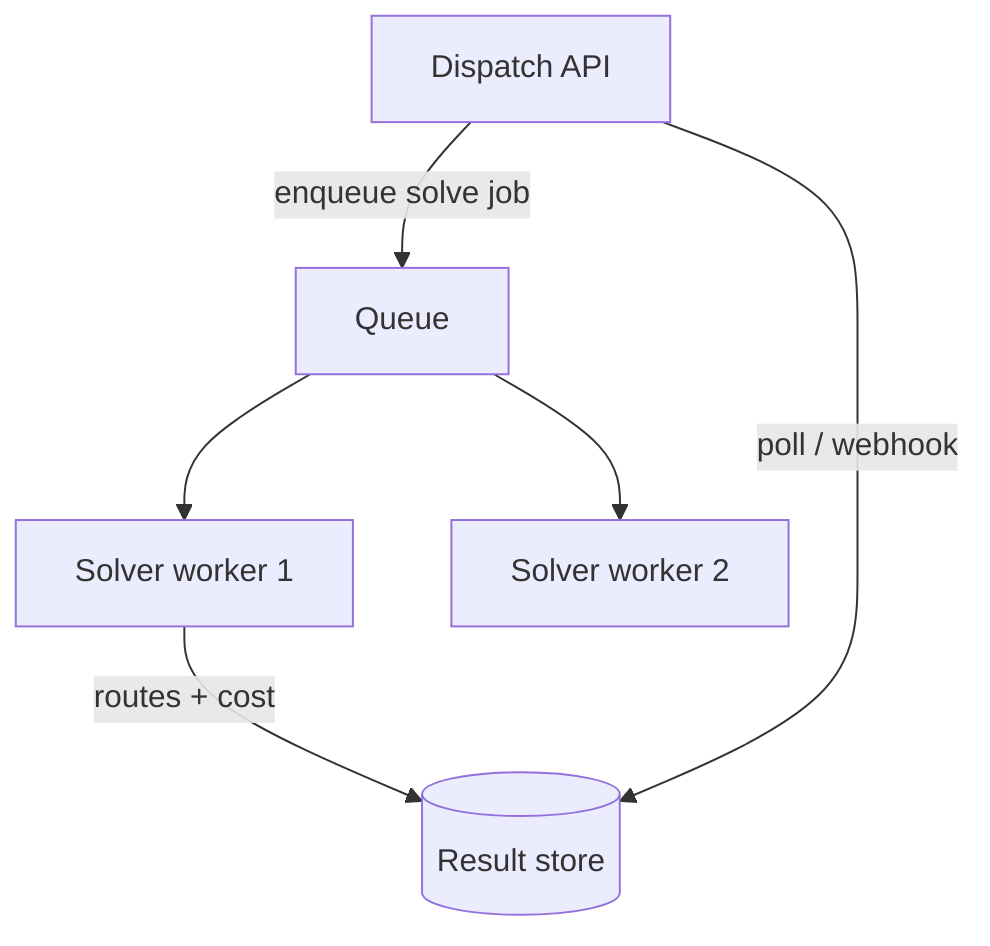
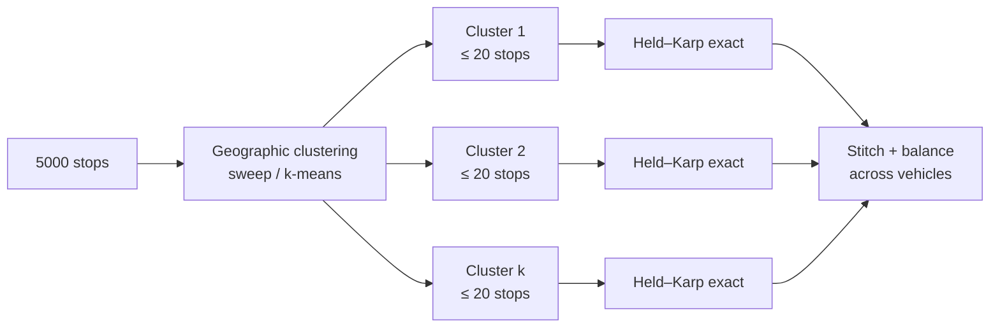

# NP-Hard: TSP & Hamiltonian Path/Cycle — Senior Level

> A TSP solver is rarely the whole product — it is one component inside a routing engine that also juggles time windows, vehicle capacities, driver shifts, live traffic, and a service-level agreement. At senior level the question shifts from "what is the optimal tour?" to "what solver do I select, how do I bound its runtime, and what happens when it returns late or returns garbage in production?"

## Table of Contents
1. [Introduction](#1-introduction)
2. [Routing & Logistics Engines](#2-routing--logistics-engines)
3. [Solver Selection at Scale](#3-solver-selection-at-scale)
4. [Real Constraints: VRP and Beyond](#4-real-constraints-vrp-and-beyond)
5. [Architecture Patterns](#5-architecture-patterns)
6. [Code Examples](#6-code-examples)
7. [Distance Matrices & Data Pipelines](#7-distance-matrices--data-pipelines)
8. [Observability](#8-observability)
9. [Failure Modes](#9-failure-modes)
10. [Capacity Planning](#10-capacity-planning)
11. [Summary](#11-summary)

---

## 1. Introduction

The textbook TSP — symmetric, metric, single vehicle, no constraints — almost never appears in production. What appears is the **Vehicle Routing Problem (VRP)** and its many decorations: multiple vehicles, capacity limits, delivery time windows, pickup-then-dropoff precedence, asymmetric travel times that change by the minute, and a hard wall-clock budget because the dispatcher needs routes in 30 seconds, not 30 minutes.

A senior engineer's job is therefore *selection and integration*, not *invention*:

1. **Select** the right solver for the instance size, structure, and time budget.
2. **Build the distance/time matrix** correctly (this is usually the real bottleneck and the real cost).
3. **Wrap** the solver in timeouts, fallbacks, and warm starts so a slow or failed solve never blocks dispatch.
4. **Observe** tour quality and solve latency so you know when the optimizer is silently degrading.
5. **Plan capacity** so the optimization service scales with order volume.

This document treats TSP/VRP as a *service*, not an algorithm.

---

## 2. Routing & Logistics Engines

### 2.1 The standard stack


The optimizer is one box. The **matrix builder** (box C) is frequently the expensive, latency-dominating, and money-dominating component — a `1000×1000` matrix is a million routing queries.

### 2.2 Where exact methods live

Held–Karp and branch-and-bound survive in production only in *small subproblems*:

- The "last 15 stops" of a route after a coarse clustering pass.
- A single technician's daily itinerary (`n ≤ 20`).
- A sub-route inside a cluster produced by a sweep or k-means partition.

The senior pattern is **cluster-first, route-second** (or *route-first, cluster-second*): break a 2,000-stop problem into many `≤ 20`-stop clusters, solve each exactly with Held–Karp, then stitch. This bounds the exponential blow-up to per-cluster size.

---

## 3. Solver Selection at Scale

| Instance | Time budget | Recommended solver | Why |
|----------|-------------|--------------------|-----|
| `n ≤ 20`, exact needed | ms–s | Held–Karp | provably optimal, fits memory |
| `n ≤ ~60`, exact wanted | s–min | Branch-and-bound (reduced-cost / 1-tree bound) | prunes hard, optimal |
| metric, `n ≤ few k`, guarantee | s | Christofides (OR-Tools `CHRISTOFIDES` first solution) | 1.5× bound, fast |
| `n` up to 10⁵, near-optimal | s–min | **LKH** (Lin–Kernighan–Helsgaun) | best practical heuristic |
| VRP with constraints | s–min | **OR-Tools routing** | constraints + metaheuristics |
| millions of cities, research | hours | Concorde (exact) / LKH | record-setting |

The two production heavyweights:

- **Google OR-Tools** — a constraint-based routing layer. You declare dimensions (distance, time, capacity), constraints (time windows, pickup/delivery), and a search strategy (first-solution heuristic + local-search metaheuristic like guided local search). It is the default for *constrained* routing.
- **LKH / Concorde** — pure (A)TSP engines. LKH is the heuristic champion (Lin–Kernighan with backtracking); Concorde is the exact champion (branch-and-cut, solved the 85,900-city instance to optimality).

**Selection heuristic:** if the problem has real-world constraints (windows, capacities), start with **OR-Tools**. If it is a pure shortest-tour problem at scale, start with **LKH**. If `n` is tiny and you need the proven optimum, **Held–Karp**.

### 3.1 A concrete OR-Tools sketch

OR-Tools is the most common production entry point. The shape of the API is worth knowing even if you delegate the math:

```python
# pip install ortools   (conceptual sketch — the real call signatures vary by version)
from ortools.constraint_solver import pywrapcp, routing_enums_pb2


def solve_tsp_ortools(dist_matrix, time_budget_s=5):
    n = len(dist_matrix)
    manager = pywrapcp.RoutingIndexManager(n, 1, 0)  # n nodes, 1 vehicle, depot 0
    routing = pywrapcp.RoutingModel(manager)

    def cost(from_index, to_index):
        i = manager.IndexToNode(from_index)
        j = manager.IndexToNode(to_index)
        return dist_matrix[i][j]

    transit = routing.RegisterTransitCallback(cost)
    routing.SetArcCostEvaluatorOfAllVehicles(transit)

    params = pywrapcp.DefaultRoutingSearchParameters()
    # first-solution heuristic, then polish with guided local search:
    params.first_solution_strategy = (
        routing_enums_pb2.FirstSolutionStrategy.PATH_CHEAPEST_ARC)
    params.local_search_metaheuristic = (
        routing_enums_pb2.LocalSearchMetaheuristic.GUIDED_LOCAL_SEARCH)
    params.time_limit.FromSeconds(time_budget_s)  # anytime: best-so-far at deadline

    solution = routing.SolveWithParameters(params)
    route, idx = [], routing.Start(0)
    while not routing.IsEnd(idx):
        route.append(manager.IndexToNode(idx))
        idx = solution.Value(routing.NextVar(idx))
    return route
```

Two senior observations about this snippet:

1. The **time budget is a first-class parameter**. The solver is *anytime*: it constructs a cheap first solution, then improves it under guided local search until the clock runs out. You trade a tighter optimality gap for more wall-clock time, knowingly.
2. The **first-solution strategy** (`PATH_CHEAPEST_ARC` ≈ nearest-neighbor; `CHRISTOFIDES` for metric) and the **metaheuristic** (guided local search, simulated annealing, tabu) are knobs. The default pairing is excellent; resist hand-rolling until profiling proves you must.

### 3.2 When to keep an exact solver in the loop

Even at scale, an exact Held–Karp pass earns its place on the *tail* of a route. After a metaheuristic produces a near-optimal global tour, re-solving each contiguous window of ≤ 15 stops exactly (a "segment optimizer") squeezes out the last fraction of a percent cheaply. This hybrid — heuristic globally, exact locally — is a recurring senior pattern.

---

## 4. Real Constraints: VRP and Beyond

Classic TSP is one vehicle, no constraints. Production adds:

- **CVRP (Capacitated VRP):** each vehicle has a capacity; total demand on a route ≤ capacity.
- **VRPTW (Time Windows):** each stop must be served within `[earliest, latest]`. Travel *time* (not distance) and service durations matter; the matrix is asymmetric and time-dependent.
- **PDPTW (Pickup & Delivery):** pickup must precede its delivery on the same vehicle.
- **Multi-depot, heterogeneous fleet, driver shifts, breaks.**

Each constraint shrinks the feasible set and changes the objective. These are *not* solvable by raw TSP code; they are why constraint-based engines (OR-Tools) exist. The senior takeaway: **recognize when the problem is no longer TSP** and stop hand-rolling.

The travel-time matrix in VRPTW is typically **asymmetric** (one-way streets, turn restrictions) and **time-dependent** (rush hour). This breaks Christofides' metric assumptions; engines fall back to metaheuristics with no guarantee.

---

## 5. Architecture Patterns

### 5.1 Optimizer as an async service

Routing is slow and bursty. Make it a job:



The dispatcher submits a solve, gets a job id, and polls or receives a webhook. This decouples a 20-second solve from a 200-ms API SLA.

### 5.2 Anytime solving with a deadline

Metaheuristics (2-opt, LK, guided local search) are **anytime**: they always hold a valid tour and only improve it. Give the solver a wall-clock budget and return the best-so-far when the clock runs out. Never let a solver run unbounded in a request path.

### 5.3 Warm starts

Re-optimization (a new order arrives, one stop is cancelled) should not start from scratch. Seed the solver with yesterday's / the previous solution and let local search repair it. This is far faster and produces stable routes drivers can trust.

### 5.4 Cluster-first, route-second

Partition stops geographically (sweep, k-means, grid), solve each cluster exactly or near-exactly, then balance load across vehicles. This is how a 5,000-stop national problem becomes hundreds of tractable subproblems.



The risk is at the **cluster boundaries**: optimizing each cluster in isolation can leave a globally suboptimal stitch. Mitigations include overlapping clusters (a stop near a boundary considered by both), a final cross-cluster 2-opt pass over the stitched mega-tour, or an LP-based set-partitioning master problem that selects the best combination of cluster-tours.

### 5.5 Idempotency and determinism

Dispatch systems re-run optimization frequently (every new order, every cancellation). Two properties matter operationally:

- **Determinism:** the same inputs should yield the same routes, or drivers lose trust when a route "shuffles" for no visible reason. Seed every random metaheuristic with a fixed seed in production.
- **Stability under small changes:** adding one stop should perturb the route locally, not rebuild it. Warm starts (§5.3) deliver this; cold solves do not.

---

## 6. Code Examples

### 6.1 Held–Karp as a bounded sub-solver with a deadline

#### Go

```go
package main

import (
	"context"
	"fmt"
	"math"
	"time"
)

// SolveCluster runs exact Held-Karp but only if the cluster is small enough,
// otherwise it signals the caller to fall back to a heuristic.
func SolveCluster(ctx context.Context, dist [][]int) (int, []int, error) {
	n := len(dist)
	if n > 18 {
		return 0, nil, fmt.Errorf("cluster too large for exact (n=%d); use heuristic", n)
	}
	const INF = math.MaxInt32
	full := (1 << n) - 1
	dp := make([][]int, 1<<n)
	par := make([][]int, 1<<n)
	for m := range dp {
		dp[m] = make([]int, n)
		par[m] = make([]int, n)
		for i := range dp[m] {
			dp[m][i] = INF
			par[m][i] = -1
		}
	}
	dp[1][0] = 0
	for mask := 1; mask <= full; mask++ {
		if mask&1 == 0 {
			continue
		}
		select {
		case <-ctx.Done():
			return 0, nil, ctx.Err() // respect the deadline
		default:
		}
		for i := 0; i < n; i++ {
			if dp[mask][i] == INF || mask&(1<<i) == 0 {
				continue
			}
			for j := 0; j < n; j++ {
				if mask&(1<<j) != 0 {
					continue
				}
				nm := mask | (1 << j)
				if nd := dp[mask][i] + dist[i][j]; nd < dp[nm][j] {
					dp[nm][j], par[nm][j] = nd, i
				}
			}
		}
	}
	best, last := INF, -1
	for i := 1; i < n; i++ {
		if dp[full][i]+dist[i][0] < best {
			best, last = dp[full][i]+dist[i][0], i
		}
	}
	tour := []int{}
	for mask, cur := full, last; cur != -1; {
		tour = append(tour, cur)
		p := par[mask][cur]
		mask ^= 1 << cur
		cur = p
	}
	return best, tour, nil
}

func main() {
	ctx, cancel := context.WithTimeout(context.Background(), 2*time.Second)
	defer cancel()
	dist := [][]int{{0, 10, 15, 20}, {10, 0, 35, 25}, {15, 35, 0, 30}, {20, 25, 30, 0}}
	cost, tour, err := SolveCluster(ctx, dist)
	fmt.Println(cost, tour, err)
}
```

#### Java

```java
import java.util.*;
import java.util.concurrent.*;

public class BoundedSolver {
    // Returns null if the cluster is too big -> caller falls back to a heuristic.
    static int[] solve(int[][] dist, long deadlineMillis) {
        int n = dist.length;
        if (n > 18) return null;
        final int INF = Integer.MAX_VALUE / 2;
        int full = (1 << n) - 1;
        int[][] dp = new int[1 << n][n];
        for (int[] r : dp) Arrays.fill(r, INF);
        dp[1][0] = 0;
        for (int mask = 1; mask <= full; mask++) {
            if ((mask & 1) == 0) continue;
            if (System.currentTimeMillis() > deadlineMillis)
                throw new RuntimeException("solver deadline exceeded");
            for (int i = 0; i < n; i++) {
                if (dp[mask][i] == INF || (mask & (1 << i)) == 0) continue;
                for (int j = 0; j < n; j++) {
                    if ((mask & (1 << j)) != 0) continue;
                    int nm = mask | (1 << j);
                    dp[nm][j] = Math.min(dp[nm][j], dp[mask][i] + dist[i][j]);
                }
            }
        }
        int best = INF;
        for (int i = 1; i < n; i++) best = Math.min(best, dp[full][i] + dist[i][0]);
        return new int[]{best};
    }

    public static void main(String[] args) {
        int[][] d = {{0,10,15,20},{10,0,35,25},{15,35,0,30},{20,25,30,0}};
        System.out.println(Arrays.toString(solve(d, System.currentTimeMillis() + 2000)));
    }
}
```

#### Python

```python
import math
import time


def solve_cluster(dist, deadline):
    """Exact Held-Karp for small clusters; raise if too large or out of time."""
    n = len(dist)
    if n > 18:
        raise ValueError(f"cluster too large for exact (n={n}); use heuristic")
    INF = math.inf
    full = (1 << n) - 1
    dp = [[INF] * n for _ in range(1 << n)]
    dp[1][0] = 0
    for mask in range(1, full + 1):
        if not (mask & 1):
            continue
        if time.monotonic() > deadline:
            raise TimeoutError("solver deadline exceeded")
        for i in range(n):
            if dp[mask][i] == INF or not (mask & (1 << i)):
                continue
            for j in range(n):
                if mask & (1 << j):
                    continue
                nm = mask | (1 << j)
                nd = dp[mask][i] + dist[i][j]
                if nd < dp[nm][j]:
                    dp[nm][j] = nd
    return min(dp[full][i] + dist[i][0] for i in range(1, n))


if __name__ == "__main__":
    d = [[0,10,15,20],[10,0,35,25],[15,35,0,30],[20,25,30,0]]
    print(solve_cluster(d, time.monotonic() + 2.0))  # 80
```

---

## 7. Distance Matrices & Data Pipelines

The matrix is the hidden giant. For `n` stops you need `n²` pairwise travel costs.

- **Symmetric road distance** halves the work but real *travel time* is asymmetric.
- **Cost of querying:** Google Distance Matrix API bills per element; a `500×500` matrix is 250k elements. Self-hosting **OSRM** or **Valhalla** is the standard cost-control move — one preprocessed road graph answers matrix queries in microseconds.
- **Caching:** stop pairs repeat across days; cache the matrix keyed by `(origin, dest, time-bucket)`.
- **Approximation:** for clustering you can use Haversine (great-circle) distance — cheap, metric, good enough to *partition*, then compute true road times only within clusters.

A senior reviewing a routing system asks about the matrix first; it usually dominates both latency and cloud bill.

### 7.1 The `n²` query budget

For `n` stops you need up to `n²` pairwise costs. The growth is quadratic, so the cost of the matrix dwarfs the cost of the optimizer well before `n` reaches a thousand:

| n | Matrix elements | Google API cost (≈ $5 / 1k elements) | OSRM self-host |
|---|-----------------|--------------------------------------|----------------|
| 100 | 10,000 | ~$50 | microseconds, free |
| 500 | 250,000 | ~$1,250 | a few ms, free |
| 1000 | 1,000,000 | ~$5,000 | tens of ms, free |

The economics force self-hosting at any real scale. **OSRM** preprocesses a country's road graph once (contraction hierarchies); thereafter a `1000×1000` matrix returns in tens of milliseconds. **Valhalla** trades some speed for time-dependent (traffic-aware) costs. **Graphhopper** sits between.

### 7.2 Matrix asymmetry and time-dependence

Two facts break the clean symmetric-metric textbook model:

- **Asymmetry:** `time(A→B) ≠ time(B→A)` because of one-way streets, turn penalties, and elevation. Any solver downstream must be asymmetry-aware (Held–Karp is; plain 2-opt is not).
- **Time-dependence:** rush-hour travel times differ from midnight. A truly correct VRPTW uses a *time-dependent* matrix indexed by departure time-bucket. Most systems approximate with a small number of buckets (e.g. hourly) and cache per bucket.

### 7.3 Caching strategy

Stop-to-stop costs repeat heavily across days (the same depots, the same recurring customers). Cache keyed by `(origin_cell, dest_cell, time_bucket)` where cells are a coarse geohash. A high cache-hit rate is often the single biggest lever on both latency and cost — track it as a primary metric (§8).

---

## 8. Observability

What to measure on a TSP/VRP service:

| Metric | Why | Alert when |
|--------|-----|------------|
| Solve latency p50/p95/p99 | dispatch SLA | p95 > budget |
| Gap to lower bound (`tour / LB − 1`) | tour quality | gap creeps up over releases |
| First-solution vs final cost | is local search helping? | improvement < a few % |
| Matrix build time & cache hit rate | usually the real cost | hit rate drops |
| Infeasible-solve rate (VRPTW) | over-constrained inputs | spike = bad upstream data |
| Per-cluster `n` distribution | exact-solver safety | clusters exceeding the `n ≤ 18` cap |

The most important *quality* signal is the **optimality gap** against a lower bound (MST / 1-tree / LP relaxation). Without a lower bound you cannot tell a 3%-from-optimal tour from a 40%-from-optimal one — they both "look like routes."

### 8.1 Computing a cheap lower bound for the gap

You do not need to solve the LP relaxation to get a usable lower bound. The **MST** (`w(MST) ≤ OPT`) is computable in `O(E log V)` and gives an instant, if loose, floor. The **Held–Karp 1-tree** bound (a few Lagrangian iterations) is tighter — typically within ~1% of `OPT` — and is worth running once per solve purely for the gap metric. Emit `gap = solver_cost / lower_bound − 1` as a gauge; a slow upward drift across releases is your early warning that a refactor quietly degraded quality.

### 8.2 Structured logs worth emitting

```text
solve_id=... n=512 cluster_count=34 max_cluster_n=18
  matrix_build_ms=210 matrix_cache_hit=0.83
  first_solution_cost=14820 final_cost=13110 lower_bound=12760
  gap=0.0274 solver_ms=4900 deadline_ms=5000 hit_deadline=true
```

A reviewer can read this line and immediately answer: was the matrix the bottleneck? did local search help (first vs final)? how close to optimal? did we run out of time? Those four questions cover most routing incidents.

---

## 9. Failure Modes

1. **Exponential blow-up in a cluster** — a clustering bug produces a 30-stop cluster; Held–Karp tries to allocate `2³⁰` and OOMs. *Guard with a hard `n` cap and a heuristic fallback.*
2. **Non-metric input silently breaks guarantees** — someone feeds raw traffic times into a Christofides path and trusts a 1.5× bound that no longer holds. *Validate the metric assumption or drop the claim.*
3. **Asymmetric matrix into a symmetric solver** — 2-opt reversals miscompute cost; routes look fine but are wrong. *Match solver to matrix symmetry.*
4. **Unbounded solve in the request path** — a metaheuristic with no deadline pins a CPU and blocks dispatch. *Always pass a wall-clock budget; return best-so-far.*
5. **Stale matrix** — yesterday's travel times during today's road closure. *TTL the cache; invalidate on incidents.*
6. **Path-vs-cycle mismatch** — solver returns an open path but dispatch assumes a closed loop (driver must return to depot). *Pin the convention in the contract.*

---

## 10. Capacity Planning

Sizing an optimization service:

- **Per-solve CPU:** Held–Karp at `n = 18` is `~2¹⁸ · 18² ≈ 8.5 × 10⁷` ops — single-digit milliseconds. LKH on `n = 1000` with a 5-second budget pins one core for 5 seconds. Plan cores = peak concurrent solves.
- **Memory:** Held–Karp memory is the cap — `2ⁿ · n` ints. At `n = 18`, `~18 MB`; at `n = 22`, `~370 MB`; at `n = 25`, `~3.4 GB`. This is why the per-cluster cap is ~18–20.
- **Matrix queries:** dominate cost. Self-host OSRM; budget RAM for the preprocessed graph (a country fits in a few GB).
- **Throughput:** solves are CPU-bound and embarrassingly parallel across jobs — scale horizontally with a queue and a worker pool.
- **Tail latency:** anytime solvers let you cap p99 by budget; without a budget the tail is unbounded.

Rule of thumb: provision for **peak concurrent solves × per-solve cores**, plus a separate, well-cached **matrix tier**.

### 10.1 Held–Karp memory table

Because memory is the binding resource for the exact sub-solver, internalize this table — it directly sets your per-cluster cap:

| n | states (2ⁿ·n) | ints (4 B) memory | feasible? |
|---|---------------|-------------------|-----------|
| 16 | 1.0 M | ~4 MB | yes |
| 18 | 4.7 M | ~19 MB | yes |
| 20 | 21 M | ~84 MB | yes (tight) |
| 22 | 92 M | ~370 MB | risky |
| 24 | 400 M | ~1.6 GB | no for a shared worker |
| 25 | 838 M | ~3.4 GB | no |

A worker pool of 8-core boxes with a few GB each comfortably runs many concurrent `n ≤ 20` solves; a single `n = 25` solve would monopolize one. Hence the universal `n ≤ ~18–20` per-cluster cap with a heuristic fallback above it.

### 10.2 Testing a routing service

- **Golden small instances:** keep a suite where Held–Karp/brute force gives the known optimum; assert the production solver is within its claimed gap.
- **Property tests:** every returned route is a permutation of its stops (no dupes, no drops); every route respects vehicle capacity and time windows; total served = total requested.
- **Regression on quality:** track the optimality gap on a fixed benchmark across releases; fail CI if it worsens beyond a threshold.
- **Load tests:** confirm p99 solve latency stays under the deadline at peak concurrency, and that the matrix cache hit-rate holds under realistic key churn.

These tests catch the two scariest silent failures: a route that *looks* valid but drops a stop, and a quality regression invisible without a lower bound.

### 10.3 Cost model for the whole pipeline

When a stakeholder asks "what does this routing system cost to run," break it into three line items:

| Component | Driver of cost | Lever |
|-----------|----------------|-------|
| Matrix tier | `n²` queries × order volume | self-host OSRM, cache by geohash + time-bucket |
| Solver tier | peak concurrent solves × CPU-seconds | anytime deadlines, cluster-first to cap `n` |
| Storage/queue | results + job metadata | TTL old solves, compress routes |

In nearly every deployment the **matrix tier dominates** until you self-host, after which the **solver tier** becomes the cost center. The single most common senior mistake is optimizing the solver (shaving milliseconds off Held–Karp) while a paid Distance Matrix API quietly bills five figures a month. Profile the pipeline end-to-end before tuning any one box.

---

## 12. Putting It Together

A production routing system is a pipeline, and TSP is one stage of it. The senior contributions, restated as a checklist:

1. **Classify** every instance (size, metric/non-metric, symmetric/asymmetric) and route it to the right solver.
2. **Cap** the exact sub-solver at `n ≤ ~18–20` with a heuristic fallback above it.
3. **Budget** every solve with a wall-clock deadline and return the anytime best-so-far.
4. **Cache** the distance matrix aggressively — it is the true cost center.
5. **Measure** the optimality gap against a lower bound, not just latency.
6. **Warm-start** re-optimizations for speed and route stability.
7. **Test** for dropped stops and quality regressions, not just crashes.

Get those seven right and the underlying algorithm — Held–Karp, Christofides, LKH, OR-Tools — becomes an implementation detail you can swap without redesigning the system.

The connective tissue to the earlier files:

- `junior.md` taught the Held–Karp recurrence and the `n ≤ 20` ceiling.
- `middle.md` taught the ladder of approximations (2-approx, Christofides) and heuristics (NN, 2-opt, LK).
- `professional.md` proves why each guarantee holds and where it breaks.
- This file places all of them inside a service with deadlines, matrices, observability, and capacity planning.

The algorithm is necessary but not sufficient — production value comes from the scaffolding around it: the right solver for the instance, a budget on the clock, a cached matrix, a measured optimality gap, and tests that catch dropped stops and silent quality regressions.

---

## 11. Summary

At senior level, TSP is a *component*, not a *deliverable*. The real system is a routing engine: a matrix builder (the true cost center), a solver chosen by instance size and constraints (Held–Karp for tiny exact subproblems, Christofides/LKH for scale, OR-Tools for constrained VRP), and operational scaffolding — async jobs, wall-clock deadlines, anytime best-so-far results, warm starts, optimality-gap observability, and hard `n` caps to keep the exponential solver from OOMing. The algorithms from junior and middle levels are still there underneath; the senior contribution is knowing *which* to deploy *where*, and what to do when the optimizer returns late, returns an infeasible answer, or returns a tour whose quality you cannot even measure without a lower bound.
</content>
