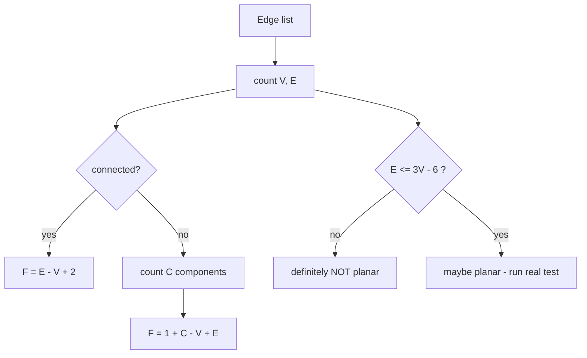

# Planar Graphs & Euler's Formula (Faces) — Junior Level

> **One-line summary:** A *planar graph* is one you can draw on a flat sheet so that no two edges cross. When you do, the drawing carves the plane into **faces** (regions, including the unbounded *outer* face), and for any connected planar drawing the simple count `V − E + F = 2` always holds. From that one identity you get a fast "is this even drawable?" test: a simple planar graph with `V ≥ 3` can have at most `E ≤ 3V − 6` edges.

---

## Table of Contents

1. [Introduction](#introduction)
2. [Prerequisites](#prerequisites)
3. [Glossary](#glossary)
4. [Core Concepts](#core-concepts)
5. [Big-O Summary](#big-o-summary)
6. [Real-World Analogies](#real-world-analogies)
7. [Pros & Cons](#pros--cons)
8. [Step-by-Step Walkthrough](#step-by-step-walkthrough)
9. [Code Examples](#code-examples)
10. [Coding Patterns](#coding-patterns)
11. [Error Handling](#error-handling)
12. [Performance Tips](#performance-tips)
13. [Best Practices](#best-practices)
14. [Edge Cases & Pitfalls](#edge-cases--pitfalls)
15. [Common Mistakes](#common-mistakes)
16. [Cheat Sheet](#cheat-sheet)
17. [Visual Animation](#visual-animation)
18. [Summary](#summary)
19. [Further Reading](#further-reading)

---

## Introduction

Some graphs can be drawn on paper without any edges crossing; some cannot, no matter how cleverly you bend the lines. A graph that *can* be drawn crossing-free in the plane is called **planar**. This is not a cosmetic property — planarity controls how many edges a graph can have, whether a circuit can be printed on a single layer, whether a road map can be colored with few colors, and how fast many graph algorithms run.

The cornerstone result is **Euler's formula**, discovered by Leonhard Euler in 1750 while studying polyhedra. For any *connected* graph drawn in the plane with no crossings:

```
V − E + F = 2
```

where `V` is the number of vertices, `E` the number of edges, and `F` the number of **faces** — the regions the drawing cuts the plane into, *including the single unbounded region surrounding everything* (the **outer face**).

This tiny equation is astonishingly powerful. From it, with a one-line counting argument, you can prove that a simple planar graph on `V ≥ 3` vertices has at most `3V − 6` edges. That bound immediately tells you that the complete graph on 5 vertices, `K5` (which has 10 edges but `3·5 − 6 = 9`), **cannot** be planar — it has one edge too many to ever be drawn without a crossing.

At the junior level your two jobs are: (1) count faces with Euler's formula, and (2) use the `E ≤ 3V − 6` bound as a cheap "could this possibly be planar?" filter. Those two skills cover most of what you need for everyday reasoning, contest warm-ups, and interview screening questions.

---

## Prerequisites

Before reading this file you should be comfortable with:

- **Graph basics** — vertices, edges, degree, connected vs disconnected. See sibling topic `01-representation`.
- **Adjacency lists / adjacency matrices** — how a graph is stored in code.
- **Counting connected components** — a quick DFS or BFS (see `02-bfs`, `03-dfs`). Euler's formula cares about connectivity.
- **Integer arithmetic and inequalities** — the whole topic is built on `V − E + F` and `E ≤ 3V − 6`.
- **Basic Big-O** — `O(V + E)` for a graph scan.

Optional but helpful:

- Having drawn a few graphs on paper — even doodles of triangles and squares.
- A passing familiarity with `K5` (five mutually-connected dots) and `K3,3` (the "three houses, three utilities" puzzle).

---

## Glossary

| Term | Meaning |
|------|---------|
| **Planar graph** | A graph that *can* be drawn in the plane with no two edges crossing. |
| **Planar embedding** | A specific crossing-free drawing (more precisely, the cyclic order of edges around each vertex). |
| **Face** | A maximal region of the plane bounded by edges in a planar drawing. |
| **Outer (unbounded) face** | The single face that extends infinitely outward, surrounding the whole drawing. It still counts in `F`. |
| **Euler's formula** | `V − E + F = 2` for a connected planar graph (any crossing-free drawing of it). |
| **Simple graph** | No self-loops, no repeated (parallel) edges. The `E ≤ 3V − 6` bound assumes this. |
| **`K5`** | The complete graph on 5 vertices: every pair joined. Non-planar. |
| **`K3,3`** | The complete *bipartite* graph with parts of size 3 and 3. Non-planar. |
| **Bipartite / triangle-free** | No odd cycles / no triangles. Gets the tighter bound `E ≤ 2V − 4`. |
| **Dual graph** | A graph with one vertex per face; faces sharing an edge get connected. |
| **Connected component** | A maximal set of vertices all reachable from each other. |
| **Degree of a face** | The number of edges you walk when tracing its boundary (a bridge edge is counted twice). |

---

## Core Concepts

### 1. What "planar" actually means

A graph is an abstract object: a set of vertices and a set of pairs (edges). "Planar" is a property of whether *some* drawing of it avoids crossings. The same abstract graph can be drawn with crossings (badly) or without (well). What matters is whether a crossing-free drawing *exists*.

The classic example: a square with both diagonals drawn looks like it has a crossing in the middle. But you can redraw one diagonal *outside* the square, and now there is no crossing — so that graph (`K4`) is planar. Planarity is about the abstract graph, not your first sketch.

### 2. Faces — and don't forget the outer one

Once you have a crossing-free drawing, the edges divide the plane into connected regions called **faces**. There is always exactly one unbounded region wrapping around the outside; that is the **outer face**, and beginners forget it constantly. A triangle drawn in the plane has **2** faces: the inside triangle and the outside.

```
        a
       / \
      /   \        Face 1: inside the triangle
     b-----c       Face 2: the outer (unbounded) region

   V = 3, E = 3, F = 2   →   3 − 3 + 2 = 2  ✓
```

### 3. Euler's formula: V − E + F = 2

For any *connected* graph drawn without crossings:

```
V − E + F = 2     ⟺     F = 2 − V + E = E − V + 2
```

So if you know a connected planar graph has `V` vertices and `E` edges, you instantly know how many faces *any* crossing-free drawing of it will have — without drawing it: `F = E − V + 2`. The face count does **not** depend on which valid drawing you choose.

### 4. The edge bound E ≤ 3V − 6 (the cheap planarity filter)

Here is the magic. In a simple planar graph with `V ≥ 3`, every face is bounded by at least 3 edges, and every edge borders at most 2 faces. Counting edge-face incidences both ways gives `3F ≤ 2E`, i.e. `F ≤ 2E/3`. Plug into Euler:

```
V − E + F = 2
F = 2 − V + E
2 − V + E ≤ 2E/3
3(2 − V + E) ≤ 2E
6 − 3V + 3E ≤ 2E
E ≤ 3V − 6
```

So: **if a simple graph with `V ≥ 3` has more than `3V − 6` edges, it cannot be planar.** This is a one-line, `O(1)` necessary test. (Caution: passing the test does *not* prove planarity — see Pitfalls.)

### 5. The bipartite / triangle-free bound E ≤ 2V − 4

If the graph has no triangles (in particular if it is bipartite), every face needs at least **4** edges, so `4F ≤ 2E`, and the same algebra gives the tighter bound:

```
E ≤ 2V − 4     (for simple, triangle-free / bipartite graphs, V ≥ 3)
```

`K3,3` has `V = 6`, `E = 9`, and `2·6 − 4 = 8 < 9`, so `K3,3` is non-planar. (It passes the `3V − 6 = 12` test, which is why we need the tighter bipartite bound to catch it.)

### 6. The two forbidden graphs

The two smallest non-planar graphs are `K5` and `K3,3`. A deep theorem (Kuratowski / Wagner, covered in `professional.md`) says these two are essentially the *only* obstructions: a graph is planar **iff** it does not contain a subdivision (or minor) of `K5` or `K3,3`. At junior level just remember these two names and their edge counts.

---

## Big-O Summary

| Task | Time | Space | Notes |
|------|------|-------|-------|
| Count faces from `V`, `E` (connected) | **O(1)** | O(1) | `F = E − V + 2`. |
| `E ≤ 3V − 6` planarity filter | **O(1)** | O(1) | Necessary, not sufficient. |
| `E ≤ 2V − 4` bipartite filter | **O(1)** | O(1) | Needs triangle-free / bipartite. |
| Count edges / vertices from a list | **O(E)** / **O(V)** | O(1) | One scan. |
| Count connected components | **O(V + E)** | O(V) | DFS/BFS; needed for the `1 + C` form. |
| Generalized Euler `V − E + F = 1 + C` | **O(V + E)** | O(V) | `C` = number of components. |
| Trace faces from an embedding | **O(E)** | O(E) | Needs the rotation system — see `middle.md`. |
| Full linear-time planarity test | **O(V)** | O(V) | Hopcroft–Tarjan; described, not coded here. |

For a simple planar graph, `E = O(V)` because `E ≤ 3V − 6`. That is why many algorithms on planar graphs are effectively linear in `V`.

---

## Real-World Analogies

| Concept | Analogy |
|---------|---------|
| Planar graph | A subway map that a designer managed to draw with no lines crossing — every interchange is a real station, never an accidental overpass. |
| Faces | The countries on a flat political map: each enclosed region is a face, and the ocean around the whole continent is the outer face. |
| Outer face | The sky/ocean surrounding everything — easy to forget it is "a region" too, but it is. |
| Euler's formula | An accounting identity: dots minus lines plus regions always balances to 2, like assets minus liabilities equaling equity. |
| `E ≤ 3V − 6` | A zoning rule: with this many plots of land you can only build so many fences before two must cross. |
| `K5` / `K3,3` | The "three houses, three utilities" puzzle — you cannot connect each of 3 houses to gas, water, and electricity without a crossing. That is `K3,3`. |
| Dual graph | The "who borders whom" map: turn each country into a dot, connect dots whose countries share a border. |

Where the analogy breaks: a real map can have lakes inside countries (holes), which graphs do not model directly; and Euler's formula needs the drawing to be *connected*, whereas a real map can have separate islands (then you use `V − E + F = 1 + C`).

---

## Pros & Cons

| Pros of knowing planarity | Cons / limits |
|---------------------------|----------------|
| `O(1)` test rejects obviously-too-dense graphs instantly. | The edge bound is *necessary, not sufficient* — passing it does not prove planarity. |
| Face count is free once you know `V` and `E` (connected). | You must verify connectivity first, or use the `1 + C` form. |
| Planar graphs are sparse (`E = O(V)`), so algorithms speed up. | Counting *which* faces touch *what* requires a full embedding, not just `V` and `E`. |
| Enables map coloring (4 colors suffice) and clean graph drawing. | The full planarity *test* (`K5`/`K3,3`-free) is genuinely subtle to implement. |
| Underpins VLSI layout, GIS, mesh processing. | Self-loops and parallel edges break the simple-graph bound. |

**When to use the edge bound:** as a fast pre-filter before an expensive layout or planarity routine, or to reject impossible inputs in a contest.

**When NOT to rely on it alone:** when you actually need a *yes* answer to "is this planar?" — then you need a real planarity test (`K5`/`K3,3` minor check or Hopcroft–Tarjan).

---

## Step-by-Step Walkthrough

### Walkthrough A — apply Euler's formula to count faces

Take a connected planar graph: a square `a-b-c-d-a` plus one diagonal `a-c`.

```
   a -------- b
   | \        |
   |   \      |
   |     \    |
   d ------ c
```

- Vertices: `a, b, c, d` → `V = 4`.
- Edges: `a-b, b-c, c-d, d-a, a-c` → `E = 5`.
- Faces by Euler: `F = E − V + 2 = 5 − 4 + 2 = 3`.

Check by eye: triangle `a-b-c`, triangle `a-c-d`, and the outer face → **3 faces**. ✓

### Walkthrough B — apply the E ≤ 3V − 6 filter

Is `K5` (5 vertices, all pairs joined) possibly planar?

- `V = 5`, `E = C(5,2) = 10`.
- Bound: `3V − 6 = 3·5 − 6 = 9`.
- `10 > 9` → **fails the bound** → `K5` is **not planar**. ✓ (No drawing exists.)

### Walkthrough C — the bipartite bound catches K3,3

Is `K3,3` planar? It passes `3V − 6`, so we need the tighter bound.

- `V = 6`, `E = 9`. It is bipartite (two groups of 3), hence triangle-free.
- Bound: `2V − 4 = 2·6 − 4 = 8`.
- `9 > 8` → **fails the bipartite bound** → `K3,3` is **not planar**. ✓

### Walkthrough D — a graph that passes the filter (a 3×3 grid)

A `3×3` grid graph: `V = 9`, `E = 12`.

- `3V − 6 = 21`, and `12 ≤ 21` → **passes** the filter (consistent with being planar; grids are planar).
- If connected, faces: `F = E − V + 2 = 12 − 9 + 2 = 5` — the four little squares plus the outer face. ✓

Notice in Walkthrough D the filter only says "not obviously impossible." It is a necessary condition, never a proof of planarity.

---

## Code Examples

### Example: Euler face count + the planarity edge bounds

We write three small utilities: `faceCount` (via Euler's formula, assuming a connected planar graph), `edgeBoundPlanar` (the `E ≤ 3V − 6` necessary filter), and `bipartiteBoundPlanar` (the `E ≤ 2V − 4` filter). We test them on a triangle, the diagonal-square, `K5`, and `K3,3`.

#### Go

```go
package main

import "fmt"

// faceCount returns F for a CONNECTED planar graph via Euler's formula.
// V - E + F = 2  =>  F = E - V + 2.
func faceCount(v, e int) int {
	return e - v + 2
}

// edgeBoundPlanar reports whether E <= 3V - 6 (necessary condition for a
// simple planar graph with V >= 3). Returns true if the graph could be planar.
func edgeBoundPlanar(v, e int) bool {
	if v < 3 {
		return true // trivially planar: any graph on < 3 vertices is planar
	}
	return e <= 3*v-6
}

// bipartiteBoundPlanar applies the tighter E <= 2V - 4 bound for simple
// triangle-free (e.g. bipartite) graphs with V >= 3.
func bipartiteBoundPlanar(v, e int) bool {
	if v < 3 {
		return true
	}
	return e <= 2*v-4
}

func main() {
	fmt.Println("triangle  faces:", faceCount(3, 3))               // 2
	fmt.Println("diag sq   faces:", faceCount(4, 5))               // 3
	fmt.Println("3x3 grid  faces:", faceCount(9, 12))              // 5

	fmt.Println("K5  edge-bound planar? ", edgeBoundPlanar(5, 10)) // false
	fmt.Println("K33 edge-bound planar? ", edgeBoundPlanar(6, 9))  // true (passes simple bound)
	fmt.Println("K33 bipartite  planar? ", bipartiteBoundPlanar(6, 9)) // false (caught here)
	fmt.Println("grid edge-bound planar?", edgeBoundPlanar(9, 12)) // true
}
```

#### Java

```java
public class PlanarBasics {

    // F for a CONNECTED planar graph: V - E + F = 2 => F = E - V + 2.
    static int faceCount(int v, int e) {
        return e - v + 2;
    }

    // Necessary condition for simple planar graph (V >= 3): E <= 3V - 6.
    static boolean edgeBoundPlanar(int v, int e) {
        if (v < 3) return true;
        return e <= 3 * v - 6;
    }

    // Tighter bound for simple triangle-free / bipartite graphs (V >= 3).
    static boolean bipartiteBoundPlanar(int v, int e) {
        if (v < 3) return true;
        return e <= 2 * v - 4;
    }

    public static void main(String[] args) {
        System.out.println("triangle faces: " + faceCount(3, 3));   // 2
        System.out.println("diag sq  faces: " + faceCount(4, 5));   // 3
        System.out.println("3x3 grid faces: " + faceCount(9, 12));  // 5

        System.out.println("K5  edge-bound planar?  " + edgeBoundPlanar(5, 10));      // false
        System.out.println("K33 edge-bound planar?  " + edgeBoundPlanar(6, 9));       // true
        System.out.println("K33 bipartite planar?   " + bipartiteBoundPlanar(6, 9));  // false
        System.out.println("grid edge-bound planar? " + edgeBoundPlanar(9, 12));      // true
    }
}
```

#### Python

```python
def face_count(v: int, e: int) -> int:
    """F for a CONNECTED planar graph: V - E + F = 2 => F = E - V + 2."""
    return e - v + 2


def edge_bound_planar(v: int, e: int) -> bool:
    """Necessary condition for a simple planar graph with V >= 3: E <= 3V - 6."""
    if v < 3:
        return True
    return e <= 3 * v - 6


def bipartite_bound_planar(v: int, e: int) -> bool:
    """Tighter bound for simple triangle-free / bipartite graphs (V >= 3)."""
    if v < 3:
        return True
    return e <= 2 * v - 4


if __name__ == "__main__":
    print("triangle faces:", face_count(3, 3))    # 2
    print("diag sq  faces:", face_count(4, 5))     # 3
    print("3x3 grid faces:", face_count(9, 12))    # 5

    print("K5  edge-bound planar? ", edge_bound_planar(5, 10))       # False
    print("K33 edge-bound planar? ", edge_bound_planar(6, 9))        # True
    print("K33 bipartite planar?  ", bipartite_bound_planar(6, 9))   # False
    print("grid edge-bound planar?", edge_bound_planar(9, 12))       # True
```

**What it does:** counts faces via Euler's formula and runs both necessary planarity filters; correctly rejects `K5` on the simple bound and `K3,3` on the bipartite bound.
**Run:** `go run main.go` | `javac PlanarBasics.java && java PlanarBasics` | `python planar_basics.py`

---

## Coding Patterns

### Pattern 1: Face count from an edge list (count first, then Euler)

**Intent:** You are handed an edge list and need the number of faces of a connected planar drawing.

```python
def faces_from_edges(num_vertices, edges):
    # Assumes the graph is connected and planar; F = E - V + 2.
    return len(edges) - num_vertices + 2
```

If you are not sure it is connected, first count components (next pattern) and use `F = E − V + 1 + C`.

### Pattern 2: Generalized Euler with components — V − E + F = 1 + C

**Intent:** Handle graphs that may be disconnected. With `C` connected components, the correct identity is `V − E + F = 1 + C`, so `F = 1 + C − V + E`.

```python
def faces_general(num_vertices, edges, components):
    return 1 + components - num_vertices + len(edges)
```

For a *connected* graph `C = 1` and this reduces to the familiar `F = E − V + 2`.

### Pattern 3: Quick reject before an expensive layout

**Intent:** Before running a costly graph-drawing or planarity routine, reject impossible inputs in `O(1)`.

```python
def could_be_planar(v, e, triangle_free=False):
    if v < 3:
        return True
    bound = 2 * v - 4 if triangle_free else 3 * v - 6
    return e <= bound
```



---

## Error Handling

| Error | Cause | Fix |
|-------|-------|-----|
| Wrong face count (off by 1) | Forgot to count the outer face, or used `E − V + 1`. | For connected graphs use `F = E − V + 2`. |
| Face formula gives nonsense on a forest | Applied connected formula to a disconnected graph. | Use `F = 1 + C − V + E`; a single tree has `F = 1` (just the outer face). |
| `E ≤ 3V − 6` rejects a valid small graph | Applied the bound when `V < 3`. | Guard `V < 3` and return "trivially planar." |
| `K3,3` wrongly passes | Used only `3V − 6`, not the bipartite bound. | Apply `2V − 4` when the graph is triangle-free / bipartite. |
| Counting parallel edges or self-loops | The simple-graph bound assumes neither. | Deduplicate edges and drop loops before applying the bound. |
| Negative face count | `E < V − 2` for a connected graph (impossible) — usually a miscount. | A connected graph has `E ≥ V − 1`; recheck your edge count. |

---

## Performance Tips

- **The Euler and edge-bound checks are `O(1)`** once you know `V` and `E` — never build the drawing just to count faces.
- **Deduplicate edges once** up front if your input may contain parallel edges; do it in `O(E)` with a hash set of normalized pairs.
- **Test triangle-freeness cheaply** when relevant: a graph is bipartite iff a 2-coloring BFS succeeds in `O(V + E)`; only then is the `2V − 4` bound valid.
- **Use the sparsity `E = O(V)`** of planar graphs: many downstream algorithms become linear in `V`, so prefer adjacency lists over matrices.
- **Short-circuit:** if `E > 3V − 6`, stop immediately — there is no point running an expensive planarity embedder.

---

## Best Practices

- Always state whether your graph is assumed **connected** before quoting `F = E − V + 2`.
- Treat the edge bounds as a **filter**, not a proof: "fails ⇒ non-planar" is valid; "passes ⇒ planar" is not.
- Normalize the graph first: drop self-loops, merge parallel edges, before applying the simple-graph bound.
- When in doubt about connectivity, compute components and use `V − E + F = 1 + C`.
- Keep `K5` and `K3,3` (with their `V, E` numbers) memorized — they are the canonical non-planar witnesses.
- Reference sibling `27-graph-coloring` for the four-color consequence of planarity, and `11-articulation-points-bridges` for the bridge edges that get counted twice in face degrees.

---

## Edge Cases & Pitfalls

- **The outer face counts.** A single triangle has `F = 2`, not `1`. Forgetting the unbounded face is the #1 beginner error.
- **Disconnected graphs.** `V − E + F = 2` only holds when connected. A graph with `C` components satisfies `V − E + F = 1 + C`. Two disjoint triangles: `V = 6, E = 6, C = 2`, so `F = 1 + 2 − 6 + 6 = 3` (each triangle's inside, plus *one* shared outer face).
- **Trees.** A tree (connected, `E = V − 1`) has exactly one face — the outer face: `F = (V − 1) − V + 2 = 1`. There are no enclosed regions.
- **`V < 3`.** The `E ≤ 3V − 6` bound is meaningless for `V = 1, 2` (it would give `≤ 0` or `≤ −3`). These graphs are trivially planar.
- **Self-loops and parallel edges.** They add faces and edges but break the *simple*-graph bound. Strip them before applying `3V − 6`.
- **Passing the bound ≠ planar.** Many dense non-planar graphs have few enough edges to pass `3V − 6` (e.g. `K3,3`). The bound is necessary, never sufficient.
- **Embedding-dependent face shapes.** Different valid drawings can produce differently-*shaped* faces, but the *count* `F` is always the same for a connected graph.

---

## Common Mistakes

1. **Forgetting the outer face** — quoting `F = 1` for a triangle instead of `2`.
2. **Using `F = E − V + 1`** — that is the disconnected/forest form; the connected form is `E − V + 2`.
3. **Treating the edge bound as sufficient** — concluding "planar" because `E ≤ 3V − 6` passed. It only rules things *out*.
4. **Applying `3V − 6` to a multigraph** — parallel edges and loops invalidate it; normalize first.
5. **Missing the bipartite bound** — declaring `K3,3` planar because it survives `3V − 6`. Use `2V − 4` for triangle-free graphs.
6. **Ignoring connectivity** — applying `V − E + F = 2` to a disconnected graph and getting the wrong `F`.
7. **Counting a bridge's face only once** — when computing *face degrees* (not the count), a bridge edge is traversed twice.

---

## Cheat Sheet

| Quantity | Formula | Condition |
|----------|---------|-----------|
| Faces (connected) | `F = E − V + 2` | connected, planar drawing |
| Faces (general) | `F = 1 + C − V + E` | `C` = #components |
| Euler identity | `V − E + F = 2` | connected planar |
| Simple planar edge bound | `E ≤ 3V − 6` | simple, `V ≥ 3` |
| Triangle-free / bipartite bound | `E ≤ 2V − 4` | simple, triangle-free, `V ≥ 3` |
| Min edges (connected) | `E ≥ V − 1` | a spanning tree |

Canonical non-planar graphs:

```
K5   : V = 5,  E = 10   (10 > 3·5 − 6 = 9)   → non-planar
K3,3 : V = 6,  E = 9    (9  > 2·6 − 4 = 8)   → non-planar (bipartite bound)
```

Quick mental checks:

```
triangle      V=3  E=3   F=2
square        V=4  E=4   F=2
square+diag   V=4  E=5   F=3
tetrahedron   V=4  E=6   F=4   (= K4, planar; 4 triangular faces)
cube          V=8  E=12  F=6
```

---

## Visual Animation

> See [`animation.html`](./animation.html) for an interactive visual animation of planar graphs and Euler's formula.
>
> The animation demonstrates:
> - A small planar graph drawn with its faces shaded in distinct colors.
> - The running tally `V − E + F` updating to stay at `2` as you add edges.
> - The outer face highlighted so you never forget to count it.
> - A non-planar attempt (`K5`) flagged the moment `E > 3V − 6`.
> - Step / Run / Reset controls to walk the construction one edge at a time.

---

## Summary

A planar graph is one drawable without crossings; doing so partitions the plane into faces, **including the outer face**. For any connected planar drawing, Euler's formula `V − E + F = 2` holds, which lets you read off `F = E − V + 2` for free. Counting edge-face incidences turns Euler's formula into the necessary planarity filter `E ≤ 3V − 6` (and `E ≤ 2V − 4` for triangle-free / bipartite graphs). These bounds instantly prove that `K5` and `K3,3` are non-planar — the two canonical obstructions. Remember that the edge bound is a one-way test (fail ⇒ non-planar), that the formula needs connectivity (use `1 + C` otherwise), and that the *count* of faces is drawing-independent even though their shapes are not.

---

## Further Reading

- *Introduction to Graph Theory* (Douglas West), Chapter 6 — "Planar Graphs" — the canonical treatment.
- *Graph Theory* (Reinhard Diestel), Chapter 4 — planarity, Euler's formula, Kuratowski.
- Euler, L. (1758) — original polyhedron formula `V − E + F = 2`.
- visualgo.net and CS Academy graph editors — draw graphs and see faces interactively.
- Sibling topics: `27-graph-coloring` (four-color theorem), `11-articulation-points-bridges` (bridges and face degrees), `12-eulerian-path-circuit` (a different "Euler" — paths, not faces).
