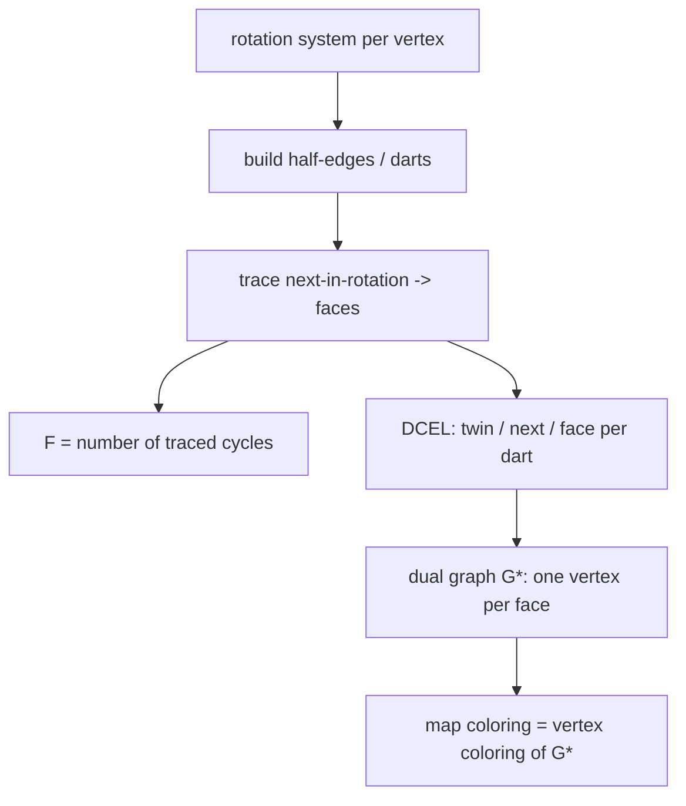

# Planar Graphs & Euler's Formula — Middle Level

> **Focus:** Why the edge bounds are correct, the three layers of "is it planar?" testing (cheap filter → forbidden-minor → linear-time embedder), and how to actually *trace* faces from an embedding using a rotation system or DCEL — plus the dual graph that falls out of it.

---

## Table of Contents

1. [Introduction](#introduction)
2. [Deeper Concepts](#deeper-concepts)
3. [Comparison: edge-bound vs Kuratowski vs linear-time testing](#comparison-edge-bound-vs-kuratowski-vs-linear-time-testing)
4. [Advanced Patterns](#advanced-patterns)
5. [Graph and Tree Applications](#graph-and-tree-applications)
6. [Dynamic Programming Integration](#dynamic-programming-integration)
7. [Code Examples](#code-examples)
8. [Error Handling](#error-handling)
9. [Performance Analysis](#performance-analysis)
10. [Best Practices](#best-practices)
11. [Visual Animation](#visual-animation)
12. [Summary](#summary)

---

## Introduction

At junior level planarity is two `O(1)` formulas. At middle level you start asking the engineering questions:

- *Why* does every face need at least 3 edges, and what happens to the bound when it does not?
- How do I compute the number of faces when I only have a drawing, not a clean `V`/`E`?
- What is a **rotation system**, and how does "trace the next edge in rotation" enumerate every face exactly once?
- When is the cheap `E ≤ 3V − 6` filter enough, and when must I escalate to a real planarity test?
- How does the **dual graph** appear, and why does map-coloring secretly happen on the dual?

These distinctions decide whether your circuit router rejects a board in microseconds or wastes minutes embedding something that was never planar.

---

## Deeper Concepts

### The face-degree counting argument, carefully

Define the **degree of a face** as the number of edge-sides you walk when tracing its boundary. A bridge (an edge with the same face on both sides) is counted **twice**. The fundamental identity — the face-side analogue of the handshake lemma — is:

```
Σ (degree of face f over all faces f) = 2E
```

because each edge contributes exactly two sides (one to the face on its left, one to the face on its right; a bridge contributes both to the same face).

Now, in a **simple** graph with `V ≥ 3` and at least one cycle, every face has degree `≥ 3`. So `2E = Σ deg(f) ≥ 3F`, giving `F ≤ 2E/3`. Substituting into `V − E + F = 2`:

```
2 = V − E + F ≤ V − E + 2E/3 = V − E/3   ⟹   E ≤ 3V − 6.
```

If additionally the graph is **triangle-free**, every face has degree `≥ 4`, so `2E ≥ 4F`, `F ≤ E/2`, and:

```
2 = V − E + F ≤ V − E + E/2 = V − E/2   ⟹   E ≤ 2V − 4.
```

This is the whole reason `K3,3` (bipartite, hence triangle-free, `E = 9 > 8`) is non-planar even though it sails through `3V − 6 = 12`.

### Embeddings = rotation systems

A *planar embedding* is not just "a picture." Combinatorially it is captured by a **rotation system**: for each vertex, the **cyclic clockwise order** of the edges around it. Two drawings with the same rotation system at every vertex have the same faces. This is the key insight that lets us trace faces algorithmically — we never need pixel coordinates, only the cyclic edge order.

### Face tracing by "next edge in rotation"

Represent each undirected edge as **two directed half-edges** (darts), one in each direction. Define, for a dart `u→v`, the operation:

```
next(u→v) = the dart leaving v that comes immediately *after* the dart v→u
            in the clockwise rotation around v.
```

Repeatedly applying `next` starting from any unused dart traces the boundary of exactly one face and returns to the start. Mark darts as used; each dart belongs to exactly one face. The number of distinct cycles you find is `F`. This is a clean `O(E)` algorithm — the workhorse of every face enumerator and the foundation of a **DCEL** (doubly connected edge list).

### The DCEL (doubly connected edge list)

A DCEL stores, per half-edge: its `twin` (the reverse dart), its `next` (next dart around the same face), and the `face` it borders. From a rotation system you build a DCEL in `O(E)`, after which "walk this face," "what's across this edge," and "list a face's vertices" are all `O(1)`-per-step traversals. It is the standard data structure for computational geometry and mesh processing.

### The dual graph

Given an embedding, the **dual** `G*` has one vertex per face of `G`, and one edge per edge of `G`: edge `e` of `G` becomes an edge connecting the two faces that `e` borders (a bridge yields a self-loop in the dual). Key facts:

- `G*` is itself planar; `(G*)* = G` for connected `G`.
- `V* = F`, `E* = E`, `F* = V` — Euler's formula is self-dual.
- A **cycle** in `G` corresponds to a **cut** (edge separator) in `G*`, and vice versa — the basis of planar max-flow / min-cut tricks.
- **Face coloring of `G`** = **vertex coloring of `G*`**: the Four-Color Theorem about maps is really about coloring the dual's vertices (see `27-graph-coloring`).

---

## Comparison: edge-bound vs Kuratowski vs linear-time testing

| Method | What it answers | Time | Verdict quality | Use when |
|--------|-----------------|------|-----------------|----------|
| Edge bound `E ≤ 3V − 6` | "Could it be planar?" | **O(1)** (after counting `E`, `V`) | Necessary only — *fail ⇒ non-planar*, pass ⇒ unknown | Cheap pre-filter, reject dense inputs |
| Bipartite bound `E ≤ 2V − 4` | Same, tighter for triangle-free | **O(V + E)** (needs bipartite check) | Necessary only | Triangle-free / bipartite inputs |
| Kuratowski / Wagner | "Is it planar?" (exact) | naive `O(V⁶)`–`O(V³)`; smarter `O(V²)` | Exact yes/no, plus a `K5`/`K3,3` witness | You want a *proof* of non-planarity (a witness subgraph) |
| PQ-tree / vertex addition (Booth–Lueker, Shih–Hsu) | "Is it planar?" + embedding | **O(V)** | Exact, produces an embedding | Production planarity testing |
| Left-Right (LR) algorithm (de Fraysseix–Rosenstiehl) | "Is it planar?" + embedding | **O(V)** | Exact, simpler to implement than PQ-trees | Modern linear-time embedder of choice |
| Hopcroft–Tarjan (path addition) | "Is it planar?" | **O(V)** | Exact (the original linear algorithm, 1974) | Historical / reference implementation |

The practical pipeline: **filter cheaply, then escalate**. Reject anything failing `3V − 6` (or `2V − 4`) in `O(1)`. For survivors that you must *confirm*, run a linear-time embedder (LR algorithm). Only reach for an explicit Kuratowski-subgraph extractor when you need to *show the user why* a graph is non-planar.

Why `K5`/`K3,3` are the only obstructions (Kuratowski 1930, Wagner 1937): a graph is planar **iff** it contains no **subdivision** of `K5` or `K3,3` (Kuratowski) **iff** it contains no `K5` or `K3,3` **minor** (Wagner). A "subdivision" replaces an edge by a path; a "minor" allows edge contraction too. Both statements are equivalent for these two graphs. The proofs are in `professional.md`.

---

## Advanced Patterns

### Pattern: DCEL face tracing from a rotation system

**Intent:** Given each vertex's clockwise edge order, enumerate every face and its boundary in `O(E)`.

The trick is the half-edge / dart formulation. For each vertex `v`, store its neighbors in clockwise order. For a dart arriving as `u→v`, the next dart on the same face leaves `v` toward the neighbor *clockwise-after* `u` in `v`'s rotation. Walk darts, mark visited, count cycles = `F`.

### Pattern: dual graph construction

**Intent:** Build `G*` once you have faces. Each edge `e` borders faces `f_left(e)` and `f_right(e)`; add a dual edge between those two face-vertices.

```python
def build_dual(face_of_dart, edges):
    # face_of_dart maps each directed dart to its face id (from tracing).
    dual_adj = {}
    for (u, v) in edges:
        f1 = face_of_dart[(u, v)]
        f2 = face_of_dart[(v, u)]
        dual_adj.setdefault(f1, []).append(f2)
        dual_adj.setdefault(f2, []).append(f1)
    return dual_adj
```

### Pattern: verify a claimed planar graph with the bipartite bound

**Intent:** Combine connectivity, bipartiteness, and the right edge bound into one verdict.

```python
def planarity_filter(v, e, is_triangle_free):
    if v < 3:
        return "planar (trivial)"
    bound = 2 * v - 4 if is_triangle_free else 3 * v - 6
    if e > bound:
        return "NOT planar (edge bound violated)"
    return "maybe planar (run full test)"
```

### Pattern: faces of a disconnected planar graph

**Intent:** Use the generalized identity `V − E + F = 1 + C`. Count components with a DFS, then `F = 1 + C − V + E`.



---

## Special Planar Families: Outerplanar, Series-Parallel, Maximal Planar

Three sub-families show up constantly and each tightens the bounds.

**Outerplanar graphs.** A graph is *outerplanar* if it has a planar embedding with **every vertex on the outer face** (think: dots on a circle, chords inside, no chord crossings). Outerplanar graphs satisfy the even tighter edge bound:

```
E ≤ 2V − 3      (simple outerplanar, V ≥ 2)
```

The forbidden minors shrink too: a graph is outerplanar iff it has no `K4` and no `K_{2,3}` minor (compare to `K5`/`K3,3` for planar). Outerplanar graphs have treewidth ≤ 2, so essentially every NP-hard graph problem is linear-time on them. Triangulated polygons (the classic interval/triangulation DP) are maximal outerplanar.

**Series-parallel graphs.** Built recursively by series and parallel edge compositions; equivalent to "no `K4` minor," treewidth ≤ 2. Every series-parallel graph is planar. These model electrical networks and reducible flow graphs.

**Maximal planar graphs (triangulations).** Adding any edge breaks planarity. They hit equality `E = 3V − 6`, `F = 2V − 4`, and every face (including the outer) is a triangle. They are exactly the duals of cubic (3-regular) planar graphs, and they are the worst case for the edge bound — the densest a simple planar graph can be.

| Family | Edge bound | Forbidden minors | Treewidth |
|--------|-----------|------------------|-----------|
| Outerplanar | `E ≤ 2V − 3` | `K4`, `K_{2,3}` | ≤ 2 |
| Series-parallel | `E ≤ 2V − 3` | `K4` | ≤ 2 |
| Bipartite planar | `E ≤ 2V − 4` | (planar + no triangle) | up to `O(√V)` |
| General planar | `E ≤ 3V − 6` | `K5`, `K3,3` | up to `O(√V)` |
| Maximal planar | `E = 3V − 6` | — (edge-maximal) | up to `O(√V)` |

Recognizing which family you are in lets you pick the *tightest* applicable bound and the *cheapest* applicable algorithm — outerplanar/series-parallel inputs unlock linear-time DP that general planar graphs do not.

## How Linear-Time Planarity Testing Works (Intuition)

You will rarely implement a linear-time planarity tester, but you should understand the *shape* of the algorithm so you know what a library is doing and why it is `O(V)`.

The unifying idea across all three classic lineages is **incremental embedding with a conflict structure**:

1. **DFS first.** Root a DFS tree; classify edges as tree edges or back edges. Compute *lowpoints* (the same machinery as articulation points / bridges in `11-articulation-points-bridges`). Back edges are what *can* cause crossings — tree edges alone form a planar caterpillar.
2. **Add structure incrementally** — either path-by-path (Hopcroft–Tarjan), vertex-by-vertex in an st-numbering (PQ-trees, Booth–Lueker), or edge-by-edge (Boyer–Myrvold).
3. **Maintain the admissible cyclic orders.** As you add a piece, the partially-built embedding has a set of "dangling" attachment points that must be arrangeable in *some* consistent cyclic order around the boundary. A **PQ-tree** (P-nodes permute freely, Q-nodes only reverse) compactly represents all admissible orders; each addition does a template reduction. The **Left-Right** algorithm instead 2-colors back edges "left"/"right" subject to parity constraints.
4. **Conflict ⇒ non-planar.** If no consistent arrangement exists, the graph is non-planar, and the algorithm can extract a `K5`/`K3,3` subdivision witness in `O(V)`.

The reason it is `O(V)` and not `O(V log V)`: the DFS lowpoint ordering means each edge is examined `O(1)` amortized times, and the PQ-tree / constraint updates are themselves amortized `O(1)` per edge by a potential argument. Because we already rejected `E > 3V − 6` in `O(1)`, "linear in edges" is "linear in vertices." Full derivations are in `professional.md`.

## Graph and Tree Applications

```mermaid
graph TD
    A[Planar graph] --> B[Euler: F = E - V + 2]
    A --> C[Edge bound: E <= 3V - 6 => sparse]
    A --> D[Dual graph G*]
    D --> E[Map coloring / Four-Color]
    A --> F[Planar separator theorem: O(sqrt V) separators]
    A --> G[Planar max-flow via dual shortest path]
    A --> H[Graph drawing / VLSI layout]
```

- **Sparsity unlocks speed.** Because `E ≤ 3V − 6`, any planar-graph algorithm whose cost is `O(V + E)` is really `O(V)`. Adjacency-list DFS/BFS, MST, and shortest paths all benefit.
- **Planar separator theorem (Lipton–Tarjan).** Every planar graph has a balanced separator of size `O(√V)`, enabling divide-and-conquer algorithms (sub-quadratic all-pairs, fast nested dissection for sparse linear systems).
- **Faces and bridges.** A *bridge* (see `11-articulation-points-bridges`) has the same face on both sides, so it is counted twice in that face's degree — important when you compute face degrees rather than just `F`.

---

## Dynamic Programming Integration

Planarity interacts with DP in two main ways.

First, **bounded-treewidth DP**: planar graphs of small diameter have small treewidth, and many NP-hard problems (independent set, dominating set, vertex cover) become polynomial via tree-decomposition DP. Baker's technique decomposes a planar graph into `k` "outerplanar-like" layers and runs DP on each to get a `(1 + 1/k)`-approximation in linear time.

Second, **DP over faces / the dual**. Counting perfect matchings in a planar graph is `#P`-hard in general but polynomial for planar graphs via the **FKT algorithm** (Fisher–Kasteleyn–Temperley), which uses a Pfaffian orientation derived from a planar embedding — the embedding's faces are exactly what make the orientation consistent.

#### Go

```go
// Sketch: count faces for a connected planar graph, then estimate the
// DP table size that a face-based dynamic program would need.
func dpTableSizeOverFaces(v, e int) int {
	faces := e - v + 2 // Euler, connected
	// A simple per-face DP with O(1) state per face needs O(F) cells.
	return faces
}
```

#### Java

```java
// Same sketch in Java: faces drive the DP dimension.
static int dpTableSizeOverFaces(int v, int e) {
    int faces = e - v + 2; // Euler, connected
    return faces;          // O(F) DP cells when state is per-face
}
```

#### Python

```python
def dp_table_size_over_faces(v: int, e: int) -> int:
    """For a connected planar graph, a per-face DP needs O(F) cells."""
    faces = e - v + 2  # Euler's formula, connected
    return faces
```

The takeaway: because `F = E − V + 2 = O(V)` for planar graphs, a per-face DP table is *linear* in the input — another payoff of planar sparsity.

---

## Code Examples

### Full face tracer from a rotation system, plus dual construction

We represent the graph by, for each vertex, its neighbors in **clockwise order**. We trace faces by the "next edge in rotation" rule and verify the count against Euler's formula. We then build the dual adjacency.

#### Go

```go
package main

import "fmt"

// rotation[v] = clockwise-ordered neighbors of v.
// We trace faces using directed darts (u -> v).
type Planar struct {
	rotation map[int][]int
}

// nextIndex finds the position of u in v's rotation, then returns the
// neighbor clockwise-after u: that is the next dart leaving v on this face.
func (p *Planar) nextDart(u, v int) (int, int) {
	nbrs := p.rotation[v]
	idx := -1
	for i, w := range nbrs {
		if w == u {
			idx = i
			break
		}
	}
	// clockwise-after u around v:
	nxt := nbrs[(idx+1)%len(nbrs)]
	return v, nxt
}

// TraceFaces returns the number of faces and a map dart -> faceID.
func (p *Planar) TraceFaces(edges [][2]int) (int, map[[2]int]int) {
	used := map[[2]int]bool{}
	faceOf := map[[2]int]int{}
	// build the set of all darts
	darts := [][2]int{}
	for _, e := range edges {
		darts = append(darts, [2]int{e[0], e[1]}, [2]int{e[1], e[0]})
	}
	faceID := 0
	for _, start := range darts {
		if used[start] {
			continue
		}
		u, v := start[0], start[1]
		for !used[[2]int{u, v}] {
			used[[2]int{u, v}] = true
			faceOf[[2]int{u, v}] = faceID
			u, v = p.nextDart(u, v)
		}
		faceID++
	}
	return faceID, faceOf
}

func main() {
	// Square a(0)-b(1)-c(2)-d(3) with diagonal a-c.
	// Clockwise rotations (hand-built consistent embedding):
	p := &Planar{rotation: map[int][]int{
		0: {1, 2, 3}, // a: to b, c, d
		1: {2, 0},    // b: to c, a
		2: {3, 0, 1}, // c: to d, a, b
		3: {0, 2},    // d: to a, c
	}}
	edges := [][2]int{{0, 1}, {1, 2}, {2, 3}, {3, 0}, {0, 2}}
	f, _ := p.TraceFaces(edges)
	fmt.Println("traced faces:", f)               // 3
	fmt.Println("Euler check :", len(edges)-4+2)  // 3
}
```

#### Java

```java
import java.util.*;

public class FaceTracer {
    Map<Integer, List<Integer>> rotation;

    FaceTracer(Map<Integer, List<Integer>> rotation) { this.rotation = rotation; }

    // Next dart leaving v on the same face: neighbor clockwise-after u.
    int[] nextDart(int u, int v) {
        List<Integer> nbrs = rotation.get(v);
        int idx = nbrs.indexOf(u);
        int nxt = nbrs.get((idx + 1) % nbrs.size());
        return new int[]{v, nxt};
    }

    int traceFaces(int[][] edges) {
        Set<Long> used = new HashSet<>();
        List<int[]> darts = new ArrayList<>();
        for (int[] e : edges) {
            darts.add(new int[]{e[0], e[1]});
            darts.add(new int[]{e[1], e[0]});
        }
        int faceID = 0;
        for (int[] start : darts) {
            if (used.contains(key(start[0], start[1]))) continue;
            int u = start[0], v = start[1];
            while (!used.contains(key(u, v))) {
                used.add(key(u, v));
                int[] nd = nextDart(u, v);
                u = nd[0]; v = nd[1];
            }
            faceID++;
        }
        return faceID;
    }

    private long key(int u, int v) { return ((long) u << 20) | v; }

    public static void main(String[] args) {
        Map<Integer, List<Integer>> rot = new HashMap<>();
        rot.put(0, Arrays.asList(1, 2, 3));
        rot.put(1, Arrays.asList(2, 0));
        rot.put(2, Arrays.asList(3, 0, 1));
        rot.put(3, Arrays.asList(0, 2));
        int[][] edges = {{0, 1}, {1, 2}, {2, 3}, {3, 0}, {0, 2}};
        FaceTracer ft = new FaceTracer(rot);
        System.out.println("traced faces: " + ft.traceFaces(edges)); // 3
        System.out.println("Euler check : " + (edges.length - 4 + 2)); // 3
    }
}
```

#### Python

```python
def trace_faces(rotation, edges):
    """rotation[v] = clockwise neighbors of v. Returns (num_faces, dart->face)."""
    used = set()
    face_of = {}

    def next_dart(u, v):
        nbrs = rotation[v]
        idx = nbrs.index(u)
        nxt = nbrs[(idx + 1) % len(nbrs)]
        return v, nxt

    darts = []
    for a, b in edges:
        darts.append((a, b))
        darts.append((b, a))

    face_id = 0
    for start in darts:
        if start in used:
            continue
        u, v = start
        while (u, v) not in used:
            used.add((u, v))
            face_of[(u, v)] = face_id
            u, v = next_dart(u, v)
        face_id += 1
    return face_id, face_of


def build_dual(face_of, edges):
    dual = {}
    for u, v in edges:
        f1, f2 = face_of[(u, v)], face_of[(v, u)]
        dual.setdefault(f1, []).append(f2)
        dual.setdefault(f2, []).append(f1)
    return dual


if __name__ == "__main__":
    rotation = {0: [1, 2, 3], 1: [2, 0], 2: [3, 0, 1], 3: [0, 2]}
    edges = [(0, 1), (1, 2), (2, 3), (3, 0), (0, 2)]
    f, face_of = trace_faces(rotation, edges)
    print("traced faces:", f)              # 3
    print("Euler check :", len(edges) - 4 + 2)  # 3
    print("dual adjacency:", build_dual(face_of, edges))
```

---

## Error Handling

| Scenario | What goes wrong | Correct approach |
|----------|-----------------|------------------|
| Rotation system is inconsistent | Face tracing visits darts out of order; face count is wrong | Ensure each vertex lists *every* incident edge exactly once, in a consistent cyclic order. |
| Applying `3V − 6` to a multigraph | Bound is invalid; false "non-planar" or wrong faces | Strip self-loops and merge parallel edges first. |
| Disconnected input, connected formula | `F` off by `C − 1` | Use `F = 1 + C − V + E`; compute `C` with DFS. |
| Counting a bridge's face once | Face *degree* under-counted | A bridge contributes 2 to its face's degree; the dart-trace handles this automatically. |
| Trusting the filter as proof | Reports "planar" wrongly | The bound only rejects; confirm planarity with an embedder. |
| Mixed-up half-edge direction | `next_dart` rotates the wrong way; faces merge | Be consistent: clockwise rotation + "neighbor after the reverse dart." |

---

## Performance Analysis

| Operation | Complexity | Note |
|-----------|------------|------|
| Edge-bound filter | `O(1)` | after `V`, `E` known |
| Bipartite check | `O(V + E)` | BFS 2-coloring |
| Face tracing (rotation system) | `O(E)` | each dart visited once |
| Build DCEL | `O(E)` | twin/next/face per dart |
| Dual construction | `O(E)` | one dual edge per primal edge |
| Linear-time planarity (LR / PQ-tree) | `O(V)` | recall `E = O(V)` for planar |
| Naive Kuratowski subgraph search | `O(V³)`–`O(V⁶)` | only for witness extraction |

Because planar graphs satisfy `E ≤ 3V − 6`, an `O(V + E)` routine is `O(V)`. Concretely, on a 1-million-vertex planar mesh, face tracing touches ~6 million darts — milliseconds in compiled code. The cost is almost always dominated by I/O and by *building* the rotation system from geometry, not by the trace itself.

#### Python micro-benchmark sketch

```python
import time

def euler_faces(v, e):
    return e - v + 2

# For a grid of side n: V = n*n, E = 2n(n-1), connected.
for n in (100, 300, 1000):
    v, e = n * n, 2 * n * (n - 1)
    t = time.perf_counter()
    f = euler_faces(v, e)
    dt = time.perf_counter() - t
    print(f"n={n:4d}  V={v}  E={e}  F={f}  ({dt*1e6:.2f} us)")
```

The Euler computation itself is `O(1)`; only counting `V` and `E` (or building the embedding) costs real time.

---

## Best Practices

- **Filter before you embed.** Reject `E > 3V − 6` (or `2V − 4`) in `O(1)` before any expensive routine.
- **Work in half-edges (darts).** Face tracing, DCEL, and dual construction all become clean once edges are split into two directed darts.
- **Keep the rotation system as the single source of truth** for an embedding — derive faces, DCEL, and dual from it, never store them inconsistently.
- **Validate by Euler.** After tracing, assert `V − E + F == 1 + C`. A mismatch means a broken rotation system.
- **Use the dual for face problems.** Map coloring, planar min-cut, and "adjacent regions" queries are cleaner on `G*` (see `27-graph-coloring`).
- **Pick the LR algorithm** for a from-scratch linear-time planarity test; it is simpler than PQ-trees and produces an embedding.

---

## Visual Animation

> See [`animation.html`](./animation.html) for an interactive view.
>
> The middle-level animation includes:
> - Faces shaded as you add edges, with the running `V − E + F` always landing on 2.
> - The outer face called out explicitly.
> - A toggle to attempt `K5`, flagging the `E > 3V − 6` violation.
> - Step / Run / Reset to add edges one at a time and watch faces split.

---

## Summary

The edge bounds `E ≤ 3V − 6` and `E ≤ 2V − 4` come directly from the face-degree identity `Σ deg(f) = 2E` plugged into Euler's formula — and they are exactly what rule out `K5` and `K3,3`. To compute faces from an actual drawing you need an **embedding**, captured combinatorially as a **rotation system**; tracing "next edge in rotation" over directed darts enumerates every face in `O(E)` and yields a **DCEL** and the **dual graph** for free. The practical testing pipeline is layered: an `O(1)` filter rejects dense graphs, a linear-time embedder (LR / PQ-tree) confirms the survivors, and a Kuratowski extractor produces a `K5`/`K3,3` witness only when you need to explain *why* something is non-planar.
