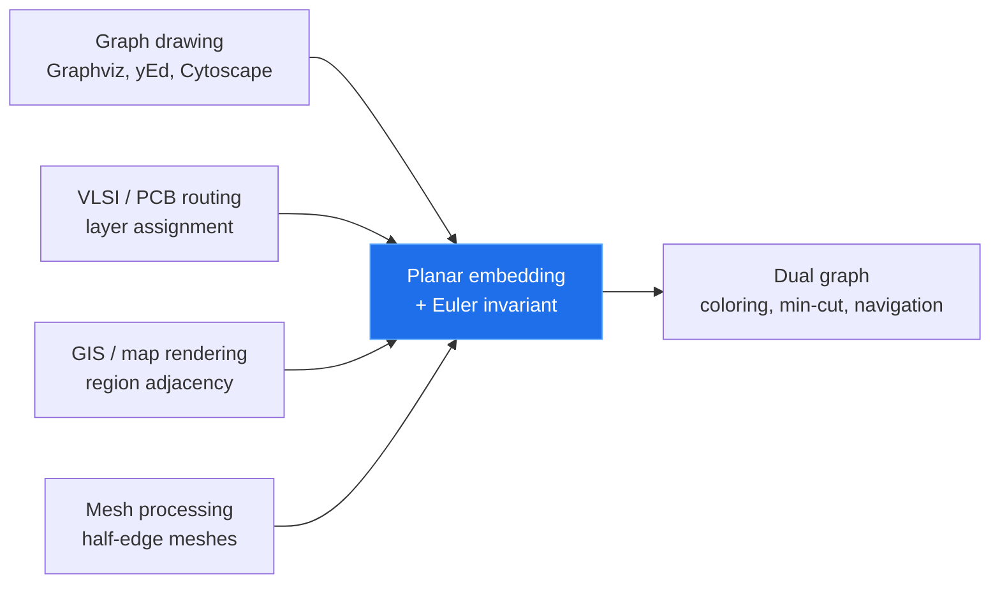
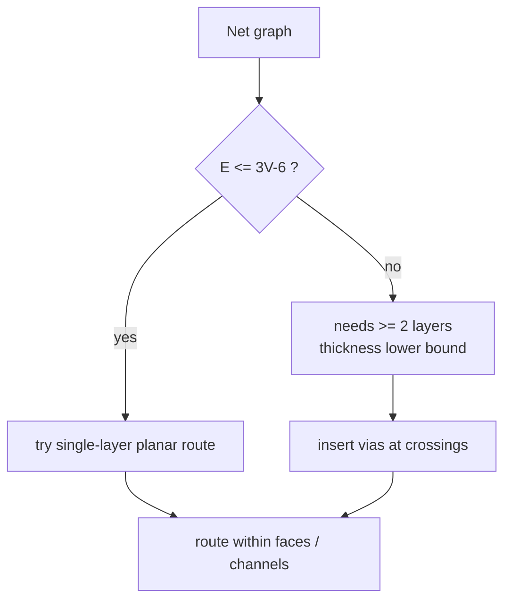

# Planar Graphs & Euler's Formula — Senior Level

> Planarity is rarely the headline feature of a system — but it silently governs whether a chip routes on two layers or twelve, whether a map renderer can color regions with four tints, and whether a mesh pipeline can walk neighbors in constant time. At senior level the question shifts from "is this graph planar?" to "where does planarity live in my architecture, what does it buy me, and what breaks when my real-world graph is *almost* but not quite planar?"

## Table of Contents
1. [Introduction](#1-introduction)
2. [Where Planarity Lives in Real Systems](#2-where-planarity-lives-in-real-systems)
3. [Graph Drawing and Layout Engines](#3-graph-drawing-and-layout-engines)
4. [VLSI and Circuit Layout](#4-vlsi-and-circuit-layout)
5. [Map and GIS Systems](#5-map-and-gis-systems)
6. [Mesh Processing and the Half-Edge at Scale](#6-mesh-processing-and-the-half-edge-at-scale)
7. [Code Examples](#7-code-examples)
8. [Observability and Validation](#8-observability-and-validation)
9. [Failure Modes](#9-failure-modes)
10. [Capacity and Performance Planning](#10-capacity-and-performance-planning)
11. [Planar-Specific Algorithms You Will Actually Reach For](#11-planar-specific-algorithms-you-will-actually-reach-for)
12. [A Worked Decision: Routing a Near-Planar Net Graph](#12-a-worked-decision-routing-a-near-planar-net-graph)
13. [Summary](#13-summary)

---

## 1. Introduction

A senior engineer meets planar graphs in three recurring guises:

1. **As a feasibility gate** — "can this be laid out / routed / drawn on a single surface?" The Euler bounds give an instant `O(1)` rejection of impossible inputs, saving an expensive layout pass.
2. **As a sparsity guarantee** — once you *know* a graph is planar, `E ≤ 3V − 6` means every downstream algorithm that is `O(V + E)` is really `O(V)`. That changes capacity math.
3. **As an embedding to maintain** — a DCEL / rotation system that must survive edits (insert a wire, split a face, add a road) in better-than-rebuild time.

The recurring senior decisions are architectural:

- Do I *enforce* planarity, *test* it, or *tolerate* near-planarity with crossings?
- Where does the embedding live — in memory, in a spatial index, in a GPU mesh buffer?
- How do I keep `V − E + F = 2` as an invariant under concurrent edits?
- What is the blast radius when a "planar" assumption is violated by dirty real-world data?

This document answers those in production terms.

---

## 2. Where Planarity Lives in Real Systems



| Domain | What planarity gives you | What you tolerate when it fails |
|--------|--------------------------|---------------------------------|
| Graph drawing | Crossing-free layout, readable diagrams | Crossing minimization (NP-hard) — accept few crossings |
| VLSI / PCB | Single-layer routing | Add layers + vias for the non-planar remainder |
| GIS / cartography | Four-color region maps, planar overlay | "Holes," enclaves, multi-polygons break the clean dual |
| Mesh processing | `O(1)` neighbor walks via half-edges | Non-manifold edges (3+ faces) break the embedding |
| Network topology | Cheap separators, fast layout | Real networks are rarely planar — used as approximation |

The senior insight: most real graphs are **not** planar, but many are *near-planar* (planar plus a few crossing edges, or "1-planar," or bounded genus). The architecture choice is whether to (a) decompose into a planar core plus a small set of crossing edges, (b) embed on a higher-genus surface, or (c) drop to a general algorithm and pay the cost.

---

## 3. Graph Drawing and Layout Engines

### 3.1 The pipeline

A layout engine (Graphviz `dot`/`neato`, yEd, Cytoscape, Mermaid, d3-force) that wants planar or near-planar output runs roughly:

```
parse -> planarity test -> if planar: compute embedding -> assign coordinates
                        -> if not:   planarization (insert dummy vertices at crossings)
                                     -> embed the planarized graph -> route around dummies
```

The **planarization** step is the senior's bread and butter: a non-planar graph is made planar by replacing each unavoidable crossing with a **dummy degree-4 vertex**, producing a planar graph you *can* embed, then drawing edges as polylines through those dummies. Minimizing crossings is NP-hard, so engines use heuristics (the "edge insertion" heuristic, or the Hopcroft–Tarjan-based planar subgraph + reinsert).

### 3.2 Why Euler's formula matters to the engine

- **Canvas sizing.** A planar straight-line drawing fits on a `(2V − 4) × (V − 2)` grid (Schnyder, de Fraysseix–Pach–Pollack). The face count from Euler bounds the number of regions to label.
- **Orthogonal layout.** The number of bends is bounded in terms of faces; flow-based bend minimization (Tamassia) runs on the *dual*-like flow network whose nodes are faces.
- **Sanity invariant.** After every layout transformation, assert `V − E + F = 2`. A violated invariant means the planarization introduced an inconsistency — caught instantly instead of as a garbled diagram.

### 3.3 Straight-line vs orthogonal

| Style | Faces' role | Engine |
|-------|-------------|--------|
| Force-directed | none directly; planarity emergent | d3-force, neato |
| Straight-line planar | Schnyder realizer over faces | planar embedders |
| Orthogonal | bend minimization is a flow over faces | yEd, OGDF/Tamassia |
| Upward planar (DAGs) | face structure constrains direction | Sugiyama variants |

---

## 4. VLSI and Circuit Layout

### 4.1 The single-layer dream

A printed circuit board (PCB) or chip layer is a plane. Wires that must not touch are edges that must not cross. If the net graph is planar, it routes on **one layer**. The Euler bound is the first thing a router checks: a net graph with `E > 3V − 6` *cannot* route on a single layer, full stop — no router will ever succeed, so reject early.

### 4.2 When it is not planar: layers and vias

Real circuits are dense and non-planar. The classic decomposition:

- **Thickness** of a graph = minimum number of planar subgraphs whose union is the graph = minimum number of routing layers. `K5` and `K3,3` have thickness 2.
- Each crossing that cannot be removed becomes a **via** (a hole connecting two layers). Vias cost area, capacitance, and yield, so minimizing them (≈ minimizing layers ≈ graph thickness) is the core optimization.
- The lower bound `thickness ≥ ⌈E / (3V − 6)⌉` comes straight from the Euler edge bound: each layer holds at most `3V − 6` edges.

### 4.3 Channel routing and the dual

Once cells are placed, routing happens in the **faces** (channels) between them. The routing problem is naturally posed on the planar subdivision's faces; the dual graph models "which channels are adjacent" and feeds maze/channel routers. This is a direct, money-on-the-table application of face structure.



---

## 5. Map and GIS Systems

### 5.1 Region adjacency is a planar graph

A political/geographic map is a planar subdivision: countries are faces, borders are edges, border-corners are vertices. The **region adjacency graph** is essentially the dual: one node per region, edges between regions sharing a border. Because the map is planar, the dual is planar, so by the **Four-Color Theorem** four colors suffice to tint regions so no two adjacent ones match (see `27-graph-coloring`).

### 5.2 What real maps break

- **Enclaves / exclaves** (a country fully inside another, or in pieces) make the dual a *multigraph* or disconnect a "country" — the clean four-color story needs care.
- **The four-corners problem**: regions meeting only at a point are *not* adjacent for coloring, but a naive vertex-based adjacency would wrongly connect them. Define adjacency by shared *edges*, not shared *points*.
- **Holes** (a lake inside a region) add nested faces; the embedding must record face containment.

### 5.3 Planar overlay and map algebra

GIS engines (PostGIS, JTS, GEOS) compute the **planar overlay** of two layers — intersect roads with districts, say. The result is a new planar subdivision whose faces are the pairwise intersections. The whole operation is a controlled rebuild of a DCEL, and Euler's formula is the integrity check on the output: faces, edges, vertices must balance.

---

## 6. Mesh Processing and the Half-Edge at Scale

### 6.0 Why meshes are the canonical planar embedding

A triangle mesh of a surface is, locally, a planar graph: every vertex's incident triangles fan around it in a cyclic order — exactly a rotation system. The whole pipeline of geometry processing (CAD, games, simulation, 3-D scanning) runs on this structure, so the half-edge / DCEL is one of the most-deployed planar-embedding data structures on Earth. The Euler characteristic `V − E + F = 2 − 2g` is the integrity check that every mesh tool runs, and `2E = 3F` (for a closed triangle mesh) lets you derive any one count from another in `O(1)`. A "watertight, manifold, genus-0" mesh is precisely "a planar graph embedded on the sphere" — the abstraction this entire topic studies.

### 6.1 DCEL / half-edge mesh

The production representation of an embedding is the **half-edge (DCEL)** structure: per directed half-edge, store `twin`, `next`, `prev`, `origin vertex`, `incident face`. This gives `O(1)`:

- "walk the boundary of this face" (`next` chain),
- "all edges around this vertex" (`twin` + `next`),
- "what's on the other side of this edge" (`twin.face`).

It is the de facto standard in CGAL, OpenMesh, libigl, and every serious mesh/geometry library.

### 6.2 Memory layout

For `V` vertices in a planar/manifold mesh, `E ≈ 3V` and half-edges `≈ 6V`. A compact half-edge record is ~5 indices (`twin`, `next`, `prev`, `vertex`, `face`) × 4 bytes ≈ 20 bytes, so ~120 bytes per vertex of mesh. A 10M-vertex mesh ≈ 1.2 GB — fits in RAM, but you design for it.

### 6.3 Dynamic embeddings

Edits (insert edge, split face, contract edge) must preserve the rotation system. Naive rebuild is `O(E)`; you want incremental updates:

- **Insert edge inside a face**: splits one face into two, `O(1)` to splice half-edges, `F += 1`. Euler stays balanced.
- **Online connectivity / bridges**: see sibling `30-online-bridges` for maintaining 2-edge-connectivity as edges arrive — the embedding's faces interact with bridge structure.
- **Fully dynamic planarity** (insert/delete arbitrary edges, test planarity) is hard; the best known structures are `O(polylog)` amortized and rarely worth it — most systems rebuild per batch.

---

## 7. Code Examples

### 7.1 Go — embedding validator (Euler invariant + edge bound)

```go
package main

import "fmt"

// Embedding holds a planar embedding's basic counts plus a connected-component
// count, and validates the generalized Euler invariant V - E + F = 1 + C.
type Embedding struct {
	V, E, F, C int
}

// Validate checks the Euler invariant and the simple-graph edge bound.
func (em Embedding) Validate(simple bool, triangleFree bool) []string {
	var problems []string
	if em.V-em.E+em.F != 1+em.C {
		problems = append(problems,
			fmt.Sprintf("Euler violated: V-E+F = %d, expected 1+C = %d",
				em.V-em.E+em.F, 1+em.C))
	}
	if simple && em.V >= 3 {
		bound := 3*em.V - 6
		if triangleFree {
			bound = 2*em.V - 4
		}
		if em.E > bound {
			problems = append(problems,
				fmt.Sprintf("edge bound violated: E=%d > %d => NOT planar",
					em.E, bound))
		}
	}
	return problems
}

func main() {
	// A valid connected planar embedding: cube graph.
	cube := Embedding{V: 8, E: 12, F: 6, C: 1}
	fmt.Println("cube problems:", cube.Validate(true, true)) // none

	// K5 fed in as if "planar": edge bound should reject.
	k5 := Embedding{V: 5, E: 10, F: 7, C: 1} // F is bogus on purpose
	fmt.Println("K5 problems  :", k5.Validate(true, false))
}
```

### 7.2 Java — layer (thickness) lower bound for a router

```java
public final class ThicknessEstimator {

    // Lower bound on routing layers: each planar layer holds <= 3V - 6 edges.
    public static int minLayers(int v, int e) {
        if (v < 3) return 1;
        int perLayer = 3 * v - 6;
        return (e + perLayer - 1) / perLayer; // ceil(e / (3V-6))
    }

    // Stricter bound when the net graph is bipartite (e.g. terminal/net model).
    public static int minLayersBipartite(int v, int e) {
        if (v < 3) return 1;
        int perLayer = 2 * v - 4;
        return (e + perLayer - 1) / perLayer;
    }

    public static void main(String[] args) {
        // Dense net graph: 1000 terminals, 5000 nets-as-edges.
        System.out.println("min layers       : " + minLayers(1000, 5000));
        System.out.println("min layers (bip) : " + minLayersBipartite(1000, 5000));
        System.out.println("K5 layers        : " + minLayers(5, 10)); // 2
    }
}
```

### 7.3 Python — region adjacency (dual) from a face map, ready for coloring

```python
from collections import defaultdict


def region_adjacency(face_of_dart, edges):
    """Build the dual / region-adjacency graph from a traced embedding.

    face_of_dart: maps directed dart (u, v) -> face id.
    Returns adjacency dict suitable for a greedy 4-coloring (see 27-graph-coloring).
    Edge-based adjacency only (regions touching at a single point are NOT linked).
    """
    adj = defaultdict(set)
    for u, v in edges:
        left = face_of_dart[(u, v)]
        right = face_of_dart[(v, u)]
        if left != right:  # skip bridges (same face both sides)
            adj[left].add(right)
            adj[right].add(left)
    return {f: sorted(ns) for f, ns in adj.items()}


def euler_ok(v, e, f, c=1):
    """Integrity check on a planar subdivision after an overlay/edit."""
    return v - e + f == 1 + c


if __name__ == "__main__":
    # Square + diagonal embedding from middle.md face tracer.
    edges = [(0, 1), (1, 2), (2, 3), (3, 0), (0, 2)]
    face_of = {
        (0, 1): 0, (1, 2): 0, (2, 0): 0,   # triangle a-b-c
        (0, 2): 1, (2, 3): 1, (3, 0): 1,   # triangle a-c-d
        (1, 0): 2, (2, 1): 2, (3, 2): 2, (0, 3): 2,  # outer face
    }
    print("region adjacency:", region_adjacency(face_of, edges))
    print("Euler ok:", euler_ok(4, 5, 3, c=1))  # True
```

### 7.4 Go — half-edge (DCEL) integrity checker

```go
package main

import "fmt"

// HalfEdge is one directed dart in a DCEL.
type HalfEdge struct {
	Twin int // index of the reverse dart
	Next int // next dart around the same face
	Face int // incident face id
	Orig int // origin vertex
}

// ValidateDCEL checks the structural invariants that every planar embedding
// stored as a half-edge list must satisfy.
func ValidateDCEL(he []HalfEdge, numFaces int) []string {
	var problems []string
	for i, h := range he {
		// twin(twin(h)) == h
		if he[h.Twin].Twin != i {
			problems = append(problems,
				fmt.Sprintf("dart %d: twin not symmetric", i))
		}
		// twin must reverse the vertex (orig of twin == next's orig along this edge)
		if he[h.Twin].Orig == h.Orig {
			problems = append(problems,
				fmt.Sprintf("dart %d: twin shares origin (degenerate)", i))
		}
	}
	// every face's next-chain must close
	seen := make([]bool, len(he))
	for start := range he {
		if seen[start] {
			continue
		}
		cur := start
		steps := 0
		for {
			seen[cur] = true
			cur = he[cur].Next
			steps++
			if cur == start {
				break
			}
			if steps > len(he) {
				problems = append(problems,
					fmt.Sprintf("face starting at dart %d does not close", start))
				break
			}
		}
	}
	return problems
}

func main() {
	// Tiny triangle DCEL: 3 edges -> 6 half-edges, 2 faces (inner, outer).
	// darts 0,2,4 = inner face; darts 1,3,5 = outer face; twins: (0,1)(2,3)(4,5)
	he := []HalfEdge{
		{Twin: 1, Next: 2, Face: 0, Orig: 0},
		{Twin: 0, Next: 5, Face: 1, Orig: 1},
		{Twin: 3, Next: 4, Face: 0, Orig: 1},
		{Twin: 2, Next: 1, Face: 1, Orig: 2},
		{Twin: 5, Next: 0, Face: 0, Orig: 2},
		{Twin: 4, Next: 3, Face: 1, Orig: 0},
	}
	fmt.Println("DCEL problems:", ValidateDCEL(he, 2)) // none
}
```

This is the runtime guard behind the §8 observability table: cheap, `O(E)`, and it catches the embedding corruption that a bare Euler-count check would miss (e.g. a face chain that closes with the wrong length).

---

## 8. Observability and Validation

A planar embedding is invisible until it silently corrupts. Wire these checks from day one.

| Check | Type | Why |
|-------|------|-----|
| `V − E + F == 1 + C` | assertion | The master invariant. Any edit that violates it is a bug. |
| `E ≤ 3V − 6` (simple) | gauge | Detect a non-planar graph fed to a planar pipeline. |
| half-edge `twin(twin(h)) == h` | assertion | DCEL integrity. |
| `next` chain returns to start | assertion | Each face boundary is a closed walk. |
| face-degree sum `== 2E` | gauge | Catches a miscounted bridge or dangling dart. |
| crossing count after planarization | metric | Track drawing quality / via count over releases. |
| embedding rebuild time | histogram | When edits get expensive, time to switch to incremental. |

The single most useful one is the **Euler invariant** `V − E + F = 1 + C`. It is `O(1)` to check (you maintain the counts), and it catches the overwhelming majority of embedding corruption immediately, at the edit that caused it rather than three transformations later.

---

## 9. Failure Modes

### 9.1 "Almost planar" real-world data

GIS borders that *almost* meet, PCB nets with one stray crossing, social graphs that are 99% planar — feeding these to a strict planar embedder yields a hard failure. Mitigation: detect the planar subgraph, route/draw it, and handle the residual crossing edges separately (extra layer, dummy vertices, or explicit crossings).

### 9.2 Non-manifold / non-simple inputs

Meshes with an edge shared by 3+ faces (non-manifold), or graphs with parallel edges and self-loops, break both the DCEL invariants and the `3V − 6` bound. Mitigation: validate and repair the mesh/graph (remove duplicate edges, split non-manifold edges) before embedding; reject what you cannot repair.

### 9.3 Forgetting the outer face in counts

A subsystem that counts only *bounded* faces reports `F − 1`, silently breaking `V − E + F = 2`. Every consumer must agree that the outer face is counted. Mitigation: a single canonical face enumerator; never re-count faces ad hoc.

### 9.4 Disconnected components

Applying `V − E + F = 2` to a multi-component subdivision (islands on a map, disjoint nets) gives the wrong `F`. Mitigation: always use `V − E + F = 1 + C` and track `C` explicitly; do not special-case "I assume it's connected."

### 9.5 Embedding drift under concurrent edits

Two threads splice half-edges into the same face; the rotation system becomes inconsistent and face tracing loops or duplicates. Mitigation: serialize embedding mutations (one writer), or partition the surface so writers touch disjoint faces; re-assert the Euler invariant after each batch.

### 9.6 Genus creep

A graph that is not planar but *is* embeddable on a torus (genus 1) tempts you to "just add a handle." The generalized Euler formula becomes `V − E + F = 2 − 2g` for genus `g`. Mitigation: be explicit about the surface; do not let `g` quietly grow — each handle complicates every downstream algorithm.

---

## 10. Capacity and Performance Planning

### 10.1 Sparsity is the headline number

For any simple planar graph: `E ≤ 3V − 6` and `F ≤ 2V − 4`. So storage and every linear-pass algorithm scale as `O(V)`:

- Adjacency list: `~2E ≈ 6V` neighbor entries.
- DCEL: `~6V` half-edges.
- Face list: `≤ 2V − 4` faces.

A planar graph never "blows up" in edges the way a dense graph does — that predictability is the whole point for capacity planning.

### 10.2 Concrete sizing

| Mesh / map size `V` | `E` (≈ `3V`) | `F` (≈ `2V`) | half-edges (≈ `6V`) | DCEL RAM (~20 B/he) |
|---------------------|--------------|--------------|---------------------|----------------------|
| 10K | 30K | 20K | 60K | ~1.2 MB |
| 1M | 3M | 2M | 6M | ~120 MB |
| 100M | 300M | 200M | 600M | ~12 GB |

At 100M vertices you cross the single-machine RAM line and start thinking about out-of-core / streaming meshes or spatial partitioning.

### 10.3 Throughput

- Euler / edge-bound check: `O(1)` — effectively free.
- Face tracing / DCEL build: `O(V)` — tens of millions of half-edges/sec in compiled code; minutes for 100M-vertex meshes, dominated by memory bandwidth.
- Linear-time planarity test (LR algorithm): `O(V)` — but constants are higher; budget ~5–10× a plain DFS.
- Planarization (crossing minimization): NP-hard; heuristic, seconds-to-minutes, the real bottleneck in drawing engines.

### 10.4 When to leave "exactly planar"

Move off a strict planar model when any of these hold:

- The graph is only *near*-planar (a handful of crossings) → planarize + dummies.
- You need higher genus (handles, tori) → use `V − E + F = 2 − 2g`.
- Edges churn faster than you can rebuild the embedding → batch edits, or accept an approximate layout.
- The graph is fundamentally dense (`E ≫ 3V`) → it was never planar; use general-graph algorithms.

---

## 11. Planar-Specific Algorithms You Will Actually Reach For

Knowing a graph is planar unlocks algorithms that are *strictly faster* than their general-graph counterparts. When you control the data and can guarantee planarity, these are worth the engineering.

### 11.1 Shortest paths

| Problem | General graph | Planar graph |
|---------|---------------|--------------|
| SSSP, non-negative | `O(E + V log V)` Dijkstra | `O(V)` (Henzinger–Klein–Rao–Subramanian 1997) |
| SSSP, negative weights | `O(VE)` Bellman–Ford | `O(V log²V)` (Fakcharoenphol–Rao) — see also `05-bellman-ford` |
| All-pairs | `O(V³)` / `O(V·E)` | `O(V²)` via separators |
| `s–t` min-cut / max-flow | `O(V²√E)` etc. | `O(V log V)` (Italiano et al.) via the dual |

The recurring trick: use the **planar separator** (`O(√V)`) for divide-and-conquer, or move the problem to the **dual** (min-cut becomes shortest separating cycle). For a senior choosing infrastructure, "this graph is planar" can mean an order-of-magnitude speedup on the hot path — but only if you actually verify and maintain planarity.

### 11.2 The dual-min-cut pattern in practice

Image segmentation (graph cuts), VLSI partitioning, and geographic boundary detection all reduce to `s–t` min-cut on a (near-)planar grid graph. The planar reduction — split the outer face along an `s–t` curve, run Dijkstra on the dual — beats general max-flow by a large constant and an asymptotic factor. Production vision libraries exploit grid planarity for exactly this reason.

### 11.3 Approximation via Baker's layering

NP-hard problems (max independent set, min dominating set, TSP — see `28-np-hard-tsp-hamiltonian`) admit **PTASs on planar graphs**: peel the graph into BFS layers, every `k`-th layer removed leaves `k`-outerplanar slabs of bounded treewidth, solve each by DP, recombine for a `(1 ± 1/k)`-approximation in `O(f(k)·V)` time. This is *only* possible because planar graphs have the layered/separator structure that Euler's formula and the edge bound guarantee.

### 11.4 When the speedup is worth it

- The graph is *reliably* planar (a mesh, a grid, a map) — not "probably planar."
- The operation is on the hot path and `V` is large enough that the asymptotic win matters.
- You can afford to build and maintain an embedding (separator hierarchies need it).

If planarity is fragile (social graphs, dynamic networks), the maintenance cost usually outweighs the speedup; fall back to general algorithms with the `O(1)` edge-bound filter as a sanity gate.

---

## 12. A Worked Decision: Routing a Near-Planar Net Graph

A concrete senior scenario tying the pieces together. You are handed a net graph for a board: `V = 2,000` terminals, `E = 6,400` required connections, and the question "how many copper layers do we need, and can we do better?"

### 11.1 Step 1 — the O(1) feasibility gate

`3V − 6 = 3·2000 − 6 = 5,994`. Since `E = 6,400 > 5,994`, the graph is **not planar** — no single-layer route exists, full stop. This is decided in nanoseconds before any router runs. The lower bound on layers (graph thickness) is `⌈E / (3V − 6)⌉ = ⌈6400 / 5994⌉ = 2`. So at minimum a 2-layer board, *if* the residual edges can be made planar.

### 11.2 Step 2 — extract a maximal planar subgraph

Run a linear-time planar-subgraph extractor (greedily add edges, keep an embedding, skip any edge whose insertion would force a crossing). Suppose it keeps `5,994` edges (a full triangulation's worth) on layer 1, leaving `406` edges for layer 2. Layer 2's `406` edges over the same `2,000` terminals is trivially planar (`406 ≤ 5,994`), so a 2-layer route exists. The Euler bound both *proved infeasibility on one layer* and *bounded the layer count*.

### 11.3 Step 3 — minimize vias, not just layers

Each net that jumps from layer 1 to layer 2 needs a **via** (a plated through-hole), costing area, capacitance, and yield. Minimizing vias ≈ minimizing the residual edge set ≈ maximizing the planar subgraph — an NP-hard problem (maximum planar subgraph), so the router uses a heuristic: extract a maximal planar subgraph, then reinsert each residual edge at the layer/position minimizing added crossings. Track `vias = |residual edges crossing layers|` as the optimization target.

### 11.4 Step 4 — validate with Euler

After routing, each layer's wire graph must satisfy `V_layer − E_layer + F_layer = 1 + C_layer`. A violated invariant means the router produced an inconsistent (self-crossing) layout — caught instantly, before fabrication. This is the same master invariant from §8, applied per layer.

### 11.5 The decision in one sentence

> The Euler edge bound turns "how many layers?" from an expensive routing experiment into an `O(1)` arithmetic lower bound, and the maximal-planar-subgraph + via-reinsertion pipeline turns the residual into a tractable heuristic with a hard validity check at the end.

This is the recurring shape of senior planarity work: **bound cheaply, decompose into a planar core plus a small residual, and validate with `V − E + F`.**

---

## 13. Summary

- Planarity shows up as a **feasibility gate** (Euler bounds reject impossible layouts in `O(1)`), a **sparsity guarantee** (`E = O(V)` makes linear algorithms linear in `V`), and an **embedding to maintain** (DCEL / rotation system).
- In **graph drawing**, non-planar graphs are *planarized* with dummy vertices at crossings; Euler's formula bounds the canvas and is the integrity invariant after every transform.
- In **VLSI/PCB**, `E ≤ 3V − 6` gives the single-layer feasibility test and the thickness (layer-count) lower bound `⌈E/(3V−6)⌉`; routing happens in faces/channels modeled by the dual.
- In **GIS/maps**, the region-adjacency dual is planar, so four colors suffice — but enclaves, point-contacts, and holes need careful, edge-based adjacency.
- The **half-edge / DCEL** is the production embedding structure: `O(1)` neighbor and face walks, `~6V` half-edges, ~120 B/vertex.
- Always assert the master invariant `V − E + F = 1 + C` after edits; it catches embedding corruption at the source.
- Most real graphs are not planar — design for *near*-planarity (planar core + crossing edges), explicit genus, or graceful fallback to general algorithms.

References to study further: Tamassia's orthogonal layout, the OGDF library, CGAL arrangements/DCEL, Lipton–Tarjan planar separators, the Hopcroft–Tarjan and Boyer–Myrvold linear-time planarity tests, and sibling topics `27-graph-coloring` and `30-online-bridges`.
