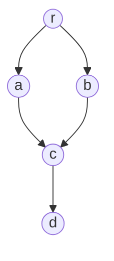
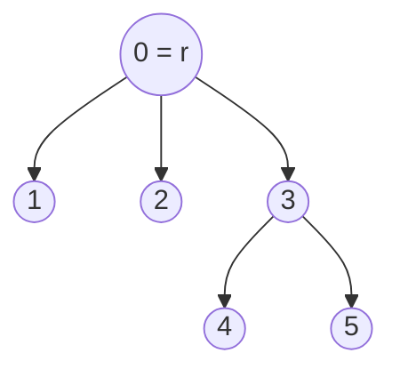
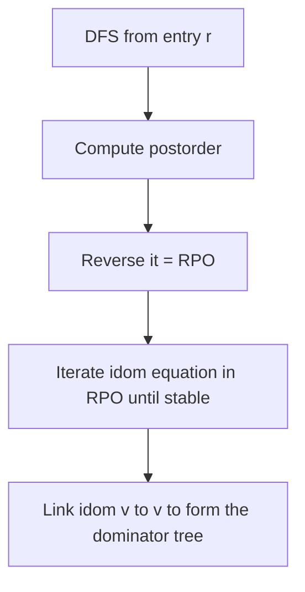

# Dominator Tree (Lengauer-Tarjan) — Junior Level

> **One-line summary:** In a directed graph with a fixed start vertex `r`, a vertex `u` **dominates** `v` if *every* path from `r` to `v` passes through `u`; the closest such dominator is the **immediate dominator** `idom(v)`, and the `idom` edges form a tree — the **dominator tree** — computed naively in `O(V·E)` or in near-linear `O(E·α(V))` time by the Lengauer-Tarjan algorithm.

---

## Table of Contents

1. [Introduction](#introduction)
2. [Prerequisites](#prerequisites)
3. [Glossary](#glossary)
4. [Core Concepts](#core-concepts)
5. [Big-O Summary](#big-o-summary)
6. [Real-World Analogies](#real-world-analogies)
7. [Pros & Cons](#pros--cons)
8. [Step-by-Step Walkthrough](#step-by-step-walkthrough)
9. [Code Examples](#code-examples)
10. [Coding Patterns](#coding-patterns)
11. [Error Handling](#error-handling)
12. [Performance Tips](#performance-tips)
13. [Best Practices](#best-practices)
14. [Edge Cases & Pitfalls](#edge-cases--pitfalls)
15. [Common Mistakes](#common-mistakes)
16. [Cheat Sheet](#cheat-sheet)
17. [Visual Animation](#visual-animation)
18. [Summary](#summary)
19. [Further Reading](#further-reading)

---

## Introduction

Imagine a **flow graph**: a directed graph with one special **entry vertex** `r` from which every other reachable vertex can be reached. Think of `r` as the "start" of a program, a router, or a maze, and the edges as the only legal ways to move forward.

Now ask a simple-sounding question about some vertex `v`:

> Which vertices can I **never avoid** on my way from `r` to `v`?

A vertex `u` that you can never avoid — one that lies on **every single path** from `r` to `v` — is called a **dominator** of `v`. The entry `r` dominates everything (you always start there). Every vertex dominates itself (trivially). But the interesting dominators are the ones in between: bottlenecks that *force* you through them.

Among all the dominators of `v`, exactly one is "closest" to `v` — the last unavoidable checkpoint before you arrive. That one is the **immediate dominator**, written `idom(v)`. It is unique (we will see why), and if you draw an edge from `idom(v)` to `v` for every vertex `v ≠ r`, the result is a **tree** rooted at `r`: the **dominator tree**.



In the flow graph above, every path from `r` to `d` must go through `c` (both `a→c` and `b→c` funnel into it), and through `r`. So `c` dominates `d`, and in fact `idom(d) = c`. But `a` does **not** dominate `d`, because the path `r → b → c → d` avoids `a`. Computing this "who is unavoidable" relationship for every vertex, efficiently, is exactly what the dominator tree captures — and the **Lengauer-Tarjan algorithm** does it in close to linear time.

Dominators were introduced by **Reese Prosser (1959)** and became a cornerstone of **compiler theory**. Today they power **SSA (Static Single Assignment) construction**, **control-dependence analysis**, loop detection, and many code optimizations. The fast algorithm is due to **Thomas Lengauer and Robert Tarjan (1979)**.

---

## Prerequisites

Before reading this file you should be comfortable with:

- **Directed graphs** — vertices, directed edges, paths, reachability (see sibling topic `01-representation`).
- **Depth-First Search (DFS)** — recursion or an explicit stack; visiting nodes and numbering them in visit order (see `02-dfs`).
- **Trees** — parent/child, root, ancestors, the idea that each node has exactly one parent.
- **Adjacency lists** — `graph[u]` lists the successors of `u`.
- **Big-O notation** — `O(V)`, `O(E)`, `O(V·E)`.

Optional but helpful:

- The notion of a **spanning tree** produced by DFS (the "DFS tree").
- **Union-Find / disjoint sets** (used inside the fast algorithm — see `12-union-find`).
- A glance at why **basic blocks** and **control-flow graphs** matter in compilers.

---

## Glossary

| Term | Meaning |
|------|---------|
| **Flow graph** | A directed graph `(V, E, r)` with an entry vertex `r` from which every vertex is reachable. |
| **Dominates** | `u` dominates `v` (`u ⪰ v`) if every path from `r` to `v` contains `u`. |
| **Strictly dominates** | `u` dominates `v` and `u ≠ v`. |
| **Immediate dominator `idom(v)`** | The unique strict dominator of `v` that is dominated by every other strict dominator of `v` — the "closest" one. |
| **Dominator tree** | The tree with an edge `idom(v) → v` for every `v ≠ r`; root is `r`. |
| **DFS number / `dfnum`** | The order in which DFS first visits a vertex (a preorder index). |
| **Semidominator `semi(v)`** | A clever approximation of `idom(v)` based on DFS numbers — the key idea of Lengauer-Tarjan. |
| **DFS tree** | The tree of "tree edges" produced by the DFS from `r`. |
| **Parent `parent(v)`** | The DFS-tree parent of `v` (the vertex from which DFS first reached `v`). |
| **Ancestor / descendant** | Relationships in the DFS tree (not the dominator tree). |
| **Path compression** | A Union-Find trick used to evaluate `semi`-minima quickly. |
| **Post-dominator** | The dual: `u` post-dominates `v` if every path from `v` to the exit passes through `u`. |

---

## Core Concepts

### 1. Domination: "every path passes through"

The single definition to internalize:

> `u` **dominates** `v` if and only if **every** path from the entry `r` to `v` includes `u`.

Notice "every," not "some." A vertex on *one* path is not a dominator; it must be on *all* of them. Two immediate consequences:

- **`r` dominates every reachable vertex** — you always start at `r`.
- **`v` dominates itself** — every path to `v` ends at `v`.

So the set of dominators of `v`, written `Dom(v)`, always contains at least `{r, v}`. The *strict* dominators are `Dom(v) \ {v}`.

### 2. Why the immediate dominator is unique

Here is the beautiful structural fact:

> The strict dominators of `v` are **totally ordered** by domination: if `a` and `b` both strictly dominate `v`, then either `a` dominates `b` or `b` dominates `a`.

Intuitively, both `a` and `b` lie on *every* `r → v` path. Walk along any such path; you encounter `a` and `b` in some order, and that order is the same on every path (otherwise you could build a path skipping one of them). Because they form a chain, there is a unique *last* one — the dominator closest to `v`. That last one is `idom(v)`, and the chain `r = d_1 ⪰ d_2 ⪰ … ⪰ idom(v)` is exactly the path from the root to `v` in the **dominator tree**.

This is *why* `idom` forms a tree: each `v ≠ r` has exactly **one** parent, `idom(v)`.

### 3. The dominator tree

Draw an edge `idom(v) → v` for every `v ≠ r`. Since each vertex has exactly one immediate dominator, every node has exactly one parent, so the result is a tree rooted at `r`. A crucial reading rule:

> `u` dominates `v` **iff** `u` is an **ancestor of `v` in the dominator tree** (including `v` itself).

This turns a global "all paths" question into a simple tree-ancestor check.

### 4. The naive algorithm (iterative dataflow)

The simplest correct method computes `Dom(v)` as a *set* using a fixpoint:

```
Dom(r) = {r}
Dom(v) = {v} ∪ ( intersection of Dom(p) over all predecessors p of v )
repeat until nothing changes
```

The intuition: to reach `v` you must come through one of its predecessors `p`, so a vertex dominates `v` only if it dominates *all* of `v`'s predecessors (plus `v` itself). Iterate the equation until the sets stop changing. Then `idom(v)` is the strict dominator of `v` with the largest `Dom`-set (the closest one). This is easy to code and great for small graphs, but each set can be `O(V)` wide, giving up to `O(V²·E)` in the crude form (or `O(V·E)` with bitsets and good ordering). The **Lengauer-Tarjan** algorithm replaces all of this with DFS numbering + semidominators + path compression to reach near-linear time.

### 5. The semidominator (a taste)

Lengauer-Tarjan's key trick is the **semidominator**, an approximation of `idom` defined purely from **DFS numbers**:

> `semi(v)` is the vertex `u` with the *smallest DFS number* such that there is a path `u = v_0 → v_1 → … → v_k = v` where every intermediate `v_i` (for `0 < i < k`) has a DFS number **larger** than `v`'s.

In words: among "shortcuts" that jump to `v` over higher-numbered vertices, which one starts highest up the DFS tree? The semidominator is always an ancestor-or-equal candidate for `idom(v)`, and a short post-processing step turns the `semi` values into the true `idom` values. The mechanics live in `middle.md` and the proof in `professional.md`; for now, just hold the picture: **DFS-number it, compute `semi`, then fix up to `idom`.**

---

## Big-O Summary

| Aspect | Complexity | Notes |
|--------|------------|-------|
| Naive iterative dataflow (bitset) | **O(V·E)** typical | Easy to write; great for small CFGs. |
| Naive set-intersection (crude) | up to O(V²·E) | If sets are not bitset-packed. |
| Lengauer-Tarjan (simple) | **O(E·log V)** | With path compression but no union-by-rank. |
| Lengauer-Tarjan (sophisticated) | **O(E·α(V))** | Near-linear; `α` is the inverse Ackermann function. |
| Space | **O(V + E)** | Graph plus the DFS / semi / idom arrays. |
| Query "does u dominate v?" after building | **O(depth)** or **O(1)** | Tree-ancestor check; `O(1)` with Euler-tour preprocessing. |

`α(V)` (inverse Ackermann) is `≤ 4` for any input that fits in the universe, so `O(E·α(V))` is "linear for all practical purposes."

---

## Real-World Analogies

| Concept | Analogy |
|---------|---------|
| Entry vertex `r` | The single front door of a building — every visitor enters here. |
| `u` dominates `v` | A **mandatory checkpoint**: to reach room `v`, you *must* pass through security desk `u`, no matter which corridor you take. |
| Immediate dominator | The **last** mandatory checkpoint right before room `v`. |
| Dominator tree | The org chart of checkpoints: each room reports to the last checkpoint you cannot skip. |
| DFS numbering | Stamping each room with the order a single explorer first walked into it. |
| Semidominator | "What is the *highest-up* shortcut entrance into this room that only sneaks through deeper rooms?" |
| Post-dominator | The mirror image: the mandatory checkpoint on the way *out* to the exit. |

Where the analogy breaks: a real building lets you backtrack freely; a flow graph's edges are one-way, so "every path" really means every *directed* path from the single entry.

---

## Pros & Cons

| Pros | Cons |
|------|------|
| Captures global "unavoidable" structure in a compact tree. | Definition is subtle ("every path," not "some path"). |
| Enables `O(1)`/`O(depth)` "does u dominate v?" queries. | Fast (Lengauer-Tarjan) algorithm is intricate to implement correctly. |
| Foundational for SSA, loop detection, control dependence. | Requires the graph to have a single entry from which all are reachable. |
| Near-linear `O(E·α(V))` with the sophisticated version. | Naive iterative version can be slow on large irreducible graphs. |
| Same machinery (reversed) gives post-dominators. | Tree must be rebuilt if the flow graph changes. |

**When to use:** compiler/IR passes (SSA, code motion, dead-code), program analysis, control-dependence graphs, network single-point-of-failure analysis, any "what is unavoidable from the entry?" question.

**When NOT to use:** when the graph has no meaningful single entry, when you only need plain reachability (use BFS/DFS), or when the structure changes so often that maintaining the tree costs more than recomputing the simple thing you actually need.

---

## Step-by-Step Walkthrough

Take this 6-vertex flow graph with entry `r = 0`:

```
edges:  0→1,  0→2,  1→3,  2→3,  3→4,  3→5,  4→5
```

Drawn out:

```
        0 (r)
       /  \
      1    2
       \  /
        3
       / \
      4   5
       \ /
        5
```

(Vertex `5` has two ways in: `3→5` and `4→5`.)

**Step 1 — DFS numbering.** Run DFS from `0`, numbering vertices in the order first visited. One valid DFS (always taking the lower-numbered successor first):

```
dfnum:  0→0,  1→1,  3→2,  4→3,  5→4,  2→5
DFS tree parents: parent(1)=0, parent(3)=1, parent(4)=3, parent(5)=4, parent(2)=0
```

**Step 2 — Find dominators by the definition.** Ask, for each vertex, "what is unavoidable from `0`?"

- `idom(1) = 0` — only `0→1` reaches `1`.
- `idom(2) = 0` — only `0→2` reaches `2`.
- `idom(3) = 0` — `3` is reachable via `0→1→3` **and** `0→2→3`; the only vertex common to *both* paths (besides `3`) is `0`. So neither `1` nor `2` dominates `3`.
- `idom(4) = 3` — the only way to `4` is `…→3→4`, so `3` is unavoidable; and `3`'s own dominator is `0`. The closest is `3`.
- `idom(5) = 3` — `5` is reachable by `…→3→5` and `…→3→4→5`; both go through `3` but `4` is avoidable (`3→5` skips it). So `idom(5) = 3`.

**Step 3 — Build the dominator tree** (`idom(v) → v`):



Read off domination by ancestry: `0` dominates everyone; `3` dominates `4` and `5`; `1` and `2` dominate only themselves. Note how the dominator tree is **flatter** than the flow graph — `3`'s immediate dominator jumped all the way up to `0`, skipping `1` and `2`, precisely because there were two independent ways to reach `3`.

This "where do the immediate dominators point" is what Lengauer-Tarjan computes mechanically via semidominators instead of by inspecting every path — which would be exponential.

---

## Code Examples

### Example: Naive Iterative-Dataflow Dominators

This is the easiest correct algorithm: the Cooper-Harvey-Kennedy style fixpoint over `idom` values (a refinement of the set equation in Concept 4). It is `O(V·E)`-ish and perfect for understanding, and it is what most production compilers actually use for medium-sized control-flow graphs.

#### Go

```go
package main

import "fmt"

// dominators computes idom[v] for a flow graph with entry r,
// using the iterative dataflow algorithm (Cooper-Harvey-Kennedy).
// Vertices are 0..n-1; idom[r] = r; unreachable vertices get -1.
func dominators(n int, succ [][]int, r int) []int {
	// reverse postorder of a DFS from r
	order, rpoNum := reversePostorder(n, succ, r)

	preds := make([][]int, n)
	for u := 0; u < n; u++ {
		for _, v := range succ[u] {
			preds[v] = append(preds[v], u)
		}
	}

	idom := make([]int, n)
	for i := range idom {
		idom[i] = -1
	}
	idom[r] = r

	changed := true
	for changed {
		changed = false
		for _, v := range order { // process in reverse postorder
			if v == r {
				continue
			}
			newIdom := -1
			for _, p := range preds[v] {
				if idom[p] == -1 {
					continue // predecessor not yet processed
				}
				if newIdom == -1 {
					newIdom = p
				} else {
					newIdom = intersect(p, newIdom, idom, rpoNum)
				}
			}
			if newIdom != -1 && idom[v] != newIdom {
				idom[v] = newIdom
				changed = true
			}
		}
	}
	return idom
}

// intersect walks two idom chains up until they meet, comparing by RPO number.
func intersect(a, b int, idom, rpoNum []int) int {
	for a != b {
		for rpoNum[a] > rpoNum[b] {
			a = idom[a]
		}
		for rpoNum[b] > rpoNum[a] {
			b = idom[b]
		}
	}
	return a
}

func reversePostorder(n int, succ [][]int, r int) ([]int, []int) {
	visited := make([]bool, n)
	var post []int
	var dfs func(u int)
	dfs = func(u int) {
		visited[u] = true
		for _, v := range succ[u] {
			if !visited[v] {
				dfs(v)
			}
		}
		post = append(post, u)
	}
	dfs(r)
	// reverse postorder
	order := make([]int, len(post))
	for i := range post {
		order[i] = post[len(post)-1-i]
	}
	rpoNum := make([]int, n)
	for i := range rpoNum {
		rpoNum[i] = -1
	}
	for i, v := range order {
		rpoNum[v] = i
	}
	return order, rpoNum
}

func main() {
	succ := [][]int{
		{1, 2}, // 0
		{3},    // 1
		{3},    // 2
		{4, 5}, // 3
		{5},    // 4
		{},     // 5
	}
	idom := dominators(6, succ, 0)
	for v := 0; v < 6; v++ {
		fmt.Printf("idom(%d) = %d\n", v, idom[v])
	}
	// idom(0)=0 idom(1)=0 idom(2)=0 idom(3)=0 idom(4)=3 idom(5)=3
}
```

#### Java

```java
import java.util.*;

public class Dominators {
    static int[] rpoNum;

    static int[] dominators(int n, List<List<Integer>> succ, int r) {
        List<Integer> order = new ArrayList<>();
        rpoNum = new int[n];
        Arrays.fill(rpoNum, -1);
        reversePostorder(n, succ, r, order);

        List<List<Integer>> preds = new ArrayList<>();
        for (int i = 0; i < n; i++) preds.add(new ArrayList<>());
        for (int u = 0; u < n; u++)
            for (int v : succ.get(u)) preds.get(v).add(u);

        int[] idom = new int[n];
        Arrays.fill(idom, -1);
        idom[r] = r;

        boolean changed = true;
        while (changed) {
            changed = false;
            for (int v : order) {
                if (v == r) continue;
                int newIdom = -1;
                for (int p : preds.get(v)) {
                    if (idom[p] == -1) continue;
                    newIdom = (newIdom == -1) ? p : intersect(p, newIdom, idom);
                }
                if (newIdom != -1 && idom[v] != newIdom) {
                    idom[v] = newIdom;
                    changed = true;
                }
            }
        }
        return idom;
    }

    static int intersect(int a, int b, int[] idom) {
        while (a != b) {
            while (rpoNum[a] > rpoNum[b]) a = idom[a];
            while (rpoNum[b] > rpoNum[a]) b = idom[b];
        }
        return a;
    }

    static void reversePostorder(int n, List<List<Integer>> succ, int r, List<Integer> order) {
        boolean[] visited = new boolean[n];
        List<Integer> post = new ArrayList<>();
        Deque<int[]> stack = new ArrayDeque<>(); // {node, childIndex}
        visited[r] = true;
        stack.push(new int[]{r, 0});
        while (!stack.isEmpty()) {
            int[] top = stack.peek();
            int u = top[0];
            if (top[1] < succ.get(u).size()) {
                int v = succ.get(u).get(top[1]++);
                if (!visited[v]) { visited[v] = true; stack.push(new int[]{v, 0}); }
            } else {
                post.add(u);
                stack.pop();
            }
        }
        for (int i = post.size() - 1; i >= 0; i--) order.add(post.get(i));
        for (int i = 0; i < order.size(); i++) rpoNum[order.get(i)] = i;
    }

    public static void main(String[] args) {
        List<List<Integer>> succ = List.of(
            List.of(1, 2), List.of(3), List.of(3),
            List.of(4, 5), List.of(5), List.of());
        int[] idom = dominators(6, succ, 0);
        for (int v = 0; v < 6; v++)
            System.out.println("idom(" + v + ") = " + idom[v]);
    }
}
```

#### Python

```python
def dominators(n, succ, r):
    """Iterative dataflow dominators (Cooper-Harvey-Kennedy).
    Returns idom list; idom[r]=r, unreachable vertices stay -1."""
    order, rpo = reverse_postorder(n, succ, r)

    preds = [[] for _ in range(n)]
    for u in range(n):
        for v in succ[u]:
            preds[v].append(u)

    idom = [-1] * n
    idom[r] = r

    def intersect(a, b):
        while a != b:
            while rpo[a] > rpo[b]:
                a = idom[a]
            while rpo[b] > rpo[a]:
                b = idom[b]
        return a

    changed = True
    while changed:
        changed = False
        for v in order:
            if v == r:
                continue
            new_idom = -1
            for p in preds[v]:
                if idom[p] == -1:
                    continue
                new_idom = p if new_idom == -1 else intersect(p, new_idom)
            if new_idom != -1 and idom[v] != new_idom:
                idom[v] = new_idom
                changed = True
    return idom


def reverse_postorder(n, succ, r):
    visited = [False] * n
    post = []
    stack = [(r, iter(succ[r]))]
    visited[r] = True
    while stack:
        u, it = stack[-1]
        advanced = False
        for v in it:
            if not visited[v]:
                visited[v] = True
                stack.append((v, iter(succ[v])))
                advanced = True
                break
        if not advanced:
            post.append(u)
            stack.pop()
    order = post[::-1]
    rpo = [-1] * n
    for i, v in enumerate(order):
        rpo[v] = i
    return order, rpo


if __name__ == "__main__":
    succ = [[1, 2], [3], [3], [4, 5], [5], []]
    idom = dominators(6, succ, 0)
    for v in range(6):
        print(f"idom({v}) = {idom[v]}")
    # idom(0)=0 idom(1)=0 idom(2)=0 idom(3)=0 idom(4)=3 idom(5)=3
```

**What it does:** computes the immediate dominator of every vertex via the iterative dataflow fixpoint, then you can build the tree by linking `idom(v) → v`.
**Run:** `go run main.go` | `javac Dominators.java && java Dominators` | `python dom.py`

---

## Coding Patterns

### Pattern 1: Build the Dominator Tree from `idom`

**Intent:** turn the `idom` array into explicit parent/child lists.

```python
def build_tree(idom, r):
    children = {v: [] for v in range(len(idom))}
    for v in range(len(idom)):
        if v != r and idom[v] != -1:
            children[idom[v]].append(v)
    return children  # children[u] = vertices whose idom is u
```

### Pattern 2: "Does `u` dominate `v`?" via Tree Ancestry

**Intent:** answer domination queries by walking up the dominator tree.

```python
def dominates(u, v, idom, r):
    while v != r:
        if v == u:
            return True
        v = idom[v]
    return u == r  # r dominates everything reachable
```

### Pattern 3: Reverse Postorder First

**Intent:** processing vertices in reverse postorder makes the iterative fixpoint converge fast (often in one or two passes for reducible graphs).



---

## Error Handling

| Error | Cause | Fix |
|-------|-------|-----|
| Some vertex keeps `idom = -1` | Vertex is **unreachable** from `r`. | Dominators are undefined for unreachable nodes; exclude them or treat specially. |
| Fixpoint never terminates | Updating `idom` even when unchanged. | Only set `changed = true` on an *actual* value change. |
| Wrong `idom` on diamonds | `intersect` compares the wrong numbering. | `intersect` must compare **postorder/RPO numbers**, not vertex ids. |
| Stack overflow in DFS | Recursive DFS on a deep graph. | Use the explicit-stack DFS (shown above). |
| Tree has a cycle | Linking `idom(r) → r` (self-loop) into children. | Skip `v == r` when building children. |

---

## Performance Tips

- **Process in reverse postorder.** The iterative algorithm converges in far fewer passes; for *reducible* graphs (most real CFGs) it often needs a single sweep after initialization.
- **Bitset the `Dom` sets** if you use the set-based form — pack each `Dom(v)` into machine words and intersect with whole-word `AND` for a ~64× constant-factor win.
- **Cache predecessors** once; do not recompute them inside the fixpoint loop.
- **Skip unreachable vertices** entirely — they have no dominators and only waste iterations.
- **For large graphs, switch to Lengauer-Tarjan** (`middle.md`): the iterative version's worst case on irreducible graphs is genuinely slow.

---

## Best Practices

- Always pin down your **entry vertex** and confirm every vertex you care about is reachable from it.
- Implement the **naive iterative version first** — it is easy to get right and makes a perfect test oracle for the fast algorithm.
- Store `idom` as a flat array indexed by vertex id; build children lists lazily.
- Write a `dominates(u, v)` helper and test it against brute force (enumerate all `r→v` paths on a tiny graph).
- Comment that domination means **every** path — future readers confuse it with "some path" constantly.

---

## Edge Cases & Pitfalls

- **Unreachable vertices** — they have no defined immediate dominator; do not feed them to the algorithm.
- **The entry `r`** — `idom(r)` is conventionally `r` itself (or undefined); never give it a real parent.
- **Self-loops and parallel edges** — harmless for dominators (a self-loop `v→v` does not change who is unavoidable on the way *to* `v`).
- **Single-path graphs** — if there is exactly one path to everything, the dominator tree equals the DFS path (every vertex dominates its successor).
- **Irreducible graphs** (multiple-entry loops) — correct, but the naive iterative method may need more passes; Lengauer-Tarjan handles them in near-linear time regardless.

---

## Common Mistakes

1. **"Some path" instead of "every path."** A vertex on one route to `v` is *not* a dominator unless it is on *all* routes.
2. **Comparing vertex ids instead of DFS/RPO numbers** in `intersect` — produces wrong immediate dominators on diamonds.
3. **Forgetting reachability** — running on a graph where some vertices cannot be reached from `r`.
4. **Marking `changed` on no-op updates** — causes infinite loops or wasted passes.
5. **Confusing the DFS tree with the dominator tree** — they are different trees; `idom(v)` is usually *not* the DFS parent.
6. **Linking `r` to a parent** — `r` is the root and has no immediate dominator.

---

## Cheat Sheet

| Item | Value |
|------|-------|
| Dominates | every `r→v` path contains `u` |
| `idom(v)` | closest strict dominator; unique |
| Dominator tree | parent of `v` is `idom(v)`; root `r` |
| Naive time | O(V·E) (bitset dataflow) |
| Lengauer-Tarjan | O(E·α(V)) near-linear |
| Query "u dom v?" | `u` is an ancestor of `v` in the dom tree |
| Space | O(V + E) |

Iterative dataflow core (idom form):

```
idom[r] = r
repeat until stable, in reverse postorder:
    for v != r:
        new = first processed predecessor
        for each other processed predecessor p:
            new = intersect(p, new)   # walk up idom chains by RPO number
        idom[v] = new
```

Domination ⇔ ancestry in the dominator tree.

---

## Visual Animation

> See [`animation.html`](./animation.html) for an interactive visual animation of the dominator tree.
>
> The animation demonstrates:
> - The flow graph with the entry vertex highlighted
> - DFS numbering as the explorer walks the graph
> - Semidominator computation per vertex
> - The dominator tree built incrementally as each `idom` is fixed
> - Step / Run / Reset controls and a log panel

---

## Summary

A **dominator tree** answers "which vertices are unavoidable on the way from the entry `r` to `v`?" Vertex `u` **dominates** `v` if **every** path `r → v` passes through `u`; the closest strict dominator is the unique **immediate dominator** `idom(v)`, and the `idom` edges form a tree rooted at `r`. Domination becomes a simple **ancestor check** in that tree. The easiest correct algorithm is the **iterative dataflow** fixpoint (`O(V·E)`, great for small CFGs and as a test oracle); the fast one is **Lengauer-Tarjan** using DFS numbering, **semidominators**, and **path compression** to reach near-linear `O(E·α(V))`. Dominators are everywhere in compilers — SSA construction, loop detection, control dependence — and beyond, in reliability and program analysis.

---

## Further Reading

- T. Lengauer and R. E. Tarjan, *A Fast Algorithm for Finding Dominators in a Flowgraph*, ACM TOPLAS 1(1):121–141, 1979 — the original near-linear algorithm.
- K. D. Cooper, T. J. Harvey, K. Kennedy, *A Simple, Fast Dominance Algorithm*, 2001 — the practical iterative method.
- R. T. Prosser, *Applications of Boolean matrices to the analysis of flow diagrams*, 1959 — where dominators began.
- *Engineering a Compiler* (Cooper & Torczon), chapter on data-flow analysis and dominance.
- *Modern Compiler Implementation* (Appel), chapter on dominators and SSA.
- Sibling topics: `02-dfs`, `09-tarjan-scc`, `12-union-find`.

---

**Next step:** [middle.md](./middle.md) — why the semidominator works, iterative dataflow vs Lengauer-Tarjan, and how compilers use dominators for SSA and loop detection.
