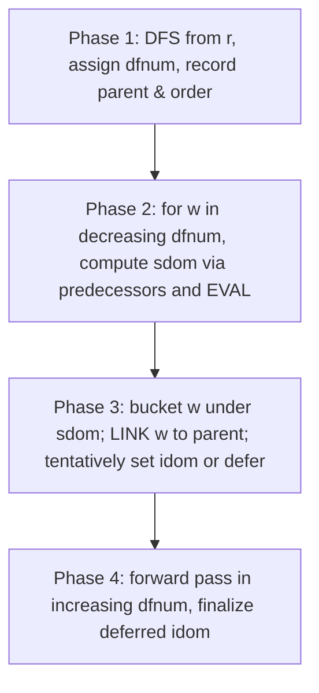
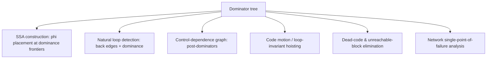

# Dominator Tree (Lengauer-Tarjan) — Middle Level

> **Focus:** Why semidominators approximate `idom`, why the link-eval forest with path compression makes it near-linear, when to choose iterative dataflow vs Lengauer-Tarjan, and how compilers use dominators for SSA and loop detection.

---

## Table of Contents

1. [Introduction](#introduction)
2. [Deeper Concepts](#deeper-concepts)
3. [Comparison with Alternatives](#comparison-with-alternatives)
4. [The Lengauer-Tarjan Algorithm in Detail](#the-lengauer-tarjan-algorithm-in-detail)
5. [Graph and Tree Applications](#graph-and-tree-applications)
6. [Algorithmic Integration](#algorithmic-integration)
7. [Code Examples](#code-examples)
8. [Error Handling](#error-handling)
9. [Performance Analysis](#performance-analysis)
10. [Best Practices](#best-practices)
11. [Visual Animation](#visual-animation)
12. [Summary](#summary)

---

## Introduction

At junior level a dominator tree is "the tree of `idom` edges, computed by an iterative fixpoint." At middle level you start asking the *engineering* questions that decide which algorithm ships:

- *Why* does the **semidominator** — defined from raw DFS numbers — get us so close to the true immediate dominator?
- *Why* does the **link-eval forest with path compression** turn an `O(V·E)` computation into `O(E·α(V))`?
- *When* is the simple **iterative dataflow** (Cooper-Harvey-Kennedy) actually the right call, and when must you reach for **Lengauer-Tarjan**?
- *How* do compilers turn a dominator tree into **SSA form**, **natural-loop detection**, and **control dependence**?

These distinctions decide whether your analysis pass runs in milliseconds on a million-block program or quietly becomes the compiler's bottleneck.

---

## Deeper Concepts

### Reminder: the definition and the tree property

`u` dominates `v` iff every path `r ⇝ v` contains `u`. The strict dominators of `v` form a chain (total order under domination), so the closest one — `idom(v)` — is unique, and `idom` edges form the **dominator tree**. Domination equals **ancestry** in that tree. Everything below is about computing `idom` *fast*.

### The DFS tree and the path lemma

Run DFS from `r`, numbering vertices `1..n` in **preorder** (`dfnum`). This produces a **DFS tree** of tree edges, plus non-tree edges classified as forward, back, and cross edges. The key structural fact Lengauer-Tarjan exploits:

> **Path Lemma.** If `u` and `v` are vertices with `dfnum(u) ≤ dfnum(v)`, then any path from `u` to `v` must contain a common ancestor (in the DFS tree) of `u` and `v`.

This is what lets DFS numbers stand in for the global "every path" condition: a shortcut into `v` that only passes through *higher-numbered* vertices behaves like a near-ancestor, and the highest such shortcut origin is the semidominator.

### Semidominator — the precise definition

> `sdom(v)` = the vertex `u` with **minimum `dfnum`** such that there exists a path `u = v_0 → v_1 → … → v_k = v` where **every** intermediate `v_i` (`0 < i < k`) satisfies `dfnum(v_i) > dfnum(v)`.

Read it as: "the highest-up vertex from which I can reach `v` by a path that only dips *below* `v` in DFS-number through intermediates." Two facts make `sdom` useful:

1. **`sdom(v)` is a proper ancestor-or-relative of `v` whose `dfnum` is `< dfnum(v)`** (it sits strictly above `v` in DFS order).
2. **`idom(v)` is an ancestor (in the DFS tree) of `v`, and `dfnum(idom(v)) ≤ dfnum(sdom(v))`** — the semidominator is a *lower bound* on how far up `idom` can be.

So `sdom` is a computable approximation: never below the true `idom`, and often equal to it. The job of the algorithm is (a) compute every `sdom`, then (b) correct `sdom` into `idom`.

### Computing `sdom` with one formula

Process vertices in **decreasing `dfnum`** order. For a vertex `w`, examine each predecessor `v` (an edge `v → w`):

```
if dfnum(v) < dfnum(w):          # v is "above" w: a direct candidate
    candidate = v
else:                            # v is below w: bring up the best sdom seen
    candidate = sdom( EVAL(v) )  # EVAL finds the min-sdom ancestor of v processed so far
sdom(w) = min(sdom(w), candidate)   # min by dfnum
```

`EVAL(v)` answers: "among the vertices on the DFS-tree path from `v` up to the highest already-processed vertex, which has the smallest `sdom` (by `dfnum`)?" This is the **link-eval** structure — the heart of the speedup.

### The two rules to turn `sdom` into `idom`

After `sdom(w)` is known, the true immediate dominator is recovered by the **dominator theorem** (full proof in `professional.md`). Let `u = EVAL(w)` be the vertex with minimum `sdom` on the path from `sdom(w)`'s child up to `w`:

```
if sdom(u) == sdom(w):  idom(w) = sdom(w)          # rule 1: sdom is the answer
else:                   idom(w) = idom(u)          # rule 2: defer to u's idom
```

Vertices for which rule 2 applies are resolved in a second pass once their `u`'s `idom` is final. Concretely the algorithm has four phases: (1) DFS + numbering, (2) compute `sdom` in reverse `dfnum` order via link-eval, (3) tentatively set `idom` or defer, (4) a forward pass that finalizes deferred `idom`s.

### Why path compression makes it near-linear

`EVAL` walks up DFS-tree paths to find a minimum-`sdom` ancestor. Done naively, that walk is `O(depth)` per call → `O(V·E)` overall. **Path compression** (the Union-Find trick) flattens these paths as it goes, so the *amortized* cost of all `EVAL`/`LINK` operations across the whole run is:

- `O(E·log V)` with path compression alone (the "simple" Lengauer-Tarjan), or
- `O(E·α(V))` with **balanced linking (union by size/rank)** added (the "sophisticated" version).

`α(V)` is the inverse Ackermann function — `≤ 4` for any realistic `V` — so the sophisticated version is linear for all practical purposes. This is the same amortization that makes Union-Find near-linear (see `12-union-find`); Lengauer-Tarjan was, historically, one of the first dramatic applications of it.

---

## Comparison with Alternatives

| Attribute | Iterative dataflow (Cooper-Harvey-Kennedy) | Lengauer-Tarjan (simple) | Lengauer-Tarjan (sophisticated) | Naive bitset `Dom` sets |
|-----------|--------------------------------------------|--------------------------|----------------------------------|-------------------------|
| Time | `O(V·E)` worst, ~`O(E)` typical reducible | `O(E·log V)` | `O(E·α(V))` | `O(V·E)` with bitsets |
| Space | `O(V + E)` | `O(V + E)` | `O(V + E)` | `O(V²/64)` for the sets |
| Implementation difficulty | **Low** | High | **Very high** | Low |
| Output | `idom` array | `idom` array | `idom` array | full `Dom` sets |
| Best for | Real CFGs (small/medium, reducible) | Large irreducible graphs | Huge graphs, library code | Pedagogy, when you need full sets |
| Constant factor | small, cache-friendly | moderate | moderate | large per-word |

**Rules of thumb:**

- **Small or medium control-flow graphs that are *reducible*** (almost all real code from structured languages): the **iterative dataflow** algorithm in reverse postorder converges in 2–3 passes and beats Lengauer-Tarjan on wall-clock because of its tiny constant and great cache behavior. This is what LLVM and many compilers ship.
- **Large graphs, irreducible graphs, or library/tooling that must guarantee worst-case bounds:** **Lengauer-Tarjan**. Its `O(E·α(V))` guarantee does not degrade on pathological inputs the way the iterative method's `O(V·E)` worst case can.
- **You need the full `Dom` *sets*, not just `idom`** (e.g. to enumerate all dominators): bitset dataflow, accepting `O(V²/64)` space.
- **Theoretical/streaming refinements** exist (Buchsbaum et al.'s linear-time algorithm, Georgiadis-Tarjan), but they are rarely worth the complexity over the two practical choices above.

The headline irony: the *theoretically* superior Lengauer-Tarjan is often *practically* slower than the simple iterative method on the reducible graphs that dominate real workloads — a classic "asymptotics vs constants" lesson.

---

## The Lengauer-Tarjan Algorithm in Detail

The four phases, made concrete:



### Phase 2 in words

Walk vertices from the largest `dfnum` down to the second-smallest. For each `w`:

- For each predecessor `v` of `w`: if `v` is above `w` (`dfnum(v) < dfnum(w)`), `v` itself is a semidominator candidate; otherwise `EVAL(v)` brings up the best (smallest-`sdom`) ancestor of `v` already linked into the forest, and *its* `sdom` is the candidate.
- `sdom(w)` is the candidate with the smallest `dfnum`.
- Put `w` into the **bucket** of `sdom(w)` (we revisit it when we process `sdom(w)`).
- `LINK(parent(w), w)` — attach `w` to its DFS parent in the link-eval forest.
- Process the bucket of `parent(w)`: for each `v` in it, `u = EVAL(v)`; if `sdom(u) == sdom(v)` then `idom(v) = sdom(v)` (rule 1), else defer (`idom(v) = u`, fixed up later).

### Phase 4

Sweep `w` in **increasing** `dfnum`. If `idom(w)` was deferred (it points at some `u`, not at `sdom(w)`), set `idom(w) = idom(idom(w))`. Because we go top-down, the target `idom` is already final. After this pass every `idom` is correct.

### The link-eval forest

`LINK` and `EVAL` operate on a forest that mirrors the DFS tree but is built incrementally as we process vertices bottom-up:

- `LINK(parent, w)`: union `w`'s tree into `parent`'s.
- `EVAL(v)`: find the vertex with minimum `sdom` (by `dfnum`) on the path from `v` to the root of its current tree, applying **path compression** so later calls are cheap.

The sophisticated version also tracks subtree **size** and links the smaller tree under the larger, which is what buys the `α(V)` instead of `log V`.

---

## Graph and Tree Applications



### SSA construction and the dominance frontier

The biggest application. **Static Single Assignment (SSA)** form requires that each variable be assigned exactly once; where control flow merges, a **φ-function** combines the incoming definitions. *Where* do φ-functions go? At the **dominance frontier**:

> The **dominance frontier** `DF(u)` is the set of nodes `w` such that `u` dominates a **predecessor** of `w` but does **not strictly dominate** `w` itself.

`DF(u)` is exactly "the first places where `u`'s influence stops being guaranteed" — the merge points where a definition in `u` might or might not have happened, so a φ is needed. The classic Cytron-Ferrante-Rosen-Wegman-Zadeck algorithm computes `DF` from the dominator tree in near-linear time and places φ-functions iteratively. Without the dominator tree, SSA construction is intractable.

### Natural loop detection

A **back edge** is an edge `t → h` where `h` dominates `t` (`h` is the loop **header**). The **natural loop** of that back edge is `{h}` plus all nodes that can reach `t` without going through `h`. Dominance is the *definition* of a back edge here — you cannot identify loop headers correctly without it. This drives loop-invariant code motion, strength reduction, and loop unrolling.

### Control dependence (post-dominators)

A node `v` is **control-dependent** on a branch `b` if `b` decides whether `v` executes. Formally, control dependence is defined via **post-dominators**: `v` is control-dependent on `b` iff `v` post-dominates a successor of `b` but does not post-dominate `b` itself. Post-dominators are just dominators on the **reverse graph** with the exit as entry — so the same Lengauer-Tarjan code, run on the reversed CFG, yields the **control-dependence graph** used in program slicing, parallelization, and the Program Dependence Graph (PDG).

---

## Algorithmic Integration

Dominators rarely stand alone; they feed larger pipelines:

- **SSA → optimization → out-of-SSA.** Build the dominator tree → compute dominance frontiers → place φ-functions → rename variables → run SSA-based optimizations (GVN, constant propagation, dead-code) → destruct SSA. Every modern optimizing compiler (LLVM, GCC, V8/TurboFan, HotSpot C2) does this.
- **Loop nest forest.** Dominators + back edges → natural loops → a loop nesting forest used to schedule loop optimizations inner-to-outer.
- **Program slicing.** Control dependence (post-dominators) + data dependence → the Program Dependence Graph → backward/forward slices for debugging and security analysis.
- **Profile-guided layout.** Dominator relationships help decide which blocks are "always together," informing code layout and inlining heuristics.

```python
# Sketch: build the optimization scaffold from a CFG
def ssa_scaffold(cfg):
    idom = lengauer_tarjan(cfg.succ, cfg.entry)   # dominator tree
    df = dominance_frontiers(cfg, idom)           # CFRWZ frontiers
    phi_sites = place_phi_functions(cfg, df)      # where merges need phi
    loops = natural_loops(cfg, idom)              # back-edge + dominance
    return idom, df, phi_sites, loops
```

---

## Code Examples

### Lengauer-Tarjan (simple, path-compression) in three languages

A faithful, runnable implementation of the simple `O(E log V)` variant. Vertices are `0..n-1`; entry is `r`.

#### Go

```go
package main

import "fmt"

type LT struct {
	n                                int
	succ, pred                       [][]int
	dfnum, vertex, parent            []int
	semi, idom, ancestor, label, par []int
	bucket                           [][]int
	cnt                              int
}

func newLT(n int, succ [][]int) *LT {
	lt := &LT{n: n, succ: succ}
	lt.pred = make([][]int, n)
	for u := 0; u < n; u++ {
		for _, v := range succ[u] {
			lt.pred[v] = append(lt.pred[v], u)
		}
	}
	lt.dfnum = make([]int, n)
	lt.vertex = make([]int, n)
	lt.parent = make([]int, n)
	lt.semi = make([]int, n)
	lt.idom = make([]int, n)
	lt.ancestor = make([]int, n)
	lt.label = make([]int, n)
	lt.bucket = make([][]int, n)
	for i := 0; i < n; i++ {
		lt.semi[i] = -1
		lt.ancestor[i] = -1
		lt.label[i] = i
	}
	return lt
}

func (lt *LT) dfs(u int) {
	lt.semi[u] = lt.cnt
	lt.vertex[lt.cnt] = u
	lt.cnt++
	for _, v := range lt.succ[u] {
		if lt.semi[v] == -1 {
			lt.parent[v] = u
			lt.dfs(v)
		}
	}
}

// compress applies path compression, updating label to the min-semi ancestor.
func (lt *LT) compress(v int) {
	if lt.ancestor[lt.ancestor[v]] != -1 {
		lt.compress(lt.ancestor[v])
		if lt.semi[lt.label[lt.ancestor[v]]] < lt.semi[lt.label[v]] {
			lt.label[v] = lt.label[lt.ancestor[v]]
		}
		lt.ancestor[v] = lt.ancestor[lt.ancestor[v]]
	}
}

func (lt *LT) eval(v int) int {
	if lt.ancestor[v] == -1 {
		return v
	}
	lt.compress(v)
	return lt.label[v]
}

func (lt *LT) link(w, v int) { lt.ancestor[v] = w }

// run returns idom; idom[r] = r.
func (lt *LT) run(r int) []int {
	lt.dfs(r)
	for i := lt.cnt - 1; i >= 1; i-- {
		w := lt.vertex[i]
		for _, v := range lt.pred[w] {
			if lt.semi[v] == -1 {
				continue // unreachable predecessor
			}
			u := lt.eval(v)
			if lt.semi[u] < lt.semi[w] {
				lt.semi[w] = lt.semi[u]
			}
		}
		lt.bucket[lt.vertex[lt.semi[w]]] = append(lt.bucket[lt.vertex[lt.semi[w]]], w)
		lt.link(lt.parent[w], w)
		// process bucket of parent(w)
		pw := lt.parent[w]
		for _, v := range lt.bucket[pw] {
			u := lt.eval(v)
			if lt.semi[u] < lt.semi[v] {
				lt.idom[v] = u
			} else {
				lt.idom[v] = pw
			}
		}
		lt.bucket[pw] = nil
	}
	for i := 1; i < lt.cnt; i++ {
		w := lt.vertex[i]
		if lt.idom[w] != lt.vertex[lt.semi[w]] {
			lt.idom[w] = lt.idom[lt.idom[w]]
		}
	}
	lt.idom[r] = r
	return lt.idom
}

func main() {
	succ := [][]int{{1, 2}, {3}, {3}, {4, 5}, {5}, {}}
	idom := newLT(6, succ).run(0)
	for v := 0; v < 6; v++ {
		fmt.Printf("idom(%d) = %d\n", v, idom[v])
	}
	// idom(0)=0 idom(1)=0 idom(2)=0 idom(3)=0 idom(4)=3 idom(5)=3
}
```

#### Java

```java
import java.util.*;

public class LengauerTarjan {
    int n, cnt = 0;
    List<List<Integer>> succ, pred;
    int[] dfnum, vertex, parent, semi, idom, ancestor, label;
    List<List<Integer>> bucket;

    LengauerTarjan(int n, List<List<Integer>> succ) {
        this.n = n; this.succ = succ;
        pred = new ArrayList<>();
        bucket = new ArrayList<>();
        for (int i = 0; i < n; i++) { pred.add(new ArrayList<>()); bucket.add(new ArrayList<>()); }
        for (int u = 0; u < n; u++) for (int v : succ.get(u)) pred.get(v).add(u);
        dfnum = new int[n]; vertex = new int[n]; parent = new int[n];
        semi = new int[n]; idom = new int[n]; ancestor = new int[n]; label = new int[n];
        Arrays.fill(semi, -1); Arrays.fill(ancestor, -1);
        for (int i = 0; i < n; i++) label[i] = i;
    }

    void dfs(int u) {
        semi[u] = cnt; vertex[cnt] = u; cnt++;
        for (int v : succ.get(u)) if (semi[v] == -1) { parent[v] = u; dfs(v); }
    }

    void compress(int v) {
        if (ancestor[ancestor[v]] != -1) {
            compress(ancestor[v]);
            if (semi[label[ancestor[v]]] < semi[label[v]]) label[v] = label[ancestor[v]];
            ancestor[v] = ancestor[ancestor[v]];
        }
    }

    int eval(int v) {
        if (ancestor[v] == -1) return v;
        compress(v);
        return label[v];
    }

    int[] run(int r) {
        dfs(r);
        for (int i = cnt - 1; i >= 1; i--) {
            int w = vertex[i];
            for (int v : pred.get(w)) {
                if (semi[v] == -1) continue;
                int u = eval(v);
                if (semi[u] < semi[w]) semi[w] = semi[u];
            }
            bucket.get(vertex[semi[w]]).add(w);
            ancestor[w] = parent[w]; // link
            int pw = parent[w];
            for (int v : bucket.get(pw)) {
                int u = eval(v);
                idom[v] = (semi[u] < semi[v]) ? u : pw;
            }
            bucket.get(pw).clear();
        }
        for (int i = 1; i < cnt; i++) {
            int w = vertex[i];
            if (idom[w] != vertex[semi[w]]) idom[w] = idom[idom[w]];
        }
        idom[r] = r;
        return idom;
    }

    public static void main(String[] args) {
        List<List<Integer>> succ = List.of(
            List.of(1, 2), List.of(3), List.of(3), List.of(4, 5), List.of(5), List.of());
        int[] idom = new LengauerTarjan(6, succ).run(0);
        for (int v = 0; v < 6; v++) System.out.println("idom(" + v + ") = " + idom[v]);
    }
}
```

#### Python

```python
import sys


class LengauerTarjan:
    def __init__(self, n, succ):
        self.n = n
        self.succ = succ
        self.pred = [[] for _ in range(n)]
        for u in range(n):
            for v in succ[u]:
                self.pred[v].append(u)
        self.cnt = 0
        self.dfnum = [0] * n
        self.vertex = [0] * n
        self.parent = [0] * n
        self.semi = [-1] * n
        self.idom = [0] * n
        self.ancestor = [-1] * n
        self.label = list(range(n))
        self.bucket = [[] for _ in range(n)]

    def dfs(self, root):
        # iterative DFS to avoid recursion limits
        stack = [root]
        self.semi[root] = self.cnt
        self.vertex[self.cnt] = root
        self.cnt += 1
        order = [root]
        seen = {root}
        while order:
            u = order.pop()
            for v in self.succ[u]:
                if v not in seen:
                    seen.add(v)
                    self.parent[v] = u
                    self.semi[v] = self.cnt
                    self.vertex[self.cnt] = v
                    self.cnt += 1
                    order.append(v)

    def compress(self, v):
        anc = self.ancestor
        if anc[anc[v]] != -1:
            self.compress(anc[v])
            if self.semi[self.label[anc[v]]] < self.semi[self.label[v]]:
                self.label[v] = self.label[anc[v]]
            anc[v] = anc[anc[v]]

    def eval(self, v):
        if self.ancestor[v] == -1:
            return v
        self.compress(v)
        return self.label[v]

    def run(self, r):
        sys.setrecursionlimit(1 << 20)
        self.dfs(r)
        for i in range(self.cnt - 1, 0, -1):
            w = self.vertex[i]
            for v in self.pred[w]:
                if self.semi[v] == -1:
                    continue
                u = self.eval(v)
                if self.semi[u] < self.semi[w]:
                    self.semi[w] = self.semi[u]
            self.bucket[self.vertex[self.semi[w]]].append(w)
            self.ancestor[w] = self.parent[w]  # link
            pw = self.parent[w]
            for v in self.bucket[pw]:
                u = self.eval(v)
                self.idom[v] = u if self.semi[u] < self.semi[v] else pw
            self.bucket[pw] = []
        for i in range(1, self.cnt):
            w = self.vertex[i]
            if self.idom[w] != self.vertex[self.semi[w]]:
                self.idom[w] = self.idom[self.idom[w]]
        self.idom[r] = r
        return self.idom


if __name__ == "__main__":
    succ = [[1, 2], [3], [3], [4, 5], [5], []]
    idom = LengauerTarjan(6, succ).run(0)
    for v in range(6):
        print(f"idom({v}) = {idom[v]}")
    # idom(0)=0 idom(1)=0 idom(2)=0 idom(3)=0 idom(4)=3 idom(5)=3
```

**What it does:** computes every immediate dominator via DFS numbering, semidominators, and link-eval with path compression — the simple `O(E log V)` Lengauer-Tarjan.

> Note: the simple Go/Java DFS uses recursion (clean but stack-bounded); the Python version uses an explicit stack. For SSA-shaped CFGs depths are modest, but production code should use an explicit stack everywhere.

---

## Error Handling

| Scenario | What goes wrong | Correct approach |
|----------|-----------------|------------------|
| Unreachable predecessor in Phase 2 | `semi[v] == -1`, `eval` reads garbage | Skip predecessors with `semi == -1` (never visited by DFS). |
| Recursion depth on deep DFS | Stack overflow on long chains | Use explicit-stack DFS; raise the recursion limit only as a fallback. |
| `EVAL` returns wrong min | Forgetting path compression or comparing by `dfnum` of `v` not `label[v]` | `eval` must return `label`, the min-`sdom` ancestor, after `compress`. |
| Bucket processed at the wrong time | Deferring/finalizing in the wrong phase | Process `parent(w)`'s bucket *after* linking `w`; finalize deferred `idom` in the forward Phase 4. |
| Off-by-one with `dfnum` 0 vs 1 | Root semidominator confusion | Be consistent: here `dfnum` starts at 0 and the root is `vertex[0]`; loop `i` from `cnt-1` down to `1`. |

---

## Performance Analysis

| Graph type | Iterative dataflow | Lengauer-Tarjan (simple) | Notes |
|------------|--------------------|--------------------------|-------|
| Reducible, small (≤ a few hundred blocks) | **fastest** (1–3 sweeps) | competitive | Typical function CFG. |
| Reducible, large | fast (few sweeps) | fast, guaranteed | LLVM uses iterative; tooling sometimes uses LT. |
| Irreducible, adversarial | `O(V·E)` worst | `O(E log V)` / `O(E α(V))` | LT's guarantee matters here. |
| Whole-program / megamorphic call graphs | risky | preferred | Worst-case bound is the deciding factor. |

```python
import time, random

def random_dag_cfg(n, extra_edges):
    succ = [[] for _ in range(n)]
    for v in range(1, n):
        succ[random.randint(0, v - 1)].append(v)   # spanning tree
    for _ in range(extra_edges):
        u = random.randint(0, n - 1)
        v = random.randint(0, n - 1)
        if u != v:
            succ[u].append(v)
    return succ

for n in (100, 1000, 5000):
    succ = random_dag_cfg(n, n)
    t = time.perf_counter()
    LengauerTarjan(n, succ).run(0)
    print(f"n={n:>5}: {(time.perf_counter()-t)*1000:.2f} ms")
```

The iterative dataflow method wins on real reducible CFGs because its inner loop is just array reads and a short `intersect` walk — branch-light and cache-friendly — while Lengauer-Tarjan pays for bucket lists, the link-eval forest, and path-compression recursion. Choose by *guarantee needs*, not asymptotics alone.

---

## Best Practices

- **Default to iterative dataflow in reverse postorder** for real compiler CFGs; it is simpler, faster in practice, and easy to verify.
- **Reach for Lengauer-Tarjan** when you need a hard `O(E·α(V))` guarantee (large/irreducible/library code).
- **Keep the naive version as a test oracle.** Cross-check `idom` arrays on random graphs — the fast algorithm is bug-prone.
- **Compute post-dominators by reversing the graph** and reusing the *same* dominator code; do not write a second algorithm.
- **Separate "compute `idom`" from "build the tree" from "answer queries."** Different code, different test surfaces.
- **Match the algorithm to the question.** If you only need natural loops, you need `idom` + back edges, not the full dominance frontier. If you need SSA, you need frontiers on top of `idom`.
- **Watch reachability.** Prune unreachable blocks first (a quick DFS) so dominator code never sees a `-1` semi mid-flight.

### When NOT to reach for the dominator tree

If the actual question is plain reachability ("can `r` get to `v`?"), a single BFS/DFS answers it without any dominator machinery. If the graph has no natural single entry, "dominator" is ill-defined — pick an artificial source carefully or reconsider. And if the structure changes constantly, maintaining the tree incrementally (a research-grade problem) may cost more than recomputing only the cheap fact you needed.

---

## Visual Animation

> See [`animation.html`](./animation.html) for an interactive view.
>
> The middle-level animation highlights:
> - DFS numbering and the resulting DFS tree.
> - Each vertex's semidominator as predecessors are scanned in reverse `dfnum`.
> - The link-eval forest growing and `idom` edges being committed.
> - The dominator tree assembled incrementally next to the flow graph.

---

## Summary

The semidominator `sdom(v)` is a DFS-number-based lower bound on `idom(v)`: the highest-up vertex that can reach `v` through only higher-numbered intermediates. Lengauer-Tarjan computes every `sdom` in **decreasing `dfnum`** order using a **link-eval forest with path compression** (`O(E·log V)` simple, `O(E·α(V))` with balanced linking), then corrects `sdom` into `idom` with the dominator theorem's two rules and a forward finalize pass. In practice, the much simpler **iterative dataflow** (Cooper-Harvey-Kennedy) in reverse postorder *beats* Lengauer-Tarjan on the reducible CFGs that dominate real code, so choose Lengauer-Tarjan for worst-case guarantees on large or irreducible graphs. Dominators are the backbone of compiler analysis — **SSA φ-placement via dominance frontiers, natural-loop detection via back edges, and control dependence via post-dominators on the reversed CFG**.

---

**Next step:** [senior.md](./senior.md) — dominators in compiler and program-analysis systems at scale: SSA pipelines, control-dependence graphs, incremental maintenance, and engineering trade-offs.
