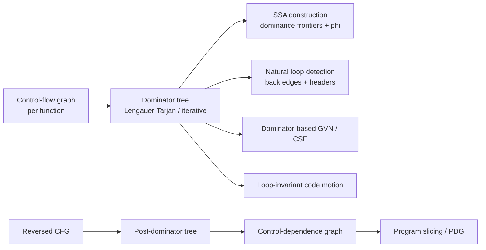
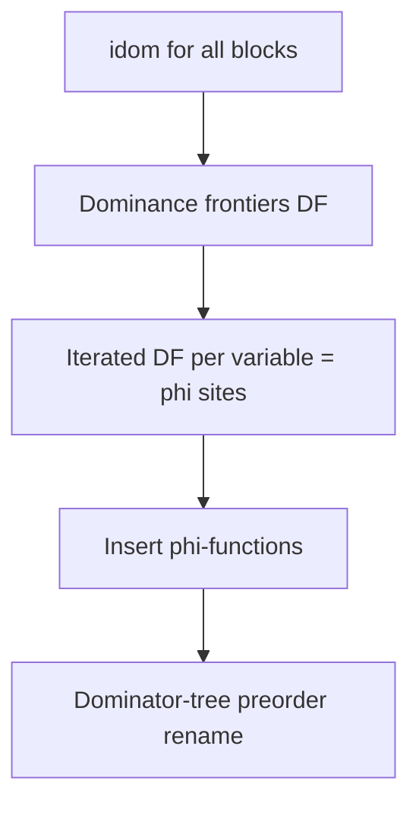
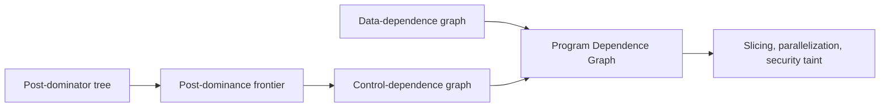
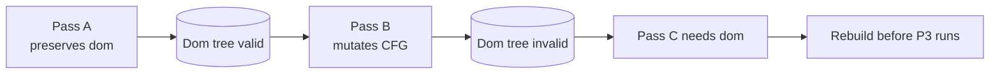

# Dominator Tree (Lengauer-Tarjan) — Senior Level

> A dominator tree is rarely the hard part of a compiler — until it becomes the data structure every optimization pass reads, recomputes, and must keep consistent across thousands of CFG mutations per compilation. At that scale, *how* you compute, cache, invalidate, and query dominators decides whether your optimizer is fast and correct or slow and subtly wrong.

## Table of Contents
1. [Introduction](#1-introduction)
2. [Dominators in the Compiler Pipeline](#2-dominators-in-the-compiler-pipeline)
3. [SSA Construction at Scale](#3-ssa-construction-at-scale)
4. [Control Dependence and Program Analysis](#4-control-dependence-and-program-analysis)
5. [Incremental and Lazy Maintenance](#5-incremental-and-lazy-maintenance)
6. [Choosing the Algorithm in a Real System](#6-choosing-the-algorithm-in-a-real-system)
7. [Code Examples](#7-code-examples)
8. [Observability](#8-observability)
9. [Failure Modes](#9-failure-modes)
10. [Capacity Planning](#10-capacity-planning)
11. [Summary](#11-summary)

---

## 1. Introduction

> The recurring senior theme: the dominator *algorithm* is the easy, solved part — near-linear, a few hundred lines, decades-stable. The hard part is everything that surrounds it at scale: making queries `O(1)`, keeping the tree consistent across a mutating pass pipeline, reusing one implementation for dominators and post-dominators, and proving (via a verifier) that you did not silently miscompile.

At the senior level the question is no longer "how does Lengauer-Tarjan work" but "where does the dominator tree live in my compiler or analysis system, and what breaks when it does?" A dominator tree is computed in `O(E·α(V))` from a control-flow graph and then *read* by almost every downstream pass:

- It is the **structural index** for SSA construction (φ placement via dominance frontiers).
- It defines **natural loops** (back edges and headers), driving the loop optimization schedule.
- Its **reverse-graph twin** (post-dominators) defines **control dependence** for slicing and parallelization.
- It answers **"does A always run before B?"** in `O(1)` after preprocessing — a query optimizations make constantly.

Each of these is an *engineering* decision layered on top of a textbook algorithm. The interesting senior decisions are architectural:

1. Build the tree **eagerly** once or **lazily** on first query, and how to **invalidate** it as passes mutate the CFG.
2. Pick **iterative dataflow** vs **Lengauer-Tarjan** given your CFG shapes and worst-case guarantees.
3. Keep dominators **consistent** across the hundreds of CFG edits a pass pipeline performs.
4. Make the tree **queryable in `O(1)`** (Euler tour + RMQ, or in/out numbering) so hot passes do not walk parent chains.
5. **Observe and bound** an analysis that, while near-linear, runs on every function of every compilation.
6. **Verify** the result, because a wrong dominator tree is a silent miscompile rather than a crash — the hardest class of bug to localize.

---

## 2. Dominators in the Compiler Pipeline

### 2.1 Where the tree is consumed



The dominator tree is a **shared, read-mostly artifact**. SSA construction, GVN/CSE, LICM, and scheduling all query it; the post-dominator tree feeds control dependence and slicing. A single `DominatorTree` object is therefore one of the most-read data structures in an optimizer. The consistent senior failure is treating it as a free, always-fresh constant rather than a cached analysis with a lifecycle — build, query, invalidate, rebuild. The lifecycle *is* the design.

### 2.2 The two queries everything needs

Almost every consumer reduces to two primitives:

1. **`dominates(a, b)`** — is `a` an ancestor of `b` in the dom tree? Used by GVN ("is this redundant expression available?"), code motion ("can I hoist to `a`?"), and safety checks.
2. **`idom(b)` / nearest common dominator `ncd(a, b)`** — the LCA in the dom tree, used by φ placement, sinking, and finding the safe insertion point for a hoisted instruction.

If these are `O(depth)` (parent-chain walks), they dominate the cost of hot passes. The standard fix is to preprocess the tree once into **in/out (Euler-tour) numbers**: `dominates(a, b)` becomes a constant-time interval containment check, `in[a] ≤ in[b] && out[b] ≤ out[a]`. LCA becomes `O(1)` with a sparse table or `O(log n)` with binary lifting. Senior engineering is mostly about making these two queries cheap and keeping their preprocessing valid across edits.

### 2.2.1 Caching the query structure with the tree

Because both primitives benefit from preprocessing, a mature `DominatorTree` object caches three things together, invalidated as a unit: the `idom` array, the Euler-tour `tin`/`tout` arrays for `O(1)` `dominates`, and an LCA structure (sparse table or binary-lifting tables) for nearest-common-dominator. Bundling them means a single validity flag governs all dominance queries, and a rebuild refreshes everything atomically. Splitting them invites a subtle bug where `idom` is current but the cached `tin`/`tout` reflect a stale tree — every `dominates` query then returns confidently wrong answers. The rule: **one version, one invalidation, one rebuild** for the whole dominance query surface.

### 2.3 Build cost in context

For a single function with `B` basic blocks and `E` CFG edges, the dominator tree is `O(E·α(B))` — effectively linear in the function size. The cost only matters in aggregate: a whole-program optimizer builds (and rebuilds) dominator trees for *every* function, sometimes multiple times per function as passes run. The lever is not the per-build asymptotics (already near-linear) but **how many times you rebuild** — which is the invalidation story in §5.

---

## 3. SSA Construction at Scale

### 3.1 The frontier-driven pipeline

SSA construction is the marquee dominator-tree client. The Cytron-Ferrante-Rosen-Wegman-Zadeck (CFRWZ) pipeline:

1. Build the **dominator tree** (`idom` for every block).
2. Compute the **dominance frontier** `DF(b)` for every block — where `b`'s influence stops being guaranteed.
3. For each variable `x`, place **φ-functions** at the iterated dominance frontier of `x`'s definition sites.
4. **Rename** variables in a single dominator-tree preorder walk, maintaining a stack of reaching definitions per variable.



### 3.2 Why the dominator tree is the right index

The renaming walk is a **preorder traversal of the dominator tree**, not the CFG. This is the crucial structural insight: a definition in block `b` reaches a use in block `c` along the dominator-tree path, so walking the dom tree and pushing/popping definition stacks at entry/exit of each block yields correct, single-assignment names in one pass. Get the traversal order wrong (CFG order instead of dom-tree order) and you produce incorrect SSA. At scale — millions of variables across a large module — this single-pass property is what keeps SSA construction near-linear.

### 3.3 Pruned and semi-pruned SSA

Naive φ placement inserts dead φ-functions (for variables not live at the merge). **Pruned SSA** intersects φ sites with liveness; **semi-pruned SSA** restricts to variables live across block boundaries — cheaper to compute, nearly as tight. The trade-off is a senior call: pruning costs a liveness analysis but shrinks the IR every later pass must traverse. For JITs (V8 TurboFan, HotSpot C2) where compile time is on the critical path of program execution, semi-pruned is common; for AOT optimizers (LLVM, GCC) full pruning often pays off because downstream pass count is high.

### 3.4 Engineering the frontier computation

Dominance frontiers can be computed bottom-up on the dominator tree (CFRWZ) or, in the Cooper-Harvey-Kennedy style, directly from `idom` with a short per-edge loop:

```
for each CFG edge (a, b):
    runner = a
    while runner != idom(b):
        DF(runner) += b
        runner = idom(runner)
```

This is `O(E · tree-height)` worst case but linear in practice on reducible graphs, and it pairs naturally with the iterative `idom` computation, so many production compilers use exactly this pair — simple, fast, and easy to keep consistent.

### 3.5 The renaming pass as a stack discipline

The rename phase is where a subtle correctness invariant lives. Walking the dominator tree in preorder, on entering a block `b` you push, for each variable defined in `b`, the new SSA name onto that variable's stack; uses in `b` read the top of stack; on **leaving** `b` (after recursing into its dominator-tree children) you pop exactly what you pushed. The crucial part is that **φ-operands are filled in by the predecessor's perspective**, not the block's own: a φ in block `w` for variable `x` takes, for each CFG predecessor `p` of `w`, the SSA name of `x` that is current *at the end of `p`*. So φ-operand wiring happens when you visit `p`, reading `p`'s top-of-stack — which is why the traversal must be the dominator-tree order (it guarantees a definition is on the stack exactly while it dominates the current point). A compiler engineer who mixes CFG-successor iteration (to fill φ-operands) with dominator-tree recursion (to scope definitions) and gets the order wrong ships a miscompile that only manifests on specific control-flow shapes — one of the harder SSA bugs to localize without the verifier from §8.1.

### 3.6 Memory and the IR explosion

φ-functions are not free: a variable live across many merge points gets a φ at each, and the iterated dominance frontier can, in pathological CFGs, place a quadratic number of φs. This is why pruning matters at scale — a megamorphic generated function with thousands of locals and deep nesting can balloon its own IR. The senior mitigation is twofold: compute liveness first (pruned SSA) so φs only land where the variable is actually live, and represent φ-operand lists compactly (parallel arrays indexed by predecessor, not per-φ hash maps). The dominator tree is cheap; the *structures it indexes into* (SSA IR, dominance frontiers, φ webs) are where the memory goes, and capacity planning (§10) is really about those, not the `idom` array.

---

## 4. Control Dependence and Program Analysis

### 4.1 Post-dominators from the same code

**Post-dominator tree** = dominator tree of the **reversed CFG** with the **exit** as root. Run the identical Lengauer-Tarjan (or iterative) implementation on `pred`/`succ` swapped and `exit` as entry. No second algorithm — a senior must resist the temptation to write a parallel "post-dominator" implementation that will drift out of sync with the dominator one.

A subtlety: a CFG may have **multiple exits** (or none, with infinite loops). The standard fix is a synthetic unique exit node with edges from every real exit (and from loop headers of infinite loops), giving the reversed graph a single root. This synthetic node is bookkeeping, not real control flow, so consumers must remember it is not a basic block — a frequent off-by-one source when iterating "all blocks."

### 4.2 The control-dependence graph

`v` is **control-dependent** on branch `b` iff `v` post-dominates a successor of `b` but not `b` itself. Computed from the post-dominator tree and its **post-dominance frontier** (the reverse-graph analogue of the dominance frontier). The resulting **control-dependence graph (CDG)** is half of the **Program Dependence Graph (PDG)**:



The PDG powers **program slicing** (which statements affect a value), **automatic parallelization** (independent regions), and **taint/security analysis** (does tainted input reach a sink). All of it rests on post-dominators, which rest on the same dominator machinery.

### 4.3 Beyond compilers

The "every path from the entry passes through `u`" question is general:

- **Network reliability / SPOF.** In a single-source flow (traffic from one ingress), a dominator vertex is a **single point of failure**: removing it disconnects everything it dominates. The dominator tree enumerates SPOFs directly.
- **Pointer / escape analysis.** Dominance bounds where an allocation's effects can be observed.
- **Decompilation / binary analysis.** Recovering loop and conditional structure from machine code uses dominators to find headers and merge points.
- **Build systems / dependency graphs.** "Which targets must always be built before `t`?" is a domination query when there is a single root target.

### 4.4 Worked SPOF example at scale

Consider a request-routing mesh: a single ingress `r`, fan-out to regional gateways, then to service pods. Build the dominator tree of the routing graph rooted at `r`. Any vertex with **children in the dominator tree** is a single point of failure for everything below it — removing it severs those descendants from the ingress. A leaf in the dominator tree dominates nothing but itself, so it is safe to lose. This converts a "remove each node and re-test connectivity" `O(V·(V+E))` brute force into one `O(E·α(V))` dominator build plus an `O(V)` scan for non-leaf tree nodes. At fleet scale (tens of thousands of nodes) that is the difference between a feasible periodic resilience audit and an infeasible one. The dual question — "what fails if a *link* dies?" — uses **strong bridges**, computed from dominator trees of `G` and its reverse (Georgiadis-Italiano), the same machinery reused twice.

---

## 5. Incremental and Lazy Maintenance

### 5.1 The invalidation problem

Optimization passes **mutate the CFG**: they split blocks, delete unreachable code, fold branches, unroll loops. Every mutation potentially changes dominators. The naive policy — rebuild the whole dominator tree after every edit — is correct but wasteful when a pass makes thousands of small edits.

Three disciplines, in increasing sophistication:

| Discipline | Mechanism | When |
|------------|-----------|------|
| **Rebuild-on-demand** | Mark dom tree dirty on any CFG edit; rebuild lazily on next query. | Most passes; simple and safe. |
| **Batch + rebuild** | Pass does all edits, then triggers one rebuild at the end. | Passes with many edits, few intra-pass queries. |
| **Incremental update** | Patch `idom` for the affected subtree only. | Hot passes; research-grade correctness burden. |

### 5.2 Lazy rebuild with a validity flag

LLVM's model: the `DominatorTree` is an analysis result with a **validity flag**. Passes declare whether they **preserve** dominators. If a pass preserves them, the tree survives untouched; if not, it is invalidated and recomputed before the next consumer. This pass-manager-level bookkeeping is the practical answer at scale: correctness by construction (a pass that edits the CFG must declare it), and rebuilds only when genuinely needed.



### 5.3 Incremental dominator updates

For single-edge insertions/deletions, incremental algorithms (Sreedhar-Gao-Lee; the dynamic dominator literature) patch only the affected part of the tree. An edge **insertion** can only move some `idom`s **up** toward the root (nearest common dominator of old `idom` and the new path); an edge **deletion** is harder and may push `idom`s down. LLVM's `DomTreeUpdater` batches a set of insert/delete updates and applies a semi-incremental algorithm rather than a full rebuild. This matters for passes like jump-threading that perform many local CFG surgeries: full rebuilds would be quadratic in the number of edits.

The senior judgment: incremental maintenance is **correctness-fragile**. Unless a pass is hot enough to justify it (profiling shows dominator rebuilds dominating), prefer batch-rebuild — a single near-linear recomputation is cheap and obviously correct.

### 5.4 Why insertions move idoms up and deletions move them down

The asymmetry is worth understanding because it dictates which incremental cases are tractable. Inserting an edge `(u, v)` adds a *new way to reach* every descendant of `v`. A new path can only **weaken** domination — a vertex that used to be unavoidable on the way to some `w` may now be avoidable via the new route — so each affected `idom` can only rise toward `r` (to the nearest common dominator of the old `idom` and `u`). Crucially it can never sink: adding paths never makes a vertex *more* unavoidable. Deleting an edge does the reverse: it removes a way to reach things, potentially making some previously-avoidable vertex now unavoidable, so `idom`s can **sink** away from `r`. Sinking is harder because you must discover *which* new dominator emerged, which in the worst case means re-examining a large subtree. This is exactly why insertion-only (incremental) dominator algorithms are mature and clean while decremental and fully-dynamic ones remain research-grade — and why a pass that only *splits* blocks and *adds* edges (common in inlining and loop rotation) can use a cheap incremental update, whereas a pass that *deletes* control flow (dead-block elimination) is usually better off triggering a batch rebuild.

### 5.5 The pass-pipeline economics

Across a realistic optimization pipeline a function's CFG might be edited hundreds of times but only *queried* for dominance by a dozen passes. The economic question is: how many times do you pay the (near-linear) rebuild? With no discipline, every edit invalidates and the next query rebuilds — potentially dozens of rebuilds. With preserve-flags, only CFG-mutating passes that *don't* declare preservation force a rebuild, and a run of dominance-preserving passes (most peephole and value-numbering passes preserve it) reuses one tree. With batching, an edit-heavy pass amortizes all its surgery into a single end-of-pass rebuild. The dominator algorithm's asymptotics are fixed and excellent; **rebuild count is the only lever you control**, and it is governed entirely by pass metadata hygiene, not by the algorithm choice.

---

## 6. Choosing the Algorithm in a Real System

| Factor | Iterative dataflow (CHK) | Lengauer-Tarjan |
|--------|--------------------------|-----------------|
| CFG shape | Reducible (structured source) | Any, incl. irreducible |
| Worst case | `O(V·E)` | `O(E·α(V))` |
| Typical wall-clock on real CFGs | **faster** (small constant) | slower constant |
| Implementation risk | low | high |
| Used by | LLVM (semi-NCA variant), many | tooling, some static analyzers |

### 6.1 The practical default

Modern LLVM uses a **Semi-NCA** algorithm (a hybrid descended from Lengauer-Tarjan and the iterative method, due to Georgiadis) that is simple, fast on real CFGs, and handles irreducibility. The lesson generalizes: on the **reducible** graphs that structured source produces, the simple iterative method's tiny constant usually wins wall-clock despite the worse asymptotic bound. Reach for full Lengauer-Tarjan (or Semi-NCA) when (a) you process **adversarial or machine-generated** CFGs that can be irreducible/deep, or (b) you need a **hard worst-case guarantee** because the analysis runs in a latency-sensitive context (a JIT) where a pathological function must not stall compilation.

### 6.2 The regime boundary

- **JIT compiler, hot function, latency budget:** worst-case guarantee matters → Semi-NCA / Lengauer-Tarjan.
- **AOT compiler, reducible CFGs, simplicity prized:** iterative dataflow in reverse postorder.
- **Static-analysis tool on arbitrary binaries (irreducible common):** Lengauer-Tarjan / Semi-NCA.
- **One-off script / small graphs:** iterative dataflow — fewest lines, easiest to verify.

The deciding axis is rarely raw speed (all are near-linear); it is **worst-case predictability vs implementation simplicity**.

### 6.3 Detecting irreducibility cheaply

Because the algorithm choice hinges on reducibility, it pays to detect it during the DFS you already run. A CFG is irreducible iff it has a **retreating edge that is not a back edge** — an edge `(u, w)` where `w` is an ancestor of `u` on the DFS stack but `w` does *not* dominate `u`. In practice, classify edges during DFS (tree/forward/back/cross) and flag the function irreducible if any retreating edge's target is not a dominator of the source. Many compilers do this once, cache an `irreducible` bit per function, and route irreducible functions to the Lengauer-Tarjan/Semi-NCA path while letting the common reducible majority use the cheap iterative method. The detection is free (folded into the numbering DFS), and it converts the algorithm choice from a global policy into a per-function decision — the best of both regimes.

### 6.4 Why not always use the fast algorithm?

A reasonable junior instinct is "just always run Lengauer-Tarjan and stop worrying about CFG shape." The senior counter: the iterative method is *dramatically* simpler (no link-eval forest, no buckets, no deferred rules), which means fewer bugs, easier maintenance, trivial verification, and better cache behavior on the small reducible CFGs that are 95%+ of real functions. Shipping the intricate algorithm everywhere trades a real, recurring maintenance and correctness cost for an asymptotic guarantee that only matters on a rare minority of inputs. The mature answer is the hybrid policy of §6.3: cheap detection plus the simple algorithm by default, escalating to the fast one only when the input demands it. This is the same "match the tool to the actual input distribution, not the worst case" judgment that recurs throughout systems engineering.

---

## 7. Code Examples

### 7.1 Go — O(1) domination queries via Euler-tour in/out numbering

After building `idom`, preprocess the tree so `dominates(a, b)` is a constant-time interval check — the query hot passes make millions of times.

```go
package main

import "fmt"

type DomQuery struct {
	tin, tout []int
}

// preprocess assigns Euler in/out times via a DFS of the dominator tree.
func preprocess(n int, idom []int, r int) *DomQuery {
	children := make([][]int, n)
	for v := 0; v < n; v++ {
		if v != r && idom[v] != -1 {
			children[idom[v]] = append(children[idom[v]], v)
		}
	}
	q := &DomQuery{tin: make([]int, n), tout: make([]int, n)}
	timer := 0
	// iterative DFS over the dominator tree
	type frame struct{ u, ci int }
	stack := []frame{{r, 0}}
	q.tin[r] = timer
	timer++
	for len(stack) > 0 {
		f := &stack[len(stack)-1]
		if f.ci < len(children[f.u]) {
			c := children[f.u][f.ci]
			f.ci++
			q.tin[c] = timer
			timer++
			stack = append(stack, frame{c, 0})
		} else {
			q.tout[f.u] = timer
			timer++
			stack = stack[:len(stack)-1]
		}
	}
	return q
}

// dominates reports whether a dominates b (a is an ancestor of b in the dom tree).
func (q *DomQuery) dominates(a, b int) bool {
	return q.tin[a] <= q.tin[b] && q.tout[b] <= q.tout[a]
}

func main() {
	// idom from the running example: 0 dominates all; 3 dominates 4 and 5.
	idom := []int{0, 0, 0, 0, 3, 3}
	q := preprocess(6, idom, 0)
	fmt.Println(q.dominates(3, 5)) // true
	fmt.Println(q.dominates(1, 5)) // false
	fmt.Println(q.dominates(0, 4)) // true
}
```

### 7.2 Java — dominance frontier from idom (Cooper-Harvey-Kennedy)

The frontier computation SSA construction needs, derived directly from `idom`.

```java
import java.util.*;

public final class DominanceFrontier {
    // df.get(b) = blocks where b's dominance "ends" (phi-placement sites).
    static List<Set<Integer>> compute(int n, List<List<Integer>> preds, int[] idom, int r) {
        List<Set<Integer>> df = new ArrayList<>();
        for (int i = 0; i < n; i++) df.add(new HashSet<>());
        for (int b = 0; b < n; b++) {
            if (preds.get(b).size() < 2) continue; // frontiers arise at merges
            for (int p : preds.get(b)) {
                int runner = p;
                while (runner != idom[b] && runner != -1) {
                    df.get(runner).add(b);
                    runner = idom[runner];
                }
            }
        }
        return df;
    }

    public static void main(String[] args) {
        // CFG: 0->1, 0->2, 1->3, 2->3, 3->4, 3->5, 4->5
        int n = 6;
        List<List<Integer>> preds = new ArrayList<>();
        for (int i = 0; i < n; i++) preds.add(new ArrayList<>());
        int[][] edges = {{0,1},{0,2},{1,3},{2,3},{3,4},{3,5},{4,5}};
        for (int[] e : edges) preds.get(e[1]).add(e[0]);
        int[] idom = {0, 0, 0, 0, 3, 3};
        List<Set<Integer>> df = compute(n, preds, idom, 0);
        for (int b = 0; b < n; b++) System.out.println("DF(" + b + ") = " + df.get(b));
        // DF(1)={3} DF(2)={3} DF(4)={5} ...
    }
}
```

### 7.3 Python — natural loop detection from dominators

Back edges plus dominance give the natural loops the loop optimizer schedules.

```python
def natural_loops(n, succ, idom, r):
    """Return {header: set(loop body blocks)} for each natural loop."""
    # in/out numbering for O(1) dominance
    children = [[] for _ in range(n)]
    for v in range(n):
        if v != r and idom[v] != -1:
            children[idom[v]].append(v)
    tin, tout = [0] * n, [0] * n
    timer = 0
    stack = [(r, iter(children[r]))]
    tin[r] = timer; timer += 1
    while stack:
        u, it = stack[-1]
        for c in it:
            tin[c] = timer; timer += 1
            stack.append((c, iter(children[c])))
            break
        else:
            tout[u] = timer; timer += 1
            stack.pop()

    def dominates(a, b):
        return tin[a] <= tin[b] and tout[b] <= tout[a]

    loops = {}
    for u in range(n):
        for v in succ[u]:
            if dominates(v, u):  # u -> v is a back edge; v is the header
                body = collect_loop_body(n, succ, u, v)
                loops.setdefault(v, set()).update(body)
    return loops


def collect_loop_body(n, succ, tail, header):
    preds = [[] for _ in range(n)]
    for u in range(n):
        for v in succ[u]:
            preds[v].append(u)
    body = {header, tail}
    stack = [tail]
    while stack:
        x = stack.pop()
        for p in preds[x]:
            if p not in body:
                body.add(p)
                stack.append(p)
    return body


if __name__ == "__main__":
    # add a back edge 5 -> 3 to the running example to make a loop
    succ = [[1, 2], [3], [3], [4, 5], [5], [3]]
    idom = [0, 0, 0, 0, 3, 3]
    print(natural_loops(6, succ, idom, 0))  # {3: {3, 4, 5}}
```

---

## 8. Observability

A dominator computation is invisible until it dominates compile time or produces wrong analysis. Instrument it like any hot library.

| Metric | Type | Why |
|--------|------|-----|
| `dom_build_total{algo}` | counter | How many builds; spikes reveal missing invalidation reuse. |
| `dom_build_nanos` | histogram | Per-build latency; watch the tail on large/irreducible functions. |
| `dom_rebuild_total{reason}` | counter | Invalidation vs explicit; catches over-invalidation. |
| `cfg_irreducible_total` | counter | Irreducible functions hit slow paths; track their share. |
| `dom_query_total{kind}` | counter | `dominates` vs `ncd` query volume; informs whether `O(1)` preprocessing pays off. |
| `dom_tree_height` | gauge/histogram | Deep trees make `O(depth)` queries slow; signals need for Euler-tour preprocessing. |

The single most useful signal is **rebuilds per compilation unit** versus CFG-edit count: a healthy pipeline rebuilds far fewer times than it edits (passes preserve dominators or batch their edits). A rebuild count tracking the edit count means invalidation is too coarse — every edit is throwing away a reusable tree.

### 8.1 Correctness instrumentation

Because the fast algorithms are bug-prone, ship a **debug-only verifier**: recompute `idom` with the trivial iterative algorithm and assert equality, or assert the structural invariants (every non-root block has exactly one `idom`; `dominates` is a partial order; `idom(b)` strictly dominates `b`). Gate it behind a debug flag so production pays nothing, but every CI run on every test CFG exercises it. Many real compiler dominator bugs were caught exactly this way — by an `O(V·E)` oracle disagreeing with the `O(E·α(V))` shipped path on some adversarial CFG.

### 8.2 What "good" looks like on a dashboard

A healthy dominator subsystem shows three steady signals. First, **rebuilds-per-function well below edits-per-function** — ideally a small constant (a handful) regardless of how many CFG surgeries the pipeline performed, proving invalidation is working. Second, a **flat `dom_build_nanos` tail**: because the algorithm is near-linear, the p99 build time should track function size, not spike — a fat tail means some functions are hitting the irreducible slow path or a deep-DFS stack issue. Third, a **stable `cfg_irreducible_total` share**: a sudden rise means an upstream pass (or a new frontend) is generating irreducible control flow, which both slows the iterative path and stresses correctness paths that are exercised less in tests. Wiring these three early turns "the compiler got slow last release" from a multi-day bisect into a glance at which signal moved.

---

## 9. Failure Modes

### 9.1 Unreachable blocks
Dominators are undefined for blocks unreachable from the entry. Feeding them in yields `idom = -1` (or garbage) that downstream passes mis-handle. **Always prune unreachable blocks first**, or define their dominator as the entry by convention and document it.

### 9.2 Stale dominator tree after CFG mutation
The classic optimizer bug: a pass edits the CFG but does not invalidate the dominator tree, and a later pass reads stale dominance and miscompiles (hoists an instruction past a block that no longer dominates). Mitigation: pass-manager-enforced **preserve/invalidate** declarations, plus the debug verifier from §8.1.

### 9.3 Multiple or missing exits (post-dominators)
The reversed CFG has no single root if there are multiple exits or infinite loops with no exit. **Add a synthetic unique exit** with edges from every real exit and from loop headers of exitless loops, or post-dominators are ill-defined.

### 9.4 Irreducible CFG on the slow path
Machine-generated code, `goto`-heavy code, or decompiled binaries can be **irreducible**, sending the iterative method toward its `O(V·E)` worst case. Detect irreducibility (a retreating edge that is not a back edge) and either switch to Lengauer-Tarjan/Semi-NCA or cap iterations and fall back.

### 9.5 Recursion-depth overflow in DFS
The recursive DFS at the heart of Lengauer-Tarjan blows the stack on deep CFGs (long straight-line code regions in generated programs). Use an **explicit-stack DFS** in production; the recursive form is for exposition only.

### 9.6 Wrong traversal order in SSA renaming
Renaming in CFG order instead of **dominator-tree preorder** produces incorrect SSA — a use gets the wrong reaching definition. This is a silent correctness bug, not a crash. Assert the traversal order and verify SSA (each name defined once, every use dominated by its def).

### 9.7 Drifting post-dominator implementation
Maintaining a *separate* post-dominator algorithm that drifts out of sync with the dominator one. **Reuse the same code on the reversed graph**; a second implementation is a latent inconsistency bug.

### 9.8 Vertex-id instability across rebuilds
The dominator algorithm indexes blocks by dense integers `0..B-1`, but the IR has stable block *identities*. If a pass deletes a block and the dense numbering shifts, a consumer caching "block index 7 dominates index 12" now reads the wrong blocks after a rebuild. Always key dominance facts by stable block identity (pointer/UUID), resolve to dense indices against the *same* tree version you query, and treat a version mismatch as a hard error. Like the analogous matrix-service bug, every individual lookup succeeds — only the *meaning* is silently wrong, making it brutal to diagnose after the fact.

### 9.9 Recursion in the verifier itself
The debug verifier (§8.1) often recomputes via a recursive routine; on the same deep CFGs that crash the production DFS, the verifier crashes too — and a crashing verifier is sometimes mistaken for the bug it was meant to catch. Make the verifier iterative as well, so it can validate exactly the pathological inputs that motivate it.

### 9.10 Over-invalidation masquerading as correctness
A pipeline that invalidates the dominator tree after *every* pass (whether or not the pass touched the CFG) is always correct but quietly pays many redundant rebuilds. This is the opposite failure of §9.2: not a stale tree, but a needlessly recomputed one. It hides because results are right; only the `dom_rebuild_total` vs `cfg_edit_total` ratio (8.2) exposes it. The fix is honest preserve-flags, not blanket invalidation.

---

## 10. Capacity Planning

### 10.1 Per-function cost
- Build: `O(E·α(B))` ≈ linear in function size. A 10,000-block function builds in well under a millisecond on modern hardware.
- Memory: `O(B + E)` for the graph plus a handful of `B`-sized integer arrays (`dfnum`, `semi`, `idom`, `ancestor`, `label`, buckets). For `B = 10⁴`, that is a few hundred KB — negligible.

### 10.2 Whole-program cost
The cost is **aggregate, not per-build**: a large module with `F` functions costs `Σ O(E_f · α(B_f))` ≈ linear in total IR size *per build sweep*. The real multiplier is **how many times each function's tree is rebuilt** across the pass pipeline. A pipeline that rebuilds dominators 5× per function because of coarse invalidation does 5× the dominator work. Capacity planning here means **counting rebuilds**, not optimizing a single build.

### 10.3 Query preprocessing trade-off
- Parent-chain `dominates`: `O(depth)` per query, zero preprocessing. Fine if queries are rare.
- Euler-tour in/out numbering: `O(B)` preprocessing, `O(1)` per query. Worth it the moment a pass makes `> B` domination queries (most hot passes do).
- LCA / nearest common dominator: sparse table `O(B log B)` preprocess, `O(1)` query; or binary lifting `O(B log B)` preprocess, `O(log B)` query.

The senior call: preprocess **once per (re)build** if the consuming passes are query-heavy; skip it for passes that touch the tree a handful of times.

### 10.3.1 Sizing example
A JIT compiling a hot method with `B = 2,000` blocks, `E = 3,000` edges: dominator build ~`3000·4 ≈ 1.2·10⁴` ops, sub-microsecond. SSA construction dominated by frontier computation and renaming, both linear. The dominator tree is **never** the bottleneck for a single method; the JIT's budget goes to register allocation and instruction selection. The dominator concern in a JIT is purely **worst-case predictability** on a pathological method — hence Semi-NCA's guarantee.

### 10.3.2 Cautionary sizing — a generated mega-function
A code generator emits a single function with `B = 400,000` blocks (a giant dispatch loop). Each individual dominator build is still near-linear (~`10⁶` ops, low milliseconds), but the pipeline runs 30 passes, half of which mutate the CFG without preserving dominance. Naive invalidation rebuilds ~15 times → ~15 ms just in dominator builds per function — multiplied across thousands of such generated functions, dominator computation becomes a measurable fraction of compile time. The fix is not a faster dominator algorithm (already near-optimal) but **batching CFG edits per pass** and **honest preserve-flags**, cutting rebuilds from 15 to 2–3. This is the senior lesson restated as a number: at scale, the lever is rebuild *count*, and the algorithm's asymptotics are a red herring.

### 10.4 When dominators stop being free
- Very large generated functions (`B` in the hundreds of thousands) where even linear passes add up — keep rebuilds minimal.
- Pass pipelines that mutate the CFG heavily (jump threading, loop unrolling) — use incremental `DomTreeUpdater`-style batching.
- Whole-program analyses over call graphs with millions of nodes where "domination" is asked across functions — different, larger-scale structures (interprocedural, sparse) apply.

### 10.5 The query-preprocessing decision in numbers

Suppose a GVN pass on a `B = 5,000`-block function makes `~50,000` `dominates(a, b)` checks. With parent-chain queries averaging `O(depth) ≈ 20` pointer hops each, that is `~10⁶` hops. With Euler-tour in/out numbering — `O(B)` ≈ `5,000` ops to preprocess once — each query is two integer comparisons, so the `50,000` queries cost `~10⁵` ops *plus* the `5,000` preprocess. The preprocessing pays for itself after roughly `B / depth ≈ 250` queries; any query-heavy pass clears that threshold by orders of magnitude. The rule of thumb: **preprocess once per build whenever the consuming pass is query-heavy** (GVN, LICM, scheduling), skip it for passes that touch dominance only a handful of times. Caching the in/out arrays alongside the `idom` array (invalidated together) makes this automatic.

---

## 11. Summary

The dominator algorithm is the solved, easy part; the senior work is the system around it — query speed, consistency, reuse, observability, and verification. Concretely:

- The dominator tree is a **shared, read-mostly index** that nearly every optimization pass queries — `dominates(a, b)` and `nearest common dominator` are the two primitives to make cheap.
- **SSA construction** is the marquee client: dominance frontiers place φ-functions, and the renaming pass is a **dominator-tree preorder walk** — get that order wrong and SSA is silently incorrect.
- **Post-dominators** are just dominators on the **reversed CFG** (with a synthetic unique exit); they define **control dependence** and the PDG for slicing, parallelization, and security analysis. Reuse the same code — never fork a second implementation.
- Choose **iterative dataflow / Semi-NCA** for reducible real CFGs (tiny constant wins wall-clock) and **Lengauer-Tarjan / Semi-NCA** for irreducible or latency-critical (JIT) contexts where the worst-case guarantee matters.
- **Invalidation discipline** dominates aggregate cost: pass-manager preserve/invalidate flags, batch-then-rebuild, and incremental `DomTreeUpdater`-style patching keep rebuild counts far below edit counts.
- **Preprocess once per build** into Euler-tour in/out numbers for `O(1)` domination queries when consumers are query-heavy.
- **Ship a debug verifier** (the `O(V·E)` oracle) — the fast algorithms are bug-prone, and a stale or wrong tree is a silent miscompile, not a crash.
- **Bundle the query structure with the tree** (idom + Euler in/out + LCA tables under one validity flag) so a rebuild refreshes the whole dominance query surface atomically.
- **Detect irreducibility during the numbering DFS** and route only irreducible functions to the worst-case-bounded algorithm; let the reducible majority use the simple, fast iterative method.

The throughline across all of this: the dominator *algorithm* is a solved, near-linear, cheap component — the senior work is everything *around* it. Making the two queries `O(1)`, keeping the tree consistent across a mutating pipeline with honest invalidation, reusing one implementation for both dominators and post-dominators, and shipping a verifier because a wrong tree is a silent miscompile. Get those right and dominators disappear into the background as the reliable structural index every optimization quietly leans on; get them wrong and you ship miscompiles that only surface on specific control-flow shapes months later.

References to study further: Cytron-Ferrante-Rosen-Wegman-Zadeck SSA construction; Cooper-Harvey-Kennedy simple dominance; Georgiadis-Tarjan Semi-NCA; LLVM's `DominatorTree`/`DomTreeUpdater`; the Program Dependence Graph (Ferrante-Ottenstein-Warren); dynamic/incremental dominator algorithms (Sreedhar-Gao-Lee). Sibling topics: `02-dfs`, `09-tarjan-scc`, `12-union-find`.

---

**Next step:** [professional.md](./professional.md) — the semidominator theorem, the correctness proof of the `idom`-from-`semi` reconstruction, and the near-linear complexity analysis of link-eval with path compression.
