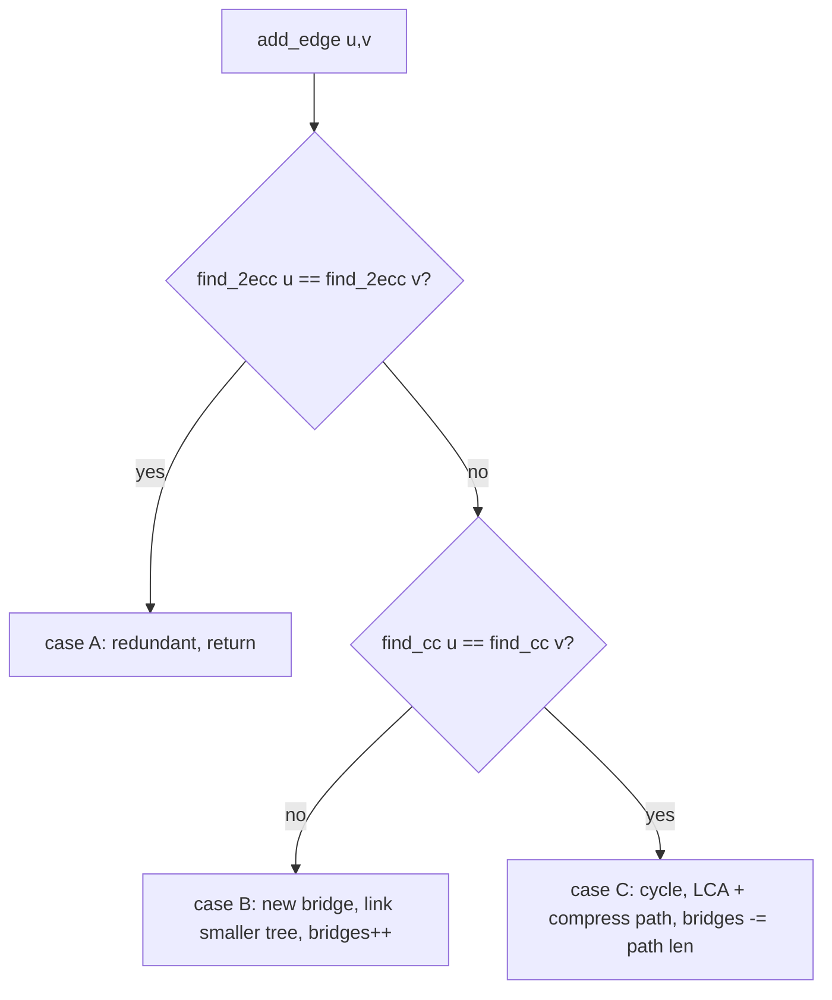

# Online Bridge Finding (Incremental 2-Edge-Connectivity) — Junior Level

> **One-line summary:** Maintain the number of **bridges** in an undirected graph *online*, recomputing nothing from scratch, as edges are **added** one at a time. We keep two disjoint-set structures — one for connected components, one for 2-edge-connected components — plus a "bridge forest" that links the 2-edge-connected components by exactly the current bridges, and we update a running bridge counter in near-constant amortized time per edge.

---

## Table of Contents

1. [Introduction](#introduction)
2. [Prerequisites](#prerequisites)
3. [Glossary](#glossary)
4. [Core Concepts](#core-concepts)
5. [Big-O Summary](#big-o-summary)
6. [Real-World Analogies](#real-world-analogies)
7. [Pros & Cons](#pros--cons)
8. [Step-by-Step Walkthrough](#step-by-step-walkthrough)
9. [Code Examples](#code-examples)
10. [Coding Patterns](#coding-patterns)
11. [Error Handling](#error-handling)
12. [Performance Tips](#performance-tips)
13. [Best Practices](#best-practices)
14. [Edge Cases & Pitfalls](#edge-cases--pitfalls)
15. [Common Mistakes](#common-mistakes)
16. [Cheat Sheet](#cheat-sheet)
17. [Visual Animation](#visual-animation)
18. [Summary](#summary)
19. [Further Reading](#further-reading)

---

## Introduction

A **bridge** (also called a *cut edge*) is an edge whose removal increases the number of connected components of a graph. Equivalently, a bridge is an edge that lies on **no cycle**. If you imagine the graph as a road network, a bridge is a road that, if it washes out, cuts some towns off completely — there is no alternative route around it.

The **static** way to count bridges is one depth-first search using discovery times and "low-link" values — this is the classic Tarjan algorithm covered in the sibling topic **11-articulation-points-bridges**. It runs in `O(V + E)` and is perfect when the graph is fixed and you ask "how many bridges?" exactly once.

But many real systems are not static. A network grows: cables are laid, links come online, peer connections form. After **each** new link you want an updated answer to "how many single points of failure (bridges) does my network still have?" Re-running the `O(V + E)` DFS after every one of `m` additions costs `O(m · (V + E))`. For a network that grows to a million edges, that is hopelessly slow.

The **online incremental** technique answers the same question after *every* edge addition in **near-O(α(n))** amortized time per edge — practically constant. The key insight is that adding an edge can only ever *destroy* bridges, never create extra cycles that we have to rediscover from scratch. So instead of recomputing, we **maintain** a compact summary of the graph that updates locally.

This file teaches the data structure and its update rule at a level you can implement on a whiteboard. We restrict ourselves to **incremental** changes (additions only). Supporting deletions too is the *fully dynamic* problem, which is dramatically harder and is only sketched here for contrast.

---

## Prerequisites

Before reading this file you should be comfortable with:

- **Undirected graphs** — vertices, edges, adjacency, connected components.
- **What a bridge / cut edge is** — see sibling **11-articulation-points-bridges** for the static DFS definition.
- **Disjoint Set Union (DSU / union-find)** — `find` with path compression, `union` by size or rank. This is the engine of the whole technique. (Sibling: disjoint-set union-find.)
- **Trees and forests** — parent pointers, the notion of a root, walking up to an ancestor.
- **Lowest Common Ancestor (LCA)** — at the most basic "walk both nodes up until they meet" level. (Sibling: **13-lca**.)
- **Amortized analysis** — the idea that a cost can be "expensive once, cheap many times," averaging out. (Sibling: **21-small-to-large-merging**.)
- **Big-O including the inverse Ackermann `α(n)`** — which is `≤ 4` for any `n` you will ever see.

Optional but helpful:

- Having implemented Tarjan's bridge-finding DFS once, so you can feel the contrast.

---

## Glossary

| Term | Meaning |
|------|---------|
| **Bridge / cut edge** | An edge that lies on no cycle; removing it disconnects part of the graph. |
| **2-edge-connected** | Two vertices are 2-edge-connected if they stay connected after removing **any single** edge — i.e. there are two edge-disjoint paths between them. |
| **2-edge-connected component (2ECC)** | A maximal set of mutually 2-edge-connected vertices. Inside a 2ECC there are no bridges. |
| **Connectivity DSU (`cc`)** | A disjoint-set structure tracking which vertices are in the same connected component. |
| **2ECC DSU (`twoECC`)** | A *separate* disjoint-set structure tracking which vertices share a 2-edge-connected component. |
| **Bridge forest** | A forest whose nodes are the 2ECCs and whose edges are exactly the current bridges. Each connected component of the graph becomes one tree here. |
| **Rerooting / make-root** | Reversing parent pointers along a path so a chosen node becomes the root of its tree. |
| **Path compression (cycle compression)** | Merging every 2ECC on a tree path into a single 2ECC because a new edge closed a cycle through them. |
| **Small-to-large** | When linking two trees, always attach the **smaller** one under the larger to bound total rerooting work. (Sibling: **21-small-to-large-merging**.) |
| **Incremental** | Edges are only added, never removed. |
| **Fully dynamic** | Both additions and deletions are supported (much harder). |
| **α(n)** | The inverse Ackermann function — effectively a constant (`≤ 4`). |

---

## Core Concepts

### 1. Two separate DSU structures

The single most important idea: you maintain **two** union-find structures over the same vertices, answering two different questions.

```
cc[v]      → which CONNECTED component is v in?           (coarse)
twoECC[v]  → which 2-EDGE-CONNECTED component is v in?    (fine)
```

Every 2ECC sits inside exactly one connected component, so `twoECC` is a **refinement** of `cc`. If two vertices share a 2ECC they always share a `cc`, but not vice-versa: two vertices can be connected yet still have a bridge between them.

A bridge is precisely an edge connecting two **different** 2ECCs that are in the **same** connected component.

### 2. The bridge forest

Collapse every 2ECC down to a single super-node. The only edges left between super-nodes are bridges (every non-bridge edge lived *inside* a 2ECC and disappeared in the collapse). The result is a **forest**: one tree per connected component, and the tree edges are exactly the bridges.

```
Real graph (triangle + a tail):

   0 --- 1
    \   /
     \ /
      2 --- 3 --- 4
      
Bridge forest (collapse triangle {0,1,2} into one node A):

   A --- 3 --- 4         3 bridges?  No: 2 bridges  (A-3 and 3-4)
```

We store the bridge forest with a **parent array** `par[]` indexed by 2ECC representative. The number of bridges equals the number of non-root nodes in the forest — but we don't recount; we keep a running `bridges` counter.

### 3. Adding an edge `(u, v)` — three cases

```
case A: u and v already share a 2ECC
        → the edge is redundant inside a cycle; nothing changes.

case B: u and v are in DIFFERENT connected components
        → the new edge is a BRIDGE.
          Link the smaller bridge-tree under the larger (small-to-large),
          bump the bridge counter by 1, union the cc sets.

case C: u and v are in the SAME component but DIFFERENT 2ECCs
        → the edge closes a CYCLE through the bridge forest.
          Every bridge on the tree path from u's 2ECC to v's 2ECC
          is now on a cycle, so it is NO LONGER a bridge.
          Merge all those 2ECCs into one and SUBTRACT them from the counter.
```

Case C is the heart of the algorithm. Finding "the tree path" means finding the **LCA** of `u`'s 2ECC and `v`'s 2ECC in the bridge forest, then compressing both sides up to it.

### 4. Why additions only destroy bridges

Adding an edge can only add cycles, never remove them. A bridge is an edge on no cycle. So an edge can stop being a bridge (case C) but an existing non-bridge can never *become* a bridge by adding more edges. That monotonicity is exactly why the incremental problem is so much easier than the fully dynamic one — we only ever merge 2ECCs, never split them.

### 5. Small-to-large keeps it fast

In case B we may have to **reroot** one of the two trees so we can hang it under a node of the other. Rerooting a tree of size `k` costs `O(k)`. If we always reroot the **smaller** tree, every vertex is rerooted only `O(log n)` times over the whole life of the structure (each time it is rerooted, its tree at least doubles). That is the small-to-large argument from sibling **21-small-to-large-merging**.

---

## Big-O Summary

| Operation | Time | Space | Notes |
|-----------|------|-------|-------|
| `add_edge` (case A — redundant) | **O(α(n))** | O(1) | Two `find` calls, equal → return. |
| `add_edge` (case B — bridge) | **O(min-tree size)** amortized **O(log n)** | O(1) | Reroot smaller tree, link, union. |
| `add_edge` (case C — cycle) | **O(path length · α(n))** amortized **O(log n)** | O(1) | Compress path to LCA. |
| `bridge_count()` | **O(1)** | O(1) | Read the running counter. |
| `is_bridge(u, v)` | **O(α(n))** | O(1) | Different 2ECC, same cc, adjacent in forest. |
| `num_2ecc()` | **O(1)** | O(1) | Track a second running counter. |
| Build over `m` additions | **O((n + m) · α(n))** amortized | O(n) | Near-linear total. |
| Total space | **O(n)** | — | Two DSU arrays + one parent array. |

Contrast: re-running static Tarjan after each of `m` additions is `O(m · (n + m))`.

---

## Real-World Analogies

| Concept | Analogy |
|---------|---------|
| Bridge | A single ferry that is the only way to reach an island. If it sinks, the island is cut off. |
| 2-edge-connected component | A cluster of islands joined by so many ferries that losing any one still leaves everyone reachable. |
| Bridge forest | A simplified map where each well-connected cluster is drawn as one big dot, and only the lone vulnerable ferries are drawn as lines between dots. |
| Adding a redundant edge (case A) | Building a second bridge between two districts of the *same* city — nice, but the city was already robust there. |
| Adding a connecting edge (case B) | Laying the first cable to a brand-new town: now reachable, but by a single vulnerable link. |
| Closing a cycle (case C) | A new ring road that loops several towns together; every road that used to be a sole lifeline along that loop now has a detour, so none of them are single points of failure any more. |
| Small-to-large rerooting | When merging two filing cabinets, you carry the smaller stack of folders over to the bigger cabinet, never the other way around. |

Where the analogy breaks: in real geography you can also *lose* roads (deletions). Our incremental structure only ever adds them — handling losses is the much harder fully-dynamic problem.

---

## Pros & Cons

| Pros | Cons |
|------|------|
| Near-constant amortized time per edge addition. | Only supports **additions** — no edge deletion. |
| `O(1)` bridge count and 2ECC count at any moment. | Implementation is trickier than one static DFS (two DSUs + a forest). |
| Tiny memory: three integer arrays of size `n`. | Rerooting and LCA logic are easy to get subtly wrong. |
| Never recomputes from scratch; updates are local. | Recursion-free LCA still needs care to stay `O(log n)`. |
| Composes with online connectivity monitoring naturally. | Less famous than Tarjan; fewer ready-made references. |
| Deterministic, no randomization needed. | The two DSUs are easy to mix up (a classic bug). |

**When to use:** any time edges arrive over time and you must report bridges / 2-edge-connectivity after each one — network reliability monitoring, incremental connectivity queries, contest problems that add edges and ask "how many bridges now?"

**When NOT to use:** a fixed graph asked once (use static Tarjan, sibling **11-articulation-points-bridges**); graphs where edges are also **removed** (you need the fully dynamic structure, far beyond this file).

---

## Step-by-Step Walkthrough

Let us add edges one by one to an empty graph on vertices `{0,1,2,3,4,5}` and watch the bridge counter. This is exactly the sequence our code prints.

```
start: 6 isolated vertices, bridges = 0
       forest: 0  1  2  3  4  5   (six singleton trees)

add (0,1): different components → BRIDGE.
           link 1 under 0.  bridges = 1
           forest: 0—1   2  3  4  5

add (1,2): different components → BRIDGE.
           link 2 under {0,1} tree.  bridges = 2
           forest: 0—1—2   3  4  5

add (2,0): SAME component, different 2ECC → CYCLE.
           path in forest from 2ECC(2) up to 2ECC(0) covers bridges (0-1) and (1-2).
           both stop being bridges; merge {0,1,2} into one 2ECC.
           bridges = 0
           forest: [A={0,1,2}]   3  4  5

add (2,3): different components → BRIDGE.
           link 3 under A.  bridges = 1
           forest: [A]—3   4  5

add (3,4): different components → BRIDGE.
           bridges = 2
           forest: [A]—3—4   5

add (4,5): different components → BRIDGE.
           bridges = 3
           forest: [A]—3—4—5

add (5,3): SAME component, different 2ECC → CYCLE.
           path covers bridges (3-4) and (4-5); merge {3,4,5} into one 2ECC.
           bridges = 1                       (only A—{3,4,5} remains)
           forest: [A]—[B={3,4,5}]
```

Final answer: **1 bridge** — the edge between the triangle `{0,1,2}` and the triangle `{3,4,5}`. Every intermediate count matched a static recomputation; that equality is the correctness check we run in the code section.

---

## Code Examples

### Example: Incremental bridge counting (two DSU + bridge forest)

The class exposes `add_edge(u, v)` and a public `bridges` counter. `cc` is the connectivity DSU, `twoECC` is the 2-edge-connected-component DSU, and `par` is the bridge forest.

#### Go

```go
package main

import "fmt"

type OnlineBridges struct {
	cc, twoECC, par, ccSize []int
	bridges                 int
}

func NewOnlineBridges(n int) *OnlineBridges {
	ob := &OnlineBridges{
		cc:     make([]int, n),
		twoECC: make([]int, n),
		par:    make([]int, n),
		ccSize: make([]int, n),
	}
	for i := 0; i < n; i++ {
		ob.cc[i], ob.twoECC[i], ob.par[i], ob.ccSize[i] = i, i, -1, 1
	}
	return ob
}

func (ob *OnlineBridges) findCC(x int) int {
	for ob.cc[x] != x {
		ob.cc[x] = ob.cc[ob.cc[x]] // path halving
		x = ob.cc[x]
	}
	return x
}

func (ob *OnlineBridges) find2ECC(x int) int {
	for ob.twoECC[x] != x {
		ob.twoECC[x] = ob.twoECC[ob.twoECC[x]]
		x = ob.twoECC[x]
	}
	return x
}

// parent of v in the bridge forest, collapsed to a 2ECC rep.
func (ob *OnlineBridges) parentOf(v int) int {
	if ob.par[v] == -1 {
		return -1
	}
	return ob.find2ECC(ob.par[v])
}

// reverse parent pointers so u's 2ECC becomes the root of its tree.
func (ob *OnlineBridges) makeRoot(u int) {
	u = ob.find2ECC(u)
	child := -1
	for u != -1 {
		p := ob.parentOf(u)
		ob.par[u] = child
		child = u
		u = p
	}
}

// merge every 2ECC on the path between u and v (same tree) into their LCA.
func (ob *OnlineBridges) mergePath(u, v int) {
	a, b := ob.find2ECC(u), ob.find2ECC(v)
	anc := map[int]bool{}
	for t := a; t != -1; t = ob.parentOf(t) {
		anc[t] = true
	}
	lca := -1
	for t := b; t != -1; t = ob.parentOf(t) {
		if anc[t] {
			lca = t
			break
		}
	}
	for _, start := range []int{a, b} {
		for x := start; x != lca; {
			p := ob.parentOf(x)
			ob.bridges--                         // this bridge becomes non-bridge
			ob.twoECC[ob.find2ECC(x)] = lca      // fold x's 2ECC into the LCA's
			x = p
		}
	}
}

func (ob *OnlineBridges) AddEdge(u, v int) {
	if ob.find2ECC(u) == ob.find2ECC(v) {
		return // case A: redundant inside a 2ECC
	}
	cu, cv := ob.findCC(u), ob.findCC(v)
	if cu != cv {
		// case B: new bridge. attach smaller tree under larger.
		if ob.ccSize[cu] < ob.ccSize[cv] {
			u, v = v, u
			cu, cv = cv, cu
		}
		ob.makeRoot(v)
		ob.par[ob.find2ECC(v)] = ob.find2ECC(u)
		ob.bridges++
		ob.cc[cv] = cu
		ob.ccSize[cu] += ob.ccSize[cv]
	} else {
		ob.mergePath(u, v) // case C: cycle closes, compress
	}
}

func main() {
	ob := NewOnlineBridges(6)
	edges := [][2]int{{0, 1}, {1, 2}, {2, 0}, {2, 3}, {3, 4}, {4, 5}, {5, 3}}
	for _, e := range edges {
		ob.AddEdge(e[0], e[1])
		fmt.Printf("add (%d,%d) -> bridges=%d\n", e[0], e[1], ob.bridges)
	}
	// 1 2 0 1 2 3 1
}
```

#### Java

```java
import java.util.*;

public class OnlineBridges {
    int[] cc, twoECC, par, ccSize;
    int bridges = 0;

    public OnlineBridges(int n) {
        cc = new int[n]; twoECC = new int[n]; par = new int[n]; ccSize = new int[n];
        for (int i = 0; i < n; i++) { cc[i] = i; twoECC[i] = i; par[i] = -1; ccSize[i] = 1; }
    }

    int findCC(int x) {
        while (cc[x] != x) { cc[x] = cc[cc[x]]; x = cc[x]; }
        return x;
    }

    int find2ECC(int x) {
        while (twoECC[x] != x) { twoECC[x] = twoECC[twoECC[x]]; x = twoECC[x]; }
        return x;
    }

    int parentOf(int v) { return par[v] == -1 ? -1 : find2ECC(par[v]); }

    void makeRoot(int u) {
        u = find2ECC(u);
        int child = -1;
        while (u != -1) { int p = parentOf(u); par[u] = child; child = u; u = p; }
    }

    void mergePath(int u, int v) {
        int a = find2ECC(u), b = find2ECC(v);
        Set<Integer> anc = new HashSet<>();
        for (int t = a; t != -1; t = parentOf(t)) anc.add(t);
        int lca = -1;
        for (int t = b; t != -1; t = parentOf(t)) { if (anc.contains(t)) { lca = t; break; } }
        for (int start : new int[]{a, b}) {
            for (int x = start; x != lca; ) {
                int p = parentOf(x);
                bridges--;
                twoECC[find2ECC(x)] = lca;
                x = p;
            }
        }
    }

    public void addEdge(int u, int v) {
        if (find2ECC(u) == find2ECC(v)) return;            // case A
        int cu = findCC(u), cv = findCC(v);
        if (cu != cv) {                                    // case B
            if (ccSize[cu] < ccSize[cv]) { int t = u; u = v; v = t; t = cu; cu = cv; cv = t; }
            makeRoot(v);
            par[find2ECC(v)] = find2ECC(u);
            bridges++;
            cc[cv] = cu;
            ccSize[cu] += ccSize[cv];
        } else {                                           // case C
            mergePath(u, v);
        }
    }

    public static void main(String[] args) {
        OnlineBridges ob = new OnlineBridges(6);
        int[][] edges = {{0,1},{1,2},{2,0},{2,3},{3,4},{4,5},{5,3}};
        for (int[] e : edges) {
            ob.addEdge(e[0], e[1]);
            System.out.printf("add (%d,%d) -> bridges=%d%n", e[0], e[1], ob.bridges);
        }
    }
}
```

#### Python

```python
class OnlineBridges:
    def __init__(self, n):
        self.cc = list(range(n))       # connectivity DSU
        self.twoecc = list(range(n))   # 2-edge-connected-component DSU
        self.par = [-1] * n            # bridge forest parent pointers
        self.cc_size = [1] * n
        self.bridges = 0

    def find_cc(self, x):
        while self.cc[x] != x:
            self.cc[x] = self.cc[self.cc[x]]
            x = self.cc[x]
        return x

    def find_2ecc(self, x):
        while self.twoecc[x] != x:
            self.twoecc[x] = self.twoecc[self.twoecc[x]]
            x = self.twoecc[x]
        return x

    def parent_of(self, v):
        return -1 if self.par[v] == -1 else self.find_2ecc(self.par[v])

    def make_root(self, u):
        u = self.find_2ecc(u)
        child = -1
        while u != -1:
            p = self.parent_of(u)
            self.par[u] = child
            child = u
            u = p

    def merge_path(self, u, v):
        a, b = self.find_2ecc(u), self.find_2ecc(v)
        anc = set()
        t = a
        while t != -1:
            anc.add(t)
            t = self.parent_of(t)
        lca = -1
        t = b
        while t != -1:
            if t in anc:
                lca = t
                break
            t = self.parent_of(t)
        for start in (a, b):
            x = start
            while x != lca:
                p = self.parent_of(x)
                self.bridges -= 1
                self.twoecc[self.find_2ecc(x)] = lca
                x = p

    def add_edge(self, u, v):
        if self.find_2ecc(u) == self.find_2ecc(v):
            return  # case A: redundant inside a 2ECC
        cu, cv = self.find_cc(u), self.find_cc(v)
        if cu != cv:  # case B: new bridge
            if self.cc_size[cu] < self.cc_size[cv]:
                u, v = v, u
                cu, cv = cv, cu
            self.make_root(v)
            self.par[self.find_2ecc(v)] = self.find_2ecc(u)
            self.bridges += 1
            self.cc[cv] = cu
            self.cc_size[cu] += self.cc_size[cv]
        else:  # case C: cycle closes
            self.merge_path(u, v)


if __name__ == "__main__":
    ob = OnlineBridges(6)
    for u, v in [(0, 1), (1, 2), (2, 0), (2, 3), (3, 4), (4, 5), (5, 3)]:
        ob.add_edge(u, v)
        print(f"add ({u},{v}) -> bridges={ob.bridges}")
```

**What it does:** adds seven edges (two triangles joined by one bridge) and prints the bridge count after each.
**Output (all three):** `1 2 0 1 2 3 1`.
**Run:** `go run main.go` | `javac OnlineBridges.java && java OnlineBridges` | `python online_bridges.py`

---

## Coding Patterns

### Pattern 1: Two DSUs, never one

**Intent:** keep connectivity and 2-edge-connectivity strictly separate. The single most common beginner mistake is to use one union-find for both. Always declare `cc` and `twoECC` and ask each the right question:

```python
# "Are u and v already 2-edge-connected (in the same 2ECC)?"
same_2ecc = ob.find_2ecc(u) == ob.find_2ecc(v)
# "Are u and v merely connected (in the same component)?"
same_cc = ob.find_cc(u) == ob.find_cc(v)
```

### Pattern 2: Collapse the forest parent through the 2ECC DSU

**Intent:** when 2ECCs merge, old `par[]` entries point at vertices that are no longer representatives. Always read a parent *through* `find_2ecc`:

```python
def parent_of(self, v):
    return -1 if self.par[v] == -1 else self.find_2ecc(self.par[v])
```

Never read `self.par[v]` raw when you mean "the forest parent's current 2ECC."

### Pattern 3: Walk-up LCA in the bridge forest

**Intent:** find the meeting point of two nodes by collecting one node's ancestors, then walking the other up until it hits a marked ancestor. Simple and correct for the junior level.

```python
anc = set()
t = a
while t != -1:
    anc.add(t); t = parent_of(t)
t = b
while t not in anc:
    t = parent_of(t)
lca = t
```



---

## Error Handling

| Error | Cause | Fix |
|-------|-------|-----|
| Bridge count drifts wrong over time | Used one DSU for both connectivity and 2ECC. | Keep `cc` and `twoECC` strictly separate. |
| `make_root` loops forever | Read `par[v]` raw instead of through `find_2ecc`, so a stale pointer cycles. | Always go through `parent_of`. |
| Negative bridge count | Subtracted in case C without confirming the two endpoints are in different 2ECCs. | Guard case A (`find_2ecc(u) == find_2ecc(v)`) *before* anything else. |
| Wrong component sizes | Updated `ccSize` on a non-root index. | Only index `ccSize` by the `find_cc` root. |
| Index out of range | Edge endpoint `≥ n`. | Validate `0 <= u,v < n` on entry, or size `n` to the max vertex id + 1. |

---

## Performance Tips

- **Path-halving** in both `find` routines (`x = arr[arr[x]]`) keeps lookups near `O(α(n))` without recursion.
- **Reroot the smaller tree** in case B — track `ccSize` and swap `u,v` so `u` is in the larger component. This is the whole basis of the amortized bound.
- **Avoid rebuilding the LCA structure** — the walk-up LCA shown here is `O(path length)`, which is exactly the work you must do to compress anyway, so it adds no asymptotic cost.
- **Use arrays, not maps**, for `cc`, `twoECC`, `par`, `ccSize` when vertices are `0..n-1`. Maps are 5–10× slower.
- **Batch reads of the counter** — `bridges` is already `O(1)`, so report it as often as you like.

---

## Best Practices

- Write the **static Tarjan** baseline (sibling **11-articulation-points-bridges**) and test the online structure against it on random edge sequences — exactly the verification we ran.
- Always confirm `twoECC` is a refinement of `cc`: any two vertices in the same 2ECC must share a `cc` root.
- Keep `add_edge` total — the three cases (A redundant, B bridge, C cycle) must be exhaustive and mutually exclusive.
- Treat self-loops (`u == v`) and duplicate edges as case A (no change) — they never create a bridge.
- Document which array is which at the top of the class; mixing `cc` and `twoECC` is the bug you will hit.

---

## Edge Cases & Pitfalls

- **Self-loop `(v, v)`** — `find_2ecc(v) == find_2ecc(v)` so it falls into case A and changes nothing. Correct.
- **Duplicate edge** between two vertices already 2-edge-connected — case A, no change.
- **Duplicate edge** between two vertices that share a `cc` but different 2ECC (a parallel bridge) — case C: the two parallel edges form a cycle, so the bridge between them vanishes. The structure handles it automatically.
- **First edge of a fresh component** — case B, becomes a bridge, counter goes to 1.
- **Closing a triangle** (`u-v`, `v-w`, `w-u`) — the third edge is case C and drops the bridge count by 2 at once.
- **Isolated vertices** — never touched until an edge references them; they sit as singleton trees with `par = -1`.

---

## Common Mistakes

1. **Using one DSU for everything** — connectivity and 2-edge-connectivity are different equivalence relations. You need two.
2. **Reading `par[v]` raw** after 2ECCs merged — the parent must be collapsed through `find_2ecc`, or you follow dead pointers.
3. **Rerooting the larger tree** — costs `O(n)` per op and destroys the amortized bound; always reroot the smaller.
4. **Forgetting to guard case A first** — if you skip the "same 2ECC?" check you can double-count or go negative.
5. **Decrementing the wrong amount in case C** — you subtract **one per bridge on the path**, not one total; do it inside the compression loop.
6. **Updating `ccSize` on a non-root** — only the `find_cc` root's size is meaningful.
7. **Confusing this with the fully dynamic problem** — this structure cannot handle edge deletions; do not try.

---

## Cheat Sheet

| Symbol | Meaning |
|--------|---------|
| `cc[]` | connectivity DSU |
| `twoECC[]` | 2-edge-connected-component DSU |
| `par[]` | bridge-forest parent pointers (indexed by 2ECC rep) |
| `ccSize[]` | size of a connected component (by `cc` root) |
| `bridges` | running bridge counter |

Decision rule for `add_edge(u, v)`:

```
if find2ECC(u) == find2ECC(v):      return            # A: redundant
elif findCC(u)  != findCC(v):       new bridge        # B: bridges += 1, link smaller
else:                               cycle closes       # C: bridges -= path_len, merge
```

Complexity: amortized **O(α(n))**–**O(log n)** per addition, **O(1)** bridge count, **O(n)** space.

---

## Visual Animation

> See [`animation.html`](./animation.html) for an interactive visual animation of online bridge finding.
>
> The animation demonstrates:
> - Edges added one by one with a **live bridge counter**.
> - The **bridge forest** drawn beside the real graph.
> - New bridges appearing (case B) highlighted in one color.
> - A cycle-closing edge (case C) compressing a path of bridges into a single 2ECC.
> - Step / Run / Reset controls so you can watch each case unfold.

---

## Summary

Online incremental 2-edge-connectivity lets you report the number of bridges after **every** edge addition in near-constant amortized time, instead of re-running an `O(V+E)` DFS each time. The machinery is three integer arrays: a connectivity DSU, a separate 2ECC DSU, and a bridge-forest parent array. Each addition falls into one of three cases — redundant (do nothing), a new bridge (link the smaller tree, `bridges += 1`), or a cycle closing (compress the forest path to the LCA, subtract the bridges it covered). Master the three-case dispatch and the "two DSUs, never one" discipline, and you have the whole structure.

---

## Further Reading

- Sibling **11-articulation-points-bridges** — the static `O(V+E)` Tarjan bridge DFS this technique replaces for the online setting.
- Sibling disjoint-set union-find — the union-find engine (`find` with path compression, union by size).
- Sibling **13-lca** — lowest common ancestor, used to locate the path to compress in case C.
- Sibling **21-small-to-large-merging** — the amortized argument behind rerooting the smaller tree.
- Sibling **23-edge-vertex-connectivity** — the broader theory of edge and vertex connectivity.
- cp-algorithms — "Bridge finding online" — the canonical write-up of the two-DSU technique.
