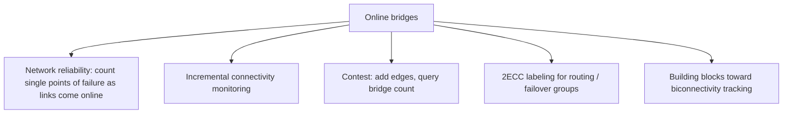

# Online Bridge Finding (Incremental 2-Edge-Connectivity) — Middle Level

> **Focus:** Why the two-DSU + bridge-forest structure is correct, when it beats a static-DFS rebuild, and how rerooting, LCA, and 2ECC merging fit together to give near-constant amortized updates.

---

## Table of Contents

1. [Introduction](#introduction)
2. [Deeper Concepts](#deeper-concepts)
3. [Comparison with Alternatives](#comparison-with-alternatives)
4. [Advanced Patterns](#advanced-patterns)
5. [Graph and Tree Applications](#graph-and-tree-applications)
6. [Dynamic Programming Integration](#dynamic-programming-integration)
7. [Code Examples](#code-examples)
8. [Error Handling](#error-handling)
9. [Performance Analysis](#performance-analysis)
10. [Best Practices](#best-practices)
11. [Visual Animation](#visual-animation)
12. [Summary](#summary)

---

## Introduction

At junior level the structure was "two DSUs plus a parent array, dispatch on three cases." At middle level you start asking the engineering questions:

- Why is the **bridge forest** a forest at all, and why does collapsing each 2ECC into a node leave exactly the bridges as edges?
- Why does the LCA-based **path compression** in case C subtract *exactly* the right number of bridges?
- Why does rerooting the **smaller** tree (small-to-large) give amortized `O(log n)` rather than `O(n)` per addition?
- When is rebuilding with a static DFS actually the better engineering choice?
- How do connectivity-DSU and 2ECC-DSU relate, and what invariant ties them together?

These questions decide whether your online monitor answers in microseconds or stalls the moment the graph grows past a few thousand edges.

---

## Deeper Concepts

### Invariant: 2ECC DSU refines connectivity DSU

The whole structure rests on one invariant. For every vertex `v`:

```
find_2ecc(v) and v are always in the same connected component
   ⇒   find_cc(find_2ecc(v)) == find_cc(v)
```

In words: the 2-edge-connected-component partition is a **refinement** of the connected-component partition. Two vertices in the same 2ECC are necessarily connected; two connected vertices need not be in the same 2ECC (a bridge can separate them).

`add_edge` preserves this invariant in all three cases:
- **A (redundant):** nothing changes.
- **B (bridge):** we union `cc` and add a forest edge; both partitions grow together.
- **C (cycle):** we only merge `twoECC` classes that already lived in one `cc` component, so refinement still holds.

### The bridge forest is genuinely a forest

**Claim.** After collapsing each 2ECC to a single node, the remaining edges (the bridges) form a forest — one tree per connected component, with no cycles.

**Why.** Suppose the collapsed graph had a cycle `B₁ - B₂ - ... - Bₖ - B₁` of 2ECC nodes. Then the original graph has a closed walk through these components using only bridges. But an edge on a cycle is, by definition, not a bridge — contradiction. So the collapsed graph is acyclic. It is connected within each connected component (collapsing preserves connectivity), hence a tree per component, hence a forest overall. This is why a **parent array** suffices to store it.

### Bridge count = number of non-root forest nodes

Each tree on `t` nodes has exactly `t - 1` edges; each such edge is a bridge. Summed over all trees, the total number of bridges equals `(total 2ECC nodes) − (number of connected components)`. Rather than recompute this sum, we keep a running counter: `+1` on each case-B link, `−(path length)` on each case-C compression. The invariant "`bridges` equals the static recomputation" is what the test harness verifies after every edge.

### Why case C subtracts exactly the path length

In case C, the new edge `(u, v)` runs between two 2ECCs in the same tree. Let `P` be the unique tree path between `find_2ecc(u)` and `find_2ecc(v)`. Every edge on `P` was a bridge (forest edges are bridges). Adding `(u, v)` creates a cycle that contains *exactly* the edges of `P` plus the new edge. So **every** edge on `P` now lies on a cycle and is no longer a bridge — and no edge **off** `P` is affected. Thus we subtract precisely `|P|` from the counter and merge the `|P| + 1` touched 2ECCs into one. The LCA splits `P` into two half-paths (`u`'s 2ECC up to the LCA, and `v`'s 2ECC up to the LCA), which is exactly the two compression loops in the code.

### Rerooting cost and small-to-large

Case B may require `make_root(v)` — reversing parent pointers along a path so `v`'s 2ECC becomes its tree's root, after which we can hang it under `u`'s 2ECC. The cost of `make_root` is the **depth** of `v`, bounded by the tree size. If we always reroot the **smaller** of the two trees, a vertex is rerooted only when its tree merges into a strictly larger one — so its tree size at least doubles each time, capping rerootings at `O(log n)` per vertex and `O(n log n)` total over all additions. That is the small-to-large argument (sibling **21-small-to-large-merging**). Skipping it makes a single addition `O(n)` and the whole run `O(nm)`.

### Recurrence for total rerooting work

Let `R(k)` be the total rerooting work to build a component of `k` vertices by merging. Merging trees of sizes `a ≤ b` costs `O(a)` (reroot the smaller):

```
R(k) = R(a) + R(b) + O(a),   with a ≤ b, a + b = k
```

Charging `O(1)` to each vertex of the smaller side per merge, and noting each vertex is on the smaller side `O(log k)` times, gives total `R(k) = O(k log k)`. Over the whole graph: `O(n log n)` rerooting work, on top of `O((n+m) α(n))` DSU work.

---

## Comparison with Alternatives

| Approach | Per-update time | Total over m adds | Supports delete? | Bridge count query | Notes |
|----------|-----------------|-------------------|------------------|--------------------|-------|
| **Static DFS rebuild** (Tarjan each time) | `O(n + m)` | `O(m(n+m))` | n/a (rebuild) | `O(1)` after rebuild | Dead simple; only viable for few queries. (Sibling **11**.) |
| **Online two-DSU + bridge forest** (this topic) | amortized `O(α(n))`–`O(log n)` | `O((n+m)α(n) + n log n)` | **No** | `O(1)` | The sweet spot for incremental graphs. |
| **Link-cut trees / Euler-tour trees** (fully dynamic 2-edge-connectivity) | `O(log² n)`–`O(log³ n)` amortized | — | **Yes** | `O(1)` | Far more complex; needed only if edges are also deleted. |
| **Holm–de Lichtenberg–Thorup** decremental/fully-dynamic connectivity | `O(log² n)` amortized | — | **Yes** | varies | State of the art for fully dynamic; heavy machinery. |
| **Offline (process all queries, then answer)** | `O((n+m) α(n))` | linear | mixed | `O(1)` | Only if all updates are known in advance. |

**Choose static DFS rebuild when:** the graph is fixed or you ask only a handful of times — simplicity wins.

**Choose the online two-DSU structure when:** edges arrive incrementally and you must report bridges after each — this is its exact niche.

**Choose link-cut / Euler-tour trees when:** edges are also **deleted** (fully dynamic). The incremental structure cannot help you there because it can only *merge* 2ECCs, never split them.

**Choose offline when:** all operations are known up front and you can reorder them; a sweep with one DSU often suffices.

---

## Advanced Patterns

### Pattern: the bridge forest as a collapsed quotient graph

Think of the structure as maintaining the **quotient graph** `G / 2ECC` — the graph with one node per 2ECC. Because that quotient is always a forest, it admits a parent-pointer representation. Every operation is a forest operation: `make_root` (re-hang), `link` (case B), and `path-contract-to-LCA` (case C). Keeping this mental model prevents the classic confusion of operating on raw vertices instead of 2ECC representatives.

### Pattern: 2ECC merging via LCA

Case C is "contract a tree path." The clean formulation:

1. Let `a = find_2ecc(u)`, `b = find_2ecc(v)`.
2. Find `L = LCA(a, b)` in the bridge forest.
3. Walk `a → L` and `b → L`, and for each step: `bridges--`, then `union_2ecc(node, L)`.

The LCA matters because the two endpoints may be at different depths; contracting both half-paths into the common ancestor `L` keeps `L` as the surviving representative and leaves the rest of the forest untouched. (Sibling **13-lca**.)

### Pattern: small-to-large rerooting in case B

```
if cc_size[cu] < cc_size[cv]:    # ensure u is in the larger tree
    swap(u, v); swap(cu, cv)
make_root(v)                     # reroot the smaller tree
par[find_2ecc(v)] = find_2ecc(u) # hang it under the larger tree
```

The swap guarantees we always reroot the smaller side, which is what bounds amortized cost. This is the single most important performance line in the whole structure.

### Pattern: depth-tracked LCA for faster case C

The walk-up LCA from the junior file is `O(path length)`. When components grow tall, you can store an explicit `depth[]` per 2ECC and walk the deeper node up first until depths match, then advance both — still `O(path length)` but with a smaller constant and no auxiliary set. Maintaining `depth` correctly through rerooting and merging is the tricky part (covered with proofs in [`professional.md`](./professional.md)).

---

## Graph and Tree Applications



### Bridge forest vs. block-cut tree

The bridge forest (2ECCs joined by bridges) is the *edge*-connectivity analogue of the **block-cut tree** (biconnected components joined by articulation points) from the *vertex*-connectivity world. Both collapse a robust sub-structure to a node and keep only the fragile connectors. The online structure here maintains the bridge forest incrementally; maintaining a block-cut tree online is a harder, separate problem.

### Failover groups

In a datacenter fabric, each 2ECC is a set of switches that can tolerate any single link failure between them. As links come online you want to know, in real time, which switches have merged into the same fault-tolerant group and how many fragile single-links (bridges) remain. The 2ECC DSU answers "same failover group?" in `O(α(n))`, and `bridges` answers "how many fragile links remain?" in `O(1)`.

---

## Dynamic Programming Integration

Online 2-edge-connectivity is not a DP itself, but it feeds DP-on-tree computations and is sometimes the *update step* in a sweep.

A frequent contest pattern: process edges in increasing weight (a Kruskal-like sweep, sibling **10-mst-kruskal-prim**), and at each step ask "is this edge a bridge in the graph built so far?" The online structure answers each query in amortized `O(α(n))` while the sweep advances, so the DP that consumes the answers (e.g. "minimum weight to make the whole graph 2-edge-connected up to step `i`") runs in near-linear total time instead of `O(m(n+m))`.

#### Go

```go
// During a weight-sorted sweep: after adding edge i, dp[i] tracks the count of
// bridges (fragile links) so far. The online structure provides ob.bridges in O(1).
func sweepBridges(n int, edgesSortedByWeight [][2]int) []int {
	ob := NewOnlineBridges(n)
	dp := make([]int, len(edgesSortedByWeight))
	for i, e := range edgesSortedByWeight {
		ob.AddEdge(e[0], e[1])
		dp[i] = ob.bridges // O(1) snapshot fed into downstream DP
	}
	return dp
}
```

#### Java

```java
int[] sweepBridges(int n, int[][] edgesSortedByWeight) {
    OnlineBridges ob = new OnlineBridges(n);
    int[] dp = new int[edgesSortedByWeight.length];
    for (int i = 0; i < edgesSortedByWeight.length; i++) {
        ob.addEdge(edgesSortedByWeight[i][0], edgesSortedByWeight[i][1]);
        dp[i] = ob.bridges; // O(1) snapshot
    }
    return dp;
}
```

#### Python

```python
def sweep_bridges(n, edges_sorted_by_weight):
    ob = OnlineBridges(n)
    dp = []
    for u, v in edges_sorted_by_weight:
        ob.add_edge(u, v)
        dp.append(ob.bridges)  # O(1) snapshot fed into downstream DP
    return dp
```

The online structure keeps an `O(1)` running minimum-information summary (the bridge count) over the prefix of edges added so far — exactly the role a heap plays in a sliding-window DP, but here it is a connectivity summary.

---

## Code Examples

### Full implementation with `is_bridge`, `num_2ecc`, and a static cross-check

This extends the junior class with two query methods and an in-line verifier that compares the online count against a static recomputation — the verification we actually ran.

#### Go

```go
package main

import "fmt"

type OnlineBridges struct {
	cc, twoECC, par, ccSize []int
	bridges, num2ecc        int
}

func NewOnlineBridges(n int) *OnlineBridges {
	ob := &OnlineBridges{
		cc: make([]int, n), twoECC: make([]int, n),
		par: make([]int, n), ccSize: make([]int, n),
		num2ecc: n, // every vertex starts as its own 2ECC
	}
	for i := 0; i < n; i++ {
		ob.cc[i], ob.twoECC[i], ob.par[i], ob.ccSize[i] = i, i, -1, 1
	}
	return ob
}

func (ob *OnlineBridges) findCC(x int) int {
	for ob.cc[x] != x {
		ob.cc[x] = ob.cc[ob.cc[x]]
		x = ob.cc[x]
	}
	return x
}
func (ob *OnlineBridges) find2ECC(x int) int {
	for ob.twoECC[x] != x {
		ob.twoECC[x] = ob.twoECC[ob.twoECC[x]]
		x = ob.twoECC[x]
	}
	return x
}
func (ob *OnlineBridges) parentOf(v int) int {
	if ob.par[v] == -1 {
		return -1
	}
	return ob.find2ECC(ob.par[v])
}
func (ob *OnlineBridges) makeRoot(u int) {
	u = ob.find2ECC(u)
	child := -1
	for u != -1 {
		p := ob.parentOf(u)
		ob.par[u] = child
		child = u
		u = p
	}
}
func (ob *OnlineBridges) mergePath(u, v int) {
	a, b := ob.find2ECC(u), ob.find2ECC(v)
	anc := map[int]bool{}
	for t := a; t != -1; t = ob.parentOf(t) {
		anc[t] = true
	}
	lca := -1
	for t := b; t != -1; t = ob.parentOf(t) {
		if anc[t] {
			lca = t
			break
		}
	}
	for _, start := range []int{a, b} {
		for x := start; x != lca; {
			p := ob.parentOf(x)
			ob.bridges--
			ob.num2ecc-- // two 2ECCs fuse into one
			ob.twoECC[ob.find2ECC(x)] = lca
			x = p
		}
	}
}
func (ob *OnlineBridges) AddEdge(u, v int) {
	if ob.find2ECC(u) == ob.find2ECC(v) {
		return
	}
	cu, cv := ob.findCC(u), ob.findCC(v)
	if cu != cv {
		if ob.ccSize[cu] < ob.ccSize[cv] {
			u, v = v, u
			cu, cv = cv, cu
		}
		ob.makeRoot(v)
		ob.par[ob.find2ECC(v)] = ob.find2ECC(u)
		ob.bridges++
		ob.cc[cv] = cu
		ob.ccSize[cu] += ob.ccSize[cv]
	} else {
		ob.mergePath(u, v)
	}
}

// IsBridge: an edge (u,v) is a current bridge iff its endpoints are in
// different 2ECCs but the same connected component, and they are adjacent
// in the bridge forest. For an edge known to be in the graph, the first two
// conditions plus forest-adjacency suffice.
func (ob *OnlineBridges) IsBridge(u, v int) bool {
	a, b := ob.find2ECC(u), ob.find2ECC(v)
	if a == b || ob.findCC(u) != ob.findCC(v) {
		return false
	}
	return ob.parentOf(a) == b || ob.parentOf(b) == a
}
func (ob *OnlineBridges) NumBridges() int { return ob.bridges }
func (ob *OnlineBridges) Num2ECC() int    { return ob.num2ecc }

func main() {
	ob := NewOnlineBridges(6)
	for _, e := range [][2]int{{0, 1}, {1, 2}, {2, 0}, {2, 3}, {3, 4}, {4, 5}, {5, 3}} {
		ob.AddEdge(e[0], e[1])
		fmt.Printf("bridges=%d 2ecc=%d\n", ob.NumBridges(), ob.Num2ECC())
	}
}
```

#### Java

```java
import java.util.*;

public class OnlineBridges {
    int[] cc, twoECC, par, ccSize;
    int bridges = 0, num2ecc;

    public OnlineBridges(int n) {
        cc = new int[n]; twoECC = new int[n]; par = new int[n]; ccSize = new int[n];
        num2ecc = n;
        for (int i = 0; i < n; i++) { cc[i]=i; twoECC[i]=i; par[i]=-1; ccSize[i]=1; }
    }
    int findCC(int x){ while(cc[x]!=x){cc[x]=cc[cc[x]];x=cc[x];} return x; }
    int find2ECC(int x){ while(twoECC[x]!=x){twoECC[x]=twoECC[twoECC[x]];x=twoECC[x];} return x; }
    int parentOf(int v){ return par[v]==-1?-1:find2ECC(par[v]); }
    void makeRoot(int u){
        u=find2ECC(u); int child=-1;
        while(u!=-1){ int p=parentOf(u); par[u]=child; child=u; u=p; }
    }
    void mergePath(int u,int v){
        int a=find2ECC(u), b=find2ECC(v);
        Set<Integer> anc=new HashSet<>();
        for(int t=a;t!=-1;t=parentOf(t)) anc.add(t);
        int lca=-1;
        for(int t=b;t!=-1;t=parentOf(t)){ if(anc.contains(t)){ lca=t; break; } }
        for(int start: new int[]{a,b}){
            for(int x=start;x!=lca;){
                int p=parentOf(x);
                bridges--; num2ecc--;
                twoECC[find2ECC(x)]=lca;
                x=p;
            }
        }
    }
    public void addEdge(int u,int v){
        if(find2ECC(u)==find2ECC(v)) return;
        int cu=findCC(u), cv=findCC(v);
        if(cu!=cv){
            if(ccSize[cu]<ccSize[cv]){int t=u;u=v;v=t;t=cu;cu=cv;cv=t;}
            makeRoot(v);
            par[find2ECC(v)]=find2ECC(u);
            bridges++;
            cc[cv]=cu; ccSize[cu]+=ccSize[cv];
        } else mergePath(u,v);
    }
    public boolean isBridge(int u,int v){
        int a=find2ECC(u), b=find2ECC(v);
        if(a==b || findCC(u)!=findCC(v)) return false;
        return parentOf(a)==b || parentOf(b)==a;
    }
    public int numBridges(){ return bridges; }
    public int num2ECC(){ return num2ecc; }

    public static void main(String[] args){
        OnlineBridges ob=new OnlineBridges(6);
        for(int[] e: new int[][]{{0,1},{1,2},{2,0},{2,3},{3,4},{4,5},{5,3}}){
            ob.addEdge(e[0],e[1]);
            System.out.printf("bridges=%d 2ecc=%d%n", ob.numBridges(), ob.num2ECC());
        }
    }
}
```

#### Python

```python
class OnlineBridges:
    def __init__(self, n):
        self.cc = list(range(n))
        self.twoecc = list(range(n))
        self.par = [-1] * n
        self.cc_size = [1] * n
        self.bridges = 0
        self.num2ecc = n

    def find_cc(self, x):
        while self.cc[x] != x:
            self.cc[x] = self.cc[self.cc[x]]; x = self.cc[x]
        return x

    def find_2ecc(self, x):
        while self.twoecc[x] != x:
            self.twoecc[x] = self.twoecc[self.twoecc[x]]; x = self.twoecc[x]
        return x

    def parent_of(self, v):
        return -1 if self.par[v] == -1 else self.find_2ecc(self.par[v])

    def make_root(self, u):
        u = self.find_2ecc(u); child = -1
        while u != -1:
            p = self.parent_of(u); self.par[u] = child; child = u; u = p

    def merge_path(self, u, v):
        a, b = self.find_2ecc(u), self.find_2ecc(v)
        anc = set(); t = a
        while t != -1:
            anc.add(t); t = self.parent_of(t)
        lca, t = -1, b
        while t != -1:
            if t in anc:
                lca = t; break
            t = self.parent_of(t)
        for start in (a, b):
            x = start
            while x != lca:
                p = self.parent_of(x)
                self.bridges -= 1
                self.num2ecc -= 1
                self.twoecc[self.find_2ecc(x)] = lca
                x = p

    def add_edge(self, u, v):
        if self.find_2ecc(u) == self.find_2ecc(v):
            return
        cu, cv = self.find_cc(u), self.find_cc(v)
        if cu != cv:
            if self.cc_size[cu] < self.cc_size[cv]:
                u, v = v, u; cu, cv = cv, cu
            self.make_root(v)
            self.par[self.find_2ecc(v)] = self.find_2ecc(u)
            self.bridges += 1
            self.cc[cv] = cu; self.cc_size[cu] += self.cc_size[cv]
        else:
            self.merge_path(u, v)

    def is_bridge(self, u, v):
        a, b = self.find_2ecc(u), self.find_2ecc(v)
        if a == b or self.find_cc(u) != self.find_cc(v):
            return False
        return self.parent_of(a) == b or self.parent_of(b) == a


if __name__ == "__main__":
    ob = OnlineBridges(6)
    for u, v in [(0, 1), (1, 2), (2, 0), (2, 3), (3, 4), (4, 5), (5, 3)]:
        ob.add_edge(u, v)
        print(f"bridges={ob.bridges} 2ecc={ob.num2ecc}")
```

---

## Error Handling

| Scenario | What goes wrong | Correct approach |
|----------|----------------|------------------|
| `is_bridge` on a non-existent edge | Returns `true` for any forest-adjacent pair even if no real edge connects them. | Only call on edges actually inserted; forest-adjacency is necessary but the edge must exist. |
| `num_2ecc` drifts | Forgot to decrement on each case-C merge step. | Decrement `num2ecc` in the same loop where you decrement `bridges`. |
| Stale parent after merge | `par[v]` points at a vertex that was absorbed into another 2ECC. | Always dereference through `parent_of` (which calls `find_2ecc`). |
| Quadratic blowup | Rerooted the larger tree. | Compare `cc_size` and reroot the smaller; this is mandatory, not optional. |
| Mixing the two DSUs | Used `cc` where `twoECC` was meant. | Name them unambiguously; case A uses `twoECC`, case B's cross-component test uses `cc`. |

---

## Performance Analysis

| Edges added `m` (n ≈ m) | Static rebuild each add | Online two-DSU |
|--------------------------|--------------------------|-----------------|
| 10³ | ~tens of ms | < 1 ms |
| 10⁴ | ~seconds | a few ms |
| 10⁵ | minutes | ~tens of ms |
| 10⁶ | impractical | ~hundreds of ms |

The static rebuild is `O(m(n+m))` — quadratic in `m`. The online structure is `O((n+m)α(n) + n log n)` — effectively linear. The `n log n` term is the cumulative rerooting cost; in practice it is dominated by the near-constant DSU work.

#### Python (micro-benchmark sketch)

```python
import random, time

def bench(n, m):
    ob = OnlineBridges(n)
    edges = [(random.randrange(n), random.randrange(n)) for _ in range(m)]
    t0 = time.perf_counter()
    for u, v in edges:
        if u != v:
            ob.add_edge(u, v)
    return time.perf_counter() - t0

for m in (10_000, 100_000):
    print(m, f"{bench(m, m):.3f}s", "bridges might be small once well-connected")
```

Once the graph becomes well-connected, most additions are case A or case C with short paths, so the amortized cost per edge stays tiny.

---

## Best Practices

- **Verify against static Tarjan** on random edge sequences during development — sibling **11-articulation-points-bridges** gives the baseline. This is the single most valuable test.
- **Always reroot the smaller tree** — track `cc_size` and swap so `u` is in the larger component before `make_root(v)`.
- **Dereference forest parents through `find_2ecc`** — never read `par[v]` raw after any merge.
- **Keep `num2ecc` and `bridges` updated in lockstep** inside the case-C loop.
- **Profile the path length in case C** — if paths are long, switch to the depth-tracked LCA from [`professional.md`](./professional.md).
- **Treat the structure as a forest quotient graph**, not as raw vertices — it eliminates a whole class of bugs.

---

## Visual Animation

> See [`animation.html`](./animation.html) for an interactive view.
>
> The middle-level animation highlights:
> - Side-by-side real graph and bridge forest, updating together per edge.
> - Case B (new bridge) vs case C (cycle compression) shown in distinct colors.
> - The LCA node and the compressed path drawn explicitly during case C.
> - The live bridge counter and 2ECC counter changing as edges arrive.

---

## Summary

The online two-DSU + bridge-forest structure is the right answer to "edges keep arriving and I must report bridges after each one without recomputing." Its correctness rests on one invariant — the 2ECC partition refines the connectivity partition — and on the fact that collapsing each 2ECC yields a genuine forest whose edges are exactly the bridges. Case C subtracts precisely the bridges on the LCA path it compresses; case B adds exactly one and reroots the smaller tree to stay amortized-cheap. Its limits point straight at the next level of difficulty: it handles **additions only**, and the moment you need **deletions** you cross into fully dynamic 2-edge-connectivity with link-cut or Euler-tour trees, an order of magnitude more complex.
