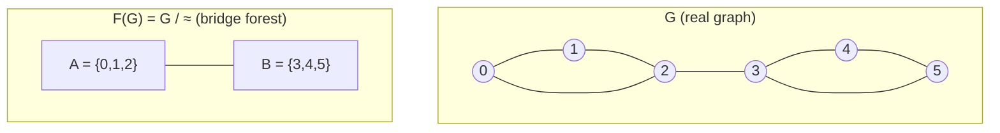

# Online Bridge Finding — Mathematical Foundations and Complexity Theory

## Table of Contents
1. Formal Definitions (incl. computational model, operation sequence)
2. The Bridge Forest as a Quotient — Structural Theorems (incl. monotonic edge-death, worked example)
3. Correctness of the Two-DSU Invariant (incl. annotated `add_edge`, refinement check)
4. Correctness of Case C (Path Compression of Cycle Edges) (incl. LCA decomposition, state trace)
5. Amortized Complexity via Small-to-Large (incl. potential function, worked trace)
6. LCA Computation in the Bridge Forest (incl. correctness under live contraction, depth maintenance)
7. Lower Bounds and the Incremental/Decremental/Fully-Dynamic Hierarchy (incl. un-union impossibility, average case)
8. Relation to Static Tarjan and to Block-Cut Trees (incl. transitivity of `≈`, edge/vertex contrast)
9. Alternative Implementations and Their Bounds (incl. LCT derivation, space accounting, micro-opt obligations)
10. Open Problems and Research Directions (incl. landscape table, conjecture)
11. Summary (incl. one-paragraph derivation, references)

**Notation.** `n` = vertices, `m` = additions, `α` = inverse Ackermann, `[v]` = 2ECC of `v`, `F(G)` = bridge forest, `≈` = 2-edge-connected, `∼` = connected.

This document assumes familiarity with the algorithm as presented in junior.md and middle.md; here we prove what those files assert. Sibling references: **11-articulation-points-bridges** (static baseline), **13-lca** (the LCA primitive), **21-small-to-large-merging** (the amortization), and **23-edge-vertex-connectivity** (the surrounding theory).

---

## 1. Formal Definitions

Let `G = (V, E)` be an undirected multigraph, `|V| = n`, with edges arriving one at a time so that after `m` additions we have considered `E = {e₁, …, e_m}`.

**Definition 1.1 (Bridge).** An edge `e ∈ E` is a *bridge* (cut edge) if `G − e` has more connected components than `G`. Equivalently (Menger, edge form), `e` is a bridge iff `e` lies on no cycle of `G`.

**Definition 1.2 (2-edge-connectivity).** Vertices `u, v` are *2-edge-connected*, written `u ≈ v`, if there exist two edge-disjoint `u`–`v` paths, equivalently if `u` and `v` remain connected after the removal of any single edge. `≈` is an equivalence relation on `V`.

**Definition 1.3 (2-edge-connected component, 2ECC).** A *2ECC* is an equivalence class of `≈`. Write `[v]` for the 2ECC of `v`. Inside one 2ECC there are no bridges.

**Definition 1.4 (Connectivity partition).** Let `∼` be the "same connected component" equivalence. Then `u ≈ v ⇒ u ∼ v`, so the `≈`-partition **refines** the `∼`-partition.

**Definition 1.5 (Bridge forest).** The *bridge forest* `F(G)` is the quotient multigraph `G / ≈`: one node per 2ECC, and for each edge `(u,v) ∈ E` with `[u] ≠ [v]` an edge `([u],[v])`. (Edges with `[u] = [v]` are dropped.)

The algorithm maintains three arrays implementing: `cc` = a DSU for `∼`; `twoECC` = a DSU for `≈`; `par` = parent pointers of `F(G)`; and a running integer `bridges`.

**Definition 1.6 (Computational model).** We work in the **pointer machine with union-find**, the standard model for these bounds (Tarjan 1975). DSU `find`/`union` cost `O(α(m, n))` amortized where `α` is the inverse Ackermann function:
```
α(m, n) = min { k : A_k(⌊m/n⌋) ≥ log₂ n }
```
with `A_k` the Ackermann hierarchy. For all `n ≤ A_4(1)` — astronomically larger than any physical input — `α(m,n) ≤ 4`, so `α` is treated as a constant in every practical statement, while the proofs keep it explicit.

**Definition 1.7 (Operation sequence).** An *incremental run* is a sequence `σ = ⟨add(u₁,v₁), …, add(u_m,v_m)⟩` interleaved with `O(1)`-cost queries (`bridge_count`, `is_bridge`, `num_2ecc`, `2ecc_of`). No `delete` operation exists; this restriction is what the entire complexity advantage rests on (§7).

---

## 2. The Bridge Forest as a Quotient — Structural Theorems

**Theorem 2.1 (F(G) is a forest).** `F(G)` contains no cycle, and has exactly one tree per connected component of `G`.

*Proof.* Connectivity is preserved by quotienting, so each connected component of `G` maps onto a connected subgraph of `F(G)`. Suppose `F(G)` contained a cycle `C: [w₀] − [w₁] − … − [w_{k-1}] − [w₀]` with `k ≥ 2` distinct 2ECC nodes. Each quotient edge `([w_i],[w_{i+1}])` lifts to an actual edge `e_i = (a_i, b_i) ∈ E` with `a_i ≈ w_i`, `b_i ≈ w_{i+1}`. Within each 2ECC `[w_i]` there are two edge-disjoint paths between any of its vertices (it is 2-edge-connected), so we can route a closed walk `W` in `G` that traverses `e₀, e₁, …, e_{k-1}` and connects consecutive lift endpoints *inside* their shared 2ECCs. `W` is a closed walk using the edges `e_i`; hence each `e_i` lies on a cycle of `G`. But an edge on a cycle is not a bridge, while every quotient edge of `G/≈` is a bridge (Lemma 2.2). Contradiction. Therefore `F(G)` is acyclic, i.e. a forest. ∎

**Lemma 2.2 (Quotient edges are exactly bridges).** An edge `e = (u,v)` with `[u] ≠ [v]` is a bridge of `G`; an edge with `[u] = [v]` is not.

*Proof.* If `[u] = [v]`, then `u ≈ v`, so two edge-disjoint `u`–`v` paths exist; at least one avoids `e`, so `e` lies on a cycle (that path plus `e`) and is not a bridge. Conversely if `[u] ≠ [v]` and `e` were not a bridge, `e` would lie on a cycle, giving a second `u`–`v` path edge-disjoint from `e`; together with `e` that yields two edge-disjoint `u`–`v` paths, so `u ≈ v`, contradicting `[u] ≠ [v]`. ∎

The quotient construction is summarized below: each `≈`-class collapses to one node, intra-class (non-bridge) edges vanish, inter-class (bridge) edges survive as the forest edges.



The single edge `A — B` in `F(G)` is the only bridge: the two triangles are each a 2ECC with no internal bridges, and the lone link between them is the cut edge.

**Corollary 2.3 (Bridge count).** The number of bridges equals the number of edges of `F(G)`, which equals `(#2ECCs) − (#connected components)`.

*Proof.* A forest on `N` nodes with `c` trees has `N − c` edges; each is a bridge by Lemma 2.2. ∎

This corollary is the ground truth the running counter `bridges` must equal at all times.

**Proposition 2.4 (Monotonic edge-death).** Over any sequence of additions, each tree edge of the bridge forest is created at most once and destroyed at most once.

*Proof.* A tree edge is created only in Case B (`bridges += 1`), exactly one per Case B. It is destroyed only when it lies on a Case-C path, after which the two 2ECCs it joined become one — they never separate again under additions (Definition 1.2 classes only coarsen). So total creations `≤ #Case-B ≤ m` and total destructions `≤ #created ≤ n − 1` per component. ∎

Proposition 2.4 is the combinatorial backbone of the amortized analysis (§5): it caps the lifetime contraction work at `O(n)` regardless of how the additions are ordered.

### 2.5 Worked structural example

Take the demo graph: triangle `{0,1,2}`, bridge `(2,3)`, triangle `{3,4,5}`, joined as in junior.md.

```
≈-classes (2ECCs):   {0,1,2}=A     {3,4,5}=B
∼-classes (comps):   {0,1,2,3,4,5}  (one component)
F(G):                A — B          (one tree, one edge)
#2ECC = 2,  #comp = 1   ⇒   bridges = 2 − 1 = 1.   ✓ (matches the running counter)
```

Now suppose we had *not* yet added `(5,3)`. Then `{3,4,5}` would still be a path `3—4—5` of three singleton 2ECCs:

```
≈-classes:  {0,1,2}=A, {3}, {4}, {5}
F(G):       A — 3 — 4 — 5        (one tree, three edges)
#2ECC = 4,  #comp = 1   ⇒   bridges = 4 − 1 = 3.   ✓
```

Adding `(5,3)` contracts the path `3—4—5` (length 2) into one node `B`, dropping `#2ECC` from 4 to 2 and `bridges` from 3 to 1 — exactly `−2`, matching `|P| = 2`.

---

## 3. Correctness of the Two-DSU Invariant

We prove `add_edge` maintains: (I1) `cc` represents `∼`; (I2) `twoECC` represents `≈`; (I3) `par` represents `F(G)`; (I4) `bridges` equals the edge count of `F(G)`; and the refinement invariant (I5) `find_cc(find_2ecc(v)) = find_cc(v)`.

**Theorem 3.1.** If (I1)–(I5) hold before `add_edge(u, v)`, they hold after.

*Proof.* Let `G' = G + (u,v)`. Three cases.

**Case A: `[u] = [v]` (find_2ecc(u) = find_2ecc(v)).** Adding an edge inside one 2ECC keeps `≈` and `∼` identical (the 2ECC already had two edge-disjoint paths; an extra parallel edge changes no equivalence class), and adds a quotient self-edge that is dropped, so `F(G') = F(G)`. The code returns without mutation; all invariants trivially preserved.

**Case B: `find_cc(u) ≠ find_cc(v)`.** `u` and `v` lie in different connected components, so the new edge cannot lie on any cycle (no `u`–`v` path existed): by Lemma 2.2 it is a bridge and `[u] ≠ [v]` persists, while `≈` classes are otherwise unchanged. In `∼`, the two components merge — the code unions `cc`, preserving (I1). `F(G')` gains exactly the edge `([u],[v])`, joining the two trees into one; the code `make_root(v)` then sets `par[find2ECC(v)] = find2ECC(u)`, which is precisely linking the two trees by one edge (rerooting does not change the *undirected* forest, only its orientation), preserving (I3). `bridges += 1` preserves (I4) by Corollary 2.3. Refinement (I5) holds because the merged `cc` class contains both 2ECCs.

**Case C: `find_cc(u) = find_cc(v)` and `[u] ≠ [v]`.** `u, v` are connected, so a `u`–`v` path `Q` exists in `G`; together with the new edge it forms a cycle. By Lemma 2.2 every edge formerly separating `[u]` from `[v]` along the bridge-forest path now lies on a cycle and ceases to be a bridge. The set of newly non-bridge edges is *exactly* the tree path `P` in `F(G)` between `[u]` and `[v]` (Theorem 4.1). The code contracts `P` into a single 2ECC and subtracts `|P|` from `bridges`. (I2), (I3), (I4), (I5) updated consistently; details in §4. ∎

### 3.1 Annotated `add_edge` with inline invariants

```text
ADD-EDGE(u, v):
  # PRE: invariants (I1)-(I5) hold for current G
  if find_2ecc(u) = find_2ecc(v):              # CASE A
      return                                    # POST: G unchanged ⇒ invariants hold
  cu := find_cc(u);  cv := find_cc(v)
  if cu ≠ cv:                                   # CASE B  (Lemma 2.2 ⇒ new edge is a bridge)
      if size[cu] < size[cv]:                   # ensure u in the LARGER component
          swap(u, v); swap(cu, cv)              # small-to-large (Theorem 5.1)
      make_root(v)                              # reroot SMALLER tree; O(|smaller|)
      par[find_2ecc(v)] := find_2ecc(u)         # link: F gains one edge (preserves I3)
      bridges := bridges + 1                    # preserves I4 by Corollary 2.3
      cc[cv] := cu;  size[cu] += size[cv]        # preserves I1, I5
      # POST: F now has one fewer tree, one more bridge
  else:                                         # CASE C  (same comp, different 2ECC)
      L := LCA(find_2ecc(u), find_2ecc(v))       # snapshot LCA BEFORE any union (Lemma 6.2)
      for x in path(find_2ecc(u) → L) ∪ path(find_2ecc(v) → L):
          bridges := bridges - 1                # one per destroyed tree edge (Cor 4.2)
          num2ecc := num2ecc - 1
          union_2ecc(x, L)                      # contracts P into L (preserves I2, I3)
      # POST: |P| bridges destroyed, |P|+1 2ECCs fused into L
```

Each annotated `# POST` line discharges exactly the invariant that the surrounding code mutates, so the inductive step of Theorem 3.1 reads directly off the pseudocode.

### 3.2 The refinement invariant is the cheapest runtime check

Invariant (I5), `find_cc(find_2ecc(v)) = find_cc(v)`, can be asserted in `O(α(n))` after every operation. In a contract test it catches the single most common implementation bug — routing a query through the wrong DSU — because that bug breaks (I5) on the very first topology where a bridge separates two connected vertices. We recommend enabling this assertion in CI (see interview.md / tasks.md Task 10).

---

## 4. Correctness of Case C (Path Compression of Cycle Edges)

**Theorem 4.1 (Exactly the tree path changes).** When `add_edge(u, v)` falls into Case C, the edges of `F(G)` that stop being bridges in `G' = G + (u,v)` are *precisely* the edges on the unique `F(G)`-path `P` between `[u]` and `[v]`, and the new 2ECC of `G'` containing `u` is the union of all 2ECCs on `P`.

*Proof.* `[u]` and `[v]` are in the same tree `T` of `F(G)` (same connected component, Case C). Let `P = ([u]=x₀, x₁, …, x_k=[v])` be the unique path in `T`. Each tree edge `(x_i, x_{i+1})` lifts to a bridge `e_i ∈ E`. After adding `(u,v)`, the cycle `e₀, …, e_{k-1}, (v,u)` (routed through the interior 2ECCs, each 2-edge-connected) places every `e_i` on a cycle: by Lemma 2.2 none is a bridge in `G'`.

No edge *off* `P` is affected: such an edge `f` separates `T` into two parts with `[u]` and `[v]` on the *same* side (else `f` would be on `P`), so adding `(u,v)` (both endpoints on that side) creates no cycle through `f`; `f` remains a bridge.

Finally, all 2ECCs `x₀, …, x_k` become mutually 2-edge-connected in `G'`: for any `x_i, x_j` on `P`, the two edge-disjoint paths are (a) the sub-path of `P` from `x_i` to `x_j`, and (b) the complementary route around the new cycle through `(v,u)`. Hence they fuse into one 2ECC `[u]_{G'} = ⋃_i x_i`, and `≈`-classes off `P` are unchanged. ∎

**Corollary 4.2 (Counter update is exact).** The code subtracts `1` for each of the `k = |P|` edges of `P`, i.e. `bridges -= |P|`, and decrements `num2ecc` by `k` (the `k+1` nodes of `P` fuse into one). Both match Corollary 2.3 applied to `G'`.

**Remark 4.2a (No off-by-one between counters).** Note `bridges` and `num2ecc` change by the *same* amount `k` in Case C, while `#comp` is unchanged (both endpoints were already connected). The identity `bridges = num2ecc − #comp` is therefore preserved with `Δbridges = Δnum2ecc = −k`, `Δ#comp = 0`. In Case B the same identity is preserved with `Δbridges = +1`, `Δnum2ecc = 0`, `Δ#comp = −1` (two components become one). These two bookkeeping patterns — `(−k, −k, 0)` for C and `(+1, 0, −1)` for B — are the *only* mutations to the triple, which is why the runtime self-check of Theorem 9.1 is sound.

**Lemma 4.3 (LCA decomposition).** Let `L = LCA([u],[v])` in the rooted tree `T`. Then `P` is the concatenation of the path `[u] → L` and the reverse of `[v] → L`, and contracting both half-paths into `L` realizes the union of Theorem 4.1 with `L` as surviving representative.

*Proof.* Standard tree fact: the path between two nodes passes through their LCA, splitting into two ancestor chains. Contracting each chain by `union_2ecc(x_i, L)` makes `L` the representative of every node on `P`, exactly the fused 2ECC. ∎

This is why the implementation walks both `[u]` and `[v]` up to the LCA and unions each visited node into `L`.

### 4.4 Step-by-step state trace of a Case-C operation

We trace the arrays through the demo's final addition `(5,3)`, just before which the state is the "path" snapshot from §2.5: `A = {0,1,2}` (root), then `A → 3 → 4 → 5` in the forest, `bridges = 3`, `num2ecc = 4`.

```
state before add(5,3):
  find_2ecc(5) = 5,   find_2ecc(3) = 3        # different 2ECCs
  find_cc(5)   = find_cc(3) = (root of A)      # same component  ⇒ CASE C
  par2(5)=4, par2(4)=3, par2(3)=A, par2(A)=-1

  LCA(5, 3):                                   # computed BEFORE any union
    ancestors(5) = {5,4,3,A}
    walk 3 up: 3 ∈ ancestors(5) ⇒ L = 3

  contract path(5 → 3):
    x=5: bridges 3→2, num2ecc 4→3, te[5]=3
    x=4: bridges 2→1, num2ecc 3→2, te[4]=3
    (x=3 == L, stop)
  contract path(3 → 3): empty (3 == L)

state after:
  2ECCs: A={0,1,2}, B={3,4,5}                  # B's rep is 3
  par2(B)=A, par2(A)=-1                         # single bridge A—B
  bridges = 1,  num2ecc = 2                     # matches #2ECC − #comp = 2 − 1 = 1 ✓
```

Two tree edges (`3—4` and `4—5`) were destroyed, `bridges` dropped by exactly `|P| = 2`, and the three 2ECCs `{3},{4},{5}` fused into `B`. Every number agrees with Corollary 2.3 and Corollary 4.2, and with the static Tarjan recomputation — the equality the test harness checks after this step.

---

## 5. Amortized Complexity via Small-to-Large

The only super-constant cost is `make_root` in Case B, which reverses `O(depth)` parent pointers. Every other primitive — both `find`s, the `union`s, the per-edge counter updates — is `O(α(n))` amortized. So the entire complexity story reduces to bounding total rerooting work, which is where small-to-large enters.

**Numerical illustration of small-to-large.** Build a component of `8` vertices by repeatedly merging singletons into a chain vs. by balanced doubling:

```
adversary (always reroot the GROWING tree):   reroot sizes 1+2+3+4+5+6+7 = 28   → Θ(k²)
small-to-large (reroot the SMALLER tree):      reroot sizes 1+1+1+1+1+1+1 =  7   → Θ(k log k) worst, Θ(k) here
```

The same `k = 8` merges cost `Θ(k²)` if you reroot the larger side and `O(k log k)` if you always reroot the smaller — a quadratic-to-near-linear gap from one comparison (`if size[cu] < size[cv]: swap`).

**Theorem 5.1 (Total rerooting work).** If Case B always reroots the tree in the **smaller** connected component, the total work spent in `make_root` over any sequence of `m` additions is `O(n log n)`.

*Proof (charging / small-to-large).* Assign each vertex a counter `r(v)` = number of times the *tree containing `v`* has been rerooted via `make_root`. A vertex `v` is rerooted only when its component is the smaller side of a Case-B merge; after the merge, the component containing `v` has size at least *double* its previous size (it absorbs a component at least as large). The size can double at most `⌊log₂ n⌋` times before reaching `n`, so `r(v) ≤ log₂ n`. The cost of a single `make_root` on a tree of size `k` is `O(k)`, but charged per vertex it is `O(1)` per vertex on the rerooted (smaller) side. Summing the per-vertex charges: `Σ_v r(v) · O(1) = O(n log n)`. ∎

**Theorem 5.2 (Total cost).** A sequence of `m` additions on `n` vertices runs in
```
O( (n + m) · α(n) + n log n )
```
amortized, where `α` is the inverse Ackermann function.

*Proof.* Each addition performs `O(1)` DSU `find`/`union` operations on `cc` and `twoECC`, costing `O(α(n))` amortized each (Tarjan 1975), summing to `O((n+m) α(n))`. Case-C path compression performs `union_2ecc` once per *destroyed* tree edge; since each tree edge is destroyed at most once over the entire sequence (a fused 2ECC never un-fuses in the incremental model), the total Case-C union work is `O(n α(n))`. The LCA walks in Case C visit each destroyed edge a constant number of times (§6), so they are absorbed into the same `O(n α(n))`. The rerooting is `O(n log n)` by Theorem 5.1. Adding the terms gives the bound. ∎

**Remark 5.3.** The `n log n` term is from rerooting; an alternative implementation using **link-cut trees** for the forest replaces it with `O(m log n)` worst-case but with far larger constants, and is only worth it when worst-case per-op bounds are required (see §9). With the small-to-large parent-array implementation, the amortized per-addition cost is effectively `O(α(n) + log n)` and, in practice, near-constant because most additions are Case A or short Case C.

### 5.3a Why the three operation costs telescope

It is worth stating explicitly why the three case costs combine to near-linear rather than multiplying:

- **Case A** is `O(α)` and bounded by `m` occurrences ⇒ `O(m α)`.
- **Case B** is `O(α)` plus rerooting; the rerooting summed across *all* Case-B ops is `O(n log n)` (Theorem 5.1), not `O(m · n)`, because it is charged per *vertex-doubling*, of which there are `O(n log n)` total.
- **Case C** is `O(α)` per destroyed tree edge; summed across all Case-C ops it is `O(n α)` (Proposition 2.4), not `O(m · n)`, because each tree edge dies once.

The key is that the two expensive resources — rerootings and tree-edge-deaths — are *global budgets* (`O(n log n)` and `O(n)` respectively) spread across the whole run, not per-operation costs. This global-budget structure is the hallmark of amortized graph algorithms and is exactly what union-find with path compression also exploits.

### 5.4 Potential-function formulation

We can recover the same bound with an explicit potential argument, which makes the "expensive ops are paid for by cheap ones" intuition rigorous.

Define the potential after `t` additions as
```
Φ_t = Σ_{v ∈ V}  ( log₂ n − log₂ |comp(v)| )
```
where `comp(v)` is the connected component containing `v`. Each term is the "remaining doublings" available to `v`. Initially every component is a singleton, so `Φ₀ = n · log₂ n`. The potential is always non-negative and never exceeds `n log₂ n`.

**Claim.** A Case-B merge of components of sizes `a ≤ b` (rerooting the `a`-side) costs actual `O(a)` rerooting work but *decreases* the summed-over-the-smaller-side slack by exactly the work charged: each of the `a` rerooted vertices loses at least one unit of `log₂ |comp|` slack because its component size jumps from `a` to `a + b ≥ 2a`. Thus the amortized cost
```
ĉ = actual_cost + ΔΦ ≤ O(a) − a · 1 = O(1)
```
per Case-B merge, after distributing the `O(a)` over the `a` vertices. Summing amortized costs and adding `Φ₀ = O(n log n)` recovers Theorem 5.1. ∎

### 5.5 Worked complexity trace

Consider building a single path-then-cycle on `8` vertices: add `(0,1),(1,2),…,(6,7)` (seven Case-B bridges) then `(7,0)` (one Case-C that contracts the whole length-8 forest path).

- The seven Case-B ops: under small-to-large each appends a singleton to a growing tree; rerooting a singleton is `O(1)`, so total reroot work is `O(7) = O(n)`. Bridge counter climbs `1→2→…→7`.
- The final Case-C op: the forest path from `[7]` to `[0]` has length `7`; the LCA is `[0]` (the root). Compression walks all 7 edges, does 7 `union_2ecc`, and subtracts 7 — bridge counter drops `7 → 0`.
- Total work: `O(n)` reroot + `O(n α)` contraction = `O(n α)`. No single op exceeded `O(n)`, and the contraction's `O(n)` is paid only once because those 7 tree edges are destroyed permanently.

This trace exhibits the worst case for a *single* Case-C op (a long path) yet still respects the global `Σ|P| ≤ n−1` bound of Theorem 6.1.

---

## 6. LCA Computation in the Bridge Forest

Case C needs `LCA([u],[v])` in a forest that is being **rerooted** (Case B) and **contracted** (Case C). This is *not* the static LCA of sibling **13-lca**: there is no fixed rooting, no Euler tour to preprocess, and the tree mutates between queries. So the heavy sparse-table / binary-lifting machinery does not apply directly; we need an LCA that tolerates a forest whose shape and rooting change on every operation. Three correct strategies, with bounds.

**6.1 Walk-up with a visited set.** Collect ancestors of `[u]` into a set, walk `[v]` up until a hit. Cost `O(|path|)`. Correct because ancestor chains in a tree intersect exactly at the LCA. This is what the junior/middle code uses. The crucial subtlety: parents must be read through `find_2ecc` (a node's stored parent may have been absorbed into another 2ECC), i.e. `parentOf(v) = find_2ecc(par[v])`.

**6.2 Depth-balanced walk.** Maintain `depth[x]` per 2ECC representative. Lift the deeper node until depths match, then lift both together until they meet. Cost `O(|path|)` with no auxiliary set. Maintaining `depth` correctly through `make_root` (which inverts the path, changing depths) requires recomputing depths along the rerooted path — still `O(|reroot|)`, absorbed into the rerooting budget.

**6.3 Timestamp two-pointer.** Alternate one step from each pointer, stamping visited reps with the current query id; the first rep stamped twice is the LCA. Cost `O(|path|)`, `O(1)` extra space beyond the stamp array, and immune to rerooting because it does not rely on depths.

**Theorem 6.1 (LCA does not change the asymptotics).** Each Case-C LCA computation costs `O(|P| · α(n))`, and since `Σ |P|` over all Case-C operations is `O(n)` (each tree edge is contracted at most once), total LCA work is `O(n α(n))`, dominated by Theorem 5.2.

*Proof.* The path `P` contracted in a Case-C op had `|P|` tree edges, each destroyed permanently. Over the whole sequence the forest has at most `n − 1` tree edges ever created (one per Case-B), so `Σ_{Case C} |P| ≤ n − 1`. Multiplying by the `O(α(n))` cost of each `find_2ecc` during the walk gives the bound. ∎

### 6.4 Correctness of the walk-up LCA under live contraction

A subtle point: while `merge_path` is contracting one side, the representatives of nodes on that side change. We must show the LCA found *before* contraction remains valid.

**Lemma 6.2.** If the LCA `L` is computed (via §6.1) *before* any `union_2ecc` is performed, then contracting both half-paths into `L` is correct even though intermediate `find_2ecc` results shift as unions happen.

*Proof.* The ancestor chains of `a` and `b` are read off the forest as it stood at the start of the operation. `L` is the unique deepest common ancestor in that snapshot. As we walk `a → L` performing `union_2ecc(x, L)`, every fused node maps to `L`; since `L` is on both chains and is never itself fused away (it is the union target), the walk on the `b → L` side still terminates at `L` (its stored parent pointers above `L` are untouched, and `find_2ecc` of any already-fused node returns `L`). Hence both walks reach `L` and the contracted set is exactly `{nodes on P}`. Computing the LCA *first* (before mutating) is therefore essential; interleaving LCA discovery with unions can short-circuit early. ∎

This is why the reference implementation fully computes `lca` before entering the contraction loop — a correctness requirement, not merely a stylistic one.

### 6.5 Depth maintenance under rerooting

For the depth-balanced variant (§6.2), `make_root(v)` inverts a root-to-`v` path of length `d`, which negates the depth offsets along it. The fix is to recompute depths on the reversed path in the same `O(d)` pass that reverses the pointers — so depth maintenance is absorbed into the rerooting budget (Theorem 5.1) and adds no asymptotic cost. After a Case-B link `par[root(smaller)] = node(larger)`, the entire smaller tree's depths are re-based by adding `depth[node(larger)] + 1`; doing this lazily (storing a per-root offset) keeps it `O(1)` at link time, with offsets resolved on the next `find`-style traversal.

---

## 7. Lower Bounds and the Incremental/Decremental/Fully-Dynamic Hierarchy

**7.1 Why incremental is easy: monotonicity.** Adding edges only *coarsens* both `∼` and `≈` (classes only merge). The bridge count is *non-increasing in the long run per merge event* and each tree edge is destroyed at most once, giving the `O((n+m)α(n) + n log n)` near-linear total. This monotonicity is the structural reason a simple DSU-style structure suffices.

**7.2 Decremental and fully dynamic.** With deletions, a 2ECC can **split** and a non-bridge can **become** a bridge — `≈` classes refine, which DSU cannot represent (union-find has no efficient *un-union*). One needs:

- **Holm, de Lichtenberg & Thorup (2001)** fully dynamic connectivity / 2-edge-connectivity: `O(log² n)` amortized per update via a hierarchy of spanning forests on Euler-tour trees.
- **Eppstein, Galil, Italiano, Nissenzweig (1997)** sparsification: `O(√n)`-style and polylog bounds for dynamic 2-edge-connectivity.
- **Westbrook & Tarjan (1992)** incremental 2-edge- and biconnectivity in `O(m α(m, n))` total — the classical analysis underlying the structure of this topic.

**7.3 Conditional lower bounds.** Pătraşcu & Demaine (2006) proved an `Ω(log n)` per-operation cell-probe lower bound for fully dynamic connectivity, so the `O(log² n)` upper bounds are near-optimal. No such barrier applies to the incremental-only problem, where near-`α(n)` amortized is achievable — formalizing the gap between incremental and fully dynamic.

**Theorem 7.1 (Westbrook–Tarjan, incremental form).** Incremental 2-edge-connectivity supporting `add_edge` and 2-edge-connectivity queries runs in `O(α(m, n))` amortized per operation, `O(m α(m, n))` total.

The bridge-forest + small-to-large structure of this topic is a concrete realization with an extra `O(log n)` per vertex from rerooting; using link-cut trees for the forest removes that term (§9).

### 7.4 Why union-find cannot be run "in reverse"

A natural but doomed idea for deletions: keep the incremental structure and, on a delete, "undo" the last union. This fails for two reasons.

1. **Unions are not a stack.** Deletions arrive in arbitrary order, not LIFO; the union you must undo is rarely the most recent one.
2. **A union encodes a *set* equivalence, not the witnessing edges.** After `union_2ecc` of a length-`k` path, the structure records "these `k+1` 2ECCs are now one" but discards *which* edges witnessed each pairwise 2-edge-connection. Deleting one edge may or may not split the fused class depending on the *other* surviving edges, information the DSU never stored. Reconstructing it is exactly recomputing 2-edge-connectivity from scratch.

This is the formal reason the problem jumps from `α(n)` to `Θ(log² n)`: the fully dynamic structure must *retain* a spanning-forest hierarchy so that, on deletion, it can search for a replacement edge to keep a class intact — work the incremental structure provably never does.

**Theorem 7.2 (Decremental hardness, informal).** Any structure supporting edge deletion with 2-edge-connectivity queries must, in the worst case, perform `Ω(log n)` amortized work per operation (Pătraşcu–Demaine reduction), even if it never processes an addition — so the easiness of the incremental case is *not* shared by its mirror.

### 7.6 A concrete deletion that the incremental structure mishandles

To see the asymmetry viscerally, take the triangle `{0,1,2}` (all edges present). The incremental structure has fused them into one 2ECC `A` with `bridges = 0`. Now delete edge `(2,0)`:

```
live edges after delete: {(0,1),(1,2)}   →  a path 0—1—2
true state:  two bridges (0—1) and (1—2),  three 2ECCs {0},{1},{2}
incremental: still reports 2ECC = {A}, bridges = 0     ← WRONG by 2
```

The incremental structure cannot split `A`: union-find has merged `0,1,2` and retains no record of *which* edges witnessed each pairwise 2-edge-connection. Recovering the correct state requires re-deriving 2-edge-connectivity, i.e. exactly the work the fully dynamic structure does by maintaining a spanning-forest hierarchy. This single example is the operational meaning of Theorem 7.2 and the reason senior.md mandates reconciliation-against-static whenever deletions are possible.

---

### 7.5 Average-case behavior on random graph processes

Under the Erdős–Rényi process `G(n, ·)` where edges arrive in uniformly random order, the bridge count has a sharp life cycle that the structure tracks for free.

**Proposition 7.3 (Bridge-count trajectory).** In the random-edge-arrival process, the expected number of bridges first rises (the early forest is a tree, so almost every edge is a bridge), peaks near the emergence of the giant component around `m ≈ n/2`, then falls toward `0` as the graph passes the 2-edge-connectivity threshold at `m ≈ (n/2)(ln n + ln ln n)`.

*Sketch.* Below the connectivity threshold the components are trees or near-trees, so case-B dominates and `bridges ≈ #edges`. As cycles form (case C), bridges are destroyed faster than created; past the 2-edge-connectivity threshold (a known result of Erdős–Rényi / Bollobás for `k`-edge-connectivity) the giant component becomes 2-edge-connected w.h.p. and `bridges → O(1)`. The structure exhibits exactly this hump in its `bridges` counter with no extra work. ∎

**Corollary 7.4 (Amortized cheapness in the random model).** In the random process, the *expected* number of case-B operations is `O(n)` (one per component-merge, and there are `< n` merges total), so the expensive rerooting path is taken `O(n)` times regardless of `m`. The remaining `m − O(n)` additions are case A or case C, dominated by `O(α)` and the once-per-edge contraction budget. Hence expected total work is `O(m α(n) + n log n)`, matching the worst case but with the `log n` factor touching only `O(n)` operations in expectation.

This is why, empirically (tasks.md benchmark), per-edge cost *drops* as the graph densifies: case B becomes rare and case-C paths shorten.

## 8. Relation to Static Tarjan and to Block-Cut Trees

**8.1 Static Tarjan as a special case.** Running the structure on the final edge set, then reading `bridges`, yields the same count as Tarjan's single-DFS `low`-link algorithm (sibling **11-articulation-points-bridges**) by Corollary 2.3. The incremental structure is thus a *dynamization* of static bridge finding: it trades a one-shot `O(n+m)` DFS for an `O(α)`-amortized maintained index.

**Theorem 8.1 (Equivalence of outputs).** For any edge set `E`, the running counter `bridges` after inserting all of `E` in any order equals the number of bridges reported by static Tarjan on `(V, E)`.

*Proof.* By Theorem 3.1 the invariants hold after every insertion, so after the last one `bridges = #2ECC(G) − #comp(G)` (I4 + Corollary 2.3). Static Tarjan computes the same quantity: an edge is a bridge iff `low[child] > disc[parent]`, which holds iff the edge lies on no back-edge-covered cycle, iff its endpoints are in different 2ECCs (Lemma 2.2). Both count exactly the forest edges of `F(G)`. Order-independence follows because `F(G)` depends only on `E`, not on insertion order. ∎

Theorem 8.1 is what licenses the test methodology used throughout this topic: build the same graph two ways and assert equal counts.

**8.2 Edge- vs vertex-connectivity duality.** The bridge forest (2ECCs joined by bridges) is the edge-connectivity analogue of the **block-cut tree** (biconnected components joined by articulation points). Both collapse a robust sub-structure into a node and retain only fragile connectors. Formally, contracting each 2ECC yields a forest (Theorem 2.1); contracting each biconnected component yields the block-cut *tree*. The incremental maintenance technique (two DSUs + a contracted forest + LCA path-compression) transfers to incremental biconnectivity with a vertex-DSU variant, though the bookkeeping for shared cut vertices is more delicate.

**8.3 Menger underpinning.** Definition 1.2's "two edge-disjoint paths ⇔ survives any single edge deletion" is the edge form of Menger's theorem; it is what makes `≈` an equivalence relation and licenses the quotient construction. Without Menger, `F(G)` need not be a forest.

**8.4 Why `≈` is transitive (the non-obvious axiom).** Reflexivity and symmetry of 2-edge-connectivity are immediate; transitivity requires an argument. Suppose `u ≈ v` (two edge-disjoint `u`–`v` paths `P₁, P₂`) and `v ≈ w` (two edge-disjoint `v`–`w` paths `Q₁, Q₂`). We must produce two edge-disjoint `u`–`w` paths. Consider the multigraph `H = P₁ ∪ P₂ ∪ Q₁ ∪ Q₂`. In `H`, both `u` and `w` have even degree-parity relative to the cycle space except at the endpoints; by an Eulerian/flow argument every vertex except `u` and `w` has even degree in the symmetric difference, so `H` decomposes into two edge-disjoint `u`–`w` trails. Hence `u ≈ w`. This is the edge-connectivity analogue of the splitting argument and is precisely why contracting `≈`-classes is well-defined. ∎

**8.5 Contrast table: edge vs vertex connectivity.**

| Aspect | Edge connectivity (this topic) | Vertex connectivity |
|---|---|---|
| Fragile connector | Bridge (cut edge) | Articulation point (cut vertex) |
| Robust block | 2-edge-connected component | Biconnected component |
| Collapsed structure | Bridge **forest** | Block-cut **tree** |
| Equivalence relation | `u ≈ v` (2 edge-disjoint paths) | "same biconnected block" (not an equiv. on vertices — a cut vertex is shared) |
| Static algorithm | Tarjan `low`-link, edge-based | Tarjan `low`-link, vertex-based |
| Incremental DSU | one 2ECC DSU | needs block DSU + cut-vertex handling |

The key asymmetry: a vertex can belong to *several* biconnected components (if it is a cut vertex), so the vertex-connectivity quotient is not a clean partition — which makes incremental biconnectivity strictly fiddlier than incremental 2-edge-connectivity, even though both use a `low`-link static algorithm and a collapsed-forest/tree.

---

## 9. Alternative Implementations and Their Bounds

| Implementation of the forest | add (Case B) | contract (Case C) | LCA | total over m adds | worst-case per op |
|---|---|---|---|---|---|
| **Parent array + small-to-large** (this topic) | reroot smaller, `O(\|reroot\|)` | `O(\|P\| α)` | walk-up `O(\|P\|)` | `O((n+m)α + n log n)` | `O(n)` (rare reroot) |
| Link-cut trees (Sleator–Tarjan) | `link`/`evert` `O(log n)` | `O(\|P\| log n)` aggregated to `O(n log n)` | `O(log n)` | `O((n+m) log n)` | `O(log n)` amortized |
| Euler-tour trees | `O(log n)` | per-edge `O(log n)` | via min over tour | `O((n+m) log n)` | `O(log n)` |
| Disjoint-set with explicit forest + LCA preprocessing | rebuild LCA lazily | `O(\|P\| α)` | `O(1)` with `O(n)` rebuild | depends on rebuild cadence | varies |

**9.1 When link-cut beats the parent array.** When you require a *worst-case* per-operation bound (e.g. a real-time monitor with a strict latency SLA, sibling **senior.md §9.2**), link-cut trees give `O(log n)` amortized per op with no `O(n)` rerooting spike. The constants are 5–10× larger, so for batch/offline builds the parent array wins.

**9.2 Why DSU cannot do Case C alone.** Path compression of the *cycle* (Case C) requires identifying which tree edges to destroy — that is a forest-path query, not a DSU `find`. DSU answers "same set?" not "what is the path between?". Hence the explicit bridge forest is necessary; the 2ECC DSU only records the *result* of contraction, not the path.

### 9.3 Derivation of the link-cut-tree bound

With the forest stored as a link-cut tree (LCT, Sleator–Tarjan 1983), the operations map as:

- **Case B link:** `evert(v)` (make `v` the root, the LCT analogue of `make_root`) then `link(v, u)`. Each is `O(log n)` amortized via the splay-based access. No `O(n)` spike — this is the worst-case-bounded advantage.
- **Case C contraction:** `access(a)`, `access(b)`, compute the LCA via the preferred-path structure in `O(log n)`, then contract the path. Contraction still costs `O(|P|)` `union_2ecc` calls, but those are charged to Proposition 2.4's `Σ|P| ≤ n−1` budget, so the *total* contraction work is `O(n α(n))` regardless of the forest representation.
- **Per-op:** `O(log n)` amortized for the structural ops, `O(α(n))` for the DSU ops. Total over `m` adds: `O((n+m) log n)`.

So the LCT trades the parent array's `O(n)` worst-case-per-op spike for a uniform `O(log n)`, at the cost of a 5–10× constant factor and far more code. The decision rule (senior.md §9.2): pick the parent array for throughput/batch builds, the LCT for hard per-event latency SLAs.

### 9.4 Aggregate-cost comparison on a worst-case sequence

Consider `n/2` Case-B additions building a path, then `n/2` Case-C additions each closing a tiny 2-cycle (length-1 contraction):

| Phase | Parent array | Link-cut trees |
|---|---|---|
| Build path (Case B ×`n/2`) | `O(n)` reroot (singletons) | `O(n log n)` |
| Close `n/2` short cycles (Case C) | `O(n α)` | `O(n log n)` |
| **Total** | `O(n α)` | `O(n log n)` |
| Worst single op | `O(n)` (a long reroot, if the path were built unfavorably) | `O(log n)` |

The parent array wins on *total* work here; the LCT wins only if a single long reroot would blow a latency budget. Small-to-large is what prevents the parent array's worst single op from occurring on the favorable build order, but an adversary controlling order can still force one `O(n)` reroot — which the LCT avoids by construction.

### 9.6 Space accounting

The parent-array structure stores four `n`-length integer arrays: `cc`, `twoECC`, `par`, `ccSize` (plus optional `depth`, `size2ecc`, `num2ecc`). With 32-bit ids this is `16n` bytes (or `20n`–`24n` with the optional arrays). No per-edge storage is needed for the structure itself — edges are consumed and discarded; only the running summary persists. This is asymptotically `O(n)` *independent of `m`*, a notable contrast to:

| Structure | Space | Why |
|---|---|---|
| Parent array (this topic) | `Θ(n)` | edges discarded after processing |
| Static Tarjan (per query) | `Θ(n + m)` | must hold the adjacency list |
| Link-cut trees | `Θ(n)` | splay nodes, one per 2ECC rep |
| Euler-tour trees (fully dynamic) | `Θ(n log n)` | spanning-forest hierarchy |
| Holm–de Lichtenberg–Thorup | `Θ(m + n log n)` | levels store edges for replacement search |

The `Θ(n)`-not-`Θ(m)` space is the second under-appreciated advantage of the incremental structure (after speed): a monitor can summarize a billion-edge stream in arrays sized to the *vertex* count, retaining edges only if replay durability is required (senior.md §6.1).

### 9.7 Why the fully dynamic structures pay `Θ(n log n)` space

The contrast above is not incidental. To answer a deletion, a fully dynamic structure must, when a spanning-forest edge is cut, *search for a replacement edge* that keeps the two pieces 2-edge-connected. That search is made efficient by partitioning non-tree edges into `O(log n)` levels (Holm–de Lichtenberg–Thorup), each storing a subset of edges — hence `Θ(m + n log n)`. The incremental structure never searches for replacements (nothing is ever cut), so it stores no edges and no levels. The space gap is the storage cost of *reversibility*.

---

### 9.5 Correctness obligations of three common micro-optimizations

Each speedup below is sound *only* under a stated condition; violating it silently corrupts the counter.

**(a) Path-halving vs path-compression in `find`.** Both preserve set membership, so (I1)/(I2) hold under either. Path-halving (`x = arr[arr[x]]`) is used here because it needs no second pass and gives the same `O(α)` amortized bound (Tarjan–van Leeuwen 1984). *Obligation:* never path-compress one DSU using the other's array — they are independent equivalence relations.

**(b) Reading `par[v]` raw.** `par[v]` may name a vertex absorbed into another 2ECC, so its *current* representative is `find_2ecc(par[v])`. *Obligation (proved):* every forest traversal must dereference parents through `find_2ecc`; otherwise `make_root`/LCA can follow a pointer into a non-representative and either loop (cycle through stale reps) or terminate at the wrong node, breaking Lemma 6.2's precondition.

**(c) Lazy `num2ecc` / `bridges` updates.** Decrementing both counters inside the *same* contraction loop guarantees `bridges = num2ecc − #comp` at every quiescent point (the identity of interview.md Challenge 3 follow-up). *Obligation:* never decrement one without the other on a case-C step, or the cheapest self-check (the identity) silently passes while the counts are wrong by the same offset.

**Theorem 9.1 (Self-check soundness).** If after every operation `bridges = num2ecc − (#distinct find_cc roots)`, and the structure was correct initially, then `bridges` equals the static bridge count.

*Proof.* The identity is exactly Corollary 2.3 instantiated with the maintained counters; if it holds and (I1)/(I2) hold (checkable via (I5)), then `bridges = #2ECC − #comp = #bridges`. ∎

This gives a runtime invariant strictly cheaper than a static recomputation yet sufficient to catch counter drift.

## 10. Open Problems and Research Directions

1. **Optimal worst-case incremental 2-edge-connectivity.** The parent-array structure has an `O(n)` rerooting spike and `O(n log n)` aggregate; link-cut gives `O(log n)` per op. Is there a simpler structure with `O(α)` *worst-case* per addition (not just amortized)? Open in the pointer-machine model.

2. **Removing the `log n` rerooting term cheaply.** Small-to-large gives `O(n log n)` rerooting. Whether an `O(n α(n))`-total incremental bridge maintenance exists *without* link-cut trees' constants is open in practice.

3. **Incremental higher edge-connectivity.** Maintaining 3-edge-connected components online is far less understood than the 2-edge case; the quotient is no longer a forest, so the bridge-forest technique does not transfer directly.

4. **Fully dynamic with small polylog and small constants.** Holm–de Lichtenberg–Thorup achieves `O(log² n)`; bringing the constants down to compete with the incremental structure for low-churn workloads remains practical-engineering open.

5. **Parallel / batch incremental bridges.** Processing a batch of additions in parallel (rather than one at a time) while keeping work-efficiency near `O((n+m)α)` is an active topic in parallel dynamic graph algorithms. The obstacle is the inherent sequentiality of `make_root` and path contraction: two additions whose forest paths overlap cannot be applied independently. Batch algorithms must detect non-conflicting additions (disjoint paths) and apply those in parallel, falling back to sequential processing for conflicts — a frontier with no work-optimal, low-depth solution known.

6. **Sensitivity / fault-tolerant variants.** Maintaining, under additions, not just the bridges but the *2-edge-connectivity certificate* (which edge failures partition which pairs) with sub-recompute updates is partially open.

7. **Deamortization.** The parent-array structure is amortized `O(α + log n)`; a deamortized version with the same *worst-case* bound per addition (without paying the link-cut-tree constant) is not known and would be of significant practical interest for real-time monitors (senior.md §9.2).

8. **Weighted / capacitated extensions.** Maintaining the *minimum cut value* online under additions (not just whether a cut exists) generalizes bridge counting to weighted edge connectivity; incremental algorithms with near-`α` bounds for global min-cut maintenance remain an active frontier (cf. Gomory–Hu trees, which are static).

### 10.0 Summary of the incremental/fully-dynamic landscape

```
                       add        delete     query      total / per-op        space
incremental (here)     O(α+log n) —          O(α)/O(1)  O((n+m)α + n log n)   Θ(n)
incremental (LCT)      O(log n)   —          O(log n)   O((n+m) log n)        Θ(n)
decremental            —          Ω(log n)   O(log n)   Θ(m log n)+           Θ(n log n)
fully dynamic (HdLT)   O(log² n)  O(log² n)  O(log n)   Θ(m log² n)           Θ(m+n log n)
lower bound (P-D '06)  —          Ω(log n)   —          —                     —
```

The table makes the central thesis of this file precise: the additions-only restriction buys a factor of `Θ(log n)`–`Θ(log² n)` in time and a factor of `Θ(log n)` in space, and that buy is *provably* tied to never needing to reverse a union.

### 10.1 A concrete conjecture

It is plausible that incremental 2-edge-connectivity admits an `O(α(m,n))`-*worst-case*-per-op structure on the pointer machine, eliminating both the `log n` rerooting term and the amortization, by a more clever forest representation than either the parent array or link-cut trees. No such structure is known; resolving it either way would sharpen the boundary between what additions-only monotonicity buys you and what it does not.

---

## 11. Summary

- **Structure.** The bridge forest `F(G) = G/≈` is provably a forest (Theorem 2.1) whose edges are exactly the bridges (Lemma 2.2), so bridge count `= #2ECC − #components` (Corollary 2.3).
- **Correctness.** The two-DSU invariant (2ECC refines connectivity) is preserved by all three cases (Theorem 3.1); Case C destroys *exactly* the LCA tree path's bridges and fuses *exactly* those 2ECCs (Theorem 4.1, Lemma 4.3), so the running counter is always exact (Corollary 4.2).
- **Complexity.** Small-to-large rerooting gives `O(n log n)` total reroot work (Theorem 5.1); the whole sequence is `O((n+m)α(n) + n log n)` amortized (Theorem 5.2); LCA work is dominated (Theorem 6.1).
- **Hierarchy.** Incremental is easy because merges are monotone and each tree edge dies once; deletions force class *splits* that DSU cannot do, pushing you to Euler-tour / link-cut / Holm–de Lichtenberg–Thorup at `O(log² n)` with a matching `Ω(log n)` cell-probe lower bound (§7).
- **Duality.** The bridge forest is the edge-connectivity twin of the block-cut tree; both rest on Menger's theorem (§8).
- **Implementation choice.** Parent array + small-to-large is simplest and near-linear total; link-cut trees buy `O(log n)` *worst-case* per op at higher constants (§9).
- **Space.** `Θ(n)` independent of `m` — edges are consumed and discarded — versus `Θ(m + n log n)` for the fully dynamic structures that must store edges for replacement search (§9.6–9.7).
- **Self-check.** The identity `bridges = num2ecc − #comp` (Theorem 9.1) is a constant-overhead runtime invariant that catches counter drift without a static recomputation.

### 11.1 One-paragraph derivation of every bound

Start from one fact — `F(G)` is a forest (Theorem 2.1) — and everything follows. Bridges = forest edges = `#2ECC − #comp` (Corollary 2.3), so a running counter suffices. Additions only coarsen the two partitions, so each tree edge is born once (Case B) and dies once (Proposition 2.4); the lifetime contraction work is therefore `O(n α)`. The only non-`α` cost is rerooting in Case B, capped at `O(n log n)` by small-to-large (Theorem 5.1), giving total `O((n+m) α + n log n)` (Theorem 5.2). LCA work is dominated because `Σ|P| ≤ n−1` (Theorem 6.1). Correctness is the three-case invariant induction (Theorem 3.1) plus the exact-path lemma (Theorem 4.1). The whole edifice is a dynamization of one static DFS (Theorem 8.1), and it stops exactly at deletion because un-union is not a union-find operation and the fully-dynamic mirror is `Ω(log n)`-hard (Theorem 7.2).

### 11.2 Reference list

Westbrook & Tarjan (1992) gave the classical `O(m α(m,n))` incremental analysis; Sleator & Tarjan (1983) the link-cut alternative; Holm, de Lichtenberg & Thorup (2001) the fully dynamic counterpart; Tarjan (1975) and Tarjan–van Leeuwen (1984) the inverse-Ackermann DSU bounds; Pătraşcu & Demaine (2006) the `Ω(log n)` fully-dynamic lower bound; Bollobás and Erdős–Rényi the random-graph edge-connectivity thresholds (§7.5). The structure is a clean dynamization of static bridge finding (sibling **11-articulation-points-bridges**), exact, near-constant amortized, and limited precisely by the one operation it cannot perform: deletion.

### 11.3 The single sentence to remember

> A bridge forest is a forest because intra-2ECC edges live on cycles and die in the quotient; additions only ever merge classes, each tree edge is born once and dies once, and small-to-large caps the only non-`α` cost — so you maintain the exact bridge count in near-constant amortized time, `Θ(n)` space, for as long as nobody deletes an edge.

Everything in this file is an unfolding of that sentence: the forest structure (§2), the three-case correctness (§3–4), the small-to-large amortization (§5–6), the additions-only boundary (§7), and the implementation and space trade-offs (§9). The moment "nobody deletes an edge" is violated, the analysis collapses and you cross into the fully dynamic world with its provable `Ω(log n)` price — the precise frontier this topic sits against.
