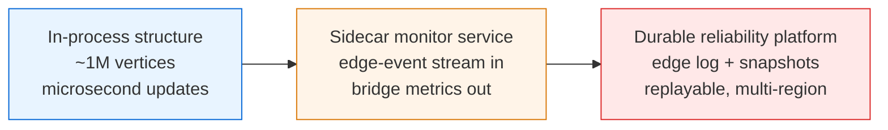

# Online Bridge Finding (Incremental 2-Edge-Connectivity) — Senior Level

> An incremental 2-edge-connectivity structure is rarely the bottleneck on one machine — but the moment you make it the live "single-point-of-failure detector" for a growing production network, every weakness (additions-only, single-process state, no durability, the rerooting spike) becomes an operational concern you must design around.

## Table of Contents
1. [Introduction](#1-introduction)
2. [System Design with Online 2-Edge-Connectivity](#2-system-design-with-online-2-edge-connectivity)
3. [Online Network Reliability Monitoring](#3-online-network-reliability-monitoring)
4. [Concurrency and Update Serialization](#4-concurrency-and-update-serialization)
5. [Comparison with Alternatives at Scale](#5-comparison-with-alternatives-at-scale)
6. [Architecture Patterns](#6-architecture-patterns)
7. [Code Examples](#7-code-examples)
8. [Observability](#8-observability)
9. [Failure Modes](#9-failure-modes)
10. [Capacity Planning](#10-capacity-planning)
11. [Summary](#11-summary)

---

## 1. Introduction

At senior level the question is no longer "how does the bridge forest update" but "where does this structure sit in my system, and what breaks when it does?". The incremental 2-edge-connectivity structure is an **in-memory, mutable, additions-only, non-durable** index over a graph. That description alone tells you four things:

- It is bounded by the RAM of one process — three `int` arrays of size `n`.
- It loses all state on restart unless you replay the edge log.
- It serializes updates through a single logical writer (the forest mutation is not naturally concurrent).
- It cannot process a **deletion**: an edge that goes down does not un-merge a 2ECC, so a naive use will *under-report* bridges after a link failure.

The interesting senior decisions are therefore architectural:

1. Is "additions only" actually acceptable for your domain, or is a link-down event a deletion you cannot ignore?
2. How do you make updates safe under concurrent edge events without destroying throughput?
3. How do you survive a process restart — replay the edge log, or snapshot the arrays?
4. How do you bound the rerooting spike so a single huge merge does not stall the monitor?
5. How do you instrument it so the on-call engineer sees "bridges climbing" before an outage, not after?

This document answers those questions in production terms, with the operational lens that the algorithm is the easy part — the hard parts are the additions-only blind spot, the single-writer constraint, durability, and observability.

---

## 2. System Design with Online 2-Edge-Connectivity

### 2.1 Three deployment tiers



| Tier | When right | When wrong |
| --- | --- | --- |
| In-process structure | One service owns the topology, additions dominate, restarts are rare. | The topology service restarts often and you cannot afford a replay. |
| Sidecar monitor | A topology service emits "link up" events and you want bridge metrics without touching its hot path. | Link-down events matter and you have not modeled deletion. |
| Durable platform | Reliability is a first-class SLO with audit, replay, and multi-region failover. | You only have one small topology and the platform is overkill. |

The most expensive mistake is deploying the additions-only structure as a *general* network monitor and silently under-counting bridges after the first link failure.

### 2.2 What the structure actually buys you

It gives you `O(1)` "how many single-points-of-failure remain?" and `O(α(n))` "are these two nodes in the same fault-tolerant group?" at any instant, updated in amortized near-constant time per link-up. The bottleneck is almost never the algorithm — it is the event ingestion, the lock, the GC over the arrays, and the occasional rerooting spike. Senior design optimizes those, not the asymptotics.

---

## 3. Online Network Reliability Monitoring

The two reliability questions the structure answers, restated for operators:

1. *"If any one link fails right now, does the network partition?"* — yes iff `bridges > 0`; the count tells you how many such fragile links exist.
2. *"Which nodes are safe together?"* — those sharing a 2ECC tolerate any single internal link failure.

Both are `O(1)` / `O(α)` reads, refreshed in near-constant time per link-up. That is the value proposition over re-running a full bridge DFS on every event.

### 3.1 The core use case

A physical or overlay network brings links online over time (provisioning, peering, mesh formation). After each link-up you want:

- **Bridge count** — number of links whose single failure would partition the network. This is your live "fragility score."
- **2ECC membership** — which nodes form a group that tolerates any single internal link failure. These are your **failover groups**.

The incremental structure delivers both. As the mesh densifies, the bridge count trends toward zero (every link gets a detour), which is exactly the signal a reliability team wants: "we are no longer one cable cut away from a partition."

### 3.2 Why additions-only fits *provisioning* but not *operations*

During **build-out**, links only get added — additions-only is a perfect match. During steady-state **operations**, links also fail and recover — that is a deletion, and the incremental structure cannot model it. The senior pattern is to use the incremental structure for the provisioning/topology-growth phase and, for steady-state, either (a) periodically rebuild from the current live edge set with static Tarjan (sibling **11-articulation-points-bridges**), or (b) move to a fully dynamic structure (Euler-tour / link-cut trees) if link churn is high.

### 3.3 Fragility alerting

The most actionable derived metric is the **bridge ratio**: `bridges / current_edges`. A network that is 30% bridges is dangerously fragile; one near 0% is robust. Alerting on a *rising* bridge count during build-out catches the case where new capacity is being added as a chain (each link a new bridge) rather than a mesh (closing cycles, dropping bridges).

### 3.4 A concrete build-out timeline

Consider provisioning a 6-rack fabric. Each line below is a link-up event and the monitor's reaction:

```
t0  link rack1—rack2     bridges 0→1   FRAGILE: rack2 reachable only via one link
t1  link rack2—rack3     bridges 1→2   FRAGILE: chain growing, every link a single point of failure
t2  link rack3—rack1     bridges 2→0   ROBUST: triangle closed, all three mutually 2-edge-connected
t3  link rack3—rack4     bridges 0→1   one new fragile link to rack4
t4  link rack4—rack5     bridges 1→2
t5  link rack5—rack3     bridges 2→1   cycle closes; only the rack3-cluster↔rack4-cluster... wait
```

The team reads the `bridges` gauge live. At `t1` it is climbing — a signal that capacity is being laid as a chain. The right operational response is to *prioritize closing cycles* (events like `t2`, `t5`) over extending chains, because a cycle-closing link removes multiple single points of failure at once. The monitor turns an abstract reliability goal into a single number that should trend toward zero as the fabric matures.

### 3.5 Failover-group assignment as a side effect

Every `find_2ecc` query is `O(α(n))`, so the monitor can answer "which switches form a fault-tolerant group with switch X?" in real time. Downstream systems consume this:

- **Routing:** prefer intra-2ECC paths; they survive any single internal link failure.
- **Placement:** spread replicas across *different* 2ECCs only if the inter-2ECC link (a bridge) is acceptable as a risk; otherwise co-locate within one robust 2ECC.
- **Alerting suppression:** a single link flap *inside* a 2ECC is non-critical (a detour exists); a flap *on a bridge* is page-worthy. The monitor classifies each link instantly via `is_bridge`.

---

## 4. Concurrency and Update Serialization

### 4.1 Single writer is the default

The bridge forest mutation — reroot, link, path-contract — touches shared `par`, `twoECC`, and `cc` arrays and is **not** naturally concurrent. Two `add_edge` calls racing on overlapping paths corrupt the forest. The default is one writer behind a mutex; readers of `bridges` (a single integer) can read lock-free if you publish it atomically.

### 4.2 Why you cannot stripe the lock

Unlike a hash map, the structure has no natural partition: an `add_edge` may reroot an arbitrarily large subtree and contract a path crossing many representatives. Lock striping by vertex id does not help because a single addition can touch a long path of unrelated ids. Either accept the single writer or shard by **connected component** (§4.3).

### 4.3 Sharding by connected component

If your topology has many independent components that never merge (e.g. separate tenant fabrics), run one structure per component shard. Each shard has its own writer and lock. The catch: a single `add_edge` that **joins two shards** (case B across components) requires merging two structures — reroot the smaller and re-key it under the larger, which is a cross-shard operation needing both locks. If cross-shard joins are rare, this scales writes linearly in the number of shards.

### 4.4 Snapshot reads

`bridges` and `num2ecc` are integers — publish them with an atomic store after each update so a monitoring thread reads a consistent recent value lock-free. For richer reads (e.g. "list the current bridges"), take the writer lock briefly or maintain a copy-on-write snapshot of the forest.

### 4.5 Cross-shard merge protocol

When a link joins two component-shards (§4.3), the cross-shard `add_edge` is the one operation that cannot run under a single shard lock. The protocol:

```
on add_edge(u, v) where shard(u) ≠ shard(v):
  1. lock both shards in a fixed global order (by shard id) to avoid deadlock
  2. determine the smaller shard by component size
  3. reroot the smaller shard's tree, re-key its vertices under the larger shard
  4. move the smaller shard's array slices into the larger shard's structure
  5. bridges_global += 1
  6. release both locks
```

Two subtleties: (a) **lock ordering** — always acquire the lower shard id first, or two concurrent cross-shard joins can deadlock; (b) **re-keying cost** — moving the smaller shard is `O(min shard size)`, the same small-to-large bound as single-structure rerooting, so cross-shard joins do not asymptotically hurt as long as they are the minority of operations. If cross-shard joins dominate (a poorly chosen shard key), the sharding provides no benefit and the single-writer design is simpler and faster.

### 4.6 What you give up by sharding

Sharding by component buys write parallelism but costs you a **globally consistent bridge list** at any instant: while two shards are mid-merge, a reader sees `bridges_global` transiently between the old and new values. For a *count*, publishing atomically after step 5 is fine. For a *list of current bridges*, you need a brief global read lock or a versioned snapshot. The senior judgment: shard only if write throughput is the proven bottleneck and a slightly stale bridge *list* is acceptable.

---

## 5. Comparison with Alternatives at Scale

| Structure | Add edge | Delete edge | Bridge count | Memory | When |
| --- | --- | --- | --- | --- | --- |
| Static Tarjan rebuild | n/a (full `O(n+m)`) | n/a (full rebuild) | `O(1)` post-rebuild | `O(n+m)` | Few queries, or periodic refresh under churn. |
| **Online two-DSU + bridge forest** | amortized `O(α)`–`O(log n)` | **unsupported** | `O(1)` | `O(n)` | Incremental build-out, additions dominate. |
| Euler-tour trees (fully dynamic 2EC) | `O(log² n)` | `O(log² n)` | `O(1)` | `O(n log n)` | Real link churn; deletions matter. |
| Link-cut trees | `O(log n)` per op | `O(log n)` | derived | `O(n)` | Path/forest ops, fully dynamic with care. |
| Holm–de Lichtenberg–Thorup | `O(log² n)` am. | `O(log² n)` am. | varies | `O(m + n log n)` | State-of-the-art fully dynamic connectivity. |

The incremental structure wins decisively when the workload is genuinely additions-only and `n` is large. The instant deletions enter, it is the wrong tool — and using it anyway is a correctness bug, not a performance trade-off.

### 5.1 Cost-of-being-wrong comparison

The table above compares performance, but the senior decision is dominated by **correctness risk**:

| Choice | If workload is additions-only | If deletions occur |
|---|---|---|
| Incremental structure | optimal | **silently wrong** (under-counts bridges) |
| Periodic static rebuild | wasteful but correct | correct (eventually consistent) |
| Fully dynamic | over-engineered, slower | optimal |

The asymmetry is the whole point: choosing the incremental structure when deletions are possible is not "a bit slow," it is **incorrect output that no latency dashboard reveals**. This is why senior reviews of any deployment of this structure begin with one question — "can an edge ever go away?" — and why the safe default under uncertainty is "incremental fast path + periodic static reconciliation" (§6.2), which is correct under both regimes at the cost of a periodic `O(n+m)` rebuild.

---

## 6. Architecture Patterns

### 6.1 Replayable edge log

```
                 +-------------+      +------------------+
link-up event -->|  append to  |----->| in-mem structure |--> bridges metric
                 |  edge log   |      |  (two DSU+forest)|
                 +-------------+      +------------------+
                        |
                        v
                  periodic snapshot
                  of arrays every N events
```

On restart, load the latest snapshot and replay the edge log tail. Because every operation is deterministic and order-dependent, replay reproduces the exact structure. Snapshotting the three `int` arrays is `O(n)` and tiny.

### 6.2 Periodic static reconciliation under churn

If your environment has occasional deletions you cannot model incrementally, run a background job that, every few minutes, rebuilds the bridge state from the *current live edge set* using static Tarjan (sibling **11-articulation-points-bridges**) and atomically swaps it in. The incremental structure serves the fast path between reconciliations; the rebuild corrects any drift introduced by deletions. This is the pragmatic "incremental fast path + periodic ground-truth" pattern.

### 6.3 Failover-group export

Export the 2ECC DSU as a node→group map for downstream systems (routing, alerting). Two nodes in the same group tolerate any single internal link failure. Recompute the map lazily by calling `find_2ecc` per node, or materialize it on each reconciliation.

### 6.5 Reconciliation cadence design

The reconciliation job (§6.2) is the safety net against the additions-only blind spot. Its cadence is a trade-off:

| Cadence | Drift window | Cost | When |
|---|---|---|---|
| Every link-down event | ~0 | `O(n+m)` per failure | Low failure rate, high reliability SLO |
| Fixed interval (e.g. 60s) | up to interval | `O(n+m)` per tick | Steady moderate churn |
| Adaptive (on drift-alert) | bounded by detector | event-driven | When a cheap drift estimator exists |

The cheapest **drift estimator** uses the self-check identity from professional.md: `bridges == num2ecc − num_components` must always hold *for the incremental structure's own state*. That identity does **not** detect deletions (the structure is internally consistent but stale); for deletion detection you must compare against an independent ground truth. A practical hybrid: maintain a count of *live* edges (decremented on link-down) and trigger a full reconciliation whenever `live_edges` drops below the number the incremental structure "believes" exist. This bounds the drift window to one reconciliation interval at `O(n+m)` cost per tick.

### 6.6 Operational runbook sketch

```
ALERT: reconcile_drift > 0
  1. Confirm a link-down occurred since the last reconciliation (check the edge-event log).
  2. If yes → expected: the incremental structure is stale. Force a reconciliation; drift returns to 0.
  3. If no  → BUG: a two-DSU mix-up or a raw par[] read corrupted the count.
             Capture the edge-event log, replay in staging against static Tarjan,
             bisect to the first diverging operation.
  4. Post-incident: verify the (I5) refinement invariant assertion is enabled in production.
```

The discipline is: drift-with-deletion is a *known limitation* (reconcile and move on); drift-without-deletion is a *correctness bug* (escalate). Distinguishing them quickly is the whole point of logging link-down events alongside link-up.

### 6.4 Bounding the rerooting spike

A single case-B addition can reroot a tree of size up to the smaller component. If that smaller component is large, the update spikes to `O(k)`. To keep per-event latency bounded, either (a) cap component sizes by sharding, or (b) accept the amortized bound and absorb spikes behind an async update queue so producers are not blocked by the occasional large reroot.

---

## 7. Code Examples

### 7.1 Go — concurrency-safe monitor with replay log

```go
package monitor

import (
	"sync"
	"sync/atomic"
)

// OnlineBridges core (two DSU + bridge forest); methods elided for brevity —
// see junior.md / middle.md for findCC, find2ECC, makeRoot, mergePath, AddEdge.
type OnlineBridges struct {
	cc, twoECC, par, ccSize []int
	bridges, num2ecc        int
}

// Monitor wraps the structure with a single writer lock, an append-only edge
// log for replay, and an atomically published bridge count for lock-free reads.
type Monitor struct {
	mu        sync.Mutex
	core      *OnlineBridges
	edgeLog   [][2]int // append-only; snapshot + tail enables restart replay
	published int64    // atomic mirror of core.bridges for readers
}

func NewMonitor(n int) *Monitor {
	return &Monitor{core: NewOnlineBridges(n)}
}

// AddLink is the single-writer entry point. Returns the new bridge count.
func (m *Monitor) AddLink(u, v int) int {
	m.mu.Lock()
	defer m.mu.Unlock()
	m.core.AddEdge(u, v)
	m.edgeLog = append(m.edgeLog, [2]int{u, v})
	atomic.StoreInt64(&m.published, int64(m.core.bridges))
	return m.core.bridges
}

// Bridges is a lock-free read of the most recently published count.
func (m *Monitor) Bridges() int { return int(atomic.LoadInt64(&m.published)) }

// Replay rebuilds state deterministically from a snapshot + logged edges.
func Replay(n int, edges [][2]int) *Monitor {
	m := NewMonitor(n)
	for _, e := range edges {
		m.AddLink(e[0], e[1])
	}
	return m
}
```

Notes for review:

- One mutex around the writer. `bridges` is published atomically so dashboards read without contending with the writer.
- The edge log is the durability story: snapshot the arrays periodically, replay the tail on restart.
- The structure is additions-only; there is deliberately no `RemoveLink`. A link-down must trigger the §6.2 reconciliation, not a method call here.

### 7.2 Java — bridge-ratio alerting wrapper

```java
import java.util.concurrent.locks.ReentrantLock;
import java.util.concurrent.atomic.AtomicInteger;

public final class ReliabilityMonitor {
    private final OnlineBridges core;        // two DSU + bridge forest
    private final ReentrantLock writer = new ReentrantLock();
    private final AtomicInteger publishedBridges = new AtomicInteger(0);
    private int edges = 0;
    private final double fragileThreshold;   // alert when bridges/edges exceeds this

    public ReliabilityMonitor(int n, double fragileThreshold) {
        this.core = new OnlineBridges(n);
        this.fragileThreshold = fragileThreshold;
    }

    /** Single-writer link addition; returns true if the network is now "fragile". */
    public boolean addLink(int u, int v) {
        writer.lock();
        try {
            core.addEdge(u, v);
            edges++;
            publishedBridges.set(core.numBridges());
            return edges > 0 && (double) core.numBridges() / edges > fragileThreshold;
        } finally {
            writer.unlock();
        }
    }

    public int bridges() { return publishedBridges.get(); }
}
```

`PriorityBlockingQueue`-style unbounded growth is not a risk here (state is `O(n)`), but the alert wrapper is: a rising bridge ratio during build-out is the earliest warning that capacity is being added as a chain, not a mesh.

### 7.3 Python — reconciliation against static ground truth

```python
def static_bridge_count(n, live_edges):
    """Ground-truth bridge count via iterative Tarjan over the CURRENT edge set.
    Used to reconcile the incremental structure when deletions have occurred."""
    adj = [[] for _ in range(n)]
    for i, (u, v) in enumerate(live_edges):
        adj[u].append((v, i)); adj[v].append((u, i))
    disc = [-1] * n; low = [0] * n; timer = [0]; count = [0]
    for s in range(n):
        if disc[s] != -1:
            continue
        stack = [(s, -1, iter(adj[s]))]
        disc[s] = low[s] = timer[0]; timer[0] += 1
        while stack:
            node, pe, it = stack[-1]
            advanced = False
            for to, ei in it:
                if ei == pe:
                    continue
                if disc[to] == -1:
                    disc[to] = low[to] = timer[0]; timer[0] += 1
                    stack.append((to, ei, iter(adj[to]))); advanced = True; break
                else:
                    low[node] = min(low[node], disc[to])
            if not advanced:
                stack.pop()
                if stack:
                    p = stack[-1][0]
                    low[p] = min(low[p], low[node])
                    if low[node] > disc[p]:
                        count[0] += 1
    return count[0]


def reconcile(incremental, n, live_edges):
    """Returns (incremental_count, ground_truth). A mismatch signals that
    deletions have desynced the additions-only structure and a rebuild is due."""
    return incremental.bridges, static_bridge_count(n, live_edges)
```

CPython note: the GIL serializes bytecode, so a single-threaded writer needs no explicit lock; but if multiple threads call `add_edge` you must serialize them — the read-modify-write on the arrays is not atomic across the path operations.

---

## 8. Observability

The structure is invisible until it misleads you. Wire these metrics from day one.

| Metric | Type | Why |
| --- | --- | --- |
| `bridges_current` | gauge | The headline "single points of failure" count. |
| `bridge_ratio` | gauge | `bridges / edges`. Best fragility signal; alert on rising trend. |
| `two_ecc_count` | gauge | Number of failover groups; should shrink as the mesh densifies. |
| `add_edge_latency_seconds` | histogram | Detect rerooting spikes (case B on a large smaller-tree). |
| `case_a_total` / `case_b_total` / `case_c_total` | counters | Mix of redundant / new-bridge / cycle ops; reveals build pattern. |
| `reroot_size_max` | gauge | Largest tree rerooted; the latency-spike driver. |
| `reconcile_drift` | gauge | `incremental − ground_truth`; nonzero means deletions desynced you. |
| `edge_log_lag` | gauge | Events not yet snapshotted; bounds restart replay time. |

The single most useful one is **`reconcile_drift`**. If it is ever nonzero, a deletion has slipped past the additions-only structure and your bridge count is stale — a silent correctness failure that no latency metric would catch.

### 8.1 Dashboard layout

A practical reliability dashboard for this structure has four panels:

```
+-----------------------------+-----------------------------+
| Bridges (gauge, big number) | Bridge ratio (line, 24h)    |
|   orange when > threshold   |   trend toward 0 = maturing |
+-----------------------------+-----------------------------+
| Case mix (stacked area)     | reconcile_drift (line)      |
|   A / B / C over time       |   MUST be flat at 0         |
+-----------------------------+-----------------------------+
```

The **case mix** panel is the most diagnostic: a healthy maturing fabric shows Case B dominating early (chains forming) then Case C and Case A rising (cycles closing, redundancy added). A fabric stuck in all-Case-B is being built as a fragile chain — an architecture smell visible at a glance.

### 8.2 What to alert on (and what not to)

- **Page:** `reconcile_drift > 0` with no logged deletion (correctness bug); `bridge_ratio` rising for more than N intervals during build-out.
- **Ticket:** `add_edge_latency` p99 spikes (rerooting on a large component — consider sharding).
- **Do not alert:** raw `bridges` value alone — a high count is fine mid-build-out and only meaningful relative to edges and trend. Alerting on the absolute count produces noise.

---

## 9. Failure Modes

### 9.1 Silent under-counting after a deletion

The defining failure. A link goes down (a real bridge may appear, or a 2ECC may split), but the additions-only structure never un-merges. It keeps reporting the *pre-failure* bridge count — too low. Mitigations: model link-down as a trigger for §6.2 reconciliation; alert on `reconcile_drift`; never expose `remove_edge` on this structure.

### 9.2 Rerooting latency spike

A case-B addition that joins two large components reroots the smaller (size `k`), costing `O(k)`. Under a strict per-event latency SLA this single op can blow the budget. Mitigations: cap component size by sharding; absorb spikes behind an async queue; or pre-warm by adding intra-component edges first so cross-component joins reroot smaller trees.

### 9.3 Restart with un-snapshotted tail

The process crashes between two snapshots. On restart you must replay the edge-log tail. If the tail is long, replay is slow and the monitor is blind during it. Mitigation: snapshot frequently enough that the tail replay fits your recovery SLO (`edge_log_lag` bounds it).

### 9.4 Two-DSU mix-up in production

A refactor accidentally routes a `cc` query through `twoECC` (or vice-versa). The structure still "works" — it just reports wrong bridge counts on certain topologies. Mitigation: a property test that asserts `find_cc(find_2ecc(v)) == find_cc(v)` (refinement invariant) on every operation in staging; reconcile against static Tarjan in CI.

### 9.5 Concurrent writer corruption

Two threads call `add_edge` without serialization; they interleave reroot and contract on overlapping paths and corrupt the forest. The corruption may not surface until a much later query. Mitigation: enforce a single writer; make `add_edge` private behind a locked façade.

### 9.6 Unbounded edge log

The replay log grows forever. Eventually it dominates storage and replay time. Mitigation: compact by snapshotting the arrays and truncating the log behind the snapshot — the arrays *are* the compacted state.

---

## 10. Capacity Planning

### 10.1 Memory

Three `int` arrays plus a size array, all of length `n`: `4 · 4 · n` bytes for 32-bit ids, i.e. ~16 bytes/vertex. For `n = 10⁷`: ~160 MiB — trivial. The structure is essentially free on memory; the constraint is the **edge log** if you retain it for replay, which is `O(m)`.

### 10.2 Throughput

- In-process, single writer: 5–20M `add_edge`/sec for case-A/C-short ops; case-B with large reroot drops to the reroot cost.
- The amortized bound means *most* edges are cheap; the rare expensive reroot is paid back by many cheap ops.
- With an edge log append + atomic publish, expect 1–5M events/sec single-writer, ingestion-bound.

### 10.3 Sizing example

A datacenter fabric build-out: `n = 2·10⁵` switches, `m = 10⁶` links added over a maintenance window. Total work ≈ `O((n+m)α + n log n)` ≈ a few hundred ms of pure computation. Edge log: `10⁶ · 8` bytes ≈ 8 MiB. The window is gated by the rate links physically come online, not by the structure — it is effectively instantaneous relative to provisioning.

### 10.4 Multi-region considerations

If the topology spans regions, you have two designs:

- **Single global structure** (one writer, replicated state): simplest, but the writer is a cross-region hotspot and every link-up incurs a round-trip to it. Acceptable when link-up rate is low (provisioning, not real-time).
- **Per-region structures + a coordinator** for cross-region links: each region runs its own additions-only structure; cross-region links are rare and handled like cross-shard merges (§4.5) by a coordinator holding both regions' locks. The global bridge count is the sum of regional counts plus the cross-region bridges the coordinator tracks.

The deciding factor is the **ratio of intra- to inter-region links**. A fabric that is mostly intra-region with a few backbone links between regions fits the per-region design perfectly: regional writers parallelize, and the handful of backbone links (themselves usually bridges) are tracked centrally.

### 10.5 Decision flow

```mermaid
flowchart TD
  Q1{Edges ever deleted in steady state?}
  Q1 -- no --> Q2{Need worst-case per-op latency bound?}
  Q1 -- yes --> FD[Use fully dynamic:<br/>Euler-tour / link-cut / HdLT]
  Q2 -- no --> PA[Parent array + small-to-large<br/>this topic, simplest]
  Q2 -- yes --> LCT[Link-cut tree forest<br/>O(log n) worst case]
  PA --> Q3{Write throughput a bottleneck?}
  Q3 -- yes --> SH[Shard by component<br/>accept stale bridge LIST]
  Q3 -- no --> DONE[Single writer + edge log]
```

### 10.6 When to leave the incremental structure

Switch to a fully dynamic structure (Euler-tour / link-cut, §5) when any of:

- Links are **deleted** in steady state and `reconcile_drift` would be frequently nonzero.
- The reconciliation rebuild (`O(n+m)`) cannot keep up with churn.
- You need per-event worst-case bounds and cannot tolerate the rerooting spike even amortized.

Until then, the additions-only structure with periodic reconciliation is the right, simple answer.

---

## 11. Summary

- The structure is rarely the bottleneck; ingestion, the single writer, GC over the arrays, and the rerooting spike are.
- Its defining constraint is **additions-only**. It is a perfect fit for build-out/provisioning and a correctness hazard for steady-state operations where links fail.
- Pair the incremental fast path with **periodic static reconciliation** (sibling **11-articulation-points-bridges**) so deletions cannot silently desync you; alert on `reconcile_drift`.
- Enforce a **single writer**; publish `bridges` atomically for lock-free dashboard reads. Shard by connected component only if cross-component joins are rare.
- Durability is an **edge log + periodic array snapshot**; replay is deterministic.
- Instrument `bridge_ratio` and `reconcile_drift` above all else — they catch fragility trends and silent staleness that latency metrics miss.
- The moment deletions become first-class, leave for Euler-tour / link-cut / Holm–de Lichtenberg–Thorup; using the additions-only structure there is a bug, not a trade-off.

### 11.1 The one-question checklist before deploying

1. **Can an edge ever be deleted?** If yes, you need reconciliation or a fully dynamic structure. This is the question that determines correctness.
2. **Is there exactly one writer?** If not, serialize or shard — the forest mutation is not concurrent.
3. **How do you survive restart?** Edge log + periodic array snapshot; replay is deterministic.
4. **What do you alert on?** `reconcile_drift` (correctness) and `bridge_ratio` trend (fragility), not the raw count.
5. **Is the rerooting spike within your latency budget?** If not, shard or move to link-cut trees.

Answer these five and the deployment is sound. Skip the first and you ship a monitor that lies after the first link failure.

References to study further: Holm, de Lichtenberg & Thorup (2001) fully dynamic connectivity; Westbrook & Tarjan incremental 2-edge-connectivity; Sleator & Tarjan (1983) link-cut trees; cp-algorithms "Bridge finding online"; sibling **23-edge-vertex-connectivity** for the broader theory and sibling **11-articulation-points-bridges** for the static baseline used in reconciliation.
