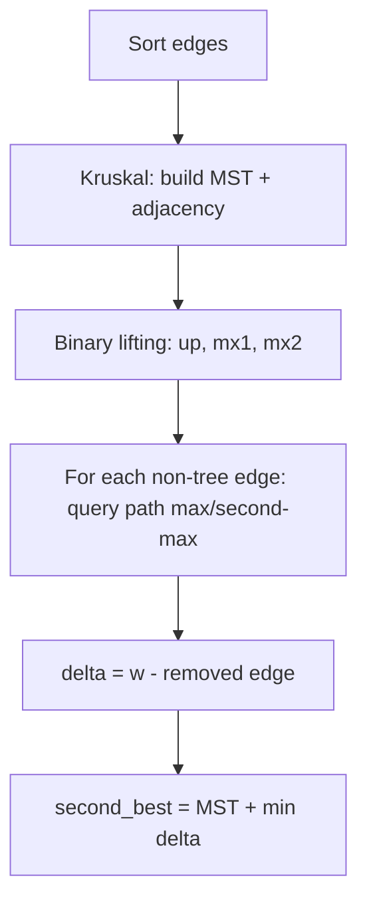

# Second-Best Minimum Spanning Tree — Junior Level

> **One-line summary:** The second-best minimum spanning tree (second-best MST) is the lowest-total-weight spanning tree that is *different* from the minimum spanning tree. The remarkable fact is that it differs from the MST by exactly **one edge swap**: you add one non-tree edge and remove one tree edge from the cycle that edge creates.

---

## Table of Contents

1. [Introduction](#introduction)
2. [Prerequisites](#prerequisites)
3. [Glossary](#glossary)
4. [Core Concepts](#core-concepts)
5. [Big-O Summary](#big-o-summary)
6. [Real-World Analogies](#real-world-analogies)
7. [Pros & Cons](#pros--cons)
8. [Step-by-Step Walkthrough](#step-by-step-walkthrough)
9. [Code Examples](#code-examples)
10. [Coding Patterns](#coding-patterns)
11. [Error Handling](#error-handling)
12. [Performance Tips](#performance-tips)
13. [Best Practices](#best-practices)
14. [Edge Cases & Pitfalls](#edge-cases--pitfalls)
15. [Common Mistakes](#common-mistakes)
16. [Cheat Sheet](#cheat-sheet)
17. [Visual Animation](#visual-animation)
18. [Summary](#summary)
19. [Further Reading](#further-reading)

---

## Introduction

A **minimum spanning tree (MST)** of a connected, weighted, undirected graph is a set of `V − 1` edges that connects every vertex with the smallest possible total weight. You already know how to build one — see the sibling topic **10-mst-kruskal-prim**.

But there is a natural follow-up question that shows up constantly in real systems: *"If I cannot use the cheapest network, what is the next-cheapest one?"* That is the **second-best minimum spanning tree**: a spanning tree whose total weight is the smallest among all spanning trees that are **not** the MST.

Why would you ever want that? Three everyday reasons:

1. **Backup networks.** You built the cheapest fiber layout (the MST). A contractor says one of those links cannot be dug. The second-best MST tells you the cheapest layout that avoids relying on the exact MST.
2. **Sensitivity analysis.** How fragile is your MST? If the second-best MST is only `1` unit heavier, your "optimal" plan has a near-equal rival and small price changes could flip the answer.
3. **Tie-breaking and alternatives.** When weights represent costs that may change, knowing the runner-up lets you re-plan instantly.

The beautiful structural fact — and the reason this topic is tractable — is:

> **The second-best MST differs from the MST by exactly one edge.**

You take the MST, **add** one edge that is not in it, which creates exactly one cycle, and **remove** the heaviest *other* edge on that cycle. Do this for every non-tree edge, keep the cheapest result, and you are done. The whole algorithm is "try every single swap, but compute each swap in `O(log V)` instead of `O(V)`."

---

## Prerequisites

Before this file you should be comfortable with:

- **Graphs** — vertices, edges, weights, adjacency lists. See **01-representation**.
- **Minimum spanning trees** — Kruskal and Prim. See **10-mst-kruskal-prim**. This topic builds *directly* on the MST you produce there.
- **Union–Find (DSU)** — Kruskal uses it; you will reuse it here.
- **Trees and paths** — between any two nodes of a tree there is exactly one simple path.
- **Big-O notation** — `O(E log V)`, `O(V²)`.

Optional but helpful:

- **Lowest Common Ancestor (LCA)** — the fast way to find the path-maximum. See **13-lca**.
- **Binary lifting** — the doubling table technique used to answer path queries in `O(log V)`.
- **Heavy-Light Decomposition** — an alternative path-query engine. See **14-heavy-light-decomposition**.

You can read this whole file using only the *naive* path-max method; the fast LCA version is presented as the upgrade.

---

## Glossary

| Term | Meaning |
|------|---------|
| **Spanning tree** | A subset of `V − 1` edges that connects all `V` vertices with no cycle. |
| **MST** | The spanning tree of minimum total weight. |
| **Second-best MST** | The minimum-weight spanning tree that is *different* from the MST. |
| **Tree edge** | An edge that belongs to the MST. |
| **Non-tree edge** | An edge of the graph that is *not* in the MST. |
| **Cycle (fundamental cycle)** | Adding any non-tree edge `(u,v)` to the MST creates exactly one cycle: the tree path `u → v` plus that edge. |
| **Edge swap** | Add a non-tree edge, remove a tree edge on the cycle it forms. The result is still a spanning tree. |
| **Path-max** | The maximum-weight edge on the MST path between two vertices. |
| **Path second-max** | The largest edge on the path that is *strictly smaller* than the path-max. Needed for equal-weight ties. |
| **Gain / delta** | `w(new edge) − w(removed edge)`. The weight change of a swap. We minimize this over all swaps. |
| **LCA** | Lowest common ancestor — the deepest node that is an ancestor of both query nodes. |
| **Binary lifting** | A `O(V log V)` table letting you jump `2^k` ancestors and aggregate along the jump in `O(log V)`. |

---

## Core Concepts

### 1. Every spanning tree near the MST is one swap away

Take the MST `T`. Pick any edge `e = (u, v)` that is **not** in `T`. Because `T` already connects `u` and `v` through a unique tree path, adding `e` closes a cycle. To get back to a tree (no cycle, still spanning), remove exactly one edge from that cycle — and to keep it a valid tree you must remove a *tree* edge on the path between `u` and `v`.

If you remove edge `f` from that path and add `e`, the new tree's weight is:

```
weight(T) − w(f) + w(e)
```

To make this as small as possible *for this fixed `e`*, you want `w(f)` as **large** as possible — so remove the **maximum-weight edge** on the tree path `u → v`. Call it `maxPathEdge(u, v)`.

### 2. The second-best MST formula

```
second_best = weight(MST) + min over all non-tree edges (u,v,w) of:
                  w − maxPathEdge(u, v)
```

But there is a subtlety with **equal weights**: if `w == maxPathEdge`, then `w − maxPathEdge = 0`, which would mean "the same weight." Is that a *different* tree? Yes — we added a different edge and removed a different one, so it is genuinely a different spanning tree of equal weight, and that *is* a valid second-best MST.

The trickier case is `w < maxPathEdge` (so this edge is heavier nowhere on the path) — there is still a swap if the path has a **second-maximum** edge strictly below `w`'s... no. Let us be precise. To form a *different* tree we must remove some tree edge `f` on the path. The cheapest result requires the **largest** path edge that is still `< w` when `w` equals the max (otherwise removing an equal edge is fine and gives delta 0). So we track both the **maximum** and the **second-maximum** edge on the path:

- If `w > maxPathEdge`: delta `= w − maxPathEdge` (best, removes the biggest edge).
- If `w == maxPathEdge`: delta `= 0` (swap to a different equal-weight tree).
- If `w < maxPathEdge` but a **second-max** edge exists: delta `= w − secondMaxPathEdge`.

The minimum non-negative delta across all non-tree edges, added to the MST weight, is the second-best MST.

### 3. Why we need the second-maximum

Imagine the path max edge has weight `5` and our non-tree edge also has weight `5`. We *cannot* remove the weight-`5` path edge and add our weight-`5` edge and call it "different and better" — actually we can: that is a different tree of the *same* total weight, which is a perfectly good second-best MST (delta 0). The second-maximum becomes essential only when `w` is *strictly less* than the max but we still want a valid distinct swap; then we must avoid removing an edge `≥ w` (which would make the tree heavier than the MST is supposed to allow), so we remove the largest edge `< w`, i.e. the second-max.

### 4. Computing path-max fast

The naive way: for each of the `E` non-tree edges, walk the tree path and scan for the max in `O(V)`. That is `O(E·V)` — fine for tiny graphs, too slow for large ones.

The fast way: use **LCA with binary lifting**. Build a doubling table where `mx1[k][v]` and `mx2[k][v]` store the first- and second-max edge on the `2^k`-length jump upward from `v`. Then any path-max query is `O(log V)`, giving `O((V + E) log V)` total. See **13-lca** for the LCA machinery.

---

## Big-O Summary

| Step | Time | Space | Notes |
|------|------|-------|-------|
| Build MST (Kruskal) | `O(E log E)` | `O(V + E)` | Sort edges + union-find. |
| Build LCA binary-lifting tables | `O(V log V)` | `O(V log V)` | `up`, `mx1`, `mx2`. |
| One path-max (+ second-max) query | `O(log V)` | `O(1)` | Per non-tree edge. |
| Scan all non-tree edges | `O(E log V)` | `O(1)` | The dominant loop. |
| **Total (LCA method)** | **`O((V + E) log V)`** | `O(V log V)` | The standard solution. |
| Naive path-max per edge | `O(E · V)` | `O(V)` | Only for small graphs / sanity checks. |

---

## Real-World Analogies

| Concept | Analogy |
|---------|---------|
| MST | The cheapest way to wire every house in a village to the water main. |
| Second-best MST | The cheapest *alternative* wiring if you are told one chosen pipe is unavailable, or you just need a backup plan. |
| Non-tree edge | A pipe route the planner rejected because it was more expensive than the chosen path. |
| Fundamental cycle | Picking a rejected route forms a loop with the existing pipes — water could now flow two ways between its endpoints. |
| Removing the path-max | To break the loop cheaply, cut the **most expensive** pipe on the loop — you save the most money by dropping the priciest segment. |
| Second-max trick | If the rejected route costs *exactly* as much as the priciest loop pipe, swapping them gives an equally cheap but different layout — still a valid runner-up. |

Where the analogy breaks: in real plumbing you might cut several pipes; here exactly one edge is added and one removed, always.

---

## Pros & Cons

| Pros | Cons |
|------|------|
| Reuses the MST you already built — no new graph traversal philosophy. | Requires a path-max engine (LCA or HLD) to be efficient. |
| Single-edge-swap theorem keeps the search small: only `E` candidates. | Equal-weight handling (second-max) is a classic source of bugs. |
| `O((V+E) log V)` is fast enough for `10^5`–`10^6` edges. | Disconnected graphs have no spanning tree at all — must be handled. |
| Directly powers backup-network and sensitivity analyses. | The naive `O(E·V)` version is tempting but does not scale. |
| Same scaffolding answers "critical / pseudo-critical edge" interview questions. | Multiple MSTs of equal weight make "different tree" subtle. |

**When to use:** backup/alternative network design, MST robustness and sensitivity analysis, "is this MST edge critical?" queries, contest problems asking for the runner-up tree.

**When NOT to use:** when you only need the MST; when the graph may be disconnected and you have not defined what "spanning" means; when you actually need the *k*-th best MST for large *k* (that needs a different, more general algorithm).

---

## Step-by-Step Walkthrough

Consider this small graph (5 vertices `0..4`):

```
edges (u, v, w):
  (0,1,1)  (1,2,2)  (2,3,3)  (3,4,4)   ← a path
  (0,2,2)  (1,3,5)  (0,4,6)             ← extra chords
```

**Step 1 — Build the MST (Kruskal, edges sorted by weight).**

Sorted: `(0,1,1), (1,2,2), (0,2,2), (2,3,3), (3,4,4), (1,3,5), (0,4,6)`.

- Take `(0,1,1)` → tree.
- Take `(1,2,2)` → tree.
- Skip `(0,2,2)` → 0 and 2 already connected (cycle).
- Take `(2,3,3)` → tree.
- Take `(3,4,4)` → tree.
- Now 4 edges, 5 vertices: MST complete. Skip the rest.

```
MST edges: (0,1,1), (1,2,2), (2,3,3), (3,4,4)
MST weight = 1 + 2 + 3 + 4 = 10
MST shape:  0 — 1 — 2 — 3 — 4   (a straight line)
```

Non-tree edges: `(0,2,2)`, `(1,3,5)`, `(0,4,6)`.

**Step 2 — For each non-tree edge, find the path-max (and second-max) on the MST path.**

- `(0,2,2)`: tree path `0–1–2` has edges `{1, 2}`. max = 2, second-max = 1.
  - `w = 2`, `w == max(2)` → delta = `0`. (Swap: add `(0,2,2)`, remove the weight-2 edge `(1,2)`. Different tree, same weight 10.)
- `(1,3,5)`: tree path `1–2–3` has edges `{2, 3}`. max = 3, second-max = 2.
  - `w = 5 > max(3)` → delta = `5 − 3 = 2`. (New tree weight 12.)
- `(0,4,6)`: tree path `0–1–2–3–4` has edges `{1,2,3,4}`. max = 4, second-max = 3.
  - `w = 6 > max(4)` → delta = `6 − 4 = 2`. (New tree weight 12.)

**Step 3 — Take the minimum delta.**

```
deltas = {0, 2, 2}
min delta = 0
second_best = MST_weight + min_delta = 10 + 0 = 10
```

So the second-best MST also weighs **10** — there are two distinct MSTs (because `(0,2,2)` ties with the weight-2 tree edge `(1,2)`). That is the correct answer: when two spanning trees share the minimum weight, the second-best equals the MST weight.

**A cleaner example where the answer is strictly larger:** drop edge `(0,2,2)`. Then the only non-tree edges are `(1,3,5)` and `(0,4,6)`, both giving delta 2, so the second-best MST weighs `10 + 2 = 12`.

---

## Code Examples

### Example: Second-Best MST with LCA path-max (first + second max)

The structure:
1. Kruskal builds the MST and records which edges are tree edges.
2. A binary-lifting LCA table stores, for each `2^k` jump, the first- and second-max edge weight.
3. For each non-tree edge, query the path (first, second) max and compute the swap delta.

#### Go

```go
package main

import (
	"fmt"
	"sort"
)

const NEG = -1 << 60

type Edge struct{ u, v, w int }

// merge two (first,second) max pairs into one.
func merge(a1, a2, b1, b2 int) (int, int) {
	first := a1
	if b1 > first {
		first = b1
	}
	second := NEG
	for _, x := range []int{a1, a2, b1, b2} {
		if x < first && x > second {
			second = x
		}
	}
	return first, second
}

type LCA struct {
	LOG         int
	up          [][]int
	mx1, mx2    [][]int
	depth       []int
}

func buildLCA(n int, adj [][][2]int) *LCA {
	LOG := 1
	for (1 << LOG) < n {
		LOG++
	}
	LOG++
	l := &LCA{LOG: LOG, depth: make([]int, n)}
	l.up = make([][]int, LOG)
	l.mx1 = make([][]int, LOG)
	l.mx2 = make([][]int, LOG)
	for k := 0; k < LOG; k++ {
		l.up[k] = make([]int, n)
		l.mx1[k] = make([]int, n)
		l.mx2[k] = make([]int, n)
		for i := range l.mx1[k] {
			l.mx1[k][i] = NEG
			l.mx2[k][i] = NEG
		}
	}
	// iterative DFS from root 0
	seen := make([]bool, n)
	stack := []int{0}
	seen[0] = true
	l.up[0][0] = 0
	for len(stack) > 0 {
		x := stack[len(stack)-1]
		stack = stack[:len(stack)-1]
		for _, e := range adj[x] {
			v, w := e[0], e[1]
			if !seen[v] {
				seen[v] = true
				l.depth[v] = l.depth[x] + 1
				l.up[0][v] = x
				l.mx1[0][v] = w
				stack = append(stack, v)
			}
		}
	}
	for k := 1; k < LOG; k++ {
		for v := 0; v < n; v++ {
			mid := l.up[k-1][v]
			l.up[k][v] = l.up[k-1][mid]
			l.mx1[k][v], l.mx2[k][v] = merge(
				l.mx1[k-1][v], l.mx2[k-1][v],
				l.mx1[k-1][mid], l.mx2[k-1][mid])
		}
	}
	return l
}

// query returns (first, second) max edge on the path u..v.
func (l *LCA) query(u, v int) (int, int) {
	m1, m2 := NEG, NEG
	if l.depth[u] < l.depth[v] {
		u, v = v, u
	}
	diff := l.depth[u] - l.depth[v]
	for k := 0; k < l.LOG; k++ {
		if (diff>>k)&1 == 1 {
			m1, m2 = merge(m1, m2, l.mx1[k][u], l.mx2[k][u])
			u = l.up[k][u]
		}
	}
	if u == v {
		return m1, m2
	}
	for k := l.LOG - 1; k >= 0; k-- {
		if l.up[k][u] != l.up[k][v] {
			m1, m2 = merge(m1, m2, l.mx1[k][u], l.mx2[k][u])
			m1, m2 = merge(m1, m2, l.mx1[k][v], l.mx2[k][v])
			u = l.up[k][u]
			v = l.up[k][v]
		}
	}
	m1, m2 = merge(m1, m2, l.mx1[0][u], l.mx2[0][u])
	m1, m2 = merge(m1, m2, l.mx1[0][v], l.mx2[0][v])
	return m1, m2
}

type DSU struct{ p []int }

func newDSU(n int) *DSU {
	d := &DSU{p: make([]int, n)}
	for i := range d.p {
		d.p[i] = i
	}
	return d
}
func (d *DSU) find(x int) int {
	for d.p[x] != x {
		d.p[x] = d.p[d.p[x]]
		x = d.p[x]
	}
	return x
}
func (d *DSU) union(a, b int) bool {
	ra, rb := d.find(a), d.find(b)
	if ra == rb {
		return false
	}
	d.p[ra] = rb
	return true
}

// secondBestMST returns (mstWeight, secondBestWeight, ok).
func secondBestMST(n int, edges []Edge) (int, int, bool) {
	idx := make([]int, len(edges))
	for i := range idx {
		idx[i] = i
	}
	sort.Slice(idx, func(a, b int) bool { return edges[idx[a]].w < edges[idx[b]].w })

	dsu := newDSU(n)
	inMST := make([]bool, len(edges))
	adj := make([][][2]int, n)
	mstW, cnt := 0, 0
	for _, i := range idx {
		e := edges[i]
		if dsu.union(e.u, e.v) {
			inMST[i] = true
			mstW += e.w
			cnt++
			adj[e.u] = append(adj[e.u], [2]int{e.v, e.w})
			adj[e.v] = append(adj[e.v], [2]int{e.u, e.w})
		}
	}
	if cnt != n-1 {
		return 0, 0, false // disconnected
	}
	lca := buildLCA(n, adj)
	best := 1 << 60
	for i, e := range edges {
		if inMST[i] {
			continue
		}
		m1, m2 := lca.query(e.u, e.v)
		var delta int
		switch {
		case e.w > m1:
			delta = e.w - m1
		case e.w == m1:
			delta = 0
		case m2 != NEG:
			delta = e.w - m2
		default:
			continue
		}
		if delta < best {
			best = delta
		}
	}
	if best == 1<<60 {
		return mstW, -1, true // no second tree exists (graph is a tree)
	}
	return mstW, mstW + best, true
}

func main() {
	edges := []Edge{
		{0, 1, 1}, {1, 2, 2}, {2, 3, 3}, {3, 4, 4},
		{0, 2, 2}, {1, 3, 5}, {0, 4, 6},
	}
	mst, second, ok := secondBestMST(5, edges)
	fmt.Println(ok, mst, second) // true 10 10
}
```

#### Java

```java
import java.util.*;

public class SecondBestMST {
    static final int NEG = Integer.MIN_VALUE / 4;
    static int LOG;
    static int[][] up, mx1, mx2;
    static int[] depth;

    static int[] merge(int a1, int a2, int b1, int b2) {
        int first = Math.max(a1, b1);
        int second = NEG;
        for (int x : new int[]{a1, a2, b1, b2}) {
            if (x < first && x > second) second = x;
        }
        return new int[]{first, second};
    }

    static void buildLCA(int n, List<int[]>[] adj) {
        LOG = 1;
        while ((1 << LOG) < n) LOG++;
        LOG++;
        up = new int[LOG][n];
        mx1 = new int[LOG][n];
        mx2 = new int[LOG][n];
        depth = new int[n];
        for (int[] row : mx1) Arrays.fill(row, NEG);
        for (int[] row : mx2) Arrays.fill(row, NEG);
        boolean[] seen = new boolean[n];
        Deque<Integer> st = new ArrayDeque<>();
        st.push(0);
        seen[0] = true;
        up[0][0] = 0;
        while (!st.isEmpty()) {
            int x = st.pop();
            for (int[] e : adj[x]) {
                int v = e[0], w = e[1];
                if (!seen[v]) {
                    seen[v] = true;
                    depth[v] = depth[x] + 1;
                    up[0][v] = x;
                    mx1[0][v] = w;
                    st.push(v);
                }
            }
        }
        for (int k = 1; k < LOG; k++) {
            for (int v = 0; v < n; v++) {
                int mid = up[k - 1][v];
                up[k][v] = up[k - 1][mid];
                int[] m = merge(mx1[k - 1][v], mx2[k - 1][v],
                                mx1[k - 1][mid], mx2[k - 1][mid]);
                mx1[k][v] = m[0];
                mx2[k][v] = m[1];
            }
        }
    }

    static int[] query(int u, int v) {
        int m1 = NEG, m2 = NEG;
        if (depth[u] < depth[v]) { int t = u; u = v; v = t; }
        int diff = depth[u] - depth[v];
        for (int k = 0; k < LOG; k++) {
            if (((diff >> k) & 1) == 1) {
                int[] m = merge(m1, m2, mx1[k][u], mx2[k][u]);
                m1 = m[0]; m2 = m[1];
                u = up[k][u];
            }
        }
        if (u == v) return new int[]{m1, m2};
        for (int k = LOG - 1; k >= 0; k--) {
            if (up[k][u] != up[k][v]) {
                int[] a = merge(m1, m2, mx1[k][u], mx2[k][u]);
                int[] b = merge(a[0], a[1], mx1[k][v], mx2[k][v]);
                m1 = b[0]; m2 = b[1];
                u = up[k][u]; v = up[k][v];
            }
        }
        int[] a = merge(m1, m2, mx1[0][u], mx2[0][u]);
        int[] b = merge(a[0], a[1], mx1[0][v], mx2[0][v]);
        return new int[]{b[0], b[1]};
    }

    static int[] parent;
    static int find(int x) {
        while (parent[x] != x) { parent[x] = parent[parent[x]]; x = parent[x]; }
        return x;
    }

    // returns {mstWeight, secondWeight, ok(1/0)}; secondWeight = -1 if none
    static long[] secondBest(int n, int[][] edges) {
        Integer[] idx = new Integer[edges.length];
        for (int i = 0; i < idx.length; i++) idx[i] = i;
        Arrays.sort(idx, (a, b) -> Integer.compare(edges[a][2], edges[b][2]));
        parent = new int[n];
        for (int i = 0; i < n; i++) parent[i] = i;
        boolean[] inMST = new boolean[edges.length];
        List<int[]>[] adj = new List[n];
        for (int i = 0; i < n; i++) adj[i] = new ArrayList<>();
        long mstW = 0; int cnt = 0;
        for (int i : idx) {
            int u = edges[i][0], v = edges[i][1], w = edges[i][2];
            int ru = find(u), rv = find(v);
            if (ru != rv) {
                parent[ru] = rv;
                inMST[i] = true;
                mstW += w; cnt++;
                adj[u].add(new int[]{v, w});
                adj[v].add(new int[]{u, w});
            }
        }
        if (cnt != n - 1) return new long[]{0, 0, 0};
        buildLCA(n, adj);
        long best = Long.MAX_VALUE;
        for (int i = 0; i < edges.length; i++) {
            if (inMST[i]) continue;
            int[] m = query(edges[i][0], edges[i][1]);
            int w = edges[i][2];
            long delta;
            if (w > m[0]) delta = w - m[0];
            else if (w == m[0]) delta = 0;
            else if (m[1] != NEG) delta = w - m[1];
            else continue;
            best = Math.min(best, delta);
        }
        if (best == Long.MAX_VALUE) return new long[]{mstW, -1, 1};
        return new long[]{mstW, mstW + best, 1};
    }

    public static void main(String[] args) {
        int[][] edges = {
            {0, 1, 1}, {1, 2, 2}, {2, 3, 3}, {3, 4, 4},
            {0, 2, 2}, {1, 3, 5}, {0, 4, 6}
        };
        long[] r = secondBest(5, edges);
        System.out.println(r[2] + " " + r[0] + " " + r[1]); // 1 10 10
    }
}
```

#### Python

```python
import sys
from typing import List, Tuple, Optional

NEG = float("-inf")


def merge(a1, a2, b1, b2):
    vals = sorted([a1, a2, b1, b2], reverse=True)
    first = vals[0]
    second = NEG
    for x in vals[1:]:
        if x < first:
            second = x
            break
    return first, second


class LCA:
    def __init__(self, n: int, adj: List[List[Tuple[int, int]]]):
        self.n = n
        self.LOG = max(1, n.bit_length()) + 1
        self.up = [[0] * n for _ in range(self.LOG)]
        self.mx1 = [[NEG] * n for _ in range(self.LOG)]
        self.mx2 = [[NEG] * n for _ in range(self.LOG)]
        self.depth = [0] * n
        seen = [False] * n
        seen[0] = True
        stack = [0]
        while stack:
            x = stack.pop()
            for v, w in adj[x]:
                if not seen[v]:
                    seen[v] = True
                    self.depth[v] = self.depth[x] + 1
                    self.up[0][v] = x
                    self.mx1[0][v] = w
                    stack.append(v)
        for k in range(1, self.LOG):
            for v in range(n):
                mid = self.up[k - 1][v]
                self.up[k][v] = self.up[k - 1][mid]
                self.mx1[k][v], self.mx2[k][v] = merge(
                    self.mx1[k - 1][v], self.mx2[k - 1][v],
                    self.mx1[k - 1][mid], self.mx2[k - 1][mid])

    def query(self, u: int, v: int):
        m1 = m2 = NEG
        if self.depth[u] < self.depth[v]:
            u, v = v, u
        diff = self.depth[u] - self.depth[v]
        for k in range(self.LOG):
            if (diff >> k) & 1:
                m1, m2 = merge(m1, m2, self.mx1[k][u], self.mx2[k][u])
                u = self.up[k][u]
        if u == v:
            return m1, m2
        for k in range(self.LOG - 1, -1, -1):
            if self.up[k][u] != self.up[k][v]:
                m1, m2 = merge(m1, m2, self.mx1[k][u], self.mx2[k][u])
                m1, m2 = merge(m1, m2, self.mx1[k][v], self.mx2[k][v])
                u = self.up[k][u]
                v = self.up[k][v]
        m1, m2 = merge(m1, m2, self.mx1[0][u], self.mx2[0][u])
        m1, m2 = merge(m1, m2, self.mx1[0][v], self.mx2[0][v])
        return m1, m2


def second_best_mst(n: int, edges: List[Tuple[int, int, int]]):
    order = sorted(range(len(edges)), key=lambda i: edges[i][2])
    parent = list(range(n))

    def find(x):
        while parent[x] != x:
            parent[x] = parent[parent[x]]
            x = parent[x]
        return x

    in_mst = [False] * len(edges)
    adj: List[List[Tuple[int, int]]] = [[] for _ in range(n)]
    mst_w = cnt = 0
    for i in order:
        u, v, w = edges[i]
        ru, rv = find(u), find(v)
        if ru != rv:
            parent[ru] = rv
            in_mst[i] = True
            mst_w += w
            cnt += 1
            adj[u].append((v, w))
            adj[v].append((u, w))
    if cnt != n - 1:
        return None  # disconnected

    lca = LCA(n, adj)
    best = float("inf")
    for i, (u, v, w) in enumerate(edges):
        if in_mst[i]:
            continue
        m1, m2 = lca.query(u, v)
        if w > m1:
            delta = w - m1
        elif w == m1:
            delta = 0
        elif m2 != NEG:
            delta = w - m2
        else:
            continue
        best = min(best, delta)
    if best == float("inf"):
        return (mst_w, None)  # graph is itself a tree
    return (mst_w, mst_w + best)


if __name__ == "__main__":
    edges = [
        (0, 1, 1), (1, 2, 2), (2, 3, 3), (3, 4, 4),
        (0, 2, 2), (1, 3, 5), (0, 4, 6),
    ]
    print(second_best_mst(5, edges))  # (10, 10)
```

**What it does:** builds the MST, then evaluates every non-tree edge swap in `O(log V)` using a first/second path-max LCA, and reports the second-best spanning-tree weight.
**Run:** `go run main.go` | `javac SecondBestMST.java && java SecondBestMST` | `python second_best_mst.py`

---

## Coding Patterns

### Pattern 1: "Add a non-tree edge, remove the path-max"

**Intent:** Compute the cost of the best swap for a fixed non-tree edge.

```python
def swap_delta(w, path_first_max, path_second_max):
    if w > path_first_max:
        return w - path_first_max
    if w == path_first_max:
        return 0
    if path_second_max != float("-inf"):
        return w - path_second_max
    return None  # no valid distinct swap through this edge
```

This three-branch decision is the heart of the whole topic. Memorize it.

### Pattern 2: First + second maximum as a mergeable pair

**Intent:** Aggregate two `(max1, max2)` pairs while keeping them distinct in value.

The `merge` helper takes four numbers and returns the two largest *distinct* values. Storing this pair in the binary-lifting table lets you answer "second-max on a path" in `O(log V)`.

### Pattern 3: Reuse the MST adjacency as the LCA tree

**Intent:** Avoid building a second graph. The MST's `V − 1` edges *are* the tree the LCA runs on. Build `adj` while running Kruskal.



---

## Error Handling

| Error | Cause | Fix |
|-------|-------|-----|
| Wrong answer when weights tie | Used only `w > max`, missed the `w == max` (delta 0) branch. | Add the explicit equal-weight branch returning delta 0. |
| `secondMax` stays `-inf` and you subtract it | Path had only one distinct edge weight and `w < max`. | Skip that edge (no valid distinct swap through it). |
| Index out of range in LCA tables | `LOG` too small for `n`. | Set `LOG = ceil(log2(n)) + 1`. |
| Counts `cnt != n-1` but you proceed | Graph is disconnected — no spanning tree. | Return a sentinel (None / ok=false) before building LCA. |
| Off-by-one in depth lifting | Lifting `u` past the LCA. | First equalize depths, then lift both while parents differ, then take one more step. |

---

## Performance Tips

- **Build the LCA tables once.** They cost `O(V log V)` and serve all `E` queries.
- **Store edges, not adjacency, for the non-tree scan.** You iterate the original edge list and check `inMST[i]`.
- **Use iterative DFS/BFS** to set parents and depths — recursion overflows on long paths (`V = 10^5`).
- **Keep weights as `int64`** when summing MST weight over many large edges to avoid overflow.
- **Cache `LOG` in a local** inside the query loops; repeated field access is slower in hot loops.

---

## Best Practices

- Always write a **brute-force checker** (enumerate spanning trees) for small graphs and fuzz your fast version against it. The equal-weight case is where bugs hide.
- Decide and document what your function returns when the graph is **already a tree** (no second-best exists) and when it is **disconnected**.
- Reuse your existing **Kruskal/DSU** code from **10-mst-kruskal-prim** rather than rewriting it.
- Keep the `merge(first, second)` helper tiny and well-tested; everything depends on it.
- Name the three swap branches in comments — future readers will not reconstruct the equal-weight logic from the arithmetic alone.

---

## Edge Cases & Pitfalls

- **Graph is a single tree** — every edge is a tree edge, no non-tree edge exists, so there is no second-best MST. Return a sentinel.
- **Disconnected graph** — no spanning tree at all; the MST step fails (`cnt < n − 1`). Detect and bail out.
- **Multiple MSTs of equal weight** — the second-best MST weight *equals* the MST weight (delta 0 via the equal-weight branch). This is correct, not a bug.
- **Parallel edges** — two edges between the same pair: the cheaper goes into the MST, the other is a non-tree edge whose path is a single tree edge.
- **Self-loops** — never part of any spanning tree; filter them out.
- **All equal weights** — every spanning tree has weight `(V−1)·w`, so second-best equals MST.

---

## Common Mistakes

1. **Forgetting the equal-weight branch.** `w == path_max` must give delta 0, not `w − max` only when strictly greater. This is the single most common bug and exactly what the brute-force checker catches.
2. **Subtracting a `-inf` second-max.** When `w < max` and no second-max exists, there is no valid distinct swap — skip, do not compute `w − (−inf)`.
3. **Walking the path naively in the inner loop.** `O(E·V)` looks fine on samples and times out on real inputs. Use LCA.
4. **Including tree edges in the scan.** A tree edge's "swap" is itself — skip edges where `inMST[i]` is true.
5. **Assuming the second-best is always strictly heavier.** With ties it equals the MST weight.
6. **Recursive DFS on a path graph.** A line of `10^5` nodes overflows the stack; iterate.

---

## Cheat Sheet

| Quantity | Formula |
|----------|---------|
| MST weight | `Σ w(e)` over chosen Kruskal edges. |
| Swap delta (`w > max`) | `w − maxPathEdge` |
| Swap delta (`w == max`) | `0` |
| Swap delta (`w < max`, second-max exists) | `w − secondMaxPathEdge` |
| Second-best MST | `MST_weight + min(delta over non-tree edges)` |
| Path query cost | `O(log V)` with binary lifting |
| Total | `O((V + E) log V)` |

```
For each non-tree edge (u, v, w):
    (m1, m2) = pathMax(u, v)        # first and second max edge on MST path
    if   w > m1: delta = w - m1
    elif w == m1: delta = 0
    elif m2 exists: delta = w - m2
    else: skip
answer = MST_weight + min(delta)
```

---

## Visual Animation

> See [`animation.html`](./animation.html) for an interactive visualization.
>
> The animation demonstrates:
> - Building the MST and highlighting tree vs non-tree edges.
> - Selecting a non-tree edge and lighting up the MST path it closes.
> - Identifying the maximum edge on that path being swapped out.
> - The resulting second-best tree and its total weight.
> - Step / Run / Reset controls.

---

## Summary

The second-best minimum spanning tree is the cheapest spanning tree that is not the MST, and it always differs from the MST by exactly **one edge swap**: add a non-tree edge `(u,v,w)`, remove the heaviest edge on the MST path between `u` and `v`. The answer is `MST_weight + min over non-tree edges of (w − removedEdge)`, where the removed edge is the path-max if `w` exceeds it, gives delta 0 if `w` equals it, and is the path second-max when `w` is smaller. Compute all path-maxima in `O(log V)` each with an LCA binary-lifting table, for an overall `O((V + E) log V)` algorithm. Master the three-branch swap rule and the first/second-max merge, and you can solve this, MST sensitivity, and critical-edge problems with the same code.

---

## Further Reading

- cp-algorithms — "Second best Minimum Spanning Tree."
- CLRS, Chapter 23 — Minimum Spanning Trees (problem 23-1 covers second-best MST).
- Sibling topic **10-mst-kruskal-prim** — the MST you build on.
- Sibling topic **13-lca** — the path-query engine (binary lifting).
- Sibling topic **14-heavy-light-decomposition** — an alternative path-max method.
- USACO Guide — "Minimum Spanning Trees" advanced section.
