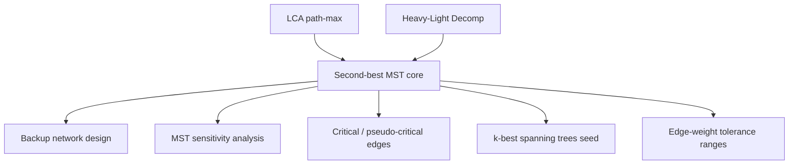

# Second-Best Minimum Spanning Tree — Middle Level

> **Focus:** Why exactly one edge swap suffices, how to compute path-maxima three different ways, how to get equal-weight handling right, and how this composes with LCA and heavy-light decomposition.

---

## Table of Contents

1. [Introduction](#introduction)
2. [Deeper Concepts](#deeper-concepts)
3. [Comparison with Alternatives](#comparison-with-alternatives)
4. [Advanced Patterns](#advanced-patterns)
5. [Graph and Tree Applications](#graph-and-tree-applications)
6. [Dynamic Programming Integration](#dynamic-programming-integration)
7. [Code Examples](#code-examples)
8. [Error Handling](#error-handling)
9. [Performance Analysis](#performance-analysis)
10. [Best Practices](#best-practices)
11. [Visual Animation](#visual-animation)
12. [Summary](#summary)

---

## Introduction

At junior level the second-best MST is "add a non-tree edge, drop the path-max." At middle level you start asking the engineering questions:

- *Why* is one swap always enough? Could the second-best tree differ by two edges?
- Why does the naive `O(E·V)` approach explode, and which faster method should I pick — LCA binary lifting, heavy-light decomposition, or offline Kruskal-tree queries?
- Why does the equal-weight case need a *second*-maximum, and what exactly goes wrong without it?
- How do I extend this to "critical and pseudo-critical MST edges," which is the same machinery in disguise?

These distinctions decide whether your solution is `O((V+E) log V)` and correct, or `O(E·V)` and subtly wrong on ties.

---

## Deeper Concepts

### The single-swap structure

Let `T` be the MST and `T'` the second-best MST. Consider the symmetric difference `T △ T'` — edges in exactly one of the two trees. A classic exchange argument (proved formally in [`professional.md`](./professional.md)) shows:

> `|T △ T'| = 2`. That is, `T'` is obtained from `T` by **removing one edge and adding one edge**.

Intuition: if `T'` differed from `T` by two or more swaps, you could "undo" the most expensive of those swaps and obtain a tree *strictly between* `T` and `T'` in weight that is still different from `T` — contradicting `T'` being the *second*-smallest. So the search space is just the `E − (V−1)` non-tree edges, each contributing one candidate.

### The swap delta, precisely

For a non-tree edge `e = (u, v, w)`, adding it to `T` creates the fundamental cycle: the tree path `u ⇝ v` plus `e`. Removing any tree edge `f` on that path yields a new spanning tree of weight `weight(T) − w(f) + w`. To minimize, maximize `w(f)`:

- If `w > max_f w(f)`: remove the path-max. delta `= w − max`.
- If `w == max_f w(f)`: removing that max edge gives an **equal-weight but different** tree. delta `= 0`.
- If `w < max_f w(f)`: we still need a *distinct* tree. We must remove an edge `< w`... but wait — removing an edge heavier than `w` would make the tree heavier than `T` while still valid, but would it ever be the *minimum*? No: removing the path-max (heavier than `w`) gives delta `w − max < 0`, which is impossible because `T` is already minimum. The resolution: such a swap would have *already been taken* by Kruskal. The only relevant distinct swap when `w < max` is removing the **second-max** edge (the largest edge strictly below the max), giving delta `w − secondMax`, used when even the max equals `w`.

Putting the cases together, the safe rule (matching brute force) is:

```
if   w >  pathFirstMax:  delta = w - pathFirstMax
elif w == pathFirstMax:  delta = 0
elif pathSecondMax exists: delta = w - pathSecondMax
else: no valid swap through this edge
```

### Why the second-maximum is genuinely necessary

Suppose the MST path between `u` and `v` has edges of weights `{5, 5, 3}` and our non-tree edge `e` has weight `5`. The path-max is `5`. If we *only* tracked the max, we would compute delta `5 − 5 = 0` and stop. That happens to be right here. Now suppose `e` has weight `4` instead, with path edges `{5, 4, 3}`. We cannot remove the weight-`5` edge (that gives delta `4 − 5 = −1 < 0`, impossible — Kruskal would have used `e`). The largest edge strictly below `4`... is `3` (the second distinct max below 5 that is `< w`). The "second-max" we store is the largest edge **strictly less than the first-max**; in the path `{5,4,3}`, first-max `= 5`, second-max `= 4`. For `w = 4`, `w == secondMax`, so we get delta 0 — a different equal-weight tree by swapping out the weight-4 edge. The second-max field is what lets us reach edges that are not the global max yet still form a valid distinct swap.

### The fundamental cycle and `pathMax`

Every non-tree edge defines a **fundamental cycle** with respect to `T`. The whole problem reduces to: *for each non-tree edge, what is the largest (and second-largest) edge on the tree path between its endpoints?* This is a classic **path aggregate query** on a tree, which is exactly what LCA binary lifting, heavy-light decomposition, and Euler-tour + sparse tables all solve.

---

## Comparison with Alternatives

How to compute all the path-maxima — the only nontrivial subroutine.

| Method | Preprocess | Per query | Total | Code size | When |
|--------|-----------|-----------|-------|-----------|------|
| **Naive remove-each-MST-edge** | none | — | `O(E · (V−1))` rebuild | tiny | `V ≤ 1000`, sanity checks, brute checker. |
| **Naive path walk per edge** | none | `O(V)` | `O(E · V)` | tiny | small graphs only. |
| **LCA binary lifting (first+second max)** | `O(V log V)` | `O(log V)` | `O((V+E) log V)` | medium | the standard answer. |
| **Heavy-Light Decomposition + segment tree** | `O(V log V)` | `O(log² V)` | `O(V log V + E log² V)` | larger | when you also need *updates* to edge weights. |
| **Euler tour + sparse table (RMQ over edges)** | `O(V log V)` | `O(1)` after LCA | `O((V+E) log V)` build, `O(1)` query | medium | many queries, static tree. |
| **Offline Kruskal reconstruction tree** | `O(E log E)` | `O(α)` with DSU on tree | `O(E log E)` | larger | very large `E`, all queries known up front. |

**Naive O(E·MST):** for each non-tree edge, conceptually remove each MST edge and rebuild — or just walk the path. Correct and trivial, but quadratic. Use only to validate.

**LCA binary lifting** is the sweet spot: medium code, `O(log V)` per query, handles first + second max with a tiny merge. This is what almost every competitive and interview solution uses. See **13-lca**.

**Heavy-Light Decomposition** wins when edge weights can change between queries (dynamic sensitivity analysis): a segment tree over the HLD chains supports point-update + path-max-query. See **14-heavy-light-decomposition**. The cost is `O(log² V)` per query and more code.

---

## Advanced Patterns

### Pattern: binary-lifting path max AND second-max

The doubling table stores, for each node `v` and power `k`, the first- and second-max edge weight on the `2^k`-step climb from `v`. The merge operation combines two such pairs:

```python
def merge(a1, a2, b1, b2):
    vals = sorted([a1, a2, b1, b2], reverse=True)
    first = vals[0]
    for x in vals[1:]:
        if x < first:
            return first, x
    return first, float("-inf")
```

The "second" is the largest value **strictly less** than the first — crucial, because two equal maxima must collapse to a single distinct first, not be reported as `(5, 5)`.

### Pattern: equal-weight-safe swap decision

```python
def swap_delta(w, first_max, second_max):
    if w > first_max:
        return w - first_max         # strictly improves the removable edge
    if w == first_max:
        return 0                     # different tree, same total weight
    if second_max != float("-inf"):
        return w - second_max        # distinct swap below the max
    return None                      # no valid distinct swap
```

### Pattern: Kruskal reconstruction tree (offline alternative)

Instead of LCA over the MST, build the **Kruskal reconstruction tree**: process edges in increasing weight; each union creates a new internal node whose value is the edge weight, with the two components as children. The path-max between `u` and `v` becomes the value of their LCA in this auxiliary tree. This makes path-max queries `O(α)` after an `O(E log E)` build and is favored when `E` is huge. (Second-max needs a small extension storing the two largest weights along ancestor chains.)

### Pattern: reuse for critical / pseudo-critical edges

An edge is **critical** if removing it increases the MST weight (it is in *every* MST); **pseudo-critical** if it appears in *some* MST but is not critical. The same path-max machinery answers both: an edge `(u,v,w)` is *non-critical* iff there is another edge of weight `w` on its fundamental cycle (i.e. `w == pathMax` for the cut). This is the LeetCode "Find Critical and Pseudo-Critical Edges" problem, solved with the identical building blocks.

---

## Graph and Tree Applications



### Sensitivity: how much can an edge weight change?

For a **tree edge** `f`, the MST stays optimal as long as `w(f)` does not exceed the smallest non-tree edge whose fundamental cycle contains `f`. For a **non-tree edge** `e`, the MST stays optimal as long as `w(e) ≥ pathMax` on its cycle. The gap between `w(e)` and `pathMax` is exactly the swap delta from the second-best computation — so the second-best MST and edge-tolerance analysis share one engine.

### Backup networks

If a planned MST link is lost, the cheapest reconnection through the *next* candidate is the swap that the second-best MST identifies, restricted to swaps whose removed edge is the lost link.

---

## Dynamic Programming Integration

The binary-lifting table is itself a small DP on the tree:

```
up[0][v]   = parent(v)
mx1[0][v]  = weight(edge v → parent)
mx2[0][v]  = -inf

up[k][v]   = up[k-1][ up[k-1][v] ]
(mx1,mx2)[k][v] = merge( (mx1,mx2)[k-1][v], (mx1,mx2)[k-1][ up[k-1][v] ] )
```

State: `(node, power)`. Transition: compose a `2^{k-1}` jump with the next `2^{k-1}` jump, aggregating the max-pair. This is the canonical "binary lifting is sparse-table DP on ancestors" pattern; the only twist is the `merge` that keeps two distinct maxima.

#### Go

```go
// DP build of the lifting tables (excerpt). adj is the MST adjacency.
for k := 1; k < LOG; k++ {
	for v := 0; v < n; v++ {
		mid := up[k-1][v]
		up[k][v] = up[k-1][mid]
		mx1[k][v], mx2[k][v] = merge(
			mx1[k-1][v], mx2[k-1][v],
			mx1[k-1][mid], mx2[k-1][mid])
	}
}
```

#### Java

```java
for (int k = 1; k < LOG; k++) {
    for (int v = 0; v < n; v++) {
        int mid = up[k - 1][v];
        up[k][v] = up[k - 1][mid];
        int[] m = merge(mx1[k - 1][v], mx2[k - 1][v],
                        mx1[k - 1][mid], mx2[k - 1][mid]);
        mx1[k][v] = m[0];
        mx2[k][v] = m[1];
    }
}
```

#### Python

```python
for k in range(1, LOG):
    for v in range(n):
        mid = up[k - 1][v]
        up[k][v] = up[k - 1][mid]
        mx1[k][v], mx2[k][v] = merge(
            mx1[k - 1][v], mx2[k - 1][v],
            mx1[k - 1][mid], mx2[k - 1][mid])
```

---

## Code Examples

### Full second-best MST returning the actual swap (which edge in, which out)

This version not only returns the weight but also *which* non-tree edge to add and *which* tree-edge weight to drop — useful for backup-network reporting.

#### Go

```go
package main

import (
	"fmt"
	"sort"
)

const NEG = -1 << 60

type Edge struct{ u, v, w int }

func merge(a1, a2, b1, b2 int) (int, int) {
	first := a1
	if b1 > first {
		first = b1
	}
	second := NEG
	for _, x := range []int{a1, a2, b1, b2} {
		if x < first && x > second {
			second = x
		}
	}
	return first, second
}

var (
	LOG      int
	up       [][]int
	mx1, mx2 [][]int
	depth    []int
)

func buildLCA(n int, adj [][][2]int) {
	LOG = 1
	for (1 << LOG) < n {
		LOG++
	}
	LOG++
	up = make([][]int, LOG)
	mx1 = make([][]int, LOG)
	mx2 = make([][]int, LOG)
	depth = make([]int, n)
	for k := 0; k < LOG; k++ {
		up[k] = make([]int, n)
		mx1[k] = make([]int, n)
		mx2[k] = make([]int, n)
		for i := 0; i < n; i++ {
			mx1[k][i], mx2[k][i] = NEG, NEG
		}
	}
	seen := make([]bool, n)
	st := []int{0}
	seen[0] = true
	for len(st) > 0 {
		x := st[len(st)-1]
		st = st[:len(st)-1]
		for _, e := range adj[x] {
			v, w := e[0], e[1]
			if !seen[v] {
				seen[v] = true
				depth[v] = depth[x] + 1
				up[0][v] = x
				mx1[0][v] = w
				st = append(st, v)
			}
		}
	}
	for k := 1; k < LOG; k++ {
		for v := 0; v < n; v++ {
			mid := up[k-1][v]
			up[k][v] = up[k-1][mid]
			mx1[k][v], mx2[k][v] = merge(mx1[k-1][v], mx2[k-1][v], mx1[k-1][mid], mx2[k-1][mid])
		}
	}
}

func query(u, v int) (int, int) {
	m1, m2 := NEG, NEG
	if depth[u] < depth[v] {
		u, v = v, u
	}
	d := depth[u] - depth[v]
	for k := 0; k < LOG; k++ {
		if (d>>k)&1 == 1 {
			m1, m2 = merge(m1, m2, mx1[k][u], mx2[k][u])
			u = up[k][u]
		}
	}
	if u == v {
		return m1, m2
	}
	for k := LOG - 1; k >= 0; k-- {
		if up[k][u] != up[k][v] {
			m1, m2 = merge(m1, m2, mx1[k][u], mx2[k][u])
			m1, m2 = merge(m1, m2, mx1[k][v], mx2[k][v])
			u, v = up[k][u], up[k][v]
		}
	}
	m1, m2 = merge(m1, m2, mx1[0][u], mx2[0][u])
	m1, m2 = merge(m1, m2, mx1[0][v], mx2[0][v])
	return m1, m2
}

func secondBest(n int, edges []Edge) (mstW, secW int, addIdx, dropW int, ok bool) {
	idx := make([]int, len(edges))
	for i := range idx {
		idx[i] = i
	}
	sort.Slice(idx, func(a, b int) bool { return edges[idx[a]].w < edges[idx[b]].w })
	parent := make([]int, n)
	for i := range parent {
		parent[i] = i
	}
	var find func(int) int
	find = func(x int) int {
		for parent[x] != x {
			parent[x] = parent[parent[x]]
			x = parent[x]
		}
		return x
	}
	inMST := make([]bool, len(edges))
	adj := make([][][2]int, n)
	cnt := 0
	for _, i := range idx {
		e := edges[i]
		ru, rv := find(e.u), find(e.v)
		if ru != rv {
			parent[ru] = rv
			inMST[i] = true
			mstW += e.w
			cnt++
			adj[e.u] = append(adj[e.u], [2]int{e.v, e.w})
			adj[e.v] = append(adj[e.v], [2]int{e.u, e.w})
		}
	}
	if cnt != n-1 {
		return 0, 0, -1, 0, false
	}
	buildLCA(n, adj)
	best := 1 << 60
	addIdx, dropW = -1, 0
	for i, e := range edges {
		if inMST[i] {
			continue
		}
		m1, m2 := query(e.u, e.v)
		var delta, removed int
		switch {
		case e.w > m1:
			delta, removed = e.w-m1, m1
		case e.w == m1:
			delta, removed = 0, m1
		case m2 != NEG:
			delta, removed = e.w-m2, m2
		default:
			continue
		}
		if delta < best {
			best, addIdx, dropW = delta, i, removed
		}
	}
	if best == 1<<60 {
		return mstW, -1, -1, 0, true
	}
	return mstW, mstW + best, addIdx, dropW, true
}

func main() {
	edges := []Edge{
		{0, 1, 1}, {1, 2, 2}, {2, 3, 3}, {3, 4, 4},
		{1, 3, 5}, {0, 4, 6}, // no (0,2,2) tie this time
	}
	mst, sec, add, drop, ok := secondBest(5, edges)
	fmt.Println(ok, "mst:", mst, "second:", sec, "add edge index:", add, "drop weight:", drop)
	// true mst: 10 second: 12 add edge index: 4 drop weight: 3
}
```

#### Java

```java
import java.util.*;

public class SecondBestSwap {
    static final int NEG = Integer.MIN_VALUE / 4;
    static int LOG;
    static int[][] up, mx1, mx2;
    static int[] depth;

    static int[] merge(int a1, int a2, int b1, int b2) {
        int first = Math.max(a1, b1), second = NEG;
        for (int x : new int[]{a1, a2, b1, b2})
            if (x < first && x > second) second = x;
        return new int[]{first, second};
    }

    static void buildLCA(int n, List<int[]>[] adj) {
        LOG = 1;
        while ((1 << LOG) < n) LOG++;
        LOG++;
        up = new int[LOG][n];
        mx1 = new int[LOG][n];
        mx2 = new int[LOG][n];
        depth = new int[n];
        for (int[] r : mx1) Arrays.fill(r, NEG);
        for (int[] r : mx2) Arrays.fill(r, NEG);
        boolean[] seen = new boolean[n];
        Deque<Integer> st = new ArrayDeque<>();
        st.push(0);
        seen[0] = true;
        while (!st.isEmpty()) {
            int x = st.pop();
            for (int[] e : adj[x]) {
                if (!seen[e[0]]) {
                    seen[e[0]] = true;
                    depth[e[0]] = depth[x] + 1;
                    up[0][e[0]] = x;
                    mx1[0][e[0]] = e[1];
                    st.push(e[0]);
                }
            }
        }
        for (int k = 1; k < LOG; k++)
            for (int v = 0; v < n; v++) {
                int mid = up[k - 1][v];
                up[k][v] = up[k - 1][mid];
                int[] m = merge(mx1[k - 1][v], mx2[k - 1][v], mx1[k - 1][mid], mx2[k - 1][mid]);
                mx1[k][v] = m[0];
                mx2[k][v] = m[1];
            }
    }

    static int[] query(int u, int v) {
        int m1 = NEG, m2 = NEG;
        if (depth[u] < depth[v]) { int t = u; u = v; v = t; }
        int d = depth[u] - depth[v];
        for (int k = 0; k < LOG; k++)
            if (((d >> k) & 1) == 1) {
                int[] m = merge(m1, m2, mx1[k][u], mx2[k][u]);
                m1 = m[0]; m2 = m[1];
                u = up[k][u];
            }
        if (u == v) return new int[]{m1, m2};
        for (int k = LOG - 1; k >= 0; k--)
            if (up[k][u] != up[k][v]) {
                int[] a = merge(m1, m2, mx1[k][u], mx2[k][u]);
                int[] b = merge(a[0], a[1], mx1[k][v], mx2[k][v]);
                m1 = b[0]; m2 = b[1];
                u = up[k][u]; v = up[k][v];
            }
        int[] a = merge(m1, m2, mx1[0][u], mx2[0][u]);
        int[] b = merge(a[0], a[1], mx1[0][v], mx2[0][v]);
        return new int[]{b[0], b[1]};
    }

    static int[] par;
    static int find(int x) { while (par[x] != x) { par[x] = par[par[x]]; x = par[x]; } return x; }

    public static void main(String[] args) {
        int[][] edges = {
            {0, 1, 1}, {1, 2, 2}, {2, 3, 3}, {3, 4, 4}, {1, 3, 5}, {0, 4, 6}
        };
        int n = 5;
        Integer[] idx = new Integer[edges.length];
        for (int i = 0; i < idx.length; i++) idx[i] = i;
        Arrays.sort(idx, (a, b) -> Integer.compare(edges[a][2], edges[b][2]));
        par = new int[n];
        for (int i = 0; i < n; i++) par[i] = i;
        boolean[] inMST = new boolean[edges.length];
        List<int[]>[] adj = new List[n];
        for (int i = 0; i < n; i++) adj[i] = new ArrayList<>();
        long mstW = 0; int cnt = 0;
        for (int i : idx) {
            int ru = find(edges[i][0]), rv = find(edges[i][1]);
            if (ru != rv) {
                par[ru] = rv; inMST[i] = true; mstW += edges[i][2]; cnt++;
                adj[edges[i][0]].add(new int[]{edges[i][1], edges[i][2]});
                adj[edges[i][1]].add(new int[]{edges[i][0], edges[i][2]});
            }
        }
        buildLCA(n, adj);
        long best = Long.MAX_VALUE; int add = -1, drop = 0;
        for (int i = 0; i < edges.length; i++) {
            if (inMST[i]) continue;
            int[] m = query(edges[i][0], edges[i][1]);
            int w = edges[i][2];
            long delta; int removed;
            if (w > m[0]) { delta = w - m[0]; removed = m[0]; }
            else if (w == m[0]) { delta = 0; removed = m[0]; }
            else if (m[1] != NEG) { delta = w - m[1]; removed = m[1]; }
            else continue;
            if (delta < best) { best = delta; add = i; drop = removed; }
        }
        System.out.println("mst:" + mstW + " second:" + (mstW + best) + " add:" + add + " drop:" + drop);
        // mst:10 second:12 add:4 drop:3
    }
}
```

#### Python

```python
from typing import List, Tuple

NEG = float("-inf")


def merge(a1, a2, b1, b2):
    vals = sorted([a1, a2, b1, b2], reverse=True)
    first = vals[0]
    for x in vals[1:]:
        if x < first:
            return first, x
    return first, NEG


def second_best_with_swap(n, edges):
    order = sorted(range(len(edges)), key=lambda i: edges[i][2])
    parent = list(range(n))

    def find(x):
        while parent[x] != x:
            parent[x] = parent[parent[x]]
            x = parent[x]
        return x

    in_mst = [False] * len(edges)
    adj: List[List[Tuple[int, int]]] = [[] for _ in range(n)]
    mst_w = cnt = 0
    for i in order:
        u, v, w = edges[i]
        ru, rv = find(u), find(v)
        if ru != rv:
            parent[ru] = rv
            in_mst[i] = True
            mst_w += w
            cnt += 1
            adj[u].append((v, w))
            adj[v].append((u, w))
    if cnt != n - 1:
        return None

    LOG = max(1, n.bit_length()) + 1
    up = [[0] * n for _ in range(LOG)]
    mx1 = [[NEG] * n for _ in range(LOG)]
    mx2 = [[NEG] * n for _ in range(LOG)]
    depth = [0] * n
    seen = [False] * n
    seen[0] = True
    stack = [0]
    while stack:
        x = stack.pop()
        for v, w in adj[x]:
            if not seen[v]:
                seen[v] = True
                depth[v] = depth[x] + 1
                up[0][v] = x
                mx1[0][v] = w
                stack.append(v)
    for k in range(1, LOG):
        for v in range(n):
            mid = up[k - 1][v]
            up[k][v] = up[k - 1][mid]
            mx1[k][v], mx2[k][v] = merge(
                mx1[k - 1][v], mx2[k - 1][v], mx1[k - 1][mid], mx2[k - 1][mid])

    def query(u, v):
        m1 = m2 = NEG
        if depth[u] < depth[v]:
            u, v = v, u
        d = depth[u] - depth[v]
        for k in range(LOG):
            if (d >> k) & 1:
                m1, m2 = merge(m1, m2, mx1[k][u], mx2[k][u])
                u = up[k][u]
        if u == v:
            return m1, m2
        for k in range(LOG - 1, -1, -1):
            if up[k][u] != up[k][v]:
                m1, m2 = merge(m1, m2, mx1[k][u], mx2[k][u])
                m1, m2 = merge(m1, m2, mx1[k][v], mx2[k][v])
                u, v = up[k][u], up[k][v]
        m1, m2 = merge(m1, m2, mx1[0][u], mx2[0][u])
        m1, m2 = merge(m1, m2, mx1[0][v], mx2[0][v])
        return m1, m2

    best = float("inf")
    add_idx, drop_w = -1, 0
    for i, (u, v, w) in enumerate(edges):
        if in_mst[i]:
            continue
        m1, m2 = query(u, v)
        if w > m1:
            delta, removed = w - m1, m1
        elif w == m1:
            delta, removed = 0, m1
        elif m2 != NEG:
            delta, removed = w - m2, m2
        else:
            continue
        if delta < best:
            best, add_idx, drop_w = delta, i, removed
    if best == float("inf"):
        return (mst_w, None, -1, 0)
    return (mst_w, mst_w + best, add_idx, drop_w)


if __name__ == "__main__":
    edges = [(0, 1, 1), (1, 2, 2), (2, 3, 3), (3, 4, 4), (1, 3, 5), (0, 4, 6)]
    print(second_best_with_swap(5, edges))  # (10, 12, 4, 3)
```

---

## Error Handling

| Scenario | What goes wrong | Correct approach |
|----------|-----------------|------------------|
| Ties between non-tree edge and path-max | Using `w > max` only yields a too-large second-best. | Add the `w == max → delta 0` branch. |
| `w < max`, no second-max | Subtracting `-inf` produces nonsense. | Skip the edge; it contributes no valid distinct swap. |
| Disconnected graph | `cnt != n−1`; LCA over a forest is undefined. | Detect after Kruskal, return sentinel. |
| Graph already a tree | No non-tree edges; `best` stays `+inf`. | Return "no second-best MST." |
| Stack overflow on long chains | Recursive DFS in `buildLCA`. | Use iterative DFS/BFS. |
| Integer overflow | Summing many large weights in 32-bit. | Use 64-bit for `mstW` and deltas. |

---

## Performance Analysis

| `V` | `E` | Naive `O(E·V)` | LCA `O((V+E) log V)` |
|-----|-----|----------------|----------------------|
| 10³ | 5·10³ | ~5·10⁶ ops | ~6·10⁴ ops |
| 10⁴ | 5·10⁴ | ~5·10⁸ ops (seconds) | ~7·10⁵ ops (ms) |
| 10⁵ | 5·10⁵ | ~5·10¹⁰ ops (minutes) | ~9·10⁶ ops (tens of ms) |

The LCA method scales to graphs the naive method cannot touch. The breakeven is around `V ≈ 2000`: below it, the naive version's tiny constant can win; above it, binary lifting dominates.

#### Python (micro-benchmark sketch)

```python
import random, time

def gen(n, m, seed):
    random.seed(seed)
    es = [(i, i + 1, random.randint(1, 1000)) for i in range(n - 1)]  # path keeps it connected
    while len(es) < m:
        u, v = random.randrange(n), random.randrange(n)
        if u != v:
            es.append((u, v, random.randint(1, 1000)))
    return es

n, m = 50_000, 200_000
edges = gen(n, m, 7)
t = time.perf_counter()
# call second_best_with_swap(n, edges) here
print("elapsed:", time.perf_counter() - t)
```

The dominant cost is the `E` queries at `O(log V)` each, not the MST build.

---

## Best Practices

- **Always validate against brute force** on random small graphs, *especially* with many equal weights — the equal-weight branch is the bug magnet.
- **Pick LCA binary lifting by default.** Move to HLD only when edge weights change between queries.
- **Build the MST adjacency during Kruskal**, not in a separate pass — fewer bugs, less code.
- **Return the swap, not just the weight**, when the caller needs to act (backup networks, edge reporting).
- **Keep `merge` pure and unit-tested**; it is the one function whose subtlety (strict-less second) determines correctness.
- **Use 64-bit accumulators** for weights.

---

## Visual Animation

> See [`animation.html`](./animation.html) for an interactive view.
>
> The middle-level animation highlights:
> - The fundamental cycle each non-tree edge forms with the MST.
> - The path-max (and second-max) edge on that cycle.
> - The delta computed per edge and the running minimum.
> - The final second-best tree with the swapped edge shown in a distinct color.

---

## Summary

The second-best MST differs from the MST by exactly one edge because of an exchange argument on the symmetric difference of two spanning trees. The algorithm is "evaluate every non-tree-edge swap," where each swap's cost is `w − (largest removable path edge)`. Correctness hinges on the three-branch rule — `w > max`, `w == max` (delta 0), `w < max` (use second-max) — which is why we track both the first and second maximum along tree paths. Compute those maxima with LCA binary lifting for `O((V+E) log V)`, or with heavy-light decomposition when weights are dynamic. The very same path-max engine answers MST sensitivity and critical/pseudo-critical-edge questions, making this a high-leverage technique to master.
