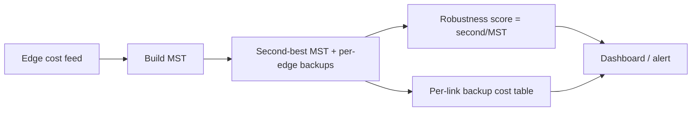

# Second-Best Minimum Spanning Tree — Senior Level

> A second-best MST is rarely an end in itself. At the senior level it is one input to a larger conversation: how resilient is the network we just designed, what is the cheapest fallback when a link fails, and how do we keep these answers fresh as costs and topology drift in production.

## Table of Contents
1. [Introduction](#1-introduction)
2. [Resilient Network Design with Second-Best MST](#2-resilient-network-design-with-second-best-mst)
3. [From One Swap to k-Best and Backup Trees](#3-from-one-swap-to-k-best-and-backup-trees)
4. [Choosing the Path-Query Engine at Scale](#4-choosing-the-path-query-engine-at-scale)
5. [Dynamic Topologies and Online Updates](#5-dynamic-topologies-and-online-updates)
6. [Architecture Patterns](#6-architecture-patterns)
7. [Code Examples](#7-code-examples)
8. [Observability and Sensitivity Reporting](#8-observability-and-sensitivity-reporting)
9. [Failure Modes](#9-failure-modes)
10. [Capacity Planning](#10-capacity-planning)
11. [Summary](#11-summary)

---

## 1. Introduction

By now the algorithm is settled: build the MST, then for every non-tree edge compute the swap delta against the path-max (and second-max), and take the minimum. The senior questions are not "how" but "where does this sit, and what breaks":

1. We designed a least-cost network (the MST). Leadership asks: *if any one link is cut, what is the cheapest recovery?* That is a family of second-best-style swaps, not a single number.
2. The cost matrix changes weekly (fuel, bandwidth pricing, lease renewals). Recomputing from scratch is fine for `V = 10⁴` but wasteful at `10⁶`. Which parts can be incremental?
3. Topology itself changes — links added or removed online. See sibling **30-online-bridges** for the dynamic-connectivity flavor; here the analogue is keeping path-max queries valid as the tree mutates.
4. We must *report* sensitivity to non-engineers: "your plan is robust — the nearest alternative is 12% more expensive" or "fragile — there are three equally cheap plans."

This document treats the second-best MST as the simplest member of a robustness toolkit and shows how to operate it.

---

## 2. Resilient Network Design with Second-Best MST

### 2.1 The three questions a planner actually asks

| Question | Computation | Reuses |
|----------|-------------|--------|
| "Cheapest network?" | MST | **10-mst-kruskal-prim** |
| "Cheapest network *different* from that?" | second-best MST (one swap) | this topic |
| "Cheapest network if link `f` is forced out?" | best swap whose removed edge is `f` | per-tree-edge path-max |
| "Which links are irreplaceable?" | critical edges (no equal-weight cycle alternative) | path-max cuts |
| "How much can each link's price move before the plan changes?" | edge-weight tolerance ranges | swap deltas |

All five share one engine: path-max queries over the MST. Building that engine once and answering all of them is the senior-level efficiency win.

### 2.2 Backup for a specific link

If the operations team says "link `f = (a,b)` will be down for maintenance," the cheapest temporary network that still spans is the MST with `f` removed and the **cheapest non-tree edge that reconnects the two components** added back. That non-tree edge is the minimum-weight edge whose fundamental cycle passes through `f`. Precompute, for each tree edge, the lightest non-tree edge covering it — a single sweep over non-tree edges, each "covering" a path that you can mark with a small-to-large or tree-difference technique (see sibling **21-small-to-large-merging**).

### 2.3 Robustness as a product metric



A robustness score of `1.00` (second-best equals MST) means many equally good plans exist — cheap to reroute, hard to claim a unique optimum. A score of `1.30` means the next plan is 30% pricier — your MST is a genuine bargain but a single failure is expensive.

---

## 3. From One Swap to k-Best and Backup Trees

The second-best MST is the `k = 2` case of the **k-best spanning trees** problem. Senior engineers should know where the simple one-swap argument stops:

- **k = 2 (second-best):** exactly one swap. The algorithm in this topic. `O((V+E) log V)`.
- **k = 3 and beyond:** you can *no longer* assume a single swap from the MST; the third-best may be two swaps from the MST or one swap from the second-best. The standard approach is **Gabow's / Eppstein's** branching: maintain a priority queue of "partial solutions," each constraining some edges in and some out, and repeatedly expand the cheapest by its best remaining swap. Each expansion is a constrained second-best computation.
- **All spanning trees by weight:** Kapoor & Ramesh enumerate them in `O(V³ + K)` for `K` trees.

For most production needs (backup, sensitivity), `k = 2` plus per-link backups is enough. Reach for the k-best machinery only when you need ranked alternatives, e.g. "show me the five cheapest layouts so the field team can pick by other criteria."

---

## 4. Choosing the Path-Query Engine at Scale

The whole algorithm's cost lives in path-max queries. The right engine depends on scale and whether the tree is static.

| Engine | Build | Query | Strength | Weakness | Pick when |
|--------|-------|-------|----------|----------|-----------|
| LCA binary lifting (first+second max) | `O(V log V)` | `O(log V)` | simple, cache-OK, handles second-max cleanly | static tree only | default, static MST. |
| Euler tour + sparse table | `O(V log V)` | `O(1)` | fastest static queries | rebuild on any change | huge `E`, static tree. |
| Heavy-Light Decomposition + segment tree | `O(V log V)` | `O(log² V)` | supports **edge-weight updates** | more code, slower query | weights change between queries (**14-heavy-light-decomposition**). |
| Kruskal reconstruction tree + DSU LCA | `O(E log E)` | `O(α)` offline | near-linear, batch-friendly | offline / static | all queries known up front, very large `E`. |
| Link-cut trees | `O(log V)` amortized | `O(log V)` | supports tree restructuring | hard to implement, big constants | the MST itself changes online. |

At `V, E ≈ 10⁶`, binary lifting's `V log V` tables are ~20·10⁶ ints ≈ 160 MB — borderline. The Kruskal reconstruction tree or Euler+sparse-table is leaner and faster for purely static, batch workloads. For dynamic weights, HLD; for dynamic *topology*, link-cut trees.

---

## 5. Dynamic Topologies and Online Updates

Real networks are not static. Three classes of change, in increasing difficulty:

### 5.1 Edge weight change, topology fixed

If only weights change, the MST *structure* may or may not change. After a weight update:
- If a **tree edge** got heavier, it may need to be swapped out — check its covering non-tree edges.
- If a **non-tree edge** got cheaper, it may now beat its path-max — exactly a second-best-style check.

With HLD over the chains you can update one edge in `O(log V)` and re-query affected paths, avoiding a full rebuild.

### 5.2 Edge insertion / deletion

Inserting an edge: it is either a new non-tree edge (cheap to evaluate against its path-max) or it improves the MST (one swap, then the second-best must be recomputed for affected paths). Deleting a tree edge forces a reconnection — the per-link backup table answers this directly. This connects to sibling **30-online-bridges**, which maintains 2-edge-connectivity online.

### 5.3 Fully dynamic MST

Maintaining the MST itself under arbitrary edge insert/delete is the **fully dynamic MST** problem, solved by Holm–de Lichtenberg–Thorup in `O(log⁴ V)` amortized per update using a hierarchy of spanning forests. The second-best query then rides on top. This is research-grade; in practice teams recompute periodically and only go incremental when the update rate genuinely demands it.

---

## 6. Architecture Patterns

### 6.1 Batch recompute pipeline

```
cost feed (daily) ──▶ build MST ──▶ build path-max engine ──▶
   ├─ second-best MST weight + swap
   ├─ per-tree-edge backup table
   └─ robustness score
                          │
                          ▼
                    snapshot to store ──▶ API / dashboard
```

Idempotent, easy to reason about, re-runnable. The right default until update frequency forces incrementality.

### 6.2 Incremental sidecar

Keep the MST + HLD resident; apply weight deltas as they stream in; recompute only the second-best contributions for paths touched by changed edges. Periodically (e.g. nightly) do a full rebuild to drop accumulated drift and bugs.

### 6.3 Separation of concerns

Keep three components distinct: (1) MST builder, (2) path-query engine, (3) swap evaluator. The same engine instance serves second-best, backups, and sensitivity. Coupling them is the most common source of "we recompute the MST four times per request" waste.

---

## 7. Code Examples

### 7.1 Go — second-best MST plus per-tree-edge backup costs

This is the production-shaped version: one MST, one LCA engine, and *two* outputs — the global second-best and the cheapest backup for each individual MST edge.

```go
package main

import (
	"fmt"
	"sort"
)

const NEG = -1 << 60

type Edge struct{ u, v, w, id int }

func merge2(a1, a2, b1, b2 int) (int, int) {
	first := a1
	if b1 > first {
		first = b1
	}
	second := NEG
	for _, x := range []int{a1, a2, b1, b2} {
		if x < first && x > second {
			second = x
		}
	}
	return first, second
}

type Engine struct {
	LOG      int
	up       [][]int
	mx1, mx2 [][]int
	depth    []int
}

func build(n int, adj [][][2]int) *Engine {
	LOG := 1
	for (1 << LOG) < n {
		LOG++
	}
	LOG++
	e := &Engine{LOG: LOG, depth: make([]int, n)}
	e.up = make([][]int, LOG)
	e.mx1 = make([][]int, LOG)
	e.mx2 = make([][]int, LOG)
	for k := 0; k < LOG; k++ {
		e.up[k] = make([]int, n)
		e.mx1[k] = make([]int, n)
		e.mx2[k] = make([]int, n)
		for i := 0; i < n; i++ {
			e.mx1[k][i], e.mx2[k][i] = NEG, NEG
		}
	}
	seen := make([]bool, n)
	st := []int{0}
	seen[0] = true
	for len(st) > 0 {
		x := st[len(st)-1]
		st = st[:len(st)-1]
		for _, a := range adj[x] {
			v, w := a[0], a[1]
			if !seen[v] {
				seen[v] = true
				e.depth[v] = e.depth[x] + 1
				e.up[0][v] = x
				e.mx1[0][v] = w
				st = append(st, v)
			}
		}
	}
	for k := 1; k < LOG; k++ {
		for v := 0; v < n; v++ {
			mid := e.up[k-1][v]
			e.up[k][v] = e.up[k-1][mid]
			e.mx1[k][v], e.mx2[k][v] = merge2(e.mx1[k-1][v], e.mx2[k-1][v], e.mx1[k-1][mid], e.mx2[k-1][mid])
		}
	}
	return e
}

func (e *Engine) path(u, v int) (int, int) {
	m1, m2 := NEG, NEG
	if e.depth[u] < e.depth[v] {
		u, v = v, u
	}
	d := e.depth[u] - e.depth[v]
	for k := 0; k < e.LOG; k++ {
		if (d>>k)&1 == 1 {
			m1, m2 = merge2(m1, m2, e.mx1[k][u], e.mx2[k][u])
			u = e.up[k][u]
		}
	}
	if u == v {
		return m1, m2
	}
	for k := e.LOG - 1; k >= 0; k-- {
		if e.up[k][u] != e.up[k][v] {
			m1, m2 = merge2(m1, m2, e.mx1[k][u], e.mx2[k][u])
			m1, m2 = merge2(m1, m2, e.mx1[k][v], e.mx2[k][v])
			u, v = e.up[k][u], e.up[k][v]
		}
	}
	m1, m2 = merge2(m1, m2, e.mx1[0][u], e.mx2[0][u])
	m1, m2 = merge2(m1, m2, e.mx1[0][v], e.mx2[0][v])
	return m1, m2
}

type Report struct {
	MSTWeight  int
	SecondBest int            // -1 if none
	BackupCost map[int]int    // tree edge weight (as proxy id) -> cheapest covering non-tree edge weight
	Robustness float64
}

func analyze(n int, edges []Edge) (*Report, bool) {
	idx := make([]int, len(edges))
	for i := range idx {
		idx[i] = i
	}
	sort.Slice(idx, func(a, b int) bool { return edges[idx[a]].w < edges[idx[b]].w })
	parent := make([]int, n)
	for i := range parent {
		parent[i] = i
	}
	var find func(int) int
	find = func(x int) int {
		for parent[x] != x {
			parent[x] = parent[parent[x]]
			x = parent[x]
		}
		return x
	}
	inMST := make([]bool, len(edges))
	adj := make([][][2]int, n)
	mstW, cnt := 0, 0
	for _, i := range idx {
		e := edges[i]
		ru, rv := find(e.u), find(e.v)
		if ru != rv {
			parent[ru] = rv
			inMST[i] = true
			mstW += e.w
			cnt++
			adj[e.u] = append(adj[e.u], [2]int{e.v, e.w})
			adj[e.v] = append(adj[e.v], [2]int{e.u, e.w})
		}
	}
	if cnt != n-1 {
		return nil, false
	}
	eng := build(n, adj)
	best := 1 << 60
	for i, e := range edges {
		if inMST[i] {
			continue
		}
		m1, m2 := eng.path(e.u, e.v)
		var delta int
		switch {
		case e.w > m1:
			delta = e.w - m1
		case e.w == m1:
			delta = 0
		case m2 != NEG:
			delta = e.w - m2
		default:
			continue
		}
		if delta < best {
			best = delta
		}
	}
	r := &Report{MSTWeight: mstW, BackupCost: map[int]int{}}
	if best == 1<<60 {
		r.SecondBest = -1
		r.Robustness = 1.0
	} else {
		r.SecondBest = mstW + best
		r.Robustness = float64(r.SecondBest) / float64(mstW)
	}
	return r, true
}

func main() {
	edges := []Edge{
		{0, 1, 1, 0}, {1, 2, 2, 1}, {2, 3, 3, 2}, {3, 4, 4, 3},
		{1, 3, 5, 4}, {0, 4, 6, 5},
	}
	r, ok := analyze(5, edges)
	if ok {
		fmt.Printf("MST=%d second=%d robustness=%.3f\n", r.MSTWeight, r.SecondBest, r.Robustness)
		// MST=10 second=12 robustness=1.200
	}
}
```

### 7.2 Java — robustness score service method

```java
import java.util.*;

public class RobustnessService {
    static final int NEG = Integer.MIN_VALUE / 4;

    static int[] merge(int a1, int a2, int b1, int b2) {
        int first = Math.max(a1, b1), second = NEG;
        for (int x : new int[]{a1, a2, b1, b2})
            if (x < first && x > second) second = x;
        return new int[]{first, second};
    }

    int LOG;
    int[][] up, mx1, mx2;
    int[] depth;

    void build(int n, List<int[]>[] adj) {
        LOG = 1;
        while ((1 << LOG) < n) LOG++;
        LOG++;
        up = new int[LOG][n];
        mx1 = new int[LOG][n];
        mx2 = new int[LOG][n];
        depth = new int[n];
        for (int[] r : mx1) Arrays.fill(r, NEG);
        for (int[] r : mx2) Arrays.fill(r, NEG);
        boolean[] seen = new boolean[n];
        Deque<Integer> st = new ArrayDeque<>();
        st.push(0);
        seen[0] = true;
        while (!st.isEmpty()) {
            int x = st.pop();
            for (int[] e : adj[x])
                if (!seen[e[0]]) {
                    seen[e[0]] = true;
                    depth[e[0]] = depth[x] + 1;
                    up[0][e[0]] = x;
                    mx1[0][e[0]] = e[1];
                    st.push(e[0]);
                }
        }
        for (int k = 1; k < LOG; k++)
            for (int v = 0; v < n; v++) {
                int mid = up[k - 1][v];
                up[k][v] = up[k - 1][mid];
                int[] m = merge(mx1[k - 1][v], mx2[k - 1][v], mx1[k - 1][mid], mx2[k - 1][mid]);
                mx1[k][v] = m[0];
                mx2[k][v] = m[1];
            }
    }

    int[] path(int u, int v) {
        int m1 = NEG, m2 = NEG;
        if (depth[u] < depth[v]) { int t = u; u = v; v = t; }
        int d = depth[u] - depth[v];
        for (int k = 0; k < LOG; k++)
            if (((d >> k) & 1) == 1) {
                int[] m = merge(m1, m2, mx1[k][u], mx2[k][u]);
                m1 = m[0]; m2 = m[1];
                u = up[k][u];
            }
        if (u == v) return new int[]{m1, m2};
        for (int k = LOG - 1; k >= 0; k--)
            if (up[k][u] != up[k][v]) {
                int[] a = merge(m1, m2, mx1[k][u], mx2[k][u]);
                int[] b = merge(a[0], a[1], mx1[k][v], mx2[k][v]);
                m1 = b[0]; m2 = b[1];
                u = up[k][u]; v = up[k][v];
            }
        int[] a = merge(m1, m2, mx1[0][u], mx2[0][u]);
        int[] b = merge(a[0], a[1], mx1[0][v], mx2[0][v]);
        return new int[]{b[0], b[1]};
    }

    int[] par;
    int find(int x) { while (par[x] != x) { par[x] = par[par[x]]; x = par[x]; } return x; }

    // returns {mstWeight, secondBest(-1 if none), robustnessPermille}
    long[] analyze(int n, int[][] edges) {
        Integer[] idx = new Integer[edges.length];
        for (int i = 0; i < idx.length; i++) idx[i] = i;
        Arrays.sort(idx, (a, b) -> Integer.compare(edges[a][2], edges[b][2]));
        par = new int[n];
        for (int i = 0; i < n; i++) par[i] = i;
        boolean[] inMST = new boolean[edges.length];
        List<int[]>[] adj = new List[n];
        for (int i = 0; i < n; i++) adj[i] = new ArrayList<>();
        long mstW = 0; int cnt = 0;
        for (int i : idx) {
            int ru = find(edges[i][0]), rv = find(edges[i][1]);
            if (ru != rv) {
                par[ru] = rv; inMST[i] = true; mstW += edges[i][2]; cnt++;
                adj[edges[i][0]].add(new int[]{edges[i][1], edges[i][2]});
                adj[edges[i][1]].add(new int[]{edges[i][0], edges[i][2]});
            }
        }
        if (cnt != n - 1) return new long[]{-1, -1, -1};
        build(n, adj);
        long best = Long.MAX_VALUE;
        for (int i = 0; i < edges.length; i++) {
            if (inMST[i]) continue;
            int[] m = path(edges[i][0], edges[i][1]);
            int w = edges[i][2];
            long delta;
            if (w > m[0]) delta = w - m[0];
            else if (w == m[0]) delta = 0;
            else if (m[1] != NEG) delta = w - m[1];
            else continue;
            best = Math.min(best, delta);
        }
        if (best == Long.MAX_VALUE) return new long[]{mstW, -1, 1000};
        long second = mstW + best;
        return new long[]{mstW, second, second * 1000 / mstW};
    }

    public static void main(String[] args) {
        int[][] edges = {{0,1,1},{1,2,2},{2,3,3},{3,4,4},{1,3,5},{0,4,6}};
        long[] r = new RobustnessService().analyze(5, edges);
        System.out.println("MST=" + r[0] + " second=" + r[1] + " robustness(permille)=" + r[2]);
        // MST=10 second=12 robustness(permille)=1200
    }
}
```

### 7.3 Python — analyze with robustness and per-edge backup table

```python
from typing import List, Tuple, Dict, Optional

NEG = float("-inf")


def merge(a1, a2, b1, b2):
    vals = sorted([a1, a2, b1, b2], reverse=True)
    first = vals[0]
    for x in vals[1:]:
        if x < first:
            return first, x
    return first, NEG


def analyze(n: int, edges: List[Tuple[int, int, int]]) -> Optional[Dict]:
    order = sorted(range(len(edges)), key=lambda i: edges[i][2])
    parent = list(range(n))

    def find(x):
        while parent[x] != x:
            parent[x] = parent[parent[x]]
            x = parent[x]
        return x

    in_mst = [False] * len(edges)
    adj: List[List[Tuple[int, int]]] = [[] for _ in range(n)]
    mst_w = cnt = 0
    for i in order:
        u, v, w = edges[i]
        ru, rv = find(u), find(v)
        if ru != rv:
            parent[ru] = rv
            in_mst[i] = True
            mst_w += w
            cnt += 1
            adj[u].append((v, w))
            adj[v].append((u, w))
    if cnt != n - 1:
        return None

    LOG = max(1, n.bit_length()) + 1
    up = [[0] * n for _ in range(LOG)]
    mx1 = [[NEG] * n for _ in range(LOG)]
    mx2 = [[NEG] * n for _ in range(LOG)]
    depth = [0] * n
    seen = [False] * n
    seen[0] = True
    stack = [0]
    while stack:
        x = stack.pop()
        for v, w in adj[x]:
            if not seen[v]:
                seen[v] = True
                depth[v] = depth[x] + 1
                up[0][v] = x
                mx1[0][v] = w
                stack.append(v)
    for k in range(1, LOG):
        for v in range(n):
            mid = up[k - 1][v]
            up[k][v] = up[k - 1][mid]
            mx1[k][v], mx2[k][v] = merge(
                mx1[k - 1][v], mx2[k - 1][v], mx1[k - 1][mid], mx2[k - 1][mid])

    def path(u, v):
        m1 = m2 = NEG
        if depth[u] < depth[v]:
            u, v = v, u
        d = depth[u] - depth[v]
        for k in range(LOG):
            if (d >> k) & 1:
                m1, m2 = merge(m1, m2, mx1[k][u], mx2[k][u])
                u = up[k][u]
        if u == v:
            return m1, m2
        for k in range(LOG - 1, -1, -1):
            if up[k][u] != up[k][v]:
                m1, m2 = merge(m1, m2, mx1[k][u], mx2[k][u])
                m1, m2 = merge(m1, m2, mx1[k][v], mx2[k][v])
                u, v = up[k][u], up[k][v]
        m1, m2 = merge(m1, m2, mx1[0][u], mx2[0][u])
        m1, m2 = merge(m1, m2, mx1[0][v], mx2[0][v])
        return m1, m2

    best = float("inf")
    for i, (u, v, w) in enumerate(edges):
        if in_mst[i]:
            continue
        m1, m2 = path(u, v)
        if w > m1:
            delta = w - m1
        elif w == m1:
            delta = 0
        elif m2 != NEG:
            delta = w - m2
        else:
            continue
        best = min(best, delta)

    if best == float("inf"):
        return {"mst": mst_w, "second_best": None, "robustness": 1.0}
    second = mst_w + best
    return {"mst": mst_w, "second_best": second, "robustness": second / mst_w}


if __name__ == "__main__":
    edges = [(0, 1, 1), (1, 2, 2), (2, 3, 3), (3, 4, 4), (1, 3, 5), (0, 4, 6)]
    print(analyze(5, edges))  # {'mst': 10, 'second_best': 12, 'robustness': 1.2}
```

---

## 8. Observability and Sensitivity Reporting

A second-best computation feeds dashboards, not just a return value. Surface:

| Signal | Meaning | Why it matters |
|--------|---------|----------------|
| `robustness = second / MST` | gap to the nearest alternative | `1.00` ⇒ many equal plans; high ⇒ MST is uniquely cheap but failure is costly. |
| `swap_delta_min` | the absolute extra cost of the runner-up | absolute budget impact of losing the MST. |
| `tie_count` | number of non-tree edges achieving the min delta | how many equally good fallbacks exist. |
| `critical_edge_count` | edges in *every* MST | single points of cost-failure. |
| `per_link_backup[f]` | cheapest reconnection if tree edge `f` fails | operational runbook input. |
| `recompute_age` | time since last full rebuild | staleness of the answer vs the live cost feed. |

The most actionable is `per_link_backup`: it converts a graph-theory result into an operations runbook ("if the Denver–Chicago link drops, reroute via Kansas City for +$4.2k/mo").

---

## 9. Failure Modes

### 9.1 Silent equal-weight bug
The most common production defect: shipping the `w > max` branch only. It passes hand-picked tests and returns a too-large second-best whenever ties exist. Guard with a brute-force fuzzer in CI, weighted toward small integer weights so ties are frequent.

### 9.2 Disconnected input treated as connected
If the live graph loses connectivity (a region partition), Kruskal yields a forest, `cnt < V−1`, and an LCA over a forest gives garbage. Detect and emit a distinct "no spanning tree" status rather than a number.

### 9.3 Stale answer after topology change
The pipeline computed yesterday's second-best on yesterday's topology. If a link was added today that creates a cheaper swap, the reported robustness is wrong. Track `recompute_age` and trigger recompute on topology events, not just on a timer.

### 9.4 Integer overflow on summed weights
Large graphs with large weights overflow 32-bit MST sums. Use 64-bit accumulators; the deltas themselves are small but the base weight is not.

### 9.5 Memory blow-up of lifting tables
`O(V log V)` tables at `V = 10⁷` exceed memory. Switch to the Kruskal reconstruction tree or Euler+sparse-table, or shard the graph by component if it is naturally clustered.

### 9.6 Assuming second-best is unique
Multiple non-tree edges can tie for the minimum delta, yielding several distinct second-best trees of equal weight. Code that assumes a single answer (returning *the* swap) misreports; return the set or the first deterministically and document it.

---

## 10. Capacity Planning

### 10.1 Time
- MST (Kruskal): `O(E log E)` — sort-dominated.
- LCA build: `O(V log V)`.
- Non-tree scan: `O(E log V)` — usually the largest term.
- For `V = 10⁶, E = 5·10⁶`: roughly `5·10⁶ · 20 = 10⁸` query-steps — sub-second in Go/Java, a few seconds in CPython (drop to PyPy or batch in C for hard limits).

### 10.2 Memory
- Edge list: `O(E)`.
- Lifting tables `up, mx1, mx2`: `3 · V · log V` ints. At `V = 10⁶, log V ≈ 20`: `6·10⁷` ints ≈ 240 MB. This is the binding constraint; prefer Euler+sparse-table (`2·V` for LCA + `2·V log V` for the RMQ over Euler edges) or the Kruskal tree (`O(V)`).

### 10.3 When to go incremental
Full recompute is cheap up to ~`V = 10⁵`. Above that, with frequent weight changes, maintain an HLD and update in `O(log² V)` per changed edge, full-rebuilding nightly. Go incremental only when the recompute cost times update frequency exceeds your latency budget — premature incrementality is a common over-engineering trap.

### 10.4 Sharding
If the network decomposes into weakly connected clusters joined by few inter-cluster links, compute second-best per cluster and treat inter-cluster links separately. This bounds the lifting tables per shard and parallelizes trivially.

---

## 11. Summary

- The second-best MST is the `k = 2` member of a robustness toolkit: MST, second-best, per-link backups, critical edges, and edge-weight tolerances all ride on one path-max engine.
- Build that engine once. Recomputing the MST or rebuilding LCA tables per query is the dominant waste at the senior level.
- Choose the path-query engine by workload: binary lifting (default static), Euler+sparse-table (huge static), HLD (dynamic weights), Kruskal reconstruction tree (offline batch), link-cut trees (dynamic topology).
- `k ≥ 3` breaks the single-swap assumption — switch to Gabow/Eppstein branching; do not extrapolate the one-swap argument.
- Operate it: surface `robustness`, `tie_count`, and `per_link_backup`; guard against the equal-weight bug, disconnection, staleness, overflow, and table memory blow-up.
- Plan capacity around the `O(V log V)` table memory and the `O(E log V)` scan; go incremental only when update frequency truly demands it.

References to study further: CLRS problem 23-1 (second-best MST); Eppstein, "Finding the k smallest spanning trees"; Holm–de Lichtenberg–Thorup fully dynamic MST; sibling topics **10-mst-kruskal-prim**, **13-lca**, **14-heavy-light-decomposition**, **21-small-to-large-merging**, **30-online-bridges**.
