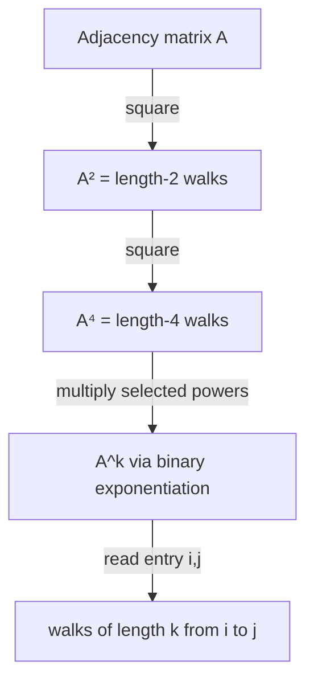

# Paths of Fixed Length (Matrix Exponentiation on Graphs) — Junior Level

> **One-line summary:** If `A` is the adjacency matrix of a graph, then `(A^k)[i][j]` is the number of **walks** of length exactly `k` from vertex `i` to vertex `j`. You compute `A^k` quickly with fast matrix exponentiation (binary exponentiation), usually taking entries modulo a prime to avoid overflow.

---

## Table of Contents

1. [Introduction](#introduction)
2. [Prerequisites](#prerequisites)
3. [Glossary](#glossary)
4. [Core Concepts](#core-concepts)
5. [Big-O Summary](#big-o-summary)
6. [Real-World Analogies](#real-world-analogies)
7. [Pros & Cons](#pros--cons)
8. [Step-by-Step Walkthrough](#step-by-step-walkthrough)
9. [Code Examples](#code-examples)
10. [Coding Patterns](#coding-patterns)
11. [Error Handling](#error-handling)
12. [Performance Tips](#performance-tips)
13. [Best Practices](#best-practices)
14. [Edge Cases & Pitfalls](#edge-cases--pitfalls)
15. [Common Mistakes](#common-mistakes)
16. [Cheat Sheet](#cheat-sheet)
17. [Visual Animation](#visual-animation)
18. [Summary](#summary)
19. [Further Reading](#further-reading)

---

## Introduction

Suppose someone hands you a graph and asks: *"How many different ways can I travel from city A to city B using exactly 5 roads?"* You are allowed to revisit cities and reuse roads. Each such route is called a **walk** of length 5. The brute-force answer is to enumerate every possible 5-step route, which explodes exponentially.

There is a beautiful shortcut. Write the graph's connections as a square **adjacency matrix** `A`, where `A[i][j] = 1` if there is an edge from `i` to `j` (and `0` otherwise). Then a single, almost magical fact unlocks the whole problem:

> **`(A^k)[i][j]` counts the number of walks of length exactly `k` from `i` to `j`.**

So the answer to "how many length-5 routes from A to B" is simply the `(A, B)` entry of the matrix `A` raised to the 5th power. Multiplying a `V × V` matrix by itself costs `O(V³)`, and we can reach the `k`-th power in only `O(log k)` multiplications using **binary exponentiation** (exponentiation by squaring) — the same trick used to compute `2^k` fast. The total cost is `O(V³ log k)`, which stays tiny even when `k` is astronomically large, like `k = 10^18`.

This single idea connects three areas you may have met separately:

- **Counting** problems (how many paths/walks satisfy a length constraint),
- **Linear recurrences** (Fibonacci and friends are secretly walks on a tiny graph),
- **Shortest/longest paths** (swap the arithmetic operations and the same matrix power computes shortest walks — the algebra behind sibling topic `06-floyd-warshall`).

The matrix-exponentiation machinery itself is covered as a number-theory tool in sibling topic `10-matrix-exponentiation` under `19-number-theory`; here we focus on its *graph* meaning. And the adjacency matrix itself comes from sibling topic `01-representation`.

One crucial caveat to remember from the very first minute: matrix powers count **walks**, which may repeat vertices and edges — not **simple paths** (which visit each vertex at most once). Counting simple paths of a given length is a genuinely hard problem (#P-hard) with no known fast algorithm. Matrix exponentiation is fast precisely *because* it counts the easier "walks-with-repeats" quantity.

---

## Prerequisites

Before reading this file you should be comfortable with:

- **Adjacency matrices** — the `V × V` grid of 0/1 (or weighted) edge indicators. See sibling `01-representation`.
- **Matrix multiplication** — the row-by-column dot-product rule `C[i][j] = Σ_t A[i][t] · B[t][j]`.
- **Modular arithmetic** — `(a + b) mod p`, `(a · b) mod p`, and why we use it to prevent overflow.
- **Binary exponentiation** — computing `x^k` in `O(log k)` by squaring. (Covered for scalars in `19-number-theory`.)
- **Big-O notation** — `O(V³)`, `O(log k)`, `O(V³ log k)`.
- **2D arrays / nested loops** — every operation here is a triple loop over a matrix.

Optional but helpful:

- A glance at **Fibonacci as a recurrence**, since we will re-derive it as a graph walk.
- Familiarity with **directed vs undirected** graphs — both work; undirected just means `A` is symmetric.

---

## Glossary

| Term | Meaning |
|------|---------|
| **Walk** | A sequence of vertices `v₀, v₁, …, v_k` where each consecutive pair is an edge. Vertices and edges **may repeat**. |
| **Length of a walk** | The number of **edges** traversed (`k`), not the number of vertices (`k+1`). |
| **Path (simple path)** | A walk with **no repeated vertices**. Counting these by length is #P-hard — *not* what matrix power gives. |
| **Adjacency matrix `A`** | `V × V` matrix; `A[i][j]` = number of edges from `i` to `j` (1 for simple graphs, can be >1 for multigraphs). |
| **Matrix power `A^k`** | `A` multiplied by itself `k` times. `A^0` is the identity matrix `I`. |
| **Identity matrix `I`** | `I[i][j] = 1` if `i == j`, else `0`. The multiplicative identity: `A · I = A`. |
| **Binary exponentiation** | Computing `A^k` via `O(log k)` squarings, reading `k`'s bits. Also "exponentiation by squaring". |
| **Modulus `p`** | A number (often a prime like `10^9 + 7`) we reduce entries by, so counts never overflow 64-bit integers. |
| **Semiring** | An algebra with an "add" and a "multiply". Swapping `(+, ×)` for `(min, +)` makes matrix power compute shortest walks. |
| **Min-plus / tropical semiring** | The `(min, +)` algebra; its matrix power gives shortest walks of an exact length. |

---

## Core Concepts

### 1. The Adjacency Matrix

For a graph on vertices `0, 1, …, V-1`, the adjacency matrix `A` is `V × V`:

```
A[i][j] = number of edges from i to j   (0 or 1 for a simple graph)
```

Example — a directed graph on 3 vertices with edges `0→1`, `1→2`, `2→0`, `0→2`:

```
       to: 0  1  2
from 0 [  0  1  1 ]
from 1 [  0  0  1 ]
from 2 [  1  0  0 ]
```

`A` itself answers "how many walks of length **1**?" — because a single edge *is* a walk of length 1. That is the base case of the whole theory: `A = A^1`.

### 2. Why `A²` Counts Length-2 Walks

A walk of length 2 from `i` to `j` looks like `i → t → j` for some middle vertex `t`. To go `i → t` you need an edge (`A[i][t] = 1`) and to go `t → j` you need another edge (`A[t][j] = 1`). The number of such 2-step walks is therefore:

```
(number of length-2 walks i→j) = Σ over all t of  A[i][t] · A[t][j]
```

But that sum is *exactly* the definition of matrix multiplication: `(A · A)[i][j] = Σ_t A[i][t] · A[t][j]`. So `A² = A · A` counts length-2 walks. Each product `A[i][t] · A[t][j]` is `1` only when both edges exist, contributing one walk; the sum tallies all valid middle vertices.

### 3. Induction to `A^k`

The same argument chains upward. A walk of length `k` from `i` to `j` is a walk of length `k-1` from `i` to some `t`, followed by one edge `t → j`:

```
(A^k)[i][j] = Σ_t (A^{k-1})[i][t] · A[t][j]
```

That is just `A^k = A^{k-1} · A`. By induction, `A^k` counts walks of length exactly `k`. The full proof lives in [`professional.md`](./professional.md), but the picture is simple: **each matrix multiply appends one more edge to every walk.**

### 4. Binary Exponentiation (Fast Powers)

Multiplying `A` by itself `k` times directly costs `k` multiplications. We do far better by squaring. To compute `A^13` (binary `1101`):

```
A^13 = A^8 · A^4 · A^1          (8 + 4 + 1 = 13)
```

We compute `A^1, A^2, A^4, A^8` by repeated squaring (`A^2 = A·A`, `A^4 = A²·A²`, …) — only `log₂ k` squarings — and multiply in the powers whose bit is set in `k`. That is `O(log k)` matrix multiplies, each `O(V³)`, so `O(V³ log k)` total. (Identical to scalar fast power from `19-number-theory`, just with matrices.)

### 5. Take Everything mod `p`

Walk counts grow *fast* — exponentially in `k`. By length 60 they overflow 64-bit integers easily. If the problem asks for the count "modulo `10^9 + 7`" (it almost always does), reduce every addition and multiplication mod `p` as you go. Because `(+, ×)` mod `p` is still a valid arithmetic, the walk-counting theorem holds for the residues too.

### 6. The Identity Matrix Is `A^0`

By convention `A^0 = I`, the identity matrix. This is correct semantically: a walk of length 0 from `i` to `j` exists only when `i == j` (the trivial "stay put" walk), and `I[i][j] = 1` exactly when `i == j`. The identity is also the starting accumulator in binary exponentiation.

---

## Big-O Summary

| Operation | Time | Space | Notes |
|-----------|------|-------|-------|
| Single matrix multiply `A · B` | **O(V³)** | O(V²) | Triple nested loop. |
| `A^k` by repeated multiply | O(V³ · k) | O(V²) | Naive; only for tiny `k`. |
| `A^k` by binary exponentiation | **O(V³ log k)** | O(V²) | The standard method. |
| Read one entry `(A^k)[i][j]` | O(1) | — | After computing `A^k`. |
| Count walks of **all** lengths `≤ k` | O(V³ log k) | O(V²) | Augmented matrix trick (see middle). |
| Min-plus power (shortest exact-`k` walk) | O(V³ log k) | O(V²) | Same shape, different "+/×". |
| Counting **simple** paths of length `k` | **#P-hard** | — | No known polynomial algorithm. |

The headline number is **`O(V³ log k)`** — polynomial in the number of vertices and only *logarithmic* in the walk length `k`. That is what makes `k = 10^18` trivial.

---

## Real-World Analogies

| Concept | Analogy |
|---------|---------|
| Adjacency matrix | A flight schedule grid: `A[i][j] = 1` means there is a direct flight from airport `i` to airport `j`. |
| `A²` entry | The number of one-stopover itineraries from `i` to `j` (exactly one layover). |
| `A^k` entry | The number of `k`-leg itineraries — counting every routing that uses exactly `k` flights, even loops back through the same airport. |
| Walk vs simple path | A walk lets you fly through Chicago twice if you want; a simple path forbids ever revisiting an airport. The matrix counts the permissive (walk) version. |
| Binary exponentiation | Instead of stamping your passport one flight at a time for a 1000-leg trip, you precompute "8-leg blocks", "4-leg blocks", etc., and snap them together. |
| Taking mod `p` | The number of itineraries is astronomically large, so you only track the last few digits (the remainder) to keep the bookkeeping manageable. |

Where the analogy breaks: real itineraries care about time and money; the pure count ignores all of that and just tallies edge-sequences. To bring weights back in, you switch semirings (see `middle.md`).

---

## Pros & Cons

| Pros | Cons |
|------|------|
| Counts walks of *enormous* length `k` in `O(V³ log k)` — logarithmic in `k`. | Cubic in `V`: useless for graphs with thousands of vertices. |
| One uniform technique covers counting, shortest, longest, reachability (just change the semiring). | Counts **walks, not simple paths** — cannot answer simple-path-length questions. |
| Turns any linear recurrence into a `O(matrix³ log n)` evaluation (Fibonacci, etc.). | Needs modular arithmetic to avoid overflow; a forgotten `mod` silently corrupts answers. |
| Numerically clean over `mod p` integers (no floating-point error). | Choosing the wrong semiring identity matrix is a subtle, common bug. |
| Tiny code — a matrix multiply plus a `O(log k)` power loop. | The `V³` constant hides cache effects; large `V` needs blocking/optimization. |

**When to use:** small vertex count (`V` up to a few hundred), huge length `k`, counting/shortest/reachability constrained to exactly (or at most) `k` edges, evaluating linear recurrences at a huge index, automaton/regular-language path counting, Markov-chain step distributions.

**When NOT to use:** large `V` (the `V³` kills you), counting *simple* paths (intractable), single short walk length where a plain BFS/DP over `k` layers is simpler.

---

## Step-by-Step Walkthrough

Take this tiny directed graph on 3 vertices `{0, 1, 2}` with edges `0→1`, `1→2`, `2→0`, `0→2`:

```
A =
[ 0  1  1 ]
[ 0  0  1 ]
[ 1  0  0 ]
```

**Compute `A² = A · A` by hand.** Entry `(i, j)` is the dot product of row `i` of `A` with column `j` of `A`.

```
Row 0 of A = (0,1,1)
  (A²)[0][0] = 0·0 + 1·0 + 1·1 = 1     // walk 0→2→0
  (A²)[0][1] = 0·1 + 1·0 + 1·0 = 0     // no length-2 walk 0→?→1
  (A²)[0][2] = 0·1 + 1·1 + 1·0 = 1     // walk 0→1→2

Row 1 of A = (0,0,1)
  (A²)[1][0] = 0·0 + 0·0 + 1·1 = 1     // walk 1→2→0
  (A²)[1][1] = 0·1 + 0·0 + 1·0 = 0
  (A²)[1][2] = 0·1 + 0·1 + 1·0 = 0

Row 2 of A = (1,0,0)
  (A²)[2][0] = 1·0 + 0·0 + 0·1 = 0
  (A²)[2][1] = 1·1 + 0·0 + 0·0 = 1     // walk 2→0→1
  (A²)[2][2] = 1·1 + 0·1 + 0·0 = 1     // walk 2→0→2
```

So:

```
A² =
[ 1  0  1 ]
[ 1  0  0 ]
[ 0  1  1 ]
```

**Verify one entry by enumeration.** `(A²)[0][2] = 1`. The only length-2 walk from 0 to 2 is `0 → 1 → 2`. (There is no `0 → 2 → 2` because `2→2` is not an edge, and `0→0→2` because `0→0` is not an edge.) The matrix and the hand count agree.

**Now compute `A³ = A² · A`** (one more edge appended):

```
A³ =
[ 1  1  1 ]
[ 0  1  1 ]
[ 1  0  1 ]
```

Check `(A³)[0][0] = 1`: the length-3 walks from 0 back to 0 are `0 → 1 → 2 → 0`. Indeed exactly one. The diagonal of `A³` counts **closed walks of length 3** — these correspond to triangles in the directed graph traversed in that direction.

Each multiplication appended one edge to every walk. That is the entire mechanism.

---

## Code Examples

### Example: Count Walks of Length `k` mod `p`

This builds `A`, raises it to the power `k` mod `p` by binary exponentiation, and prints `(A^k)[src][dst]`.

#### Go

```go
package main

import "fmt"

const MOD = 1_000_000_007

type Matrix [][]int64

func multiply(a, b Matrix) Matrix {
	n := len(a)
	c := make(Matrix, n)
	for i := range c {
		c[i] = make([]int64, n)
		for t := 0; t < n; t++ {
			if a[i][t] == 0 {
				continue // skip zero terms — common speedup
			}
			for j := 0; j < n; j++ {
				c[i][j] = (c[i][j] + a[i][t]*b[t][j]) % MOD
			}
		}
	}
	return c
}

func identity(n int) Matrix {
	id := make(Matrix, n)
	for i := range id {
		id[i] = make([]int64, n)
		id[i][i] = 1
	}
	return id
}

func matPow(a Matrix, k int64) Matrix {
	n := len(a)
	result := identity(n) // A^0 = I
	for k > 0 {
		if k&1 == 1 {
			result = multiply(result, a)
		}
		a = multiply(a, a)
		k >>= 1
	}
	return result
}

func main() {
	A := Matrix{
		{0, 1, 1},
		{0, 0, 1},
		{1, 0, 0},
	}
	k := int64(3)
	Ak := matPow(A, k)
	fmt.Printf("walks of length %d from 0 to 0 = %d\n", k, Ak[0][0]) // 1
	fmt.Printf("walks of length %d from 2 to 1 = %d\n", k, Ak[2][1]) // 0
}
```

#### Java

```java
public class FixedLengthWalks {
    static final long MOD = 1_000_000_007L;

    static long[][] multiply(long[][] a, long[][] b) {
        int n = a.length;
        long[][] c = new long[n][n];
        for (int i = 0; i < n; i++) {
            for (int t = 0; t < n; t++) {
                if (a[i][t] == 0) continue;
                for (int j = 0; j < n; j++) {
                    c[i][j] = (c[i][j] + a[i][t] * b[t][j]) % MOD;
                }
            }
        }
        return c;
    }

    static long[][] identity(int n) {
        long[][] id = new long[n][n];
        for (int i = 0; i < n; i++) id[i][i] = 1;
        return id;
    }

    static long[][] matPow(long[][] a, long k) {
        int n = a.length;
        long[][] result = identity(n); // A^0 = I
        while (k > 0) {
            if ((k & 1) == 1) result = multiply(result, a);
            a = multiply(a, a);
            k >>= 1;
        }
        return result;
    }

    public static void main(String[] args) {
        long[][] A = {
            {0, 1, 1},
            {0, 0, 1},
            {1, 0, 0},
        };
        long k = 3;
        long[][] Ak = matPow(A, k);
        System.out.println("walks length " + k + " from 0 to 0 = " + Ak[0][0]); // 1
        System.out.println("walks length " + k + " from 2 to 1 = " + Ak[2][1]); // 0
    }
}
```

#### Python

```python
MOD = 1_000_000_007


def multiply(a, b):
    n = len(a)
    c = [[0] * n for _ in range(n)]
    for i in range(n):
        ai = a[i]
        ci = c[i]
        for t in range(n):
            if ai[t] == 0:
                continue          # skip zero terms
            ait, bt = ai[t], b[t]
            for j in range(n):
                ci[j] = (ci[j] + ait * bt[j]) % MOD
    return c


def identity(n):
    return [[1 if i == j else 0 for j in range(n)] for i in range(n)]


def mat_pow(a, k):
    n = len(a)
    result = identity(n)          # A^0 = I
    while k > 0:
        if k & 1:
            result = multiply(result, a)
        a = multiply(a, a)
        k >>= 1
    return result


if __name__ == "__main__":
    A = [
        [0, 1, 1],
        [0, 0, 1],
        [1, 0, 0],
    ]
    k = 3
    Ak = mat_pow(A, k)
    print(f"walks length {k} from 0 to 0 = {Ak[0][0]}")  # 1
    print(f"walks length {k} from 2 to 1 = {Ak[2][1]}")  # 0
```

**What it does:** builds the 3-vertex graph above, computes `A³ mod p`, and reads two entries that match our hand calculation.
**Run:** `go run main.go` | `javac FixedLengthWalks.java && java FixedLengthWalks` | `python walks.py`

---

## Coding Patterns

### Pattern 1: Brute-Force Walk Counter (the oracle you test against)

**Intent:** Before trusting matrix exponentiation, count walks the slow, obvious way and check they agree on small inputs.

```python
def count_walks_bruteforce(A, src, dst, k):
    n = len(A)
    # dp[v] = number of length-L walks from src to v; start at L=0
    dp = [0] * n
    dp[src] = 1
    for _ in range(k):
        nxt = [0] * n
        for u in range(n):
            if dp[u] == 0:
                continue
            for v in range(n):
                nxt[v] += dp[u] * A[u][v]
        dp = nxt
    return dp[dst]
```

This is `O(V² · k)` (DP over `k` layers). It is too slow for huge `k` but perfect as a correctness oracle. Matrix exponentiation must give the same answer mod `p`.

### Pattern 2: Sum Over All Targets

**Intent:** "How many walks of length `k` start at `src` and end *anywhere*?" Sum row `src` of `A^k`: `Σ_j (A^k)[src][j]`.

### Pattern 3: Closed Walks (Trace)

**Intent:** The diagonal entries `(A^k)[i][i]` count closed walks of length `k` starting and ending at `i`. Their sum (the **trace**) counts all closed walks of length `k`, a classic ingredient in counting cycles.



---

## Error Handling

| Error | Cause | Fix |
|-------|-------|-----|
| Wildly wrong huge numbers | Forgot to take `mod p`; 64-bit overflow. | Reduce after *every* `+` and `*` in `multiply`. |
| Wrong answer for `k = 0` | Returned `A` instead of `I`. | `A^0` must be the identity matrix. |
| `IndexError` / out-of-bounds | Non-square matrix or mismatched dimensions. | Assert `A` is `V × V` before powering. |
| Overflow even with mod in Java/Go | `a[i][t] * b[t][j]` overflows `int` before the `% MOD`. | Use 64-bit (`long` / `int64`) for the product. |
| Counts off by a layer | Confused "length = vertices" with "length = edges". | Length `k` means `k` **edges** (`k+1` vertices). |
| Negative entries after mod | In some languages `%` can be negative. | Add `MOD` then `% MOD`, or use unsigned/`int64` carefully. |

---

## Performance Tips

- **Skip zero terms** in the inner multiply (`if a[i][t] == 0: continue`). Sparse adjacency matrices get a big speedup.
- **Reduce mod only where needed** — one `% MOD` per accumulation step is enough; doing it more often just wastes cycles.
- **Reuse buffers** — allocating a fresh `V × V` matrix every multiply pressures the garbage collector. Preallocate scratch matrices for hot loops.
- **Pick the smallest matrix** — if your recurrence has order `r`, the transition matrix is `r × r`, not `V × V`. Keep it tiny.
- **Iterate cache-friendly** — the loop order `i, t, j` (not `i, j, t`) reads `b[t]` row-contiguously and is markedly faster.

---

## Best Practices

- Always test `A^k` against the brute-force DP oracle (Pattern 1) on random small graphs before trusting it.
- State your modulus once, at the top, as a named constant. Never sprinkle magic `1000000007` literals.
- Confirm whether the problem wants walks of length **exactly** `k` or **at most** `k` — they need different setups (see `middle.md`).
- Write `multiply` and `matPow` as small, separately testable functions; most bugs hide in `multiply`.
- Document whether your graph is directed or undirected; for undirected graphs `A` is symmetric and so is every `A^k`.

---

## Edge Cases & Pitfalls

- **`k = 0`** — answer is the identity: 1 walk from each vertex to itself, 0 otherwise.
- **`k = 1`** — answer is just `A` itself (single edges are length-1 walks).
- **Self-loops** — an edge `i → i` makes `A[i][i] = 1` and contributes walks that "stay put"; this is legitimate and the math handles it.
- **Multigraphs** — if there are two parallel edges `i → j`, set `A[i][j] = 2`; the count multiplies correctly.
- **Disconnected graph** — perfectly fine; unreachable pairs just stay `0` in every power.
- **Walks vs simple paths** — repeat after me: the matrix counts **walks with repeats**. If the question forbids revisiting vertices, matrix exponentiation does **not** apply.
- **Overflow without a modulus** — if the problem genuinely wants the exact (non-modular) count and `k` is large, the numbers exceed 64 bits; you need big integers.

---

## Common Mistakes

1. **Returning `A` for `k = 0`** instead of the identity matrix — breaks binary exponentiation's accumulator.
2. **Forgetting the modulus** — the answer overflows and silently wraps to garbage.
3. **Multiplying before reducing** — `a * b` can overflow the integer type *before* the `% MOD`; cast to 64-bit first.
4. **Counting vertices instead of edges** — "length `k`" is `k` edges; off-by-one here corrupts the index.
5. **Assuming the result counts simple paths** — it counts walks; revisits are included.
6. **Using floating-point** — never use `double` for exact counts; rounding destroys correctness. Use integers mod `p`.
7. **Non-commutative slip** — matrices do *not* commute in general, but `A^a · A^b = A^{a+b}` *does* hold (powers of the same matrix commute), which is exactly why binary exponentiation is valid.

---

## Cheat Sheet

| Question | Tool | Formula |
|----------|------|---------|
| Walks of length exactly `k`, `i → j` | matrix power | `(A^k)[i][j]` |
| Walks of length 1 | the matrix itself | `A[i][j]` |
| Walks of length 0 | identity | `I[i][j]` (1 iff `i==j`) |
| Closed walks of length `k` at `i` | diagonal | `(A^k)[i][i]` |
| Total closed walks of length `k` | trace | `Σ_i (A^k)[i][i]` |
| Walks of length `≤ k` | augmented matrix | see `middle.md` |
| Shortest walk of exactly `k` edges | min-plus power | see `middle.md` |

Core algorithm:

```
matPow(A, k):
    result = I            # identity; A^0
    while k > 0:
        if k is odd: result = result · A
        A = A · A
        k = k >> 1
    return result
# cost: O(V^3 log k), entries taken mod p
```

---

## Visual Animation

> See [`animation.html`](./animation.html) for an interactive visualization.
>
> The animation demonstrates:
> - Squaring the adjacency matrix `A → A² → A⁴ → …`
> - The binary-exponentiation ladder that assembles `A^k` from the squared powers
> - Reading an `(i, j)` entry and interpreting it as the number of length-`k` walks
> - Step / Run / Reset controls to watch each multiply build up one more edge

---

## Summary

The adjacency matrix turns "count the walks of length `k`" into "raise a matrix to the `k`-th power." The proof is a one-line induction: each matrix multiply appends one more edge to every walk, so `(A^k)[i][j]` counts length-`k` walks from `i` to `j`. Binary exponentiation computes `A^k` in `O(V³ log k)` — logarithmic in `k` — and taking entries mod `p` keeps the astronomically large counts from overflowing. The one rule never to forget: this counts **walks** (repeats allowed), not **simple paths** (which is #P-hard). Master the tiny `multiply` + `matPow` pair and you can answer length-constrained counting questions even for `k = 10^18`.

---

## Further Reading

- *Introduction to Algorithms* (CLRS) — matrix multiplication and the relationship to transitive closure.
- Sibling topic `01-representation` — building the adjacency matrix.
- Sibling topic `06-floyd-warshall` — the min-plus "matrix power" view of shortest paths.
- Sibling topic `10-matrix-exponentiation` (in `19-number-theory`) — fast power machinery and linear recurrences.
- cp-algorithms.com — "Binary exponentiation" and "Number of paths of length k in a graph".
- *Algebraic Graph Theory* (Biggs) — spectra of `A` and counting closed walks via eigenvalues.
