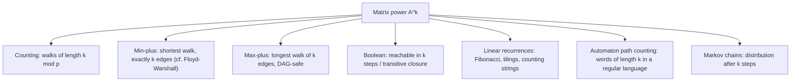

# Paths of Fixed Length (Matrix Exponentiation on Graphs) — Middle Level

> **Focus:** Why `O(V³ log k)` beats the naive DP, how the *same* matrix-power skeleton solves shortest/longest/reachability problems by swapping the semiring, and how linear recurrences are secretly graph walks.

---

## Table of Contents

1. [Introduction](#introduction)
2. [Deeper Concepts](#deeper-concepts)
3. [Comparison with Alternatives](#comparison-with-alternatives)
4. [Advanced Patterns](#advanced-patterns)
5. [Graph and Tree Applications](#graph-and-tree-applications)
6. [Recurrences as Graph Walks](#recurrences-as-graph-walks)
7. [Code Examples](#code-examples)
8. [Error Handling](#error-handling)
9. [Performance Analysis](#performance-analysis)
10. [Best Practices](#best-practices)
11. [Visual Animation](#visual-animation)
12. [Summary](#summary)

---

## Introduction

At junior level the message was a single fact: `(A^k)[i][j]` counts walks of length `k`. At middle level you start asking the engineering questions that decide whether your solution is correct *and* fast:

- When is plain dynamic programming over `k` layers good enough, and when must you switch to matrix exponentiation?
- The `(+, ×)` semiring counts walks. What do you get if you swap in `(min, +)` or `(max, +)` or `(OR, AND)`?
- How do you count walks of length **at most** `k` (not exactly `k`) with one matrix power?
- Why is Fibonacci `O(log n)`, and what does the "graph" for it even look like?
- What is the right *identity matrix* for each semiring, and why does getting it wrong silently break the answer?

These are the questions that separate "I memorized `A^k`" from "I can pick the right algebra for the problem in front of me."

---

## Deeper Concepts

### The walk-counting recurrence, restated

Let `W_k[i][j]` be the number of walks of length `k` from `i` to `j`. Then:

```
W_0 = I                                  (length-0 walks: stay put)
W_k[i][j] = Σ_t W_{k-1}[i][t] · A[t][j]  (append one edge)
```

The right-hand side is matrix multiplication, so `W_k = W_{k-1} · A = A^k`. Two ways to evaluate it:

1. **Layered DP** — apply the recurrence `k` times. Each step is a vector-times-matrix (if you start from one source) or matrix-times-matrix. Cost `O(V² k)` for a single source, `O(V³ k)` for all pairs.
2. **Binary exponentiation** — compute `A^k` directly in `O(V³ log k)` and read any entry.

The crossover is when `k` is large relative to `log k`. For `k = 10^9`, layered DP runs a billion iterations; matrix exponentiation runs ~30. That is the whole reason the technique exists.

### Semirings: one skeleton, many meanings

A **semiring** is a set with two operations, "⊕" (addition) and "⊗" (multiplication), each associative, with `⊗` distributing over `⊕`, and identity elements `0̄` (for `⊕`) and `1̄` (for `⊗`). Matrix "multiplication" only needs these two operations:

```
(A ⊗ B)[i][j] = ⊕_t ( A[i][t] ⊗ B[t][j] )
```

Swap the operations and the *same* code computes a different quantity:

| Semiring | ⊕ | ⊗ | `0̄` | `1̄` (identity diag) | `(A^k)[i][j]` means |
|----------|----|----|------|---------------------|---------------------|
| Counting | `+` | `×` | `0` | `1` | number of length-`k` walks |
| Min-plus (tropical) | `min` | `+` | `+∞` | `0` | **shortest** walk of exactly `k` edges |
| Max-plus | `max` | `+` | `−∞` | `0` | **longest** walk of exactly `k` edges |
| Boolean | `OR` | `AND` | `false` | `true` | is there *any* walk of length `k`? |

The crucial subtlety is the **identity matrix `1̄`**: it has `1̄` on the diagonal and `0̄` off-diagonal. For counting that is the usual identity. For min-plus it is `0` on the diagonal and `+∞` off-diagonal — *not* the all-zeros matrix. Getting this wrong is the #1 semiring bug.

### Min-plus power = shortest walk of exactly `k` edges

In the min-plus semiring, `A[i][j]` is the **edge weight** (`+∞` if no edge). Then:

```
(A^{(k)})[i][j] = min over all length-k walks i→j of (sum of edge weights)
```

where `A^{(k)}` is the `k`-th min-plus power. This is exactly the algebra behind the Floyd-Warshall recurrence (sibling `06-floyd-warshall`): Floyd-Warshall does a smarter `O(V³)` all-pairs computation that effectively considers *all* lengths, whereas min-plus power pins the length to exactly `k`. When you want "shortest path using exactly `k` edges" (e.g., a flight with exactly `k` stops), min-plus matrix power is the right tool; when you want the unconstrained shortest path, Floyd-Warshall or Dijkstra is better.

### "At most `k`" via augmentation

Matrix power gives *exactly* `k`. To get walks of length `0, 1, …, k` summed, you cannot just read one power. Two clean tricks:

1. **Augmented matrix.** Build the `(V+1) × (V+1)` block matrix

   ```
   B = [ A  e ]      where e is a column of 1s (size V), and the
       [ 0  1 ]      bottom-right corner is a self-looping "sink" 1.
   ```

   Then `(B^k)` accumulates partial sums in its extra column. (Details in code below.) This computes `I + A + A² + … + A^{k-1}` style sums in `O(V³ log k)`.

2. **Add a self-loop sentinel.** Append a dummy vertex with a self-loop and an edge from every real vertex to it; a walk that "parks" on the sentinel for the remaining steps encodes a shorter real walk. Same `O(V³ log k)` cost.

Both reduce "≤ k" to a single matrix power of a slightly larger matrix.

---

## Comparison with Alternatives

### Naive layered DP vs matrix exponentiation

| Approach | Single source, walks length `k` | All pairs, walks length `k` | Good when |
|----------|--------------------------------|-----------------------------|-----------|
| BFS/DFS enumeration | `O(branching^k)` | infeasible | never for large `k` |
| Layered DP (vector × matrix) | `O(V² · k)` | `O(V³ · k)` | small `k` (say `k ≤ 1000`) |
| **Matrix exponentiation** | `O(V³ log k)` | `O(V³ log k)` | large `k`, small/medium `V` |
| Eigen-decomposition | `O(V³)` setup, `O(V²)` per `k` | — | many queries, diagonalizable `A`, exact arithmetic available |

Concrete table (`V = 100`):

| `k` | Layered DP ops (`V²k` single-src) | Matrix-exp ops (`V³ log k`) | Winner |
|------|----------------------------------|------------------------------|--------|
| 10 | 100 000 | ~3.3 M | layered DP |
| 10³ | 10 M | ~10 M | tie |
| 10⁶ | 10 G | ~20 M | matrix-exp |
| 10¹⁸ | 10²² (impossible) | ~60 M | matrix-exp |

The lesson: for **small `k`**, layered DP is simpler and even faster (no `V³` per step — it's `V²` per step for one source). For **large `k`**, matrix exponentiation wins by an astronomical margin. Pick based on `k`, not by habit.

### When to prefer min-plus power vs Floyd-Warshall vs Dijkstra

| Need | Tool | Why |
|------|------|-----|
| Shortest path, any length | Dijkstra (non-neg) / Bellman-Ford | `O(E log V)` or `O(VE)`, much cheaper than `V³` |
| All-pairs shortest, any length | Floyd-Warshall (`06-floyd-warshall`) | `O(V³)` once, considers all lengths |
| Shortest path using **exactly** `k` edges | min-plus matrix power | only matrix power pins the edge count |
| Shortest path using **at most** `k` edges | min-plus power of augmented matrix, or Bellman-Ford capped at `k` relaxations | Bellman-Ford's `k`-relaxation already does "≤ k edges" in `O(kE)` |

---

## Advanced Patterns

### Pattern: Shortest walk of exactly `k` edges (min-plus)

Replace `+` with `min` and `×` with `+`. The identity has `0` on the diagonal, `INF` elsewhere.

#### Go

```go
package main

import (
	"fmt"
	"math"
)

const INF = math.MaxInt64 / 4 // /4 so two INF can be added without overflow

type Mat [][]int64

func minPlusMul(a, b Mat) Mat {
	n := len(a)
	c := make(Mat, n)
	for i := range c {
		c[i] = make([]int64, n)
		for j := range c[i] {
			c[i][j] = INF
		}
		for t := 0; t < n; t++ {
			if a[i][t] >= INF {
				continue
			}
			for j := 0; j < n; j++ {
				if v := a[i][t] + b[t][j]; v < c[i][j] {
					c[i][j] = v
				}
			}
		}
	}
	return c
}

func minPlusIdentity(n int) Mat {
	id := make(Mat, n)
	for i := range id {
		id[i] = make([]int64, n)
		for j := range id[i] {
			if i == j {
				id[i][j] = 0
			} else {
				id[i][j] = INF
			}
		}
	}
	return id
}

func minPlusPow(a Mat, k int64) Mat {
	result := minPlusIdentity(len(a))
	for k > 0 {
		if k&1 == 1 {
			result = minPlusMul(result, a)
		}
		a = minPlusMul(a, a)
		k >>= 1
	}
	return result
}

func main() {
	// weighted graph; INF means no edge
	A := Mat{
		{INF, 2, 5},
		{INF, INF, 1},
		{4, INF, INF},
	}
	res := minPlusPow(A, 3)
	fmt.Println("shortest 3-edge walk 0->2 =", res[0][2]) // 0->1->2->? ... uses exactly 3 edges
}
```

#### Java

```java
public class MinPlusPower {
    static final long INF = Long.MAX_VALUE / 4;

    static long[][] minPlusMul(long[][] a, long[][] b) {
        int n = a.length;
        long[][] c = new long[n][n];
        for (long[] row : c) java.util.Arrays.fill(row, INF);
        for (int i = 0; i < n; i++) {
            for (int t = 0; t < n; t++) {
                if (a[i][t] >= INF) continue;
                for (int j = 0; j < n; j++) {
                    long v = a[i][t] + b[t][j];
                    if (v < c[i][j]) c[i][j] = v;
                }
            }
        }
        return c;
    }

    static long[][] identity(int n) {
        long[][] id = new long[n][n];
        for (int i = 0; i < n; i++)
            for (int j = 0; j < n; j++)
                id[i][j] = (i == j) ? 0 : INF;
        return id;
    }

    static long[][] minPlusPow(long[][] a, long k) {
        long[][] result = identity(a.length);
        while (k > 0) {
            if ((k & 1) == 1) result = minPlusMul(result, a);
            a = minPlusMul(a, a);
            k >>= 1;
        }
        return result;
    }

    public static void main(String[] args) {
        long I = INF;
        long[][] A = {
            {I, 2, 5},
            {I, I, 1},
            {4, I, I},
        };
        long[][] res = minPlusPow(A, 3);
        System.out.println("shortest 3-edge walk 0->2 = " + res[0][2]);
    }
}
```

#### Python

```python
INF = float("inf")


def min_plus_mul(a, b):
    n = len(a)
    c = [[INF] * n for _ in range(n)]
    for i in range(n):
        for t in range(n):
            if a[i][t] == INF:
                continue
            ait = a[i][t]
            bt = b[t]
            ci = c[i]
            for j in range(n):
                v = ait + bt[j]
                if v < ci[j]:
                    ci[j] = v
    return c


def min_plus_identity(n):
    return [[0 if i == j else INF for j in range(n)] for i in range(n)]


def min_plus_pow(a, k):
    result = min_plus_identity(len(a))
    while k > 0:
        if k & 1:
            result = min_plus_mul(result, a)
        a = min_plus_mul(a, a)
        k >>= 1
    return result


if __name__ == "__main__":
    A = [
        [INF, 2, 5],
        [INF, INF, 1],
        [4, INF, INF],
    ]
    res = min_plus_pow(A, 3)
    print("shortest 3-edge walk 0->2 =", res[0][2])
```

### Pattern: "At most `k`" walks via augmented matrix

To count walks of length `0` through `k`, augment `A` with one sink column that accumulates the running total. Build:

```
B (size (V+1) x (V+1)) =
    rows/cols 0..V-1: copy of A
    column V (the sink): every real vertex has a 1 into the sink
    B[V][V] = 1   (sink self-loop keeps already-counted walks alive)
```

Then `(B^{k+1})[src][V]` equals `Σ_{L=0}^{k} (number of length-L walks from src to any real vertex)`. The sink "absorbs" a walk once it decides to stop, and the self-loop carries that absorbed count forward through the remaining steps.

### Pattern: Reachability in exactly `k` steps (Boolean)

Replace `+` with `OR` and `×` with `AND`. Now `(A^k)[i][j]` is `true` iff *some* walk of length exactly `k` exists from `i` to `j`. The OR-AND identity is `true` on the diagonal, `false` off-diagonal. For "reachable in at most `k` steps", use the augmented/transitive-closure variants. The boolean variant is the foundation of automaton reachability.

---

## Graph and Tree Applications



### Automaton / regular-language path counting

A finite automaton *is* a labeled graph. Let `A[i][j]` be the number of transitions (edges) from state `i` to state `j`. Then `(A^k)[start][accept]` counts the number of accepted words of length exactly `k`. Summing over all accepting states gives the total number of length-`k` strings the automaton accepts — a standard combinatorics-on-words technique. (E.g., "how many binary strings of length `k` avoid the substring `11`?" is a 2-state automaton walk count.)

### Markov chains: step distributions

If `P` is the row-stochastic transition matrix of a Markov chain (`P[i][j]` = probability of `i → j`), then `(P^k)[i][j]` is the probability of being in state `j` after exactly `k` steps starting from `i`. This is the *probabilistic* cousin of walk counting: same matrix power, real-valued `(+, ×)` semiring. Binary exponentiation gives the `k`-step distribution for huge `k` cheaply.

---

## Recurrences as Graph Walks

A linear recurrence is a walk on a tiny "state graph". Take Fibonacci: `F_n = F_{n-1} + F_{n-2}`. Encode the state vector `(F_n, F_{n-1})` and find the transition matrix `T` with:

```
[ F_n     ]   [ 1  1 ] [ F_{n-1} ]
[ F_{n-1} ] = [ 1  0 ] [ F_{n-2} ]
```

So `T = [[1,1],[1,0]]` and `(F_{n+1}, F_n) = T^n · (F_1, F_0)`. Computing `T^n` by binary exponentiation gives Fibonacci in `O(log n)` matrix multiplies (each `2×2`, so `O(1)` real work) — that is `O(log n)` total. The "graph" here has 2 vertices, and `(T^n)[0][0]` is literally a weighted walk count.

#### Go

```go
package main

import "fmt"

const MOD = 1_000_000_007

func mul2(a, b [2][2]int64) [2][2]int64 {
	var c [2][2]int64
	for i := 0; i < 2; i++ {
		for j := 0; j < 2; j++ {
			for t := 0; t < 2; t++ {
				c[i][j] = (c[i][j] + a[i][t]*b[t][j]) % MOD
			}
		}
	}
	return c
}

func fib(n int64) int64 {
	result := [2][2]int64{{1, 0}, {0, 1}} // identity
	base := [2][2]int64{{1, 1}, {1, 0}}
	for n > 0 {
		if n&1 == 1 {
			result = mul2(result, base)
		}
		base = mul2(base, base)
		n >>= 1
	}
	// result = T^n ; F_n sits at result[0][1] (since T^n * (F_1,F_0) with F_1=1,F_0=0)
	return result[0][1]
}

func main() {
	fmt.Println(fib(10)) // 55
	fmt.Println(fib(100000000000)) // huge index, mod p, instant
}
```

#### Java

```java
public class FibMatrix {
    static final long MOD = 1_000_000_007L;

    static long[][] mul(long[][] a, long[][] b) {
        long[][] c = new long[2][2];
        for (int i = 0; i < 2; i++)
            for (int j = 0; j < 2; j++)
                for (int t = 0; t < 2; t++)
                    c[i][j] = (c[i][j] + a[i][t] * b[t][j]) % MOD;
        return c;
    }

    static long fib(long n) {
        long[][] result = {{1, 0}, {0, 1}};
        long[][] base = {{1, 1}, {1, 0}};
        while (n > 0) {
            if ((n & 1) == 1) result = mul(result, base);
            base = mul(base, base);
            n >>= 1;
        }
        return result[0][1];
    }

    public static void main(String[] args) {
        System.out.println(fib(10));            // 55
        System.out.println(fib(100000000000L)); // instant, mod p
    }
}
```

#### Python

```python
MOD = 1_000_000_007


def mul(a, b):
    return [
        [sum(a[i][t] * b[t][j] for t in range(2)) % MOD for j in range(2)]
        for i in range(2)
    ]


def fib(n):
    result = [[1, 0], [0, 1]]   # identity
    base = [[1, 1], [1, 0]]
    while n > 0:
        if n & 1:
            result = mul(result, base)
        base = mul(base, base)
        n >>= 1
    return result[0][1]


if __name__ == "__main__":
    print(fib(10))               # 55
    print(fib(100_000_000_000))  # instant, mod p
```

The same recipe handles any constant-coefficient linear recurrence (tilings, counting strings with forbidden patterns, tribonacci, etc.): build the `r × r` companion matrix, power it, read off the answer. The matrix is the "graph", and the recurrence value is a weighted walk count.

---

## Code Examples

### All-pairs walk counts with a reusable Matrix type (counting semiring)

This is the same engine as `junior.md` but factored cleanly so the same `pow` skeleton can be reused for any semiring by swapping `multiply` and `identity`.

#### Python

```python
MOD = 1_000_000_007


def mat_mul(a, b, mod=MOD):
    n, m, p = len(a), len(b), len(b[0])
    c = [[0] * p for _ in range(n)]
    for i in range(n):
        ai = a[i]
        ci = c[i]
        for t in range(m):
            if ai[t]:
                ait, bt = ai[t], b[t]
                for j in range(p):
                    ci[j] = (ci[j] + ait * bt[j]) % mod
    return c


def mat_pow(a, k, mod=MOD):
    n = len(a)
    result = [[1 if i == j else 0 for j in range(n)] for i in range(n)]
    while k > 0:
        if k & 1:
            result = mat_mul(result, a, mod)
        a = mat_mul(a, a, mod)
        k >>= 1
    return result


def count_walks(adj, k, mod=MOD):
    """Return the matrix W where W[i][j] = #walks of length k from i to j (mod)."""
    return mat_pow(adj, k, mod)
```

---

## Error Handling

| Scenario | What goes wrong | Correct approach |
|----------|-----------------|------------------|
| Wrong identity for the semiring | Min-plus power returns all-`INF` or zeros. | Identity = `1̄` on diagonal, `0̄` off-diagonal (`0`/`INF` for min-plus). |
| `INF + INF` overflows in min-plus | Two "no edge" sentinels sum past `MAX_INT`. | Use `INF = MAX/4` and skip `a[i][t] == INF` before adding. |
| Forgot mod in counting semiring | 64-bit overflow → garbage. | Reduce after every accumulation. |
| Mixing semirings | Used `+` identity (zeros) for a min-plus power. | Keep multiply + identity paired per semiring. |
| "Exactly k" vs "at most k" confusion | Returned a single power for an "≤ k" question. | Use the augmented-matrix construction for "≤ k". |
| Non-square or mismatched dims | Multiply silently produces wrong shape. | Assert dimensions; keep all matrices `V × V` (or augmented `(V+1)`). |

---

## Performance Analysis

| `V` | one multiply `O(V³)` | `A^k` for `k = 10^18` (`~60` multiplies) |
|-----|---------------------|-------------------------------------------|
| 10 | 1 000 ops | ~60 000 ops — instant |
| 50 | 125 000 ops | ~7.5 M ops — instant |
| 100 | 1 M ops | ~60 M ops — well under a second |
| 300 | 27 M ops | ~1.6 G ops — a few seconds |
| 500 | 125 M ops | ~7.5 G ops — slow; consider blocking/numpy |

The dominant cost is `V³` per multiply; `log k ≈ 60` multiplies even for `k = 10^18`. The technique is excellent for `V ≤ ~300` and impractical beyond `V ≈ 1000` unless you use optimized BLAS-style multiply (numpy `@`, or fast matrix-multiply libraries).

```python
import time

def benchmark(V, k):
    import random
    A = [[random.randint(0, 1) for _ in range(V)] for _ in range(V)]
    start = time.perf_counter()
    _ = mat_pow(A, k)
    return time.perf_counter() - start

# Typical: V=100, k=10**18 -> well under 1s in CPython with the zero-skip optimization.
```

The single biggest constant-factor win in pure-Python/Go/Java is the `if a[i][t] == 0: continue` skip on sparse matrices, plus the cache-friendly `i, t, j` loop order.

---

## Best Practices

- **Pick `k`-aware:** small `k` → layered DP (`O(V²k)` single source); large `k` → matrix exponentiation.
- **Keep the matrix minimal:** for recurrences, the matrix is `order × order`, not `V × V`. A 2×2 Fibonacci matrix powers in `O(log n)`.
- **Pair multiply + identity per semiring:** never reuse the counting identity for a min-plus power.
- **Always test against the layered-DP oracle** on random small graphs and small `k`.
- **Reduce mod consistently** in the counting semiring; pick `INF = MAX/4` in min/max-plus.
- **Reuse buffers** in hot loops to dodge GC pressure; preallocate scratch matrices.

---

## Visual Animation

> See [`animation.html`](./animation.html) for an interactive view.
>
> The middle-level animation highlights:
> - The squaring ladder `A → A² → A⁴ → A⁸` and how binary digits of `k` select which powers to multiply in.
> - A toggle between the counting `(+, ×)` semiring and the min-plus `(min, +)` semiring on the same graph.
> - The `(i, j)` entry interpreted as a walk count (or shortest distance) of the current length.

---

## Summary

The `O(V³ log k)` matrix-power method is the right answer when `k` is large and `V` is small. The deep idea is that matrix multiplication is parameterized by a **semiring**: `(+, ×)` counts walks, `(min, +)` finds shortest walks of an exact length (the same algebra Floyd-Warshall uses, sibling `06-floyd-warshall`), `(max, +)` finds longest, and `(OR, AND)` decides reachability. The "at most `k`" variant comes from augmenting the matrix with a sink. And any linear recurrence — Fibonacci being the canonical example — is a weighted walk on a tiny state graph, evaluated in `O(log n)` by powering its companion matrix. Master the semiring abstraction and one piece of code solves a whole family of length-constrained graph problems.
