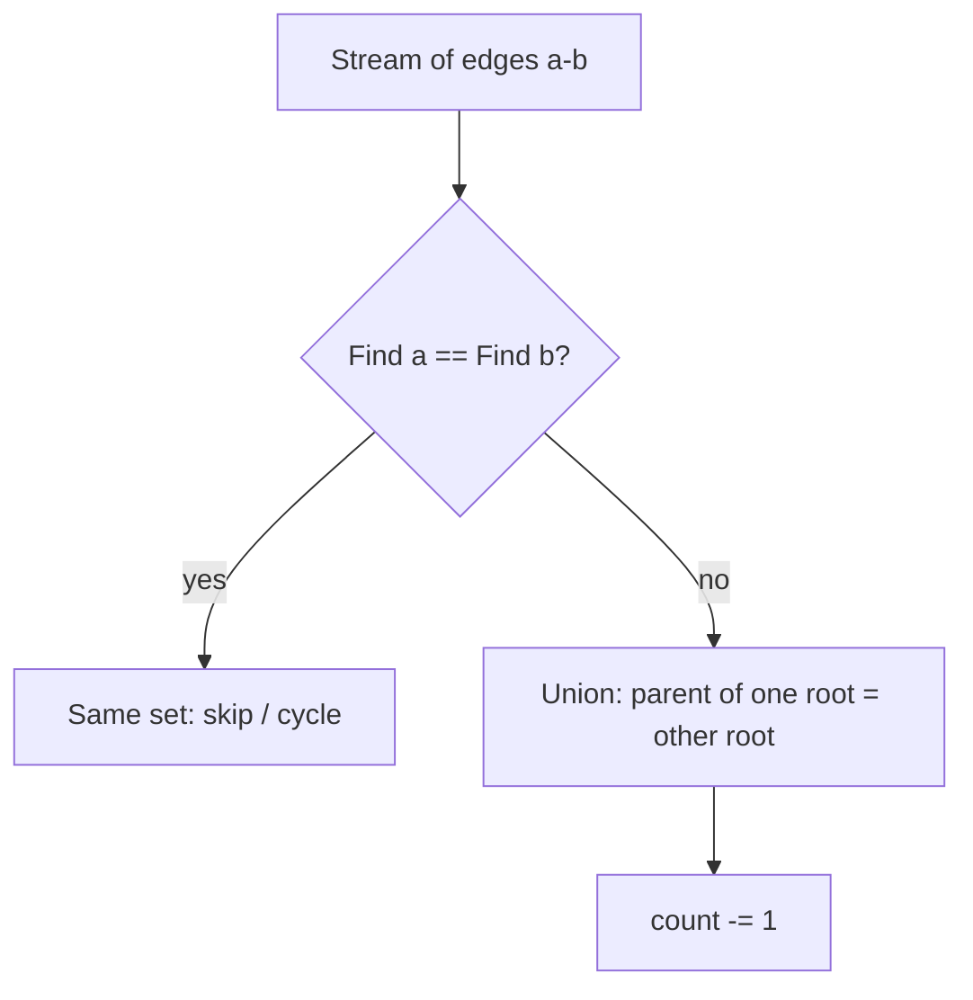

# Union-Find (Disjoint Set Union) — Junior Level

> **One-line summary:** Union-Find (Disjoint Set Union, DSU) keeps a collection of disjoint sets and answers "are `a` and `b` in the same set?" by maintaining a forest of rooted trees in a single `parent[]` array. `Find(x)` walks to the root of `x`'s tree; `Union(a, b)` links one root under the other. It is the canonical structure for *dynamic connectivity*.

---

## Table of Contents

1. [Introduction](#introduction)
2. [Prerequisites](#prerequisites)
3. [Glossary](#glossary)
4. [Core Concepts](#core-concepts)
5. [Big-O Summary](#big-o-summary)
6. [Real-World Analogies](#real-world-analogies)
7. [Pros & Cons](#pros--cons)
8. [Step-by-Step Walkthrough](#step-by-step-walkthrough)
9. [Code Examples](#code-examples)
10. [Coding Patterns](#coding-patterns)
11. [Error Handling](#error-handling)
12. [Performance Tips](#performance-tips)
13. [Best Practices](#best-practices)
14. [Edge Cases & Pitfalls](#edge-cases--pitfalls)
15. [Common Mistakes](#common-mistakes)
16. [Cheat Sheet](#cheat-sheet)
17. [Visual Animation](#visual-animation)
18. [Summary](#summary)
19. [Further Reading](#further-reading)

---

## Introduction

**Union-Find**, also called the **Disjoint Set Union** (DSU), is one of those rare data structures that is tiny to write — twenty lines — yet powers algorithms you use every day: building a minimum spanning tree (Kruskal's algorithm), detecting whether adding an edge creates a cycle, grouping pixels in image segmentation, modelling percolation in physics, and answering "are these two users in the same friend circle?".

The problem it solves is **dynamic connectivity**. You start with `n` separate elements, each in its own set. Over time two operations arrive in a stream:

1. **Union(a, b)** — merge the set containing `a` with the set containing `b`.
2. **Find(x)** (or **Connected(a, b)**) — ask which set `x` belongs to, so you can tell whether `a` and `b` are now connected.

You could answer each connectivity query by running BFS or DFS over a graph — but that is `O(n + m)` *per query*. Union-Find instead maintains the connectivity *incrementally*, so each operation is nearly constant time once optimized. That is its whole reason to exist: it beats re-running a graph search whenever connections are added one at a time and you must answer questions in between.

The structure was studied by **Galler and Fischer (1964)** and analyzed to its famous near-constant bound by **Robert Tarjan (1975)**. The key idea is deceptively simple: represent each set as a **rooted tree**, and identify the set by the **root** of that tree (its *representative*). To union two sets, you just point one root at the other. To find which set an element belongs to, you follow parent pointers up to the root.

This file covers the **foundational** structure only: the `parent[]` array, naive `Find` and `Union`, and why they work. Two crucial speedups — **path compression** and **union by rank/size** — get their own dedicated topics, `02-path-compression` and `03-union-by-rank`. Here we deliberately use the *un-optimized* version so you can see clearly what those optimizations later fix.

---

## Prerequisites

Before you read this file you should be comfortable with:

- **Arrays and integer indexing** — the whole structure lives in one `int[]`.
- **Loops and `while` conditions** — `Find` is a `while` loop walking to a root.
- **The idea of a tree and a root** — each set is a rooted tree.
- **Basic graph vocabulary** — vertices, edges, connected components.
- **Big-O notation** — `O(1)`, `O(log n)`, `O(n)`.

Optional but helpful:

- Having seen **BFS/DFS connectivity** at least once, so you appreciate why DSU is faster for incremental queries.
- A first encounter with **Kruskal's MST algorithm**, which is the textbook customer of Union-Find.

---

## Glossary

| Term | Meaning |
|------|---------|
| **Disjoint sets** | A partition of `{0, …, n-1}` into groups that never overlap. Every element is in exactly one set. |
| **Disjoint Set Union (DSU)** | The data structure that maintains these sets under `MakeSet`, `Find`, and `Union`. |
| **MakeSet(x)** | Create a new singleton set `{x}`. Usually done once for every element at initialization. |
| **Find(x)** | Return the *representative* (root) of the set containing `x`. |
| **Union(a, b)** | Merge the two sets containing `a` and `b` into one. |
| **Connected(a, b)** | `true` if `Find(a) == Find(b)`. |
| **Representative / root** | The single canonical element that identifies a set. Two elements are in the same set iff they have the same representative. |
| **parent[]** | The array that stores, for each element, the index of its parent in the forest. A root points to itself. |
| **Forest** | The collection of rooted trees; one tree per set. |
| **QuickFind** | A naive variant storing a flat *label* array (`id[x]` = set id). `Find` is `O(1)`, but `Union` rewrites many labels in `O(n)`. |
| **QuickUnion** | The forest variant. `Union` links roots; `Find` walks to a root. This is the structure we build here. |
| **Component / set count** | How many distinct sets currently exist. Starts at `n`, decreases by one on each *effective* union. |
| **Path compression** | An optimization (separate topic) that flattens the tree during `Find`. |
| **Union by rank / size** | An optimization (separate topic) that always links the smaller tree under the larger. |

---

## Core Concepts

### 1. The Disjoint-Set ADT

A disjoint-set structure supports exactly three operations:

```
MakeSet(x)   : create the singleton {x}
Find(x)      : return the representative of x's set
Union(a, b)  : merge the sets of a and b
```

A fourth, `Connected(a, b)`, is just `Find(a) == Find(b)`. The contract is:

- After `MakeSet(x)`, `Find(x) == x`.
- `Find` is **consistent**: if nothing changes between two calls, `Find(x)` returns the same value.
- After `Union(a, b)`, `Find(a) == Find(b)`, and every element previously equal to `Find(a)` or `Find(b)` now shares one representative.

The representative is arbitrary but stable — you never care *which* element is the root, only that two elements in the same set agree on it.

### 2. The `parent[]` Forest

The entire structure is one array, `parent[]`. Each set is a rooted tree:

- `parent[x]` is the index of `x`'s parent.
- A **root** `r` satisfies `parent[r] == r` (it points to itself).

Initially every element is its own root, so the forest is `n` singleton trees:

```
index:   0  1  2  3  4  5
parent:  0  1  2  3  4  5      <- everyone points to themselves (all roots)
```

After `Union(0,1)` and `Union(2,3)` (linking the second root under the first), one possible forest:

```
parent:  0  0  2  2  4  5

    0       2     4   5
    |       |
    1       3
```

Sets are `{0,1}`, `{2,3}`, `{4}`, `{5}`. The roots `0`, `2`, `4`, `5` are the representatives.

### 3. Find — Walk to the Root

`Find(x)` follows parent pointers until it reaches a node that points to itself:

```
Find(x):
    while parent[x] != x:
        x = parent[x]
    return x
```

The cost is the **depth** of `x` in its tree. In the naive version with no balancing, a tree can degenerate into a chain of length `n`, so `Find` is `O(n)` worst case. (Both optimization topics exist precisely to bound this.)

### 4. Union — Link Two Roots

`Union(a, b)` finds both roots, then links one under the other:

```
Union(a, b):
    ra = Find(a)
    rb = Find(b)
    if ra == rb:
        return            # already in the same set, nothing to do
    parent[ra] = rb       # link a's root under b's root
    count = count - 1     # one fewer set
```

The single most important rule: **you must find the roots first.** Writing `parent[a] = b` instead of `parent[Find(a)] = Find(b)` is the classic beginner bug — it links two *non-root* nodes and silently corrupts the forest.

### 5. QuickFind vs QuickUnion

There are two ways to represent disjoint sets. They trade off which operation is cheap.

**QuickFind** keeps a flat label array `id[]`, where `id[x]` is the set id of `x`:

```
Find(x):     return id[x]                       # O(1) — just a lookup
Union(a, b): old = id[a]; new = id[b]
             for each i: if id[i] == old: id[i] = new   # O(n) — relabel everyone
```

`Find` is instant, but each `Union` scans the whole array. `m` unions cost `O(m·n)` — far too slow.

**QuickUnion** (the forest, what we build here):

```
Find(x):     walk parent[] to the root          # O(tree height)
Union(a, b): link one root under the other       # O(2 · Find)
```

`Union` is cheap (just one assignment after two `Find`s), and `Find` is bounded by tree height. With the later optimizations, both become *amortized near-constant*. Almost every real DSU uses QuickUnion.

| | QuickFind | QuickUnion (this file) |
|---|---|---|
| Representation | flat label array `id[]` | forest via `parent[]` |
| `Find` | `O(1)` | `O(height)` — up to `O(n)` naive |
| `Union` | `O(n)` (relabel) | `O(height)` — dominated by `Find` |
| Scales? | no | yes (with optimizations) |

---

## Big-O Summary

These bounds are for the **naive** QuickUnion in this file — no path compression, no union by rank.

| Operation | Time | Space | Notes |
|-----------|------|-------|-------|
| `MakeSet(x)` | **O(1)** | O(1) | Set `parent[x] = x`. |
| `Find(x)` | **O(n)** worst | O(1) | Walk to root; degenerate chain is `O(n)`. |
| `Union(a, b)` | **O(n)** worst | O(1) | Two `Find`s plus one pointer write. |
| `Connected(a, b)` | **O(n)** worst | O(1) | Two `Find`s. |
| Initialization of `n` sets | **O(n)** | O(n) | Fill `parent[i] = i`. |
| Total space | **O(n)** | — | One `int[]` (plus optional `size[]`/`count`). |

> **Forward reference.** With **union by rank/size** alone, `Find` drops to `O(log n)`. With **path compression** added, the *amortized* cost of any operation becomes `O(α(n))`, where `α` is the inverse Ackermann function — effectively a constant (`α(n) ≤ 4` for any `n` you will ever meet). Those proofs and implementations live in `02-path-compression` and `03-union-by-rank`. Here we keep the naive bounds so the optimizations have something to improve.

---

## Real-World Analogies

| Concept | Analogy |
|---------|---------|
| Disjoint sets | Islands in an ocean. Each island is a separate set of people. |
| `Union(a, b)` | Building a bridge between two islands — now everyone on both islands can reach each other, so they become one big island. |
| `Find(x)` | Asking "which island am I on?" by following a chain of "who's your leader?" pointers up to the island's chief. |
| Representative / root | The island chief. Everyone on the same island reports the same chief. |
| `Connected(a, b)` | "Do we share a chief?" If yes, you're on the same island. |
| Set count | The number of separate islands remaining; each new bridge reduces it by one. |

Another classic framing is **friend circles**. Each person starts alone. "`a` and `b` became friends" is a `Union`. "Are `a` and `b` in the same circle?" is `Connected`. Friendship is *transitive through the structure*: if `a–b` and `b–c` were unioned, then `a` and `c` end up in the same circle automatically, because they share a root.

Where the analogy breaks: in the naive structure the "chain of leaders" can get long (a degenerate tree). Path compression is like everyone on the island updating their phone to dial the chief *directly* after the first time they look them up.

---

## Pros & Cons

| Pros | Cons |
|------|------|
| Trivially small: a working DSU is ~20 lines. | Only supports **union**, never **split/un-union** (not the basic structure — that needs much heavier machinery). |
| Near-constant amortized time per operation (with optimizations). | You cannot enumerate a set's members without scanning all elements. |
| One contiguous `int[]` — cache-friendly, no node allocation. | The representative is arbitrary and may change after a union; do not rely on its identity. |
| Beats re-running BFS/DFS for *incremental* connectivity queries. | Edges are undirected and unweighted by default; weighted/directed connectivity needs extensions. |
| Tracks the number of components for free with one counter. | Worst-case `O(n)` per op *without* the optimizations (so always add them in practice). |

**When to use:** Kruskal's MST, cycle detection in an undirected graph, connected components built incrementally, percolation, image segmentation, friend/account merging, "number of islands" style grouping, equivalence-class bookkeeping.

**When NOT to use:** you need to *remove* edges or *split* sets (use link-cut trees or offline techniques), you need shortest paths or weighted distances (use BFS/Dijkstra), or you need to list every member of a set frequently (keep an explicit adjacency list).

---

## Step-by-Step Walkthrough

Start with 6 elements, each its own set. We use **naive QuickUnion**, always linking the first root under the second (`parent[ra] = rb`).

```
Initial:  parent = [0, 1, 2, 3, 4, 5]    sets: {0}{1}{2}{3}{4}{5}   count = 6
```

**Union(0, 1):** `Find(0)=0`, `Find(1)=1`, link `parent[0]=1`.

```
parent = [1, 1, 2, 3, 4, 5]    sets: {0,1}{2}{3}{4}{5}   count = 5

    1            (root)
    |
    0
```

**Union(2, 3):** `Find(2)=2`, `Find(3)=3`, link `parent[2]=3`.

```
parent = [1, 1, 3, 3, 4, 5]    sets: {0,1}{2,3}{4}{5}    count = 4
```

**Union(1, 3):** `Find(1)=1`, `Find(3)=3`, link `parent[1]=3`. Now the `{0,1}` tree hangs under root `3`.

```
parent = [1, 3, 3, 3, 4, 5]    sets: {0,1,2,3}{4}{5}     count = 3

       3          (root)
      / \
     1   2
     |
     0
```

**Union(4, 5):** `parent[4]=5`.

```
parent = [1, 3, 3, 3, 5, 5]    sets: {0,1,2,3}{4,5}      count = 2
```

**Connected(0, 2):** `Find(0)`: `0→1→3` (root `3`). `Find(2)`: `2→3` (root `3`). Same root → **true**.

**Connected(0, 4):** `Find(0)=3`, `Find(4)=5`. Different roots → **false**.

**Union(0, 0):** `Find(0)=3`, `Find(0)=3`, roots equal → no-op, `count` unchanged. This is the important *self-union / already-connected* case: it must do nothing and must **not** decrement the count.

Notice how `Find(0)` already had to walk `0→1→3`, a depth-2 path. Without balancing, those paths only grow. That is exactly what the optimization topics fix.

---

## Code Examples

### Example: Full DSU class (QuickUnion, with `count`)

This is the naive forest version: `parent[]` plus a `count` of how many sets remain. No path compression, no union by rank — that is on purpose for this foundational topic.

#### Go

```go
package main

import "fmt"

type DSU struct {
	parent []int
	count  int // number of disjoint sets
}

func NewDSU(n int) *DSU {
	parent := make([]int, n)
	for i := range parent {
		parent[i] = i // MakeSet: every element is its own root
	}
	return &DSU{parent: parent, count: n}
}

// Find returns the representative (root) of x's set.
func (d *DSU) Find(x int) int {
	for d.parent[x] != x { // walk up to the root
		x = d.parent[x]
	}
	return x
}

// Union merges the sets of a and b. Returns true if a merge happened.
func (d *DSU) Union(a, b int) bool {
	ra, rb := d.Find(a), d.Find(b)
	if ra == rb {
		return false // already in the same set
	}
	d.parent[ra] = rb // link a's root under b's root
	d.count--
	return true
}

func (d *DSU) Connected(a, b int) bool {
	return d.Find(a) == d.Find(b)
}

func (d *DSU) Count() int { return d.count }

func main() {
	d := NewDSU(6)
	d.Union(0, 1)
	d.Union(2, 3)
	d.Union(1, 3)
	d.Union(4, 5)
	fmt.Println(d.Connected(0, 2)) // true
	fmt.Println(d.Connected(0, 4)) // false
	fmt.Println(d.Count())         // 2
}
```

#### Java

```java
public class DSU {
    private final int[] parent;
    private int count; // number of disjoint sets

    public DSU(int n) {
        parent = new int[n];
        for (int i = 0; i < n; i++) {
            parent[i] = i; // MakeSet: every element is its own root
        }
        count = n;
    }

    // Find returns the representative (root) of x's set.
    public int find(int x) {
        while (parent[x] != x) { // walk up to the root
            x = parent[x];
        }
        return x;
    }

    // Union merges the sets of a and b. Returns true if a merge happened.
    public boolean union(int a, int b) {
        int ra = find(a), rb = find(b);
        if (ra == rb) {
            return false; // already in the same set
        }
        parent[ra] = rb; // link a's root under b's root
        count--;
        return true;
    }

    public boolean connected(int a, int b) {
        return find(a) == find(b);
    }

    public int count() { return count; }

    public static void main(String[] args) {
        DSU d = new DSU(6);
        d.union(0, 1);
        d.union(2, 3);
        d.union(1, 3);
        d.union(4, 5);
        System.out.println(d.connected(0, 2)); // true
        System.out.println(d.connected(0, 4)); // false
        System.out.println(d.count());         // 2
    }
}
```

#### Python

```python
class DSU:
    def __init__(self, n: int):
        self.parent = list(range(n))  # MakeSet: every element is its own root
        self.count = n                # number of disjoint sets

    def find(self, x: int) -> int:
        while self.parent[x] != x:    # walk up to the root
            x = self.parent[x]
        return x

    def union(self, a: int, b: int) -> bool:
        ra, rb = self.find(a), self.find(b)
        if ra == rb:
            return False              # already in the same set
        self.parent[ra] = rb          # link a's root under b's root
        self.count -= 1
        return True

    def connected(self, a: int, b: int) -> bool:
        return self.find(a) == self.find(b)


if __name__ == "__main__":
    d = DSU(6)
    d.union(0, 1)
    d.union(2, 3)
    d.union(1, 3)
    d.union(4, 5)
    print(d.connected(0, 2))  # True
    print(d.connected(0, 4))  # False
    print(d.count)            # 2
```

**What it does:** builds the forest from the walkthrough above and answers connectivity queries plus a component count.
**Run:** `go run main.go` | `javac DSU.java && java DSU` | `python dsu.py`

---

## Coding Patterns

### Pattern 1: Count Connected Components from an Edge List

**Intent:** Given `n` nodes and a list of undirected edges, count how many connected components there are.

```python
def count_components(n, edges):
    d = DSU(n)
    for a, b in edges:
        d.union(a, b)
    return d.count
```

`count` starts at `n` and drops by one for every *effective* union, so it equals the number of components at the end. No second pass needed.

### Pattern 2: Cycle Detection in an Undirected Graph

**Intent:** While adding edges, an edge `(a, b)` closes a cycle exactly when `a` and `b` are *already* connected.

```python
def has_cycle(n, edges):
    d = DSU(n)
    for a, b in edges:
        if d.connected(a, b):   # both endpoints already in one set
            return True
        d.union(a, b)
    return False
```

This is the heart of Kruskal's MST: skip any edge whose endpoints are already connected, because it would form a cycle.

### Pattern 3: Kruskal's Minimum Spanning Tree (sketch)

**Intent:** Sort edges by weight, then add each edge whose endpoints are not yet connected.

```python
def kruskal(n, weighted_edges):  # weighted_edges: list of (w, a, b)
    d = DSU(n)
    total = 0
    for w, a, b in sorted(weighted_edges):
        if d.union(a, b):        # union returns False if it would make a cycle
            total += w
    return total
```



---

## Error Handling

| Error | Cause | Fix |
|-------|-------|-----|
| `IndexOutOfBounds` on `Find(x)` | `x` outside `[0, n)`. | Validate inputs; size the array to the real element count. |
| Linking non-roots: forest corrupts | Wrote `parent[a] = b` instead of `parent[Find(a)] = Find(b)`. | Always union *roots*: `parent[ra] = rb`. |
| `count` drifts wrong | Decremented `count` even when `ra == rb`. | Decrement only on an *effective* union (when roots differ). |
| Infinite loop in `Find` | A cycle was created in `parent[]` by linking a root to one of its own descendants. | Only ever set `parent[root] = otherRoot` where the two roots are distinct. |
| Off-by-one between 1-indexed input and 0-indexed array | Problem labels nodes `1..n` but array is `0..n-1`. | Either allocate `n+1` slots, or subtract 1 on input. Pick one and document it. |

---

## Performance Tips

- **Always add the optimizations in real code.** The naive version here is for understanding; in production use union by size/rank plus path compression (`02-path-compression`, `03-union-by-rank`). They turn `O(n)` per op into amortized `O(α(n))`.
- **Pre-size the array once** to `n` (or `n+1` for 1-indexed input). Avoid growing it element by element.
- **Use a flat `int[]`**, not a map of objects. Integer indices are far faster and more cache-friendly than hashing object identities.
- **Track `count` incrementally** instead of recomputing components with a scan at the end.
- **Cache `Find` results in a local variable** when you call it twice in one logic block, e.g. inside `Union`.

---

## Best Practices

- Initialize with an explicit `MakeSet` loop (`parent[i] = i`) — never leave the array zero-filled, or every element falsely roots at index 0.
- Make `Union` return a boolean ("did a merge happen?"). It makes Kruskal and cycle detection one-liners.
- Decide and document your indexing convention (0-based vs 1-based) at the top of the structure.
- Treat the representative as opaque: compare roots for equality, but never assume a specific element stays the root after unions.
- Write a brute-force "label every node by BFS" baseline and test your DSU against it on random edge streams.

---

## Edge Cases & Pitfalls

- **Self-union `Union(x, x)`** — both `Find`s return the same root; it must be a no-op and must not change `count`.
- **Re-union of already-connected elements** — same as above; common in Kruskal where many edges are redundant.
- **Singletons** — an element never unioned has `parent[x] == x`; `Find(x) == x` is correct, not a bug.
- **Empty structure (`n = 0`)** — `count = 0`, no operations valid; guard if your input can be empty.
- **All elements in one set** — after `n-1` effective unions, `count == 1`; the tree may be a long chain in the naive version.
- **Duplicate edges** — harmless; the second `Union` of the same pair is just a no-op.

---

## Common Mistakes

1. **Linking non-roots.** `parent[a] = b` instead of `parent[Find(a)] = Find(b)`. Silently breaks the forest; everything downstream is wrong.
2. **Decrementing `count` unconditionally.** You must only subtract when `ra != rb`.
3. **Forgetting `MakeSet`.** Leaving `parent` zero-initialized makes index 0 a false parent of everyone.
4. **Assuming the root is stable.** After a union the representative can change; never store "the root" long-term.
5. **Using `Find` once and reusing a stale root** across operations that may have re-linked the tree.
6. **Mixing 0-indexed array with 1-indexed problem labels**, producing off-by-one membership bugs.
7. **Expecting un-union / delete.** The basic DSU cannot split a set; do not design around removing edges.

---

## Cheat Sheet

| Operation | Naive Time | Space | What it does |
|-----------|-----------|-------|--------------|
| `MakeSet(x)` | O(1) | O(1) | `parent[x] = x` |
| `Find(x)` | O(n) | O(1) | walk `parent[]` to the root |
| `Union(a,b)` | O(n) | O(1) | `parent[Find(a)] = Find(b)`; `count--` if distinct |
| `Connected(a,b)` | O(n) | O(1) | `Find(a) == Find(b)` |
| `Count()` | O(1) | O(1) | read the `count` field |

Core invariants:

```
root r  <=>  parent[r] == r
same set(a, b)  <=>  Find(a) == Find(b)
count == number of roots == number of disjoint sets
```

The two golden rules:

```
1. Union links ROOTS:  parent[Find(a)] = Find(b)
2. count-- only when Find(a) != Find(b)
```

---

## Visual Animation

> See [`animation.html`](./animation.html) for an interactive visual animation of Union-Find operations.
>
> The animation demonstrates:
> - The forest of rooted trees with parent pointers drawn as arrows
> - The `parent[]` array view kept in sync with the trees
> - `Union(a, b)` highlighting both `Find` walks, then linking the roots
> - `Find(x)` tracing the path up to the root
> - The live set count and a step-by-step explanation panel

---

## Summary

Union-Find maintains disjoint sets under merging and answers "same set?" queries incrementally. It represents each set as a rooted tree inside a single `parent[]` array: a root points to itself, `Find` walks up to the root, and `Union` links one root under another. The number of sets is tracked with one counter that decreases on each effective union. The naive version shown here is `O(n)` per operation in the worst case because trees can degenerate into chains — but it is the correct, complete foundation. The two optimizations that make Union-Find famously fast, path compression and union by rank, build directly on this structure and live in the sibling topics. Master the two golden rules — *union links roots* and *count down only on a real merge* — and the rest follows.

---

## Further Reading

- *Introduction to Algorithms* (CLRS), Chapter 21 — "Data Structures for Disjoint Sets."
- *Algorithms* (Sedgewick & Wayne), §1.5 — "Union-Find," with the QuickFind / QuickUnion progression.
- R. E. Tarjan, "Efficiency of a Good But Not Linear Set Union Algorithm," JACM 22(2), 1975.
- B. A. Galler and M. J. Fischer, "An Improved Equivalence Algorithm," CACM 7(5), 1964.
- This roadmap: `02-path-compression` and `03-union-by-rank` for the optimizations.
- cp-algorithms.com — "Disjoint Set Union" — practical guide with applications.
