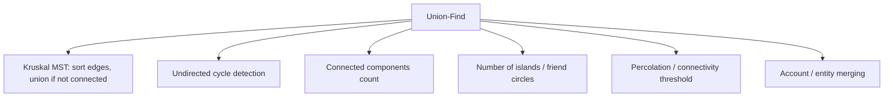

# Union-Find — Middle Level

> **Focus:** The forest invariants, why naive trees degenerate, how Union-Find composes with graph algorithms (Kruskal, cycle detection), and how to track component sizes and answer connectivity online.

---

## Table of Contents

1. [Introduction](#introduction)
2. [Deeper Concepts](#deeper-concepts)
3. [Comparison with Alternatives](#comparison-with-alternatives)
4. [Advanced Patterns](#advanced-patterns)
5. [Graph and Tree Applications](#graph-and-tree-applications)
6. [Algorithmic Integration](#algorithmic-integration)
7. [Code Examples](#code-examples)
8. [Error Handling](#error-handling)
9. [Performance Analysis](#performance-analysis)
10. [Best Practices](#best-practices)
11. [Visual Animation](#visual-animation)
12. [Summary](#summary)

---

## Introduction

At junior level Union-Find is "`Find` walks up, `Union` links roots." At middle level you start asking the *engineering* questions:

- Why exactly does a naive QuickUnion tree degenerate into an `O(n)` chain, and what bounds the height once we balance?
- When is Union-Find the right tool versus a fresh BFS/DFS, an adjacency list, or a balanced BST of components?
- How do I track the *size* of each component cheaply, so I can answer "how big is the group containing `x`?"
- How does DSU slot into Kruskal's MST and undirected cycle detection, and why is it asymptotically better there?
- What does *online* (incremental) connectivity buy me over an *offline* one-shot graph traversal?

These distinctions decide whether your MST builder runs in milliseconds or stalls, and whether "is the network still fully connected?" is a constant-time check or a full graph sweep.

This file still treats the **basic** structure — `parent[]`, naive linking — but adds **union by size** as the natural balancing idea (its formal cousin, union by rank, has its own topic `03-union-by-rank`, and path compression lives in `02-path-compression`). We add `size[]` here because it does double duty: it balances the trees *and* it answers component-size queries.

---

## Deeper Concepts

### Forest invariants

The structure maintains a forest over `parent[0..n-1]`. Two invariants must always hold:

```
(I1) Root predicate:  r is a root  iff  parent[r] == r
(I2) Acyclicity:      following parent[] from any node always reaches a root
```

`(I2)` is what `Union` must never violate. The only safe write is `parent[ra] = rb` where `ra` and `rb` are **distinct roots**. Linking a root to one of its own descendants would create a cycle and make `Find` loop forever. This is why every `Union` begins with two `Find` calls — you must operate on roots, not arbitrary nodes.

A second consequence: the representative of a set is *whichever node is currently the root*. After a union it can change. Membership is defined purely by "same root," never by a fixed label.

### Why naive trees degenerate

Consider naive QuickUnion that always links the first root under the second:

```
Union(0,1): parent[0]=1
Union(1,2): parent[1]=2
Union(2,3): parent[2]=3
...
```

Each union deepens a single chain. After `n-1` such unions you get `0→1→2→…→(n-1)`, a path of length `n-1`. Now `Find(0)` costs `O(n)`. The fix is **balancing**: never let the shorter tree become the parent.

### Union by size (and a preview of amortization)

Track `size[r]` = number of nodes in the tree rooted at `r`. On union, attach the **smaller** tree under the larger root:

```
Union(a, b):
    ra, rb = Find(a), Find(b)
    if ra == rb: return
    if size[ra] < size[rb]: swap(ra, rb)
    parent[rb] = ra          # smaller (rb) hangs under larger (ra)
    size[ra] += size[rb]
```

**Why this bounds height to `O(log n)`:** a node's depth increases by one only when its tree is the *smaller* side of a union. But each such merge at least *doubles* the size of the tree the node lives in. A tree of `n` nodes can double at most `log₂ n` times, so any node's depth is at most `log₂ n`. Hence `Find` is `O(log n)` worst case with union by size alone.

> **Forward reference — the amortization preview.** Adding **path compression** on top (flattening the `Find` path) reduces the *amortized* cost of any sequence of `m` operations to `O(m · α(n))`, where `α` is the inverse Ackermann function — at most 4 for any conceivable input. The full proof (Tarjan 1975) is developed in `professional.md` and the optimization topics. The intuition: union by size keeps trees shallow; path compression makes repeated `Find`s on the same path nearly free.

### Component sizes for free

Because `size[r]` is maintained on the root, the size of the component containing `x` is just `size[Find(x)]`. That answers "how many nodes are connected to `x`?" in the same time as a `Find`. Many problems ("largest friend circle," "size of the island containing this cell") reduce to exactly this query.

---

## Comparison with Alternatives

| Attribute | QuickFind (labels) | QuickUnion (naive forest) | QuickUnion + union by size | Adjacency list + BFS/DFS per query | Balanced BST per component |
|-----------|-------------------|---------------------------|----------------------------|-------------------------------------|----------------------------|
| `Find` / `Connected` | `O(1)` | `O(n)` worst | `O(log n)` | `O(n + m)` per query | `O(log n)` |
| `Union` / add edge | `O(n)` | `O(n)` worst | `O(log n)` | `O(1)` to store edge | `O(log n)` merge (often `O(size)`) |
| Incremental connectivity | poor (slow union) | ok | **excellent** | poor (recompute each time) | good |
| Component size query | `O(n)` scan | `O(n)` scan | `O(log n)` via `size[root]` | `O(n + m)` | `O(1)` |
| Enumerate a set's members | `O(n)` scan | `O(n)` scan | `O(n)` scan | natural | natural |
| Supports edge deletion | no | no | no | yes | depends |
| Memory | `O(n)` | `O(n)` | `O(n)` | `O(n + m)` | `O(n)` + overhead |

**Choose Union-Find when:** edges arrive incrementally, you must answer many "same component?" or "component size?" queries interleaved with merges, and you never delete edges. This is the sweet spot.

**Choose BFS/DFS when:** you have the whole graph up front and ask connectivity *once*, or you need actual paths, distances, or to *visit* members — DSU only tells you *whether* two nodes connect, not *how*.

**Choose a balanced-BST-per-component (or sorted structure) when:** you must frequently iterate a component's members in order, or you need order-statistics within a component.

---

## Advanced Patterns

### Pattern: Weighted union (union by size) with component-size queries

The most common production variant. `size[]` both balances trees and answers size queries. (Union by *rank* — tracking tree height instead of node count — is the alternative; see `03-union-by-rank`. Both bound height to `O(log n)`; size is often preferred because it answers "how big is this group?" directly.)

### Pattern: Maintaining the number of components online

Keep a `count` field. It starts at `n` and decreases on every effective union. After each edge you can report the current number of components in `O(1)`. This is the basis of problems like "after each connection, how many isolated networks remain?"

### Pattern: Online connectivity stream

```
process(op):
    if op == ("union", a, b): dsu.union(a, b)
    if op == ("query", a, b): print(dsu.connected(a, b))
```

Because each step is near-constant, you can interleave millions of unions and queries. A static graph traversal cannot do this — it would have to recompute components after every union.

### Pattern: Grouping by an equivalence relation

Any relation that is reflexive, symmetric, and transitive (an *equivalence relation*) maps cleanly to DSU: union elements known to be equivalent, then `Find` tells you the equivalence class. "Accounts with a shared email belong to the same person" and "cells with the same color that touch are one region" are both equivalence-class problems.

---

## Graph and Tree Applications



### Kruskal's MST

Sort edges by weight ascending. Walk them in order; add an edge iff its endpoints are in different components (otherwise it forms a cycle). `Union` performs the membership test and the merge together. Total cost is `O(m log m)` for the sort plus `O(m · α(n))` for the DSU operations — the sort dominates. Without DSU you would need a more expensive cycle check per edge.

### Cycle detection in an undirected graph

Process edges in any order. The first time you encounter an edge `(a, b)` with `Connected(a, b)` already true, you have found a cycle. This is `O(m · α(n))` total and uses `O(n)` space — much lighter than coloring via DFS when you only need a yes/no answer while edges stream in.

---

## Algorithmic Integration

Union-Find shines in **offline query processing**: when you can reorder operations to your advantage. Two classic techniques:

1. **Offline connectivity / "small to large" merging.** Process all union operations, then answer all connectivity queries. Sometimes queries about *past* states are answered by replaying unions up to a timestamp.

2. **Reverse-deletion trick (the one DSU workaround for deletion).** DSU cannot delete edges, but if all deletions are known in advance, process the operation stream *backwards*: a deletion becomes an insertion. You build connectivity from the final graph upward. This converts an unsupported "remove edge" stream into a supported "add edge" stream.

These are not dynamic programming in the tabular sense, but they are the algorithmic backbone of how DSU is used at scale: rearrange the problem so every mutation is a union.

---

## Code Examples

### Full implementation: union by size, `count`, component-size query, and a cycle-detection demo

#### Go

```go
package main

import "fmt"

type DSU struct {
	parent []int
	size   []int
	count  int
}

func NewDSU(n int) *DSU {
	d := &DSU{
		parent: make([]int, n),
		size:   make([]int, n),
		count:  n,
	}
	for i := 0; i < n; i++ {
		d.parent[i] = i
		d.size[i] = 1
	}
	return d
}

func (d *DSU) Find(x int) int {
	for d.parent[x] != x {
		x = d.parent[x]
	}
	return x
}

// Union by size: smaller tree hangs under the larger root.
func (d *DSU) Union(a, b int) bool {
	ra, rb := d.Find(a), d.Find(b)
	if ra == rb {
		return false
	}
	if d.size[ra] < d.size[rb] {
		ra, rb = rb, ra
	}
	d.parent[rb] = ra
	d.size[ra] += d.size[rb]
	d.count--
	return true
}

func (d *DSU) Connected(a, b int) bool { return d.Find(a) == d.Find(b) }

// SizeOf returns how many elements are in x's component.
func (d *DSU) SizeOf(x int) int { return d.size[d.Find(x)] }

// HasCycle reports whether the undirected edge list contains a cycle.
func HasCycle(n int, edges [][2]int) bool {
	d := NewDSU(n)
	for _, e := range edges {
		if !d.Union(e[0], e[1]) { // endpoints already connected
			return true
		}
	}
	return false
}

func main() {
	d := NewDSU(6)
	d.Union(0, 1)
	d.Union(1, 2)
	d.Union(3, 4)
	fmt.Println(d.Connected(0, 2)) // true
	fmt.Println(d.SizeOf(0))       // 3
	fmt.Println(d.Count())         // 3 -> {0,1,2}{3,4}{5}

	edges := [][2]int{{0, 1}, {1, 2}, {2, 0}}
	fmt.Println(HasCycle(3, edges)) // true (triangle)
}

func (d *DSU) Count() int { return d.count }
```

#### Java

```java
import java.util.*;

public class DSU {
    private final int[] parent;
    private final int[] size;
    private int count;

    public DSU(int n) {
        parent = new int[n];
        size = new int[n];
        count = n;
        for (int i = 0; i < n; i++) {
            parent[i] = i;
            size[i] = 1;
        }
    }

    public int find(int x) {
        while (parent[x] != x) {
            x = parent[x];
        }
        return x;
    }

    // Union by size: smaller tree hangs under the larger root.
    public boolean union(int a, int b) {
        int ra = find(a), rb = find(b);
        if (ra == rb) return false;
        if (size[ra] < size[rb]) { int t = ra; ra = rb; rb = t; }
        parent[rb] = ra;
        size[ra] += size[rb];
        count--;
        return true;
    }

    public boolean connected(int a, int b) { return find(a) == find(b); }

    public int sizeOf(int x) { return size[find(x)]; }

    public int count() { return count; }

    // Cycle detection on an undirected edge list.
    public static boolean hasCycle(int n, int[][] edges) {
        DSU d = new DSU(n);
        for (int[] e : edges) {
            if (!d.union(e[0], e[1])) return true; // already connected
        }
        return false;
    }

    public static void main(String[] args) {
        DSU d = new DSU(6);
        d.union(0, 1);
        d.union(1, 2);
        d.union(3, 4);
        System.out.println(d.connected(0, 2)); // true
        System.out.println(d.sizeOf(0));       // 3
        System.out.println(d.count());         // 3

        int[][] edges = {{0, 1}, {1, 2}, {2, 0}};
        System.out.println(hasCycle(3, edges)); // true
    }
}
```

#### Python

```python
class DSU:
    def __init__(self, n: int):
        self.parent = list(range(n))
        self.size = [1] * n
        self.count = n

    def find(self, x: int) -> int:
        while self.parent[x] != x:
            x = self.parent[x]
        return x

    def union(self, a: int, b: int) -> bool:
        ra, rb = self.find(a), self.find(b)
        if ra == rb:
            return False
        if self.size[ra] < self.size[rb]:   # union by size
            ra, rb = rb, ra
        self.parent[rb] = ra
        self.size[ra] += self.size[rb]
        self.count -= 1
        return True

    def connected(self, a: int, b: int) -> bool:
        return self.find(a) == self.find(b)

    def size_of(self, x: int) -> int:
        return self.size[self.find(x)]


def has_cycle(n: int, edges) -> bool:
    d = DSU(n)
    for a, b in edges:
        if not d.union(a, b):   # already connected
            return True
    return False


if __name__ == "__main__":
    d = DSU(6)
    d.union(0, 1)
    d.union(1, 2)
    d.union(3, 4)
    print(d.connected(0, 2))  # True
    print(d.size_of(0))       # 3
    print(d.count)            # 3

    print(has_cycle(3, [(0, 1), (1, 2), (2, 0)]))  # True
```

---

## Error Handling

| Scenario | What goes wrong | Correct approach |
|----------|----------------|------------------|
| Union writes to a non-root | Forest gains a cycle; `Find` may loop forever. | Only ever assign `parent[rb] = ra` with `ra`, `rb` distinct roots. |
| `size` updated on the wrong node | Size queries return garbage; balancing breaks. | Update `size` on the *surviving root* only, and add the absorbed tree's size. |
| `count` decremented on a no-op union | Component count drifts below the true value. | Decrement only when `ra != rb` (when the union is effective). |
| Out-of-range element | `IndexError` / `ArrayIndexOutOfBounds`. | Validate against `n`; remember 1-indexed inputs need `n+1` slots or a `-1` offset. |
| Querying size before any union | Returns `1` for a singleton — that is correct, not an error. | No fix needed; document that singletons have size 1. |

---

## Performance Analysis

| Variant | `Find` worst case | `Union` worst case | Notes |
|---------|-------------------|--------------------|-------|
| QuickFind (labels) | `O(1)` | `O(n)` | Union relabels the whole array. |
| Naive QuickUnion | `O(n)` | `O(n)` | Trees degenerate into chains. |
| Union by size only | `O(log n)` | `O(log n)` | Height bounded by doubling argument. |
| Union by size + path compression | `O(α(n))` amortized | `O(α(n))` amortized | The famous near-constant bound (see `professional.md`). |

A rough sense of scale for a sequence of `m` operations on `n` elements:

| `n` | Naive worst-case per op | Union by size per op | + path compression amortized |
|-----|-------------------------|----------------------|------------------------------|
| 10³ | up to ~1 000 | ~10 | ~1 (α ≤ 4) |
| 10⁶ | up to ~10⁶ | ~20 | ~1 (α ≤ 4) |
| 10⁹ | up to ~10⁹ | ~30 | ~1 (α ≤ 4) |

The jump from "linear" to "logarithmic" comes purely from balancing; the jump from "logarithmic" to "effectively constant" comes from compression. For typical contest and production inputs, the balanced + compressed DSU is so fast that it is rarely the bottleneck — sorting the edges in Kruskal usually dominates.

A quick Python micro-demonstration that union by size keeps trees shallow:

```python
import random

def max_depth(d):
    best = 0
    for x in range(len(d.parent)):
        depth, y = 0, x
        while d.parent[y] != y:
            y = d.parent[y]
            depth += 1
        best = max(best, depth)
    return best

n = 100_000
d = DSU(n)
order = list(range(n))
random.shuffle(order)
for i in range(1, n):
    d.union(order[i - 1], order[i])
print("max tree depth:", max_depth(d))  # stays around log2(n) ~ 17, never ~n
```

Without union by size, a worst-case linking order would produce a depth near `n`. With it, depth stays around `log₂ n`.

---

## Best Practices

- **Default to union by size or rank.** Never ship the naive linker; the balancing is one extra comparison.
- **Add path compression too in production** — see `02-path-compression`. Together they give the optimal amortized bound.
- **Return a boolean from `Union`.** It collapses Kruskal and cycle detection to a single line each.
- **Maintain `count` and `size[]` incrementally** rather than recomputing components or sizes by scanning.
- **Map external keys to dense integer indices first** (e.g., emails → `0..n-1`) so the structure stays a flat array.
- **Test against a BFS/DFS oracle** on random edge streams; assert the two agree on every connectivity query.

---

## Visual Animation

> See [`animation.html`](./animation.html) for an interactive view.
>
> The animation lets you:
> - Run `Union(a, b)` and watch both `Find` walks, then the link between roots
> - Run `Find(x)` and trace the path up to the representative
> - Observe the `parent[]` array update in lockstep with the forest
> - See the live component count and per-step explanation as trees merge

---

## Summary

Union-Find is the right answer to "I need to merge groups and keep asking whether two things are in the same group, as connections arrive one at a time." Its correctness rests on two forest invariants — roots point to themselves, and following parents always terminates — and its speed rests on balancing: union by size (or rank) bounds tree height to `O(log n)` by always hanging the smaller tree under the larger. Tracking `size[]` and `count` makes "how big is this component?" and "how many components remain?" both cheap. It is the engine of Kruskal's MST and undirected cycle detection, and it beats re-running BFS/DFS whenever connectivity is built incrementally. The remaining speedup — path compression to reach the near-constant inverse-Ackermann bound — is developed in the sibling topics `02-path-compression` and `03-union-by-rank`.
