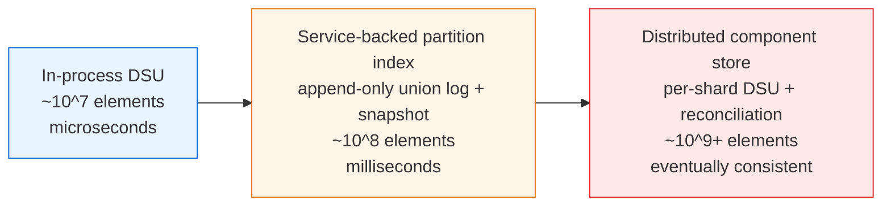
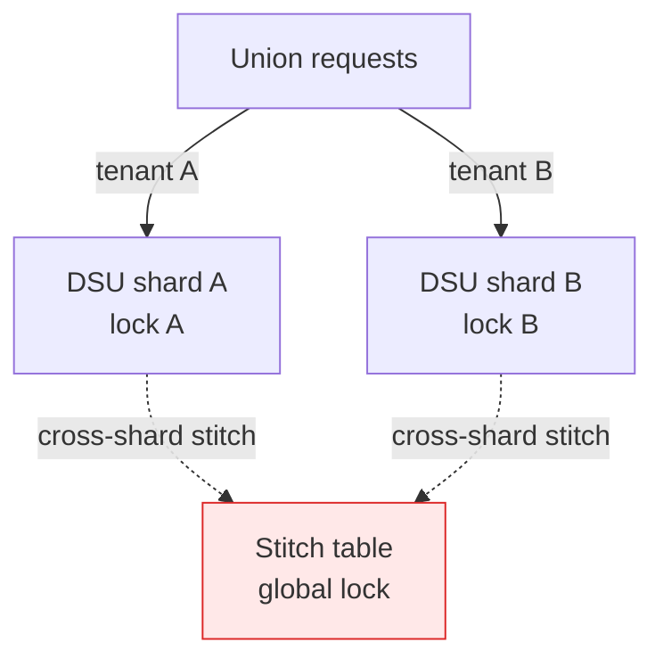

# Union-Find — Senior Level

> A Union-Find is rarely the bottleneck on a single node — but the moment you treat it as the backbone of a distributed connectivity service, every property it lacks (deletion, partitionability, durability, concurrency safety) becomes an architectural decision you must make explicitly.

## Table of Contents
1. [Introduction](#1-introduction)
2. [System Design with Union-Find](#2-system-design-with-union-find)
3. [Distributed and Persistent DSU](#3-distributed-and-persistent-dsu)
4. [Concurrent and Lock-Based Variants](#4-concurrent-and-lock-based-variants)
5. [Comparison with Alternatives at Scale](#5-comparison-with-alternatives-at-scale)
6. [Architecture Patterns](#6-architecture-patterns)
7. [Code Examples](#7-code-examples)
8. [Observability](#8-observability)
9. [Failure Modes](#9-failure-modes)
10. [Capacity Planning](#10-capacity-planning)
11. [Summary](#11-summary)

---

## 1. Introduction

At senior level the question is no longer "how does `Find` reach the root" but "where does a Union-Find sit in my system, and what breaks when the workload outgrows a single process?". A basic DSU is an in-memory, mutable, monotonic, non-durable structure. That description tells you four things up front:

- It is bounded by the RAM of one process (one `int[]` of length `n`, plus optional `size[]`).
- It is **monotonic**: sets only ever merge, never split. There is no `delete-edge`.
- It loses everything on restart unless you persist the union log or snapshot the arrays.
- It is not thread-safe; concurrent `Union` calls race on the `parent[]` writes.

The interesting senior-level decisions are therefore architectural:

1. Should this connectivity index live in-process, or as a shared service many workers query?
2. How do you survive the monotonicity limit when the real workload includes edge removals?
3. How do you make `Union`/`Find` safe under concurrency without serializing the whole structure?
4. How do you persist and recover the partition, and snapshot it for point-in-time queries?
5. How do you instrument it so an operator sees component-merge anomalies, not just latency?

This document answers those five questions in production terms. It assumes the optimized DSU (union by rank/size + path compression from `02-path-compression` and `03-union-by-rank`); the algorithmic core is settled, so we focus on systems.

---

## 2. System Design with Union-Find

### 2.1 Where a connectivity index lives



| Tier | When right | When wrong |
| --- | --- | --- |
| In-process DSU | One process owns the data; merges and queries are local; restart loss is acceptable or replayable. | Multiple services must agree on connectivity, or you need durability. |
| Service-backed partition index | One authoritative service answers "same component?" for many clients; durability via a union log. | Throughput exceeds what one node's serialized writes allow. |
| Distributed component store | Element space is enormous and sharded; eventual consistency across shards is acceptable. | You need strict, immediately-consistent global connectivity. |

The most expensive mistake is reaching for a distributed component store when an in-process DSU behind a clean interface, fed by a replayable union log, would have served for years.

### 2.2 What a DSU actually buys you

A DSU gives you amortized `O(α(n))` merge and query — effectively constant. The bottleneck is almost never the pointer walks; it is the lock contention on writes, the cost of persisting each union durably, and the network hop if the index is remote. Senior design optimizes those, not the path length.

### 2.3 The monotonicity constraint drives the design

The single most important architectural fact: **basic Union-Find cannot un-merge.** Every design decision flows from whether your real problem is monotonic:

- **Truly monotonic** (friend circles only grow, components only merge): in-process DSU is ideal.
- **Append-mostly with rare, known-in-advance deletions**: process offline in reverse (deletions become insertions), or rebuild periodically.
- **Genuinely dynamic** (frequent arbitrary edge removal): DSU is the wrong tool — use a dynamic connectivity structure (Euler-tour trees, link-cut trees, or Holm–de Lichtenberg–Thorup) and accept higher per-op cost.

---

## 3. Distributed and Persistent DSU

### 3.1 Persistence via an append-only union log

Because every state change is a `Union(a, b)`, the structure is trivially serializable as a log:

```text
union 17 42
union 42 9
union 100 5
...
```

On crash, replay the log to rebuild `parent[]` and `size[]` from scratch in `O(m · α(n))`. Periodic snapshots of the two arrays bound replay time: snapshot every `T` unions, and on recovery load the latest snapshot then replay only the tail. This is the same WAL-plus-checkpoint pattern databases use, and it is unusually clean here because the operation set is just one verb.

### 3.2 Snapshotting for point-in-time queries

If you must answer "were `a` and `b` connected *as of* time `t`?", snapshot the arrays at intervals or keep a persistent (immutable) DSU. A persistent DSU uses path copying: each `Union` returns a new version sharing structure with the old, so historical versions remain queryable. This costs `O(log n)` per node touched and more memory, but enables time-travel connectivity — useful for audit and "explain why these accounts merged" tooling.

### 3.3 Partitioned / sharded components

When the element space exceeds one node, shard by `hash(element) mod K`. The hard part: a single component can span shards. Two approaches:

- **Local-then-reconcile.** Each shard runs its own DSU over its local elements. Cross-shard unions are recorded in a small global "stitch" table mapping local roots across shards. A query resolves the local root, then follows the stitch table. This keeps most work local but makes cross-shard `Find` a two-level lookup.
- **Coordinator-mediated.** A coordinator owns all cross-shard roots; shards forward only cross-shard unions. Simpler reasoning, but the coordinator is a hot spot.

Neither gives free lunch: the fundamental tension is that connectivity is a *global* property of an inherently *partitioned* dataset.

### 3.4 Why deletion stays hard at scale

Even distributed, the monotonicity limit persists. A sharded DSU cannot remove a cross-shard edge cheaply because no shard knows the full component structure. Production systems that need this either rebuild components on a schedule (batch recompute via connected-components MapReduce/Spark GraphX) or maintain a separate dynamic-connectivity structure and use DSU only for the append-heavy fast path.

---

## 4. Concurrent and Lock-Based Variants

### 4.1 Single mutex — the default

Wrap every `Union`/`Find` in one lock. Correct, simple, and fine until write contention dominates. Because `Find` mutates `parent[]` when path compression is on, *even reads need the lock* in the naive concurrent design — a subtle trap. If you want lock-free reads, either disable compression on the read path or use a compression variant that is safe to race.

### 4.2 Read-write locks help only without compression

A `RWLock` lets many `Find`s proceed concurrently — but only if `Find` does not write. With path compression, `Find` is a writer. Options: (a) use `Find` without compression under a read lock and accept `O(log n)` reads, or (b) use a separate, occasional "compaction" pass under the write lock and keep reads non-mutating.

### 4.3 Lock-free and wait-free DSU

Concurrent union-find is a studied problem. The key results:

- **Anderson & Woll (1991)** gave a wait-free union-find. Subsequent work (e.g., **Jayanti & Tarjan, 2016/2021**) analyzed randomized concurrent union-find with path compression and showed near-optimal amortized bounds under concurrency.
- The practical lock-free approach uses **compare-and-swap (CAS)** on `parent[x]`: a union CASes a root's parent pointer, retrying on contention. Path compression is done as *path halving* (point each node to its grandparent), which is safe to race because every intermediate value is still a valid ancestor.

These are appropriate when many threads union a shared structure at high rate (parallel graph connectivity, parallel Kruskal). For most services, a single mutex with batched unions is simpler and fast enough.

### 4.4 Sharded write path

If the workload partitions naturally (e.g., unions rarely cross tenant boundaries), shard the DSU by tenant and keep a small cross-tenant stitch table. Each shard has its own lock, so writes scale with shard count. Cross-shard unions take both locks in a fixed global order to avoid deadlock.



---

## 5. Comparison with Alternatives at Scale

| Structure | Add edge | Same-component query | Delete edge | Concurrency | When |
| --- | --- | --- | --- | --- | --- |
| Union-Find (optimized) | `O(α(n))` am. | `O(α(n))` am. | **not supported** | single lock or CAS | Monotonic connectivity, MST, batch grouping. |
| Adjacency list + BFS/DFS | `O(1)` store | `O(n+m)` per query | `O(1)` | easy (read-only) | One-shot or rare connectivity; need actual paths. |
| Euler-tour / link-cut trees | `O(log n)` | `O(log n)` | `O(log n)` | hard | Fully dynamic connectivity with deletions. |
| HDT dynamic connectivity | `O(log² n)` am. | `O(log n)` | `O(log² n)` am. | hard | Edges inserted and deleted arbitrarily. |
| Spark/GraphX connected components | batch | batch | rebuild | distributed | Offline, billions of edges, recompute periodically. |
| Redis / KV "leader pointer" hack | `O(1)` write | chain follow | no | provided by store | Small scale, want durability without a service. |

Union-Find wins decisively for monotonic, append-heavy connectivity. The moment deletions are first-class and frequent, you pay `O(log n)` or worse and reach for a dynamic-connectivity structure.

---

## 6. Architecture Patterns

### 6.1 Connectivity index behind a clean interface

```
            +-------------+      +-----------+      +-----------+
 union ---> | append to   | ---> | in-mem    | ---> | query API |
            | union log   |      | DSU arrays|      | connected?|
            +-------------+      +-----------+      +-----------+
                  |
                  v
            snapshot every N unions
```

Hide the DSU behind `union(a,b)` / `connected(a,b)` / `componentSize(x)`. Persistence, sharding, and concurrency become implementation details you can change without touching callers.

### 6.2 Offline reverse-deletion pipeline

When the full operation stream (with deletions) is known, sort it, process backwards so each deletion becomes a union, answer queries in reverse, then re-order the answers. This is the canonical way to make DSU serve a workload it cannot serve online.

### 6.3 Batch grouping job (entity resolution)

A nightly job reads "these records share an identifier" facts, unions them, and emits component ids as canonical entity ids. DSU is ideal: monotonic within a run, trivially parallelizable per-partition with a reconcile step, and the output (root per element) is exactly the entity assignment.

### 6.4 Incremental connectivity with periodic rebuild

For "append-mostly with rare deletions," run an in-process DSU for the fast path and schedule a full connected-components rebuild (e.g., hourly) that incorporates the deletions. Between rebuilds, deletions are buffered and reconciled at the next rebuild.

---

## 7. Code Examples

### 7.1 Go — mutex-guarded DSU with a replayable union log

```go
package dsu

import (
	"sync"
)

// ConcurrentDSU is a thread-safe disjoint-set with union by size,
// path compression, and an append-only log for recovery.
type ConcurrentDSU struct {
	mu     sync.Mutex
	parent []int
	size   []int
	count  int
	log    [][2]int // every effective union, for replay
}

func New(n int) *ConcurrentDSU {
	p := make([]int, n)
	s := make([]int, n)
	for i := range p {
		p[i] = i
		s[i] = 1
	}
	return &ConcurrentDSU{parent: p, size: s, count: n}
}

// findLocked uses path halving (safe, no recursion).
func (d *ConcurrentDSU) findLocked(x int) int {
	for d.parent[x] != x {
		d.parent[x] = d.parent[d.parent[x]] // path halving
		x = d.parent[x]
	}
	return x
}

func (d *ConcurrentDSU) Union(a, b int) bool {
	d.mu.Lock()
	defer d.mu.Unlock()
	ra, rb := d.findLocked(a), d.findLocked(b)
	if ra == rb {
		return false
	}
	if d.size[ra] < d.size[rb] {
		ra, rb = rb, ra
	}
	d.parent[rb] = ra
	d.size[ra] += d.size[rb]
	d.count--
	d.log = append(d.log, [2]int{a, b})
	return true
}

func (d *ConcurrentDSU) Connected(a, b int) bool {
	d.mu.Lock()
	defer d.mu.Unlock()
	return d.findLocked(a) == d.findLocked(b)
}

func (d *ConcurrentDSU) Count() int {
	d.mu.Lock()
	defer d.mu.Unlock()
	return d.count
}

// Replay rebuilds state from a recovered log (e.g. after restart).
func Replay(n int, log [][2]int) *ConcurrentDSU {
	d := New(n)
	for _, e := range log {
		d.Union(e[0], e[1])
	}
	return d
}
```

Notes for review:

- One mutex covers both `Union` and `Connected` because `findLocked` mutates `parent[]` (path halving). Lock-free reads would require a non-mutating `Find`.
- The log records the *original* `(a, b)`, not the roots — replay re-derives roots deterministically.
- Path *halving* (not full compression) keeps `findLocked` iterative and CAS-friendly if you later drop the lock.

### 7.2 Java — `ReentrantReadWriteLock` with non-mutating reads

```java
import java.util.concurrent.locks.ReentrantReadWriteLock;

public final class ConcurrentDSU {
    private final int[] parent;
    private final int[] size;
    private int count;
    private final ReentrantReadWriteLock lock = new ReentrantReadWriteLock();

    public ConcurrentDSU(int n) {
        parent = new int[n];
        size = new int[n];
        count = n;
        for (int i = 0; i < n; i++) { parent[i] = i; size[i] = 1; }
    }

    // Non-mutating find: safe under the read lock, costs O(log n).
    private int findReadOnly(int x) {
        while (parent[x] != x) x = parent[x];
        return x;
    }

    public boolean connected(int a, int b) {
        lock.readLock().lock();
        try {
            return findReadOnly(a) == findReadOnly(b);
        } finally {
            lock.readLock().unlock();
        }
    }

    // Mutating find with path halving: only under the write lock.
    private int findCompress(int x) {
        while (parent[x] != x) {
            parent[x] = parent[parent[x]];
            x = parent[x];
        }
        return x;
    }

    public boolean union(int a, int b) {
        lock.writeLock().lock();
        try {
            int ra = findCompress(a), rb = findCompress(b);
            if (ra == rb) return false;
            if (size[ra] < size[rb]) { int t = ra; ra = rb; rb = t; }
            parent[rb] = ra;
            size[ra] += size[rb];
            count--;
            return true;
        } finally {
            lock.writeLock().unlock();
        }
    }

    public int count() {
        lock.readLock().lock();
        try { return count; } finally { lock.readLock().unlock(); }
    }
}
```

Note: the read path deliberately uses a *non-mutating* `findReadOnly` so multiple threads can query concurrently. Compression happens only on the write path. This trades slightly slower reads for real read parallelism — usually the right call for read-heavy connectivity services.

### 7.3 Python — DSU with snapshot/restore for point-in-time queries

```python
import copy
import threading


class SnapshotDSU:
    """Thread-safe DSU (one lock) with cheap state snapshots for recovery
    and point-in-time connectivity checks."""

    def __init__(self, n: int):
        self._lock = threading.Lock()
        self.parent = list(range(n))
        self.size = [1] * n
        self.count = n

    def _find(self, x: int) -> int:
        while self.parent[x] != x:
            self.parent[x] = self.parent[self.parent[x]]  # path halving
            x = self.parent[x]
        return x

    def union(self, a: int, b: int) -> bool:
        with self._lock:
            ra, rb = self._find(a), self._find(b)
            if ra == rb:
                return False
            if self.size[ra] < self.size[rb]:
                ra, rb = rb, ra
            self.parent[rb] = ra
            self.size[ra] += self.size[rb]
            self.count -= 1
            return True

    def connected(self, a: int, b: int) -> bool:
        with self._lock:
            return self._find(a) == self._find(b)

    def snapshot(self) -> dict:
        """O(n) deep copy of the arrays for a point-in-time view."""
        with self._lock:
            return {
                "parent": list(self.parent),
                "size": list(self.size),
                "count": self.count,
            }

    @staticmethod
    def restore(snap: dict) -> "SnapshotDSU":
        d = SnapshotDSU(len(snap["parent"]))
        d.parent = list(snap["parent"])
        d.size = list(snap["size"])
        d.count = snap["count"]
        return d
```

CPython note: the GIL serializes bytecode but not the read-modify-write of a multi-step `union`; the explicit lock is still required for correctness across threads. `snapshot()` is `O(n)` — schedule it on an interval, not per-union, or use a persistent DSU if you need many historical versions.

---

## 8. Observability

A connectivity index is invisible until components merge in ways nobody expected. Wire these from day one.

| Metric | Type | Why |
| --- | --- | --- |
| `dsu_component_count` | gauge | The headline number. A sudden drop means a mass-merge event. |
| `dsu_largest_component_size` | gauge | A "giant component" forming can indicate bad data (e.g., a shared default email merging everyone). |
| `dsu_union_total` | counter | Effective-union rate; compare to attempted unions to see redundancy. |
| `dsu_noop_union_ratio` | gauge | Fraction of unions that hit `ra == rb`. High ratio = lots of redundant edges. |
| `dsu_find_path_length` | histogram | Detects a compression regression (paths should stay short). |
| `dsu_lock_wait_seconds` | histogram | Write contention on the single mutex. |
| `dsu_replay_seconds` | gauge | Recovery time from the union log; drives snapshot cadence. |
| `dsu_elements` | gauge | Size of the universe `n`; watch memory. |

The most useful is `largest_component_size`. In entity resolution, a single bad join key can union millions of records into one component — a runaway giant component is the classic production incident, and only this metric catches it early.

---

## 9. Failure Modes

### 9.1 Runaway giant component

A faulty merge rule (everyone shares `email = "noreply@..."`) unions huge swaths into one component. Mitigations: cap or alert on `largest_component_size`; treat suspiciously high-degree join keys as non-mergeable; add a "blocklist" of keys that must never trigger a union.

### 9.2 Unwanted-merge irreversibility

Because DSU cannot un-merge, a bad union is permanent within the live structure. Mitigation: keep the union log so you can *rebuild from scratch excluding the bad edge*. This is why the append-only log is not optional in production — it is your undo mechanism.

### 9.3 Lost state on restart

In-memory only, no log, process dies — connectivity is gone. Mitigation: WAL the union log durably (fsync or replicate) before acknowledging, and snapshot periodically to bound replay.

### 9.4 Concurrency corruption

Two threads union without synchronization; interleaved writes to `parent[]` create a cycle or lose an update, and `Find` may loop forever. Mitigation: a single lock, or a CAS-based lock-free implementation with path halving. Never share an unsynchronized DSU across threads.

### 9.5 Path-compression read race

With naive concurrent compression, a reader rewriting `parent[]` races a concurrent writer. Mitigation: non-mutating reads under a read lock, or path halving (every intermediate pointer is still a valid ancestor, so the race is benign).

### 9.6 Index-space exhaustion / dense-mapping drift

External keys must map to dense `[0, n)` indices. If the mapping table and the DSU disagree on `n` (e.g., new keys appear), `Find` indexes out of range. Mitigation: grow both together atomically; treat unknown keys as new singletons.

### 9.7 Cross-shard inconsistency

In a sharded DSU, a cross-shard union recorded in only one shard's stitch table yields disagreeing answers. Mitigation: write cross-shard stitches under a global order with two-phase commit, or accept eventual consistency and reconcile on a schedule.

---

## 10. Capacity Planning

### 10.1 Single-node footprint

Working assumptions for an `int32`-indexed DSU:

- `parent[]`: 4 bytes/element. `size[]`: 4 bytes/element. ~8 bytes/element total.
- 32 GiB RAM, half available: 16 GiB.
- `16 GiB / 8 B ≈ 2 × 10⁹ elements` theoretical.

In practice, mapping tables (external key → index), the union log, and headroom cut that. Realistic single-node ceiling: **a few hundred million elements** comfortably, into the low billions if you trim to a single `int32[]` and stream the log to disk.

### 10.2 Throughput

- In-process, single mutex, optimized DSU: tens of millions of `union`/`connected` per second on one core (the op is `O(α(n))` — a handful of memory accesses).
- With durable per-union fsync: drops to the disk's sync rate (5k–30k/sec on SSD) unless you group-commit.
- Remote service (network hop): bounded by RTT, ~tens to hundreds of thousands/sec per node.

### 10.3 Sizing example

Entity-resolution batch: 200M records, ~500M "share-identifier" facts. DSU arrays: `200M × 8 B = 1.6 GiB` — fits in memory. Processing 500M unions at, say, 20M/sec ≈ 25 seconds of DSU work; the join that produces the facts dominates total runtime, not the DSU. The constraint is the upstream data scan, not the structure.

### 10.4 When to leave the single node

Move off in-process DSU when any of these is true:

- The element universe exceeds single-node memory (low billions).
- Multiple services must share one authoritative connectivity answer.
- You need durability with fast recovery (then: union log + snapshots, possibly a service).
- Deletions are frequent and first-class (then: a dynamic-connectivity structure, not DSU).

Until then, an in-process optimized DSU behind a clean interface, backed by a union log, is the right answer.

---

## 11. Summary

- The DSU itself is rarely the bottleneck; the lock, the durable fsync, the network hop, and the monotonicity constraint are.
- Start in-process with an optimized DSU behind a `union`/`connected`/`componentSize` interface, backed by an append-only union log for recovery and as your only undo mechanism.
- DSU cannot un-merge. If deletions are rare and known in advance, process offline in reverse; if they are frequent, use a dynamic-connectivity structure instead.
- Single mutex is fine until write contention dominates; then use CAS with path halving, or shard by a natural key with a cross-shard stitch table.
- Persist via union log + periodic array snapshots; enable point-in-time queries with snapshots or a persistent DSU.
- Instrument `component_count` and especially `largest_component_size` — a runaway giant component from a bad merge key is the signature production failure.
- A single node hosts hundreds of millions of elements easily; the universe size, durability needs, or deletion requirements push you off long before raw speed does.

References to study further: Tarjan (1975) for the amortized bound; Anderson & Woll (1991) and Jayanti & Tarjan (2016+) for concurrent union-find; Holm, de Lichtenberg & Thorup for fully dynamic connectivity; Spark GraphX connected-components for the batch/distributed path.
