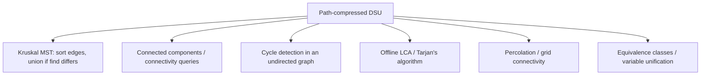

# Path Compression — Middle Level

> **Focus:** Why each compression variant is correct, how they differ in passes and constants, how compression interacts with union by rank, and where the flattened forest shows up in real graph and tree algorithms.

---

## Table of Contents

1. [Introduction](#introduction)
2. [Deeper Concepts](#deeper-concepts)
3. [Comparison with Alternatives](#comparison-with-alternatives)
4. [Advanced Patterns](#advanced-patterns)
5. [Graph and Tree Applications](#graph-and-tree-applications)
6. [Algorithmic Integration](#algorithmic-integration)
7. [Code Examples](#code-examples)
8. [Error Handling](#error-handling)
9. [Performance Analysis](#performance-analysis)
10. [Best Practices](#best-practices)
11. [Visual Animation](#visual-animation)
12. [Summary](#summary)

---

## Introduction

At junior level path compression is "flatten the tree during `find`." At middle level you ask the engineering questions:

- Why does **recursive** full compression flatten completely while **iterative** halving/splitting only halve?
- When is a **two-pass** find worth it over a **one-pass** find?
- How does compression **interact with rank** — and why does rank become a stale upper bound once you start compressing?
- When should you *skip* compression entirely?
- Why do halving and splitting, which never reach the root in one pass, still give the same asymptotics?

These choices decide whether your Kruskal MST runs in milliseconds or seconds, and whether your DSU survives a 10-million-node chain without crashing.

---

## Deeper Concepts

### Recursive (two-pass) vs iterative (one-pass)

**Full path compression** is fundamentally two-pass:

1. **Pass up:** recurse from `x` to the root `r`.
2. **Pass down:** as recursion unwinds, set `parent[v] = r` for every `v` on the path.

The result is a perfectly flat path: every visited node points directly at `r`. The cost is the recursion stack — `O(depth)` frames held simultaneously. On a near-linear tree of depth `d ≈ n`, that is `O(n)` stack frames and a real crash risk.

**Path halving** and **path splitting** are single-pass. They never hold the whole path; they re-point as they climb and discard each node immediately. Because they only look one level ahead (the grandparent), a single call does *not* reach a perfectly flat state — each node ends up pointing at its former grandparent, roughly halving the remaining depth. But over a sequence of finds the tree converges to flat, and the amortized bound is identical to full compression.

```
After ONE find(0) on chain 0->1->2->3->4 (root 4):

full      : parent = [4, 4, 4, 4, 4]   (perfectly flat)
halving   : parent = [2, 2, 4, 4, 4]   (depth ~halved)
splitting : parent = [2, 3, 4, 4, 4]   (every node -> grandparent)
```

### Why halving/splitting still hit the same asymptotics

The key insight (formalized in [`professional.md`](./professional.md)) is that the **potential** of the forest — roughly the sum of node depths — drops fast under any of the three rules. Each compression step that does real work removes a level from some node's path. Over `m` operations on `n` elements, the total work is bounded the same way whether you flatten fully in one shot or progressively. The amortized cost with union by rank is `Θ(α(n))` for all three; with arbitrary union it is `Θ(log n)`.

### Compression interacting with rank: rank becomes an *upper bound*

Union by rank stores, at each root, an integer `rank` that bounds the tree's height. When you compress, you make trees *shorter* than their rank claims — but you do **not** decrease rank (decreasing it correctly would cost too much). So after compression:

```
true_height(tree) <= rank(root)
```

Rank is now only an **upper bound**, not the exact height. This is fine and intentional: rank is used solely to decide *which root hangs under which* during union, and an upper bound is good enough to keep trees balanced. The combination still yields `O(α(n))`. By contrast, **union by size** tracks subtree element counts, which compression does not invalidate (the count of elements does not change when you re-point), so size stays exact.

### When to skip compression

Compression mutates `parent[]` on every `find`. Skip it when:

- You need a **persistent** or **rollback** DSU (compression destroys the history you need to undo). Use **union by rank/size only**, which keeps `find` read-only and height `O(log n)`.
- You do very few finds relative to unions, and the trees are already shallow because of union by rank — the extra writes may not pay off (rare, usually compression still wins).
- You are in a **concurrent** setting where writes during `find` race (see `senior.md`); some designs use splitting specifically because its writes are benign under races.

---

## Comparison with Alternatives

The three Find strategies, compared in detail:

| Attribute | Full compression | Path halving | Path splitting | Naive find (no compression) |
|-----------|------------------|--------------|----------------|------------------------------|
| Passes | two (up + down) | one | one | one |
| Recursion | yes (or explicit stack) | no | no | no |
| Writes per find | one per node on path | one per ~2 nodes | one per node on path | zero |
| Result after one call | perfectly flat path | depth halved | each node → grandparent | unchanged |
| Stack-overflow risk | **yes** on deep trees | no | no | no |
| Amortized (with rank) | O(α(n)) | O(α(n)) | O(α(n)) | O(log n)\* |
| Amortized (arbitrary union) | O(log n) | O(log n) | O(log n) | O(n) worst |
| Constant factor | low (but two passes) | lowest (fewest writes) | low | lowest per call, worst overall |
| Best for | clarity, contests | production default | production default | persistent/rollback DSU |

\* Naive find with union by rank alone is `O(log n)` because rank keeps height logarithmic.

**Choose full compression when:** you want the clearest code, depths are bounded, or you are in a contest where the chain length is small.

**Choose halving when:** you want production safety with the fewest writes. This is the most common default.

**Choose splitting when:** you want production safety and slightly more aggressive flattening per pass, or you are designing a concurrent DSU.

**Choose naive find when:** you need a read-only `find` for persistence/rollback, and you rely on union by rank to keep height `O(log n)`.

---

## Advanced Patterns

### Pattern: compression + union by rank (the canonical fast DSU)

#### Go

```go
package main

import "fmt"

type DSU struct {
	parent []int
	rank   []int
}

func NewDSU(n int) *DSU {
	p := make([]int, n)
	for i := range p {
		p[i] = i
	}
	return &DSU{parent: p, rank: make([]int, n)}
}

// Iterative path halving.
func (d *DSU) Find(x int) int {
	for d.parent[x] != x {
		d.parent[x] = d.parent[d.parent[x]]
		x = d.parent[x]
	}
	return x
}

// Union by rank. Rank is an upper bound on height after compression.
func (d *DSU) Union(a, b int) bool {
	ra, rb := d.Find(a), d.Find(b)
	if ra == rb {
		return false
	}
	if d.rank[ra] < d.rank[rb] {
		ra, rb = rb, ra
	}
	d.parent[rb] = ra
	if d.rank[ra] == d.rank[rb] {
		d.rank[ra]++
	}
	return true
}

func main() {
	d := NewDSU(6)
	d.Union(0, 1)
	d.Union(1, 2)
	d.Union(3, 4)
	fmt.Println(d.Find(0) == d.Find(2)) // true
	fmt.Println(d.Find(0) == d.Find(4)) // false
}
```

#### Java

```java
public class DSU {
    private final int[] parent, rank;

    public DSU(int n) {
        parent = new int[n];
        rank = new int[n];
        for (int i = 0; i < n; i++) parent[i] = i;
    }

    public int find(int x) {           // path halving
        while (parent[x] != x) {
            parent[x] = parent[parent[x]];
            x = parent[x];
        }
        return x;
    }

    public boolean union(int a, int b) {
        int ra = find(a), rb = find(b);
        if (ra == rb) return false;
        if (rank[ra] < rank[rb]) { int t = ra; ra = rb; rb = t; }
        parent[rb] = ra;
        if (rank[ra] == rank[rb]) rank[ra]++;
        return true;
    }
}
```

#### Python

```python
class DSU:
    def __init__(self, n):
        self.parent = list(range(n))
        self.rank = [0] * n

    def find(self, x):                 # path halving
        while self.parent[x] != x:
            self.parent[x] = self.parent[self.parent[x]]
            x = self.parent[x]
        return x

    def union(self, a, b):
        ra, rb = self.find(a), self.find(b)
        if ra == rb:
            return False
        if self.rank[ra] < self.rank[rb]:
            ra, rb = rb, ra
        self.parent[rb] = ra
        if self.rank[ra] == self.rank[rb]:
            self.rank[ra] += 1
        return True
```

### Pattern: explicit-stack full compression (no recursion, still fully flat)

If you want a perfectly flat result but cannot risk recursion, do two explicit passes:

```python
def find_full_iterative(self, x):
    # Pass 1: find root.
    root = x
    while self.parent[root] != root:
        root = self.parent[root]
    # Pass 2: re-point every node on the path to root.
    while self.parent[x] != root:
        x, self.parent[x] = self.parent[x], root
    return root
```

This is two-pass like the recursive version but uses `O(1)` extra space and never touches the call stack.

### Pattern: skip compression for a rollback DSU

```python
class RollbackDSU:
    """Union by rank only; find is read-only so unions can be undone."""
    def __init__(self, n):
        self.parent = list(range(n))
        self.rank = [0] * n
        self.history = []

    def find(self, x):                 # NO compression — read-only
        while self.parent[x] != x:
            x = self.parent[x]
        return x

    def union(self, a, b):
        ra, rb = self.find(a), self.find(b)
        if ra == rb:
            self.history.append(None)
            return False
        if self.rank[ra] < self.rank[rb]:
            ra, rb = rb, ra
        self.history.append((rb, ra, self.rank[ra] == self.rank[rb]))
        self.parent[rb] = ra
        if self.rank[ra] == self.rank[rb]:
            self.rank[ra] += 1
        return True

    def rollback(self):
        rec = self.history.pop()
        if rec is None:
            return
        rb, ra, bumped = rec
        self.parent[rb] = rb
        if bumped:
            self.rank[ra] -= 1
```

Compression is omitted *on purpose*: with it, a single `find` would rewrite many parents and the undo log would explode.

---

## Graph and Tree Applications



### Kruskal's MST — compression is what makes it fast

```python
def kruskal(n, edges):           # edges: list of (weight, u, v)
    dsu = DSU(n)
    edges.sort()
    total, used = 0, 0
    for w, u, v in edges:
        if dsu.union(u, v):      # union returns True only if u, v were separate
            total += w
            used += 1
            if used == n - 1:
                break
    return total
```

Each `union` does two compressed `find`s. With compression + rank, the whole MST loop is `O(E log E)` dominated by the edge sort, and the DSU part is effectively linear.

### Cycle detection

```python
def has_cycle(n, edges):
    dsu = DSU(n)
    for u, v in edges:
        if dsu.find(u) == dsu.find(v):
            return True          # u and v already connected -> this edge closes a cycle
        dsu.union(u, v)
    return False
```

---

## Algorithmic Integration

Path-compressed DSU is the backbone of several classic algorithms beyond MST:

- **Offline LCA (Tarjan):** process queries during a DFS; a compressed DSU answers "ancestor representative" in near-constant time. (See sibling `04-offline-lca`.)
- **Dynamic connectivity (incremental):** answer "are `u` and `v` connected?" under a stream of unions. Compression keeps queries fast.
- **Image / grid percolation:** flood-fill style component labeling where each cell unions with its neighbors.
- **Kruskal-based clustering:** stop the MST early to get `k` clusters; the DSU components *are* the clusters.

In every case the read-heavy `find` is what dominates, and compression is what keeps it cheap.

---

## Code Examples

### Benchmark all three Find variants on a worst-case chain

The clearest way to feel the difference is to build a deep tree with **arbitrary union** (no rank), then time many finds under each variant.

#### Go

```go
package main

import (
	"fmt"
	"time"
)

func buildChain(n int) []int {
	p := make([]int, n)
	for i := 0; i < n-1; i++ {
		p[i] = i + 1 // 0->1->2->...->n-1
	}
	p[n-1] = n - 1
	return p
}

func findFull(p []int, x int) int {
	if p[x] != x {
		p[x] = findFull(p, p[x])
	}
	return p[x]
}

func findHalving(p []int, x int) int {
	for p[x] != x {
		p[x] = p[p[x]]
		x = p[x]
	}
	return x
}

func findSplitting(p []int, x int) int {
	for p[x] != x {
		next := p[x]
		p[x] = p[p[x]]
		x = next
	}
	return x
}

func bench(name string, find func([]int, int) int, n int) {
	p := buildChain(n)
	start := time.Now()
	for i := 0; i < n; i++ {
		find(p, i%n) // every node queried once
	}
	fmt.Printf("%-10s n=%d  %v\n", name, n, time.Since(start))
}

func main() {
	const n = 200000
	bench("halving", findHalving, n)
	bench("splitting", findSplitting, n)
	bench("full", findFull, n) // careful: recursion depth ~ n on first find
}
```

#### Java

```java
public class FindBench {
    static int[] buildChain(int n) {
        int[] p = new int[n];
        for (int i = 0; i < n - 1; i++) p[i] = i + 1;
        p[n - 1] = n - 1;
        return p;
    }

    static int findFull(int[] p, int x) {
        if (p[x] != x) p[x] = findFull(p, p[x]);
        return p[x];
    }

    static int findHalving(int[] p, int x) {
        while (p[x] != x) { p[x] = p[p[x]]; x = p[x]; }
        return x;
    }

    static int findSplitting(int[] p, int x) {
        while (p[x] != x) { int next = p[x]; p[x] = p[p[x]]; x = next; }
        return x;
    }

    static void bench(String name, int n, java.util.function.BiFunction<int[], Integer, Integer> find) {
        int[] p = buildChain(n);
        long start = System.nanoTime();
        for (int i = 0; i < n; i++) find.apply(p, i % n);
        System.out.printf("%-10s n=%d  %.2f ms%n", name, n, (System.nanoTime() - start) / 1e6);
    }

    public static void main(String[] args) {
        int n = 200_000;
        bench("halving", n, FindBench::findHalving);
        bench("splitting", n, FindBench::findSplitting);
        // full recursion may overflow at this depth; shown for completeness.
    }
}
```

#### Python

```python
import sys
import time


def build_chain(n):
    p = list(range(1, n)) + [n - 1]   # 0->1->...->n-1, root n-1
    return p


def find_full(p, x):
    if p[x] != x:
        p[x] = find_full(p, p[x])
    return p[x]


def find_halving(p, x):
    while p[x] != x:
        p[x] = p[p[x]]
        x = p[x]
    return x


def find_splitting(p, x):
    while p[x] != x:
        nxt = p[x]
        p[x] = p[p[x]]
        x = nxt
    return x


def bench(name, find, n):
    p = build_chain(n)
    start = time.perf_counter()
    for i in range(n):
        find(p, i)
    print(f"{name:<10} n={n}  {(time.perf_counter() - start) * 1000:.1f} ms")


if __name__ == "__main__":
    sys.setrecursionlimit(1_000_000)
    n = 200_000
    bench("halving", find_halving, n)
    bench("splitting", find_splitting, n)
    # find_full would need recursion depth ~ n on the first call; risky.
```

**Observation you should see:** halving and splitting finish in nearly identical time; full compression is comparable on small `n` but crashes (or needs a raised limit) when the first `find` walks a chain of depth `n`. After the first sweep, all variants leave the forest flat, so a second sweep is uniformly fast.

---

## Error Handling

| Scenario | What goes wrong | Correct approach |
|----------|----------------|------------------|
| Recursive full compression on deep chain | Stack overflow on the first `find`. | Use iterative halving/splitting, or the explicit two-pass version. |
| Compression in a rollback DSU | Undo log explodes; rollback becomes incorrect. | Drop compression; rely on union by rank for `O(log n)` height. |
| Rank used as exact height after compression | You assume `rank == height`; it is only an upper bound. | Treat rank as an upper bound; never read it as the true height. |
| Forgetting `union` returns whether a merge happened | Kruskal counts wrong edges. | Have `union` return `true` only when two distinct roots merged. |
| Concurrent finds writing `parent[]` | Torn writes / lost compression under races. | Use atomic writes or path splitting in a CAS loop (see `senior.md`). |

---

## Performance Analysis

| Setup | `find` amortized | Notes |
|-------|------------------|-------|
| No compression, no rank | O(n) worst | Chains kill you. |
| No compression, union by rank | O(log n) | Rank bounds height. |
| Compression alone, arbitrary union | O(log n) | Flattening pays off over many finds. |
| Compression + union by rank/size | O(α(n)) | The famous near-constant bound (Tarjan 1975). |

The reason compression + rank beats either alone: rank keeps trees from getting tall *before* you query them; compression flattens whatever depth survives *as* you query. Together the potential of the forest stays tiny. Empirically, on a sequence of `m` mixed operations over `n` elements, the per-operation cost is indistinguishable from constant for any `n` you can store.

---

## Best Practices

- **Default to iterative path halving + union by rank.** It is fast, safe, and short.
- **Use path splitting** if you later move to a concurrent DSU — its writes are race-friendly.
- **Reserve naive (read-only) find** for persistent or rollback DSUs, paired with union by rank.
- **Never trust rank as exact height** once compression is on; it is an upper bound only.
- **Return a boolean from `union`** so callers (Kruskal, cycle detection) know whether a real merge happened.
- **Test against a brute-force connectivity oracle** on random operation sequences.

---

## Visual Animation

> See [`animation.html`](./animation.html) for an interactive view.
>
> The middle-level animation lets you:
> - Toggle full / halving / splitting and watch the *different* resulting `parent[]` arrays after one `find`.
> - Step through the path node by node and see exactly which pointers get rewritten.
> - Reset to a fresh deep chain and compare variants side by side.

---

## Summary

The three compression variants differ in mechanics — full compression is two-pass and recursive and flattens completely; halving and splitting are one-pass, iterative, and flatten progressively by re-pointing nodes to their grandparents — but they share the same amortized complexity. Compression interacts with union by rank by turning rank into an upper bound on height rather than the exact height, which is harmless. Combined, compression and rank give `O(α(n))` per operation, which is what makes Kruskal's MST, cycle detection, offline LCA, and dynamic connectivity fast. In production, use iterative halving with union by rank, and skip compression only when you need a persistent or rollback DSU.
